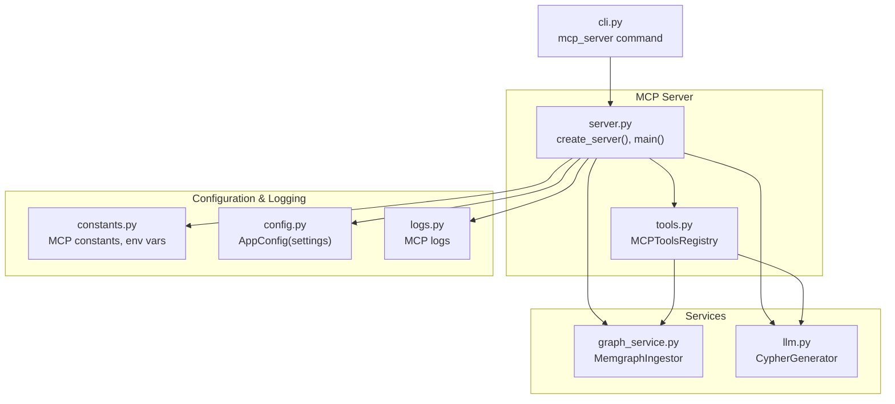
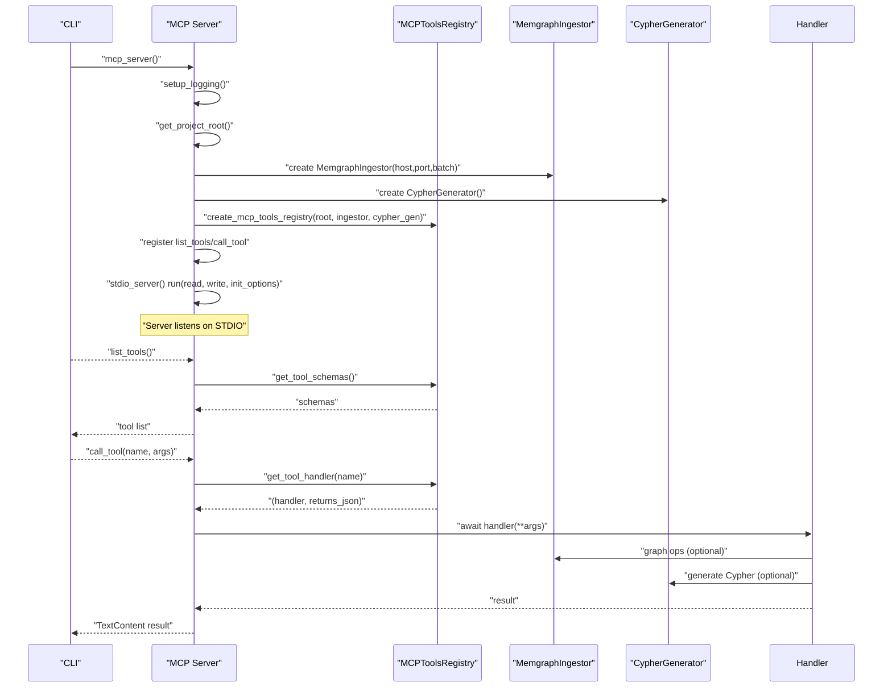
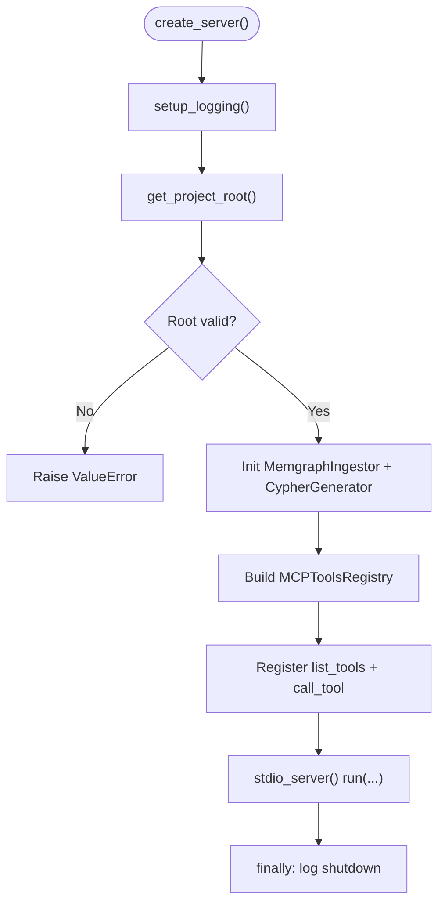
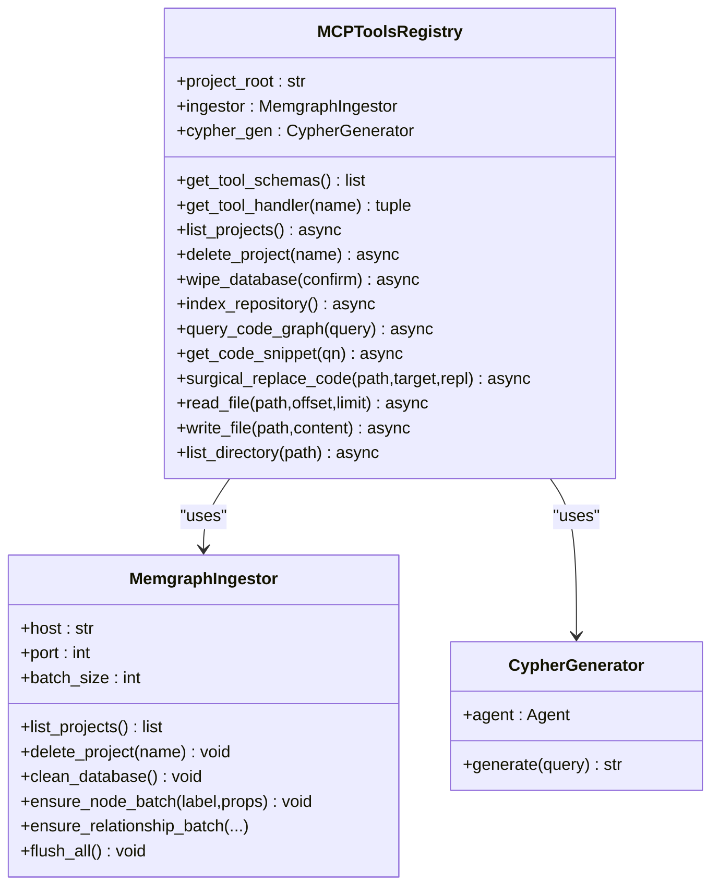
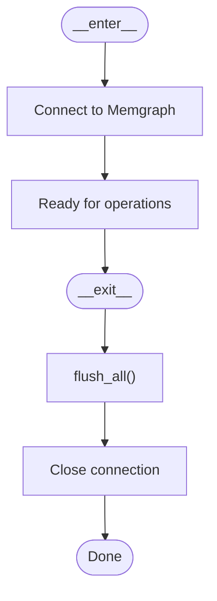
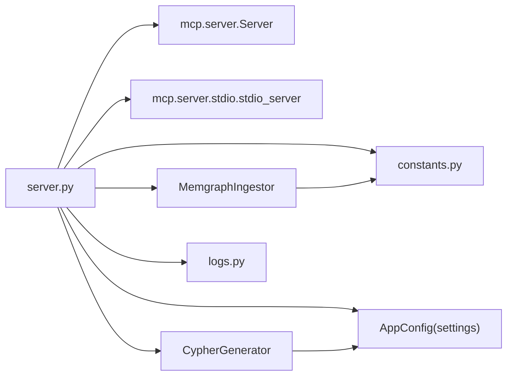

# MCP Server Implementation

<cite>
**Referenced Files in This Document**
- [server.py](file://codebase_rag/mcp/server.py)
- [tools.py](file://codebase_rag/mcp/tools.py)
- [graph_service.py](file://codebase_rag/services/graph_service.py)
- [llm.py](file://codebase_rag/services/llm.py)
- [constants.py](file://codebase_rag/constants.py)
- [config.py](file://codebase_rag/config.py)
- [logs.py](file://codebase_rag/logs.py)
- [cli.py](file://codebase_rag/cli.py)
</cite>

## Table of Contents
1. [Introduction](#introduction)
2. [Project Structure](#project-structure)
3. [Core Components](#core-components)
4. [Architecture Overview](#architecture-overview)
5. [Detailed Component Analysis](#detailed-component-analysis)
6. [Dependency Analysis](#dependency-analysis)
7. [Performance Considerations](#performance-considerations)
8. [Troubleshooting Guide](#troubleshooting-guide)
9. [Conclusion](#conclusion)

## Introduction
This document explains the MCP (Model Context Protocol) server implementation, focusing on the server architecture, initialization process, service setup, and runtime behavior. It covers logging configuration, project root resolution, service instantiation, the MemgraphIngestor and CypherGenerator setup, server lifecycle management, error handling, graceful shutdown, STDIO transport, and practical deployment guidance. The MCP server integrates with Claude Code via STDIO transport and exposes a curated set of tools for codebase interaction, including indexing, querying, file operations, and code snippet retrieval.

## Project Structure
The MCP server resides under the mcp package and orchestrates services for codebase interaction:
- Server entrypoint and STDIO transport
- Tools registry and tool execution
- Services for graph ingestion and Cypher generation
- Configuration and logging constants
- CLI integration for launching the server

**Diagram sources**
- [server.py](file://codebase_rag/mcp/server.py#L58-L165)
- [tools.py](file://codebase_rag/mcp/tools.py#L40-L457)
- [graph_service.py](file://codebase_rag/services/graph_service.py#L49-L200)
- [llm.py](file://codebase_rag/services/llm.py#L37-L93)
- [constants.py](file://codebase_rag/constants.py#L2347-L2420)
- [config.py](file://codebase_rag/config.py#L39-L234)
- [cli.py](file://codebase_rag/cli.py#L332-L350)

**Section sources**
- [server.py](file://codebase_rag/mcp/server.py#L1-L166)
- [tools.py](file://codebase_rag/mcp/tools.py#L1-L458)
- [graph_service.py](file://codebase_rag/services/graph_service.py#L1-L200)
- [llm.py](file://codebase_rag/services/llm.py#L1-L93)
- [constants.py](file://codebase_rag/constants.py#L2347-L2420)
- [config.py](file://codebase_rag/config.py#L39-L234)
- [cli.py](file://codebase_rag/cli.py#L332-L350)

## Core Components
- Server creation and STDIO transport: Initializes logging, resolves project root, constructs services, registers MCP tool endpoints, and runs the STDIO server.
- Tools registry: Provides a centralized registry of MCP tools with input schemas and handlers, delegating to specialized services.
- MemgraphIngestor: Manages connection to Memgraph, batching, and graph operations (project listing, deletion, cleanup).
- CypherGenerator: Generates Cypher queries from natural language using an LLM agent with configurable provider/model.
- Configuration and logging: Centralized constants for MCP behavior, environment variables, logging format, and structured logs.

Key responsibilities:
- Logging: Uses Loguru with a custom format and level for MCP server logs.
- Project root resolution: Supports explicit environment variables and defaults to current directory with safety checks.
- Service instantiation: Creates MemgraphIngestor and CypherGenerator with settings from AppConfig.
- Tool registration: Exposes list_tools and call_tool endpoints backed by the tools registry.
- Transport: Runs the MCP server over STDIO using the mcp package’s stdio_server.

**Section sources**
- [server.py](file://codebase_rag/mcp/server.py#L21-L165)
- [tools.py](file://codebase_rag/mcp/tools.py#L40-L457)
- [graph_service.py](file://codebase_rag/services/graph_service.py#L49-L200)
- [llm.py](file://codebase_rag/services/llm.py#L37-L93)
- [constants.py](file://codebase_rag/constants.py#L2347-L2420)
- [config.py](file://codebase_rag/config.py#L39-L234)
- [logs.py](file://codebase_rag/logs.py#L595-L613)

## Architecture Overview
The MCP server follows a layered architecture:
- Presentation layer: STDIO transport and MCP endpoints (list_tools, call_tool)
- Application layer: Tools registry and tool execution orchestration
- Service layer: MemgraphIngestor for graph operations and CypherGenerator for query synthesis
- Infrastructure layer: Configuration, logging, and environment variable handling

**Diagram sources**
- [server.py](file://codebase_rag/mcp/server.py#L58-L165)
- [tools.py](file://codebase_rag/mcp/tools.py#L443-L446)
- [graph_service.py](file://codebase_rag/services/graph_service.py#L49-L200)
- [llm.py](file://codebase_rag/services/llm.py#L37-L93)

## Detailed Component Analysis

### Server Initialization and Lifecycle
- Logging configuration: Removes default sinks and adds a stderr sink with MCP-specific level and format.
- Project root resolution: Checks TARGET_REPO_PATH, CLAUDE_PROJECT_ROOT, or PWD; validates existence and directory type; logs resolution.
- Service instantiation: Creates MemgraphIngestor with host/port/batch size from settings and CypherGenerator.
- Tool registry: Builds a registry keyed by tool names with input schemas and handlers.
- Endpoint registration: Registers list_tools returning tool schemas and call_tool executing handlers with JSON or text responses.
- STDIO transport: Starts stdio_server and runs the MCP server with initialization options.
- Lifecycle: Uses context manager for MemgraphIngestor to ensure flush and close; logs fatal errors and shutdown.

**Diagram sources**
- [server.py](file://codebase_rag/mcp/server.py#L58-L165)

**Section sources**
- [server.py](file://codebase_rag/mcp/server.py#L21-L165)
- [config.py](file://codebase_rag/config.py#L50-L54)
- [constants.py](file://codebase_rag/constants.py#L2400-L2407)
- [logs.py](file://codebase_rag/logs.py#L595-L613)

### Tools Registry and Tool Execution
- Registry composition: Holds MemgraphIngestor and CypherGenerator and composes tool instances (query, code retrieval, file reader/editor, directory lister).
- Tool metadata: Defines schemas per tool with input properties, types, and required fields.
- Handlers: Asynchronous methods implementing tool logic; some return JSON, others plain text.
- Error handling: Catches exceptions, logs errors, and wraps messages in TextContent.

**Diagram sources**
- [tools.py](file://codebase_rag/mcp/tools.py#L40-L457)
- [graph_service.py](file://codebase_rag/services/graph_service.py#L49-L200)
- [llm.py](file://codebase_rag/services/llm.py#L37-L93)

**Section sources**
- [tools.py](file://codebase_rag/mcp/tools.py#L40-L457)
- [graph_service.py](file://codebase_rag/services/graph_service.py#L49-L200)
- [llm.py](file://codebase_rag/services/llm.py#L37-L93)

### MemgraphIngestor Setup
- Connection lifecycle: Context manager connects on enter and closes on exit, flushing buffers and logging exceptions.
- Batch operations: Maintains node and relationship buffers, flushing when batch size threshold is reached.
- Graph operations: Provides methods for listing/deleting projects and cleaning the database.
- Error reporting: Logs detailed Cypher errors and parameters for diagnostics.

**Diagram sources**
- [graph_service.py](file://codebase_rag/services/graph_service.py#L67-L82)

**Section sources**
- [graph_service.py](file://codebase_rag/services/graph_service.py#L49-L200)
- [constants.py](file://codebase_rag/constants.py#L950-L952)
- [logs.py](file://codebase_rag/logs.py#L155-L194)

### CypherGenerator Setup
- Agent configuration: Creates an LLM agent with a system prompt tailored to Cypher generation, retries, and provider/model from settings.
- Query generation: Cleans and validates generated Cypher, ensuring proper formatting and MATCH keyword presence.
- Error handling: Wraps generation failures with structured exceptions and logs errors.

**Section sources**
- [llm.py](file://codebase_rag/services/llm.py#L37-L93)
- [config.py](file://codebase_rag/config.py#L39-L234)
- [constants.py](file://codebase_rag/constants.py#L954-L958)
- [logs.py](file://codebase_rag/logs.py#L195-L199)

### STDIO Transport and Server Communication
- STDIO transport: Uses mcp.server.stdio.stdio_server to establish bidirectional streams.
- Server run: Calls server.run with read/write streams and initialization options.
- Protocol: MCP endpoints list_tools and call_tool are registered on the Server instance.

**Section sources**
- [server.py](file://codebase_rag/mcp/server.py#L150-L154)

### Environment Variables and Configuration
- Target repository path: Resolved from TARGET_REPO_PATH, CLAUDE_PROJECT_ROOT, or PWD with validation.
- Memgraph settings: Host, port, and batch size from AppConfig.
- Logging: MCP-specific log level and format constants.
- CLI integration: mcp_server command delegates to the server main function.

**Section sources**
- [server.py](file://codebase_rag/mcp/server.py#L30-L55)
- [config.py](file://codebase_rag/config.py#L50-L54)
- [constants.py](file://codebase_rag/constants.py#L2361-L2366)
- [constants.py](file://codebase_rag/constants.py#L2404-L2407)
- [cli.py](file://codebase_rag/cli.py#L332-L350)

## Dependency Analysis
The server depends on:
- mcp.server.Server and mcp.server.stdio.stdio_server for transport and protocol
- MemgraphIngestor for graph operations
- CypherGenerator for query synthesis
- AppConfig/settings for configuration
- Constants for MCP names, environment variables, and logging format
- Logs for structured MCP server and tool logs

**Diagram sources**
- [server.py](file://codebase_rag/mcp/server.py#L1-L18)
- [graph_service.py](file://codebase_rag/services/graph_service.py#L1-L46)
- [llm.py](file://codebase_rag/services/llm.py#L1-L17)
- [config.py](file://codebase_rag/config.py#L39-L234)
- [constants.py](file://codebase_rag/constants.py#L2347-L2420)
- [logs.py](file://codebase_rag/logs.py#L595-L613)

**Section sources**
- [server.py](file://codebase_rag/mcp/server.py#L1-L18)
- [graph_service.py](file://codebase_rag/services/graph_service.py#L1-L46)
- [llm.py](file://codebase_rag/services/llm.py#L1-L17)
- [config.py](file://codebase_rag/config.py#L39-L234)
- [constants.py](file://codebase_rag/constants.py#L2347-L2420)
- [logs.py](file://codebase_rag/logs.py#L595-L613)

## Performance Considerations
- Batch size tuning: Adjust MEMGRAPH_BATCH_SIZE to balance throughput and memory usage for graph operations.
- Tool execution: Some tools perform file I/O or graph queries; consider timeouts and pagination for large files.
- LLM retries: Configure agent retries to handle transient LLM errors without blocking the server.
- Logging overhead: Keep MCP log level at INFO or higher in production to reduce verbosity.

[No sources needed since this section provides general guidance]

## Troubleshooting Guide
Common issues and resolutions:
- Project root not found or not a directory: Ensure TARGET_REPO_PATH or CLAUDE_PROJECT_ROOT points to a valid directory; the server raises a ValueError on invalid paths.
- Memgraph connectivity: Verify host/port and network access; the ingestor logs connection and disconnection events.
- Tool execution errors: The server catches exceptions, logs detailed errors, and returns a standardized error message.
- Fatal errors: Any unhandled exception during server run is logged as a fatal error before shutdown.

Operational tips:
- Use MCP-specific logs to trace tool invocations and errors.
- Confirm STDIO transport is established and initialization options are accepted by the client.

**Section sources**
- [server.py](file://codebase_rag/mcp/server.py#L48-L66)
- [server.py](file://codebase_rag/mcp/server.py#L155-L157)
- [logs.py](file://codebase_rag/logs.py#L595-L613)
- [logs.py](file://codebase_rag/logs.py#L155-L194)

## Conclusion
The MCP server implementation provides a robust, modular foundation for integrating codebase operations with Claude Code via STDIO. It centralizes logging, configuration, and service management, exposing a clear set of tools for indexing, querying, and editing code artifacts. Proper environment configuration, batch sizing, and error handling ensure reliable operation in diverse environments.