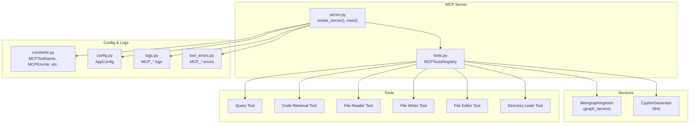
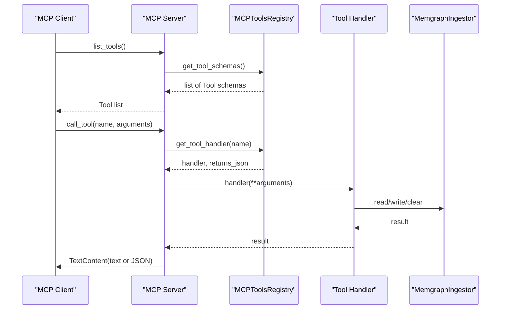
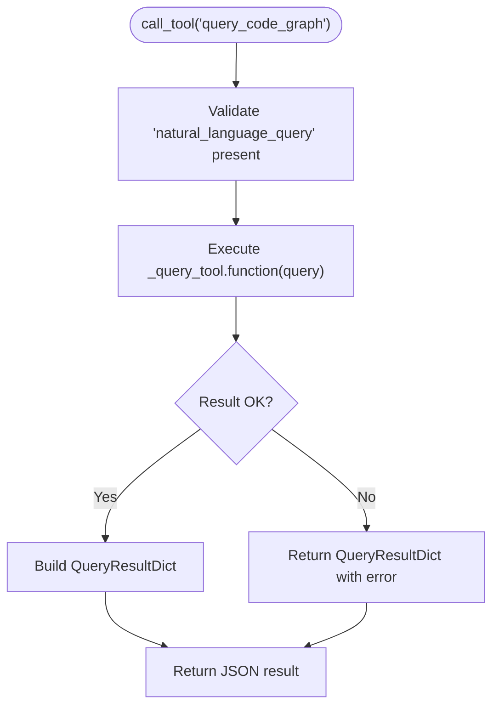
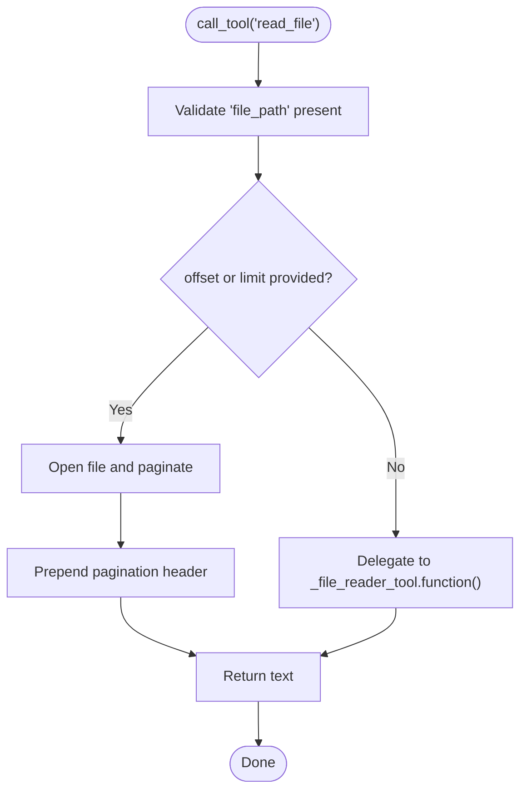
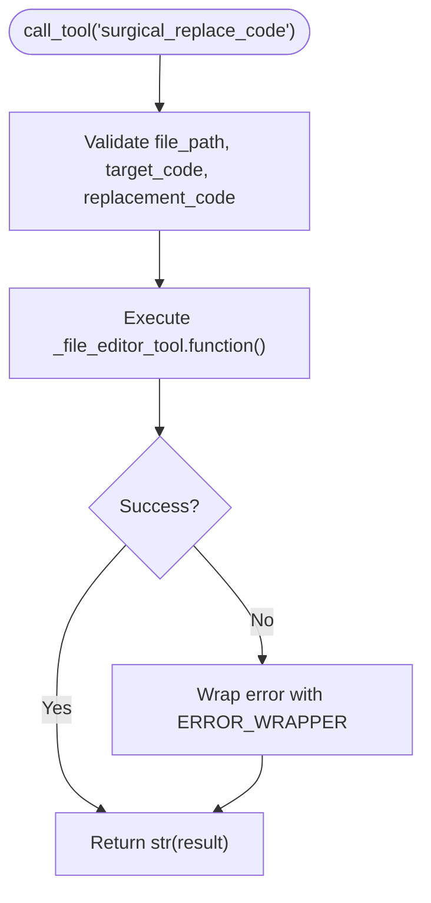
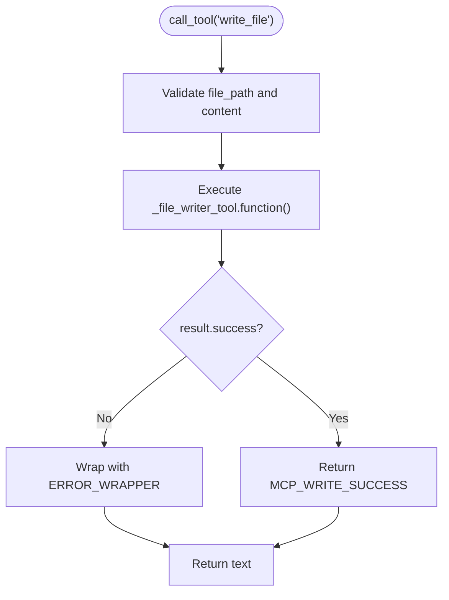
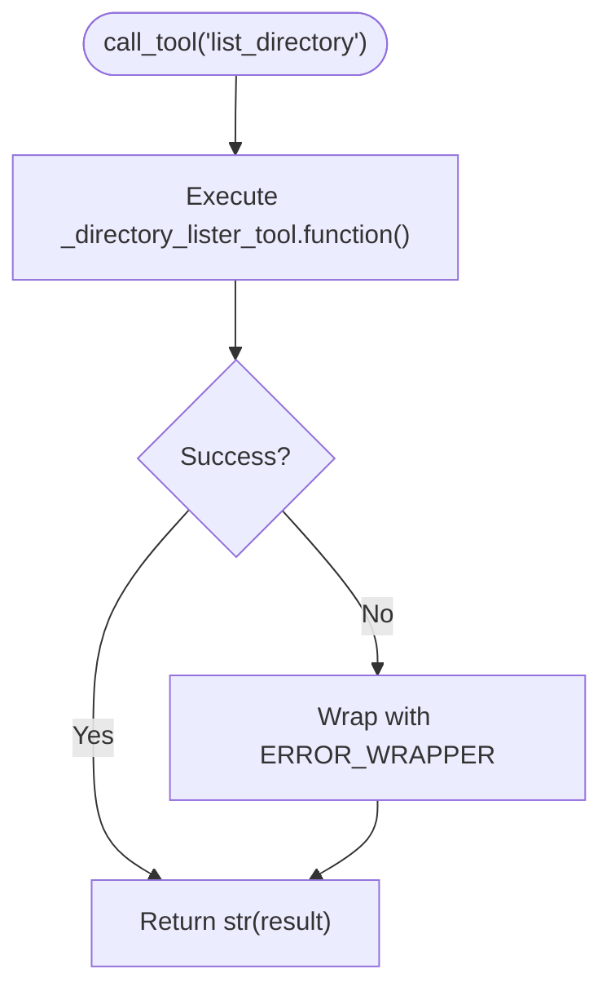
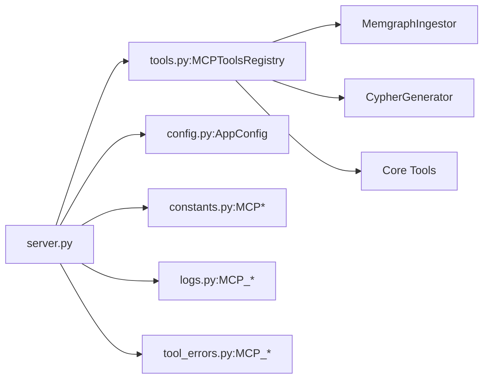

# MCP Server Integration

<cite>
**Referenced Files in This Document**
- [server.py](file://codebase_rag/mcp/server.py)
- [tools.py](file://codebase_rag/mcp/tools.py)
- [constants.py](file://codebase_rag/constants.py)
- [config.py](file://codebase_rag/config.py)
- [logs.py](file://codebase_rag/logs.py)
- [tool_errors.py](file://codebase_rag/tool_errors.py)
- [tool_descriptions.py](file://codebase_rag/tools/tool_descriptions.py)
- [test_mcp_server.py](file://codebase_rag/tests/test_mcp_server.py)
- [test_mcp_tools_integration.py](file://codebase_rag/tests/integration/test_mcp_tools_integration.py)
- [claude-code-setup.md](file://docs/claude-code-setup.md)
</cite>

## Table of Contents
1. [Introduction](#introduction)
2. [Project Structure](#project-structure)
3. [Core Components](#core-components)
4. [Architecture Overview](#architecture-overview)
5. [Detailed Component Analysis](#detailed-component-analysis)
6. [Dependency Analysis](#dependency-analysis)
7. [Performance Considerations](#performance-considerations)
8. [Troubleshooting Guide](#troubleshooting-guide)
9. [Conclusion](#conclusion)
10. [Appendices](#appendices)

## Introduction
This document explains the Graph-Code Model Context Protocol (MCP) server integration that powers seamless codebase analysis and editing within Claude Code and other MCP clients. It covers the MCP server implementation, standardized tool protocols and schemas, server configuration, environment variables, client connection procedures, and security considerations. It also documents all MCP tools, their schemas, parameter validation, response formats, and practical setup examples with Claude Code and other clients.

## Project Structure
The MCP integration is implemented under the mcp package and integrates with the broader codebase via services, tools, and configuration modules. The key files are:
- MCP server entrypoint and runtime: codebase_rag/mcp/server.py
- MCP tools registry and handlers: codebase_rag/mcp/tools.py
- Constants and enums for MCP: codebase_rag/constants.py
- Application configuration and environment variables: codebase_rag/config.py
- Logging and error messages: codebase_rag/logs.py and codebase_rag/tool_errors.py
- Tool descriptions and parameter documentation: codebase_rag/tools/tool_descriptions.py
- Tests validating server behavior and tool integration: codebase_rag/tests/test_mcp_server.py and codebase_rag/tests/integration/test_mcp_tools_integration.py
- Claude Code setup guide: docs/claude-code-setup.md

**Diagram sources**
- [server.py](file://codebase_rag/mcp/server.py#L58-L135)
- [tools.py](file://codebase_rag/mcp/tools.py#L40-L457)
- [constants.py](file://codebase_rag/constants.py#L2347-L2429)
- [config.py](file://codebase_rag/config.py#L50-L56)

**Section sources**
- [server.py](file://codebase_rag/mcp/server.py#L1-L166)
- [tools.py](file://codebase_rag/mcp/tools.py#L1-L458)
- [constants.py](file://codebase_rag/constants.py#L2347-L2429)
- [config.py](file://codebase_rag/config.py#L50-L56)

## Core Components
- MCP server runtime and initialization:
  - Creates logging, resolves project root, initializes Memgraph ingestor and Cypher generator, registers MCP tools, and runs the stdio server.
- MCP tools registry:
  - Defines all MCP tools with input schemas, required parameters, and handler functions.
  - Provides tool discovery via list_tools and execution via call_tool.
- Configuration and environment:
  - Reads Memgraph host/port/batch size and TARGET_REPO_PATH from environment or settings.
- Logging and error handling:
  - Centralized MCP logs and error wrappers for consistent messaging.

Key responsibilities:
- Server lifecycle: setup_logging, get_project_root, create_server, main.
- Tool registry: MCPToolsRegistry with handlers for list_projects, delete_project, wipe_database, index_repository, query_code_graph, get_code_snippet, surgical_replace_code, read_file, write_file, list_directory.
- Schema and validation: typed schemas and required parameters per tool.

**Section sources**
- [server.py](file://codebase_rag/mcp/server.py#L21-L166)
- [tools.py](file://codebase_rag/mcp/tools.py#L40-L457)
- [constants.py](file://codebase_rag/constants.py#L2347-L2429)
- [config.py](file://codebase_rag/config.py#L50-L56)
- [logs.py](file://codebase_rag/logs.py#L569-L613)
- [tool_errors.py](file://codebase_rag/tool_errors.py#L61-L68)

## Architecture Overview
The MCP server exposes a list of tools and executes them asynchronously. Clients discover tools via list_tools and invoke call_tool with validated arguments. Handlers return either JSON or text responses.

**Diagram sources**
- [server.py](file://codebase_rag/mcp/server.py#L96-L134)
- [tools.py](file://codebase_rag/mcp/tools.py#L433-L446)

## Detailed Component Analysis

### MCP Server Runtime
Responsibilities:
- Logging setup with MCP log level and format.
- Project root resolution with precedence: TARGET_REPO_PATH > settings.TARGET_REPO_PATH > CLAUDE_PROJECT_ROOT/PWD > current working directory.
- Service initialization: MemgraphIngestor and CypherGenerator.
- Tool registration: list_tools returns Tool metadata; call_tool dispatches to handlers.
- Stdio transport: stdio_server() with initialization options.

Behavior highlights:
- Validates project root existence and directory type.
- Wraps errors in TextContent with ERROR_WRAPPER format.
- Uses MCPToolArguments for handler invocation.

**Section sources**
- [server.py](file://codebase_rag/mcp/server.py#L21-L166)
- [test_mcp_server.py](file://codebase_rag/tests/test_mcp_server.py#L11-L173)
- [logs.py](file://codebase_rag/logs.py#L595-L613)
- [tool_errors.py](file://codebase_rag/tool_errors.py#L4-L4)

### MCP Tools Registry and Handlers
Registry composition:
- Initializes code retriever, file reader/editor/writer, directory lister, and query/code tools.
- Registers 9 tools with schemas and handlers.

Tool schemas and parameters:
- list_projects: no parameters.
- delete_project: project_name (required).
- wipe_database: confirm (required boolean).
- index_repository: no parameters.
- query_code_graph: natural_language_query (required).
- get_code_snippet: qualified_name (required).
- surgical_replace_code: file_path, target_code, replacement_code (all required).
- read_file: file_path (required), offset (optional), limit (optional).
- write_file: file_path, content (both required).
- list_directory: directory_path (optional, defaults to ".").

Response formats:
- Returns JSON for tools that produce structured data (list_projects, delete_project, query_code_graph, get_code_snippet).
- Returns plain text for tools that produce human-readable summaries (index_repository, read_file, write_file, list_directory).

Validation and error handling:
- Required parameters enforced by schemas.
- Exceptions caught and wrapped with MCP_TOOL_EXEC_ERROR and ERROR_WRAPPER.

**Section sources**
- [tools.py](file://codebase_rag/mcp/tools.py#L40-L457)
- [constants.py](file://codebase_rag/constants.py#L2347-L2429)
- [tool_descriptions.py](file://codebase_rag/tools/tool_descriptions.py#L74-L146)
- [logs.py](file://codebase_rag/logs.py#L569-L594)
- [tool_errors.py](file://codebase_rag/tool_errors.py#L61-L68)

### Tool Execution Flow (Example: query_code_graph)

**Diagram sources**
- [tools.py](file://codebase_rag/mcp/tools.py#L314-L334)
- [logs.py](file://codebase_rag/logs.py#L581-L583)

**Section sources**
- [tools.py](file://codebase_rag/mcp/tools.py#L314-L334)
- [test_mcp_tools_integration.py](file://codebase_rag/tests/integration/test_mcp_tools_integration.py#L59-L71)

### Tool Execution Flow (Example: read_file)

**Diagram sources**
- [tools.py](file://codebase_rag/mcp/tools.py#L371-L407)

**Section sources**
- [tools.py](file://codebase_rag/mcp/tools.py#L371-L407)

### Tool Execution Flow (Example: surgical_replace_code)

**Diagram sources**
- [tools.py](file://codebase_rag/mcp/tools.py#L356-L369)

**Section sources**
- [tools.py](file://codebase_rag/mcp/tools.py#L356-L369)

### Tool Execution Flow (Example: write_file)

**Diagram sources**
- [tools.py](file://codebase_rag/mcp/tools.py#L409-L420)

**Section sources**
- [tools.py](file://codebase_rag/mcp/tools.py#L409-L420)

### Tool Execution Flow (Example: list_directory)

**Diagram sources**
- [tools.py](file://codebase_rag/mcp/tools.py#L422-L431)

**Section sources**
- [tools.py](file://codebase_rag/mcp/tools.py#L422-L431)

## Dependency Analysis
- Server depends on:
  - MCP tools registry for tool schemas and handlers.
  - MemgraphIngestor and CypherGenerator for graph operations.
  - Configuration settings for Memgraph host/port and batch size.
  - Logging and error modules for consistent messaging.
- Tools depend on:
  - Core tool implementations (query, code retrieval, file reader/writer/editor, directory lister).
  - GraphUpdater for indexing repositories.

**Diagram sources**
- [server.py](file://codebase_rag/mcp/server.py#L58-L135)
- [tools.py](file://codebase_rag/mcp/tools.py#L40-L82)
- [config.py](file://codebase_rag/config.py#L50-L56)
- [constants.py](file://codebase_rag/constants.py#L2347-L2429)

**Section sources**
- [server.py](file://codebase_rag/mcp/server.py#L58-L135)
- [tools.py](file://codebase_rag/mcp/tools.py#L40-L82)
- [config.py](file://codebase_rag/config.py#L50-L56)

## Performance Considerations
- Batch writes to Memgraph:
  - MemgraphIngestor uses batch_size from settings to reduce round-trips.
- Pagination for large files:
  - read_file supports offset and limit to avoid loading entire files.
- Asynchronous tool execution:
  - Tools are awaited to prevent blocking the server.
- Logging overhead:
  - MCP log level and format are tuned for production visibility without excessive verbosity.

[No sources needed since this section provides general guidance]

## Troubleshooting Guide
Common issues and resolutions:
- Wrong repository analyzed:
  - Without TARGET_REPO_PATH, the server infers the project root from environment or current directory. Ensure TARGET_REPO_PATH points to the intended absolute path.
- Memgraph connection failed:
  - Verify Memgraph is running and reachable at the configured host/port.
- Tools not showing up:
  - Confirm the MCP server is started and the client lists installed MCP servers.
- Tool execution errors:
  - Check MCP logs for MCP_SERVER_TOOL_ERROR and MCP_ERROR_* messages.
  - Validate required parameters per tool schema.
- Security risks:
  - Operations outside project root are blocked; ensure paths are relative to project root.

**Section sources**
- [test_mcp_server.py](file://codebase_rag/tests/test_mcp_server.py#L11-L173)
- [claude-code-setup.md](file://docs/claude-code-setup.md#L120-L131)
- [logs.py](file://codebase_rag/logs.py#L595-L613)
- [tool_errors.py](file://codebase_rag/tool_errors.py#L61-L68)

## Conclusion
The MCP server integration provides a robust, standardized interface for codebase querying, file operations, and editing. With clear tool schemas, consistent logging, and secure path handling, it enables reliable integration with Claude Code and other MCP clients. Proper configuration of environment variables and Memgraph connectivity ensures smooth operation.

[No sources needed since this section summarizes without analyzing specific files]

## Appendices

### MCP Server Configuration and Environment Variables
- Environment variables:
  - TARGET_REPO_PATH: Absolute path to the target repository.
  - CLAUDE_PROJECT_ROOT and PWD: Used for inference when TARGET_REPO_PATH is unset.
- Configuration settings:
  - MEMGRAPH_HOST, MEMGRAPH_PORT, MEMGRAPH_BATCH_SIZE.
  - TARGET_REPO_PATH default is ".".

**Section sources**
- [constants.py](file://codebase_rag/constants.py#L2361-L2366)
- [config.py](file://codebase_rag/config.py#L50-L56)
- [server.py](file://codebase_rag/mcp/server.py#L30-L55)

### Client Connection Procedures
- Claude Code setup:
  - Add MCP server with stdio transport, set TARGET_REPO_PATH to the project path, configure LLM provider and credentials, and run the server via uv.
- Other MCP clients:
  - Configure stdio transport and environment variables similarly.

**Section sources**
- [claude-code-setup.md](file://docs/claude-code-setup.md#L1-L137)

### Authentication and Security Considerations
- Authentication:
  - MCP server does not implement authentication; rely on client-side configuration and environment isolation.
- Access control:
  - File operations are restricted to within the project root; attempts outside root are blocked.
  - Shell command execution is governed by allowlists and safety checks elsewhere in the codebase.

**Section sources**
- [tool_errors.py](file://codebase_rag/tool_errors.py#L52-L55)
- [logs.py](file://codebase_rag/logs.py#L319-L320)

### Tool Schemas and Parameter Validation
- Schema types:
  - object, string, integer, boolean.
- Required parameters per tool:
  - delete_project: project_name
  - wipe_database: confirm
  - query_code_graph: natural_language_query
  - get_code_snippet: qualified_name
  - surgical_replace_code: file_path, target_code, replacement_code
  - read_file: file_path (offset/limit optional)
  - write_file: file_path, content
  - list_directory: directory_path (optional)

**Section sources**
- [constants.py](file://codebase_rag/constants.py#L2368-L2398)
- [tools.py](file://codebase_rag/mcp/tools.py#L70-L249)

### Practical Examples
- Claude Code setup with uv and environment variables:
  - See quick setup and alternative explicit path examples in the Claude Code setup guide.
- Tool usage examples:
  - Index repository, natural language queries, retrieve code snippets, surgical replacements, file reads/writes, and directory listings.

**Section sources**
- [claude-code-setup.md](file://docs/claude-code-setup.md#L1-L137)
- [test_mcp_tools_integration.py](file://codebase_rag/tests/integration/test_mcp_tools_integration.py#L59-L107)

### Extending MCP Functionality and Developing Custom Clients
- Adding new tools:
  - Define tool handler in MCPToolsRegistry, register input schema and required parameters, and return appropriate result types.
- Custom clients:
  - Implement MCP client that discovers tools via list_tools and invokes call_tool with validated arguments.

**Section sources**
- [tools.py](file://codebase_rag/mcp/tools.py#L433-L446)
- [constants.py](file://codebase_rag/constants.py#L2347-L2359)