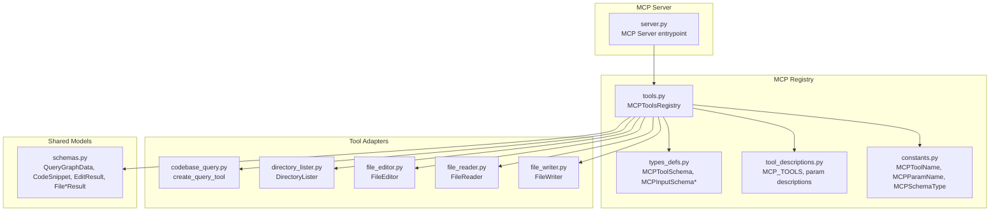
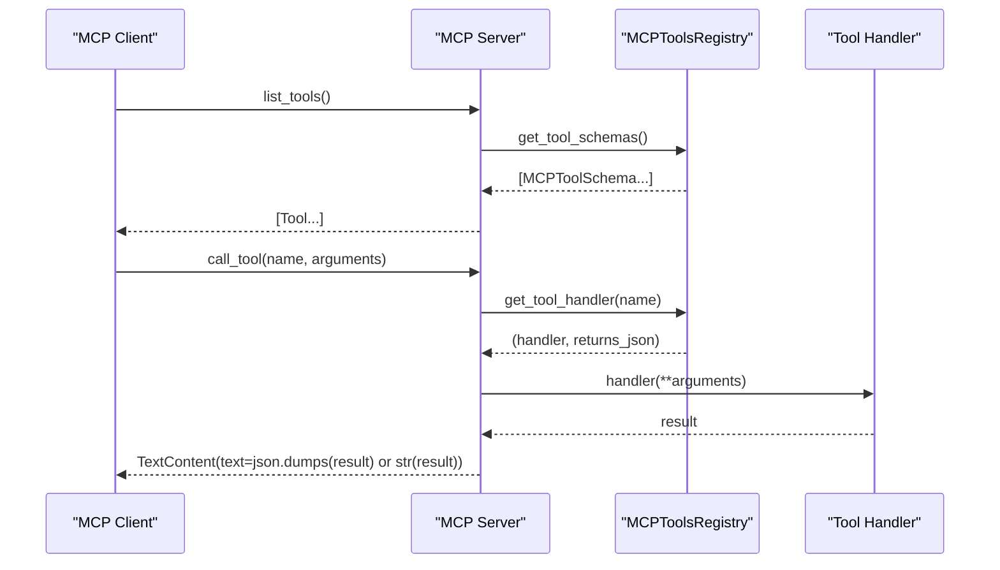
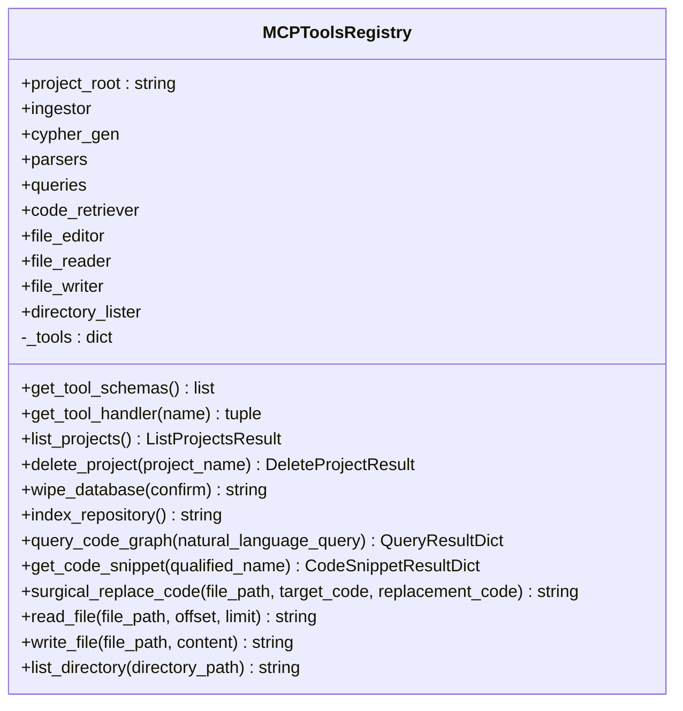
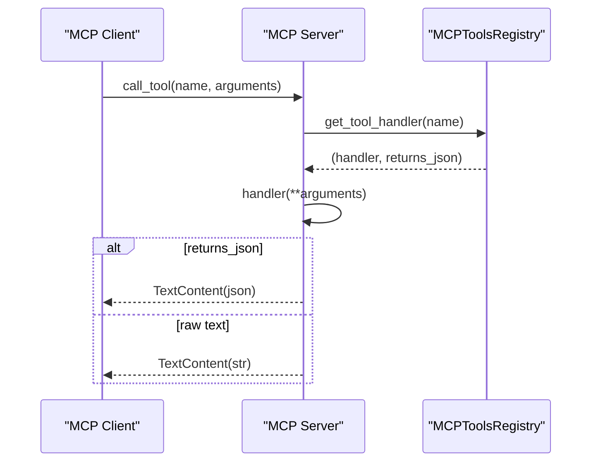
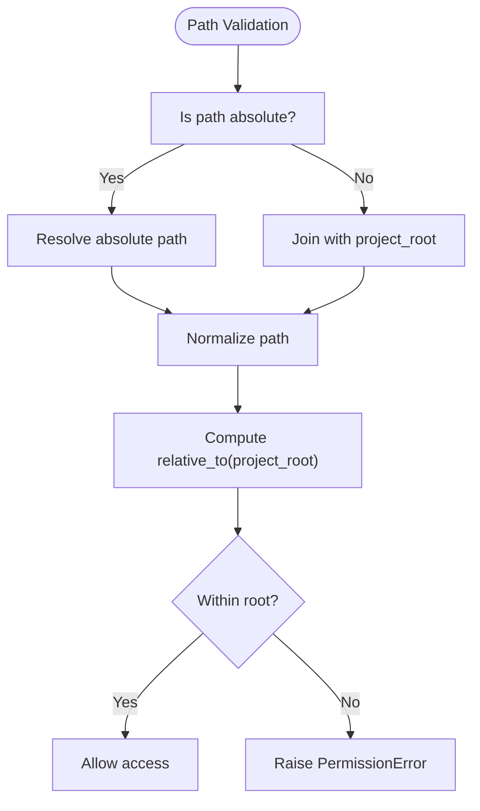
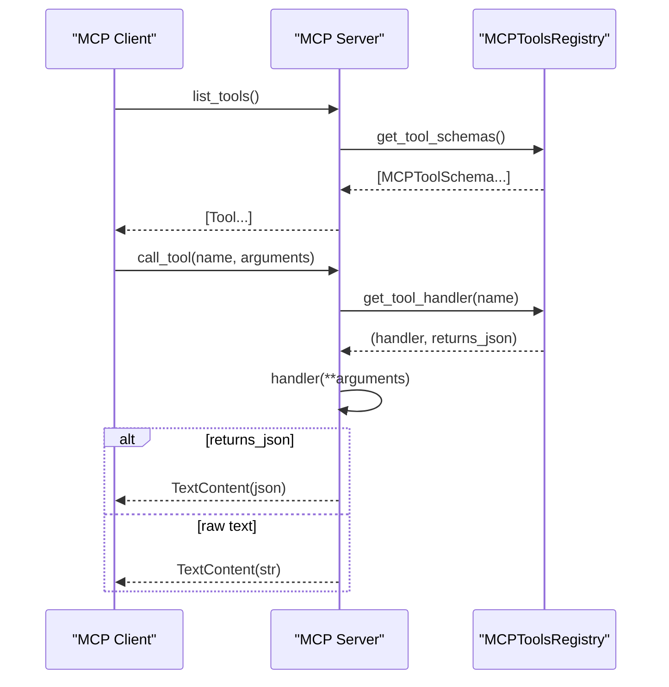
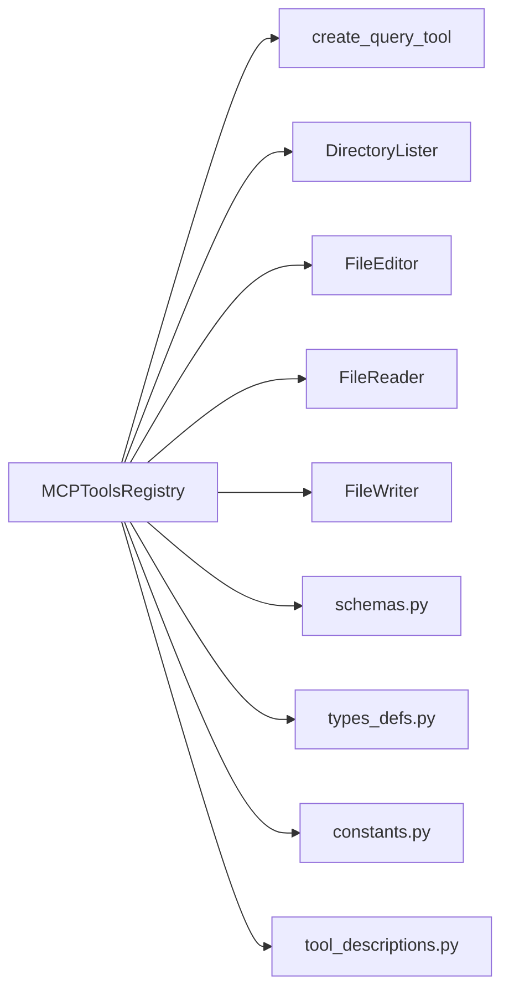

# MCP Tools Registry

<cite>
**Referenced Files in This Document**
- [tools.py](file://codebase_rag/mcp/tools.py)
- [server.py](file://codebase_rag/mcp/server.py)
- [tool_descriptions.py](file://codebase_rag/tools/tool_descriptions.py)
- [types_defs.py](file://codebase_rag/types_defs.py)
- [constants.py](file://codebase_rag/constants.py)
- [schemas.py](file://codebase_rag/schemas.py)
- [codebase_query.py](file://codebase_rag/tools/codebase_query.py)
- [directory_lister.py](file://codebase_rag/tools/directory_lister.py)
- [file_editor.py](file://codebase_rag/tools/file_editor.py)
- [file_reader.py](file://codebase_rag/tools/file_reader.py)
- [file_writer.py](file://codebase_rag/tools/file_writer.py)
</cite>

## Table of Contents
1. [Introduction](#introduction)
2. [Project Structure](#project-structure)
3. [Core Components](#core-components)
4. [Architecture Overview](#architecture-overview)
5. [Detailed Component Analysis](#detailed-component-analysis)
6. [Dependency Analysis](#dependency-analysis)
7. [Performance Considerations](#performance-considerations)
8. [Troubleshooting Guide](#troubleshooting-guide)
9. [Conclusion](#conclusion)
10. [Appendices](#appendices)

## Introduction
This document describes the MCP tools registry system that exposes a set of tools over the Model Context Protocol (MCP). It covers the tool registration mechanism, schema definitions, handler mapping, discovery, validation, parameter handling, execution pipeline, error propagation, and response formatting. It also documents all available MCP tools, their parameter schemas, validation rules, return value formats, authorization and security checks, and provides examples of invocation, error handling, and result processing. Finally, it outlines extensibility, custom tool development, and integration patterns.

## Project Structure
The MCP tools registry is implemented in the mcp package and integrates with the broader codebase via tool adapters and shared schemas.

**Diagram sources**
- [server.py](file://codebase_rag/mcp/server.py#L58-L135)
- [tools.py](file://codebase_rag/mcp/tools.py#L40-L250)
- [types_defs.py](file://codebase_rag/types_defs.py#L343-L422)
- [tool_descriptions.py](file://codebase_rag/tools/tool_descriptions.py#L135-L146)
- [constants.py](file://codebase_rag/constants.py#L2347-L2385)
- [codebase_query.py](file://codebase_rag/tools/codebase_query.py#L24-L95)
- [directory_lister.py](file://codebase_rag/tools/directory_lister.py#L15-L58)
- [file_editor.py](file://codebase_rag/tools/file_editor.py#L22-L296)
- [file_reader.py](file://codebase_rag/tools/file_reader.py#L16-L67)
- [file_writer.py](file://codebase_rag/tools/file_writer.py#L16-L52)
- [schemas.py](file://codebase_rag/schemas.py#L8-L82)

**Section sources**
- [server.py](file://codebase_rag/mcp/server.py#L58-L135)
- [tools.py](file://codebase_rag/mcp/tools.py#L40-L250)

## Core Components
- MCPToolsRegistry: central registry that defines tool metadata, input schemas, and handler bindings. It initializes tool adapters and exposes discovery and execution endpoints.
- Server: MCP server that lists tools and dispatches calls to registered handlers.
- Tool adapters: thin wrappers around domain tools (query, file operations, directory listing, code retrieval).
- Shared schemas: typed result models and input schema structures used across tools.

Key responsibilities:
- Registration: Build ToolMetadata entries with name, description, inputSchema, handler, and returns_json flag.
- Discovery: Expose list of tools with inputSchema for clients.
- Execution: Resolve handler by name, pass validated arguments, handle errors, and format responses.

**Section sources**
- [tools.py](file://codebase_rag/mcp/tools.py#L40-L250)
- [server.py](file://codebase_rag/mcp/server.py#L96-L135)
- [types_defs.py](file://codebase_rag/types_defs.py#L343-L422)

## Architecture Overview
The MCP server creates a registry, registers tools, and exposes two endpoints: list_tools and call_tool. The call_tool endpoint resolves the handler, invokes it with validated arguments, and returns either JSON or raw text depending on the tool’s returns_json flag.

**Diagram sources**
- [server.py](file://codebase_rag/mcp/server.py#L96-L135)
- [tools.py](file://codebase_rag/mcp/tools.py#L433-L446)

## Detailed Component Analysis

### MCPToolsRegistry
- Responsibilities:
  - Initialize tool adapters (query, code retrieval, file editor, file reader, file writer, directory lister).
  - Register tools with ToolMetadata containing name, description, inputSchema, handler, and returns_json.
  - Provide get_tool_schemas() and get_tool_handler(name).
- Handlers:
  - list_projects, delete_project, wipe_database, index_repository, query_code_graph, get_code_snippet, surgical_replace_code, read_file, write_file, list_directory.
- Returns:
  - Some handlers return JSON-compatible dicts; others return plain strings.

**Diagram sources**
- [tools.py](file://codebase_rag/mcp/tools.py#L40-L446)

**Section sources**
- [tools.py](file://codebase_rag/mcp/tools.py#L40-L250)
- [tools.py](file://codebase_rag/mcp/tools.py#L433-L446)

### Server and Handler Mapping
- list_tools: returns Tool entries with name, description, and inputSchema derived from registry schemas.
- call_tool: resolves handler by name, validates arguments, executes handler, and formats response as JSON (if returns_json) or plain text.

**Diagram sources**
- [server.py](file://codebase_rag/mcp/server.py#L108-L135)
- [tools.py](file://codebase_rag/mcp/tools.py#L433-L446)

**Section sources**
- [server.py](file://codebase_rag/mcp/server.py#L96-L135)

### Tool Catalog and Schemas

#### Tool Names and Descriptions
- Tool names and descriptions are defined centrally and consumed by the registry and server.

**Section sources**
- [tool_descriptions.py](file://codebase_rag/tools/tool_descriptions.py#L135-L146)

#### Input Schema Types and Constants
- MCPInputSchema, MCPInputSchemaProperty, MCPToolSchema define the schema contract.
- MCPToolName, MCPParamName, MCPSchemaType enumerate tool identifiers, parameter names, and JSON schema types.

**Section sources**
- [types_defs.py](file://codebase_rag/types_defs.py#L343-L365)
- [constants.py](file://codebase_rag/constants.py#L2347-L2385)

### Tool-Specific Details

#### list_projects
- Purpose: List all indexed projects in the knowledge graph database.
- Input: No parameters.
- Validation: No required fields.
- Handler: Calls ingestor.list_projects and wraps result in a success/error union type.
- Returns: JSON object with projects array and count; on error, returns error fields.

**Section sources**
- [tools.py](file://codebase_rag/mcp/tools.py#L251-L259)
- [types_defs.py](file://codebase_rag/types_defs.py#L386-L412)

#### delete_project
- Purpose: Delete a specific project by name.
- Input:
  - project_name: string (required).
- Validation: project_name must be present and correspond to an existing project.
- Handler: Lists projects, validates presence, deletes project, returns success or error.
- Returns: JSON success/error union type.

**Section sources**
- [tools.py](file://codebase_rag/mcp/tools.py#L260-L280)
- [types_defs.py](file://codebase_rag/types_defs.py#L400-L412)

#### wipe_database
- Purpose: Wipe the entire database after confirmation.
- Input:
  - confirm: boolean (required).
- Validation: Requires confirm=true.
- Handler: If false, returns cancellation message; otherwise cleans database and returns success or error message.
- Returns: Plain text string.

**Section sources**
- [tools.py](file://codebase_rag/mcp/tools.py#L281-L291)

#### index_repository
- Purpose: Re-index the current project into the knowledge graph.
- Input: No parameters.
- Validation: None.
- Handler: Deletes existing project data, runs GraphUpdater, returns success or error message.
- Returns: Plain text string.

**Section sources**
- [tools.py](file://codebase_rag/mcp/tools.py#L292-L313)

#### query_code_graph
- Purpose: Natural language query of the codebase knowledge graph.
- Input:
  - natural_language_query: string (required).
- Validation: Required parameter.
- Handler: Delegates to a query tool adapter; converts result to a typed dict and handles exceptions.
- Returns: JSON object with query_used, results, summary, and error fields.

**Section sources**
- [tools.py](file://codebase_rag/mcp/tools.py#L314-L335)
- [codebase_query.py](file://codebase_rag/tools/codebase_query.py#L24-L95)
- [schemas.py](file://codebase_rag/schemas.py#L8-L46)

#### get_code_snippet
- Purpose: Retrieve source code for a function/class/method by qualified name.
- Input:
  - qualified_name: string (required).
- Validation: Required parameter.
- Handler: Delegates to a code retrieval tool adapter; returns a typed dict with source_code, file_path, line range, docstring, and flags.
- Returns: JSON object with fields indicating found status and error information.

**Section sources**
- [tools.py](file://codebase_rag/mcp/tools.py#L336-L355)
- [schemas.py](file://codebase_rag/schemas.py#L37-L46)

#### surgical_replace_code
- Purpose: Surgically replace an exact code block in a file.
- Input:
  - file_path: string (required).
  - target_code: string (required).
  - replacement_code: string (required).
- Validation: All three parameters required.
- Handler: Delegates to a file editor tool adapter; returns a success/failure message.
- Returns: Plain text string.

**Section sources**
- [tools.py](file://codebase_rag/mcp/tools.py#L356-L370)
- [file_editor.py](file://codebase_rag/tools/file_editor.py#L204-L254)

#### read_file
- Purpose: Read file contents with optional pagination.
- Input:
  - file_path: string (required).
  - offset: integer (optional).
  - limit: integer (optional).
- Validation: At least file_path is required; offset and limit are optional.
- Handler: If offset/limit provided, reads a slice of lines and prepends a pagination header; otherwise delegates to file reader adapter.
- Returns: Plain text string (with pagination header when applicable).

**Section sources**
- [tools.py](file://codebase_rag/mcp/tools.py#L371-L408)
- [file_reader.py](file://codebase_rag/tools/file_reader.py#L21-L53)

#### write_file
- Purpose: Write content to a file (creates if absent).
- Input:
  - file_path: string (required).
  - content: string (required).
- Validation: Both parameters required.
- Handler: Delegates to file writer adapter; returns success message or error wrapper.
- Returns: Plain text string.

**Section sources**
- [tools.py](file://codebase_rag/mcp/tools.py#L409-L421)
- [file_writer.py](file://codebase_rag/tools/file_writer.py#L21-L40)

#### list_directory
- Purpose: List directory contents.
- Input:
  - directory_path: string (optional, defaults to current directory).
- Validation: Optional parameter with default.
- Handler: Delegates to directory lister adapter.
- Returns: Plain text string.

**Section sources**
- [tools.py](file://codebase_rag/mcp/tools.py#L422-L432)
- [directory_lister.py](file://codebase_rag/tools/directory_lister.py#L19-L34)

### Authorization, Security Checks, and Access Control
- Path validation: Several tool adapters use a decorator to validate that requested paths are within the configured project root, preventing traversal outside the allowed scope.
- Approval gating: Some tools are marked as requiring approval (e.g., file editing and creation), which implies client-side or external approval policies.
- Error propagation: Exceptions are caught and returned as structured error messages or wrapped text content.

**Diagram sources**
- [directory_lister.py](file://codebase_rag/tools/directory_lister.py#L35-L49)
- [file_editor.py](file://codebase_rag/tools/file_editor.py#L259-L277)
- [file_reader.py](file://codebase_rag/tools/file_reader.py#L25-L53)
- [file_writer.py](file://codebase_rag/tools/file_writer.py#L25-L40)

**Section sources**
- [directory_lister.py](file://codebase_rag/tools/directory_lister.py#L35-L49)
- [file_editor.py](file://codebase_rag/tools/file_editor.py#L259-L277)
- [file_reader.py](file://codebase_rag/tools/file_reader.py#L25-L53)
- [file_writer.py](file://codebase_rag/tools/file_writer.py#L25-L40)

### Tool Discovery and Execution Pipeline
- Discovery: The server calls get_tool_schemas(), which returns MCPToolSchema entries with name, description, and inputSchema.
- Execution: The server resolves handler by name, passes validated arguments, and formats the result as JSON (if returns_json) or plain text.

**Diagram sources**
- [server.py](file://codebase_rag/mcp/server.py#L96-L135)
- [tools.py](file://codebase_rag/mcp/tools.py#L433-L446)

**Section sources**
- [server.py](file://codebase_rag/mcp/server.py#L96-L135)
- [tools.py](file://codebase_rag/mcp/tools.py#L433-L446)

### Parameter Handling and Validation
- Registry-level validation: Each ToolMetadata defines required fields and property types via MCPInputSchema.
- Adapter-level validation: Path-based tools enforce safe path resolution and raise permission errors when paths escape the project root.
- Error handling: Exceptions are caught and returned as error messages; some handlers return typed dictionaries with error fields.

**Section sources**
- [tools.py](file://codebase_rag/mcp/tools.py#L70-L250)
- [directory_lister.py](file://codebase_rag/tools/directory_lister.py#L35-L49)
- [file_editor.py](file://codebase_rag/tools/file_editor.py#L259-L277)
- [file_reader.py](file://codebase_rag/tools/file_reader.py#L25-L53)
- [file_writer.py](file://codebase_rag/tools/file_writer.py#L25-L40)

### Response Formatting
- JSON tools: Results are serialized to JSON and returned as a single TextContent.
- Raw-text tools: Results are converted to string and returned as a single TextContent.

**Section sources**
- [server.py](file://codebase_rag/mcp/server.py#L123-L128)

## Dependency Analysis
The registry depends on:
- Tool adapters for query, file operations, and directory listing.
- Shared schemas for typed results and input schemas.
- Constants and descriptions for tool names and parameter metadata.

**Diagram sources**
- [tools.py](file://codebase_rag/mcp/tools.py#L40-L69)
- [schemas.py](file://codebase_rag/schemas.py#L8-L82)
- [types_defs.py](file://codebase_rag/types_defs.py#L343-L422)
- [constants.py](file://codebase_rag/constants.py#L2347-L2385)
- [tool_descriptions.py](file://codebase_rag/tools/tool_descriptions.py#L135-L146)

**Section sources**
- [tools.py](file://codebase_rag/mcp/tools.py#L40-L69)

## Performance Considerations
- JSON serialization overhead: Tools returning JSON incur serialization cost; consider batching or minimizing payload sizes where feasible.
- File operations: read_file with offset/limit performs streaming reads; ensure appropriate limits to avoid large payloads.
- Query tool: Results are rendered to a console table; consider limiting result counts for large queries.
- Path validation: Enforcing safe paths adds minimal overhead but prevents expensive or unsafe operations.

## Troubleshooting Guide
Common issues and resolutions:
- Unknown tool name: The server logs an error and returns an error TextContent.
- Path outside project root: Directory/file tool adapters raise permission errors; ensure paths are relative to project root.
- Missing required parameters: Registry enforces required fields; ensure all required parameters are provided.
- Tool execution errors: Handlers catch exceptions and return error messages; inspect logs for stack traces.

Operational tips:
- Verify project root configuration and environment variables.
- Confirm database connectivity for query and indexing tools.
- Review logs for detailed error messages and stack traces.

**Section sources**
- [server.py](file://codebase_rag/mcp/server.py#L112-L135)
- [directory_lister.py](file://codebase_rag/tools/directory_lister.py#L42-L49)
- [file_reader.py](file://codebase_rag/tools/file_reader.py#L28-L52)
- [file_writer.py](file://codebase_rag/tools/file_writer.py#L30-L40)

## Conclusion
The MCP tools registry provides a robust, extensible framework for exposing codebase operations over MCP. It centralizes tool registration, enforces schema-driven validation, and ensures secure path handling. The server cleanly maps discovery and execution requests to typed handlers, returning either JSON or plain text as appropriate. With clear error propagation and consistent response formatting, the system supports reliable integration and future extensibility.

## Appendices

### Tool Invocation Examples
- list_projects: Call with no arguments; returns a JSON object with projects and count.
- delete_project: Call with project_name; returns success or error JSON.
- wipe_database: Call with confirm=true; returns a plain text message.
- index_repository: Call with no arguments; returns a plain text message.
- query_code_graph: Call with natural_language_query; returns a JSON object with results and summary.
- get_code_snippet: Call with qualified_name; returns a JSON object with source code and metadata.
- surgical_replace_code: Call with file_path, target_code, replacement_code; returns a plain text message.
- read_file: Call with file_path and optional offset/limit; returns a plain text message (with pagination header when applicable).
- write_file: Call with file_path and content; returns a plain text message.
- list_directory: Call with optional directory_path; returns a plain text message.

### Extensibility and Custom Tool Development
- Add a new tool adapter following the pattern of existing adapters (FileReader, FileEditor, DirectoryLister).
- Define tool metadata in MCPToolsRegistry with inputSchema and handler.
- Integrate the adapter into the registry initialization and expose it via get_tool_schemas().
- Respect path validation and approval requirements for file operations.
- Use shared schemas for consistent result typing and JSON responses.

[No sources needed since this section provides general guidance]