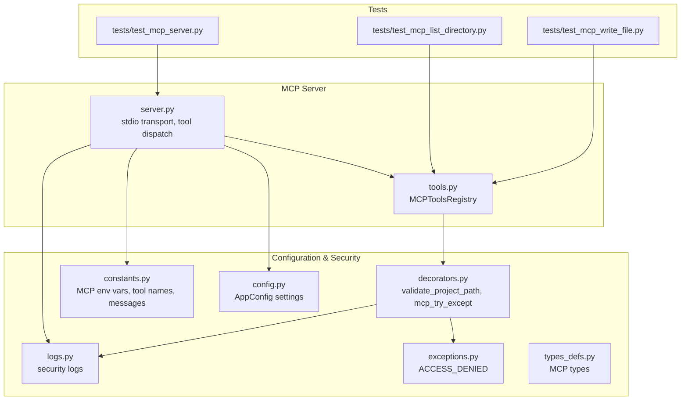
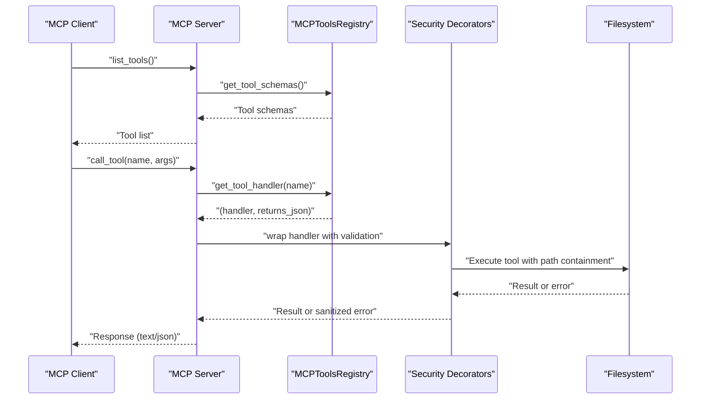
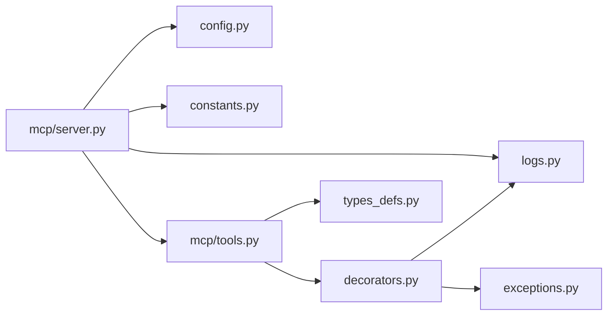

# Security and Authentication

<cite>
**Referenced Files in This Document**
- [mcp/server.py](file://codebase_rag/mcp/server.py)
- [mcp/tools.py](file://codebase_rag/mcp/tools.py)
- [config.py](file://codebase_rag/config.py)
- [constants.py](file://codebase_rag/constants.py)
- [exceptions.py](file://codebase_rag/exceptions.py)
- [logs.py](file://codebase_rag/logs.py)
- [decorators.py](file://codebase_rag/decorators.py)
- [types_defs.py](file://codebase_rag/types_defs.py)
- [tests/test_mcp_server.py](file://codebase_rag/tests/test_mcp_server.py)
- [tests/test_mcp_list_directory.py](file://codebase_rag/tests/test_mcp_list_directory.py)
- [tests/test_mcp_write_file.py](file://codebase_rag/tests/test_mcp_write_file.py)
</cite>

## Table of Contents
1. [Introduction](#introduction)
2. [Project Structure](#project-structure)
3. [Core Components](#core-components)
4. [Architecture Overview](#architecture-overview)
5. [Detailed Component Analysis](#detailed-component-analysis)
6. [Dependency Analysis](#dependency-analysis)
7. [Performance Considerations](#performance-considerations)
8. [Troubleshooting Guide](#troubleshooting-guide)
9. [Conclusion](#conclusion)
10. [Appendices](#appendices)

## Introduction
This document provides comprehensive security and authentication documentation for the MCP server. It explains the security model, access control patterns, and permission management for MCP operations. It covers authentication procedures, authorization checks, and secure tool execution. It also documents error handling and security response formatting for unauthorized operations, environment variable security, sensitive data handling, secure configuration management, network security considerations, transport encryption, and secure communication protocols. Finally, it includes best practices for securing MCP deployments, access control policies, audit logging, common security vulnerabilities, mitigation strategies, and compliance requirements.

## Project Structure
The MCP server is implemented as a thin wrapper around a tool registry and integrates with configuration and logging systems. The server exposes MCP endpoints via stdio transport and delegates operations to tools registered in the MCP tools registry. Security controls are enforced at the tool execution boundary and path validation layers.

**Diagram sources**
- [mcp/server.py](file://codebase_rag/mcp/server.py#L138-L166)
- [mcp/tools.py](file://codebase_rag/mcp/tools.py#L40-L458)
- [config.py](file://codebase_rag/config.py#L39-L234)
- [constants.py](file://codebase_rag/constants.py#L2347-L2430)
- [decorators.py](file://codebase_rag/decorators.py#L55-L87)
- [exceptions.py](file://codebase_rag/exceptions.py#L52-L54)
- [logs.py](file://codebase_rag/logs.py#L595-L613)
- [types_defs.py](file://codebase_rag/types_defs.py#L343-L421)
- [tests/test_mcp_server.py](file://codebase_rag/tests/test_mcp_server.py#L1-L40)
- [tests/test_mcp_list_directory.py](file://codebase_rag/tests/test_mcp_list_directory.py#L148-L185)
- [tests/test_mcp_write_file.py](file://codebase_rag/tests/test_mcp_write_file.py#L150-L183)

**Section sources**
- [mcp/server.py](file://codebase_rag/mcp/server.py#L1-L166)
- [mcp/tools.py](file://codebase_rag/mcp/tools.py#L1-L458)
- [config.py](file://codebase_rag/config.py#L1-L274)
- [constants.py](file://codebase_rag/constants.py#L2347-L2430)
- [decorators.py](file://codebase_rag/decorators.py#L1-L161)
- [exceptions.py](file://codebase_rag/exceptions.py#L1-L60)
- [logs.py](file://codebase_rag/logs.py#L595-L613)
- [types_defs.py](file://codebase_rag/types_defs.py#L343-L421)

## Core Components
- MCP server: Initializes logging, resolves project root, constructs services, registers MCP endpoints, and runs stdio transport.
- MCP tools registry: Defines MCP tool schemas, maps tool names to handlers, and executes tool logic with validation and error handling.
- Configuration: Loads environment variables and .env files, defines defaults, and exposes settings for services.
- Security decorators: Enforce path containment within the project root and wrap tool execution with safe error handling.
- Exceptions and logs: Centralized error messages and security-related log entries.

Key security-relevant elements:
- Project root resolution with environment variable precedence and validation.
- Path containment enforcement for file operations.
- Standardized error responses for unauthorized and invalid operations.
- Logging of security events and tool execution outcomes.

**Section sources**
- [mcp/server.py](file://codebase_rag/mcp/server.py#L21-L136)
- [mcp/tools.py](file://codebase_rag/mcp/tools.py#L40-L458)
- [config.py](file://codebase_rag/config.py#L39-L234)
- [decorators.py](file://codebase_rag/decorators.py#L55-L87)
- [exceptions.py](file://codebase_rag/exceptions.py#L52-L54)
- [logs.py](file://codebase_rag/logs.py#L595-L613)

## Architecture Overview
The MCP server architecture enforces a strict boundary between client requests and filesystem operations. The server validates inputs, resolves the project root, and dispatches to tools that operate within the project root. All file operations are validated against the project root to prevent path traversal.

**Diagram sources**
- [mcp/server.py](file://codebase_rag/mcp/server.py#L96-L135)
- [mcp/tools.py](file://codebase_rag/mcp/tools.py#L443-L446)
- [decorators.py](file://codebase_rag/decorators.py#L55-L87)
- [logs.py](file://codebase_rag/logs.py#L595-L613)

## Detailed Component Analysis

### MCP Server Security Model
- Transport: stdio transport is used for MCP communication. There is no TLS termination or authentication handshake in the server; security relies on environment-controlled project root and path validation.
- Project root resolution: The server resolves the project root from environment variables or settings, with validation to ensure it exists and is a directory.
- Tool dispatch: Tools are looked up by name and invoked with validated arguments. Unknown tools return a standardized error response.

Security implications:
- Without explicit authentication, any process with access to the stdio channel can invoke MCP tools. Deployments should restrict process access and use OS-level controls.
- Path containment prevents accidental or malicious filesystem access outside the project root.

**Section sources**
- [mcp/server.py](file://codebase_rag/mcp/server.py#L30-L55)
- [mcp/server.py](file://codebase_rag/mcp/server.py#L96-L135)
- [constants.py](file://codebase_rag/constants.py#L2361-L2366)
- [logs.py](file://codebase_rag/logs.py#L595-L613)

### MCP Tools Registry and Authorization
- Tool registration: Tools are registered with names, descriptions, and JSON schemas. Handlers are mapped per tool.
- Execution: Handlers are invoked with validated arguments. Some tools return JSON, others return plain text.
- Error handling: Exceptions are caught and wrapped in standardized error responses.

Authorization model:
- No explicit authorization checks are present in the registry. Access control is enforced by path validation and project root containment.

**Section sources**
- [mcp/tools.py](file://codebase_rag/mcp/tools.py#L40-L250)
- [mcp/tools.py](file://codebase_rag/mcp/tools.py#L251-L458)
- [types_defs.py](file://codebase_rag/types_defs.py#L343-L421)

### Path Containment and File Operations
- Path validation: A decorator ensures that all file-related operations remain within the project root. It resolves the requested path against the project root and verifies containment.
- Error responses: When a path is outside the project root, a standardized error message is returned.

Security controls:
- Relative path traversal attempts are blocked.
- Absolute paths outside the project root are rejected.
- Tests demonstrate prevention of directory traversal and write-outside-root scenarios.

**Section sources**
- [decorators.py](file://codebase_rag/decorators.py#L55-L87)
- [exceptions.py](file://codebase_rag/exceptions.py#L52-L54)
- [tests/test_mcp_list_directory.py](file://codebase_rag/tests/test_mcp_list_directory.py#L171-L177)
- [tests/test_mcp_write_file.py](file://codebase_rag/tests/test_mcp_write_file.py#L161-L172)

### Error Handling and Security Response Formatting
- Standardized error wrapper: Errors are wrapped with a consistent message format for MCP responses.
- Tool execution errors: Errors during tool execution are captured and returned as text content with a standardized message.
- Unknown tool handling: Requests for unknown tools receive a standardized error response.

Logging:
- Security-relevant events are logged (e.g., project root resolution, tool execution, errors).

**Section sources**
- [mcp/server.py](file://codebase_rag/mcp/server.py#L88-L134)
- [tool_errors.py](file://codebase_rag/tool_errors.py#L3-L4)
- [logs.py](file://codebase_rag/logs.py#L595-L613)

### Environment Variables and Secure Configuration Management
- Configuration loading: Settings are loaded from environment variables and .env files with case-insensitive parsing.
- MCP-specific environment variables: The server reads project root from environment variables with fallback to settings.
- Sensitive data handling: API keys and endpoints are part of the configuration; ensure they are stored securely and not logged.

Recommendations:
- Store secrets in environment variables or secret managers, not in source code or logs.
- Restrict file permissions on .env files.
- Avoid printing configuration values to logs.

**Section sources**
- [config.py](file://codebase_rag/config.py#L17-L17)
- [config.py](file://codebase_rag/config.py#L39-L234)
- [mcp/server.py](file://codebase_rag/mcp/server.py#L30-L55)
- [constants.py](file://codebase_rag/constants.py#L2361-L2366)

### Network Security Considerations and Transport Encryption
- Transport: The server uses stdio transport. There is no built-in TLS or authentication handshake.
- Mitigation: Deploy behind restricted environments (e.g., sandboxed containers, chroot, or VMs) with minimal exposure. Use OS-level controls to limit who can attach to the stdio stream.

**Section sources**
- [mcp/server.py](file://codebase_rag/mcp/server.py#L150-L155)

### Audit Logging and Compliance
- Logging: Extensive logging of MCP operations, errors, and security events is implemented.
- Compliance: Logs can support audit trails for security reviews. Ensure logs are retained according to policy and are tamper-evident where required.

**Section sources**
- [logs.py](file://codebase_rag/logs.py#L595-L613)

## Dependency Analysis
The MCP server depends on configuration, constants, decorators, and logging modules. The tools registry depends on decorators for path validation and on services for graph operations.

**Diagram sources**
- [mcp/server.py](file://codebase_rag/mcp/server.py#L1-L19)
- [mcp/tools.py](file://codebase_rag/mcp/tools.py#L1-L37)
- [decorators.py](file://codebase_rag/decorators.py#L1-L16)
- [exceptions.py](file://codebase_rag/exceptions.py#L1-L60)
- [types_defs.py](file://codebase_rag/types_defs.py#L1-L555)

**Section sources**
- [mcp/server.py](file://codebase_rag/mcp/server.py#L1-L19)
- [mcp/tools.py](file://codebase_rag/mcp/tools.py#L1-L37)
- [decorators.py](file://codebase_rag/decorators.py#L1-L16)
- [exceptions.py](file://codebase_rag/exceptions.py#L1-L60)
- [types_defs.py](file://codebase_rag/types_defs.py#L1-L555)

## Performance Considerations
- Path validation adds minimal overhead by resolving and comparing paths relative to the project root.
- Logging is configured at INFO level and should not significantly impact performance under normal loads.
- Tool execution errors are handled asynchronously; ensure long-running tools implement timeouts if applicable.

[No sources needed since this section provides general guidance]

## Troubleshooting Guide
Common issues and resolutions:
- Project root not found or not a directory: Verify environment variables and settings. The server raises a configuration error if the path is invalid.
- Unknown tool name: Confirm tool name matches registered tools.
- Path outside project root: Adjust path to be within the project root or fix environment configuration.
- Tool execution errors: Review logs for detailed error messages and stack traces.

**Section sources**
- [mcp/server.py](file://codebase_rag/mcp/server.py#L61-L66)
- [mcp/server.py](file://codebase_rag/mcp/server.py#L114-L117)
- [decorators.py](file://codebase_rag/decorators.py#L76-L80)
- [logs.py](file://codebase_rag/logs.py#L595-L613)

## Conclusion
The MCP server implements a pragmatic security model centered on path containment and environment-driven configuration. While there is no built-in authentication or transport encryption, the design prevents unauthorized filesystem access and provides robust error handling and logging. For production deployments, combine OS-level controls, restricted process access, and secure configuration management to achieve defense-in-depth.

[No sources needed since this section summarizes without analyzing specific files]

## Appendices

### Best Practices for Securing MCP Deployments
- Limit process access to the stdio channel using OS-level controls.
- Run the server in a restricted environment (container, VM, chroot) with minimal privileges.
- Store secrets in environment variables or secret managers; avoid logging sensitive values.
- Monitor and retain security logs for audits.
- Regularly review and update allowed tools and parameters.

[No sources needed since this section provides general guidance]

### Access Control Policies
- Principle of least privilege: Grant only necessary permissions to the MCP process.
- Path containment: Enforce project root boundaries for all file operations.
- Input validation: Validate and sanitize all tool arguments.

[No sources needed since this section provides general guidance]

### Common Security Vulnerabilities and Mitigations
- Path traversal: Mitigated by path containment decorator and tests.
- Command injection: Not observed in MCP tools; avoid introducing shell commands without allowlists.
- Information disclosure: Avoid logging sensitive configuration values; sanitize error messages.

**Section sources**
- [decorators.py](file://codebase_rag/decorators.py#L55-L87)
- [tests/test_mcp_list_directory.py](file://codebase_rag/tests/test_mcp_list_directory.py#L171-L177)
- [tests/test_mcp_write_file.py](file://codebase_rag/tests/test_mcp_write_file.py#L161-L172)

### Compliance Requirements
- Audit logging: Maintain logs of MCP operations and security events.
- Data protection: Protect environment variables and .env files with appropriate permissions.
- Least privilege: Operate with minimal privileges and restricted access.

[No sources needed since this section provides general guidance]