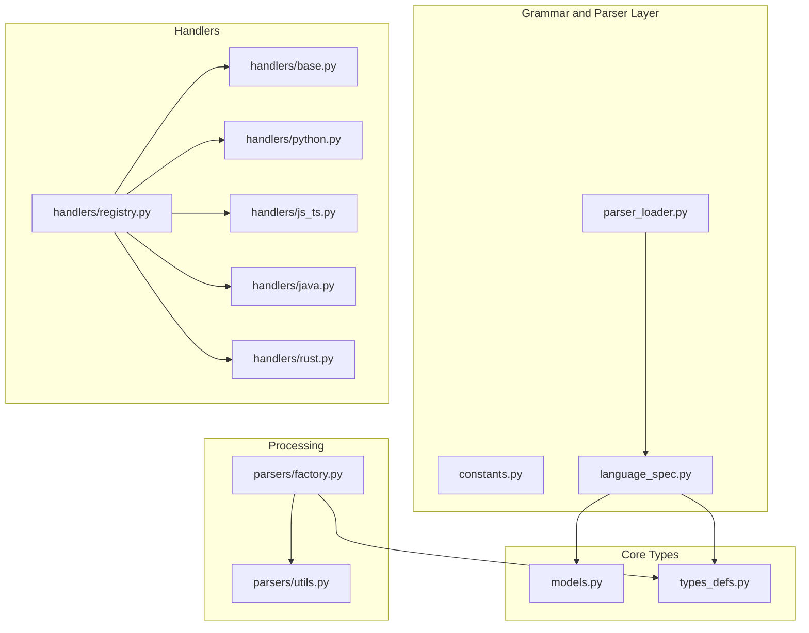
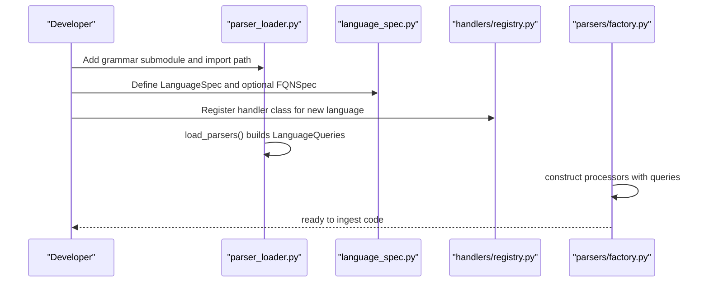
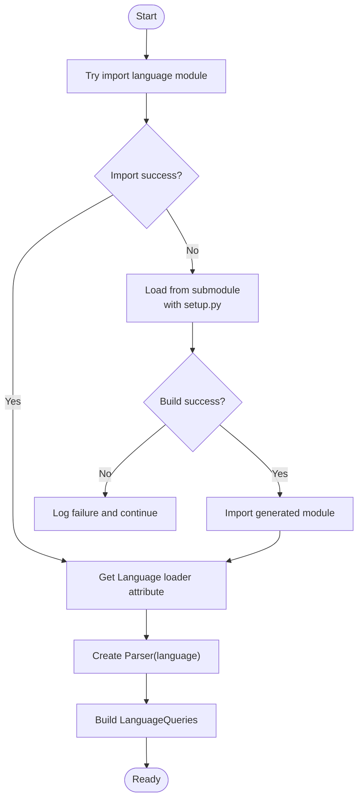
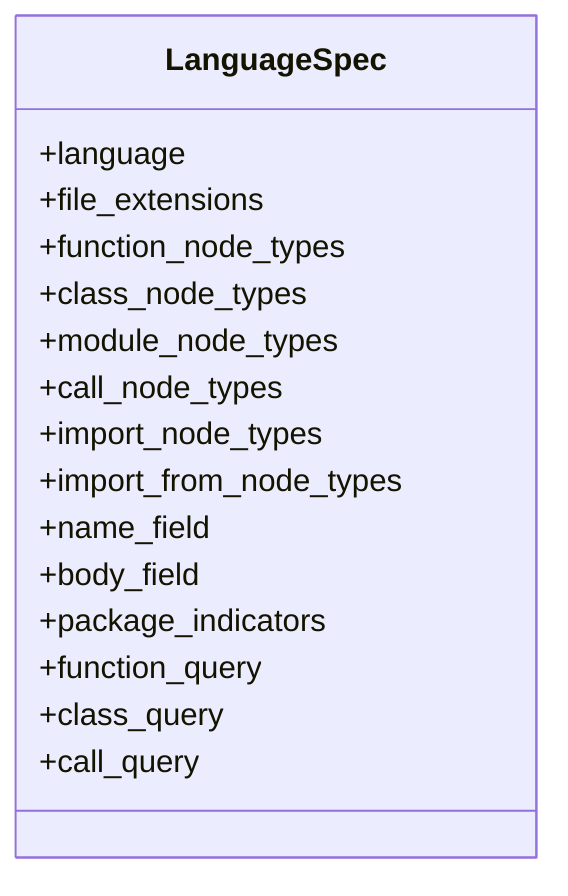
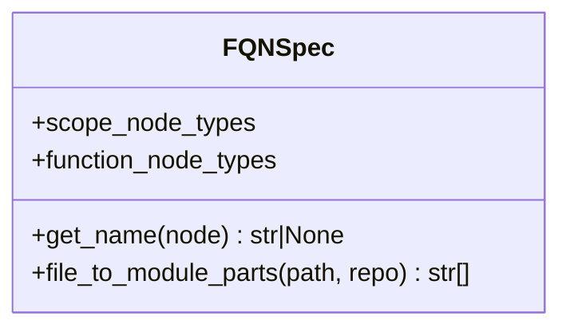
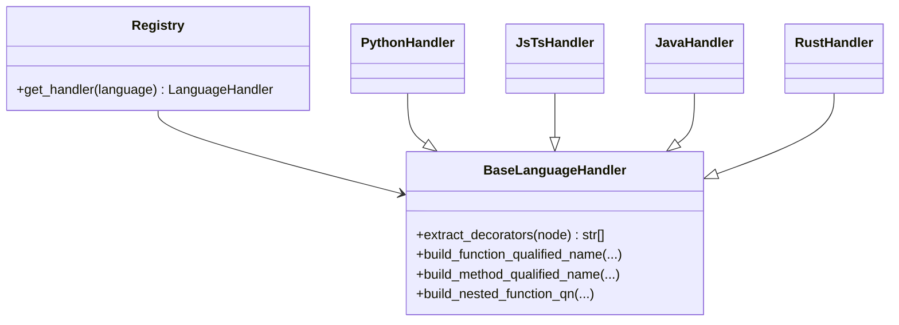
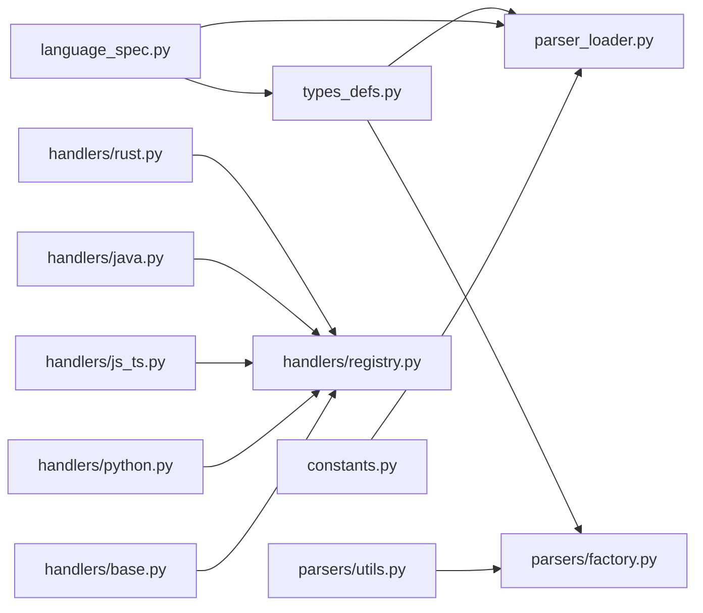

# Adding New Languages

<cite>
**Referenced Files in This Document**
- [language_spec.py](file://codebase_rag/language_spec.py)
- [models.py](file://codebase_rag/models.py)
- [parser_loader.py](file://codebase_rag/parser_loader.py)
- [constants.py](file://codebase_rag/constants.py)
- [types_defs.py](file://codebase_rag/types_defs.py)
- [factory.py](file://codebase_rag/parsers/factory.py)
- [handlers/registry.py](file://codebase_rag/parsers/handlers/registry.py)
- [handlers/base.py](file://codebase_rag/parsers/handlers/base.py)
- [handlers/python.py](file://codebase_rag/parsers/handlers/python.py)
- [handlers/js_ts.py](file://codebase_rag/parsers/handlers/js_ts.py)
- [handlers/java.py](file://codebase_rag/parsers/handlers/java.py)
- [handlers/rust.py](file://codebase_rag/parsers/handlers/rust.py)
- [utils.py](file://codebase_rag/parsers/utils.py)
- [test_language_node_coverage.py](file://codebase_rag/tests/test_language_node_coverage.py)
- [test_language_tool_unit.py](file://codebase_rag/tests/test_language_tool_unit.py)
</cite>

## Table of Contents
1. [Introduction](#introduction)
2. [Project Structure](#project-structure)
3. [Core Components](#core-components)
4. [Architecture Overview](#architecture-overview)
5. [Detailed Component Analysis](#detailed-component-analysis)
6. [Dependency Analysis](#dependency-analysis)
7. [Performance Considerations](#performance-considerations)
8. [Troubleshooting Guide](#troubleshooting-guide)
9. [Conclusion](#conclusion)
10. [Appendices](#appendices)

## Introduction
This document explains how to extend Graph-Code with support for new programming languages. It covers installing and compiling Tree-sitter grammars, configuring LanguageSpec and FQN specifications, implementing language-specific handlers, and registering parser factories. It also provides step-by-step examples for adding a simple language and a complex language with advanced features, along with debugging, performance optimization, testing strategies, and common pitfalls.

## Project Structure
The language integration pipeline centers around:
- Grammar loading and parser initialization
- Language specification definitions
- FQN (fully qualified name) extraction helpers
- Handler classes per language for AST-aware name resolution and semantics
- Factory and registry for processors and handlers

**Diagram sources**
- [parser_loader.py](file://codebase_rag/parser_loader.py#L1-L293)
- [language_spec.py](file://codebase_rag/language_spec.py#L1-L426)
- [models.py](file://codebase_rag/models.py#L1-L95)
- [types_defs.py](file://codebase_rag/types_defs.py#L1-L555)
- [handlers/registry.py](file://codebase_rag/parsers/handlers/registry.py#L1-L32)
- [handlers/base.py](file://codebase_rag/parsers/handlers/base.py#L1-L108)
- [parsers/factory.py](file://codebase_rag/parsers/factory.py#L1-L116)
- [parsers/utils.py](file://codebase_rag/parsers/utils.py#L1-L169)

**Section sources**
- [parser_loader.py](file://codebase_rag/parser_loader.py#L1-L293)
- [language_spec.py](file://codebase_rag/language_spec.py#L1-L426)
- [models.py](file://codebase_rag/models.py#L1-L95)
- [types_defs.py](file://codebase_rag/types_defs.py#L1-L555)
- [handlers/registry.py](file://codebase_rag/parsers/handlers/registry.py#L1-L32)
- [handlers/base.py](file://codebase_rag/parsers/handlers/base.py#L1-L108)
- [parsers/factory.py](file://codebase_rag/parsers/factory.py#L1-L116)
- [parsers/utils.py](file://codebase_rag/parsers/utils.py#L1-L169)

## Core Components
- LanguageSpec: Defines AST node types, queries, and import patterns for a language.
- FQNSpec: Provides name extraction and module path resolution for fully qualified names.
- Parser loader: Loads Tree-sitter grammars, builds parsers, and compiles queries.
- Handlers: Language-specific logic for name resolution, decorators, nested scopes, and method signatures.
- Factory: Creates processors for imports, structure, definitions, types, and calls.

**Section sources**
- [models.py](file://codebase_rag/models.py#L50-L95)
- [language_spec.py](file://codebase_rag/language_spec.py#L113-L426)
- [parser_loader.py](file://codebase_rag/parser_loader.py#L251-L293)
- [handlers/base.py](file://codebase_rag/parsers/handlers/base.py#L15-L108)
- [parsers/factory.py](file://codebase_rag/parsers/factory.py#L18-L116)

## Architecture Overview
End-to-end flow for adding a new language:
1. Install/compile Tree-sitter grammar bindings.
2. Define LanguageSpec and optional FQNSpec.
3. Register handler in the handler registry.
4. Initialize parsers and queries via the loader.
5. Use factory to orchestrate ingestion and graph updates.

**Diagram sources**
- [parser_loader.py](file://codebase_rag/parser_loader.py#L170-L293)
- [language_spec.py](file://codebase_rag/language_spec.py#L205-L426)
- [handlers/registry.py](file://codebase_rag/parsers/handlers/registry.py#L15-L32)
- [parsers/factory.py](file://codebase_rag/parsers/factory.py#L18-L116)

## Detailed Component Analysis

### Tree-sitter Grammar Installation and Compilation
- Grammar discovery and loading:
  - The loader attempts to import language modules and falls back to building bindings from submodules.
  - It supports multiple module naming conventions and attributes for retrieving the Language loader.
- Build steps:
  - If a setup.py exists in the grammar submodule, the loader invokes the build command to compile native bindings.
  - On success, it imports the generated module and retrieves the Language loader attribute.
- Query construction:
  - Queries are built from LanguageSpec node types or custom query strings.
  - Optional local variable queries are constructed for JS/TS.

**Diagram sources**
- [parser_loader.py](file://codebase_rag/parser_loader.py#L17-L83)
- [parser_loader.py](file://codebase_rag/parser_loader.py#L85-L167)
- [parser_loader.py](file://codebase_rag/parser_loader.py#L222-L248)

**Section sources**
- [parser_loader.py](file://codebase_rag/parser_loader.py#L17-L83)
- [parser_loader.py](file://codebase_rag/parser_loader.py#L85-L167)
- [parser_loader.py](file://codebase_rag/parser_loader.py#L222-L248)

### LanguageSpec Configuration
- Required fields:
  - language, file_extensions, function_node_types, class_node_types, module_node_types, call_node_types.
  - Optional: import_node_types, import_from_node_types, function_query, class_query, call_query, package_indicators.
- Query specification:
  - If custom queries are omitted, the loader constructs them from node type tuples.
  - For languages with special scoping or nested constructs, define explicit queries.

**Diagram sources**
- [models.py](file://codebase_rag/models.py#L58-L73)

**Section sources**
- [models.py](file://codebase_rag/models.py#L58-L73)
- [language_spec.py](file://codebase_rag/language_spec.py#L205-L426)

### FQN Specification and Name Extraction
- FQNSpec defines:
  - scope_node_types and function_node_types for name extraction.
  - get_name: extracts identifiers from AST nodes.
  - file_to_module_parts: converts file paths to module path segments.
- Built-in helpers:
  - Python, JavaScript/TypeScript, Rust, C++, generic helpers demonstrate patterns for robust extraction.

**Diagram sources**
- [models.py](file://codebase_rag/models.py#L50-L55)
- [language_spec.py](file://codebase_rag/language_spec.py#L113-L167)

**Section sources**
- [models.py](file://codebase_rag/models.py#L50-L55)
- [language_spec.py](file://codebase_rag/language_spec.py#L113-L167)

### Parser Factory Registration and Handlers
- Handler registry:
  - Maps SupportedLanguage to a handler class; defaults to BaseLanguageHandler.
  - Handlers implement language-specific logic for decorators, nested scopes, and qualified name construction.
- Factory:
  - Provides lazily initialized processors for imports, structure, definitions, type inference, and calls.

**Diagram sources**
- [handlers/registry.py](file://codebase_rag/parsers/handlers/registry.py#L15-L32)
- [handlers/base.py](file://codebase_rag/parsers/handlers/base.py#L15-L108)
- [handlers/python.py](file://codebase_rag/parsers/handlers/python.py#L13-L23)
- [handlers/js_ts.py](file://codebase_rag/parsers/handlers/js_ts.py#L14-L116)
- [handlers/java.py](file://codebase_rag/parsers/handlers/java.py#L13-L29)
- [handlers/rust.py](file://codebase_rag/parsers/handlers/rust.py#L19-L71)

**Section sources**
- [handlers/registry.py](file://codebase_rag/parsers/handlers/registry.py#L15-L32)
- [handlers/base.py](file://codebase_rag/parsers/handlers/base.py#L15-L108)
- [parsers/factory.py](file://codebase_rag/parsers/factory.py#L18-L116)

### Step-by-Step: Adding a Simple Language (e.g., Go)
- Install grammar:
  - Place the Tree-sitter Go grammar under the grammars directory and ensure bindings can be imported or built.
- Define LanguageSpec:
  - Set function_node_types, class_node_types, module_node_types, call_node_types.
  - Optionally define function_query, class_query, call_query.
- Define FQNSpec (optional):
  - Provide get_name and file_to_module_parts if the language has special naming conventions.
- Register handler:
  - Add a handler class inheriting from BaseLanguageHandler and register it in the registry.
- Verify:
  - Run tests to ensure extension mapping and spec completeness.

**Section sources**
- [parser_loader.py](file://codebase_rag/parser_loader.py#L96-L167)
- [language_spec.py](file://codebase_rag/language_spec.py#L290-L309)
- [handlers/registry.py](file://codebase_rag/parsers/handlers/registry.py#L15-L32)
- [test_language_node_coverage.py](file://codebase_rag/tests/test_language_node_coverage.py#L70-L115)

### Step-by-Step: Adding a Complex Language (e.g., Rust)
- Install grammar:
  - Ensure the Rust grammar submodule is present and bindings are importable or buildable.
- Define LanguageSpec:
  - Provide comprehensive function_node_types, class_node_types, module_node_types, call_node_types.
  - Supply custom function_query, class_query, call_query tailored to Rust’s traits, impl blocks, and macros.
- Define FQNSpec:
  - Implement get_name to handle Rust’s attributes and identifiers.
  - Implement file_to_module_parts to reflect Rust module layout.
- Register handler:
  - Extend BaseLanguageHandler to extract decorators (attributes), build impl-target-aware QNs, and process impl blocks.
- Verify:
  - Use tests to validate language coverage and extension mapping.

**Section sources**
- [parser_loader.py](file://codebase_rag/parser_loader.py#L251-L293)
- [language_spec.py](file://codebase_rag/language_spec.py#L244-L289)
- [language_spec.py](file://codebase_rag/language_spec.py#L134-L139)
- [handlers/rust.py](file://codebase_rag/parsers/handlers/rust.py#L19-L71)

## Dependency Analysis
- Parser loader depends on:
  - constants for grammar paths and module names.
  - language_spec for LanguageSpec definitions.
  - types_defs for LanguageQueries and protocols.
- Handlers depend on:
  - constants for AST node types and field names.
  - language_spec for FQN specs and LanguageSpec.
  - utils for safe decoding and traversal helpers.
- Factory composes processors using queries and handler instances.

**Diagram sources**
- [constants.py](file://codebase_rag/constants.py#L712-L734)
- [parser_loader.py](file://codebase_rag/parser_loader.py#L1-L293)
- [language_spec.py](file://codebase_rag/language_spec.py#L1-L426)
- [types_defs.py](file://codebase_rag/types_defs.py#L1-L555)
- [handlers/registry.py](file://codebase_rag/parsers/handlers/registry.py#L1-L32)
- [handlers/base.py](file://codebase_rag/parsers/handlers/base.py#L1-L108)
- [parsers/factory.py](file://codebase_rag/parsers/factory.py#L1-L116)
- [parsers/utils.py](file://codebase_rag/parsers/utils.py#L1-L169)

**Section sources**
- [constants.py](file://codebase_rag/constants.py#L712-L734)
- [parser_loader.py](file://codebase_rag/parser_loader.py#L1-L293)
- [language_spec.py](file://codebase_rag/language_spec.py#L1-L426)
- [types_defs.py](file://codebase_rag/types_defs.py#L1-L555)
- [handlers/registry.py](file://codebase_rag/parsers/handlers/registry.py#L1-L32)
- [handlers/base.py](file://codebase_rag/parsers/handlers/base.py#L1-L108)
- [parsers/factory.py](file://codebase_rag/parsers/factory.py#L1-L116)
- [parsers/utils.py](file://codebase_rag/parsers/utils.py#L1-L169)

## Performance Considerations
- Grammar availability:
  - Ensure grammars are prebuilt or cached to avoid repeated compilation overhead.
- Query efficiency:
  - Keep queries minimal and targeted; avoid overly broad captures.
- Decoding:
  - Use cached decoding utilities to reduce repeated UTF-8 decoding costs.
- Handler logic:
  - Short-circuit expensive traversals; cache intermediate results where appropriate.
- Factory initialization:
  - Lazy instantiation of processors reduces startup cost when not all processors are needed.

[No sources needed since this section provides general guidance]

## Troubleshooting Guide
Common issues and resolutions:
- Grammar not loaded:
  - Verify grammar submodule presence and that bindings can be imported or built successfully.
  - Check that the loader’s language import list includes the new language.
- No parsers initialized:
  - Confirm LANGUAGE_SPECS contains the new language and that load_parsers succeeds.
- Incorrect node types:
  - Cross-check constants for AST node types against the grammar’s node-types.json.
- Handler not invoked:
  - Ensure the handler is registered in the registry and mapped to the correct SupportedLanguage.
- FQN mismatches:
  - Validate FQNSpec.get_name and file_to_module_parts align with the language’s module system.
- Debugging tips:
  - Enable debug logs during grammar loading and query creation.
  - Inspect LanguageQueries contents and verify captures for functions/classes/calls.
  - Use unit tests to validate extension-to-language mapping and spec completeness.

**Section sources**
- [parser_loader.py](file://codebase_rag/parser_loader.py#L251-L293)
- [test_language_node_coverage.py](file://codebase_rag/tests/test_language_node_coverage.py#L70-L115)
- [test_language_tool_unit.py](file://codebase_rag/tests/test_language_tool_unit.py#L165-L203)

## Conclusion
Extending Graph-Code with a new language involves installing and compiling Tree-sitter grammars, defining precise LanguageSpec and optional FQNSpec configurations, implementing a language-specific handler, and ensuring proper registration and factory composition. Following the step-by-step examples and leveraging the provided tests and debugging strategies will streamline integration and maintain correctness across simple and complex languages.

[No sources needed since this section summarizes without analyzing specific files]

## Appendices

### Appendix A: Example Workflows

#### Simple Language Workflow (Go)
- Install grammar bindings under grammars.
- Add LanguageSpec entries for Go in language_spec.py.
- Optionally add FQNSpec if needed.
- Register a GoHandler in the registry.
- Run tests to validate coverage and mapping.

**Section sources**
- [language_spec.py](file://codebase_rag/language_spec.py#L290-L309)
- [handlers/registry.py](file://codebase_rag/parsers/handlers/registry.py#L15-L32)
- [test_language_node_coverage.py](file://codebase_rag/tests/test_language_node_coverage.py#L70-L115)

#### Complex Language Workflow (Rust)
- Install Rust grammar submodule and build bindings if necessary.
- Define comprehensive LanguageSpec with custom queries for functions, classes, and calls.
- Implement FQNSpec with Rust-specific name extraction and module path logic.
- Extend BaseLanguageHandler to support attributes, impl blocks, and method signatures.
- Validate with tests and logs.

**Section sources**
- [parser_loader.py](file://codebase_rag/parser_loader.py#L251-L293)
- [language_spec.py](file://codebase_rag/language_spec.py#L244-L289)
- [language_spec.py](file://codebase_rag/language_spec.py#L134-L139)
- [handlers/rust.py](file://codebase_rag/parsers/handlers/rust.py#L19-L71)

### Appendix B: Testing Strategies
- Coverage tests:
  - Ensure every SupportedLanguage has metadata, LanguageSpec, and file extensions.
  - Validate extension-to-language mapping.
- Tool unit tests:
  - Parse Tree-sitter JSON configs and extract node types and categorizations.
- Integration tests:
  - Run end-to-end ingestion for the new language to catch parser and handler issues early.

**Section sources**
- [test_language_node_coverage.py](file://codebase_rag/tests/test_language_node_coverage.py#L30-L226)
- [test_language_tool_unit.py](file://codebase_rag/tests/test_language_tool_unit.py#L1-L312)