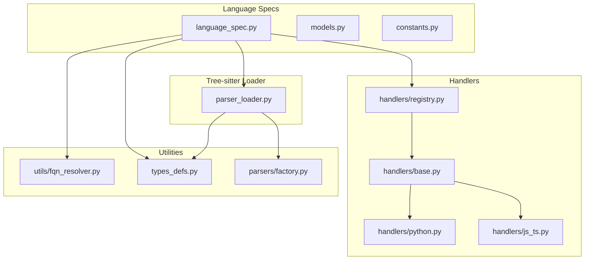
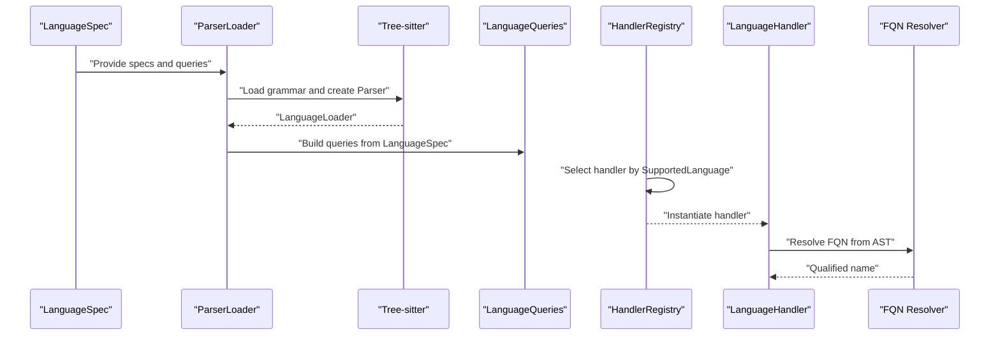
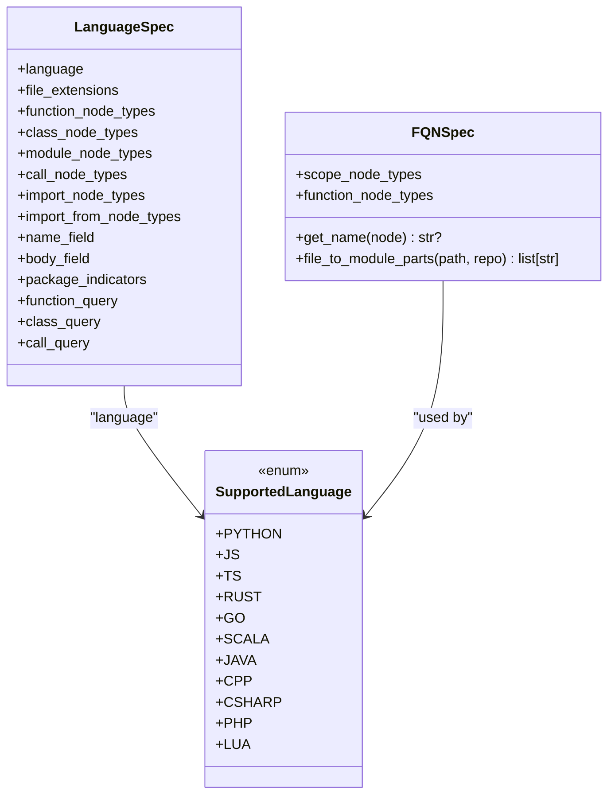
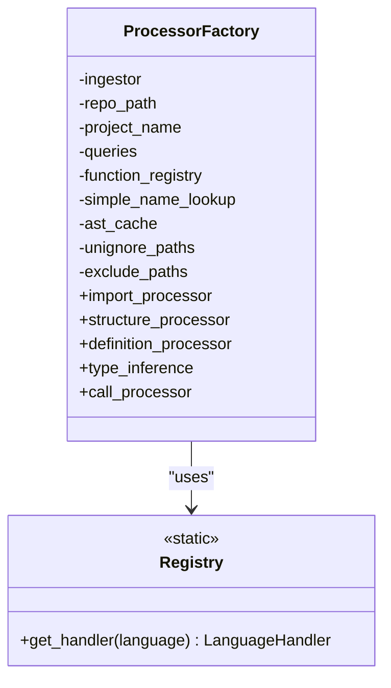
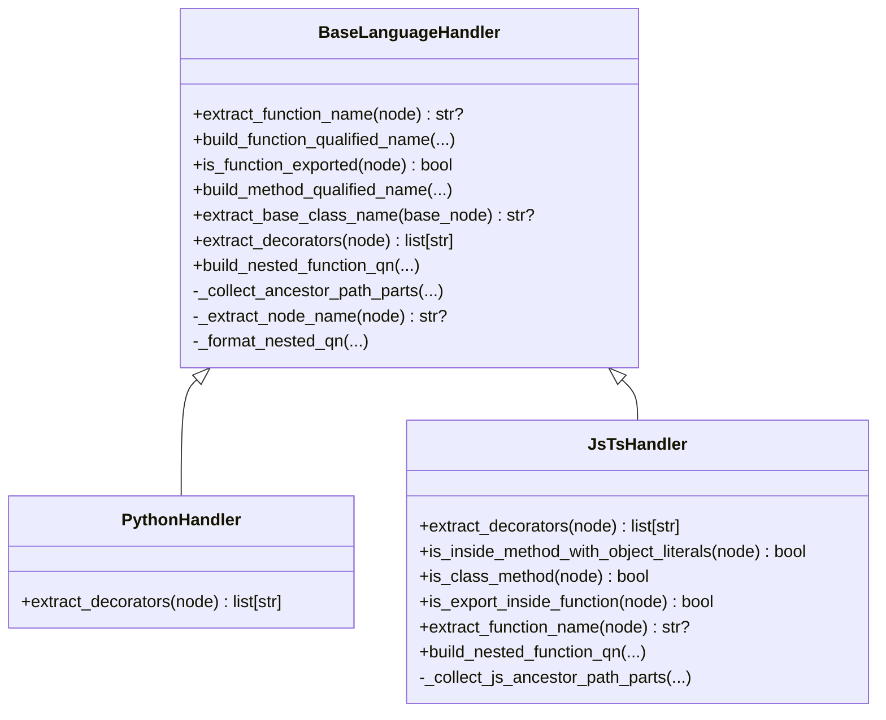
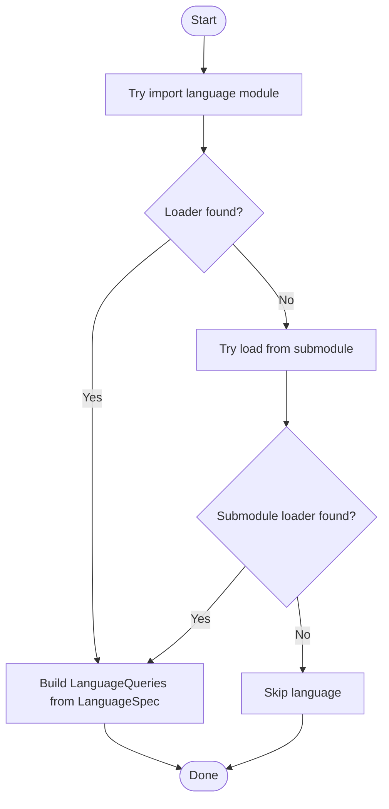
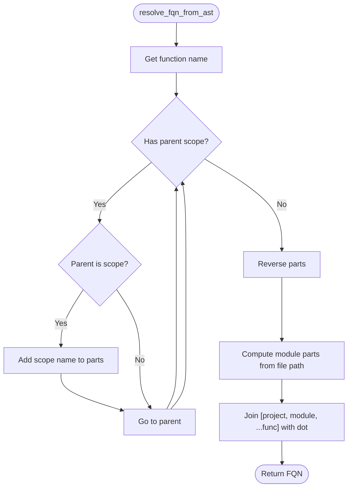
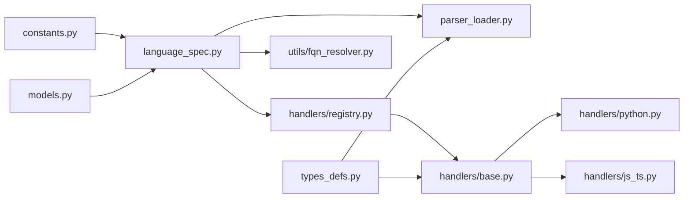

# Language Handler Architecture

<cite>
**Referenced Files in This Document**
- [language_spec.py](file://codebase_rag/language_spec.py)
- [models.py](file://codebase_rag/models.py)
- [constants.py](file://codebase_rag/constants.py)
- [parser_loader.py](file://codebase_rag/parser_loader.py)
- [fqn_resolver.py](file://codebase_rag/utils/fqn_resolver.py)
- [factory.py](file://codebase_rag/parsers/factory.py)
- [registry.py](file://codebase_rag/parsers/handlers/registry.py)
- [base.py](file://codebase_rag/parsers/handlers/base.py)
- [python.py](file://codebase_rag/parsers/handlers/python.py)
- [js_ts.py](file://codebase_rag/parsers/handlers/js_ts.py)
- [types_defs.py](file://codebase_rag/types_defs.py)
</cite>

## Table of Contents
1. [Introduction](#introduction)
2. [Project Structure](#project-structure)
3. [Core Components](#core-components)
4. [Architecture Overview](#architecture-overview)
5. [Detailed Component Analysis](#detailed-component-analysis)
6. [Dependency Analysis](#dependency-analysis)
7. [Performance Considerations](#performance-considerations)
8. [Troubleshooting Guide](#troubleshooting-guide)
9. [Conclusion](#conclusion)
10. [Appendices](#appendices)

## Introduction
This document explains the Graph-Code language handler architecture, focusing on how language capabilities are defined via LanguageSpec and FQNSpec, how language handlers are registered and instantiated, and how Tree-sitter grammars are loaded and queried. It also documents Fully Qualified Name (FQN) resolution, extensibility points for adding new languages, and debugging strategies for language-specific parsing issues.

## Project Structure
The language handler architecture spans several modules:
- Language specification definitions and mappings
- Tree-sitter grammar loading and query construction
- Handler registration and instantiation
- FQN extraction and resolution utilities
- Processor factory for orchestrating parsing and graph building

**Diagram sources**
- [language_spec.py](file://codebase_rag/language_spec.py#L205-L426)
- [models.py](file://codebase_rag/models.py#L50-L95)
- [constants.py](file://codebase_rag/constants.py#L425-L929)
- [parser_loader.py](file://codebase_rag/parser_loader.py#L1-L293)
- [fqn_resolver.py](file://codebase_rag/utils/fqn_resolver.py#L1-L108)
- [factory.py](file://codebase_rag/parsers/factory.py#L1-L116)
- [registry.py](file://codebase_rag/parsers/handlers/registry.py#L1-L32)
- [base.py](file://codebase_rag/parsers/handlers/base.py#L1-L108)
- [python.py](file://codebase_rag/parsers/handlers/python.py#L1-L23)
- [js_ts.py](file://codebase_rag/parsers/handlers/js_ts.py#L1-L116)
- [types_defs.py](file://codebase_rag/types_defs.py#L1-L200)

**Section sources**
- [language_spec.py](file://codebase_rag/language_spec.py#L205-L426)
- [parser_loader.py](file://codebase_rag/parser_loader.py#L1-L293)
- [registry.py](file://codebase_rag/parsers/handlers/registry.py#L1-L32)
- [fqn_resolver.py](file://codebase_rag/utils/fqn_resolver.py#L1-L108)
- [factory.py](file://codebase_rag/parsers/factory.py#L1-L116)
- [models.py](file://codebase_rag/models.py#L50-L95)
- [constants.py](file://codebase_rag/constants.py#L425-L929)
- [types_defs.py](file://codebase_rag/types_defs.py#L1-L200)

## Core Components
- LanguageSpec: Defines per-language AST node type mappings, function/class detection patterns, import/call patterns, and optional Tree-sitter queries.
- FQNSpec: Encapsulates FQN extraction helpers and module-to-parts conversion for fully qualified name computation.
- Parser loader: Dynamically loads Tree-sitter language bindings, constructs parsers, and builds queries from LanguageSpec.
- Handler registry and base handler: Provides a factory to instantiate language-specific handlers and a base class for shared behavior.
- FQN resolver: Traverses AST nodes to compute qualified names and supports reverse lookup by FQN.

**Section sources**
- [models.py](file://codebase_rag/models.py#L50-L95)
- [language_spec.py](file://codebase_rag/language_spec.py#L11-L426)
- [parser_loader.py](file://codebase_rag/parser_loader.py#L1-L293)
- [registry.py](file://codebase_rag/parsers/handlers/registry.py#L1-L32)
- [base.py](file://codebase_rag/parsers/handlers/base.py#L1-L108)
- [fqn_resolver.py](file://codebase_rag/utils/fqn_resolver.py#L1-L108)

## Architecture Overview
The system integrates Tree-sitter grammars with language-specific handlers and processors. The pipeline:
- Loads language grammars and builds queries from LanguageSpec
- Instantiates handlers per language for AST-aware processing
- Resolves FQNs from AST nodes for graph node labeling
- Orchestrates ingestion, imports, definitions, types, and calls

**Diagram sources**
- [language_spec.py](file://codebase_rag/language_spec.py#L205-L426)
- [parser_loader.py](file://codebase_rag/parser_loader.py#L251-L293)
- [registry.py](file://codebase_rag/parsers/handlers/registry.py#L28-L32)
- [fqn_resolver.py](file://codebase_rag/utils/fqn_resolver.py#L17-L45)

## Detailed Component Analysis

### LanguageSpec and FQNSpec
- LanguageSpec defines:
  - Language key and file extensions
  - AST node type tuples for functions, classes, modules, calls, imports
  - Optional Tree-sitter query strings for functions/classes/calls
  - Name/body field names and package indicators
- FQNSpec defines:
  - Scope and function node types for hierarchical name assembly
  - A callable to extract a node’s name from the AST
  - A callable to convert file path to module parts

**Diagram sources**
- [models.py](file://codebase_rag/models.py#L57-L95)
- [constants.py](file://codebase_rag/constants.py#L426-L438)

**Section sources**
- [models.py](file://codebase_rag/models.py#L57-L95)
- [language_spec.py](file://codebase_rag/language_spec.py#L113-L202)
- [constants.py](file://codebase_rag/constants.py#L426-L438)

### Parser Factory Pattern and Handler Registration
- ProcessorFactory lazily instantiates processors (import, structure, definition, type inference, call) and wires them with shared services and caches.
- HandlerRegistry maps SupportedLanguage to handler classes and caches instances.

**Diagram sources**
- [factory.py](file://codebase_rag/parsers/factory.py#L18-L116)
- [registry.py](file://codebase_rag/parsers/handlers/registry.py#L15-L32)

**Section sources**
- [factory.py](file://codebase_rag/parsers/factory.py#L18-L116)
- [registry.py](file://codebase_rag/parsers/handlers/registry.py#L1-L32)

### Base Language Handler and Specializations
- BaseLanguageHandler provides default behaviors for extracting names, building qualified names, detecting decorators, and constructing nested function QNs.
- PythonHandler adds Python-specific decorator extraction.
- JsTsHandler extends behavior for JavaScript/TypeScript, including nested function QN derivation and method/object literal detection.

**Diagram sources**
- [base.py](file://codebase_rag/parsers/handlers/base.py#L15-L108)
- [python.py](file://codebase_rag/parsers/handlers/python.py#L13-L23)
- [js_ts.py](file://codebase_rag/parsers/handlers/js_ts.py#L14-L116)

**Section sources**
- [base.py](file://codebase_rag/parsers/handlers/base.py#L15-L108)
- [python.py](file://codebase_rag/parsers/handlers/python.py#L13-L23)
- [js_ts.py](file://codebase_rag/parsers/handlers/js_ts.py#L14-L116)

### Tree-sitter Integration and Grammar Loading
- ParserLoader dynamically imports or builds Tree-sitter language bindings, creates Language and Parser instances, and constructs LanguageQueries from LanguageSpec.
- It supports fallback to submodule-built bindings and logs diagnostics for failures.

**Diagram sources**
- [parser_loader.py](file://codebase_rag/parser_loader.py#L17-L172)
- [constants.py](file://codebase_rag/constants.py#L724-L734)

**Section sources**
- [parser_loader.py](file://codebase_rag/parser_loader.py#L17-L293)
- [constants.py](file://codebase_rag/constants.py#L724-L734)

### FQN Resolution System
- resolve_fqn_from_ast traverses ancestors to collect scope names, combines with module parts derived from file path, and prefixes with project name.
- find_function_source_by_fqn walks the AST to locate a function by its computed FQN.
- extract_function_fqns collects all function FQNs in a subtree.

**Diagram sources**
- [fqn_resolver.py](file://codebase_rag/utils/fqn_resolver.py#L17-L45)
- [language_spec.py](file://codebase_rag/language_spec.py#L113-L160)

**Section sources**
- [fqn_resolver.py](file://codebase_rag/utils/fqn_resolver.py#L17-L108)
- [language_spec.py](file://codebase_rag/language_spec.py#L11-L160)

### Practical Examples

- Configuring a language specification:
  - Define node types for functions, classes, modules, calls, and imports.
  - Optionally provide Tree-sitter query strings for functions/classes/calls.
  - Example references:
    - [language_spec.py](file://codebase_rag/language_spec.py#L205-L426)

- Instantiating a language handler:
  - Use the registry to get a handler for a given SupportedLanguage.
  - Example references:
    - [registry.py](file://codebase_rag/parsers/handlers/registry.py#L28-L32)

- Building a processor pipeline:
  - Use ProcessorFactory to lazily construct processors with shared dependencies.
  - Example references:
    - [factory.py](file://codebase_rag/parsers/factory.py#L18-L116)

- Resolving FQNs:
  - Compute a function’s qualified name from AST and file path.
  - Example references:
    - [fqn_resolver.py](file://codebase_rag/utils/fqn_resolver.py#L17-L45)

**Section sources**
- [language_spec.py](file://codebase_rag/language_spec.py#L205-L426)
- [registry.py](file://codebase_rag/parsers/handlers/registry.py#L28-L32)
- [factory.py](file://codebase_rag/parsers/factory.py#L18-L116)
- [fqn_resolver.py](file://codebase_rag/utils/fqn_resolver.py#L17-L45)

## Dependency Analysis
Key dependencies:
- language_spec.py depends on constants for node types and patterns, and models for LanguageSpec/FQNSpec.
- parser_loader.py depends on language_spec.py for LanguageSpec and constants for module names and attributes.
- Handlers depend on base.py and types_defs.py for AST node typing and protocols.
- fqn_resolver.py depends on language_spec.py for FQNSpec and constants for separators.

**Diagram sources**
- [constants.py](file://codebase_rag/constants.py#L425-L929)
- [models.py](file://codebase_rag/models.py#L50-L95)
- [language_spec.py](file://codebase_rag/language_spec.py#L205-L426)
- [parser_loader.py](file://codebase_rag/parser_loader.py#L1-L293)
- [registry.py](file://codebase_rag/parsers/handlers/registry.py#L1-L32)
- [base.py](file://codebase_rag/parsers/handlers/base.py#L1-L108)
- [python.py](file://codebase_rag/parsers/handlers/python.py#L1-L23)
- [js_ts.py](file://codebase_rag/parsers/handlers/js_ts.py#L1-L116)
- [fqn_resolver.py](file://codebase_rag/utils/fqn_resolver.py#L1-L108)
- [types_defs.py](file://codebase_rag/types_defs.py#L1-L200)

**Section sources**
- [constants.py](file://codebase_rag/constants.py#L425-L929)
- [models.py](file://codebase_rag/models.py#L50-L95)
- [language_spec.py](file://codebase_rag/language_spec.py#L205-L426)
- [parser_loader.py](file://codebase_rag/parser_loader.py#L1-L293)
- [registry.py](file://codebase_rag/parsers/handlers/registry.py#L1-L32)
- [base.py](file://codebase_rag/parsers/handlers/base.py#L1-L108)
- [python.py](file://codebase_rag/parsers/handlers/python.py#L1-L23)
- [js_ts.py](file://codebase_rag/parsers/handlers/js_ts.py#L1-L116)
- [fqn_resolver.py](file://codebase_rag/utils/fqn_resolver.py#L1-L108)
- [types_defs.py](file://codebase_rag/types_defs.py#L1-L200)

## Performance Considerations
- Lazy initialization: ProcessorFactory defers creation of processors until accessed, reducing startup overhead.
- Query caching: Tree-sitter queries are built once per language and reused across parsing.
- FQN traversal: FQN resolution walks ancestor scopes; keep ASTs reasonably structured to avoid deep traversals.
- Handler specialization: Language-specific handlers minimize generic AST scanning by leveraging language-specific patterns.

[No sources needed since this section provides general guidance]

## Troubleshooting Guide
Common issues and resolutions:
- Grammar not available:
  - Symptom: No parsers initialized.
  - Action: Verify Tree-sitter bindings are installed or submodule build succeeds.
  - References:
    - [parser_loader.py](file://codebase_rag/parser_loader.py#L251-L293)
    - [constants.py](file://codebase_rag/constants.py#L724-L734)

- FQN resolution failure:
  - Symptom: Missing or incorrect qualified names.
  - Action: Confirm FQNSpec scope and function node types match the language grammar and that file_to_module_parts aligns with project layout.
  - References:
    - [fqn_resolver.py](file://codebase_rag/utils/fqn_resolver.py#L17-L45)
    - [language_spec.py](file://codebase_rag/language_spec.py#L113-L160)

- Handler not found:
  - Symptom: Default handler used unexpectedly.
  - Action: Ensure SupportedLanguage is registered in the handler registry.
  - References:
    - [registry.py](file://codebase_rag/parsers/handlers/registry.py#L15-L32)

- Query pattern errors:
  - Symptom: Queries fail to compile.
  - Action: Validate Tree-sitter query syntax against LanguageSpec and fallback to auto-generated patterns.
  - References:
    - [parser_loader.py](file://codebase_rag/parser_loader.py#L222-L248)

**Section sources**
- [parser_loader.py](file://codebase_rag/parser_loader.py#L251-L293)
- [fqn_resolver.py](file://codebase_rag/utils/fqn_resolver.py#L17-L45)
- [registry.py](file://codebase_rag/parsers/handlers/registry.py#L15-L32)
- [parser_loader.py](file://codebase_rag/parser_loader.py#L222-L248)

## Conclusion
The language handler architecture cleanly separates language capability definitions (LanguageSpec/FQNSpec), Tree-sitter integration (parser loader), handler instantiation (registry), and FQN resolution. This modular design enables straightforward addition of new languages and robust debugging of language-specific parsing issues.

[No sources needed since this section summarizes without analyzing specific files]

## Appendices

### Extensibility: Adding a New Language
Steps:
- Define LanguageSpec with:
  - language key and file_extensions
  - function_node_types, class_node_types, module_node_types, call_node_types, import_node_types
  - Optional function_query, class_query, call_query
- Define FQNSpec with:
  - scope_node_types, function_node_types
  - get_name and file_to_module_parts
- Register language in:
  - LANGUAGE_SPECS mapping
  - Handler registry mapping
  - Parser loader imports and submodule fallback
- Provide Tree-sitter bindings:
  - Install official module or build submodule bindings
- Validate:
  - Load parsers succeed
  - Handlers instantiate and resolve FQNs correctly

References:
- [language_spec.py](file://codebase_rag/language_spec.py#L205-L426)
- [models.py](file://codebase_rag/models.py#L57-L95)
- [registry.py](file://codebase_rag/parsers/handlers/registry.py#L15-L32)
- [parser_loader.py](file://codebase_rag/parser_loader.py#L96-L172)

**Section sources**
- [language_spec.py](file://codebase_rag/language_spec.py#L205-L426)
- [models.py](file://codebase_rag/models.py#L57-L95)
- [registry.py](file://codebase_rag/parsers/handlers/registry.py#L15-L32)
- [parser_loader.py](file://codebase_rag/parser_loader.py#L96-L172)