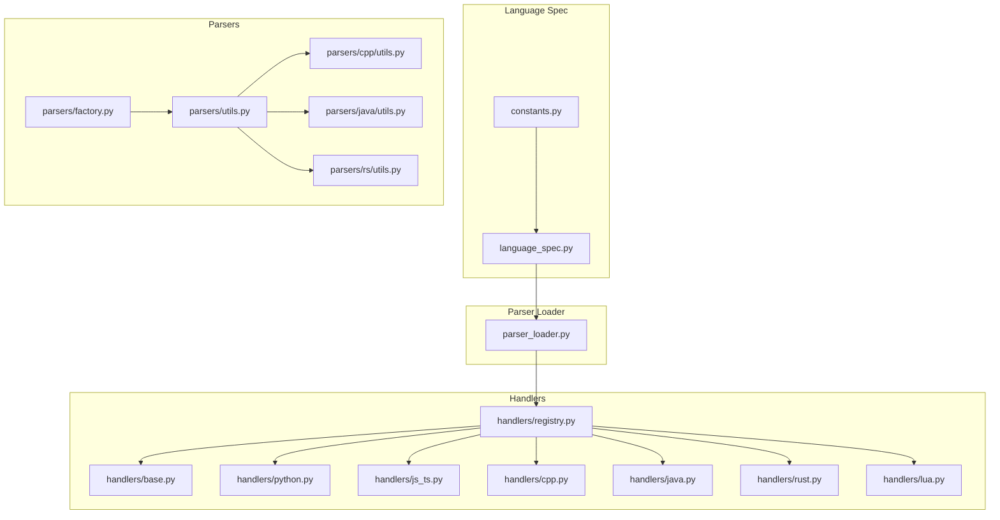
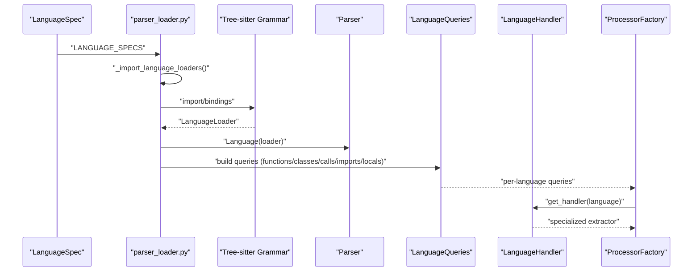
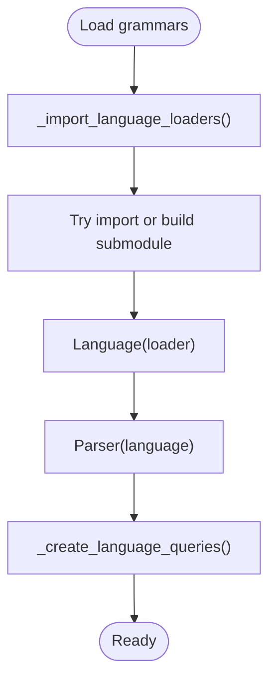
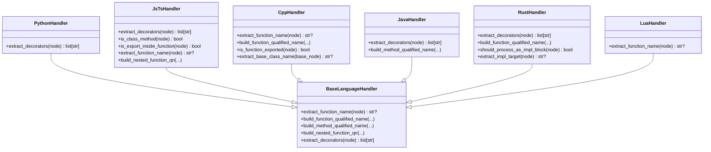
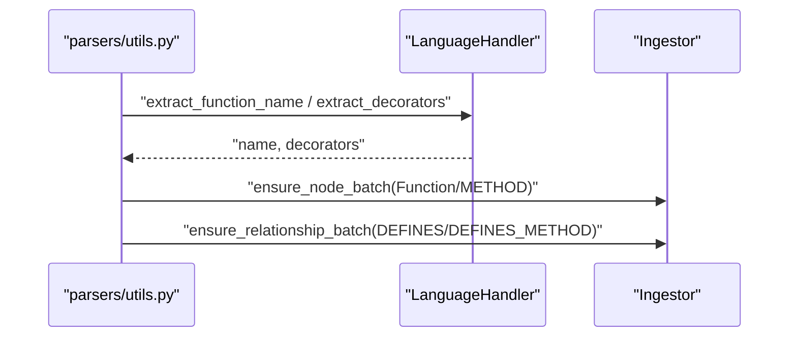
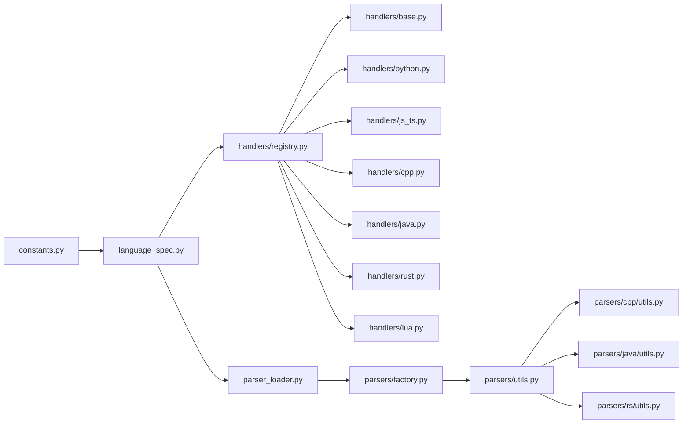

# Multi-Language Support

<cite>
**Referenced Files in This Document**
- [language_spec.py](file://codebase_rag/language_spec.py)
- [constants.py](file://codebase_rag/constants.py)
- [parser_loader.py](file://codebase_rag/parser_loader.py)
- [factory.py](file://codebase_rag/parsers/factory.py)
- [registry.py](file://codebase_rag/parsers/handlers/registry.py)
- [base.py](file://codebase_rag/parsers/handlers/base.py)
- [protocol.py](file://codebase_rag/parsers/handlers/protocol.py)
- [python.py](file://codebase_rag/parsers/handlers/python.py)
- [js_ts.py](file://codebase_rag/parsers/handlers/js_ts.py)
- [cpp.py](file://codebase_rag/parsers/handlers/cpp.py)
- [java.py](file://codebase_rag/parsers/handlers/java.py)
- [rust.py](file://codebase_rag/parsers/handlers/rust.py)
- [lua.py](file://codebase_rag/parsers/handlers/lua.py)
- [utils.py](file://codebase_rag/parsers/utils.py)
- [cpp/utils.py](file://codebase_rag/parsers/cpp/utils.py)
- [java/utils.py](file://codebase_rag/parsers/java/utils.py)
- [rs/utils.py](file://codebase_rag/parsers/rs/utils.py)
</cite>

## Table of Contents
1. [Introduction](#introduction)
2. [Project Structure](#project-structure)
3. [Core Components](#core-components)
4. [Architecture Overview](#architecture-overview)
5. [Detailed Component Analysis](#detailed-component-analysis)
6. [Dependency Analysis](#dependency-analysis)
7. [Performance Considerations](#performance-considerations)
8. [Troubleshooting Guide](#troubleshooting-guide)
9. [Conclusion](#conclusion)
10. [Appendices](#appendices)

## Introduction
This document explains the Graph-Code multi-language support system. It covers the currently supported languages (C++, Java, JavaScript, Lua, Python, Rust, TypeScript), the language handler architecture, and how Tree-sitter grammars are integrated. It documents language-specific parsing capabilities (function detection, class/struct handling, module systems), the language specification system, and how to add new languages via Tree-sitter grammar integration. Practical examples show how different language constructs are parsed and represented in the knowledge graph, along with limitations, workarounds, performance considerations, and guidance for language developers.

## Project Structure
The multi-language support spans several modules:
- Language specification and configuration
- Tree-sitter grammar loading and query construction
- Language handler registry and per-language processors
- Utilities for AST traversal, decoding, and ingestion

**Diagram sources**
- [language_spec.py](file://codebase_rag/language_spec.py#L205-L426)
- [constants.py](file://codebase_rag/constants.py#L426-L507)
- [parser_loader.py](file://codebase_rag/parser_loader.py#L96-L172)
- [registry.py](file://codebase_rag/parsers/handlers/registry.py#L15-L31)
- [base.py](file://codebase_rag/parsers/handlers/base.py#L15-L108)
- [python.py](file://codebase_rag/parsers/handlers/python.py#L13-L23)
- [js_ts.py](file://codebase_rag/parsers/handlers/js_ts.py#L14-L116)
- [cpp.py](file://codebase_rag/parsers/handlers/cpp.py#L19-L60)
- [java.py](file://codebase_rag/parsers/handlers/java.py#L13-L29)
- [rust.py](file://codebase_rag/parsers/handlers/rust.py#L19-L71)
- [lua.py](file://codebase_rag/parsers/handlers/lua.py#L13-L26)
- [factory.py](file://codebase_rag/parsers/factory.py#L18-L116)
- [utils.py](file://codebase_rag/parsers/utils.py#L32-L169)
- [cpp/utils.py](file://codebase_rag/parsers/cpp/utils.py#L14-L354)
- [java/utils.py](file://codebase_rag/parsers/java/utils.py#L439-L461)
- [rs/utils.py](file://codebase_rag/parsers/rs/utils.py#L178-L212)

**Section sources**
- [language_spec.py](file://codebase_rag/language_spec.py#L205-L426)
- [constants.py](file://codebase_rag/constants.py#L426-L507)
- [parser_loader.py](file://codebase_rag/parser_loader.py#L96-L172)
- [registry.py](file://codebase_rag/parsers/handlers/registry.py#L15-L31)
- [factory.py](file://codebase_rag/parsers/factory.py#L18-L116)

## Core Components
- Language specification system defines per-language AST node types, queries, and metadata.
- Tree-sitter grammar loader dynamically imports or builds bindings and constructs queries.
- Handler registry maps languages to specialized handlers that extract names, decorators, and qualified names.
- Factory composes processors (imports, structures, definitions, types, calls) using language-specific queries and handlers.

Key responsibilities:
- LanguageSpec: declares supported languages, file extensions, AST node types, and optional Tree-sitter queries.
- LanguageSpec.FQNSpec: defines how to compute fully qualified names from AST and file paths.
- Parser loader: loads grammars, creates parsers and queries, and reports availability.
- Handlers: specialize name extraction, decorators, nested QN computation, and method/class naming.

**Section sources**
- [language_spec.py](file://codebase_rag/language_spec.py#L205-L426)
- [constants.py](file://codebase_rag/constants.py#L426-L507)
- [parser_loader.py](file://codebase_rag/parser_loader.py#L251-L292)
- [registry.py](file://codebase_rag/parsers/handlers/registry.py#L15-L31)
- [base.py](file://codebase_rag/parsers/handlers/base.py#L15-L108)
- [factory.py](file://codebase_rag/parsers/factory.py#L18-L116)

## Architecture Overview
The system integrates Tree-sitter grammars per language, constructs queries, and uses language handlers to parse and enrich the knowledge graph.

**Diagram sources**
- [language_spec.py](file://codebase_rag/language_spec.py#L205-L426)
- [parser_loader.py](file://codebase_rag/parser_loader.py#L96-L172)
- [parser_loader.py](file://codebase_rag/parser_loader.py#L251-L292)
- [registry.py](file://codebase_rag/parsers/handlers/registry.py#L28-L31)
- [factory.py](file://codebase_rag/parsers/factory.py#L18-L116)

## Detailed Component Analysis

### Language Specification System
- SupportedLanguage enumerates languages with status and display names.
- LanguageSpec defines:
  - File extensions
  - Function/class/module/call/import node types
  - Optional Tree-sitter queries for functions/classes/calls
  - Package indicators for languages that use them
- FQNSpec defines how to extract names and map files to module parts for qualified name computation.

Practical impact:
- Enables consistent parsing across languages with shared ingestion logic.
- Allows per-language overrides for complex features (e.g., Rust impl blocks, C++ templates).

**Section sources**
- [constants.py](file://codebase_rag/constants.py#L426-L507)
- [language_spec.py](file://codebase_rag/language_spec.py#L205-L426)

### Tree-Sitter Grammar Integration
- parser_loader imports language modules or builds bindings from submodules.
- It constructs Language, Parser, and LanguageQueries (functions/classes/calls/imports/locals).
- Queries are built either from LanguageSpec-defined patterns or generic patterns from node types.

**Diagram sources**
- [parser_loader.py](file://codebase_rag/parser_loader.py#L96-L172)
- [parser_loader.py](file://codebase_rag/parser_loader.py#L222-L248)

**Section sources**
- [parser_loader.py](file://codebase_rag/parser_loader.py#L96-L172)
- [parser_loader.py](file://codebase_rag/parser_loader.py#L222-L248)

### Handler Architecture
- BaseLanguageHandler provides default behaviors for name extraction, nested QN composition, and method naming.
- Specialized handlers override behaviors for language nuances:
  - Python: extracts decorators from decorated definitions.
  - JavaScript/TypeScript: detects decorators, class methods, exports inside functions, and special nested scopes.
  - C++: resolves qualified names via FQN spec and AST, handles lambdas and exported functions.
  - Java: extracts annotations/modifiers, builds method signatures with parameter types.
  - Rust: supports impl blocks, extracts attribute decorators, builds module paths.
  - Lua: extracts function names from identifiers or assigned expressions.

**Diagram sources**
- [base.py](file://codebase_rag/parsers/handlers/base.py#L15-L108)
- [python.py](file://codebase_rag/parsers/handlers/python.py#L13-L23)
- [js_ts.py](file://codebase_rag/parsers/handlers/js_ts.py#L14-L116)
- [cpp.py](file://codebase_rag/parsers/handlers/cpp.py#L19-L60)
- [java.py](file://codebase_rag/parsers/handlers/java.py#L13-L29)
- [rust.py](file://codebase_rag/parsers/handlers/rust.py#L19-L71)
- [lua.py](file://codebase_rag/parsers/handlers/lua.py#L13-L26)

**Section sources**
- [base.py](file://codebase_rag/parsers/handlers/base.py#L15-L108)
- [python.py](file://codebase_rag/parsers/handlers/python.py#L13-L23)
- [js_ts.py](file://codebase_rag/parsers/handlers/js_ts.py#L14-L116)
- [cpp.py](file://codebase_rag/parsers/handlers/cpp.py#L19-L60)
- [java.py](file://codebase_rag/parsers/handlers/java.py#L13-L29)
- [rust.py](file://codebase_rag/parsers/handlers/rust.py#L19-L71)
- [lua.py](file://codebase_rag/parsers/handlers/lua.py#L13-L26)

### Language-Specific Parsing Capabilities

#### Python
- Decorators: extracted from decorated definitions.
- Nested functions: resolved via ancestor path traversal.
- Module/package: file-to-module mapping considers __init__ patterns.

**Section sources**
- [python.py](file://codebase_rag/parsers/handlers/python.py#L13-L23)
- [language_spec.py](file://codebase_rag/language_spec.py#L11-L28)

#### JavaScript / TypeScript
- Decorators: collected from decorator nodes.
- Class methods: detected by walking up to class bodies.
- Exported functions: disallow exports inside function/method bodies.
- Nested functions: path collection considers object literals and method definitions.

**Section sources**
- [js_ts.py](file://codebase_rag/parsers/handlers/js_ts.py#L14-L116)
- [language_spec.py](file://codebase_rag/language_spec.py#L120-L132)

#### C++
- Function names: extracted from declarators, field declarations, templates, and operator/destructor forms.
- Qualified names: computed via FQN spec and AST traversal; exported functions detected via export keywords.
- Module files: special handling for C++20 module files and interfaces.

**Section sources**
- [cpp.py](file://codebase_rag/parsers/handlers/cpp.py#L19-L60)
- [cpp/utils.py](file://codebase_rag/parsers/cpp/utils.py#L14-L354)
- [language_spec.py](file://codebase_rag/language_spec.py#L148-L153)

#### Java
- Annotations and modifiers: extracted from modifiers nodes.
- Method signatures: include parameter types for unique identification.
- Package and imports: utilities to resolve package names and wildcard imports.

**Section sources**
- [java.py](file://codebase_rag/parsers/handlers/java.py#L13-L29)
- [java/utils.py](file://codebase_rag/parsers/java/utils.py#L168-L285)
- [java/utils.py](file://codebase_rag/parsers/java/utils.py#L439-L461)

#### Rust
- Attributes: outer and inner attributes collected as decorators.
- Impl blocks: recognized as targets for trait implementations.
- Module paths: built from scoped identifiers and crate/self/super keywords.

**Section sources**
- [rust.py](file://codebase_rag/parsers/handlers/rust.py#L19-L71)
- [rs/utils.py](file://codebase_rag/parsers/rs/utils.py#L178-L212)
- [language_spec.py](file://codebase_rag/language_spec.py#L134-L139)

#### Lua
- Function names: from identifiers or assigned expressions (dot/index expressions).
- Modules: import patterns supported via LanguageSpec.

**Section sources**
- [lua.py](file://codebase_rag/parsers/handlers/lua.py#L13-L26)
- [language_spec.py](file://codebase_rag/language_spec.py#L400-L409)

### Knowledge Graph Representation Examples
- Functions and Methods: ingested with qualified names, decorators, docstrings, and line ranges.
- Calls: captured via call queries; operators and macros included for C++ and Rust.
- Imports/Exports: mapped to relationships (IMPORTS, EXPORTS) with module boundaries.

**Diagram sources**
- [utils.py](file://codebase_rag/parsers/utils.py#L75-L123)
- [base.py](file://codebase_rag/parsers/handlers/base.py#L25-L40)

**Section sources**
- [utils.py](file://codebase_rag/parsers/utils.py#L75-L123)

## Dependency Analysis
- LanguageSpec depends on constants for node types, field names, and language metadata.
- Parser loader depends on language_spec and constants for grammar discovery and query building.
- Handlers depend on constants for AST node types and on language-specific utilities for complex cases.
- Factory composes processors using language-specific queries and handlers.

**Diagram sources**
- [constants.py](file://codebase_rag/constants.py#L426-L507)
- [language_spec.py](file://codebase_rag/language_spec.py#L205-L426)
- [parser_loader.py](file://codebase_rag/parser_loader.py#L96-L172)
- [registry.py](file://codebase_rag/parsers/handlers/registry.py#L15-L31)
- [factory.py](file://codebase_rag/parsers/factory.py#L18-L116)
- [utils.py](file://codebase_rag/parsers/utils.py#L32-L169)
- [cpp/utils.py](file://codebase_rag/parsers/cpp/utils.py#L14-L354)
- [java/utils.py](file://codebase_rag/parsers/java/utils.py#L439-L461)
- [rs/utils.py](file://codebase_rag/parsers/rs/utils.py#L178-L212)

**Section sources**
- [constants.py](file://codebase_rag/constants.py#L426-L507)
- [language_spec.py](file://codebase_rag/language_spec.py#L205-L426)
- [parser_loader.py](file://codebase_rag/parser_loader.py#L96-L172)
- [registry.py](file://codebase_rag/parsers/handlers/registry.py#L15-L31)
- [factory.py](file://codebase_rag/parsers/factory.py#L18-L116)
- [utils.py](file://codebase_rag/parsers/utils.py#L32-L169)

## Performance Considerations
- Query caching: LRU caches for decoded text improve repeated decoding performance.
- Lazy initialization: ProcessorFactory defers instantiation of processors until needed.
- Grammar availability: parser_loader reports available languages and fails fast if none are loadable.
- Complexity:
  - Python/JS/TS: moderate complexity; decorators and nested scopes add overhead.
  - C++: complex due to templates, operator overloading, and qualified names; AST traversal is deeper.
  - Java/Rust: moderately complex; annotations/modifiers and scoped identifiers increase parsing depth.
  - Lua: simpler constructs reduce overhead.

[No sources needed since this section provides general guidance]

## Troubleshooting Guide
Common issues and resolutions:
- Grammar not available: parser_loader logs failures and continues; ensure Tree-sitter bindings are installed or built from submodules.
- Missing language handlers: registry falls back to base handler; specialized behaviors will be disabled.
- Incorrect qualified names:
  - C++: verify export markers and namespace traversal.
  - Rust: confirm impl block recognition and module path building.
  - Java: check package declarations and import wildcards.
- Decorators not detected:
  - Python: ensure decorated definitions are recognized.
  - JavaScript/TypeScript: verify decorator nodes are present in the AST.
  - Rust: check attribute items order and scope.

**Section sources**
- [parser_loader.py](file://codebase_rag/parser_loader.py#L251-L292)
- [registry.py](file://codebase_rag/parsers/handlers/registry.py#L28-L31)
- [cpp.py](file://codebase_rag/parsers/handlers/cpp.py#L39-L47)
- [rust.py](file://codebase_rag/parsers/handlers/rust.py#L53-L60)
- [java.py](file://codebase_rag/parsers/handlers/java.py#L14-L15)
- [python.py](file://codebase_rag/parsers/handlers/python.py#L14-L16)

## Conclusion
Graph-Code’s multi-language support leverages a robust language specification system, dynamic Tree-sitter grammar loading, and specialized handlers to parse diverse programming languages consistently. The system enables accurate function and class detection, module boundary handling, and advanced language features (decorators, impl blocks, templates). Extensibility is straightforward: add a new language by integrating a Tree-sitter grammar and configuring LanguageSpec and optional FQNSpec.

[No sources needed since this section summarizes without analyzing specific files]

## Appendices

### Adding a New Language
Steps:
1. Add Tree-sitter grammar submodule or install binding.
2. Extend SupportedLanguage and add LanguageSpec entries (node types, queries).
3. Optionally add FQNSpec for qualified name resolution.
4. Register handler in registry if specialized behavior is needed.
5. Run parser loader to validate grammar and queries.

**Section sources**
- [constants.py](file://codebase_rag/constants.py#L724-L734)
- [language_spec.py](file://codebase_rag/language_spec.py#L205-L426)
- [parser_loader.py](file://codebase_rag/parser_loader.py#L96-L172)
- [registry.py](file://codebase_rag/parsers/handlers/registry.py#L15-L31)