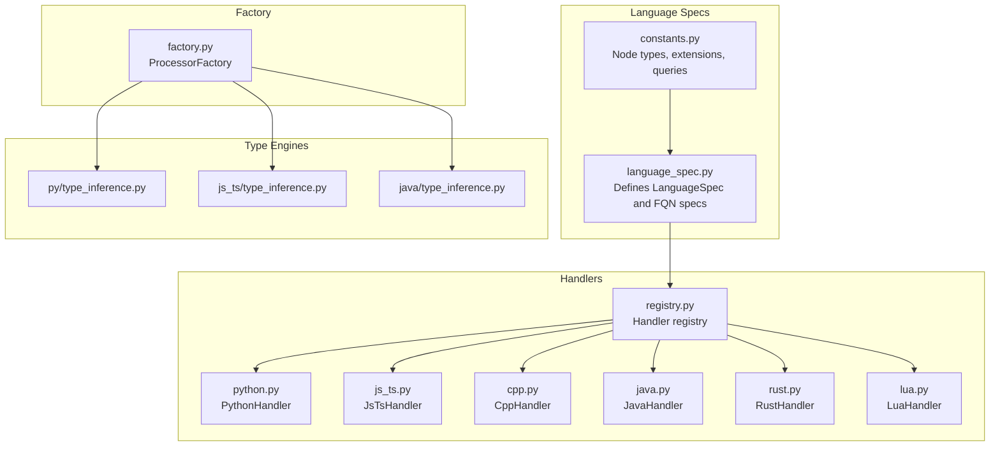
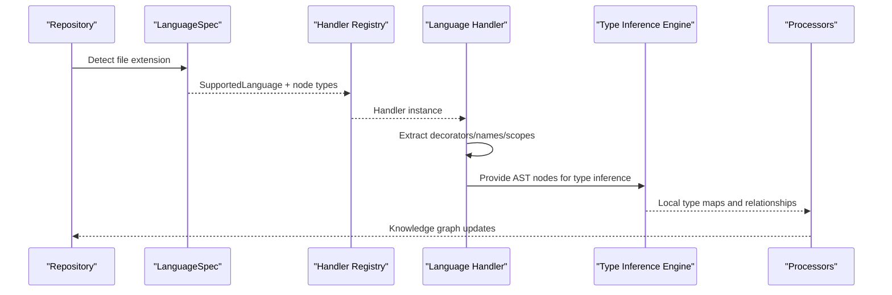
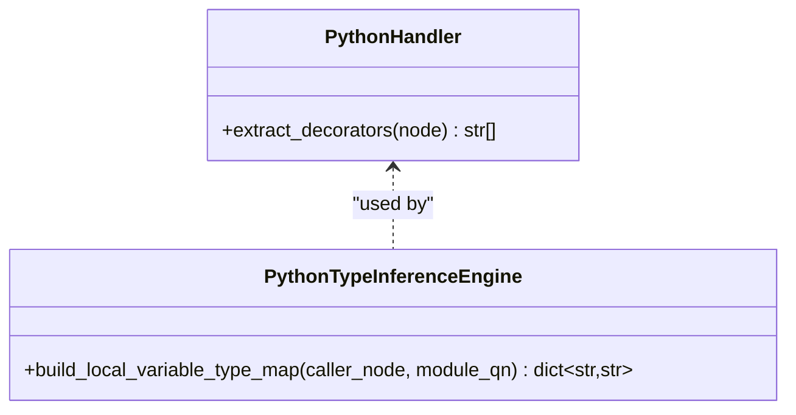
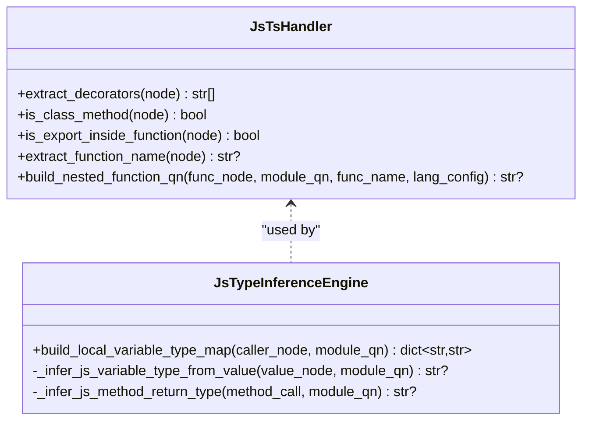
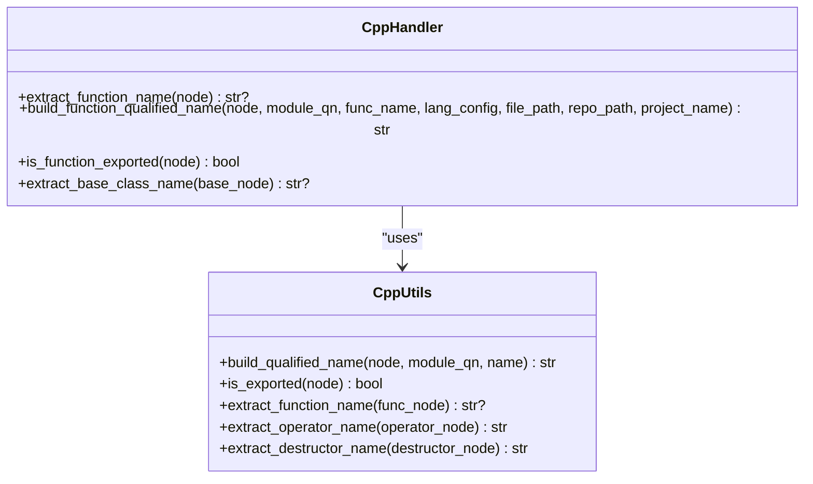
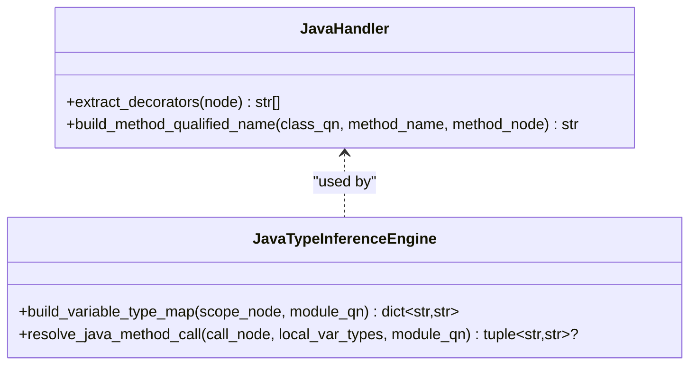
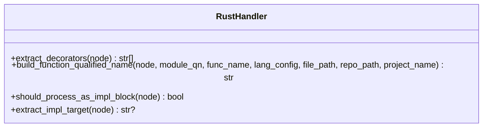
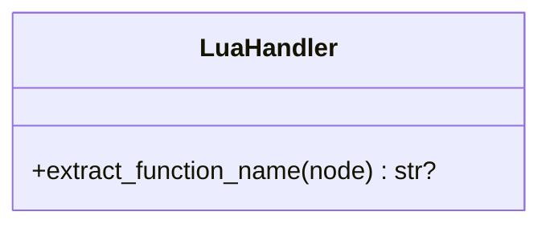
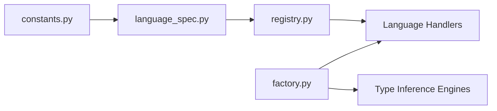

# Supported Languages Reference

<cite>
**Referenced Files in This Document**
- [language_spec.py](file://codebase_rag/language_spec.py)
- [constants.py](file://codebase_rag/constants.py)
- [registry.py](file://codebase_rag/parsers/handlers/registry.py)
- [python.py](file://codebase_rag/parsers/handlers/python.py)
- [js_ts.py](file://codebase_rag/parsers/handlers/js_ts.py)
- [cpp.py](file://codebase_rag/parsers/handlers/cpp.py)
- [java.py](file://codebase_rag/parsers/handlers/java.py)
- [rust.py](file://codebase_rag/parsers/handlers/rust.py)
- [lua.py](file://codebase_rag/parsers/handlers/lua.py)
- [factory.py](file://codebase_rag/parsers/factory.py)
- [type_inference.py](file://codebase_rag/parsers/py/type_inference.py)
- [type_inference.py](file://codebase_rag/parsers/js_ts/type_inference.py)
- [type_inference.py](file://codebase_rag/parsers/java/type_inference.py)
- [utils.py](file://codebase_rag/parsers/cpp/utils.py)
</cite>

## Table of Contents
1. [Introduction](#introduction)
2. [Project Structure](#project-structure)
3. [Core Components](#core-components)
4. [Architecture Overview](#architecture-overview)
5. [Detailed Component Analysis](#detailed-component-analysis)
6. [Dependency Analysis](#dependency-analysis)
7. [Performance Considerations](#performance-considerations)
8. [Troubleshooting Guide](#troubleshooting-guide)
9. [Conclusion](#conclusion)

## Introduction
This document provides a comprehensive reference for all supported languages in Graph-Code. It covers file extensions, parsing capabilities, and language-specific features per supported language. It also explains how the system organizes language parsing via handler registries and language specifications, and outlines the knowledge graph representation of constructs such as functions, classes, modules, and calls.

## Project Structure
Graph-Code organizes language support around:
- Language specifications that define AST node types and queries for each language
- Handler classes that extract language-specific metadata (e.g., decorators, nested scopes)
- Type inference engines that infer types and relationships for supported languages
- A factory that wires processors and engines together

**Diagram sources**
- [language_spec.py](file://codebase_rag/language_spec.py#L205-L409)
- [constants.py](file://codebase_rag/constants.py#L426-L507)
- [registry.py](file://codebase_rag/parsers/handlers/registry.py#L15-L31)
- [factory.py](file://codebase_rag/parsers/factory.py#L18-L115)

**Section sources**
- [language_spec.py](file://codebase_rag/language_spec.py#L205-L409)
- [constants.py](file://codebase_rag/constants.py#L426-L507)
- [registry.py](file://codebase_rag/parsers/handlers/registry.py#L15-L31)
- [factory.py](file://codebase_rag/parsers/factory.py#L18-L115)

## Core Components
- LanguageSpec: Defines supported file extensions, AST node types for functions, classes, modules, calls, imports, and optional language-specific queries.
- FQN specs: Define how to extract names and compute module paths for fully qualified names.
- Handlers: Language-specific classes that extract decorators, determine scoping, and compute qualified names.
- Type inference engines: Per-language engines that infer types and relationships from AST nodes.
- Factory: Wires processors and engines together for ingestion.

Key responsibilities:
- File extensions and node types are defined centrally and consumed by handlers and processors.
- Handlers implement language-specific logic (e.g., decorators, nested scopes).
- Type engines traverse ASTs to infer types and method signatures.

**Section sources**
- [language_spec.py](file://codebase_rag/language_spec.py#L205-L409)
- [constants.py](file://codebase_rag/constants.py#L426-L507)
- [python.py](file://codebase_rag/parsers/handlers/python.py#L13-L22)
- [js_ts.py](file://codebase_rag/parsers/handlers/js_ts.py#L14-L115)
- [cpp.py](file://codebase_rag/parsers/handlers/cpp.py#L19-L59)
- [java.py](file://codebase_rag/parsers/handlers/java.py#L13-L28)
- [rust.py](file://codebase_rag/parsers/handlers/rust.py#L19-L70)
- [lua.py](file://codebase_rag/parsers/handlers/lua.py#L13-L25)
- [type_inference.py](file://codebase_rag/parsers/py/type_inference.py#L28-L73)
- [type_inference.py](file://codebase_rag/parsers/js_ts/type_inference.py#L13-L197)
- [type_inference.py](file://codebase_rag/parsers/java/type_inference.py#L24-L112)
- [factory.py](file://codebase_rag/parsers/factory.py#L18-L115)

## Architecture Overview
The system routes files to language handlers based on file extensions, extracts language constructs, and builds a knowledge graph of functions, classes, modules, and calls. Type inference engines enrich the graph with inferred types and relationships.

**Diagram sources**
- [language_spec.py](file://codebase_rag/language_spec.py#L411-L425)
- [registry.py](file://codebase_rag/parsers/handlers/registry.py#L28-L31)
- [factory.py](file://codebase_rag/parsers/factory.py#L49-L115)

## Detailed Component Analysis

### Python
- File extensions: .py
- Parsing capabilities:
  - Functions: function_declaration, generator_function_declaration, function_expression, lambda_expression, closure_expression
  - Classes: class_declaration, class_definition
  - Calls: call_expression, member_call_expression, field_expression
  - Imports: import_declaration, import_statement, import_from_statement, lexical_declaration, export_statement
- Language-specific features:
  - Decorators: extracted from decorated definitions
  - Nested functions: supported via handler logic
  - Type hints: handled by dedicated type inference engine
- Knowledge graph representation:
  - Functions and classes are indexed by qualified names derived from module paths
  - Calls link to resolved targets via type inference

**Diagram sources**
- [python.py](file://codebase_rag/parsers/handlers/python.py#L13-L22)
- [type_inference.py](file://codebase_rag/parsers/py/type_inference.py#L28-L73)

**Section sources**
- [language_spec.py](file://codebase_rag/language_spec.py#L206-L216)
- [constants.py](file://codebase_rag/constants.py#L452-L456)
- [python.py](file://codebase_rag/parsers/handlers/python.py#L13-L22)
- [type_inference.py](file://codebase_rag/parsers/py/type_inference.py#L28-L73)

### JavaScript / TypeScript
- File extensions: .js, .jsx, .ts, .tsx
- Parsing capabilities:
  - Functions: function_declaration, generator_function_declaration, function_expression, arrow_function, method_definition
  - Classes: class_declaration, class
  - Modules: import_statement, lexical_declaration, export_statement
  - Calls: call_expression, member_call_expression, field_expression
- Language-specific features:
  - Decorators: supported for TypeScript
  - Nested functions: computed from ancestor path parts
  - Async patterns: supported via call and return type inference
  - Interfaces and type aliases: supported via language queries
- Knowledge graph representation:
  - Qualified names built from module and nested scopes
  - Calls resolved via import mapping and method AST lookup

**Diagram sources**
- [js_ts.py](file://codebase_rag/parsers/handlers/js_ts.py#L14-L115)
- [type_inference.py](file://codebase_rag/parsers/js_ts/type_inference.py#L13-L197)

**Section sources**
- [language_spec.py](file://codebase_rag/language_spec.py#L217-L243)
- [constants.py](file://codebase_rag/constants.py#L457-L466)
- [js_ts.py](file://codebase_rag/parsers/handlers/js_ts.py#L14-L115)
- [type_inference.py](file://codebase_rag/parsers/js_ts/type_inference.py#L13-L197)

### C++
- File extensions: .cpp, .h, .hpp, .cc, .cxx, .hxx, .hh, .ixx, .cppm, .ccm
- Parsing capabilities:
  - Functions: field_declaration, declaration, function_definition, template_declaration (function), lambda_expression
  - Classes: class_specifier, struct_specifier, union_specifier, enum_specifier, template_declaration (class/struct/union/enum)
  - Calls: call_expression, binary_expression, unary_expression, update_expression, field_expression, subscript_expression, new_expression, delete_expression
  - Imports: preproc_include, template_function, declaration
- Language-specific features:
  - Templates: supported via template_declaration matching
  - Operator overloading: operator names converted to canonical names
  - Smart pointers: supported via type inference and call resolution
  - Namespaces and modules: module path detection and qualified name building
- Knowledge graph representation:
  - Qualified names built from module, namespaces, and class scopes
  - Exported symbols identified via export keywords

**Diagram sources**
- [cpp.py](file://codebase_rag/parsers/handlers/cpp.py#L19-L59)
- [utils.py](file://codebase_rag/parsers/cpp/utils.py#L14-L354)

**Section sources**
- [language_spec.py](file://codebase_rag/language_spec.py#L344-L381)
- [constants.py](file://codebase_rag/constants.py#L467-L471)
- [cpp.py](file://codebase_rag/parsers/handlers/cpp.py#L19-L59)
- [utils.py](file://codebase_rag/parsers/cpp/utils.py#L14-L354)

### Java
- File extensions: .java
- Parsing capabilities:
  - Functions: method_declaration, constructor_declaration
  - Classes: class_declaration, interface_declaration, enum_declaration, annotation_type_declaration, record_declaration
  - Modules: import statements and annotations
  - Calls: method_invocation, object_creation_expression
- Language-specific features:
  - Generics: supported via type resolver and method resolver mixins
  - Annotations: extracted from modifiers nodes
  - Streams and functional features: supported via type inference
- Knowledge graph representation:
  - Qualified names include parameter signatures for methods
  - Class hierarchy and inheritance tracked for relationships

**Diagram sources**
- [java.py](file://codebase_rag/parsers/handlers/java.py#L13-L28)
- [type_inference.py](file://codebase_rag/parsers/java/type_inference.py#L24-L112)

**Section sources**
- [language_spec.py](file://codebase_rag/language_spec.py#L310-L343)
- [constants.py](file://codebase_rag/constants.py#L482-L486)
- [java.py](file://codebase_rag/parsers/handlers/java.py#L13-L28)
- [type_inference.py](file://codebase_rag/parsers/java/type_inference.py#L24-L112)

### Rust
- File extensions: .rs
- Parsing capabilities:
  - Functions: function_item, function_signature_item, closure_expression
  - Classes: struct_item, enum_item, union_item, trait_item, type_item, impl_item
  - Modules: mod_item
  - Calls: call_expression, field_expression, scoped_identifier, macro_invocation
- Language-specific features:
  - Associated functions and impl blocks: supported via handler logic
  - Attributes/decorators: outer and inner attributes extracted
  - Lifetimes and ownership: supported conceptually via type inference
- Knowledge graph representation:
  - Qualified names built from module paths and impl targets
  - Macro invocations treated as calls

**Diagram sources**
- [rust.py](file://codebase_rag/parsers/handlers/rust.py#L19-L70)

**Section sources**
- [language_spec.py](file://codebase_rag/language_spec.py#L244-L289)
- [constants.py](file://codebase_rag/constants.py#L477-L481)
- [rust.py](file://codebase_rag/parsers/handlers/rust.py#L19-L70)

### Lua
- File extensions: .lua
- Parsing capabilities:
  - Functions: function_declaration, function_definition
  - Classes: not applicable
  - Modules: require/import-like constructs
  - Calls: call_expression, member_call_expression
- Language-specific features:
  - Closures and coroutines: supported conceptually
  - Metatables and table manipulation: supported conceptually
- Knowledge graph representation:
  - Function names extracted from identifiers or assigned expressions

**Diagram sources**
- [lua.py](file://codebase_rag/parsers/handlers/lua.py#L13-L25)

**Section sources**
- [language_spec.py](file://codebase_rag/language_spec.py#L400-L408)
- [constants.py](file://codebase_rag/constants.py#L472-L476)
- [lua.py](file://codebase_rag/parsers/handlers/lua.py#L13-L25)

### Go
- File extensions: .go
- Parsing capabilities:
  - Functions: function-related node types
  - Classes: type declarations
  - Modules: package and import statements
  - Calls: call expressions
- Status: In Development
- Knowledge graph representation:
  - Methods and type declarations supported conceptually

**Section sources**
- [language_spec.py](file://codebase_rag/language_spec.py#L290-L299)
- [constants.py](file://codebase_rag/constants.py#L487-L491)

### Scala
- File extensions: .scala, .sc
- Parsing capabilities:
  - Functions: function-related node types
  - Classes: class and type declarations
  - Modules: package and import statements
  - Calls: call expressions
- Status: In Development
- Knowledge graph representation:
  - Case classes and objects supported conceptually

**Section sources**
- [language_spec.py](file://codebase_rag/language_spec.py#L300-L309)
- [constants.py](file://codebase_rag/constants.py#L492-L496)

### C#
- File extensions: .cs
- Parsing capabilities:
  - Functions: function-related node types
  - Classes: class and interface declarations
  - Modules: using directives
  - Calls: call expressions
- Status: In Development
- Knowledge graph representation:
  - Generics and interfaces planned

**Section sources**
- [language_spec.py](file://codebase_rag/language_spec.py#L382-L391)
- [constants.py](file://codebase_rag/constants.py#L497-L501)

### PHP
- File extensions: .php
- Parsing capabilities:
  - Functions: function-related node types
  - Classes: class and function declarations
  - Modules: namespace and use statements
  - Calls: call expressions
- Status: In Development
- Knowledge graph representation:
  - Namespaces and classes supported conceptually

**Section sources**
- [language_spec.py](file://codebase_rag/language_spec.py#L392-L399)
- [constants.py](file://codebase_rag/constants.py#L502-L507)

## Dependency Analysis
The system’s language support depends on:
- Centralized language specifications and node type constants
- Handler registry mapping languages to handlers
- Type inference engines integrated via the processor factory

**Diagram sources**
- [constants.py](file://codebase_rag/constants.py#L426-L507)
- [language_spec.py](file://codebase_rag/language_spec.py#L205-L409)
- [registry.py](file://codebase_rag/parsers/handlers/registry.py#L15-L31)
- [factory.py](file://codebase_rag/parsers/factory.py#L18-L115)

**Section sources**
- [constants.py](file://codebase_rag/constants.py#L426-L507)
- [language_spec.py](file://codebase_rag/language_spec.py#L205-L409)
- [registry.py](file://codebase_rag/parsers/handlers/registry.py#L15-L31)
- [factory.py](file://codebase_rag/parsers/factory.py#L18-L115)

## Performance Considerations
- Single-pass traversal for type inference reduces repeated AST scans.
- LRU caching of handlers minimizes instantiation overhead.
- Modular design allows incremental improvements per language without global changes.

[No sources needed since this section provides general guidance]

## Troubleshooting Guide
Common issues and resolutions:
- Unsupported language or missing grammar: Add grammar via CLI and update language config.
- Misclassified node types: Review and adjust language config entries.
- Missing or incorrect class/function/call types: Verify node type mappings and update accordingly.
- Orphaned grammar modules: Use cleanup command to remove unused submodules.

**Section sources**
- [language_spec.py](file://codebase_rag/language_spec.py#L411-L425)
- [constants.py](file://codebase_rag/constants.py#L426-L507)

## Conclusion
Graph-Code provides robust, extensible language support through centralized specifications, modular handlers, and specialized type inference engines. While most languages are fully supported, several are marked as “In Development” and will gain deeper features over time. The handler registry and factory ensure consistent processing across languages, enabling accurate knowledge graph construction.