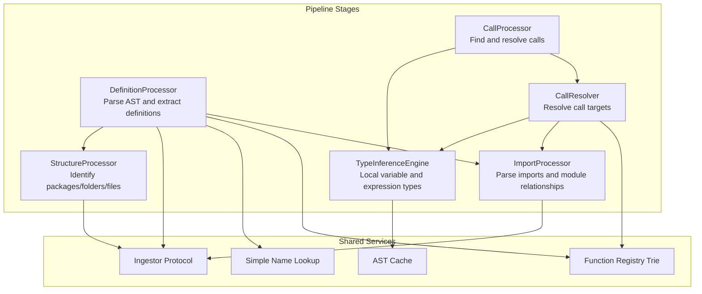
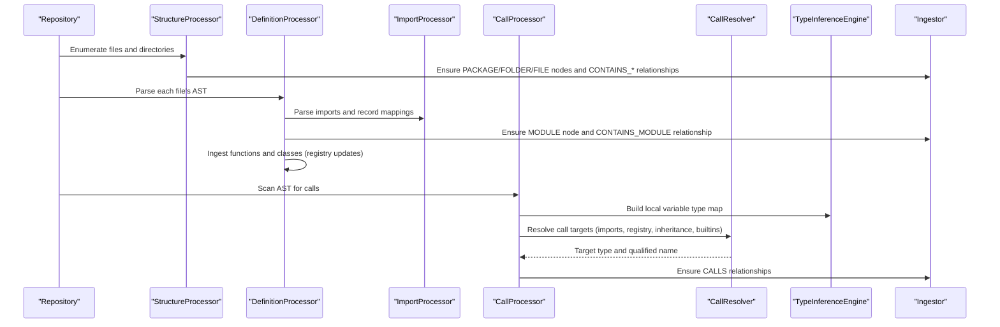
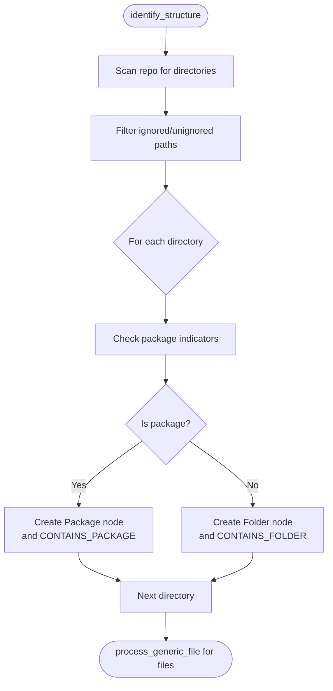
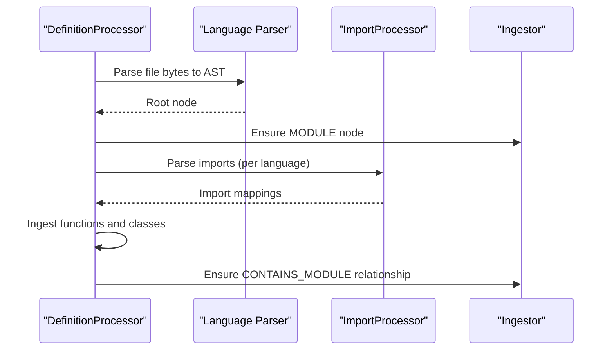
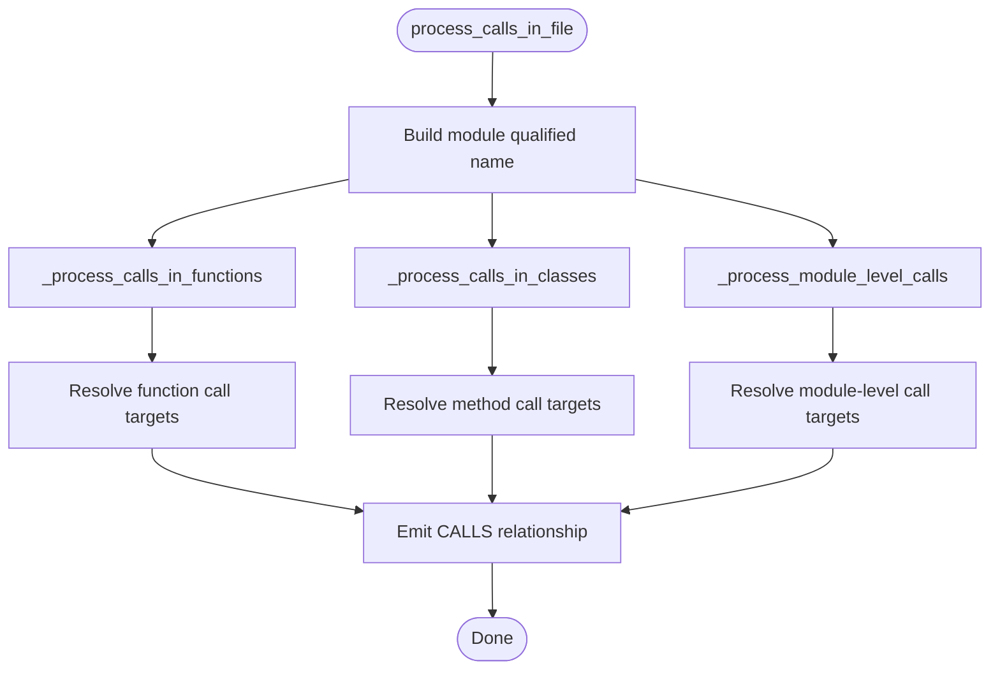
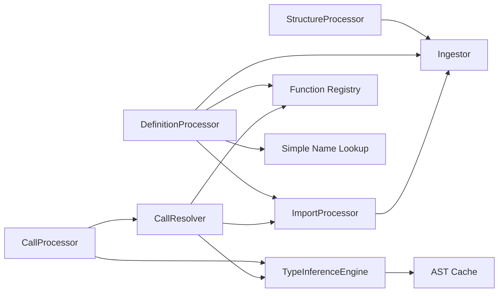

# AST Processing Pipeline

<cite>
**Referenced Files in This Document**
- [structure_processor.py](file://codebase_rag/parsers/structure_processor.py)
- [definition_processor.py](file://codebase_rag/parsers/definition_processor.py)
- [call_processor.py](file://codebase_rag/parsers/call_processor.py)
- [type_inference.py](file://codebase_rag/parsers/type_inference.py)
- [factory.py](file://codebase_rag/parsers/factory.py)
- [import_processor.py](file://codebase_rag/parsers/import_processor.py)
- [call_resolver.py](file://codebase_rag/parsers/call_resolver.py)
- [function_ingest.py](file://codebase_rag/parsers/function_ingest.py)
- [class_ingest/mixin.py](file://codebase_rag/parsers/class_ingest/mixin.py)
- [handlers/base.py](file://codebase_rag/parsers/handlers/base.py)
- [test_structure_processor.py](file://codebase_rag/tests/test_structure_processor.py)
</cite>

## Table of Contents
1. [Introduction](#introduction)
2. [Project Structure](#project-structure)
3. [Core Components](#core-components)
4. [Architecture Overview](#architecture-overview)
5. [Detailed Component Analysis](#detailed-component-analysis)
6. [Dependency Analysis](#dependency-analysis)
7. [Performance Considerations](#performance-considerations)
8. [Troubleshooting Guide](#troubleshooting-guide)
9. [Conclusion](#conclusion)

## Introduction
This document explains the Abstract Syntax Tree (AST) processing pipeline used to transform raw AST nodes into structured knowledge graph entities. It covers the sequential stages from file discovery and structure identification to definition extraction, call analysis, and type inference. The pipeline integrates multiple processors that collaborate via shared registries and an ingestor interface to produce nodes (files, modules, packages, functions, classes, methods) and relationships (contains, defines, imports, calls) representing the codebase’s structure and behavior.

## Project Structure
The AST pipeline is organized around modular processors that handle distinct phases of AST analysis:
- StructureProcessor: Discovers and models repository structure (packages, folders, files).
- DefinitionProcessor: Parses ASTs and extracts definitions (modules, functions, classes, methods).
- CallProcessor: Identifies function and method calls across files and resolves targets.
- TypeInferenceEngine: Provides per-language type inference for local variables and expressions.
- ImportProcessor: Parses import statements and creates module relationships.
- CallResolver: Resolves call targets using imports, registries, and inheritance.
- Factory: Creates and wires processors with shared services and registries.
- Handlers and Mixins: Language-specific helpers for name resolution and ingestion.

**Diagram sources**
- [structure_processor.py](file://codebase_rag/parsers/structure_processor.py#L39-L133)
- [definition_processor.py](file://codebase_rag/parsers/definition_processor.py#L53-L140)
- [import_processor.py](file://codebase_rag/parsers/import_processor.py#L60-L134)
- [type_inference.py](file://codebase_rag/parsers/type_inference.py#L21-L125)
- [call_processor.py](file://codebase_rag/parsers/call_processor.py#L20-L74)
- [call_resolver.py](file://codebase_rag/parsers/call_resolver.py#L16-L74)
- [factory.py](file://codebase_rag/parsers/factory.py#L18-L116)

**Section sources**
- [structure_processor.py](file://codebase_rag/parsers/structure_processor.py#L1-L133)
- [definition_processor.py](file://codebase_rag/parsers/definition_processor.py#L1-L193)
- [factory.py](file://codebase_rag/parsers/factory.py#L1-L116)

## Core Components
- StructureProcessor: Builds the repository’s structural hierarchy and ensures nodes/relationships for packages, folders, and files.
- DefinitionProcessor: Parses ASTs, registers modules, and ingests functions/classes/methods; also parses imports and external dependencies.
- ImportProcessor: Extracts import declarations per language and resolves module paths, creating IMPORTS relationships.
- CallProcessor: Scans ASTs for function and method calls, builds local type maps, and records CALLS relationships.
- TypeInferenceEngine: Provides language-specific type inference engines and a unified interface for building local variable type maps.
- CallResolver: Resolves call targets using imports, registries, wildcards, inheritance, and built-in/operator mappings.
- Factory: Centralized construction of processors with shared registries and caches.

**Section sources**
- [structure_processor.py](file://codebase_rag/parsers/structure_processor.py#L12-L133)
- [definition_processor.py](file://codebase_rag/parsers/definition_processor.py#L25-L193)
- [import_processor.py](file://codebase_rag/parsers/import_processor.py#L25-L134)
- [call_processor.py](file://codebase_rag/parsers/call_processor.py#L20-L364)
- [type_inference.py](file://codebase_rag/parsers/type_inference.py#L21-L135)
- [call_resolver.py](file://codebase_rag/parsers/call_resolver.py#L16-L704)
- [factory.py](file://codebase_rag/parsers/factory.py#L18-L116)

## Architecture Overview
The pipeline proceeds in ordered stages:
1. Structure identification: Packages and folders are detected and linked to the project.
2. Definition extraction: ASTs are parsed to discover modules, functions, classes, and methods; imports are recorded.
3. Call analysis: Calls are identified and resolved to concrete definitions or built-ins/operators.
4. Type inference: Local variable and expression types inform call resolution and chained calls.

**Diagram sources**
- [structure_processor.py](file://codebase_rag/parsers/structure_processor.py#L39-L133)
- [definition_processor.py](file://codebase_rag/parsers/definition_processor.py#L53-L140)
- [import_processor.py](file://codebase_rag/parsers/import_processor.py#L60-L134)
- [call_processor.py](file://codebase_rag/parsers/call_processor.py#L49-L74)
- [call_resolver.py](file://codebase_rag/parsers/call_resolver.py#L46-L71)
- [type_inference.py](file://codebase_rag/parsers/type_inference.py#L103-L125)

## Detailed Component Analysis

### StructureProcessor
Responsibilities:
- Detects packages by language-specific indicators and creates Package nodes.
- Creates Folder nodes for directories and links them to parents.
- Ensures File nodes and CONTAINS_FILE relationships.
- Maintains structural_elements mapping for parent container qualification.

Key behaviors:
- Uses package_indicators from language queries to detect packages.
- Determines parent identifiers (Project, Package, Folder) based on structural_elements.
- Emits batches via IngestorProtocol for nodes and relationships.

**Diagram sources**
- [structure_processor.py](file://codebase_rag/parsers/structure_processor.py#L39-L109)

**Section sources**
- [structure_processor.py](file://codebase_rag/parsers/structure_processor.py#L12-L133)
- [test_structure_processor.py](file://codebase_rag/tests/test_structure_processor.py#L58-L342)

### DefinitionProcessor
Responsibilities:
- Parses ASTs per language and constructs Module nodes.
- Registers imports and external dependencies.
- Ingests functions and classes (including language-specific extras).
- Establishes CONTAINS_MODULE relationships.

Processing highlights:
- Builds module qualified names from repo path and file suffix.
- Calls ingest mixins for functions, classes, and language-specific constructs.
- Parses dependencies and records DEPENDS_ON_EXTERNAL relationships.

**Diagram sources**
- [definition_processor.py](file://codebase_rag/parsers/definition_processor.py#L53-L140)
- [import_processor.py](file://codebase_rag/parsers/import_processor.py#L60-L134)

**Section sources**
- [definition_processor.py](file://codebase_rag/parsers/definition_processor.py#L25-L193)
- [function_ingest.py](file://codebase_rag/parsers/function_ingest.py#L58-L295)
- [class_ingest/mixin.py](file://codebase_rag/parsers/class_ingest/mixin.py#L71-L164)

### ImportProcessor
Responsibilities:
- Parses import statements per language (Python, JS/TS, Java, Rust, Go, C++, Lua).
- Resolves module paths (internal vs external) and records IMPORTS relationships.
- Manages import mappings and supports wildcard and aliased imports.

Key logic:
- Dispatches to language-specific parsers based on captured nodes.
- Resolves internal modules against project structure and external modules via stdlib extractor.
- Emits IMPORTS relationships for each mapped import.

**Section sources**
- [import_processor.py](file://codebase_rag/parsers/import_processor.py#L25-L800)

### CallProcessor
Responsibilities:
- Scans ASTs for function and method calls across scopes.
- Builds local variable type maps via TypeInferenceEngine.
- Resolves call targets using CallResolver (imports, registry, inheritance, builtins, operators).
- Emits CALLS relationships.

Processing stages:
- Functions: Skips methods, resolves nested qualified names, and ingests calls.
- Classes: Extracts class names and processes methods within class bodies.
- Module level: Treats module-level calls similarly to functions.

**Diagram sources**
- [call_processor.py](file://codebase_rag/parsers/call_processor.py#L49-L198)
- [call_resolver.py](file://codebase_rag/parsers/call_resolver.py#L46-L71)

**Section sources**
- [call_processor.py](file://codebase_rag/parsers/call_processor.py#L20-L364)
- [call_resolver.py](file://codebase_rag/parsers/call_resolver.py#L16-L704)

### TypeInferenceEngine
Responsibilities:
- Provides language-specific type inference engines (Python, JavaScript/TypeScript, Java, Lua).
- Exposes a unified interface to build local variable type maps for call resolution.
- Lazily initializes language engines and shares shared services.

Integration:
- Called by CallProcessor to build local variable type maps.
- Delegates to language-specific engines for variable and expression typing.

**Section sources**
- [type_inference.py](file://codebase_rag/parsers/type_inference.py#L21-L135)

### CallResolver
Responsibilities:
- Resolves call targets using multiple strategies:
  - Direct imports
  - Qualified calls (two-part and multi-part)
  - Wildcard imports
  - Same-module resolution
  - Registry trie fallback
  - Inheritance-aware method resolution
  - Built-in and operator resolution
  - Java-specific method resolution

Decision flow:
- Attempts IIFE resolution for anonymous functions.
- Handles super calls with inheritance context.
- Chains method calls by inferring object types.

**Section sources**
- [call_resolver.py](file://codebase_rag/parsers/call_resolver.py#L16-L704)

### Factory and Shared Services
Responsibilities:
- Constructs processors with shared registries and caches.
- Provides singletons for ImportProcessor, StructureProcessor, DefinitionProcessor, TypeInferenceEngine, and CallProcessor.
- Wires cross-dependencies (e.g., class_inheritance from DefinitionProcessor to CallProcessor).

**Section sources**
- [factory.py](file://codebase_rag/parsers/factory.py#L18-L116)

## Dependency Analysis
Inter-component dependencies and data flow:
- DefinitionProcessor depends on ImportProcessor for imports and on Function Registry and Simple Name Lookup for definitions.
- CallProcessor depends on CallResolver, TypeInferenceEngine, and ImportProcessor.
- CallResolver depends on ImportProcessor, TypeInferenceEngine, and Function Registry.
- TypeInferenceEngine depends on ImportProcessor and shared AST cache.
- StructureProcessor is independent and emits structural nodes/relationships.

**Diagram sources**
- [factory.py](file://codebase_rag/parsers/factory.py#L18-L116)
- [definition_processor.py](file://codebase_rag/parsers/definition_processor.py#L32-L51)
- [call_processor.py](file://codebase_rag/parsers/call_processor.py#L20-L41)
- [call_resolver.py](file://codebase_rag/parsers/call_resolver.py#L16-L28)
- [type_inference.py](file://codebase_rag/parsers/type_inference.py#L21-L43)

**Section sources**
- [factory.py](file://codebase_rag/parsers/factory.py#L18-L116)
- [definition_processor.py](file://codebase_rag/parsers/definition_processor.py#L32-L51)
- [call_processor.py](file://codebase_rag/parsers/call_processor.py#L20-L41)
- [call_resolver.py](file://codebase_rag/parsers/call_resolver.py#L16-L28)
- [type_inference.py](file://codebase_rag/parsers/type_inference.py#L21-L43)

## Performance Considerations
- Lazy initialization: TypeInferenceEngine and language-specific engines are created on demand to reduce startup overhead.
- Query-based parsing: Uses language-specific queries and cursors to efficiently capture relevant nodes.
- Minimal recursion: CallProcessor relies on tree-sitter’s capture mechanism to avoid deep recursion.
- Shared registries: Function Registry and Simple Name Lookup enable fast lookups during call resolution.
- Batched writes: IngestorProtocol batching reduces transaction overhead.
- Early exits: Many processors short-circuit when queries or parsers are unavailable.

[No sources needed since this section provides general guidance]

## Troubleshooting Guide
Common issues and resolutions:
- Unsupported language or missing parser: DefinitionProcessor logs warnings and skips unsupported files.
- Ignored directories: StructureProcessor respects exclusion/unignore lists; verify patterns.
- Import resolution failures: ImportProcessor logs warnings; check import mapping and module path resolution.
- Unresolved calls: CallResolver falls back to registry trie; verify function registration and import mappings.
- Inheritance-based method resolution: Ensure class_inheritance is populated by DefinitionProcessor before CallProcessor runs.
- Type inference mismatches: Confirm local variable type maps align with inferred types; adjust language-specific inference logic.

**Section sources**
- [definition_processor.py](file://codebase_rag/parsers/definition_processor.py#L141-L143)
- [structure_processor.py](file://codebase_rag/parsers/structure_processor.py#L42-L48)
- [import_processor.py](file://codebase_rag/parsers/import_processor.py#L132-L134)
- [call_resolver.py](file://codebase_rag/parsers/call_resolver.py#L213-L223)

## Conclusion
The AST processing pipeline transforms raw AST nodes into a structured knowledge graph by combining structural discovery, definition ingestion, import parsing, call resolution, and type inference. Its modular design enables language extensibility and efficient processing through shared registries and batched writes. Correct wiring of processors via the Factory and adherence to language-specific parsing rules ensure robust extraction of codebase structure and relationships.