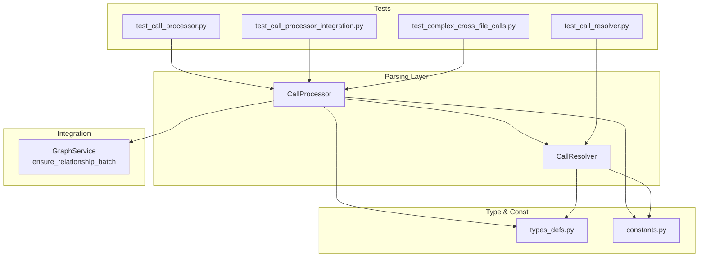
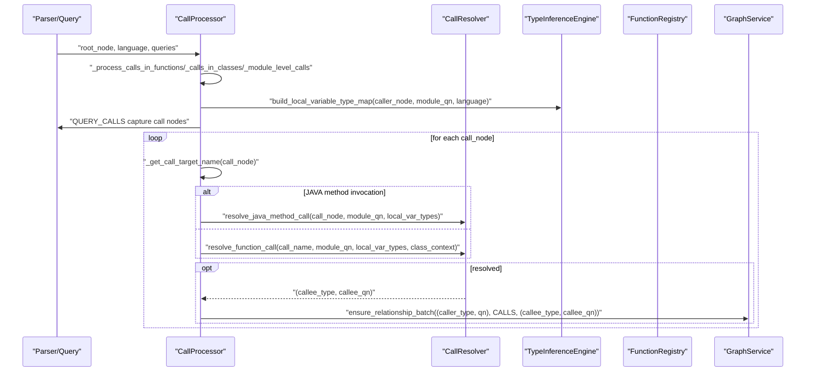
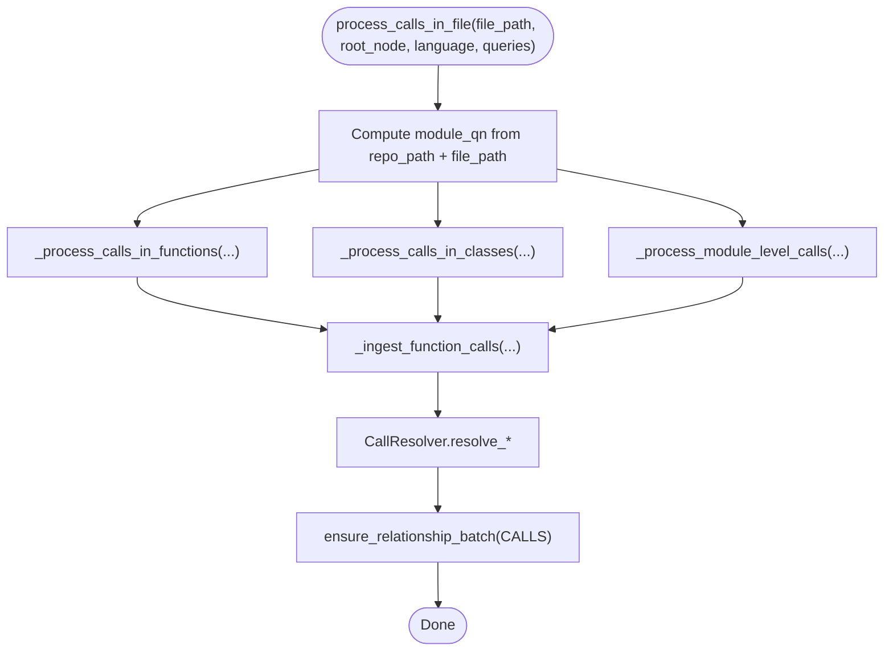
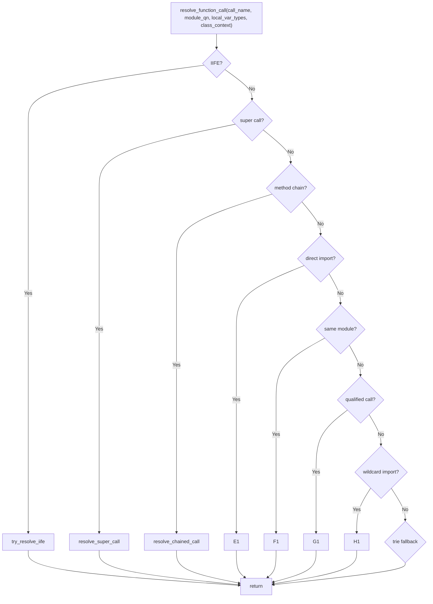
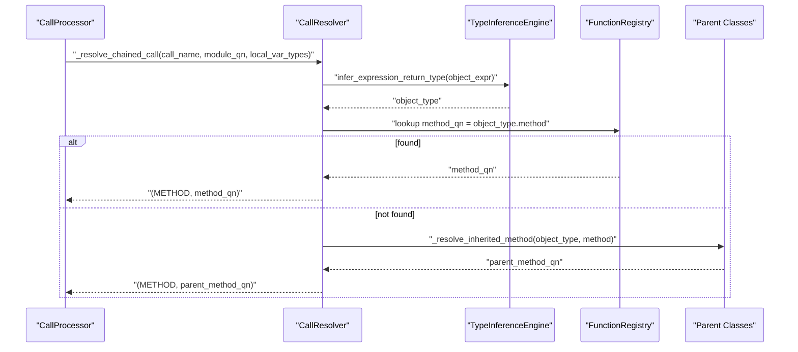
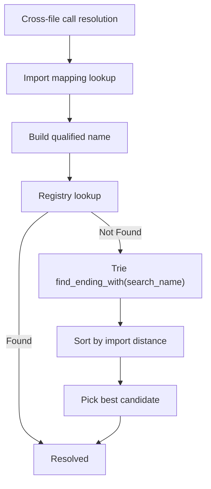
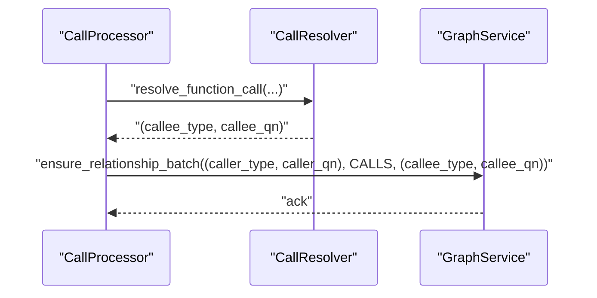
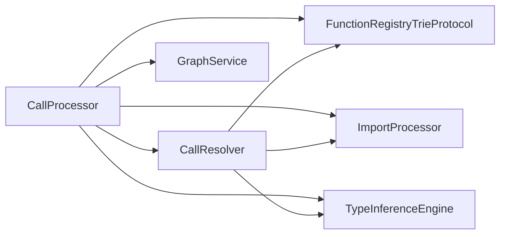

# Call Processor

<cite>
**Referenced Files in This Document**
- [call_processor.py](file://codebase_rag/parsers/call_processor.py)
- [call_resolver.py](file://codebase_rag/parsers/call_resolver.py)
- [types_defs.py](file://codebase_rag/types_defs.py)
- [constants.py](file://codebase_rag/constants.py)
- [test_call_processor.py](file://codebase_rag/tests/test_call_processor.py)
- [test_call_processor_integration.py](file://codebase_rag/tests/test_call_processor_integration.py)
- [test_call_resolver.py](file://codebase_rag/tests/test_call_resolver.py)
- [test_complex_cross_file_calls.py](file://codebase_rag/tests/test_complex_cross_file_calls.py)
- [graph_service.py](file://codebase_rag/services/graph_service.py)
</cite>

## Table of Contents
1. [Introduction](#introduction)
2. [Project Structure](#project-structure)
3. [Core Components](#core-components)
4. [Architecture Overview](#architecture-overview)
5. [Detailed Component Analysis](#detailed-component-analysis)
6. [Dependency Analysis](#dependency-analysis)
7. [Performance Considerations](#performance-considerations)
8. [Troubleshooting Guide](#troubleshooting-guide)
9. [Conclusion](#conclusion)

## Introduction
This document explains the CallProcessor component responsible for analyzing function and method calls across files and maintaining call graphs. It covers call site identification, target resolution, cross-file call mapping, and the creation of CALLS relationships between caller and callee entities. It also details the call resolver’s role in disambiguating references, handling polymorphic calls, and managing inheritance-based dispatch. Examples include call chain analysis, recursive call detection, and dynamic dispatch handling. Finally, it addresses performance optimization for large call graphs and memory management strategies.

## Project Structure
The call processing pipeline integrates with the broader parsing and ingestion framework:
- CallProcessor orchestrates call discovery and relationship creation.
- CallResolver performs target resolution using imports, type inference, inheritance, and fallback strategies.
- Types and constants define node types, relationship types, and identifiers used across the system.
- Tests validate call site extraction, cross-file resolution, chained calls, and inheritance traversal.
- Graph service handles batching and persistence of relationships.

**Diagram sources**
- [call_processor.py](file://codebase_rag/parsers/call_processor.py#L20-L364)
- [call_resolver.py](file://codebase_rag/parsers/call_resolver.py#L16-L704)
- [types_defs.py](file://codebase_rag/types_defs.py#L65-L94)
- [constants.py](file://codebase_rag/constants.py#L166-L181)
- [graph_service.py](file://codebase_rag/services/graph_service.py#L284-L314)
- [test_call_processor.py](file://codebase_rag/tests/test_call_processor.py#L60-L120)
- [test_call_processor_integration.py](file://codebase_rag/tests/test_call_processor_integration.py#L27-L60)
- [test_call_resolver.py](file://codebase_rag/tests/test_call_resolver.py#L100-L125)
- [test_complex_cross_file_calls.py](file://codebase_rag/tests/test_complex_cross_file_calls.py#L94-L152)

**Section sources**
- [call_processor.py](file://codebase_rag/parsers/call_processor.py#L20-L364)
- [call_resolver.py](file://codebase_rag/parsers/call_resolver.py#L16-L704)
- [types_defs.py](file://codebase_rag/types_defs.py#L65-L94)
- [constants.py](file://codebase_rag/constants.py#L166-L181)
- [graph_service.py](file://codebase_rag/services/graph_service.py#L284-L314)
- [test_call_processor.py](file://codebase_rag/tests/test_call_processor.py#L60-L120)
- [test_call_processor_integration.py](file://codebase_rag/tests/test_call_processor_integration.py#L27-L60)
- [test_call_resolver.py](file://codebase_rag/tests/test_call_resolver.py#L100-L125)
- [test_complex_cross_file_calls.py](file://codebase_rag/tests/test_complex_cross_file_calls.py#L94-L152)

## Core Components
- CallProcessor
  - Identifies call sites via tree-sitter queries.
  - Builds caller qualified names for functions, methods, and module-level contexts.
  - Resolves targets using CallResolver and emits CALLS relationships via the ingestor.
- CallResolver
  - Implements multi-strategy resolution: direct imports, same-module, qualified calls, wildcard imports, trie-based fallback, built-in and operator dispatch, Java-specific method resolution, and inheritance traversal.
  - Handles special cases like IIFE targets, super calls, chained calls, and Rust-style class qualification.

Key responsibilities:
- Call site identification and normalization.
- Target resolution with ambiguity handling.
- Cross-file mapping using imports and registry lookups.
- Polymorphic dispatch via inheritance and type inference.
- Dynamic dispatch for built-ins and operators.

**Section sources**
- [call_processor.py](file://codebase_rag/parsers/call_processor.py#L49-L364)
- [call_resolver.py](file://codebase_rag/parsers/call_resolver.py#L46-L704)

## Architecture Overview
End-to-end flow from parsing to graph ingestion:

**Diagram sources**
- [call_processor.py](file://codebase_rag/parsers/call_processor.py#L254-L327)
- [call_resolver.py](file://codebase_rag/parsers/call_resolver.py#L46-L704)
- [graph_service.py](file://codebase_rag/services/graph_service.py#L284-L314)

## Detailed Component Analysis

### CallProcessor: Call Site Discovery and Relationship Emission
- File-level processing
  - Computes module qualified name from repo path and file location.
  - Processes functions, classes, and module-level call sites.
- Function/method discovery
  - Uses language-specific function captures and filters out methods when appropriate.
  - Builds nested qualified names for nested functions and methods.
- Call site emission
  - Extracts call targets and resolves them via CallResolver.
  - Emits CALLS relationships using the ingestor’s batched interface.

**Diagram sources**
- [call_processor.py](file://codebase_rag/parsers/call_processor.py#L49-L198)
- [call_processor.py](file://codebase_rag/parsers/call_processor.py#L254-L327)

**Section sources**
- [call_processor.py](file://codebase_rag/parsers/call_processor.py#L49-L198)
- [call_processor.py](file://codebase_rag/parsers/call_processor.py#L254-L327)

### CallResolver: Target Resolution Strategies
- Direct imports: resolves via import mapping to fully qualified names.
- Same-module: resolves within the caller’s module.
- Qualified calls: supports dot, colon, and double-colon separators; handles Rust-style namespaces.
- Wildcard imports: expands potential candidates and matches against registry.
- Trie fallback: finds candidates ending with the call name and ranks by import distance.
- Built-in and operators: recognizes JavaScript built-ins and C++ operator names.
- Java method resolution: leverages Java-specific engine for object typing and static resolution.
- Inheritance traversal: resolves overridden methods by walking parent classes.

**Diagram sources**
- [call_resolver.py](file://codebase_rag/parsers/call_resolver.py#L46-L71)
- [call_resolver.py](file://codebase_rag/parsers/call_resolver.py#L207-L224)

**Section sources**
- [call_resolver.py](file://codebase_rag/parsers/call_resolver.py#L46-L704)

### Call Chain Analysis and Polymorphism
- Chained calls
  - Detects chained invocations and infers the type of the left-hand object to resolve the final method.
  - Falls back to inherited methods if the direct method is not found.
- Super calls
  - Resolves constructor or named methods invoked via super within a class hierarchy.
- Inheritance traversal
  - Breadth-first search through parent classes to locate overridden methods.

**Diagram sources**
- [call_resolver.py](file://codebase_rag/parsers/call_resolver.py#L533-L584)
- [call_resolver.py](file://codebase_rag/parsers/call_resolver.py#L627-L652)

**Section sources**
- [call_resolver.py](file://codebase_rag/parsers/call_resolver.py#L533-L584)
- [call_resolver.py](file://codebase_rag/parsers/call_resolver.py#L627-L652)

### Cross-File Call Mapping and Ambiguity Resolution
- Import-driven resolution
  - Uses import mappings to convert local names to fully qualified names.
- Registry-backed lookup
  - Uses trie-based suffix matching and import-distance scoring to pick the best candidate.
- Wildcard expansion
  - Expands wildcard imports to potential qualified names and checks registry.

**Diagram sources**
- [call_resolver.py](file://codebase_rag/parsers/call_resolver.py#L170-L194)
- [call_resolver.py](file://codebase_rag/parsers/call_resolver.py#L207-L224)

**Section sources**
- [call_resolver.py](file://codebase_rag/parsers/call_resolver.py#L170-L194)
- [call_resolver.py](file://codebase_rag/parsers/call_resolver.py#L207-L224)

### CALLS Relationship Creation
- Caller entity
  - Identified by label (FUNCTION, METHOD, MODULE) and qualified name.
- Callee entity
  - Identified by resolved label (FUNCTION, METHOD) and qualified name.
- Emission
  - Ensures a CALLS relationship is created between caller and callee using the ingestor’s batched API.

**Diagram sources**
- [call_processor.py](file://codebase_rag/parsers/call_processor.py#L322-L326)
- [graph_service.py](file://codebase_rag/services/graph_service.py#L284-L314)

**Section sources**
- [call_processor.py](file://codebase_rag/parsers/call_processor.py#L322-L326)
- [graph_service.py](file://codebase_rag/services/graph_service.py#L284-L314)

### Examples and Validation
- Call site identification
  - Tests cover identifier, attribute, member expressions, chained calls, and C++ operator symbols.
- Cross-file calls
  - Integration tests validate calls across modules and packages, including short function names.
- Java method invocation
  - Tests validate both object-bound and static method resolution.
- Inheritance and super
  - Tests validate constructor and method resolution via super and inheritance traversal.

**Section sources**
- [test_call_processor.py](file://codebase_rag/tests/test_call_processor.py#L60-L277)
- [test_call_processor_integration.py](file://codebase_rag/tests/test_call_processor_integration.py#L27-L185)
- [test_call_resolver.py](file://codebase_rag/tests/test_call_resolver.py#L732-L793)
- [test_complex_cross_file_calls.py](file://codebase_rag/tests/test_complex_cross_file_calls.py#L94-L187)

## Dependency Analysis
- Internal dependencies
  - CallProcessor depends on CallResolver, ImportProcessor, TypeInferenceEngine, and FunctionRegistryTrieProtocol.
  - CallResolver depends on FunctionRegistryTrieProtocol, ImportProcessor, TypeInferenceEngine, and class inheritance map.
- External integration
  - Uses tree-sitter for parsing and QueryCursor for capturing nodes.
  - Persists relationships via GraphService’s batched ingestion.

**Diagram sources**
- [call_processor.py](file://codebase_rag/parsers/call_processor.py#L35-L40)
- [call_resolver.py](file://codebase_rag/parsers/call_resolver.py#L17-L27)
- [types_defs.py](file://codebase_rag/types_defs.py#L81-L94)

**Section sources**
- [call_processor.py](file://codebase_rag/parsers/call_processor.py#L35-L40)
- [call_resolver.py](file://codebase_rag/parsers/call_resolver.py#L17-L27)
- [types_defs.py](file://codebase_rag/types_defs.py#L81-L94)

## Performance Considerations
- Large call graphs
  - Batched ingestion: GraphService batches relationship writes to reduce round-trips.
  - Trie-based fallback minimizes expensive lookups by narrowing candidates.
  - Import distance scoring prioritizes closer modules to reduce ambiguity and false positives.
- Memory management
  - Local variable type maps are constructed per caller scope and reused during resolution.
  - Inheritance traversal uses a queue with visited tracking to avoid redundant work.
  - Wildcard expansion generates potential names on demand and checks registry membership efficiently.
- Practical tips
  - Keep import mappings concise and accurate to improve resolution speed.
  - Prefer explicit imports over wildcards when possible to reduce candidate sets.
  - Maintain a clean class hierarchy to limit inheritance traversal depth.

[No sources needed since this section provides general guidance]

## Troubleshooting Guide
- Unresolved calls
  - Verify import mappings and registry entries for the target.
  - Check that the call name is correctly extracted (identifier, attribute, or operator).
- Wrong target resolution
  - Confirm local variable types and class inheritance mappings.
  - Review chained call inference and method chain detection logic.
- Java method resolution failures
  - Ensure object typing is available and static vs instance resolution is handled correctly.
- Inheritance issues
  - Validate parent-child relationships in the inheritance map.
- Batch failures
  - GraphService logs warnings for failed CALLS relationships and samples problematic pairs.

**Section sources**
- [graph_service.py](file://codebase_rag/services/graph_service.py#L299-L313)
- [test_call_processor.py](file://codebase_rag/tests/test_call_processor.py#L389-L472)
- [test_call_resolver.py](file://codebase_rag/tests/test_call_resolver.py#L795-L839)

## Conclusion
The CallProcessor and CallResolver together form a robust system for discovering call sites, resolving ambiguous references, and mapping cross-file relationships. By combining import-driven resolution, trie-based fallback, type inference, and inheritance traversal, they support polymorphic dispatch and dynamic dispatch scenarios. Integration with batched ingestion ensures scalability for large codebases, while careful design of resolution strategies and inheritance handling yields reliable call graphs.