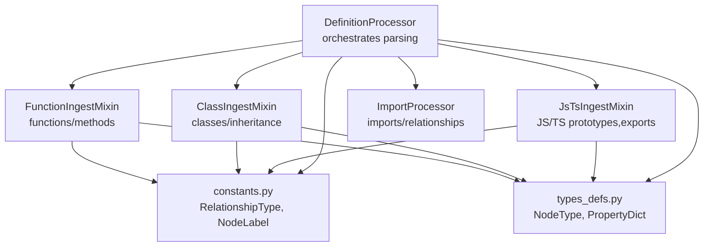
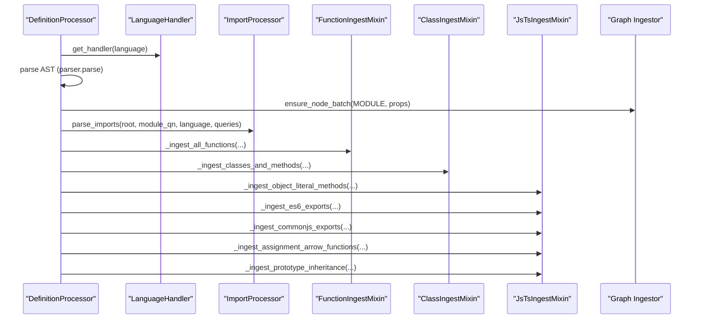
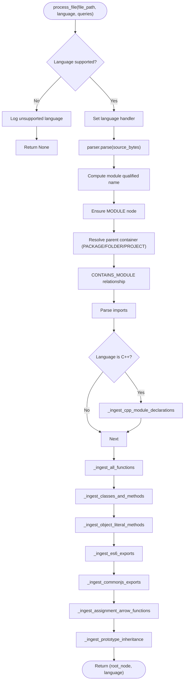
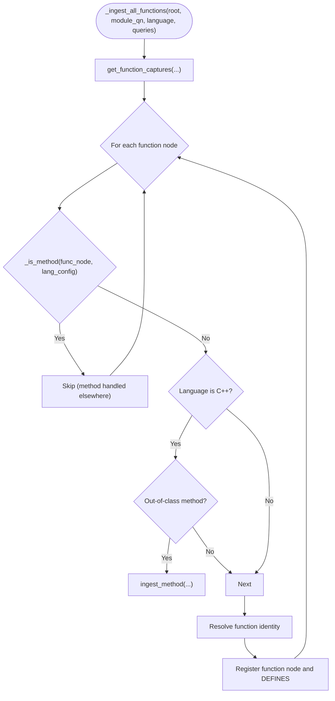
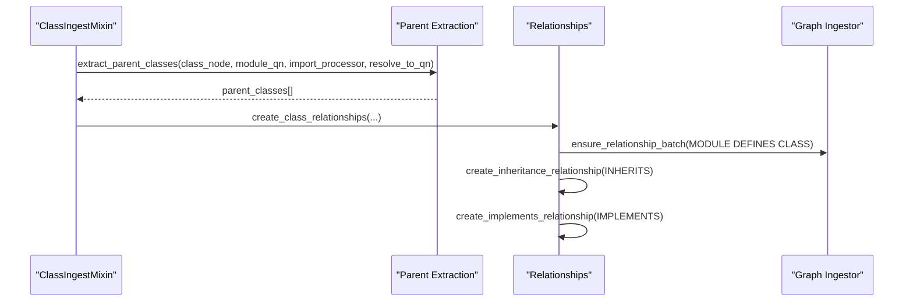
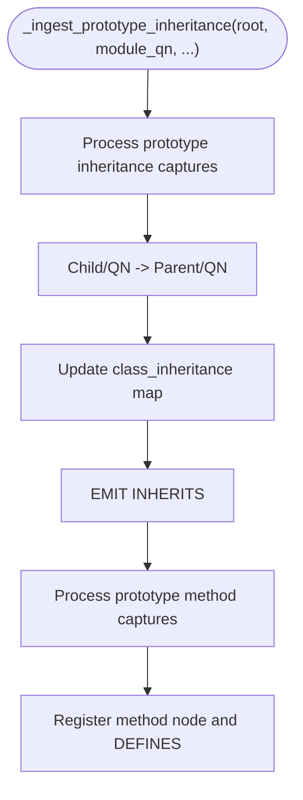
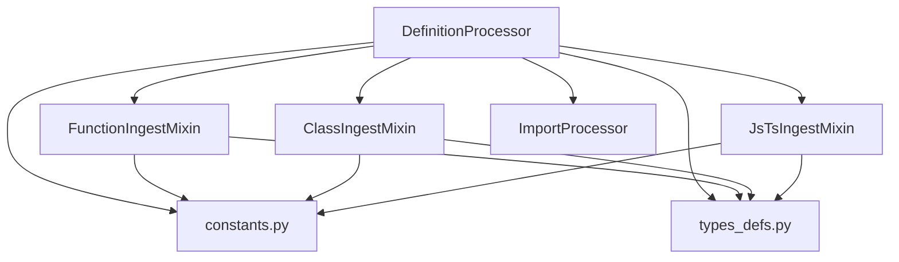

# Definition Processor

<cite>
**Referenced Files in This Document**
- [definition_processor.py](file://codebase_rag/parsers/definition_processor.py)
- [function_ingest.py](file://codebase_rag/parsers/function_ingest.py)
- [class_ingest/mixin.py](file://codebase_rag/parsers/class_ingest/mixin.py)
- [class_ingest/relationships.py](file://codebase_rag/parsers/class_ingest/relationships.py)
- [js_ts/ingest.py](file://codebase_rag/parsers/js_ts/ingest.py)
- [import_processor.py](file://codebase_rag/parsers/import_processor.py)
- [constants.py](file://codebase_rag/constants.py)
- [types_defs.py](file://codebase_rag/types_defs.py)
- [utils.py](file://codebase_rag/parsers/utils.py)
</cite>

## Table of Contents
1. [Introduction](#introduction)
2. [Project Structure](#project-structure)
3. [Core Components](#core-components)
4. [Architecture Overview](#architecture-overview)
5. [Detailed Component Analysis](#detailed-component-analysis)
6. [Dependency Analysis](#dependency-analysis)
7. [Performance Considerations](#performance-considerations)
8. [Troubleshooting Guide](#troubleshooting-guide)
9. [Conclusion](#conclusion)

## Introduction
This document explains the DefinitionProcessor component responsible for extracting and processing code definitions across multiple programming languages. It covers how AST nodes are analyzed for classes, functions, methods, and properties; how qualified names are resolved; how inheritance and relationships are mapped; and how entities are created and linked across files. It also documents cross-language patterns for prototype-based inheritance in JavaScript/TypeScript and outlines method resolution and property detection strategies.

## Project Structure
DefinitionProcessor orchestrates parsing and ingestion across language-specific mixins and utilities:
- DefinitionProcessor coordinates parsing per file and delegates to language-specific ingestion mixins.
- FunctionIngestMixin handles function and method discovery and registration.
- ClassIngestMixin discovers classes, resolves identities, and creates inheritance and defines relationships.
- JsTsIngestMixin adds JavaScript/TypeScript-specific object literal methods, prototype inheritance, and ES6/CommonJS exports.
- ImportProcessor parses import statements and creates IMPORTS relationships.
- Shared constants and types define node labels, relationship types, and data structures.

**Diagram sources**
- [definition_processor.py](file://codebase_rag/parsers/definition_processor.py#L25-L192)
- [function_ingest.py](file://codebase_rag/parsers/function_ingest.py#L43-L468)
- [class_ingest/mixin.py](file://codebase_rag/parsers/class_ingest/mixin.py#L34-L289)
- [js_ts/ingest.py](file://codebase_rag/parsers/js_ts/ingest.py#L31-L633)
- [import_processor.py](file://codebase_rag/parsers/import_processor.py#L25-L925)
- [constants.py](file://codebase_rag/constants.py#L360-L420)
- [types_defs.py](file://codebase_rag/types_defs.py#L65-L94)

**Section sources**
- [definition_processor.py](file://codebase_rag/parsers/definition_processor.py#L25-L192)
- [constants.py](file://codebase_rag/constants.py#L360-L420)
- [types_defs.py](file://codebase_rag/types_defs.py#L65-L94)

## Core Components
- DefinitionProcessor: Parses a file’s AST, builds module qualified names, ensures MODULE nodes, and delegates ingestion to specialized mixins. It also handles dependencies and docstrings/decorators extraction.
- FunctionIngestMixin: Captures function definitions, resolves identities (including out-of-class C++ methods), registers functions and methods, and records DEFINES relationships.
- ClassIngestMixin: Resolves class identities, determines node types, registers classes/interfaces/enums, and creates inheritance and IMPLEMENTS relationships.
- JsTsIngestMixin: Handles object literal methods, prototype-based inheritance, ES6/CommonJS exports, and assignment arrow functions.
- ImportProcessor: Parses imports per language and emits IMPORTS relationships between modules.

Key responsibilities:
- AST node analysis for language constructs (classes, functions, methods, properties).
- Qualified name resolution using module QN and language-specific specs.
- Relationship mapping: DEFINES, INHERITS, EXTENDS, EXPORTS, IMPORTS, IMPLEMENTS.
- Entity creation for CLASS, FUNCTION, METHOD, PROPERTY nodes.
- Cross-file linking via module QN and import mapping.

**Section sources**
- [definition_processor.py](file://codebase_rag/parsers/definition_processor.py#L25-L192)
- [function_ingest.py](file://codebase_rag/parsers/function_ingest.py#L43-L468)
- [class_ingest/mixin.py](file://codebase_rag/parsers/class_ingest/mixin.py#L34-L289)
- [js_ts/ingest.py](file://codebase_rag/parsers/js_ts/ingest.py#L31-L633)
- [import_processor.py](file://codebase_rag/parsers/import_processor.py#L25-L925)

## Architecture Overview
The DefinitionProcessor runs per file and coordinates ingestion across language handlers and mixins. It ensures MODULE nodes, parses imports, and triggers language-specific ingestion routines. Relationships are emitted to the graph via the ingestor.

**Diagram sources**
- [definition_processor.py](file://codebase_rag/parsers/definition_processor.py#L52-L139)
- [function_ingest.py](file://codebase_rag/parsers/function_ingest.py#L58-L96)
- [class_ingest/mixin.py](file://codebase_rag/parsers/class_ingest/mixin.py#L71-L104)
- [js_ts/ingest.py](file://codebase_rag/parsers/js_ts/ingest.py#L197-L393)
- [import_processor.py](file://codebase_rag/parsers/import_processor.py#L60-L134)

## Detailed Component Analysis

### DefinitionProcessor
Responsibilities:
- Initialize with ingestor, repo path, project name, registries, and import processor.
- For each file: compute module qualified name, ensure MODULE node, establish CONTAINS_MODULE relationship, parse imports, and trigger language-specific ingestion.
- Handle dependencies via parse_dependencies and emit DEPENDS_ON_EXTERNAL relationships.
- Extract docstrings and decorators via the language handler.

Processing flow highlights:
- Module QN construction from project name and relative path; special handling for package init/mod files.
- Ensures MODULE node and CONTAINS_MODULE relationship with parent container (PACKAGE/FOLDER/PROJECT).
- Delegates to mixins for functions, classes, object literal methods, exports, and prototype inheritance.
- Supports C++ module declarations and missing import patterns.

**Diagram sources**
- [definition_processor.py](file://codebase_rag/parsers/definition_processor.py#L52-L139)

**Section sources**
- [definition_processor.py](file://codebase_rag/parsers/definition_processor.py#L25-L192)

### FunctionIngestMixin
Responsibilities:
- Capture function definitions via language queries.
- Resolve function identity using unified FQN resolution and fallback logic.
- Handle out-of-class C++ method definitions by converting to method registrations.
- Register functions and methods, track simple name lookup, and emit DEFINES relationships.

Key behaviors:
- Unified FQN resolution uses language-specific specs and file path to derive qualified names.
- Fallback resolution varies by language (e.g., C++ lambda naming).
- Detects methods vs free functions using parent traversal against language class node types.
- Registers function properties including start/end lines, docstrings, and decorators.

**Diagram sources**
- [function_ingest.py](file://codebase_rag/parsers/function_ingest.py#L58-L96)
- [function_ingest.py](file://codebase_rag/parsers/function_ingest.py#L97-L148)
- [function_ingest.py](file://codebase_rag/parsers/function_ingest.py#L150-L176)
- [utils.py](file://codebase_rag/parsers/utils.py#L159-L168)

**Section sources**
- [function_ingest.py](file://codebase_rag/parsers/function_ingest.py#L43-L468)
- [utils.py](file://codebase_rag/parsers/utils.py#L159-L168)

### ClassIngestMixin and Relationships
Responsibilities:
- Discover class declarations and inline modules.
- Resolve class identity using language-specific specs and repository/project context.
- Register class nodes, track simple name lookup, and emit DEFINES relationships.
- Determine class node type and handle Rust impl blocks.
- Create inheritance and IMPLEMENTS relationships and maintain class_inheritance map.

Relationship mapping:
- DEFINES: MODULE -> CLASS
- INHERITS: CLASS -> PARENT_CLASS (with type derived from registry)
- IMPLEMENTS: CLASS -> INTERFACE

**Diagram sources**
- [class_ingest/mixin.py](file://codebase_rag/parsers/class_ingest/mixin.py#L71-L163)
- [class_ingest/relationships.py](file://codebase_rag/parsers/class_ingest/relationships.py#L18-L59)

**Section sources**
- [class_ingest/mixin.py](file://codebase_rag/parsers/class_ingest/mixin.py#L34-L289)
- [class_ingest/relationships.py](file://codebase_rag/parsers/class_ingest/relationships.py#L1-L95)

### JsTsIngestMixin
Responsibilities:
- Object literal methods: detect methods in object expressions and register them under module QN.
- Prototype inheritance: capture prototype links and method assignments, registering methods and emitting INHERITS and DEFINES relationships.
- ES6/CommonJS exports: register exported functions and methods.
- Assignment arrow functions: resolve qualified names for arrow functions assigned to object members or variables.

Key mechanisms:
- Uses Tree-Sitter queries to capture constructors, method names, and function bodies.
- Builds qualified names from module QN and ancestor path parts.
- Emits relationships: INHERITS for prototype chains, DEFINES for module-to-function.

**Diagram sources**
- [js_ts/ingest.py](file://codebase_rag/parsers/js_ts/ingest.py#L54-L128)
- [js_ts/ingest.py](file://codebase_rag/parsers/js_ts/ingest.py#L129-L196)

**Section sources**
- [js_ts/ingest.py](file://codebase_rag/parsers/js_ts/ingest.py#L31-L633)

### ImportProcessor
Responsibilities:
- Parse imports per language using dedicated handlers.
- Maintain import mapping per module and resolve full names.
- Emit IMPORTS relationships between modules.

Highlights:
- Python: supports import statement and import-from statements, including aliased imports.
- JavaScript/TypeScript: internal vs external module resolution.
- Java/Rust/Go/CPP/Lua: language-specific import parsing and resolution.

**Section sources**
- [import_processor.py](file://codebase_rag/parsers/import_processor.py#L25-L925)

## Dependency Analysis
DefinitionProcessor depends on:
- Language handler selection and Tree-Sitter parser availability.
- Mixins for language-specific ingestion.
- ImportProcessor for import parsing and IMPORTS relationships.
- Constants and types for node labels and relationship types.

**Diagram sources**
- [definition_processor.py](file://codebase_rag/parsers/definition_processor.py#L25-L192)
- [constants.py](file://codebase_rag/constants.py#L360-L420)
- [types_defs.py](file://codebase_rag/types_defs.py#L65-L94)

**Section sources**
- [definition_processor.py](file://codebase_rag/parsers/definition_processor.py#L25-L192)
- [constants.py](file://codebase_rag/constants.py#L360-L420)
- [types_defs.py](file://codebase_rag/types_defs.py#L65-L94)

## Performance Considerations
- Minimize repeated Tree-Sitter parsing by reusing handlers and queries per language.
- Batch node and relationship creation via ensure_node_batch and ensure_relationship_batch to reduce overhead.
- Use simple name lookup and function registry to avoid redundant scans during method resolution and cross-file linking.
- Limit prototype and object method processing to JS/TS files to avoid unnecessary work in other languages.

## Troubleshooting Guide
Common issues and resolutions:
- Unsupported language: The processor logs a warning and returns None when a language lacks parser support.
- No parser available: Logs a warning and skips AST parsing.
- Parsing failures: Exceptions during parsing are caught and logged; the processor returns None for that file.
- Missing imports: The processor attempts to ingest missing import patterns and C++ module declarations when applicable.
- Docstring/Decorator extraction: Uses language handler methods; ensure handler is correctly selected for the language.

**Section sources**
- [definition_processor.py](file://codebase_rag/parsers/definition_processor.py#L68-L143)
- [definition_processor.py](file://codebase_rag/parsers/definition_processor.py#L173-L192)

## Conclusion
DefinitionProcessor provides a cohesive pipeline for extracting definitions across languages, resolving qualified names, and establishing relationships such as DEFINES, INHERITS, and IMPLEMENTS. By delegating to specialized mixins and leveraging shared utilities, it supports robust cross-file linking and handles complex scenarios like prototype-based inheritance in JavaScript/TypeScript and out-of-class method definitions in C++. Its modular design enables extensibility for new languages and constructs.