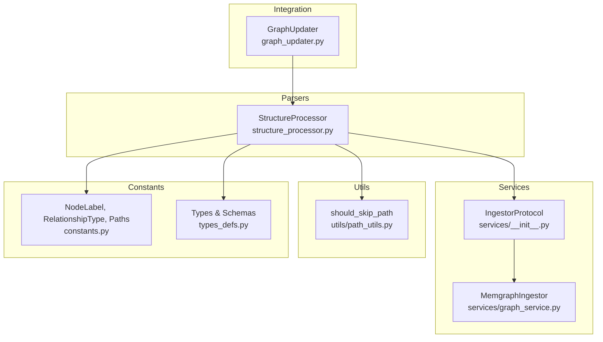
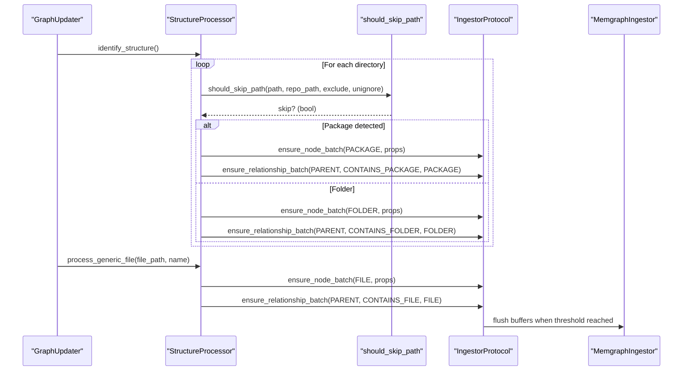
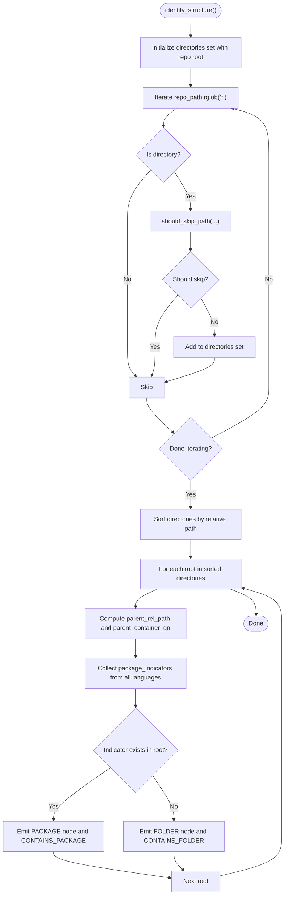
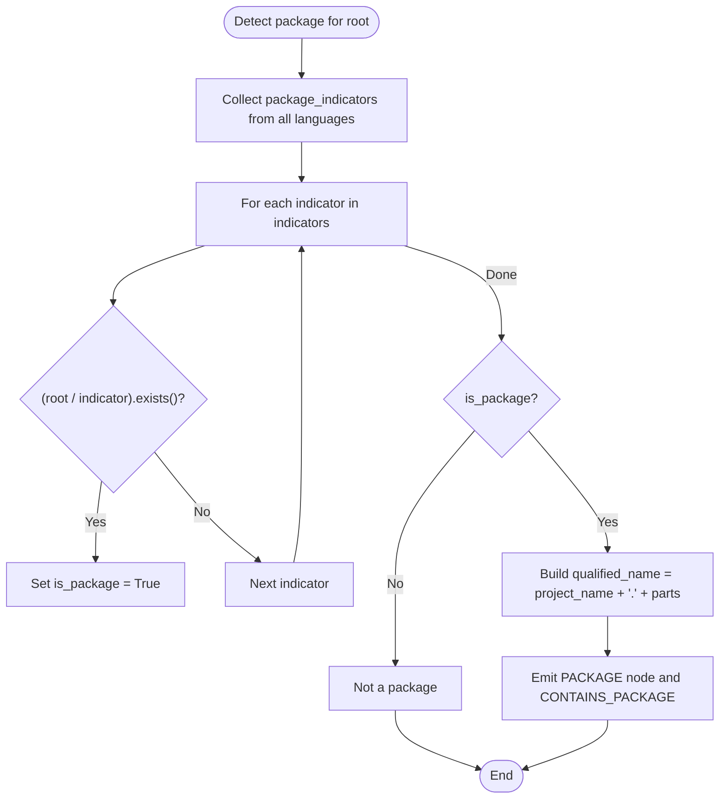
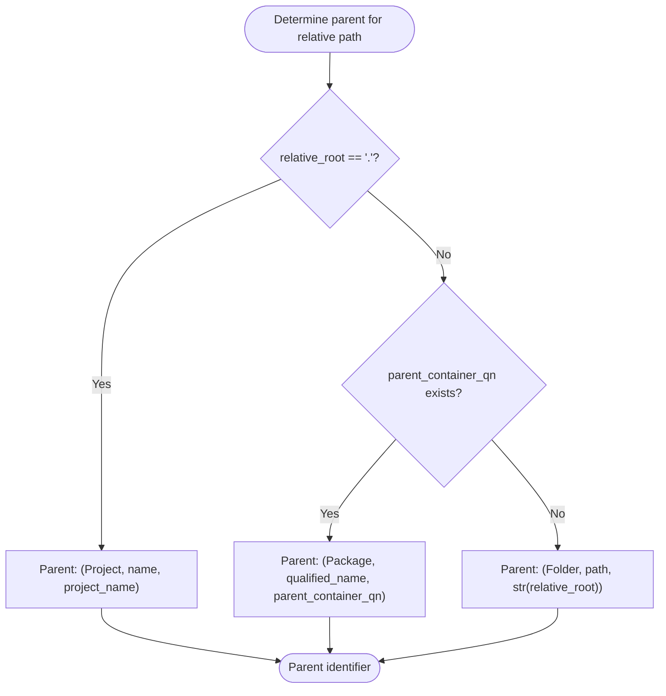
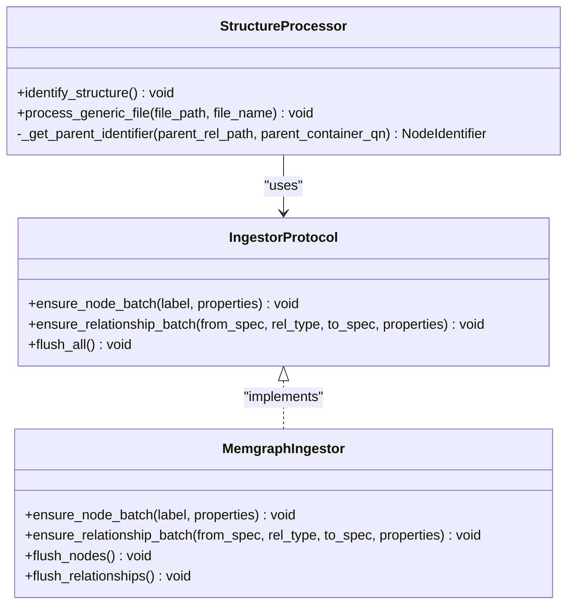
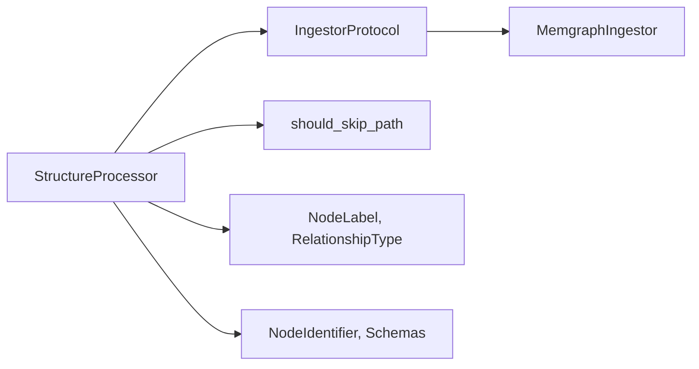

# Structure Processor

<cite>
**Referenced Files in This Document**
- [structure_processor.py](file://codebase_rag/parsers/structure_processor.py)
- [constants.py](file://codebase_rag/constants.py)
- [path_utils.py](file://codebase_rag/utils/path_utils.py)
- [types_defs.py](file://codebase_rag/types_defs.py)
- [graph_service.py](file://codebase_rag/services/graph_service.py)
- [test_structure_processor.py](file://codebase_rag/tests/test_structure_processor.py)
- [graph_updater.py](file://codebase_rag/graph_updater.py)
</cite>

## Table of Contents
1. [Introduction](#introduction)
2. [Project Structure](#project-structure)
3. [Core Components](#core-components)
4. [Architecture Overview](#architecture-overview)
5. [Detailed Component Analysis](#detailed-component-analysis)
6. [Dependency Analysis](#dependency-analysis)
7. [Performance Considerations](#performance-considerations)
8. [Troubleshooting Guide](#troubleshooting-guide)
9. [Conclusion](#conclusion)

## Introduction
This document explains the StructureProcessor component responsible for identifying and processing file system structure in a repository. It documents the directory traversal algorithm, package detection logic using indicators, parent-child relationship establishment, node creation for PROJECT, PACKAGE, FOLDER, and FILE entities, and the relationship mapping using CONTAINS_PACKAGE, CONTAINS_FOLDER, and CONTAINS_FILE. It also covers path filtering, exclusion patterns, and performance considerations for large repositories.

## Project Structure
StructureProcessor lives under the parsers module and integrates with the ingestion pipeline via an IngestorProtocol. It relies on constants for node labels, relationship types, and path utilities for filtering.

**Diagram sources**
- [structure_processor.py](file://codebase_rag/parsers/structure_processor.py#L12-L133)
- [graph_service.py](file://codebase_rag/services/graph_service.py#L49-L218)
- [path_utils.py](file://codebase_rag/utils/path_utils.py#L6-L28)
- [constants.py](file://codebase_rag/constants.py#L317-L377)
- [types_defs.py](file://codebase_rag/types_defs.py#L59-L470)
- [graph_updater.py](file://codebase_rag/graph_updater.py#L318-L349)

**Section sources**
- [structure_processor.py](file://codebase_rag/parsers/structure_processor.py#L1-L133)
- [constants.py](file://codebase_rag/constants.py#L317-L377)
- [path_utils.py](file://codebase_rag/utils/path_utils.py#L1-L28)
- [types_defs.py](file://codebase_rag/types_defs.py#L59-L470)
- [graph_service.py](file://codebase_rag/services/graph_service.py#L49-L218)
- [graph_updater.py](file://codebase_rag/graph_updater.py#L318-L349)

## Core Components
- StructureProcessor: Orchestrates directory discovery, package detection, and node/relationship emission.
- IngestorProtocol/MemgraphIngestor: Provides batching APIs to persist nodes and relationships.
- Path filtering utilities: Determine whether paths should be included/excluded.
- Constants: Define node labels, relationship types, and path patterns.

Key responsibilities:
- Traverse directories and collect candidate directories.
- Detect packages using language-specific indicators.
- Establish parent-child relationships with PROJECT, PACKAGE, or FOLDER as parents.
- Emit nodes and relationships in batches for performance.

**Section sources**
- [structure_processor.py](file://codebase_rag/parsers/structure_processor.py#L12-L133)
- [graph_service.py](file://codebase_rag/services/graph_service.py#L189-L218)
- [path_utils.py](file://codebase_rag/utils/path_utils.py#L6-L28)
- [constants.py](file://codebase_rag/constants.py#L317-L377)

## Architecture Overview
StructureProcessor participates in the ingestion pipeline by:
- Building a set of directories to scan.
- Iterating directories in sorted order to ensure parent-first processing.
- Detecting packages by checking for language-specific indicators.
- Creating nodes and relationships via the ingestor’s batch APIs.

**Diagram sources**
- [graph_updater.py](file://codebase_rag/graph_updater.py#L318-L349)
- [structure_processor.py](file://codebase_rag/parsers/structure_processor.py#L39-L133)
- [path_utils.py](file://codebase_rag/utils/path_utils.py#L6-L28)
- [graph_service.py](file://codebase_rag/services/graph_service.py#L189-L218)

## Detailed Component Analysis

### Directory Traversal Algorithm
- Collect candidate directories by walking the repository root with a glob pattern and applying path filtering.
- Sort directories to ensure parent directories are processed before their children.
- For each directory, compute its relative path and determine its parent container (PROJECT, PACKAGE, or FOLDER).

**Diagram sources**
- [structure_processor.py](file://codebase_rag/parsers/structure_processor.py#L39-L109)
- [path_utils.py](file://codebase_rag/utils/path_utils.py#L6-L28)

**Section sources**
- [structure_processor.py](file://codebase_rag/parsers/structure_processor.py#L39-L109)
- [path_utils.py](file://codebase_rag/utils/path_utils.py#L6-L28)

### Package Detection Logic Using Indicators
- Aggregates package indicators from all configured languages.
- Checks if any indicator file exists in the directory.
- If detected, creates a qualified package name by joining project name and relative path parts.

**Diagram sources**
- [structure_processor.py](file://codebase_rag/parsers/structure_processor.py#L56-L75)
- [constants.py](file://codebase_rag/constants.py#L114-L121)

**Section sources**
- [structure_processor.py](file://codebase_rag/parsers/structure_processor.py#L56-L75)
- [constants.py](file://codebase_rag/constants.py#L114-L121)

### Parent-Child Relationship Establishment
- Determines the parent identifier based on:
  - Root directory: PROJECT node.
  - Parent container has a package qualified name: PACKAGE node.
  - Otherwise: FOLDER node.
- Emits CONTAINS_PACKAGE, CONTAINS_FOLDER, or CONTAINS_FILE relationships accordingly.

**Diagram sources**
- [structure_processor.py](file://codebase_rag/parsers/structure_processor.py#L30-L37)

**Section sources**
- [structure_processor.py](file://codebase_rag/parsers/structure_processor.py#L30-L37)

### Node Creation Process
- PROJECT: Created implicitly by the ingestor when emitting the first relationship from the project name.
- PACKAGE: Emitted with properties including qualified_name, name, and path.
- FOLDER: Emitted with properties including path and name.
- FILE: Emitted with properties including path, name, and extension.

**Diagram sources**
- [structure_processor.py](file://codebase_rag/parsers/structure_processor.py#L12-L133)
- [graph_service.py](file://codebase_rag/services/graph_service.py#L49-L218)
- [types_defs.py](file://codebase_rag/types_defs.py#L59-L60)

**Section sources**
- [structure_processor.py](file://codebase_rag/parsers/structure_processor.py#L76-L132)
- [graph_service.py](file://codebase_rag/services/graph_service.py#L189-L218)
- [types_defs.py](file://codebase_rag/types_defs.py#L435-L470)

### Relationship Mapping Between Structural Elements
- CONTAINS_PACKAGE: From PROJECT or PACKAGE to PACKAGE.
- CONTAINS_FOLDER: From PROJECT or PACKAGE/FOLDER to FOLDER.
- CONTAINS_FILE: From PROJECT or PACKAGE/FOLDER to FILE.

These relationships are emitted immediately after node creation to reflect containment semantics.

**Section sources**
- [structure_processor.py](file://codebase_rag/parsers/structure_processor.py#L87-L132)
- [constants.py](file://codebase_rag/constants.py#L361-L364)

### Examples of Structural Element Identification and Batch Ingestion Patterns
- Package detection with Python’s __init__.py and Rust’s Cargo.toml across multiple languages.
- Nested packages and mixed package/folder structures.
- Generic file processing with correct parent resolution and extension extraction.

See tests for concrete examples:
- Package identification and containment relationships.
- File containment under PROJECT, PACKAGE, or FOLDER.
- Extension extraction and handling of files without extensions.

**Section sources**
- [test_structure_processor.py](file://codebase_rag/tests/test_structure_processor.py#L65-L514)

## Dependency Analysis
StructureProcessor depends on:
- IngestorProtocol for batching node and relationship emissions.
- Path filtering utilities for excluding unwanted directories and files.
- Constants for node labels, relationship types, and path patterns.
- Types for identifiers and schemas.

**Diagram sources**
- [structure_processor.py](file://codebase_rag/parsers/structure_processor.py#L12-L28)
- [graph_service.py](file://codebase_rag/services/graph_service.py#L49-L218)
- [path_utils.py](file://codebase_rag/utils/path_utils.py#L6-L28)
- [constants.py](file://codebase_rag/constants.py#L317-L377)
- [types_defs.py](file://codebase_rag/types_defs.py#L59-L470)

**Section sources**
- [structure_processor.py](file://codebase_rag/parsers/structure_processor.py#L12-L28)
- [graph_service.py](file://codebase_rag/services/graph_service.py#L49-L218)
- [path_utils.py](file://codebase_rag/utils/path_utils.py#L6-L28)
- [constants.py](file://codebase_rag/constants.py#L317-L377)
- [types_defs.py](file://codebase_rag/types_defs.py#L59-L470)

## Performance Considerations
- Batched writes: Nodes and relationships are buffered and flushed when thresholds are reached, reducing round-trips.
- Sorted directory traversal: Ensures parent-first processing, minimizing redundant lookups.
- Path filtering: Early skipping of excluded directories and binary-like files reduces IO overhead.
- Threshold-based flushing: Flush occurs when buffer sizes reach the configured batch size.

Recommendations:
- Tune batch size according to memory constraints and throughput requirements.
- Keep exclude/unignore patterns minimal and precise to avoid scanning unnecessary subtrees.
- For very large repositories, consider incremental runs and caching of previously processed directories.

**Section sources**
- [graph_service.py](file://codebase_rag/services/graph_service.py#L189-L218)
- [path_utils.py](file://codebase_rag/utils/path_utils.py#L6-L28)
- [constants.py](file://codebase_rag/constants.py#L826-L828)

## Troubleshooting Guide
Common issues and resolutions:
- Unexpectedly missing nodes:
  - Verify package indicators are present and language queries include them.
  - Confirm path filtering does not exclude the directory.
- Incorrect parent relationships:
  - Ensure parent directories are processed before children (sorting guarantees this).
  - Check that parent_container_qn is populated for nested packages.
- Excessive memory usage:
  - Adjust batch size to balance throughput and memory footprint.
  - Review exclude/unignore patterns to reduce directory traversal volume.
- Binary or cache files included:
  - Ensure IGNORE_SUFFIXES excludes unwanted file types.
  - Confirm should_skip_path logic applies to both files and directories.

Validation references:
- Tests demonstrate correct behavior for ignored directories, nested packages, and file containment.

**Section sources**
- [test_structure_processor.py](file://codebase_rag/tests/test_structure_processor.py#L197-L251)
- [path_utils.py](file://codebase_rag/utils/path_utils.py#L6-L28)
- [constants.py](file://codebase_rag/constants.py#L826-L828)

## Conclusion
StructureProcessor provides a robust, efficient mechanism for transforming repository structure into a graph model. By combining directory traversal, language-aware package detection, and strict parent-child relationship mapping, it enables downstream analyzers to reason about containment and scope. Its integration with a batching ingestor ensures scalability for large repositories while maintaining correctness through careful path filtering and deterministic traversal order.