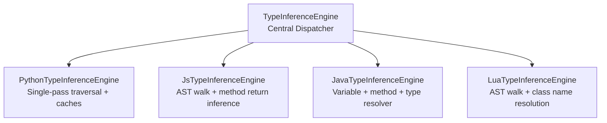
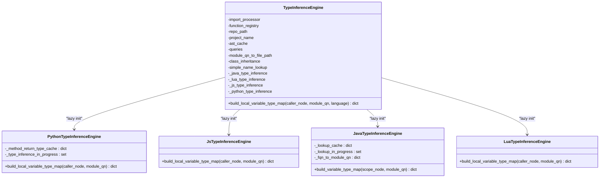
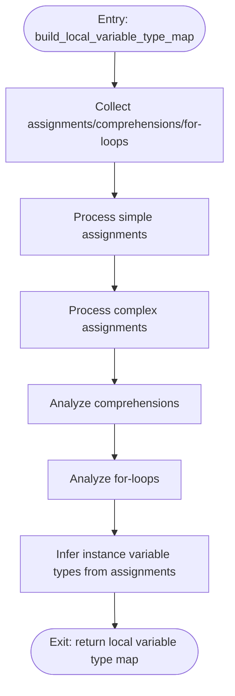
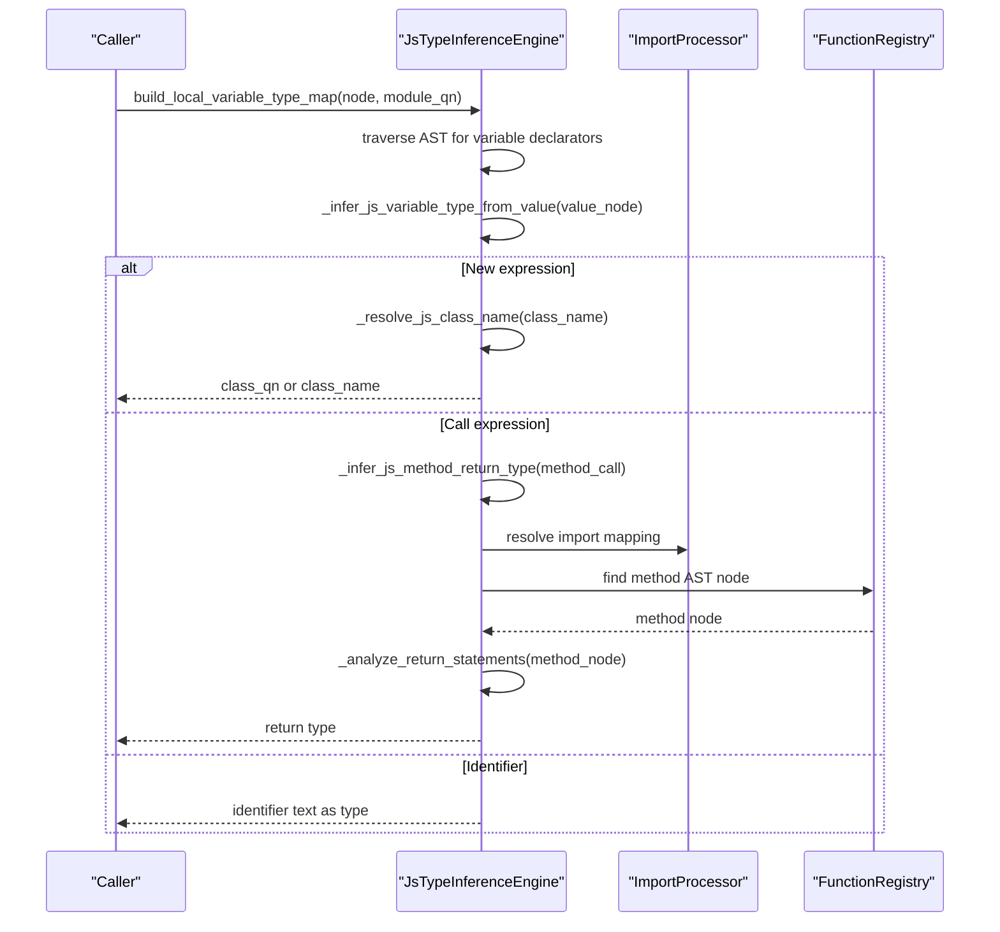
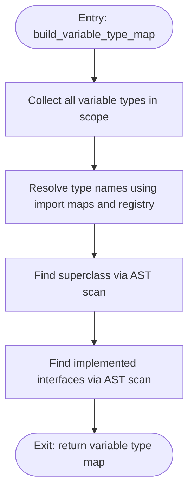
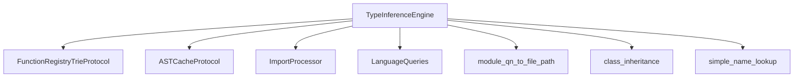

# Type Inference Engine

<cite>
**Referenced Files in This Document**
- [type_inference.py](file://codebase_rag/parsers/type_inference.py)
- [py/type_inference.py](file://codebase_rag/parsers/py/type_inference.py)
- [py/ast_analyzer.py](file://codebase_rag/parsers/py/ast_analyzer.py)
- [py/expression_analyzer.py](file://codebase_rag/parsers/py/expression_analyzer.py)
- [py/variable_analyzer.py](file://codebase_rag/parsers/py/variable_analyzer.py)
- [java/type_inference.py](file://codebase_rag/parsers/java/type_inference.py)
- [java/type_resolver.py](file://codebase_rag/parsers/java/type_resolver.py)
- [java/method_resolver.py](file://codebase_rag/parsers/java/method_resolver.py)
- [java/utils.py](file://codebase_rag/parsers/java/utils.py)
- [js_ts/type_inference.py](file://codebase_rag/parsers/js_ts/type_inference.py)
- [lua/type_inference.py](file://codebase_rag/parsers/lua/type_inference.py)
- [types_defs.py](file://codebase_rag/types_defs.py)
- [constants.py](file://codebase_rag/constants.py)
- [test_type_inference_iterative.py](file://codebase_rag/tests/test_type_inference_iterative.py)
</cite>

## Table of Contents
1. [Introduction](#introduction)
2. [Project Structure](#project-structure)
3. [Core Components](#core-components)
4. [Architecture Overview](#architecture-overview)
5. [Detailed Component Analysis](#detailed-component-analysis)
6. [Dependency Analysis](#dependency-analysis)
7. [Performance Considerations](#performance-considerations)
8. [Troubleshooting Guide](#troubleshooting-guide)
9. [Conclusion](#conclusion)

## Introduction
This document explains the TypeInferenceEngine component that orchestrates type resolution and relationship mapping across multiple programming languages in the codebase. It covers how type inference is performed per language, how unions and aliases are handled conceptually, and how the engine integrates with language-specific type systems and standard library type resolution. It also documents caching strategies, iterative initialization, and performance characteristics to guide efficient usage and troubleshooting.

## Project Structure
The TypeInferenceEngine is implemented as a central dispatcher that lazily instantiates language-specific engines and delegates type inference tasks accordingly. The relevant modules are organized by language under the parsers directory, with shared types and constants supporting cross-language operations.

**Diagram sources**
- [type_inference.py](file://codebase_rag/parsers/type_inference.py#L21-L135)
- [py/type_inference.py](file://codebase_rag/parsers/py/type_inference.py#L28-L74)
- [js_ts/type_inference.py](file://codebase_rag/parsers/js_ts/type_inference.py#L13-L198)
- [java/type_inference.py](file://codebase_rag/parsers/java/type_inference.py#L24-L113)
- [lua/type_inference.py](file://codebase_rag/parsers/lua/type_inference.py#L16-L144)

**Section sources**
- [type_inference.py](file://codebase_rag/parsers/type_inference.py#L21-L135)

## Core Components
- Central dispatcher: TypeInferenceEngine manages lazy instantiation and dispatch of type inference operations to language-specific engines.
- Python engine: Performs single-pass traversal of AST subtrees to infer parameter and local variable types, with recursion guards and caches.
- JavaScript/TypeScript engine: Walks AST nodes to infer variable types from initializers and method return types via AST lookups.
- Java engine: Collects variable types, resolves types and method calls using import maps, class inheritance, and AST scanning.
- Lua engine: Traverses AST to infer variable types from function calls and resolves class names using import mappings and registry prefixes.

Key capabilities:
- Local variable type mapping per language
- Method call return type inference (Python and JS/TS)
- Type name resolution and aliasing (Java)
- Class hierarchy and interface implementation discovery (Java)
- Lazy initialization and caching to avoid repeated computation

**Section sources**
- [type_inference.py](file://codebase_rag/parsers/type_inference.py#L103-L135)
- [py/type_inference.py](file://codebase_rag/parsers/py/type_inference.py#L60-L74)
- [js_ts/type_inference.py](file://codebase_rag/parsers/js_ts/type_inference.py#L26-L198)
- [java/type_inference.py](file://codebase_rag/parsers/java/type_inference.py#L79-L113)
- [lua/type_inference.py](file://codebase_rag/parsers/lua/type_inference.py#L27-L144)

## Architecture Overview
The engine coordinates across languages using a shared set of dependencies: import processor, function registry trie, AST cache, language queries, module-to-file mapping, class inheritance, and simple name lookup. It exposes a single entry point to build local variable type maps and defers to specialized engines.

**Diagram sources**
- [type_inference.py](file://codebase_rag/parsers/type_inference.py#L21-L135)
- [py/type_inference.py](file://codebase_rag/parsers/py/type_inference.py#L28-L74)
- [js_ts/type_inference.py](file://codebase_rag/parsers/js_ts/type_inference.py#L13-L198)
- [java/type_inference.py](file://codebase_rag/parsers/java/type_inference.py#L24-L113)
- [lua/type_inference.py](file://codebase_rag/parsers/lua/type_inference.py#L16-L144)

## Detailed Component Analysis

### TypeInferenceEngine: Central Dispatcher
Responsibilities:
- Lazily initializes language-specific engines on first access
- Dispatches build_local_variable_type_map to the appropriate engine based on language
- Provides shared resources: import processor, function registry, AST cache, queries, mappings, and lookups

Behavior highlights:
- Iterative lazy initialization ensures minimal overhead until needed
- Dispatch supports Python, JavaScript/TypeScript, Java, and Lua; unsupported languages return empty maps

Integration points:
- Uses function registry trie for method/class lookups
- Uses AST cache for fast AST retrieval
- Uses module-to-file mapping and class inheritance for Java type resolution

**Section sources**
- [type_inference.py](file://codebase_rag/parsers/type_inference.py#L44-L124)
- [test_type_inference_iterative.py](file://codebase_rag/tests/test_type_inference_iterative.py#L113-L150)

### Python Type Inference Engine
Algorithms:
- Single-pass traversal of the AST subtree rooted at the caller node to collect assignments, comprehensions, and for-loops
- Parameter type inference based on naming heuristics and available classes in the function registry
- Expression type inference for simple and complex expressions, including method call return type inference with recursion guards
- Chained method call inference by extracting the final method and inferring the object type from local variables or nested calls

Key caches and guards:
- Method return type cache to avoid recomputation
- In-progress guard to prevent infinite recursion on recursive calls

**Diagram sources**
- [py/type_inference.py](file://codebase_rag/parsers/py/type_inference.py#L60-L74)
- [py/ast_analyzer.py](file://codebase_rag/parsers/py/ast_analyzer.py#L75-L110)

**Section sources**
- [py/type_inference.py](file://codebase_rag/parsers/py/type_inference.py#L28-L74)
- [py/ast_analyzer.py](file://codebase_rag/parsers/py/ast_analyzer.py#L75-L110)
- [py/expression_analyzer.py](file://codebase_rag/parsers/py/expression_analyzer.py#L117-L136)
- [py/variable_analyzer.py](file://codebase_rag/parsers/py/variable_analyzer.py#L29-L100)

### JavaScript/TypeScript Type Inference Engine
Approach:
- Iterative AST traversal focusing on variable declarators
- Infers variable types from initializer expressions:
  - Constructor/new expressions resolve to class QNs
  - Call expressions infer types by resolving method return types via AST lookups
  - Identifier fallback returns the identifier text as a type hint
- Resolves class names using import mappings and local module scope
- Analyzes return statements in methods to determine return types

**Diagram sources**
- [js_ts/type_inference.py](file://codebase_rag/parsers/js_ts/type_inference.py#L26-L198)

**Section sources**
- [js_ts/type_inference.py](file://codebase_rag/parsers/js_ts/type_inference.py#L13-L198)

### Java Type Inference Engine
Capabilities:
- Builds variable type maps by collecting all variable declarations in a scope
- Resolves Java type names considering primitives, wrappers, arrays, generics, imports, and same-package resolution
- Resolves class hierarchy and implemented interfaces using AST scanning and class inheritance mapping
- Supports method resolution across modules with ranking based on module proximity and FQN matching

**Diagram sources**
- [java/type_inference.py](file://codebase_rag/parsers/java/type_inference.py#L79-L113)
- [java/type_resolver.py](file://codebase_rag/parsers/java/type_resolver.py#L101-L134)
- [java/method_resolver.py](file://codebase_rag/parsers/java/method_resolver.py#L135-L200)

**Section sources**
- [java/type_inference.py](file://codebase_rag/parsers/java/type_inference.py#L24-L113)
- [java/type_resolver.py](file://codebase_rag/parsers/java/type_resolver.py#L20-L134)
- [java/method_resolver.py](file://codebase_rag/parsers/java/method_resolver.py#L22-L200)
- [java/utils.py](file://codebase_rag/parsers/java/utils.py#L30-L66)

### Lua Type Inference Engine
Approach:
- Traverses AST to find variable declarations and extracts variable names and function calls
- Infers variable types from method index expressions by resolving class names using import mappings and registry prefixes
- Resolves class names by checking imports, local module scope, and method-prefixed entries in the function registry

**Section sources**
- [lua/type_inference.py](file://codebase_rag/parsers/lua/type_inference.py#L16-L144)

## Dependency Analysis
Shared dependencies and protocols:
- FunctionRegistryTrieProtocol: Provides O(k) prefix and suffix lookups for qualified names and node types
- ASTCacheProtocol: Enables fast retrieval of parsed AST roots keyed by file path
- ImportProcessor: Supplies import mappings for resolving short names to qualified names
- LanguageQueries: Language-specific Tree-sitter queries for parsing and pattern matching
- Module-to-file mapping and class inheritance: Used by Java engine for type and hierarchy resolution
- Simple name lookup: Supports quick resolution of simple names to qualified names

**Diagram sources**
- [type_inference.py](file://codebase_rag/parsers/type_inference.py#L21-L47)
- [types_defs.py](file://codebase_rag/types_defs.py#L81-L102)

**Section sources**
- [types_defs.py](file://codebase_rag/types_defs.py#L81-L102)
- [type_inference.py](file://codebase_rag/parsers/type_inference.py#L21-L47)

## Performance Considerations
- Lazy initialization: Engines are created only when accessed, reducing startup cost.
- Single-pass traversal (Python): Reduces repeated AST scans by consolidating collection and inference in one pass.
- Caching:
  - Python: Method return type cache and recursion guard prevent redundant computations.
  - Java: Lookup cache and in-progress guard mitigate repeated resolution.
- Trie-based lookups: Function registry trie enables efficient prefix/suffix searches for class and method discovery.
- AST caching: Reuse of parsed AST roots avoids reparsing files.
- Early exits: Unsupported languages return empty maps immediately.

Recommendations:
- Prefer using the central dispatcher to leverage lazy initialization.
- Reuse the function registry and AST cache across runs to maximize hit rates.
- For large codebases, pre-warm caches by triggering type inference on representative scopes.

**Section sources**
- [type_inference.py](file://codebase_rag/parsers/type_inference.py#L44-L101)
- [py/type_inference.py](file://codebase_rag/parsers/py/type_inference.py#L57-L58)
- [java/type_inference.py](file://codebase_rag/parsers/java/type_inference.py#L51-L52)

## Troubleshooting Guide
Common issues and diagnostics:
- Empty type maps for unsupported languages: The dispatcher returns an empty dictionary for languages not explicitly supported by the dispatcher.
- Python recursion errors: Recursion guard prevents infinite loops during chained method inference; if recursion occurs, inspect the guard key and in-progress set.
- Java resolution failures: Verify import mappings and module-to-file mapping; ensure class inheritance is populated for super/super calls.
- JS/TS method return inference: Confirm method AST nodes exist in the function registry and that return statements are analyzable.

Validation references:
- Lazy initialization and dispatch correctness are covered by unit tests.
- Unsupported language handling is validated by tests that expect empty maps.

**Section sources**
- [test_type_inference_iterative.py](file://codebase_rag/tests/test_type_inference_iterative.py#L113-L150)
- [test_type_inference_iterative.py](file://codebase_rag/tests/test_type_inference_iterative.py#L246-L262)

## Conclusion
The TypeInferenceEngine provides a cohesive, extensible framework for type inference across Python, JavaScript/TypeScript, Java, and Lua. By leveraging lazy initialization, caching, and language-specific analyzers, it achieves robust type resolution with strong performance characteristics. The design cleanly separates concerns between the central dispatcher and specialized engines, enabling straightforward extension to new languages and refinement of existing algorithms.