# C++ Handler

<cite>
**Referenced Files in This Document**
- [cpp.py](file://codebase_rag/parsers/handlers/cpp.py)
- [base.py](file://codebase_rag/parsers/handlers/base.py)
- [registry.py](file://codebase_rag/parsers/handlers/registry.py)
- [utils.py](file://codebase_rag/parsers/cpp/utils.py)
- [constants.py](file://codebase_rag/constants.py)
- [language_spec.py](file://codebase_rag/language_spec.py)
- [test_cpp_templates.py](file://codebase_rag/tests/test_cpp_templates.py)
- [test_cpp_smart_pointers.py](file://codebase_rag/tests/test_cpp_smart_pointers.py)
- [test_cpp_namespaces.py](file://codebase_rag/tests/test_cpp_namespaces.py)
- [test_cpp_operators_overloading.py](file://codebase_rag/tests/test_cpp_operators_overloading.py)
- [tree-sitter-cpp.txt](file://optimize/tree-sitter-cpp.txt)
</cite>

## Table of Contents
1. [Introduction](#introduction)
2. [Project Structure](#project-structure)
3. [Core Components](#core-components)
4. [Architecture Overview](#architecture-overview)
5. [Detailed Component Analysis](#detailed-component-analysis)
6. [Dependency Analysis](#dependency-analysis)
7. [Performance Considerations](#performance-considerations)
8. [Troubleshooting Guide](#troubleshooting-guide)
9. [Conclusion](#conclusion)
10. [Appendices](#appendices)

## Introduction
This document explains the C++ language handler implementation used to parse and extract semantic relationships from C++ code using Tree-sitter. It focuses on how the CppHandler processes AST nodes from the Tree-sitter C++ grammar, with special emphasis on C++-specific features such as templates, operator overloading, namespaces, modern C++ features, move semantics, smart pointers, RAII, pointer analysis, STL usage, exception handling, and preprocessor directives. It also documents the compilation model and module system integration.

## Project Structure
The C++ handler sits within the parsers/handlers layer and integrates with shared utilities and language specifications:
- Handlers: CppHandler extends the base handler and delegates to C++-specific utilities.
- Utilities: C++ parsing helpers extract names, qualify identifiers, detect exports, and handle operator/destructor naming.
- Language spec: Defines C++ node types and FQN extraction rules.
- Constants: Provides C++ node type enums, operator mappings, module-related constants, and Tree-sitter node type mappings.
- Tests: Demonstrate real-world parsing scenarios for templates, smart pointers, namespaces, and operators.

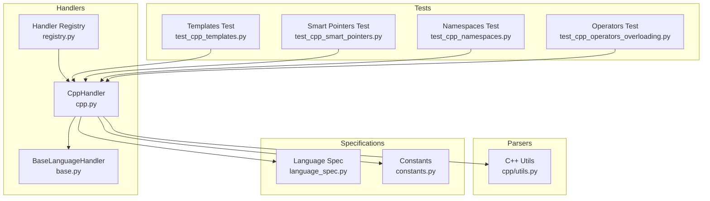

**Diagram sources**
- [cpp.py](file://codebase_rag/parsers/handlers/cpp.py#L1-L60)
- [base.py](file://codebase_rag/parsers/handlers/base.py#L1-L108)
- [registry.py](file://codebase_rag/parsers/handlers/registry.py#L1-L32)
- [utils.py](file://codebase_rag/parsers/cpp/utils.py#L1-L354)
- [language_spec.py](file://codebase_rag/language_spec.py#L148-L153)
- [constants.py](file://codebase_rag/constants.py#L1427-L1486)
- [test_cpp_templates.py](file://codebase_rag/tests/test_cpp_templates.py#L1-L200)
- [test_cpp_smart_pointers.py](file://codebase_rag/tests/test_cpp_smart_pointers.py#L1-L200)
- [test_cpp_namespaces.py](file://codebase_rag/tests/test_cpp_namespaces.py#L1-L200)
- [test_cpp_operators_overloading.py](file://codebase_rag/tests/test_cpp_operators_overloading.py#L1238-L1277)

**Section sources**
- [cpp.py](file://codebase_rag/parsers/handlers/cpp.py#L1-L60)
- [base.py](file://codebase_rag/parsers/handlers/base.py#L1-L108)
- [registry.py](file://codebase_rag/parsers/handlers/registry.py#L1-L32)
- [utils.py](file://codebase_rag/parsers/cpp/utils.py#L1-L354)
- [language_spec.py](file://codebase_rag/language_spec.py#L148-L153)
- [constants.py](file://codebase_rag/constants.py#L1427-L1486)

## Core Components
- CppHandler: Specializes function name extraction, qualified name construction, export detection, and base class name resolution for C++.
- C++ Utilities: Provide robust extraction of function/operator/destructor names, out-of-class method definitions, template types, and namespace-aware qualification.
- Language Spec: Declares C++ node types and FQN extraction rules for accurate qualified names.
- Constants: Define C++ node types, operator symbol maps, module prefixes, and Tree-sitter node mappings.

Key responsibilities:
- Extract function names from various C++ declaration forms, including templates and lambdas.
- Build qualified names considering namespaces and module boundaries.
- Detect exported declarations and classes.
- Resolve base class names, including template types.

**Section sources**
- [cpp.py](file://codebase_rag/parsers/handlers/cpp.py#L19-L60)
- [utils.py](file://codebase_rag/parsers/cpp/utils.py#L14-L125)
- [language_spec.py](file://codebase_rag/language_spec.py#L148-L153)
- [constants.py](file://codebase_rag/constants.py#L1427-L1486)

## Architecture Overview
The C++ handler participates in a layered architecture:
- Handler selection via registry maps language to handler class.
- CppHandler inherits from BaseLanguageHandler and overrides name extraction and qualification logic.
- C++ utilities encapsulate Tree-sitter-specific parsing concerns.
- Language spec and constants provide grammar and node-type definitions.

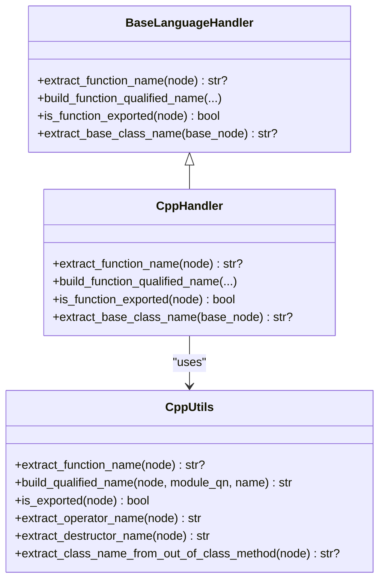

**Diagram sources**
- [base.py](file://codebase_rag/parsers/handlers/base.py#L15-L108)
- [cpp.py](file://codebase_rag/parsers/handlers/cpp.py#L19-L60)
- [utils.py](file://codebase_rag/parsers/cpp/utils.py#L14-L125)

## Detailed Component Analysis

### CppHandler
- Function name extraction:
  - Delegates to C++ utilities for most cases.
  - Provides a fallback lambda name using source coordinates when applicable.
- Qualified name building:
  - Uses language FQN specs and file path to resolve fully qualified names.
  - Falls back to C++ utilities when FQN specs are not available.
- Export detection:
  - Delegates to C++ utilities to check export keywords in parent contexts.
- Base class name resolution:
  - Handles template types by extracting identifiers from nested structures.

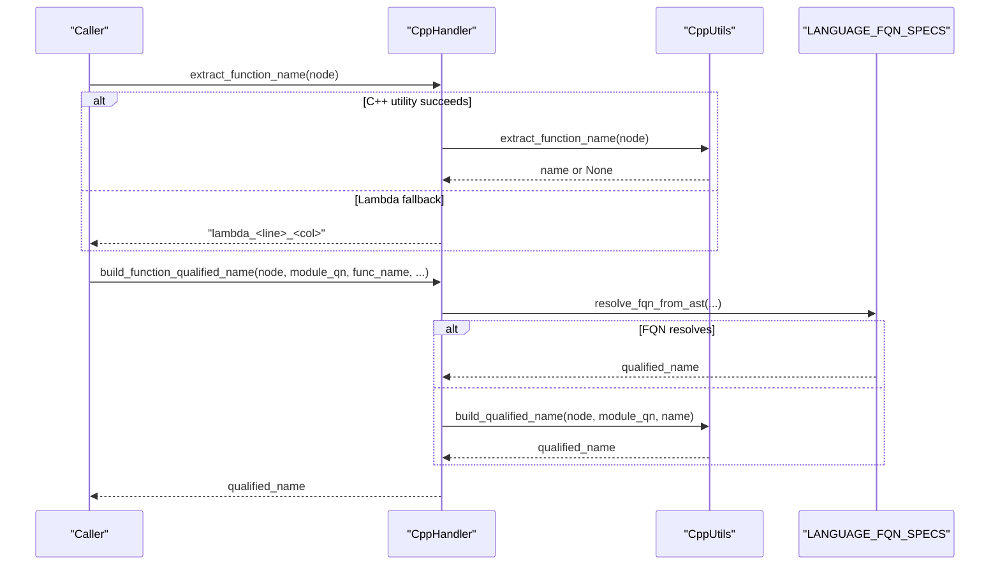

**Diagram sources**
- [cpp.py](file://codebase_rag/parsers/handlers/cpp.py#L19-L48)
- [utils.py](file://codebase_rag/parsers/cpp/utils.py#L14-L58)
- [language_spec.py](file://codebase_rag/language_spec.py#L148-L153)

**Section sources**
- [cpp.py](file://codebase_rag/parsers/handlers/cpp.py#L19-L60)

### C++ Utilities
- Function name extraction:
  - Supports function definitions, constructors/destructors, field declarations, function declarators, and template declarations.
  - Handles qualified identifiers and operator/destructor names.
- Out-of-class method definitions:
  - Detects and extracts class names for out-of-class method definitions (e.g., “Class::method”).
- Namespace-aware qualification:
  - Builds qualified names by walking up the AST and collecting namespace names.
- Export detection:
  - Walks ancestors to detect export keywords in relevant contexts.
- Operator and destructor naming:
  - Converts operator symbols to canonical names and formats destructor names.

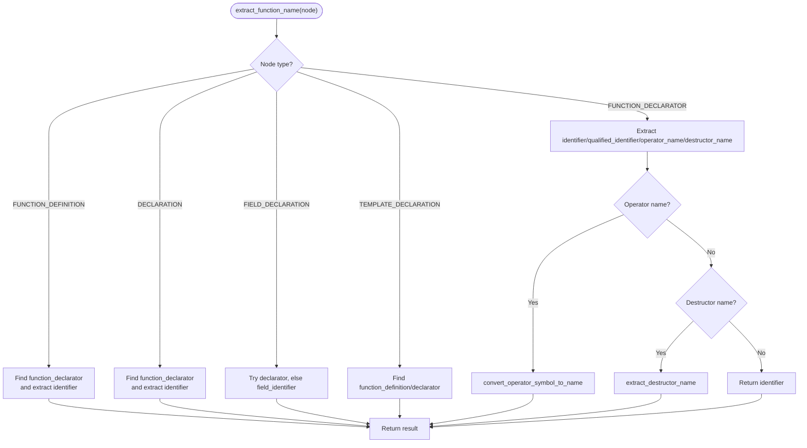

**Diagram sources**
- [utils.py](file://codebase_rag/parsers/cpp/utils.py#L237-L260)
- [utils.py](file://codebase_rag/parsers/cpp/utils.py#L106-L125)
- [utils.py](file://codebase_rag/parsers/cpp/utils.py#L119-L125)

**Section sources**
- [utils.py](file://codebase_rag/parsers/cpp/utils.py#L14-L125)
- [utils.py](file://codebase_rag/parsers/cpp/utils.py#L284-L354)

### Language Specification and Constants
- C++ node types:
  - Enumerations define translation units, namespace definitions, identifiers, declarations, function definitions, templates, operator names, destructors, and more.
- Operator symbol mapping:
  - Maps operator symbols to canonical names for consistent labeling.
- Tree-sitter node mappings:
  - Maps Tree-sitter node types to internal constants for function/class/call/module detection.
- C++ module support:
  - Recognizes module declarations, interface/implementation types, and module-related prefixes.

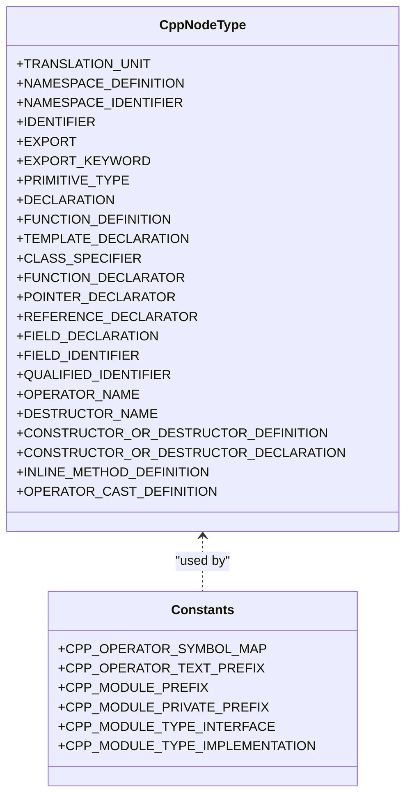

**Diagram sources**
- [constants.py](file://codebase_rag/constants.py#L1427-L1486)
- [constants.py](file://codebase_rag/constants.py#L1488-L1524)
- [constants.py](file://codebase_rag/constants.py#L1457-L1464)

**Section sources**
- [constants.py](file://codebase_rag/constants.py#L1427-L1486)
- [constants.py](file://codebase_rag/constants.py#L1488-L1524)
- [constants.py](file://codebase_rag/constants.py#L1612-L1621)
- [constants.py](file://codebase_rag/constants.py#L2674-L2709)

### Template Processing
The handler supports:
- Function templates with single/multiple type parameters, non-type parameters, and trailing return types.
- Template specialization and constrained templates (C++20).
- Default template arguments and variadic templates.
- Template template parameters.
- SFINAE patterns using enable_if and type traits.
- Template metaprogramming constructs (compile-time computation).

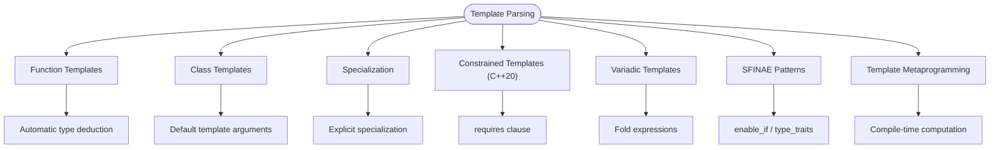

**Diagram sources**
- [test_cpp_templates.py](file://codebase_rag/tests/test_cpp_templates.py#L21-L200)

**Section sources**
- [test_cpp_templates.py](file://codebase_rag/tests/test_cpp_templates.py#L21-L200)

### Modern C++ Features: Move Semantics, Smart Pointers, RAII
- Move semantics:
  - Deleted copy constructors/assignments and defaulted move operations are handled by the handler’s name extraction and qualification logic.
- Smart pointers:
  - Unique, shared, and weak pointers are parsed and represented; custom deleters and array deleters are supported.
- RAII:
  - Destructor naming and resource management patterns are captured via destructor name extraction and function qualification.

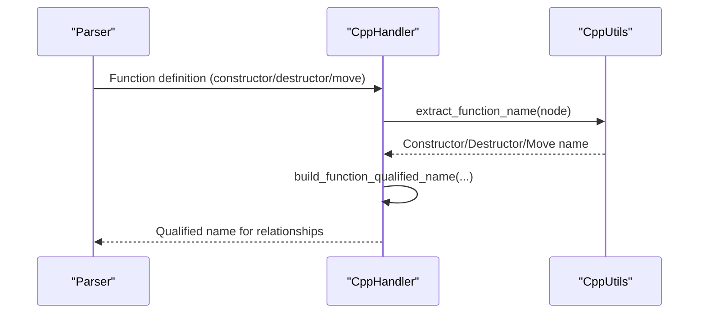

**Diagram sources**
- [utils.py](file://codebase_rag/parsers/cpp/utils.py#L119-L125)
- [cpp.py](file://codebase_rag/parsers/handlers/cpp.py#L29-L48)

**Section sources**
- [test_cpp_smart_pointers.py](file://codebase_rag/tests/test_cpp_smart_pointers.py#L22-L200)
- [utils.py](file://codebase_rag/parsers/cpp/utils.py#L119-L125)

### Namespaces and Header File Processing
- Namespace handling:
  - Qualified names are built by walking up the AST and collecting namespace identifiers.
  - Nested namespaces are supported and reflected in qualified names.
- Header files:
  - The handler treats header files as modules and applies module-aware qualification rules.

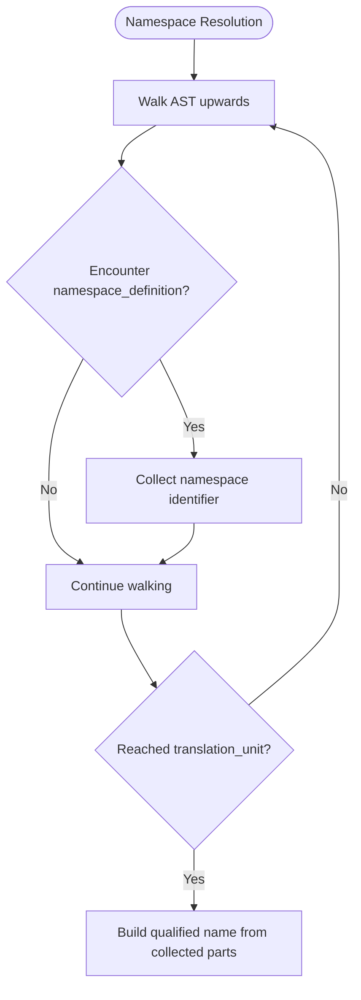

**Diagram sources**
- [utils.py](file://codebase_rag/parsers/cpp/utils.py#L14-L58)

**Section sources**
- [test_cpp_namespaces.py](file://codebase_rag/tests/test_cpp_namespaces.py#L21-L200)
- [utils.py](file://codebase_rag/parsers/cpp/utils.py#L14-L58)

### Pointer Analysis and Memory Management Patterns
- Pointer/reference declarators:
  - Detected and processed to avoid misinterpreting function names.
- Out-of-class method definitions:
  - Identified and resolved to their declaring class using qualified identifiers.
- Smart pointer usage:
  - Captured via function signatures and relationships; custom deleters supported.

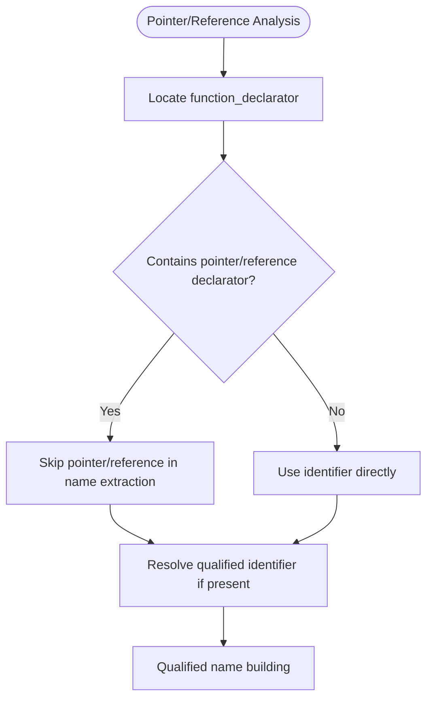

**Diagram sources**
- [utils.py](file://codebase_rag/parsers/cpp/utils.py#L127-L143)
- [utils.py](file://codebase_rag/parsers/cpp/utils.py#L284-L296)

**Section sources**
- [utils.py](file://codebase_rag/parsers/cpp/utils.py#L127-L143)
- [utils.py](file://codebase_rag/parsers/cpp/utils.py#L284-L296)

### STL Usage Analysis and Standard Library Integration
- STL containers and algorithms:
  - Templates for containers and algorithms are parsed and specialized usage is supported.
- Standard library integration:
  - Qualified names for STL types are preserved, enabling cross-file relationships.

**Section sources**
- [test_cpp_templates.py](file://codebase_rag/tests/test_cpp_templates.py#L27-L53)

### Exception Handling and Error Recovery
- Operator overloading:
  - Operators are mapped to canonical names for consistent relationship labeling.
- Fallbacks:
  - Unknown operators and destructors fall back to predefined tokens to maintain graph integrity.

**Section sources**
- [utils.py](file://codebase_rag/parsers/cpp/utils.py#L7-L11)
- [utils.py](file://codebase_rag/parsers/cpp/utils.py#L106-L125)

### Compilation Model and Preprocessor Directives
- Translation unit:
  - Root node type for top-level declarations and includes.
- Preprocessor includes:
  - Includes are recognized and can be linked to import relationships.
- Modules:
  - C++20 modules are supported with interface and implementation distinctions.

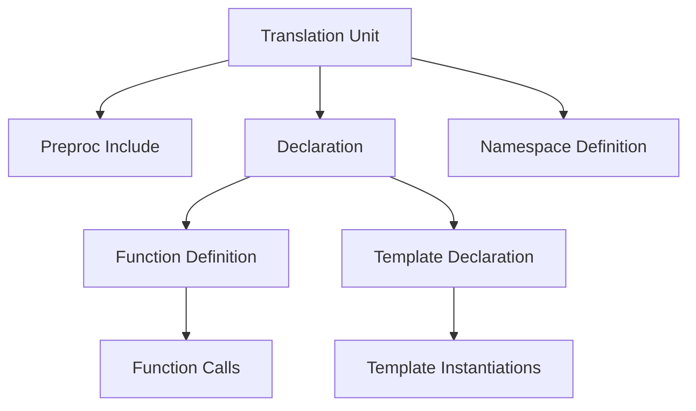

**Diagram sources**
- [constants.py](file://codebase_rag/constants.py#L1427-L1430)
- [constants.py](file://codebase_rag/constants.py#L1613-L1613)
- [constants.py](file://codebase_rag/constants.py#L2688-L2693)
- [tree-sitter-cpp.txt](file://optimize/tree-sitter-cpp.txt#L389-L413)

**Section sources**
- [constants.py](file://codebase_rag/constants.py#L1427-L1430)
- [constants.py](file://codebase_rag/constants.py#L1613-L1613)
- [constants.py](file://codebase_rag/constants.py#L2688-L2693)
- [tree-sitter-cpp.txt](file://optimize/tree-sitter-cpp.txt#L389-L413)

## Dependency Analysis
- Handler selection:
  - The registry maps SupportedLanguage.CPP to CppHandler, enabling polymorphic dispatch.
- Handler composition:
  - CppHandler depends on C++ utilities for name extraction and qualification.
- Language spec and constants:
  - Both feed node types and operator mappings to the handler and utilities.

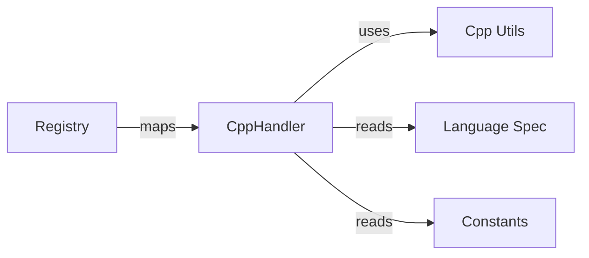

**Diagram sources**
- [registry.py](file://codebase_rag/parsers/handlers/registry.py#L15-L31)
- [cpp.py](file://codebase_rag/parsers/handlers/cpp.py#L19-L60)
- [language_spec.py](file://codebase_rag/language_spec.py#L148-L153)
- [constants.py](file://codebase_rag/constants.py#L1427-L1486)

**Section sources**
- [registry.py](file://codebase_rag/parsers/handlers/registry.py#L15-L31)
- [cpp.py](file://codebase_rag/parsers/handlers/cpp.py#L19-L60)

## Performance Considerations
- Name extraction:
  - The handler avoids deep recursion by walking parent pointers and stopping at relevant node types.
- Qualified name building:
  - Short-circuits for module files and caches namespace parts to minimize string operations.
- Export detection:
  - Stops traversal early upon encountering declaration/function/class boundaries to reduce overhead.

[No sources needed since this section provides general guidance]

## Troubleshooting Guide
Common issues and resolutions:
- Unknown operator or destructor names:
  - The handler falls back to predefined tokens; verify operator symbol mapping and ensure correct Tree-sitter grammar.
- Missing qualified names:
  - Ensure namespace definitions are present and properly structured; the handler relies on namespace identifiers in the AST.
- Export detection false negatives:
  - Confirm that export keywords appear in the expected ancestor context; the handler checks parent siblings for export markers.
- Out-of-class method definitions:
  - Verify qualified identifiers are intact; the handler extracts class names from qualified identifiers.

**Section sources**
- [utils.py](file://codebase_rag/parsers/cpp/utils.py#L7-L11)
- [utils.py](file://codebase_rag/parsers/cpp/utils.py#L106-L125)
- [utils.py](file://codebase_rag/parsers/cpp/utils.py#L60-L92)
- [utils.py](file://codebase_rag/parsers/cpp/utils.py#L305-L354)

## Conclusion
The C++ handler leverages Tree-sitter’s C++ grammar and a set of C++-specific utilities to robustly extract function names, build qualified names, detect exports, and resolve base class names. It supports modern C++ features including templates, operator overloading, namespaces, smart pointers, and modules. The design cleanly separates concerns between handler logic, utilities, and language specifications, enabling maintainability and extensibility.

[No sources needed since this section summarizes without analyzing specific files]

## Appendices

### Example Scenarios from Tests
- Templates:
  - Demonstrates function templates, specializations, constrained templates, variadic templates, SFINAE, and template metaprogramming.
- Smart Pointers:
  - Covers unique_ptr usage, custom deleters, array deleters, and RAII patterns.
- Namespaces:
  - Shows nested namespaces, cross-namespace calls, and qualified identifiers.
- Operators:
  - Validates operator overloading patterns and canonical operator naming.

**Section sources**
- [test_cpp_templates.py](file://codebase_rag/tests/test_cpp_templates.py#L21-L200)
- [test_cpp_smart_pointers.py](file://codebase_rag/tests/test_cpp_smart_pointers.py#L22-L200)
- [test_cpp_namespaces.py](file://codebase_rag/tests/test_cpp_namespaces.py#L21-L200)
- [test_cpp_operators_overloading.py](file://codebase_rag/tests/test_cpp_operators_overloading.py#L1254-L1277)