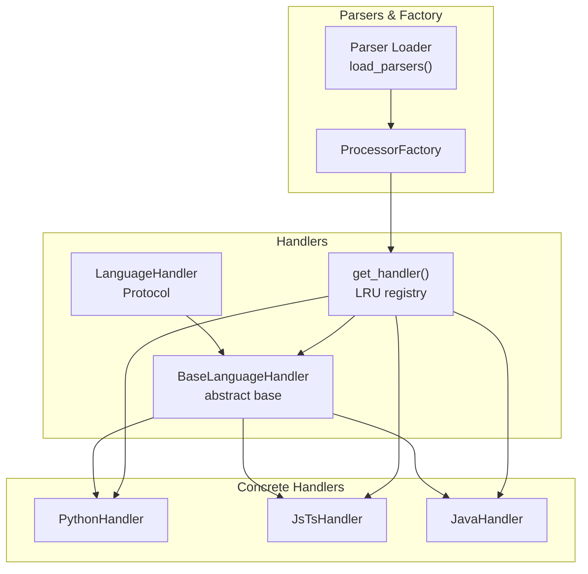
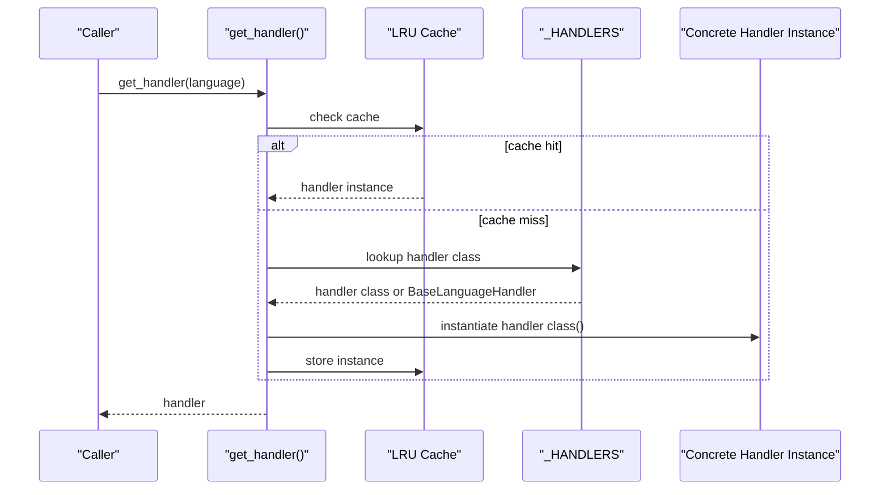
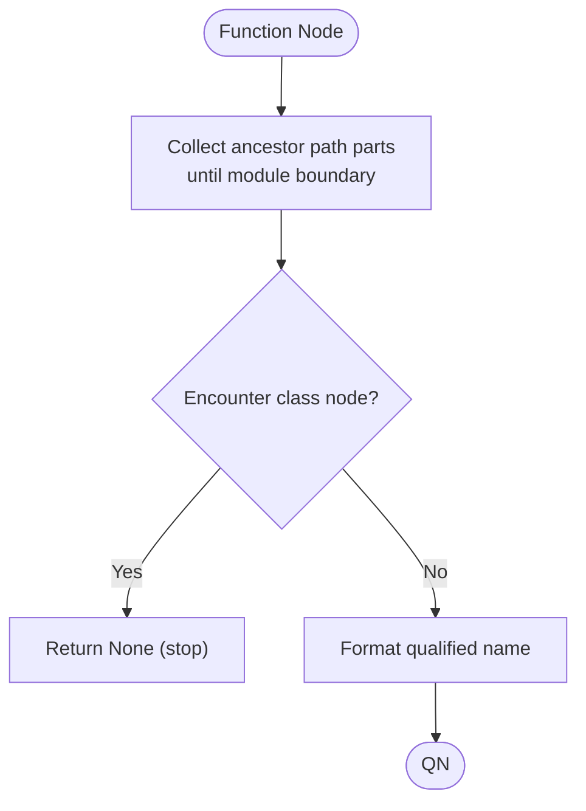
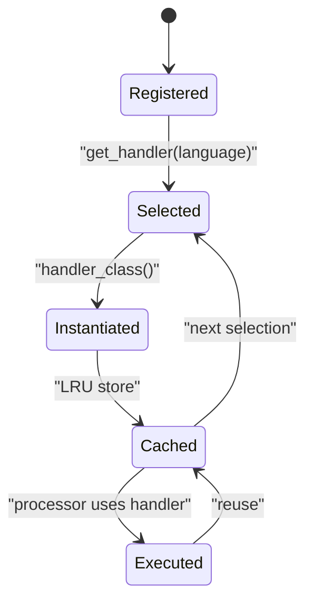
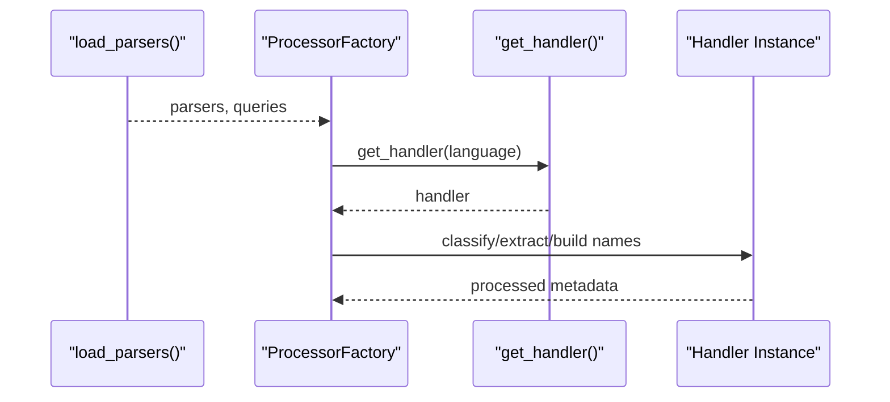
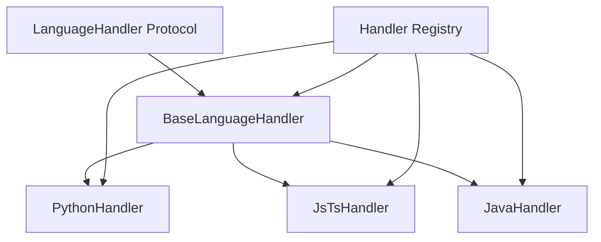

# Handler Architecture

<cite>
**Referenced Files in This Document**
- [base.py](file://codebase_rag/parsers/handlers/base.py)
- [protocol.py](file://codebase_rag/parsers/handlers/protocol.py)
- [registry.py](file://codebase_rag/parsers/handlers/registry.py)
- [python.py](file://codebase_rag/parsers/handlers/python.py)
- [js_ts.py](file://codebase_rag/parsers/handlers/js_ts.py)
- [java.py](file://codebase_rag/parsers/handlers/java.py)
- [constants.py](file://codebase_rag/constants.py)
- [factory.py](file://codebase_rag/parsers/factory.py)
- [parser_loader.py](file://codebase_rag/parser_loader.py)
- [test_handler_registry.py](file://codebase_rag/tests/test_handler_registry.py)
- [test_handlers_unit.py](file://codebase_rag/tests/test_handlers_unit.py)
- [test_handler_integration.py](file://codebase_rag/tests/test_handler_integration.py)
</cite>

## Table of Contents
1. [Introduction](#introduction)
2. [Project Structure](#project-structure)
3. [Core Components](#core-components)
4. [Architecture Overview](#architecture-overview)
5. [Detailed Component Analysis](#detailed-component-analysis)
6. [Dependency Analysis](#dependency-analysis)
7. [Performance Considerations](#performance-considerations)
8. [Troubleshooting Guide](#troubleshooting-guide)
9. [Conclusion](#conclusion)
10. [Appendices](#appendices)

## Introduction
This document explains the language handler architecture and design patterns used to process code across multiple programming languages. It covers the BaseLanguageHandler abstract class, the LanguageHandler protocol, the handler registry with LRU caching, dynamic handler instantiation, handler selection and fallback mechanisms, the handler lifecycle, and the common methods that all handlers must implement. It also demonstrates how handlers integrate with the parser factory system and outlines extensibility patterns and best practices for adding new language handlers.

## Project Structure
The handler system resides under the parsers/handlers package and integrates with the broader parsing pipeline. Key areas:
- Handlers define language-specific behavior for AST nodes (functions, classes, decorators, etc.).
- A registry maps supported languages to concrete handler classes and caches instances.
- Tests validate handler selection, caching, and behavior across languages.
- The parser factory composes processors that rely on handlers during ingestion.

**Diagram sources**
- [base.py](file://codebase_rag/parsers/handlers/base.py#L15-L108)
- [protocol.py](file://codebase_rag/parsers/handlers/protocol.py#L12-L56)
- [registry.py](file://codebase_rag/parsers/handlers/registry.py#L28-L32)
- [python.py](file://codebase_rag/parsers/handlers/python.py#L13-L23)
- [js_ts.py](file://codebase_rag/parsers/handlers/js_ts.py#L14-L116)
- [java.py](file://codebase_rag/parsers/handlers/java.py#L13-L29)
- [parser_loader.py](file://codebase_rag/parser_loader.py#L276-L293)
- [factory.py](file://codebase_rag/parsers/factory.py#L18-L116)

**Section sources**
- [base.py](file://codebase_rag/parsers/handlers/base.py#L15-L108)
- [protocol.py](file://codebase_rag/parsers/handlers/protocol.py#L12-L56)
- [registry.py](file://codebase_rag/parsers/handlers/registry.py#L15-L32)
- [parser_loader.py](file://codebase_rag/parser_loader.py#L276-L293)
- [factory.py](file://codebase_rag/parsers/factory.py#L18-L116)

## Core Components
- BaseLanguageHandler: Provides default implementations for common AST node processing tasks and shared utilities for qualified name construction and nested function naming.
- LanguageHandler Protocol: Defines the contract that all handlers must satisfy, ensuring consistent method signatures across languages.
- Handler Registry: Maps SupportedLanguage to concrete handler classes and instantiates them lazily with LRU caching.
- Concrete Handlers: PythonHandler, JsTsHandler, JavaHandler, and others implement language-specific logic for features like decorators, nested functions, and method signatures.
- Parser Factory and Loader: Compose the ingestion pipeline and supply parsers and queries; handlers are invoked downstream by processors.

Key responsibilities:
- Node classification: is_class_method, is_export_inside_function, is_inside_method_with_object_literals.
- Name extraction and composition: extract_function_name, build_function_qualified_name, build_method_qualified_name, build_nested_function_qn.
- Metadata and annotations: extract_decorators, extract_base_class_name, should_process_as_impl_block, extract_impl_target.

**Section sources**
- [base.py](file://codebase_rag/parsers/handlers/base.py#L15-L108)
- [protocol.py](file://codebase_rag/parsers/handlers/protocol.py#L12-L56)
- [registry.py](file://codebase_rag/parsers/handlers/registry.py#L15-L32)
- [python.py](file://codebase_rag/parsers/handlers/python.py#L13-L23)
- [js_ts.py](file://codebase_rag/parsers/handlers/js_ts.py#L14-L116)
- [java.py](file://codebase_rag/parsers/handlers/java.py#L13-L29)

## Architecture Overview
The handler architecture follows a protocol-driven design with a registry that selects and instantiates handlers per language. The registry uses an LRU cache to reuse handler instances efficiently. Concrete handlers extend the base class and override only the parts that differ per language. The parser factory composes processors that rely on handlers during ingestion.

**Diagram sources**
- [registry.py](file://codebase_rag/parsers/handlers/registry.py#L28-L32)

**Section sources**
- [registry.py](file://codebase_rag/parsers/handlers/registry.py#L15-L32)
- [constants.py](file://codebase_rag/constants.py#L425-L438)

## Detailed Component Analysis

### BaseLanguageHandler
The abstract base class defines default behaviors and shared utilities:
- Node classification helpers return defaults (False) to simplify overrides.
- Name extraction uses Tree-sitter child fields and safe decoding.
- Qualified name builders construct identifiers using separators and module/class/function names.
- Nested function naming collects ancestor path parts up to module boundaries, stopping at class nodes when needed.

Common methods:
- is_inside_method_with_object_literals, is_class_method, is_export_inside_function
- extract_function_name, build_function_qualified_name
- is_function_exported, should_process_as_impl_block, extract_impl_target
- build_method_qualified_name, extract_base_class_name
- build_nested_function_qn, extract_decorators

Implementation patterns:
- Uses LanguageSpec to determine node types for functions, classes, modules.
- Safe decoding of node text to avoid encoding issues.
- Reverse traversal to collect path parts for nested QN construction.

**Section sources**
- [base.py](file://codebase_rag/parsers/handlers/base.py#L15-L108)

### LanguageHandler Protocol
Defines the contract that all handlers must implement. Methods include:
- Classification: is_inside_method_with_object_literals, is_class_method, is_export_inside_function
- Extraction: extract_function_name, extract_decorators
- Composition: build_function_qualified_name, build_method_qualified_name, build_nested_function_qn
- Specialized: should_process_as_impl_block, extract_impl_target, extract_base_class_name

This protocol ensures uniformity across languages and enables the registry to return any handler that satisfies the interface.

**Section sources**
- [protocol.py](file://codebase_rag/parsers/handlers/protocol.py#L12-L56)

### Handler Registry and LRU Caching
The registry maps SupportedLanguage to concrete handler classes and falls back to BaseLanguageHandler for unsupported languages. It uses an LRU cache with a small capacity to reuse handler instances.

Selection algorithm:
- Lookup language in registry map.
- If present, instantiate the class; otherwise, instantiate BaseLanguageHandler.
- Store the instance in the LRU cache keyed by language.

Fallback mechanism:
- Unknown or unsupported languages return BaseLanguageHandler, ensuring robustness.

Dynamic instantiation:
- Handlers are created on demand and reused via caching.

**Section sources**
- [registry.py](file://codebase_rag/parsers/handlers/registry.py#L15-L32)
- [constants.py](file://codebase_rag/constants.py#L425-L438)

### Concrete Handlers

#### PythonHandler
Extends BaseLanguageHandler and adds Python-specific decorator extraction from decorated definitions.

Behavior highlights:
- Decorators are collected from the parent decorated definition node.

**Section sources**
- [python.py](file://codebase_rag/parsers/handlers/python.py#L13-L23)

#### JsTsHandler
Extends BaseLanguageHandler with JavaScript/TypeScript-specific logic:
- Decorators extracted from decorator nodes.
- Object literal method detection and class membership checks.
- Export-inside-function detection for various function forms.
- Enhanced nested function QN collection supporting object literals and method definitions.

**Diagram sources**
- [js_ts.py](file://codebase_rag/parsers/handlers/js_ts.py#L90-L116)

**Section sources**
- [js_ts.py](file://codebase_rag/parsers/handlers/js_ts.py#L14-L116)

#### JavaHandler
Extends BaseLanguageHandler and customizes method qualified name construction to include parameter types when available, leveraging Java-specific utilities.

**Section sources**
- [java.py](file://codebase_rag/parsers/handlers/java.py#L13-L29)

### Handler Lifecycle
Lifecycle stages:
1. Registration: Handlers are registered in the registry map for supported languages.
2. Selection: get_handler(language) selects the appropriate handler class.
3. Instantiation: The handler class is instantiated (cached).
4. Execution: Handlers are invoked by processors during ingestion to classify nodes, extract names, and compose qualified names.
5. Reuse: Subsequent requests for the same language return the cached instance.

**Diagram sources**
- [registry.py](file://codebase_rag/parsers/handlers/registry.py#L28-L32)

**Section sources**
- [registry.py](file://codebase_rag/parsers/handlers/registry.py#L15-L32)

### Integration with Parser Factory and Loader
The parser loader builds parsers and queries per language and initializes the pipeline. The processor factory composes processors that rely on handlers for classification and naming during ingestion. Handlers are used downstream by processors to transform AST nodes into graph entities.

**Diagram sources**
- [parser_loader.py](file://codebase_rag/parser_loader.py#L276-L293)
- [factory.py](file://codebase_rag/parsers/factory.py#L18-L116)
- [registry.py](file://codebase_rag/parsers/handlers/registry.py#L28-L32)

**Section sources**
- [parser_loader.py](file://codebase_rag/parser_loader.py#L276-L293)
- [factory.py](file://codebase_rag/parsers/factory.py#L18-L116)
- [registry.py](file://codebase_rag/parsers/handlers/registry.py#L28-L32)

## Dependency Analysis
- BaseLanguageHandler is extended by concrete handlers.
- LanguageHandler Protocol ensures all handlers adhere to the same interface.
- Registry depends on SupportedLanguage and concrete handler classes.
- Tests validate registry behavior, caching, and protocol compliance.

**Diagram sources**
- [base.py](file://codebase_rag/parsers/handlers/base.py#L15-L108)
- [protocol.py](file://codebase_rag/parsers/handlers/protocol.py#L12-L56)
- [registry.py](file://codebase_rag/parsers/handlers/registry.py#L15-L32)
- [python.py](file://codebase_rag/parsers/handlers/python.py#L13-L23)
- [js_ts.py](file://codebase_rag/parsers/handlers/js_ts.py#L14-L116)
- [java.py](file://codebase_rag/parsers/handlers/java.py#L13-L29)

**Section sources**
- [base.py](file://codebase_rag/parsers/handlers/base.py#L15-L108)
- [protocol.py](file://codebase_rag/parsers/handlers/protocol.py#L12-L56)
- [registry.py](file://codebase_rag/parsers/handlers/registry.py#L15-L32)
- [python.py](file://codebase_rag/parsers/handlers/python.py#L13-L23)
- [js_ts.py](file://codebase_rag/parsers/handlers/js_ts.py#L14-L116)
- [java.py](file://codebase_rag/parsers/handlers/java.py#L13-L29)

## Performance Considerations
- LRU caching reduces handler instantiation overhead by reusing instances per language.
- Default implementations minimize work for unsupported languages, avoiding heavy computations.
- Qualified name construction and traversal are bounded by AST depth and node counts.

Recommendations:
- Keep handler methods efficient; avoid deep recursive traversals.
- Use LanguageSpec node type sets to short-circuit unnecessary checks.
- Cache handler instances per language to avoid repeated allocations.

[No sources needed since this section provides general guidance]

## Troubleshooting Guide
Common issues and resolutions:
- Unsupported language returns BaseLanguageHandler: Verify SupportedLanguage enum and registry mapping.
- Handler not conforming to protocol: Ensure all protocol methods are present and callable.
- Incorrect qualified names: Confirm LanguageSpec node types and field names align with Tree-sitter grammar.
- Caching confusion: LRU cache stores instances; verify language keys and ensure deterministic behavior.

Validation references:
- Registry selection and caching behavior.
- Protocol compliance across languages.
- Inheritance from BaseLanguageHandler for concrete handlers.

**Section sources**
- [test_handler_registry.py](file://codebase_rag/tests/test_handler_registry.py#L16-L154)
- [test_handlers_unit.py](file://codebase_rag/tests/test_handlers_unit.py#L114-L800)
- [test_handler_integration.py](file://codebase_rag/tests/test_handler_integration.py#L21-L190)

## Conclusion
The handler architecture provides a clean, protocol-driven abstraction for language-specific AST processing. The registry and LRU caching enable efficient, dynamic handler instantiation and reuse. Concrete handlers extend the base class to implement language-specific logic while maintaining a consistent interface. Integration with the parser factory and loader completes the ingestion pipeline, enabling scalable support for multiple languages.

[No sources needed since this section summarizes without analyzing specific files]

## Appendices

### Handler Contract Summary
All handlers must implement the LanguageHandler protocol, including:
- Classification: is_inside_method_with_object_literals, is_class_method, is_export_inside_function
- Extraction: extract_function_name, extract_decorators
- Composition: build_function_qualified_name, build_method_qualified_name, build_nested_function_qn
- Specialized: should_process_as_impl_block, extract_impl_target, extract_base_class_name

**Section sources**
- [protocol.py](file://codebase_rag/parsers/handlers/protocol.py#L12-L56)

### Extensibility Patterns and Best Practices
- Extend BaseLanguageHandler and override only what differs per language.
- Use LanguageSpec to determine node types and fields.
- Keep logic focused on AST node classification and name composition.
- Add tests validating handler behavior for representative constructs in the target language.
- Register new handlers in the registry map and verify fallback to BaseLanguageHandler for unknown languages.

**Section sources**
- [base.py](file://codebase_rag/parsers/handlers/base.py#L15-L108)
- [registry.py](file://codebase_rag/parsers/handlers/registry.py#L15-L32)
- [constants.py](file://codebase_rag/constants.py#L425-L438)