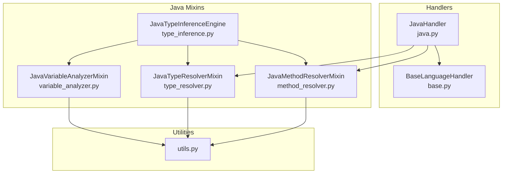
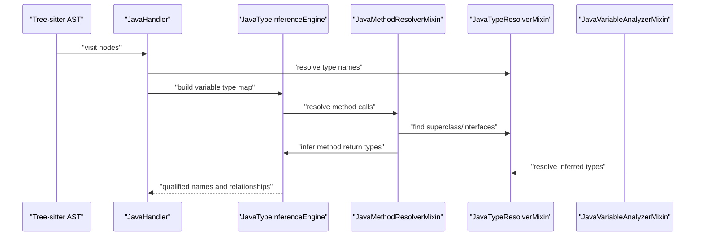
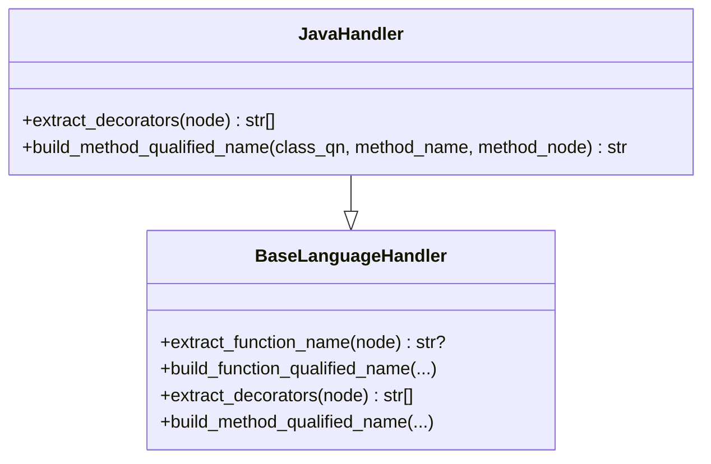
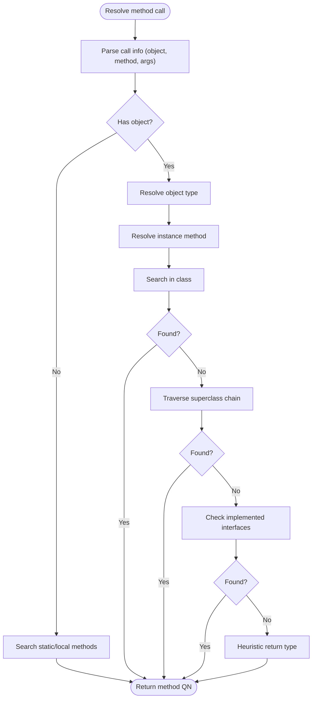
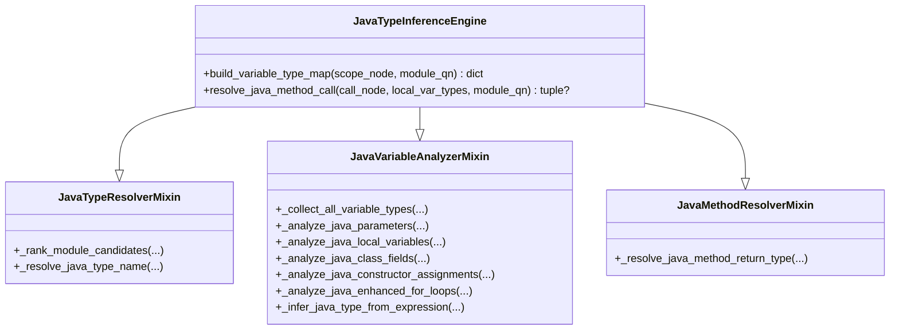
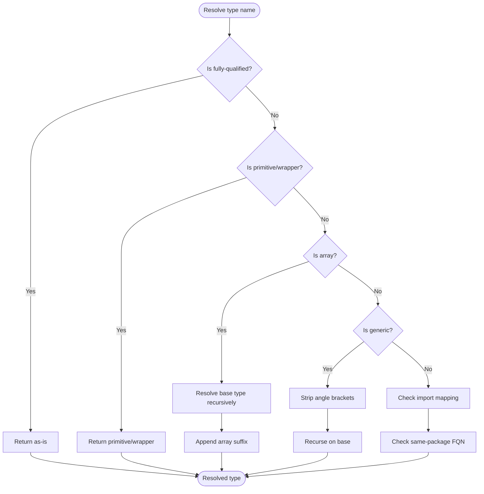
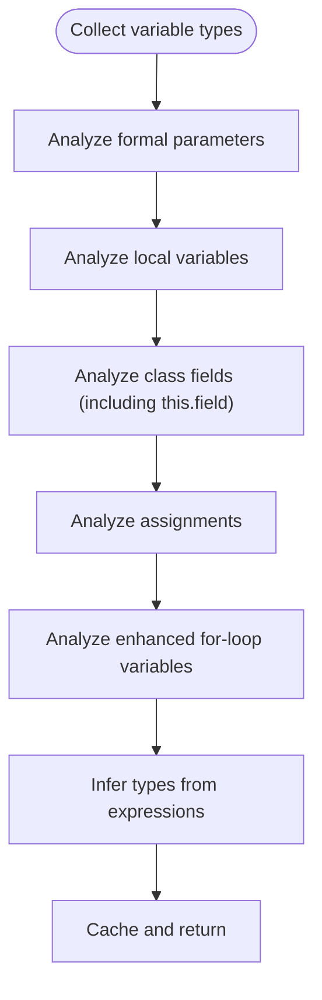
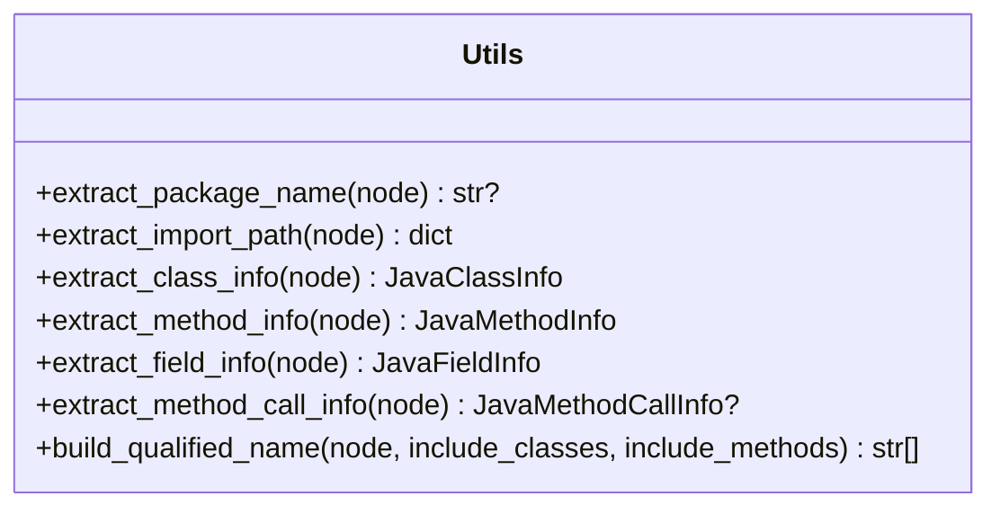
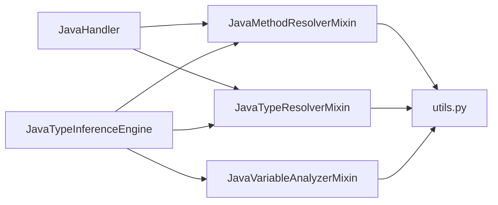

# Java Handler

<cite>
**Referenced Files in This Document**
- [java.py](file://codebase_rag/parsers/handlers/java.py)
- [base.py](file://codebase_rag/parsers/handlers/base.py)
- [__init__.py](file://codebase_rag/parsers/java/__init__.py)
- [method_resolver.py](file://codebase_rag/parsers/java/method_resolver.py)
- [type_inference.py](file://codebase_rag/parsers/java/type_inference.py)
- [type_resolver.py](file://codebase_rag/parsers/java/type_resolver.py)
- [variable_analyzer.py](file://codebase_rag/parsers/java/variable_analyzer.py)
- [utils.py](file://codebase_rag/parsers/java/utils.py)
- [test_java_comprehensive.py](file://codebase_rag/tests/test_java_comprehensive.py)
- [test_java_modern_features.py](file://codebase_rag/tests/test_java_modern_features.py)
- [test_java_reflection_annotations.py](file://codebase_rag/tests/test_java_reflection_annotations.py)
</cite>

## Table of Contents
1. [Introduction](#introduction)
2. [Project Structure](#project-structure)
3. [Core Components](#core-components)
4. [Architecture Overview](#architecture-overview)
5. [Detailed Component Analysis](#detailed-component-analysis)
6. [Dependency Analysis](#dependency-analysis)
7. [Performance Considerations](#performance-considerations)
8. [Troubleshooting Guide](#troubleshooting-guide)
9. [Conclusion](#conclusion)
10. [Appendices](#appendices)

## Introduction
This document explains the Java language handler implementation used to parse Java code via Tree-sitter and generate knowledge graph nodes. It focuses on how the JavaHandler processes AST nodes from the Tree-sitter Java grammar, how Java-specific features (packages, imports, classes, interfaces, annotations, records, sealed types, lambdas, and modern language features) are handled, and how method resolution, type inference, and variable analysis work together to power accurate cross-file linking and semantic understanding.

## Project Structure
The Java handler is composed of:
- A language-specific handler that extends the base handler
- A cohesive set of mixins that implement method resolution, type inference, type resolution, and variable analysis
- Utilities for extracting metadata from Tree-sitter nodes and resolving class contexts
- Tests validating Java features end-to-end

**Diagram sources**
- [java.py](file://codebase_rag/parsers/handlers/java.py#L13-L29)
- [base.py](file://codebase_rag/parsers/handlers/base.py#L15-L108)
- [method_resolver.py](file://codebase_rag/parsers/java/method_resolver.py#L22-L382)
- [type_inference.py](file://codebase_rag/parsers/java/type_inference.py#L24-L113)
- [type_resolver.py](file://codebase_rag/parsers/java/type_resolver.py#L20-L259)
- [variable_analyzer.py](file://codebase_rag/parsers/java/variable_analyzer.py#L23-L491)
- [utils.py](file://codebase_rag/parsers/java/utils.py#L24-L512)

**Section sources**
- [java.py](file://codebase_rag/parsers/handlers/java.py#L1-L29)
- [base.py](file://codebase_rag/parsers/handlers/base.py#L15-L108)
- [__init__.py](file://codebase_rag/parsers/java/__init__.py#L1-L12)

## Core Components
- JavaHandler: Extends the base handler to specialize extraction of decorators and method qualified names for Java. It delegates most semantics to mixins.
- JavaMethodResolverMixin: Resolves method calls across classes, including static/local methods, instance methods, inheritance chains, and implemented interfaces. It also infers method return types heuristically.
- JavaTypeResolverMixin: Resolves type names, finds superclass and interfaces, ranks module candidates, and extracts type identifiers from generic declarations.
- JavaTypeInferenceEngine: Orchestrates type inference across the codebase, builds variable type maps, and integrates with method resolution and variable analysis.
- JavaVariableAnalyzerMixin: Collects variable types from parameters, local variables, class fields, assignments, and enhanced for-loops; supports type inference from expressions and method calls.
- utils: Provides Tree-sitter AST helpers for extracting package/import/class/method/field information, annotations, and class context.

**Section sources**
- [java.py](file://codebase_rag/parsers/handlers/java.py#L13-L29)
- [method_resolver.py](file://codebase_rag/parsers/java/method_resolver.py#L22-L382)
- [type_resolver.py](file://codebase_rag/parsers/java/type_resolver.py#L20-L259)
- [type_inference.py](file://codebase_rag/parsers/java/type_inference.py#L24-L113)
- [variable_analyzer.py](file://codebase_rag/parsers/java/variable_analyzer.py#L23-L491)
- [utils.py](file://codebase_rag/parsers/java/utils.py#L24-L512)

## Architecture Overview
The Java pipeline processes Tree-sitter AST nodes and produces knowledge graph nodes for classes, interfaces, enums, records, methods, fields, and annotations. It leverages:
- Package and import extraction to resolve fully-qualified names
- Inheritance and interface discovery to resolve method targets
- Variable type maps to support method call resolution and type inference
- Heuristics for method return types when AST context is unavailable

**Diagram sources**
- [java.py](file://codebase_rag/parsers/handlers/java.py#L13-L29)
- [type_inference.py](file://codebase_rag/parsers/java/type_inference.py#L24-L113)
- [method_resolver.py](file://codebase_rag/parsers/java/method_resolver.py#L22-L382)
- [type_resolver.py](file://codebase_rag/parsers/java/type_resolver.py#L20-L259)
- [variable_analyzer.py](file://codebase_rag/parsers/java/variable_analyzer.py#L23-L491)

## Detailed Component Analysis

### JavaHandler
- Purpose: Specializes the base handler for Java. Extracts annotations from modifiers and builds method qualified names including parameter signatures when available.
- Key behaviors:
  - Extracts annotations from modifiers nodes for decorators.
  - Builds a method qualified name combining class QN, method name, and a signature derived from extracted parameters.

**Diagram sources**
- [base.py](file://codebase_rag/parsers/handlers/base.py#L15-L108)
- [java.py](file://codebase_rag/parsers/handlers/java.py#L13-L29)

**Section sources**
- [java.py](file://codebase_rag/parsers/handlers/java.py#L13-L29)
- [base.py](file://codebase_rag/parsers/handlers/base.py#L62-L63)

### Method Resolution System
- Responsibilities:
  - Resolve static or local methods by scanning the function registry under the current module.
  - Resolve instance methods by:
    - Resolving the object’s type (local variables, imports, this/super).
    - Searching the class, then recursively up the inheritance chain, and finally checking implemented interfaces.
  - Infer method return types heuristically when AST context is not available.
- Key mechanisms:
  - Object type resolution for identifiers, this, super, and imports.
  - Registry traversal with prefix matching and ranking by module proximity.
  - AST-based return type lookup within the containing class.

**Diagram sources**
- [method_resolver.py](file://codebase_rag/parsers/java/method_resolver.py#L334-L382)
- [method_resolver.py](file://codebase_rag/parsers/java/method_resolver.py#L118-L134)
- [method_resolver.py](file://codebase_rag/parsers/java/method_resolver.py#L205-L227)
- [method_resolver.py](file://codebase_rag/parsers/java/method_resolver.py#L229-L332)

**Section sources**
- [method_resolver.py](file://codebase_rag/parsers/java/method_resolver.py#L56-L96)
- [method_resolver.py](file://codebase_rag/parsers/java/method_resolver.py#L118-L134)
- [method_resolver.py](file://codebase_rag/parsers/java/method_resolver.py#L205-L227)
- [method_resolver.py](file://codebase_rag/parsers/java/method_resolver.py#L229-L332)

### Type Inference Engine
- Responsibilities:
  - Build a variable type map for a given scope by traversing parameters, local variables, class fields, assignments, and enhanced for-loop variables.
  - Integrate with method resolution to infer types from method invocations and field access.
  - Rank module candidates for type name resolution using module distance and suffix matching.
- Key mechanisms:
  - Caching and cycle detection for variable type lookups.
  - FQN-to-module mapping to support alternative module resolution.

**Diagram sources**
- [type_inference.py](file://codebase_rag/parsers/java/type_inference.py#L24-L113)
- [variable_analyzer.py](file://codebase_rag/parsers/java/variable_analyzer.py#L45-L55)
- [method_resolver.py](file://codebase_rag/parsers/java/method_resolver.py#L229-L255)
- [type_resolver.py](file://codebase_rag/parsers/java/type_resolver.py#L58-L82)

**Section sources**
- [type_inference.py](file://codebase_rag/parsers/java/type_inference.py#L79-L96)
- [variable_analyzer.py](file://codebase_rag/parsers/java/variable_analyzer.py#L45-L55)
- [type_resolver.py](file://codebase_rag/parsers/java/type_resolver.py#L58-L82)

### Type Resolution and Name Resolution
- Responsibilities:
  - Resolve primitive/wrapper types, arrays, and generic types.
  - Extract superclass and interfaces from AST and resolve their fully-qualified names.
  - Rank candidate modules for ambiguous type names using module distance and suffix matching.
- Key mechanisms:
  - AST traversal to locate class declarations and extract type identifiers.
  - Module-to-FQN mapping to support alternative module resolution.

**Diagram sources**
- [type_resolver.py](file://codebase_rag/parsers/java/type_resolver.py#L101-L134)
- [type_resolver.py](file://codebase_rag/parsers/java/type_resolver.py#L147-L166)
- [type_resolver.py](file://codebase_rag/parsers/java/type_resolver.py#L178-L214)

**Section sources**
- [type_resolver.py](file://codebase_rag/parsers/java/type_resolver.py#L101-L134)
- [type_resolver.py](file://codebase_rag/parsers/java/type_resolver.py#L147-L166)
- [type_resolver.py](file://codebase_rag/parsers/java/type_resolver.py#L178-L214)

### Variable Analysis and Scope Tracking
- Responsibilities:
  - Collect parameter types, local variable declarations, class fields (including implicit this.field), assignments, and enhanced for-loop variables.
  - Infer types from expressions (object creation, method invocations, literals, field access).
  - Support recursive variable type lookups with caching and cycle detection.
- Key mechanisms:
  - Traverse AST nodes for declarations and assignments.
  - Use method resolver to infer return types and field access types.

**Diagram sources**
- [variable_analyzer.py](file://codebase_rag/parsers/java/variable_analyzer.py#L45-L55)
- [variable_analyzer.py](file://codebase_rag/parsers/java/variable_analyzer.py#L108-L121)
- [variable_analyzer.py](file://codebase_rag/parsers/java/variable_analyzer.py#L175-L204)
- [variable_analyzer.py](file://codebase_rag/parsers/java/variable_analyzer.py#L205-L218)
- [variable_analyzer.py](file://codebase_rag/parsers/java/variable_analyzer.py#L257-L269)
- [variable_analyzer.py](file://codebase_rag/parsers/java/variable_analyzer.py#L332-L370)

**Section sources**
- [variable_analyzer.py](file://codebase_rag/parsers/java/variable_analyzer.py#L45-L55)
- [variable_analyzer.py](file://codebase_rag/parsers/java/variable_analyzer.py#L332-L370)

### Java AST Utilities and Metadata Extraction
- Responsibilities:
  - Extract package names, imports (including wildcard), class info (superclass, interfaces, type parameters, modifiers), method info (return type, parameters, annotations), field info, and method call info.
  - Build qualified names from nested classes and methods.
  - Detect visibility and main method signatures.
- Key mechanisms:
  - Safe decoding of Tree-sitter node text.
  - Traversal of modifiers and annotations nodes.

**Diagram sources**
- [utils.py](file://codebase_rag/parsers/java/utils.py#L69-L111)
- [utils.py](file://codebase_rag/parsers/java/utils.py#L192-L214)
- [utils.py](file://codebase_rag/parsers/java/utils.py#L263-L285)
- [utils.py](file://codebase_rag/parsers/java/utils.py#L288-L314)
- [utils.py](file://codebase_rag/parsers/java/utils.py#L317-L342)
- [utils.py](file://codebase_rag/parsers/java/utils.py#L439-L461)

**Section sources**
- [utils.py](file://codebase_rag/parsers/java/utils.py#L69-L111)
- [utils.py](file://codebase_rag/parsers/java/utils.py#L192-L214)
- [utils.py](file://codebase_rag/parsers/java/utils.py#L263-L285)
- [utils.py](file://codebase_rag/parsers/java/utils.py#L288-L314)
- [utils.py](file://codebase_rag/parsers/java/utils.py#L317-L342)
- [utils.py](file://codebase_rag/parsers/java/utils.py#L439-L461)

### Examples of Java Parsing and Knowledge Graph Node Generation
- Comprehensive Java features:
  - Classes, inheritance, interfaces, abstract classes, enums, annotations, generics, bounded generics, wildcards, static/final modifiers, inner/nested/local/anonymous classes, lambdas, functional interfaces, records, sealed classes, switch expressions, text blocks, var keyword, instanceof patterns, and repeatable annotations.
- Reflection and annotation processing:
  - Custom annotations, meta-annotations, repeatable annotations, runtime-visible annotations, and reflection API usage patterns.

These examples are validated by end-to-end tests that assert the presence of expected nodes and relationships in the knowledge graph.

**Section sources**
- [test_java_comprehensive.py](file://codebase_rag/tests/test_java_comprehensive.py#L32-L167)
- [test_java_modern_features.py](file://codebase_rag/tests/test_java_modern_features.py#L25-L282)
- [test_java_reflection_annotations.py](file://codebase_rag/tests/test_java_reflection_annotations.py#L24-L580)

## Dependency Analysis
- Coupling:
  - JavaHandler depends on BaseLanguageHandler and Java mixins.
  - JavaTypeInferenceEngine aggregates three mixins to coordinate type inference, resolution, and variable analysis.
  - JavaMethodResolverMixin and JavaTypeResolverMixin depend on shared utilities for AST navigation and class context retrieval.
- Cohesion:
  - Each mixin encapsulates a focused responsibility (resolution, inference, analysis, utilities), minimizing cross-cutting concerns.
- External dependencies:
  - Tree-sitter AST nodes and a function registry supporting prefix-based lookups and items iteration.

**Diagram sources**
- [java.py](file://codebase_rag/parsers/handlers/java.py#L13-L29)
- [type_inference.py](file://codebase_rag/parsers/java/type_inference.py#L24-L50)
- [method_resolver.py](file://codebase_rag/parsers/java/method_resolver.py#L22-L32)
- [type_resolver.py](file://codebase_rag/parsers/java/type_resolver.py#L20-L26)
- [variable_analyzer.py](file://codebase_rag/parsers/java/variable_analyzer.py#L23-L31)
- [utils.py](file://codebase_rag/parsers/java/utils.py#L24-L28)

**Section sources**
- [java.py](file://codebase_rag/parsers/handlers/java.py#L13-L29)
- [type_inference.py](file://codebase_rag/parsers/java/type_inference.py#L24-L50)
- [method_resolver.py](file://codebase_rag/parsers/java/method_resolver.py#L22-L32)
- [type_resolver.py](file://codebase_rag/parsers/java/type_resolver.py#L20-L26)
- [variable_analyzer.py](file://codebase_rag/parsers/java/variable_analyzer.py#L23-L31)

## Performance Considerations
- Prefix-based registry lookups minimize scanning overhead when resolving methods and types.
- Module ranking reduces ambiguity and limits search space during type resolution.
- Caching and cycle detection in variable type lookups prevent redundant computation and infinite recursion.
- AST traversal is scoped to relevant nodes (class bodies, method bodies) to avoid unnecessary work.

[No sources needed since this section provides general guidance]

## Troubleshooting Guide
- Method resolution fails:
  - Verify that the function registry contains entries for the class and method under the expected qualified names.
  - Ensure imports are loaded so that simple names resolve to fully-qualified names.
  - Confirm that inheritance and interface information is present in the class context.
- Type resolution issues:
  - Check that package/module boundaries are correctly identified and that the FQN-to-module map is populated.
  - Validate that generic types and arrays are handled by stripping angle brackets and appending array suffixes appropriately.
- Variable type inference errors:
  - Confirm that local variable declarations and assignments are captured and that inferred types from method calls are available.
  - Review enhanced for-loop variable registration and field access type inference.

**Section sources**
- [method_resolver.py](file://codebase_rag/parsers/java/method_resolver.py#L334-L382)
- [type_resolver.py](file://codebase_rag/parsers/java/type_resolver.py#L101-L134)
- [variable_analyzer.py](file://codebase_rag/parsers/java/variable_analyzer.py#L410-L442)

## Conclusion
The Java handler implementation provides a robust foundation for parsing Java code with Tree-sitter and generating precise knowledge graph nodes. Its modular design—mixins for method resolution, type inference, type resolution, and variable analysis—enables accurate handling of Java’s complex type system, inheritance chains, annotations, and modern language features. The included tests validate coverage across core and advanced Java constructs, ensuring reliable cross-file linking and semantic understanding.

[No sources needed since this section summarizes without analyzing specific files]

## Appendices

### Java-Specific Features Coverage
- Packages and imports: Extracted and mapped for FQN resolution and wildcard handling.
- Classes, interfaces, enums, records, sealed classes: Supported via dedicated AST node types and metadata extraction.
- Annotations: Extracted from modifiers and annotations nodes; custom and repeatable annotations supported.
- Generics, wildcards, bounded generics: Handled by generic type extraction and base type resolution.
- Lambdas and functional interfaces: Captured through method call and functional interface definitions.
- Modern features: Records, sealed classes, switch expressions, text blocks, var keyword, instanceof patterns covered by tests.

**Section sources**
- [utils.py](file://codebase_rag/parsers/java/utils.py#L69-L111)
- [utils.py](file://codebase_rag/parsers/java/utils.py#L192-L214)
- [utils.py](file://codebase_rag/parsers/java/utils.py#L263-L285)
- [utils.py](file://codebase_rag/parsers/java/utils.py#L317-L342)
- [test_java_modern_features.py](file://codebase_rag/tests/test_java_modern_features.py#L25-L282)
- [test_java_reflection_annotations.py](file://codebase_rag/tests/test_java_reflection_annotations.py#L24-L580)