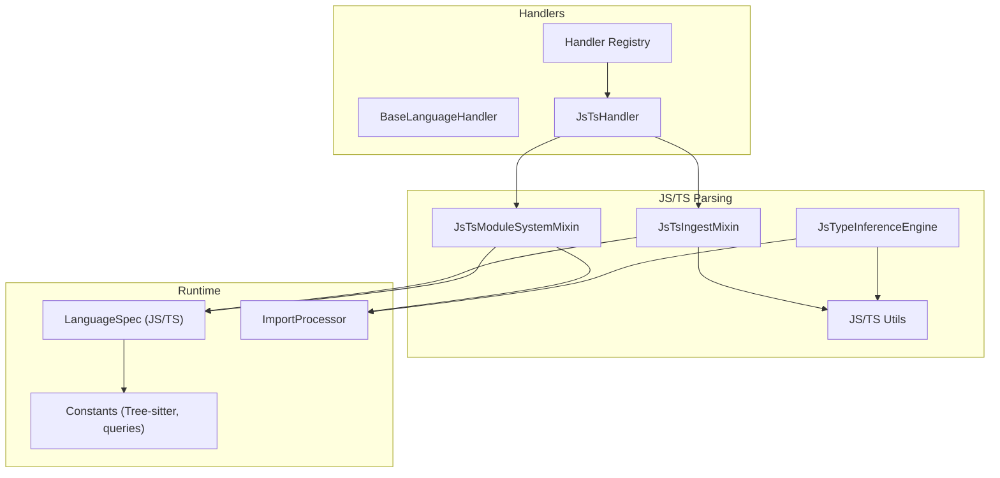
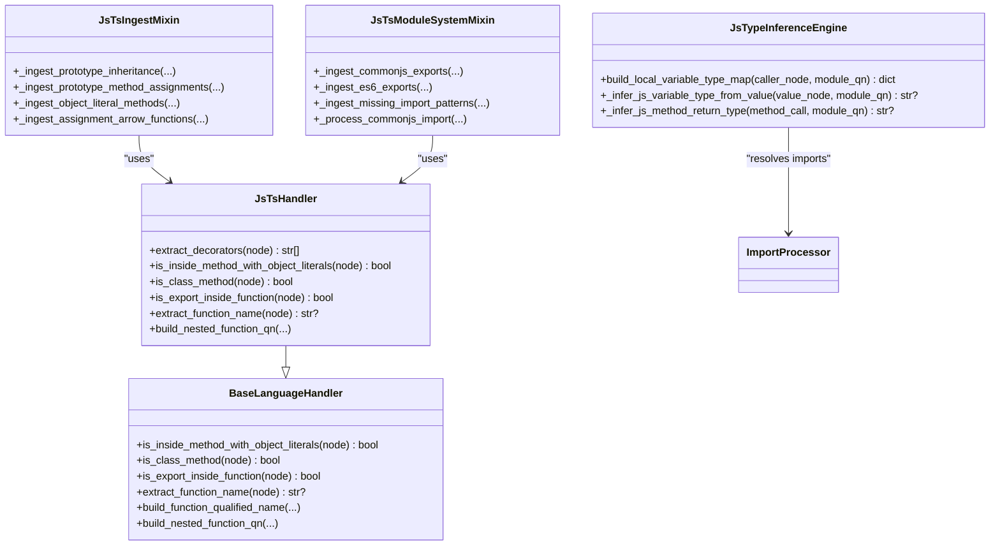
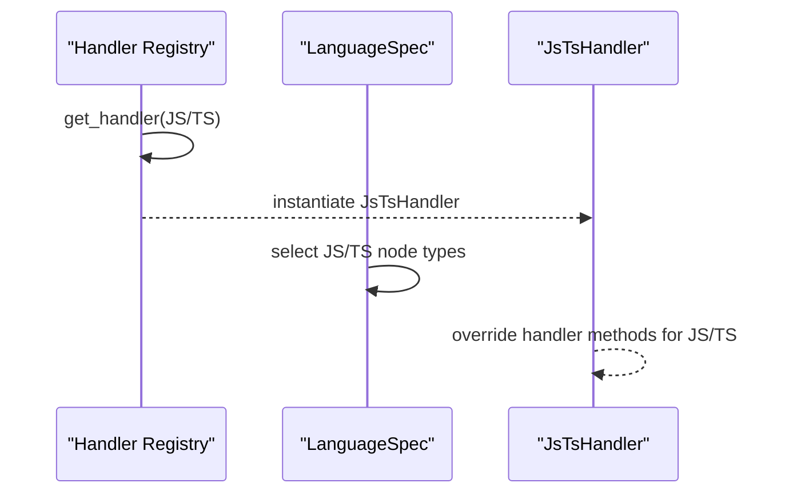
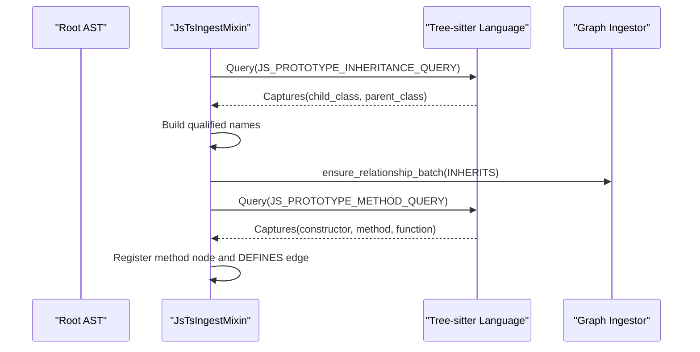
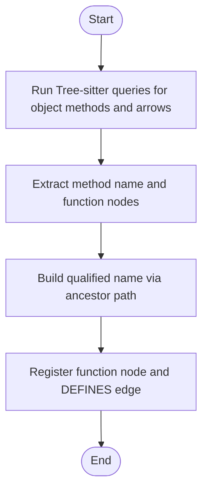
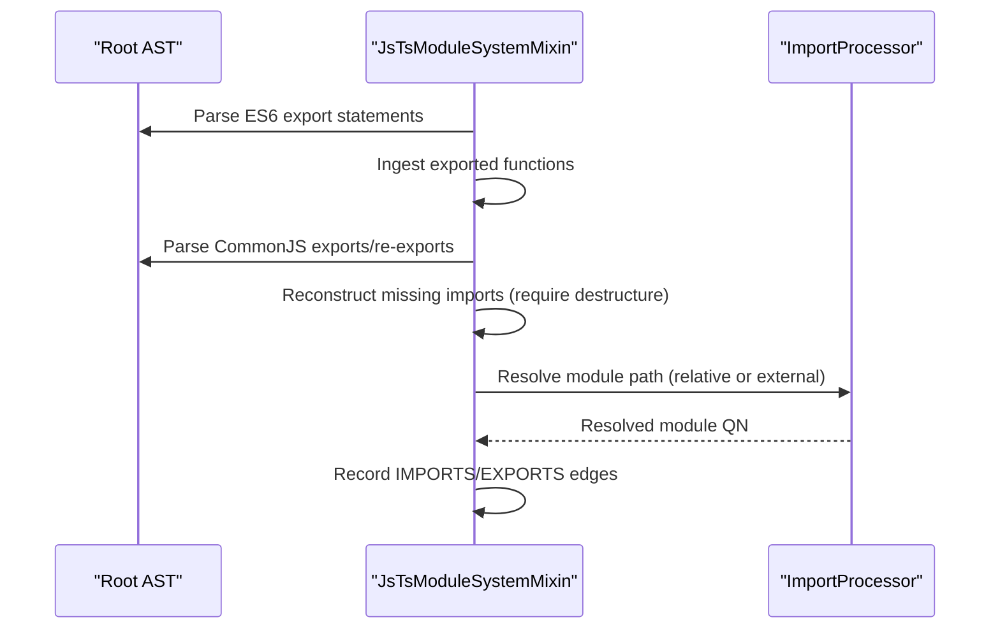
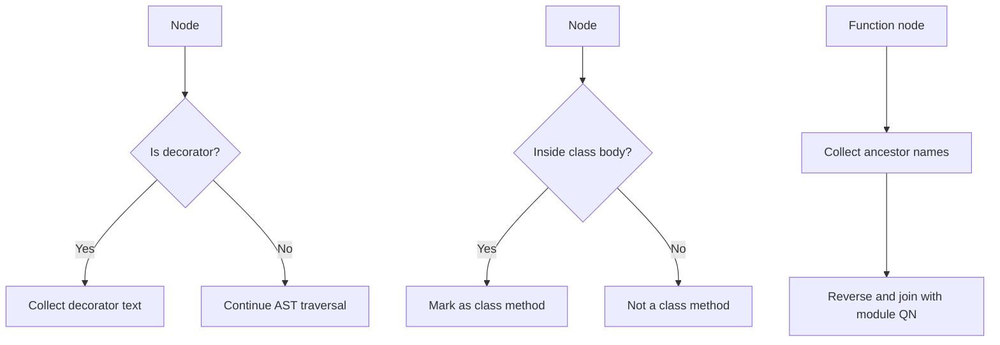
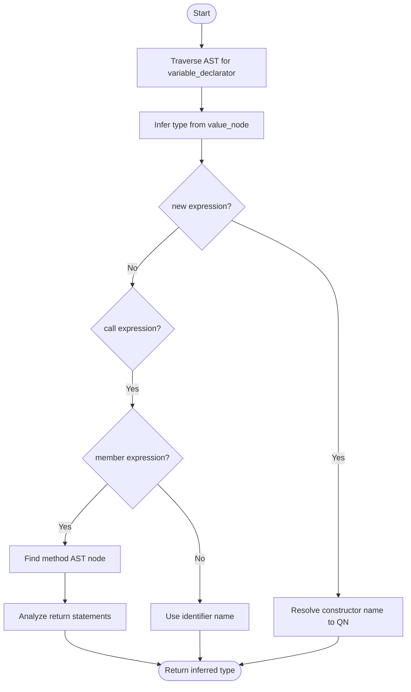
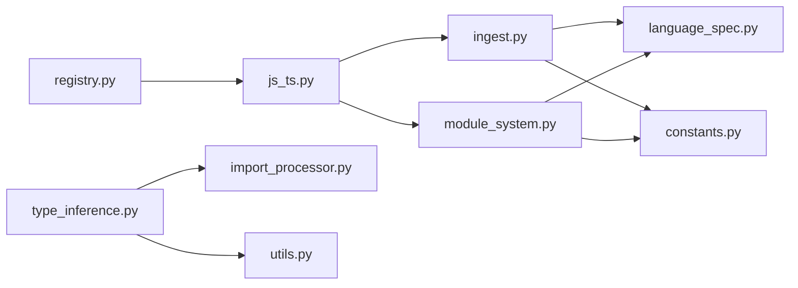

# JavaScript/TypeScript Handler

<cite>
**Referenced Files in This Document**
- [js_ts.py](file://codebase_rag/parsers/handlers/js_ts.py)
- [base.py](file://codebase_rag/parsers/handlers/base.py)
- [registry.py](file://codebase_rag/parsers/handlers/registry.py)
- [ingest.py](file://codebase_rag/parsers/js_ts/ingest.py)
- [module_system.py](file://codebase_rag/parsers/js_ts/module_system.py)
- [type_inference.py](file://codebase_rag/parsers/js_ts/type_inference.py)
- [utils.py](file://codebase_rag/parsers/js_ts/utils.py)
- [language_spec.py](file://codebase_rag/language_spec.py)
- [constants.py](file://codebase_rag/constants.py)
- [import_processor.py](file://codebase_rag/parsers/import_processor.py)
- [test_js_ts_ingest_helpers.py](file://codebase_rag/tests/test_js_ts_ingest_helpers.py)
- [test_js_ts_module_system_unit.py](file://codebase_rag/tests/test_js_ts_module_system_unit.py)
- [test_js_type_inference_integration.py](file://codebase_rag/tests/test_js_type_inference_integration.py)
</cite>

## Table of Contents
1. [Introduction](#introduction)
2. [Project Structure](#project-structure)
3. [Core Components](#core-components)
4. [Architecture Overview](#architecture-overview)
5. [Detailed Component Analysis](#detailed-component-analysis)
6. [Dependency Analysis](#dependency-analysis)
7. [Performance Considerations](#performance-considerations)
8. [Troubleshooting Guide](#troubleshooting-guide)
9. [Conclusion](#conclusion)
10. [Appendices](#appendices)

## Introduction
This document explains the JavaScript and TypeScript handler implementation used to parse and index AST nodes from Tree-sitter JavaScript/TypeScript grammars. It covers:
- Dual-language support architecture and how TypeScript-specific features are integrated alongside JavaScript
- Module system processing for ES6 modules, CommonJS, and TypeScript imports/exports
- A lightweight type inference engine for static typing in JavaScript contexts
- Function analysis for arrow functions, async/await, and generators
- Object-oriented patterns including prototypes, classes, and decorators
- Examples of modern JavaScript/TypeScript parsing and relationship extraction
- Module resolution algorithms and path mapping

## Project Structure
The JavaScript/TypeScript pipeline is composed of:
- A language handler that augments the base handler with JS/TS-specific logic
- An ingestion mixin that discovers functions, methods, prototype links, and object-methods via Tree-sitter queries
- A module system mixin that parses ES6 and CommonJS patterns and resolves imports/exports
- A type inference engine that performs basic local variable typing and method return inference
- Utilities for Tree-sitter language selection, method extraction, and return analysis

**Diagram sources**
- [registry.py](file://codebase_rag/parsers/handlers/registry.py#L15-L32)
- [js_ts.py](file://codebase_rag/parsers/handlers/js_ts.py#L14-L116)
- [ingest.py](file://codebase_rag/parsers/js_ts/ingest.py#L31-L634)
- [module_system.py](file://codebase_rag/parsers/js_ts/module_system.py#L31-L372)
- [type_inference.py](file://codebase_rag/parsers/js_ts/type_inference.py#L13-L198)
- [utils.py](file://codebase_rag/parsers/js_ts/utils.py#L12-L130)
- [language_spec.py](file://codebase_rag/language_spec.py#L205-L243)
- [constants.py](file://codebase_rag/constants.py#L510-L594)
- [import_processor.py](file://codebase_rag/parsers/import_processor.py#L416-L544)

**Section sources**
- [registry.py](file://codebase_rag/parsers/handlers/registry.py#L15-L32)
- [language_spec.py](file://codebase_rag/language_spec.py#L205-L243)
- [constants.py](file://codebase_rag/constants.py#L510-L594)

## Core Components
- JsTsHandler: Extends the base handler with JS/TS-aware logic for decorators, class method detection, and nested function qualified name construction.
- JsTsIngestMixin: Discovers prototype inheritance, prototype method assignments, object literal methods, and assignment arrow functions using Tree-sitter queries.
- JsTsModuleSystemMixin: Parses ES6 exports, CommonJS exports and re-exports, and CommonJS require patterns; resolves module paths and records relationships.
- JsTypeInferenceEngine: Builds a local variable type map and infers types from new expressions and method calls.
- Utilities: Provide Tree-sitter language object retrieval, method call extraction, return statement discovery, and constructor name extraction.

**Section sources**
- [js_ts.py](file://codebase_rag/parsers/handlers/js_ts.py#L14-L116)
- [ingest.py](file://codebase_rag/parsers/js_ts/ingest.py#L31-L634)
- [module_system.py](file://codebase_rag/parsers/js_ts/module_system.py#L31-L372)
- [type_inference.py](file://codebase_rag/parsers/js_ts/type_inference.py#L13-L198)
- [utils.py](file://codebase_rag/parsers/js_ts/utils.py#L12-L130)

## Architecture Overview
The handler architecture integrates Tree-sitter parsing with ingestion and module resolution:
- Handlers are selected per language via a registry mapping JS/TS to JsTsHandler.
- LanguageSpec defines supported node types and query configurations for JS/TS.
- Ingestion mixins use Tree-sitter queries to capture patterns for functions, methods, and prototype relationships.
- Module system mixin resolves imports/exports and records module relationships.
- Type inference engine leverages import mappings and AST traversal to infer types locally.

**Diagram sources**
- [base.py](file://codebase_rag/parsers/handlers/base.py#L15-L108)
- [js_ts.py](file://codebase_rag/parsers/handlers/js_ts.py#L14-L116)
- [ingest.py](file://codebase_rag/parsers/js_ts/ingest.py#L31-L634)
- [module_system.py](file://codebase_rag/parsers/js_ts/module_system.py#L31-L372)
- [type_inference.py](file://codebase_rag/parsers/js_ts/type_inference.py#L13-L198)

## Detailed Component Analysis

### Handler Selection and Dual-Language Support
- The registry maps JS and TS to JsTsHandler, ensuring both languages share the same handler implementation.
- LanguageSpec defines distinct node types for JS and TS, enabling richer TypeScript constructs (interfaces, enums, type aliases, internal modules) while reusing JS patterns for functions and classes.

**Diagram sources**
- [registry.py](file://codebase_rag/parsers/handlers/registry.py#L28-L32)
- [language_spec.py](file://codebase_rag/language_spec.py#L217-L243)

**Section sources**
- [registry.py](file://codebase_rag/parsers/handlers/registry.py#L15-L32)
- [language_spec.py](file://codebase_rag/language_spec.py#L205-L243)

### Prototype Inheritance and Methods
- Prototype inheritance links and prototype method assignments are captured via Tree-sitter queries and recorded as relationships.
- The mixin processes captures for child class, parent class, constructor, and method name to construct qualified names and register nodes and edges.

**Diagram sources**
- [ingest.py](file://codebase_rag/parsers/js_ts/ingest.py#L55-L196)
- [constants.py](file://codebase_rag/constants.py#L2162-L2184)

**Section sources**
- [ingest.py](file://codebase_rag/parsers/js_ts/ingest.py#L55-L196)
- [constants.py](file://codebase_rag/constants.py#L2151-L2184)

### Object Literal Methods and Assignment Arrow Functions
- Object literal methods and assignment arrow functions are discovered using dedicated queries.
- Qualified names are built by walking ancestors and skipping specific node types, falling back to module-scoped names when needed.

**Diagram sources**
- [ingest.py](file://codebase_rag/parsers/js_ts/ingest.py#L198-L331)
- [ingest.py](file://codebase_rag/parsers/js_ts/ingest.py#L332-L493)

**Section sources**
- [ingest.py](file://codebase_rag/parsers/js_ts/ingest.py#L198-L331)
- [ingest.py](file://codebase_rag/parsers/js_ts/ingest.py#L332-L493)

### Module System: ES6, CommonJS, and TypeScript Imports/Exports
- ES6 exports are parsed for named and default exports, including function declarations and expressions.
- CommonJS exports and re-exports are detected and ingested, and missing import patterns (like destructured require) are reconstructed.
- Module path resolution follows relative path semantics and converts slashes to dot-separated module names.

**Diagram sources**
- [module_system.py](file://codebase_rag/parsers/js_ts/module_system.py#L198-L372)
- [module_system.py](file://codebase_rag/parsers/js_ts/module_system.py#L49-L196)
- [import_processor.py](file://codebase_rag/parsers/import_processor.py#L416-L544)

**Section sources**
- [module_system.py](file://codebase_rag/parsers/js_ts/module_system.py#L198-L372)
- [module_system.py](file://codebase_rag/parsers/js_ts/module_system.py#L49-L196)
- [import_processor.py](file://codebase_rag/parsers/import_processor.py#L416-L544)

### Decorators, Class Methods, and Nested Functions
- Decorators are extracted from class and method definitions.
- Class method detection distinguishes methods inside class bodies and handles special cases like object literals inside methods.
- Nested function qualified names are constructed by walking ancestors and collecting enclosing function/class/method names.

**Diagram sources**
- [js_ts.py](file://codebase_rag/parsers/handlers/js_ts.py#L15-L116)

**Section sources**
- [js_ts.py](file://codebase_rag/parsers/handlers/js_ts.py#L15-L116)

### Type Inference Engine for JavaScript
- The engine builds a local variable type map by traversing variable declarators and inferring types from values.
- For new expressions, it resolves constructor names to qualified class names using import mappings and local scope.
- For call expressions, it extracts method calls and infers return types by analyzing method AST nodes.

**Diagram sources**
- [type_inference.py](file://codebase_rag/parsers/js_ts/type_inference.py#L26-L198)
- [utils.py](file://codebase_rag/parsers/js_ts/utils.py#L77-L130)

**Section sources**
- [type_inference.py](file://codebase_rag/parsers/js_ts/type_inference.py#L26-L198)
- [utils.py](file://codebase_rag/parsers/js_ts/utils.py#L77-L130)

### Function Analysis: Arrow, Async, Generator
- Arrow functions are recognized and processed whether defined directly or as object properties.
- The handler identifies function names via field names and fallbacks to surrounding variable declarators.
- LanguageSpec includes generator and arrow function node types for JS/TS, enabling accurate function classification.

**Section sources**
- [js_ts.py](file://codebase_rag/parsers/handlers/js_ts.py#L63-L76)
- [language_spec.py](file://codebase_rag/language_spec.py#L217-L243)
- [constants.py](file://codebase_rag/constants.py#L552-L562)

### Object-Oriented Patterns: Classes, Inheritance, and Decorators
- Prototype-based inheritance and method definitions are captured and linked.
- Class declarations and method definitions are supported; decorators are extracted from class/method nodes.
- TypeScript-specific constructs (interfaces, enums, type aliases, internal modules) are included in LanguageSpec for TS.

**Section sources**
- [ingest.py](file://codebase_rag/parsers/js_ts/ingest.py#L55-L196)
- [js_ts.py](file://codebase_rag/parsers/handlers/js_ts.py#L15-L46)
- [language_spec.py](file://codebase_rag/language_spec.py#L227-L243)

### Examples of Modern JavaScript/TypeScript Parsing
- Prototype method definitions and constructor-based method creation are validated by integration tests.
- Missing CommonJS import patterns (e.g., destructured require) are reconstructed and ingested.
- Type inference validates local variable typing for constructors and async functions.

**Section sources**
- [test_js_ts_ingest_helpers.py](file://codebase_rag/tests/test_js_ts_ingest_helpers.py#L322-L359)
- [test_js_ts_module_system_unit.py](file://codebase_rag/tests/test_js_ts_module_system_unit.py#L125-L149)
- [test_js_type_inference_integration.py](file://codebase_rag/tests/test_js_type_inference_integration.py#L396-L448)

## Dependency Analysis
- Handler registry depends on SupportedLanguage and LanguageSpec to select JsTsHandler for JS/TS.
- JsTsIngestMixin and JsTsModuleSystemMixin depend on Tree-sitter queries and constants for capture names and query texts.
- Type inference engine depends on ImportProcessor for module mappings and AST utilities for method lookup and return analysis.

**Diagram sources**
- [registry.py](file://codebase_rag/parsers/handlers/registry.py#L15-L32)
- [js_ts.py](file://codebase_rag/parsers/handlers/js_ts.py#L14-L116)
- [ingest.py](file://codebase_rag/parsers/js_ts/ingest.py#L31-L634)
- [module_system.py](file://codebase_rag/parsers/js_ts/module_system.py#L31-L372)
- [language_spec.py](file://codebase_rag/language_spec.py#L205-L243)
- [constants.py](file://codebase_rag/constants.py#L510-L594)
- [import_processor.py](file://codebase_rag/parsers/import_processor.py#L416-L544)
- [type_inference.py](file://codebase_rag/parsers/js_ts/type_inference.py#L13-L198)
- [utils.py](file://codebase_rag/parsers/js_ts/utils.py#L12-L130)

**Section sources**
- [registry.py](file://codebase_rag/parsers/handlers/registry.py#L15-L32)
- [language_spec.py](file://codebase_rag/language_spec.py#L205-L243)
- [constants.py](file://codebase_rag/constants.py#L510-L594)

## Performance Considerations
- Query-based ingestion minimizes AST traversal overhead by capturing targeted patterns.
- Local variable type inference uses iterative traversal limited to relevant node types.
- Module resolution avoids redundant work by caching processed import keys.

## Troubleshooting Guide
- Prototype inheritance and method queries: Failures are logged with debug-level messages; verify Tree-sitter queries and capture names.
- CommonJS patterns: Missing imports reconstruction relies on destructuring patterns; ensure object patterns and call expressions are correctly formed.
- Type inference: Constructor and method call resolution depends on import mappings and function registry; confirm mappings and method AST availability.

**Section sources**
- [ingest.py](file://codebase_rag/parsers/js_ts/ingest.py#L90-L91)
- [ingest.py](file://codebase_rag/parsers/js_ts/ingest.py#L144-L146)
- [module_system.py](file://codebase_rag/parsers/js_ts/module_system.py#L73-L77)
- [module_system.py](file://codebase_rag/parsers/js_ts/module_system.py#L150-L151)
- [type_inference.py](file://codebase_rag/parsers/js_ts/type_inference.py#L48-L52)
- [type_inference.py](file://codebase_rag/parsers/js_ts/type_inference.py#L94-L112)

## Conclusion
The JavaScript/TypeScript handler implementation provides a robust foundation for parsing modern JS/TS codebases. It unifies ES6 and CommonJS semantics, supports prototype-based and class-based patterns, and offers practical type inference for JavaScript. The architecture cleanly separates concerns across handlers, ingestion, module systems, and type inference, enabling maintainability and extensibility.

## Appendices

### TypeScript Compilation and Declaration Files
- TypeScript-specific constructs (interfaces, enums, type aliases, internal modules) are supported via LanguageSpec for TS.
- Declaration files and ambient modules are not explicitly modeled in the ingestion pipeline; focus remains on runtime code patterns and module relationships.

**Section sources**
- [language_spec.py](file://codebase_rag/language_spec.py#L227-L243)