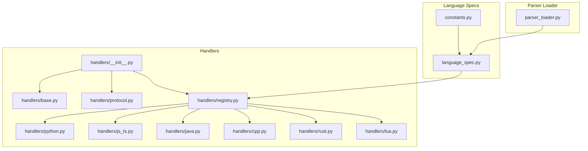
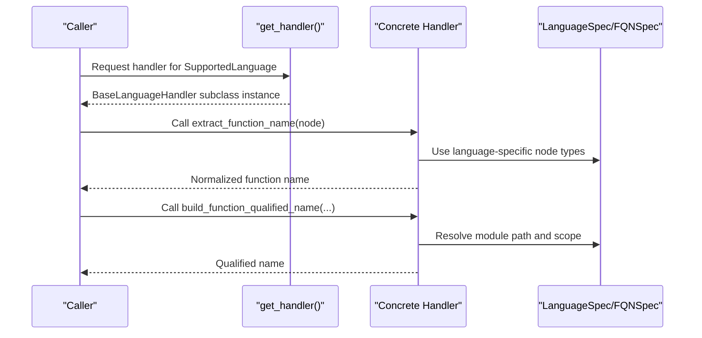
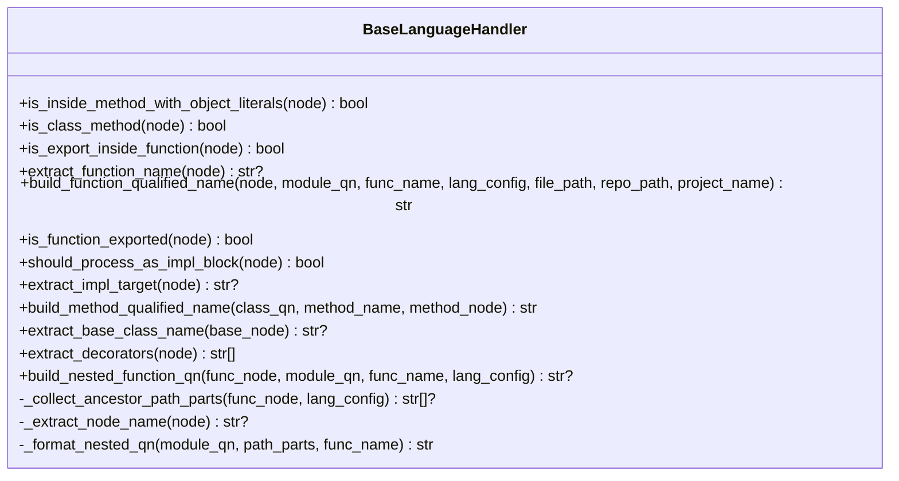
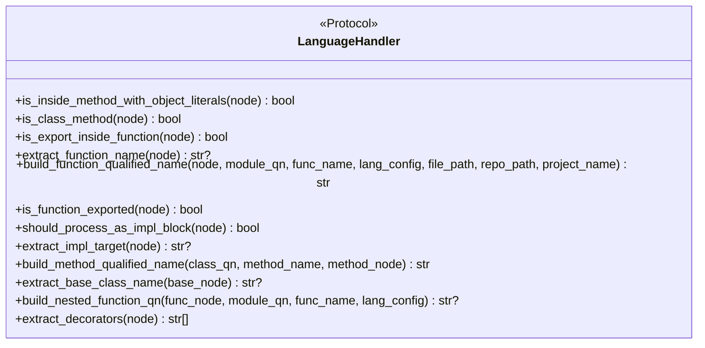
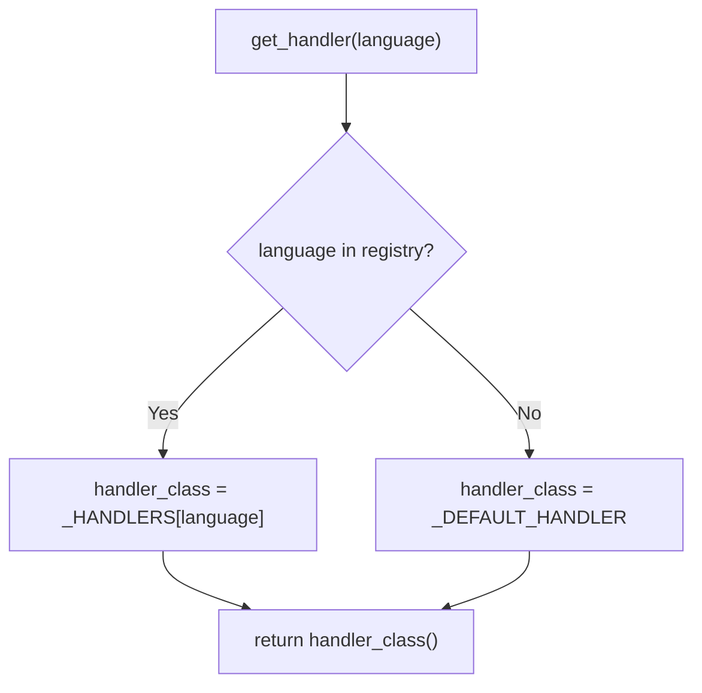
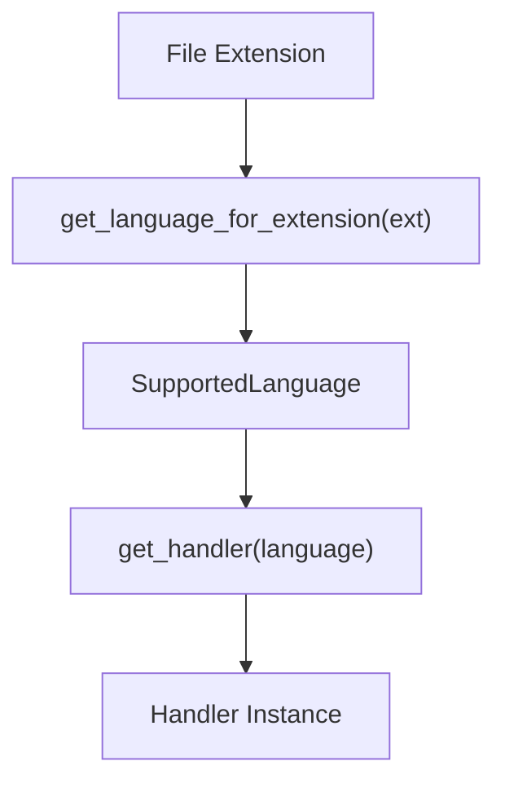
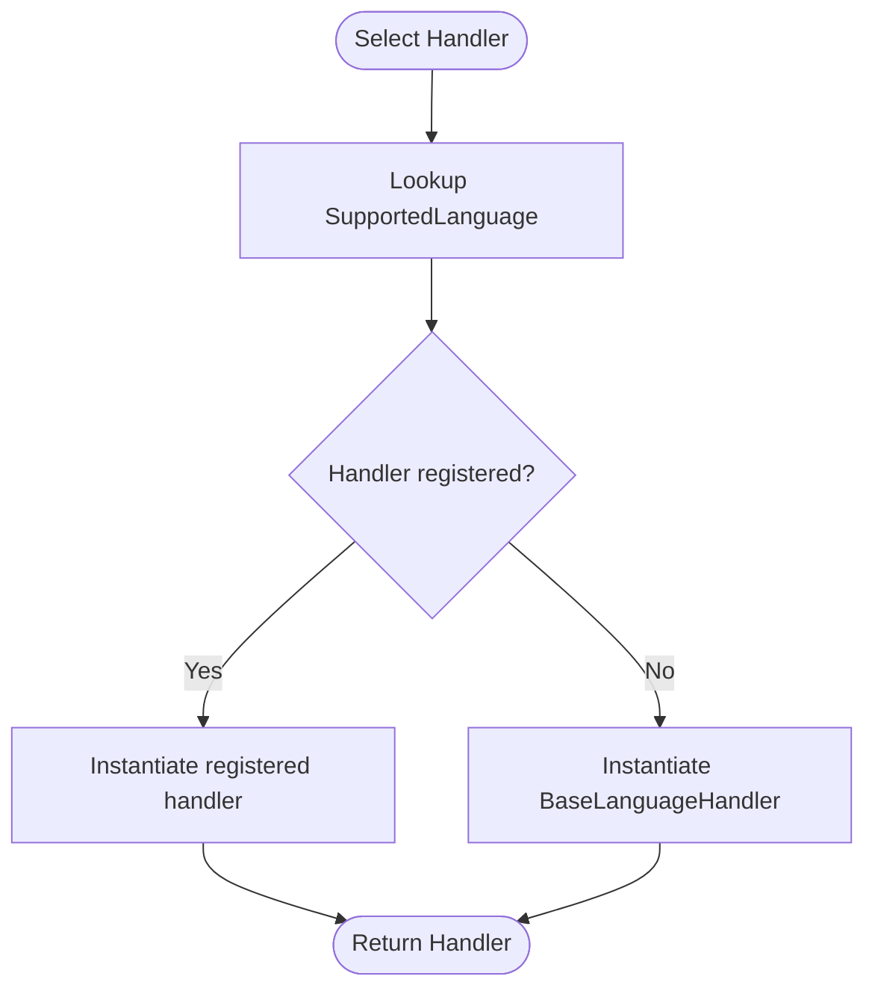
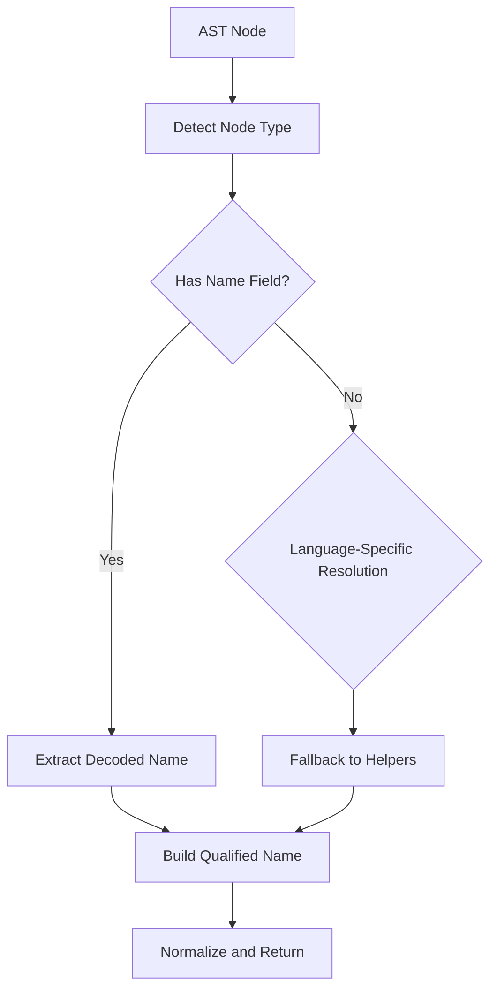
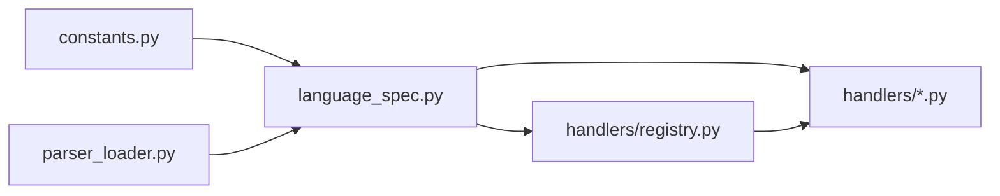

# Language Handlers

<cite>
**Referenced Files in This Document**
- [handlers/__init__.py](file://codebase_rag/parsers/handlers/__init__.py)
- [handlers/base.py](file://codebase_rag/parsers/handlers/base.py)
- [handlers/protocol.py](file://codebase_rag/parsers/handlers/protocol.py)
- [handlers/registry.py](file://codebase_rag/parsers/handlers/registry.py)
- [handlers/python.py](file://codebase_rag/parsers/handlers/python.py)
- [handlers/js_ts.py](file://codebase_rag/parsers/handlers/js_ts.py)
- [handlers/java.py](file://codebase_rag/parsers/handlers/java.py)
- [handlers/cpp.py](file://codebase_rag/parsers/handlers/cpp.py)
- [handlers/rust.py](file://codebase_rag/parsers/handlers/rust.py)
- [handlers/lua.py](file://codebase_rag/parsers/handlers/lua.py)
- [constants.py](file://codebase_rag/constants.py)
- [language_spec.py](file://codebase_rag/language_spec.py)
- [parser_loader.py](file://codebase_rag/parser_loader.py)
</cite>

## Table of Contents
1. [Introduction](#introduction)
2. [Project Structure](#project-structure)
3. [Core Components](#core-components)
4. [Architecture Overview](#architecture-overview)
5. [Detailed Component Analysis](#detailed-component-analysis)
6. [Dependency Analysis](#dependency-analysis)
7. [Performance Considerations](#performance-considerations)
8. [Troubleshooting Guide](#troubleshooting-guide)
9. [Conclusion](#conclusion)

## Introduction
This document explains the multi-language handler system used to extract and transform AST nodes into knowledge graph entities. It covers the handler architecture pattern, the base handler interface, the handler registry, dynamic language detection via file extensions, and language-specific implementations for Python, JavaScript/TypeScript, Java, C++, Rust, and Lua. It also documents the handler selection algorithm, fallback mechanisms, and practical guidance for extending the system with new languages.

## Project Structure
The handler system resides under codebase_rag/parsers/handlers and integrates with language specifications and parser loading infrastructure.

**Diagram sources**
- [handlers/__init__.py](file://codebase_rag/parsers/handlers/__init__.py#L1-L10)
- [handlers/base.py](file://codebase_rag/parsers/handlers/base.py#L1-L108)
- [handlers/protocol.py](file://codebase_rag/parsers/handlers/protocol.py#L1-L56)
- [handlers/registry.py](file://codebase_rag/parsers/handlers/registry.py#L1-L32)
- [handlers/python.py](file://codebase_rag/parsers/handlers/python.py#L1-L23)
- [handlers/js_ts.py](file://codebase_rag/parsers/handlers/js_ts.py#L1-L116)
- [handlers/java.py](file://codebase_rag/parsers/handlers/java.py#L1-L29)
- [handlers/cpp.py](file://codebase_rag/parsers/handlers/cpp.py#L1-L60)
- [handlers/rust.py](file://codebase_rag/parsers/handlers/rust.py#L1-L71)
- [handlers/lua.py](file://codebase_rag/parsers/handlers/lua.py#L1-L26)
- [language_spec.py](file://codebase_rag/language_spec.py#L1-L426)
- [constants.py](file://codebase_rag/constants.py#L426-L507)
- [parser_loader.py](file://codebase_rag/parser_loader.py#L1-L293)

**Section sources**
- [handlers/__init__.py](file://codebase_rag/parsers/handlers/__init__.py#L1-L10)
- [handlers/registry.py](file://codebase_rag/parsers/handlers/registry.py#L1-L32)
- [language_spec.py](file://codebase_rag/language_spec.py#L205-L426)
- [constants.py](file://codebase_rag/constants.py#L426-L507)
- [parser_loader.py](file://codebase_rag/parser_loader.py#L1-L293)

## Core Components
- BaseLanguageHandler: Defines the common interface and shared helpers for extracting names, building qualified names, and managing nested scopes.
- LanguageHandler Protocol: Formalizes the contract that each language-specific handler must satisfy.
- Handler Registry: Maps SupportedLanguage to concrete handler classes and provides a cached factory for handler instances.
- Language Specifications: Define AST node types, queries, and module-to-QN mapping for each language.
- Parser Loader: Loads Tree-sitter grammars and builds language-specific queries used downstream by processors.

Key responsibilities:
- Extract function/class/method names from AST nodes.
- Build qualified names scoped to modules and nested contexts.
- Detect language constructs like decorators, exports, and impl blocks.
- Provide language-aware fallbacks and normalization.

**Section sources**
- [handlers/base.py](file://codebase_rag/parsers/handlers/base.py#L15-L108)
- [handlers/protocol.py](file://codebase_rag/parsers/handlers/protocol.py#L12-L56)
- [handlers/registry.py](file://codebase_rag/parsers/handlers/registry.py#L15-L32)
- [language_spec.py](file://codebase_rag/language_spec.py#L205-L426)
- [parser_loader.py](file://codebase_rag/parser_loader.py#L222-L248)

## Architecture Overview
The handler system follows a layered architecture:
- Language detection: File extension to SupportedLanguage mapping via language_spec.
- Handler selection: get_handler(language) returns a concrete handler instance.
- AST processing: Handlers interpret Tree-sitter nodes and produce normalized identifiers and qualified names.
- Knowledge graph conversion: Processors translate normalized entities into graph nodes and relationships.

**Diagram sources**
- [handlers/registry.py](file://codebase_rag/parsers/handlers/registry.py#L28-L32)
- [handlers/base.py](file://codebase_rag/parsers/handlers/base.py#L25-L40)
- [language_spec.py](file://codebase_rag/language_spec.py#L190-L202)

## Detailed Component Analysis

### Base Handler Class
The base class centralizes shared logic:
- Name extraction helpers using Tree-sitter field names.
- Nested function qualified name construction by walking ancestors.
- Default implementations for decorators, exports, and class methods.

**Diagram sources**
- [handlers/base.py](file://codebase_rag/parsers/handlers/base.py#L15-L108)

**Section sources**
- [handlers/base.py](file://codebase_rag/parsers/handlers/base.py#L15-L108)

### Handler Protocol
Defines the canonical interface that all language handlers must implement. This ensures consistent behavior across languages for downstream processors.

**Diagram sources**
- [handlers/protocol.py](file://codebase_rag/parsers/handlers/protocol.py#L12-L56)

**Section sources**
- [handlers/protocol.py](file://codebase_rag/parsers/handlers/protocol.py#L12-L56)

### Handler Registry and Selection
The registry maps SupportedLanguage to concrete handler classes and caches instances for performance. The default handler is the base class.

**Diagram sources**
- [handlers/registry.py](file://codebase_rag/parsers/handlers/registry.py#L15-L32)

**Section sources**
- [handlers/registry.py](file://codebase_rag/parsers/handlers/registry.py#L15-L32)

### Dynamic Language Detection
Language detection is driven by file extensions mapped to SupportedLanguage via language specifications. The parser loader consumes LanguageSpec to configure Tree-sitter parsers and queries.

**Diagram sources**
- [language_spec.py](file://codebase_rag/language_spec.py#L417-L425)
- [handlers/registry.py](file://codebase_rag/parsers/handlers/registry.py#L28-L32)

**Section sources**
- [language_spec.py](file://codebase_rag/language_spec.py#L417-L425)
- [parser_loader.py](file://codebase_rag/parser_loader.py#L222-L248)

### Language-Specific Handlers

#### Python Handler
- Extends decorator extraction to Python’s decorated definitions.
- Inherits base helpers for nested QN and default behaviors.

**Section sources**
- [handlers/python.py](file://codebase_rag/parsers/handlers/python.py#L13-L23)
- [handlers/base.py](file://codebase_rag/parsers/handlers/base.py#L62-L108)

#### JavaScript/TypeScript Handler
- Extracts decorators from decorator nodes.
- Detects object literals inside methods and class methods.
- Handles export-inside-function checks and arrow function name resolution.
- Builds nested function qualified names with method definitions included.

**Section sources**
- [handlers/js_ts.py](file://codebase_rag/parsers/handlers/js_ts.py#L14-L116)
- [handlers/base.py](file://codebase_rag/parsers/handlers/base.py#L62-L108)

#### Java Handler
- Extracts annotations from modifiers.
- Builds method qualified names including parameter signatures.

**Section sources**
- [handlers/java.py](file://codebase_rag/parsers/handlers/java.py#L13-L29)
- [handlers/base.py](file://codebase_rag/parsers/handlers/base.py#L51-L57)

#### C++ Handler
- Extracts function names using language utilities and generates lambda names when anonymous.
- Builds qualified names using FQN specs and falls back to module path utilities.
- Detects exported functions and extracts base class names from template types.

**Section sources**
- [handlers/cpp.py](file://codebase_rag/parsers/handlers/cpp.py#L19-L60)
- [language_spec.py](file://codebase_rag/language_spec.py#L190-L202)

#### Rust Handler
- Extracts outer and inner attributes as decorators.
- Builds qualified names using FQN specs and module path utilities.
- Treats impl items as special processing blocks and extracts target types.

**Section sources**
- [handlers/rust.py](file://codebase_rag/parsers/handlers/rust.py#L19-L71)
- [language_spec.py](file://codebase_rag/language_spec.py#L190-L202)

#### Lua Handler
- Extracts function names from named definitions and assigned names in function definitions.

**Section sources**
- [handlers/lua.py](file://codebase_rag/parsers/handlers/lua.py#L13-L26)

### Handler Selection Algorithm and Fallback Mechanisms
- Selection: get_handler(language) returns a concrete handler if present; otherwise returns a base handler instance.
- Caching: The registry caches up to a fixed number of handler instances to reduce overhead.
- Fallback: Base handler provides default behaviors for unsupported languages or optional features.

**Diagram sources**
- [handlers/registry.py](file://codebase_rag/parsers/handlers/registry.py#L15-L32)

**Section sources**
- [handlers/registry.py](file://codebase_rag/parsers/handlers/registry.py#L15-L32)

### Node Processing Workflows
Each handler interprets AST nodes according to language-specific rules. Typical steps:
- Identify node type and extract name via Tree-sitter fields.
- Walk ancestor nodes to build nested qualified names.
- Apply language-specific heuristics (e.g., decorators, exports, impl blocks).
- Normalize and return qualified names for graph entity creation.

[No sources needed since this diagram shows conceptual workflow, not actual code structure]

## Dependency Analysis
- Registry depends on SupportedLanguage and concrete handler classes.
- Handlers depend on language_spec for node types and FQN specs.
- Parser loader depends on language_spec to construct queries and on constants for grammar modules.

**Diagram sources**
- [constants.py](file://codebase_rag/constants.py#L426-L507)
- [language_spec.py](file://codebase_rag/language_spec.py#L205-L426)
- [handlers/registry.py](file://codebase_rag/parsers/handlers/registry.py#L15-L32)
- [parser_loader.py](file://codebase_rag/parser_loader.py#L222-L248)

**Section sources**
- [constants.py](file://codebase_rag/constants.py#L426-L507)
- [language_spec.py](file://codebase_rag/language_spec.py#L205-L426)
- [handlers/registry.py](file://codebase_rag/parsers/handlers/registry.py#L15-L32)
- [parser_loader.py](file://codebase_rag/parser_loader.py#L222-L248)

## Performance Considerations
- Handler instantiation is cached to avoid repeated allocations.
- Name extraction and ancestor traversal are linear in nesting depth; keep nesting reasonable.
- Tree-sitter queries are prebuilt per language; ensure minimal re-querying in processors.

[No sources needed since this section provides general guidance]

## Troubleshooting Guide
Common issues and remedies:
- No handlers loaded: Verify Tree-sitter grammars are available and parser loader succeeds.
- Incorrect language detection: Confirm file extension mapping and SupportedLanguage values.
- Missing qualified names: Ensure language spec includes function/class/module node types and queries.
- Decorator extraction returns empty: Check language-specific node types and field names.

**Section sources**
- [parser_loader.py](file://codebase_rag/parser_loader.py#L251-L292)
- [language_spec.py](file://codebase_rag/language_spec.py#L205-L426)
- [constants.py](file://codebase_rag/constants.py#L426-L507)

## Conclusion
The handler system provides a robust, extensible foundation for language-aware AST processing. By adhering to the LanguageHandler protocol, leveraging language specifications, and using the registry for selection, new languages can be added with minimal boilerplate. Handlers encapsulate language-specific nuances while sharing common infrastructure for consistent knowledge graph generation.