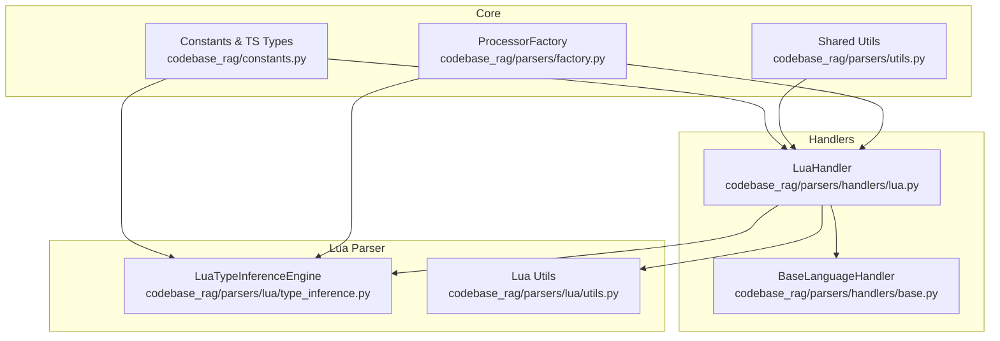
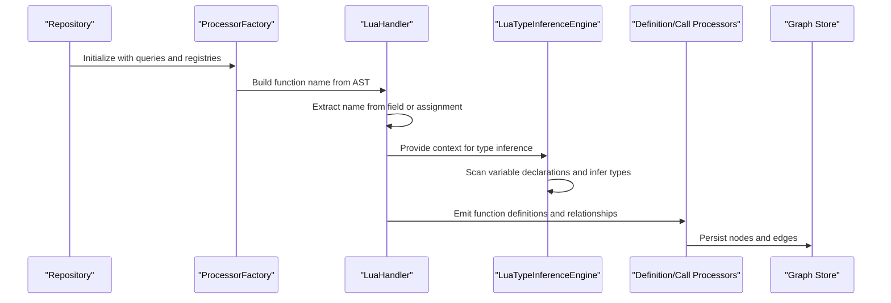
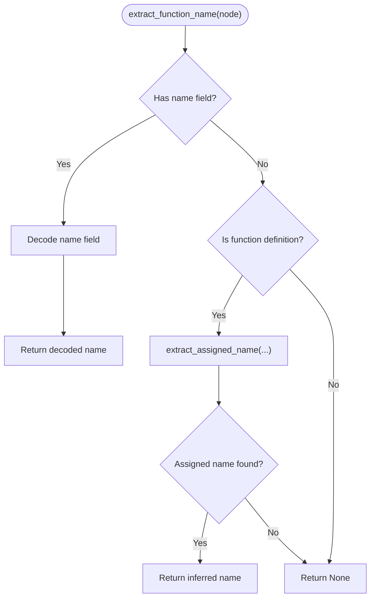
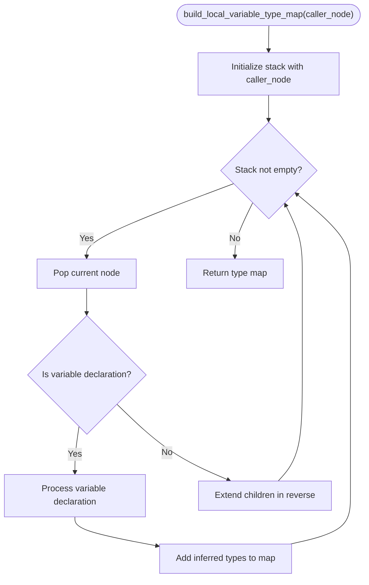
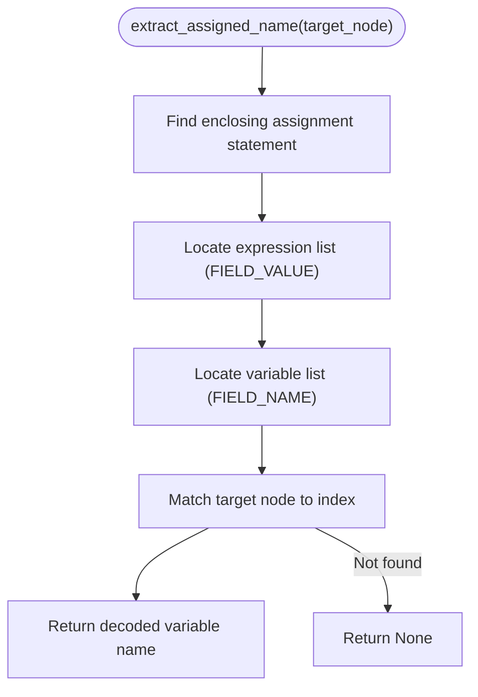
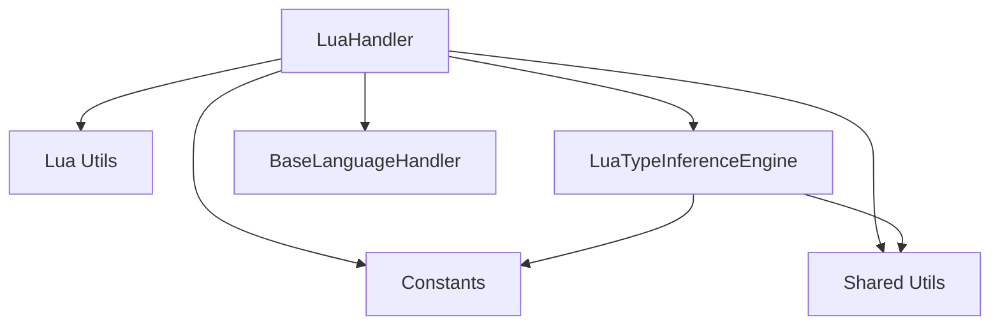

# Lua Handler

<cite>
**Referenced Files in This Document**
- [lua.py](file://codebase_rag/parsers/handlers/lua.py)
- [__init__.py](file://codebase_rag/parsers/lua/__init__.py)
- [type_inference.py](file://codebase_rag/parsers/lua/type_inference.py)
- [utils.py](file://codebase_rag/parsers/lua/utils.py)
- [base.py](file://codebase_rag/parsers/handlers/base.py)
- [constants.py](file://codebase_rag/constants.py)
- [utils.py](file://codebase_rag/parsers/utils.py)
- [factory.py](file://codebase_rag/parsers/factory.py)
- [test_lua_functions.py](file://codebase_rag/tests/test_lua_functions.py)
- [test_lua_table_manipulation.py](file://codebase_rag/tests/test_lua_table_manipulation.py)
- [test_lua_coroutines.py](file://codebase_rag/tests/test_lua_coroutines.py)
- [test_lua_metatables.py](file://codebase_rag/tests/test_lua_metatables.py)
- [test_lua_comprehensive.py](file://codebase_rag/tests/test_lua_comprehensive.py)
</cite>

## Table of Contents
1. [Introduction](#introduction)
2. [Project Structure](#project-structure)
3. [Core Components](#core-components)
4. [Architecture Overview](#architecture-overview)
5. [Detailed Component Analysis](#detailed-component-analysis)
6. [Dependency Analysis](#dependency-analysis)
7. [Performance Considerations](#performance-considerations)
8. [Troubleshooting Guide](#troubleshooting-guide)
9. [Conclusion](#conclusion)

## Introduction
This document explains the Lua language handler implementation used to parse and analyze Lua code within the codebase. It focuses on how the LuaHandler extracts function names from Tree-sitter AST nodes, how Lua-specific features are handled (tables, closures, coroutines, metatables), and how dynamic type inference works. It also covers function analysis (including closures and varargs), table processing, coroutine handling, string and pattern processing, and the module system. Examples of parsing and relationship extraction are included to illustrate practical usage.

## Project Structure
The Lua handler is part of a modular parsing pipeline that leverages Tree-sitter for AST parsing and a set of processors to discover definitions, track calls, infer types, and manage imports. The Lua-specific logic resides under the Lua parser package and handler modules.

**Diagram sources**
- [lua.py](file://codebase_rag/parsers/handlers/lua.py#L13-L26)
- [base.py](file://codebase_rag/parsers/handlers/base.py#L15-L108)
- [type_inference.py](file://codebase_rag/parsers/lua/type_inference.py#L16-L144)
- [utils.py](file://codebase_rag/parsers/lua/utils.py#L1-L97)
- [factory.py](file://codebase_rag/parsers/factory.py#L18-L116)
- [utils.py](file://codebase_rag/parsers/utils.py#L1-L169)
- [constants.py](file://codebase_rag/constants.py#L1623-L1638)

**Section sources**
- [lua.py](file://codebase_rag/parsers/handlers/lua.py#L1-L26)
- [base.py](file://codebase_rag/parsers/handlers/base.py#L1-L108)
- [type_inference.py](file://codebase_rag/parsers/lua/type_inference.py#L1-L144)
- [utils.py](file://codebase_rag/parsers/lua/utils.py#L1-L97)
- [factory.py](file://codebase_rag/parsers/factory.py#L1-L116)
- [utils.py](file://codebase_rag/parsers/utils.py#L1-L169)
- [constants.py](file://codebase_rag/constants.py#L1623-L1638)

## Core Components
- LuaHandler: Extends the base handler to extract function names from Tree-sitter Lua nodes. It supports both named function definitions and inferred names from assignments.
- LuaTypeInferenceEngine: Builds a local variable type map by scanning variable declarations and inferring types from function calls, including method index expressions.
- Lua Utils: Provides helpers for extracting assigned names, finding ancestor statements, and extracting identifiers from pcall patterns.
- BaseLanguageHandler: Defines common behaviors for language handlers, including function name extraction and qualified name building.
- Shared Utilities: Provide decoding, query cursors, and ingestion helpers used across languages.
- Constants: Define Tree-sitter node types and field names for Lua grammar.

Key responsibilities:
- Function discovery and naming for Lua modules and local scopes.
- Local type inference for variables initialized via function calls.
- Safe decoding of Tree-sitter node text to avoid encoding issues.
- Relationship extraction for function definitions and calls.

**Section sources**
- [lua.py](file://codebase_rag/parsers/handlers/lua.py#L13-L26)
- [type_inference.py](file://codebase_rag/parsers/lua/type_inference.py#L27-L144)
- [utils.py](file://codebase_rag/parsers/lua/utils.py#L7-L97)
- [base.py](file://codebase_rag/parsers/handlers/base.py#L15-L108)
- [utils.py](file://codebase_rag/parsers/utils.py#L48-L169)
- [constants.py](file://codebase_rag/constants.py#L1623-L1638)

## Architecture Overview
The Lua handler participates in a layered pipeline:
- Factory constructs processors (Import, Definition, Type Inference, Call) and injects shared dependencies.
- Handlers (LuaHandler) use Tree-sitter node types and field names to extract names and relationships.
- LuaTypeInferenceEngine traverses the AST to infer types for local variables.
- Tests validate parsing and relationship extraction for Lua constructs.

**Diagram sources**
- [factory.py](file://codebase_rag/parsers/factory.py#L18-L116)
- [lua.py](file://codebase_rag/parsers/handlers/lua.py#L13-L26)
- [type_inference.py](file://codebase_rag/parsers/lua/type_inference.py#L27-L144)
- [utils.py](file://codebase_rag/parsers/utils.py#L75-L169)

## Detailed Component Analysis

### LuaHandler: Function Name Extraction
Purpose:
- Extract function names from Tree-sitter AST nodes for Lua grammar.
- Support both explicit function definitions and inferred names from assignments.

Behavior:
- If a node has a name field, decode and return it.
- For function definitions, attempt to extract an assigned name using Lua-specific utilities.
- Return None if no name is found.

**Diagram sources**
- [lua.py](file://codebase_rag/parsers/handlers/lua.py#L14-L25)
- [utils.py](file://codebase_rag/parsers/lua/utils.py#L7-L63)

**Section sources**
- [lua.py](file://codebase_rag/parsers/handlers/lua.py#L13-L26)
- [utils.py](file://codebase_rag/parsers/lua/utils.py#L7-L63)

### LuaTypeInferenceEngine: Local Variable Type Inference
Purpose:
- Build a local variable type map by scanning variable declarations and inferring types from function calls.

Key steps:
- Traverse the AST depth-first, collecting variable declarations.
- Extract variable names and associated function calls from assignments.
- Infer types for variables based on method index expressions and resolve class names via import mapping and function registry.

**Diagram sources**
- [type_inference.py](file://codebase_rag/parsers/lua/type_inference.py#L27-L40)
- [type_inference.py](file://codebase_rag/parsers/lua/type_inference.py#L42-L68)

**Section sources**
- [type_inference.py](file://codebase_rag/parsers/lua/type_inference.py#L27-L144)

### Lua Utils: Assignment and Statement Helpers
Purpose:
- Extract assigned names from assignment statements.
- Find ancestor statements for context-aware extraction.
- Extract second identifier from pcall patterns.

Highlights:
- Walk up the AST to locate the enclosing assignment statement.
- Locate expression lists and variable lists to map values to names.
- Support for FIELD_NAME and FIELD_VALUE to correlate targets and values.

**Diagram sources**
- [utils.py](file://codebase_rag/parsers/lua/utils.py#L7-L63)

**Section sources**
- [utils.py](file://codebase_rag/parsers/lua/utils.py#L7-L97)

### BaseLanguageHandler: Common Handler Behavior
Purpose:
- Provide default behaviors for language handlers, including function name extraction and qualified name construction.

Highlights:
- Default name extraction via Tree-sitter name field.
- Nested function qualified name formatting.
- Method name building and decorator extraction stubs.

**Section sources**
- [base.py](file://codebase_rag/parsers/handlers/base.py#L15-L108)

### Constants: Tree-Sitter Lua Types and Fields
Purpose:
- Define Tree-sitter node types and field names for Lua grammar.

Highlights:
- Lua-specific node types: function declarations, assignments, calls, identifiers, variable lists, expression lists.
- Statement suffix and default variable types for Lua.
- Method separator for Lua methods.

**Section sources**
- [constants.py](file://codebase_rag/constants.py#L1623-L1638)

### Shared Utilities: Decoding and Ingestion
Purpose:
- Provide safe decoding of Tree-sitter text and ingestion helpers used across languages.

Highlights:
- LRU-cached decoding to avoid repeated byte-to-string conversions.
- Ingest helpers for methods and exported functions, including docstrings and decorators.

**Section sources**
- [utils.py](file://codebase_rag/parsers/utils.py#L48-L169)

## Dependency Analysis
The Lua handler depends on:
- Tree-sitter Lua node types and field names defined in constants.
- Lua-specific utilities for name extraction and statement traversal.
- Type inference engine for local variable type inference.
- Shared utilities for decoding and ingestion.

**Diagram sources**
- [lua.py](file://codebase_rag/parsers/handlers/lua.py#L13-L26)
- [utils.py](file://codebase_rag/parsers/lua/utils.py#L1-L97)
- [type_inference.py](file://codebase_rag/parsers/lua/type_inference.py#L16-L144)
- [base.py](file://codebase_rag/parsers/handlers/base.py#L15-L108)
- [utils.py](file://codebase_rag/parsers/utils.py#L1-L169)
- [constants.py](file://codebase_rag/constants.py#L1623-L1638)

**Section sources**
- [lua.py](file://codebase_rag/parsers/handlers/lua.py#L1-L26)
- [utils.py](file://codebase_rag/parsers/lua/utils.py#L1-L97)
- [type_inference.py](file://codebase_rag/parsers/lua/type_inference.py#L1-L144)
- [base.py](file://codebase_rag/parsers/handlers/base.py#L1-L108)
- [utils.py](file://codebase_rag/parsers/utils.py#L1-L169)
- [constants.py](file://codebase_rag/constants.py#L1623-L1638)

## Performance Considerations
- AST traversal is iterative with a stack to avoid recursion overhead.
- LRU caching for decoding reduces repeated string conversions.
- Local type inference scans only relevant variable declarations, minimizing unnecessary work.
- Using Tree-sitter’s child iteration and field name lookups ensures efficient node navigation.

[No sources needed since this section provides general guidance]

## Troubleshooting Guide
Common issues and resolutions:
- Missing function names: Verify the presence of a name field or that assignment-based extraction is applied for function definitions.
- Incorrect variable types: Ensure variable declarations are present and that function calls are recognized as method index expressions.
- Encoding errors: Confirm that Tree-sitter text is decoded safely using the shared decoding utilities.
- Relationship extraction failures: Validate that the module qualified name and function names are constructed correctly and that relationships are emitted during ingestion.

**Section sources**
- [lua.py](file://codebase_rag/parsers/handlers/lua.py#L13-L26)
- [type_inference.py](file://codebase_rag/parsers/lua/type_inference.py#L27-L144)
- [utils.py](file://codebase_rag/parsers/utils.py#L48-L169)

## Conclusion
The Lua handler integrates tightly with Tree-sitter and the broader parsing pipeline to extract function names, infer local variable types, and support Lua-specific features. Its design emphasizes correctness and performance through careful AST traversal, safe decoding, and targeted type inference. The included tests demonstrate parsing and relationship extraction for functions, tables, coroutines, metatables, and module systems, validating the handler’s capabilities across diverse Lua scenarios.