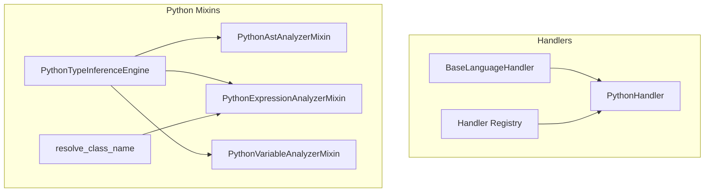
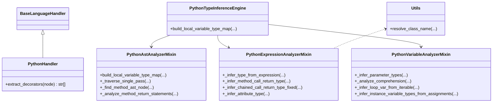
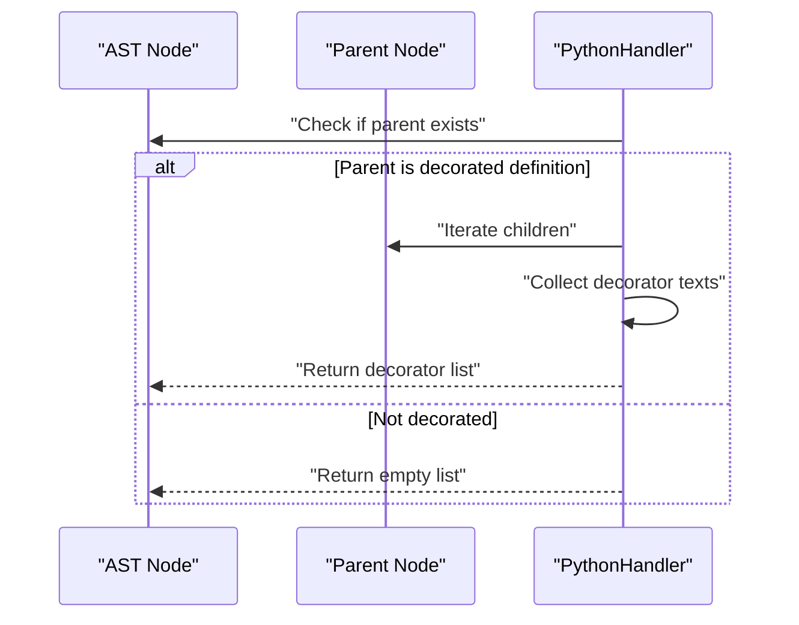
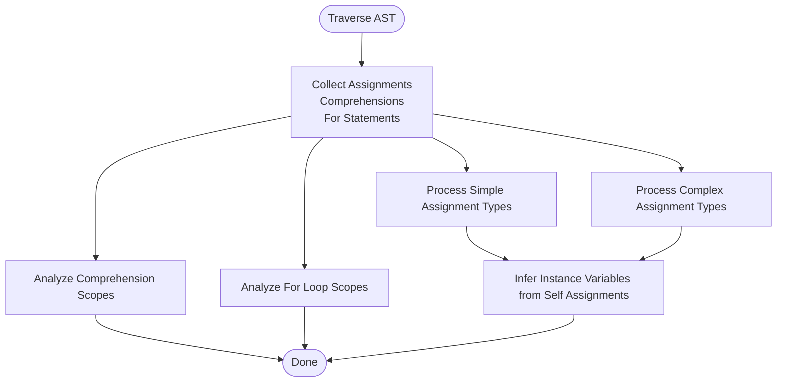
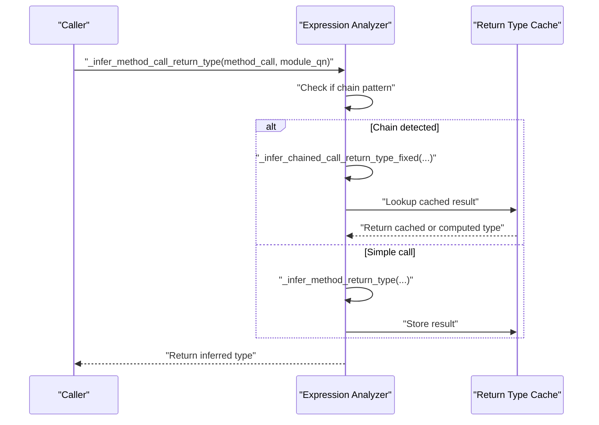
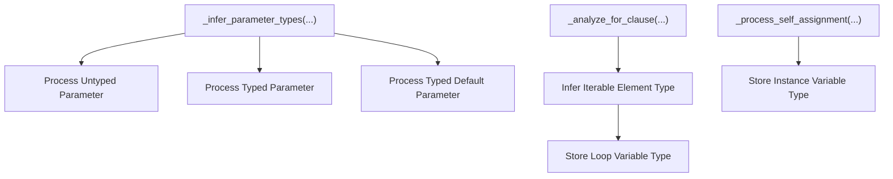
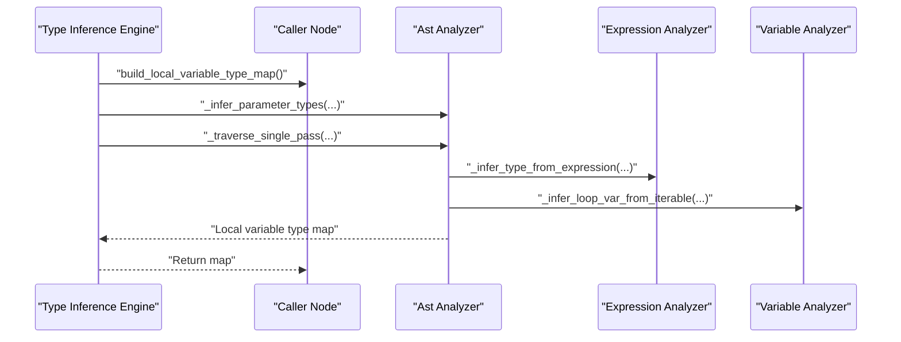
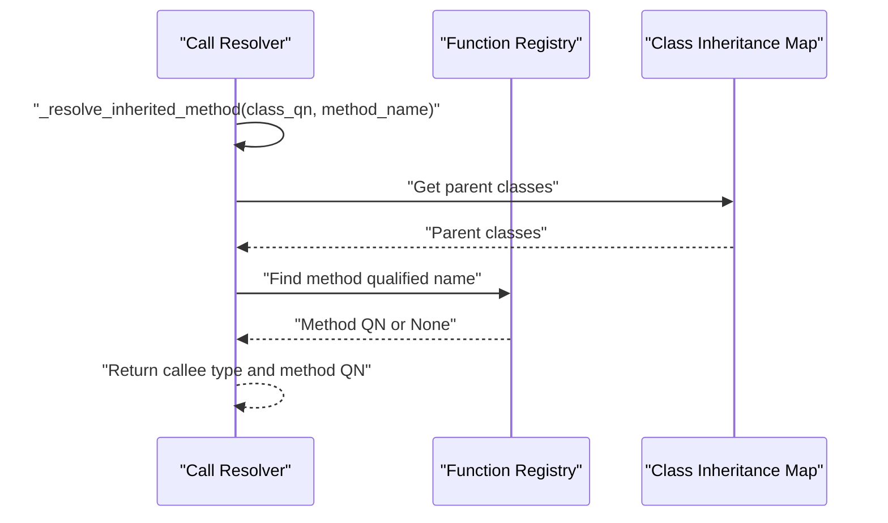
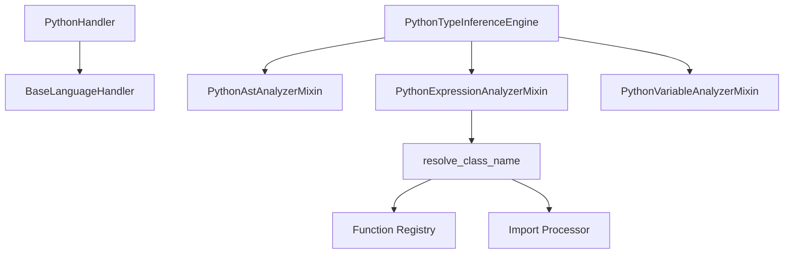

# Python Handler

<cite>
**Referenced Files in This Document**
- [python.py](file://codebase_rag/parsers/handlers/python.py)
- [base.py](file://codebase_rag/parsers/handlers/base.py)
- [registry.py](file://codebase_rag/parsers/handlers/registry.py)
- [ast_analyzer.py](file://codebase_rag/parsers/py/ast_analyzer.py)
- [expression_analyzer.py](file://codebase_rag/parsers/py/expression_analyzer.py)
- [type_inference.py](file://codebase_rag/parsers/py/type_inference.py)
- [variable_analyzer.py](file://codebase_rag/parsers/py/variable_analyzer.py)
- [utils.py](file://codebase_rag/parsers/py/utils.py)
- [constants.py](file://codebase_rag/constants.py)
- [call_resolver.py](file://codebase_rag/parsers/call_resolver.py)
</cite>

## Table of Contents
1. [Introduction](#introduction)
2. [Project Structure](#project-structure)
3. [Core Components](#core-components)
4. [Architecture Overview](#architecture-overview)
5. [Detailed Component Analysis](#detailed-component-analysis)
6. [Dependency Analysis](#dependency-analysis)
7. [Performance Considerations](#performance-considerations)
8. [Troubleshooting Guide](#troubleshooting-guide)
9. [Conclusion](#conclusion)
10. [Appendices](#appendices)

## Introduction
This document explains the Python language handler implementation and how it processes Python AST nodes from Tree-sitter to build a knowledge graph. It covers Python-specific features such as decorators, nested functions, classes, inheritance, and type hints. It also documents the AST analyzer functionality for extracting function definitions, class hierarchies, and import statements, along with the type inference system for Python’s dynamic typing and variable analysis for scope tracking. Relationship extraction for method resolution order and attribute access patterns is explained, alongside handling of Python constructs like generators, context managers, and metaclasses. Examples of Python code parsing and knowledge graph node generation are included, along with version compatibility and language evolution considerations.

## Project Structure
The Python handler is part of a modular language-processing framework. The Python-specific logic is organized under parsers/py, while the handler sits under parsers/handlers. The handler extends a generic base and integrates with mixins that implement AST analysis, expression inference, variable analysis, and type inference.

**Diagram sources**
- [base.py](file://codebase_rag/parsers/handlers/base.py#L15-L108)
- [python.py](file://codebase_rag/parsers/handlers/python.py#L13-L23)
- [registry.py](file://codebase_rag/parsers/handlers/registry.py#L15-L32)
- [ast_analyzer.py](file://codebase_rag/parsers/py/ast_analyzer.py#L47-L75)
- [expression_analyzer.py](file://codebase_rag/parsers/py/expression_analyzer.py#L42-L50)
- [variable_analyzer.py](file://codebase_rag/parsers/py/variable_analyzer.py#L25-L30)
- [type_inference.py](file://codebase_rag/parsers/py/type_inference.py#L28-L56)
- [utils.py](file://codebase_rag/parsers/py/utils.py#L10-L39)

**Section sources**
- [python.py](file://codebase_rag/parsers/handlers/python.py#L1-L23)
- [base.py](file://codebase_rag/parsers/handlers/base.py#L15-L108)
- [registry.py](file://codebase_rag/parsers/handlers/registry.py#L15-L32)

## Core Components
- PythonHandler: Extends the base handler and adds Python-specific decorator extraction logic.
- PythonAstAnalyzerMixin: Traverses AST nodes to infer types from assignments, comprehensions, loops, and return statements; resolves method AST nodes and return types.
- PythonExpressionAnalyzerMixin: Infers types from expressions, method calls, chained calls, and attribute access; caches method return types and guards against recursion.
- PythonVariableAnalyzerMixin: Infers parameter types, loop variable element types, and instance variable types from self assignments; resolves class names from scope and imports.
- PythonTypeInferenceEngine: Orchestrates single-pass traversal and builds local variable type maps for callers.
- resolve_class_name: Resolves a class name to a qualified name using import mappings and registry lookups.

**Section sources**
- [python.py](file://codebase_rag/parsers/handlers/python.py#L13-L23)
- [ast_analyzer.py](file://codebase_rag/parsers/py/ast_analyzer.py#L47-L111)
- [expression_analyzer.py](file://codebase_rag/parsers/py/expression_analyzer.py#L42-L137)
- [variable_analyzer.py](file://codebase_rag/parsers/py/variable_analyzer.py#L25-L101)
- [type_inference.py](file://codebase_rag/parsers/py/type_inference.py#L28-L74)
- [utils.py](file://codebase_rag/parsers/py/utils.py#L10-L39)

## Architecture Overview
The Python handler integrates with Tree-sitter ASTs and a function registry to extract and infer types. The type inference engine coordinates three mixins: AST analysis, expression analysis, and variable analysis. It caches method return types and guards against infinite recursion during chained call inference.

**Diagram sources**
- [base.py](file://codebase_rag/parsers/handlers/base.py#L15-L108)
- [python.py](file://codebase_rag/parsers/handlers/python.py#L13-L23)
- [ast_analyzer.py](file://codebase_rag/parsers/py/ast_analyzer.py#L47-L111)
- [expression_analyzer.py](file://codebase_rag/parsers/py/expression_analyzer.py#L42-L137)
- [variable_analyzer.py](file://codebase_rag/parsers/py/variable_analyzer.py#L25-L101)
- [type_inference.py](file://codebase_rag/parsers/py/type_inference.py#L28-L74)
- [utils.py](file://codebase_rag/parsers/py/utils.py#L10-L39)

## Detailed Component Analysis

### PythonHandler: Decorators and Nested Functions
- Decorators: Extracts decorators from decorated definitions by scanning siblings of a node when the parent is marked as a decorated definition.
- Nested Functions: Uses the base handler’s nested function naming logic to build qualified names for nested scopes.

**Diagram sources**
- [python.py](file://codebase_rag/parsers/handlers/python.py#L14-L22)
- [base.py](file://codebase_rag/parsers/handlers/base.py#L78-L107)

**Section sources**
- [python.py](file://codebase_rag/parsers/handlers/python.py#L13-L23)
- [base.py](file://codebase_rag/parsers/handlers/base.py#L62-L107)

### AST Analyzer: Function Definitions, Classes, Imports
- Single-pass traversal: Collects assignments, comprehensions, and for statements; processes simple and complex assignments; infers instance variable types from self assignments.
- Method lookup: Queries Tree-sitter captures for classes and functions, then locates a method by name within a class body.
- Return statement analysis: Recursively finds return statements and infers return types from calls, identifiers, and attributes.

**Diagram sources**
- [ast_analyzer.py](file://codebase_rag/parsers/py/ast_analyzer.py#L75-L111)
- [ast_analyzer.py](file://codebase_rag/parsers/py/ast_analyzer.py#L126-L171)
- [ast_analyzer.py](file://codebase_rag/parsers/py/ast_analyzer.py#L250-L283)

**Section sources**
- [ast_analyzer.py](file://codebase_rag/parsers/py/ast_analyzer.py#L75-L111)
- [ast_analyzer.py](file://codebase_rag/parsers/py/ast_analyzer.py#L126-L171)
- [ast_analyzer.py](file://codebase_rag/parsers/py/ast_analyzer.py#L250-L283)

### Expression Analyzer: Type Inference and Chained Calls
- Expression type inference: Recognizes constructor calls and list comprehensions to infer types.
- Method call inference: Resolves method qualified names, supports chained calls via regex-based suffix detection, and caches return types.
- Attribute inference: Infers attribute types from self assignments and scope-resolved class names.

**Diagram sources**
- [expression_analyzer.py](file://codebase_rag/parsers/py/expression_analyzer.py#L117-L137)
- [expression_analyzer.py](file://codebase_rag/parsers/py/expression_analyzer.py#L145-L173)
- [expression_analyzer.py](file://codebase_rag/parsers/py/expression_analyzer.py#L214-L229)

**Section sources**
- [expression_analyzer.py](file://codebase_rag/parsers/py/expression_analyzer.py#L51-L113)
- [expression_analyzer.py](file://codebase_rag/parsers/py/expression_analyzer.py#L117-L193)
- [expression_analyzer.py](file://codebase_rag/parsers/py/expression_analyzer.py#L214-L248)

### Variable Analyzer: Scope Tracking and Parameter Inference
- Parameter types: Processes untyped, typed, and typed-default parameters; infers parameter types by matching parameter names to available class names.
- Loop variables: Infers element types from iterables and list comprehensions.
- Instance variables: Extracts self.attribute assignments and stores inferred types.

**Diagram sources**
- [variable_analyzer.py](file://codebase_rag/parsers/py/variable_analyzer.py#L29-L101)
- [variable_analyzer.py](file://codebase_rag/parsers/py/variable_analyzer.py#L169-L201)
- [variable_analyzer.py](file://codebase_rag/parsers/py/variable_analyzer.py#L240-L262)

**Section sources**
- [variable_analyzer.py](file://codebase_rag/parsers/py/variable_analyzer.py#L29-L101)
- [variable_analyzer.py](file://codebase_rag/parsers/py/variable_analyzer.py#L169-L201)
- [variable_analyzer.py](file://codebase_rag/parsers/py/variable_analyzer.py#L240-L262)

### Type Inference Engine: Orchestration and Caching
- Builds a local variable type map for a caller by inferring parameter types and performing a single-pass traversal of the AST subtree.
- Caches method return types and guards against recursive inference.

**Diagram sources**
- [type_inference.py](file://codebase_rag/parsers/py/type_inference.py#L60-L74)
- [ast_analyzer.py](file://codebase_rag/parsers/py/ast_analyzer.py#L75-L111)
- [expression_analyzer.py](file://codebase_rag/parsers/py/expression_analyzer.py#L51-L113)
- [variable_analyzer.py](file://codebase_rag/parsers/py/variable_analyzer.py#L169-L201)

**Section sources**
- [type_inference.py](file://codebase_rag/parsers/py/type_inference.py#L28-L74)

### Relationship Extraction: Inheritance and Attribute Access
- Inheritance: Uses a class inheritance map to resolve overridden or inherited methods during call resolution.
- Attribute access: Infers attribute types from self assignments and scope-resolved class names.

**Diagram sources**
- [call_resolver.py](file://codebase_rag/parsers/call_resolver.py#L627-L632)
- [call_resolver.py](file://codebase_rag/parsers/call_resolver.py#L597-L625)

**Section sources**
- [call_resolver.py](file://codebase_rag/parsers/call_resolver.py#L594-L632)

### Python-Specific Features and Constructs
- Generators: Generator function declarations and generator expressions are recognized by Tree-sitter node types and handled consistently with function and comprehension logic.
- Context Managers: Context manager usage patterns are captured by AST nodes and can be analyzed via expression and assignment inference.
- Metaclasses: While not explicitly modeled here, class definitions and inheritance are captured by Tree-sitter and the class hierarchy is resolved via the function registry and inheritance map.

**Section sources**
- [constants.py](file://codebase_rag/constants.py#L510-L544)
- [constants.py](file://codebase_rag/constants.py#L530-L536)

### Examples: Parsing and Knowledge Graph Node Generation
- Function definitions: Extracted via AST queries and decorated with qualified names and decorators.
- Class hierarchies: Resolved by matching class names to qualified names using import mappings and registry lookups.
- Import statements: Handled by the import processor and used to resolve names and types across modules.

[No sources needed since this section provides general guidance]

## Dependency Analysis
The Python handler depends on Tree-sitter for AST parsing, a function registry for symbol lookups, and an import processor for resolving names. The type inference engine composes three mixins to coordinate inference across assignments, expressions, and variables.

**Diagram sources**
- [python.py](file://codebase_rag/parsers/handlers/python.py#L13-L23)
- [base.py](file://codebase_rag/parsers/handlers/base.py#L15-L108)
- [type_inference.py](file://codebase_rag/parsers/py/type_inference.py#L28-L56)
- [ast_analyzer.py](file://codebase_rag/parsers/py/ast_analyzer.py#L47-L75)
- [expression_analyzer.py](file://codebase_rag/parsers/py/expression_analyzer.py#L42-L50)
- [variable_analyzer.py](file://codebase_rag/parsers/py/variable_analyzer.py#L25-L30)
- [utils.py](file://codebase_rag/parsers/py/utils.py#L10-L39)

**Section sources**
- [registry.py](file://codebase_rag/parsers/handlers/registry.py#L15-L32)
- [constants.py](file://codebase_rag/constants.py#L426-L438)

## Performance Considerations
- Single-pass traversal: The AST analyzer performs a single-pass traversal to avoid repeated scans and improve performance.
- Caching: Method return types are cached to prevent recomputation and reduce overhead.
- Recursion guards: Recursion guards are used to prevent infinite loops during chained call inference.
- Regex-based chaining: Efficiently identifies final method in a chain to minimize AST traversal.

[No sources needed since this section provides general guidance]

## Troubleshooting Guide
- Empty decorators: If a function is not decorated, the handler returns an empty list.
- Missing method AST: If a class or method cannot be located via Tree-sitter queries, method return inference falls back to None.
- Unresolved imports: If a class name cannot be resolved via import mappings or registry, inference returns None.
- Recursion during type inference: Guards prevent infinite recursion; failures are logged and None is returned.

**Section sources**
- [python.py](file://codebase_rag/parsers/handlers/python.py#L14-L22)
- [ast_analyzer.py](file://codebase_rag/parsers/py/ast_analyzer.py#L188-L248)
- [expression_analyzer.py](file://codebase_rag/parsers/py/expression_analyzer.py#L214-L248)
- [variable_analyzer.py](file://codebase_rag/parsers/py/variable_analyzer.py#L361-L378)

## Conclusion
The Python handler integrates Tree-sitter AST parsing with a robust type inference system composed of AST, expression, and variable analyzers. It supports Python-specific features such as decorators, nested functions, classes, inheritance, and dynamic typing. The system caches results, guards against recursion, and leverages import mappings and registries to resolve names and types across modules, enabling accurate knowledge graph construction.

[No sources needed since this section summarizes without analyzing specific files]

## Appendices

### Python Version Compatibility and Language Evolution
- Tree-sitter bindings: The code references Tree-sitter Python grammar and language identifiers, indicating support for modern Python syntax.
- Node types: Constants define function, class, and call node types, including generator-related nodes, ensuring compatibility with evolving Python features.

**Section sources**
- [constants.py](file://codebase_rag/constants.py#L724-L734)
- [constants.py](file://codebase_rag/constants.py#L510-L544)
- [constants.py](file://codebase_rag/constants.py#L530-L536)