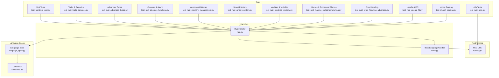
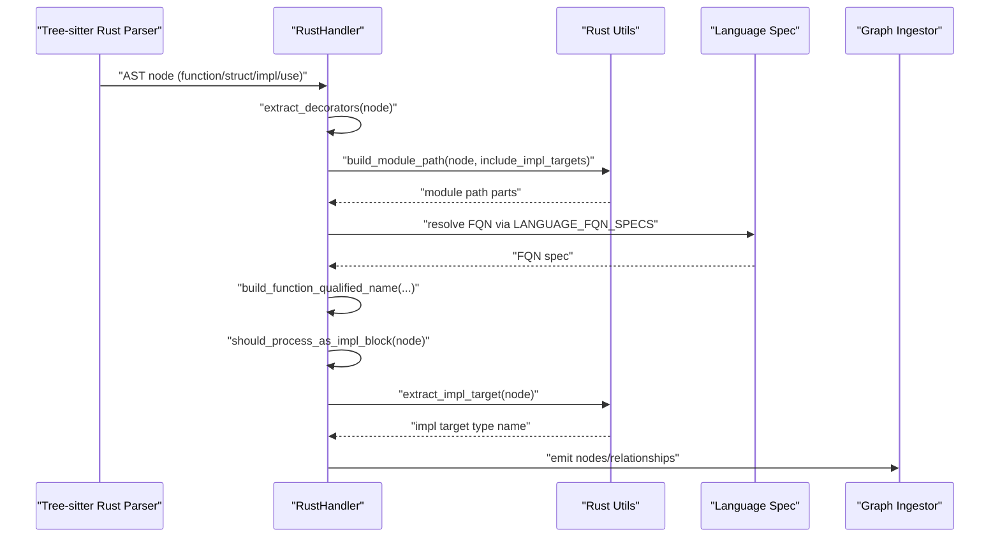
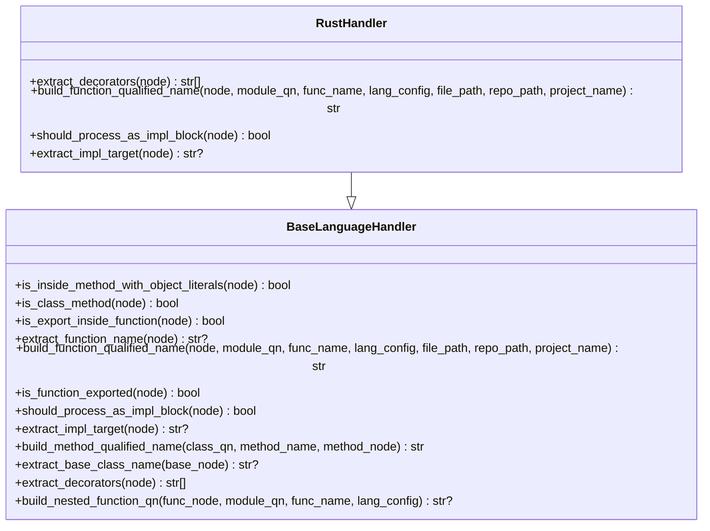
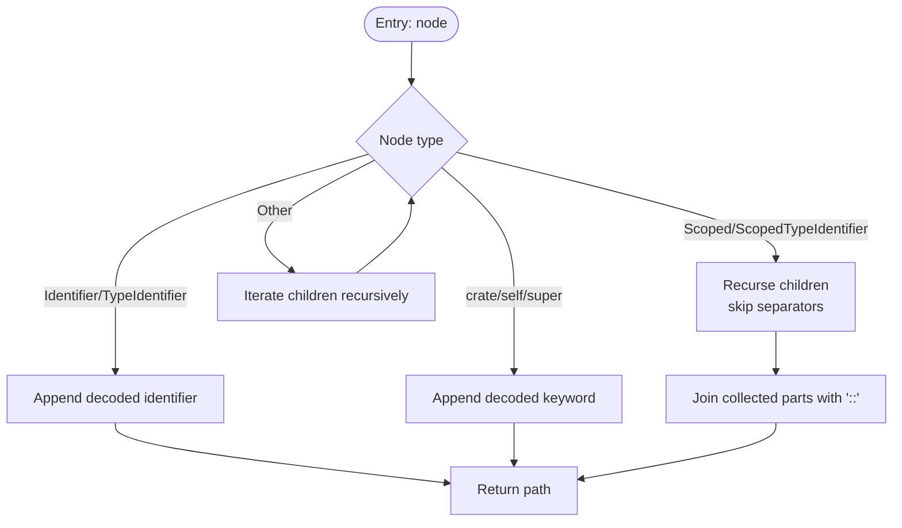
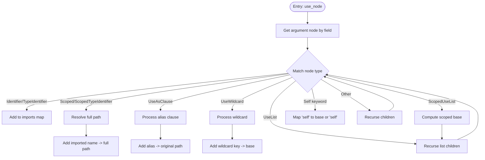
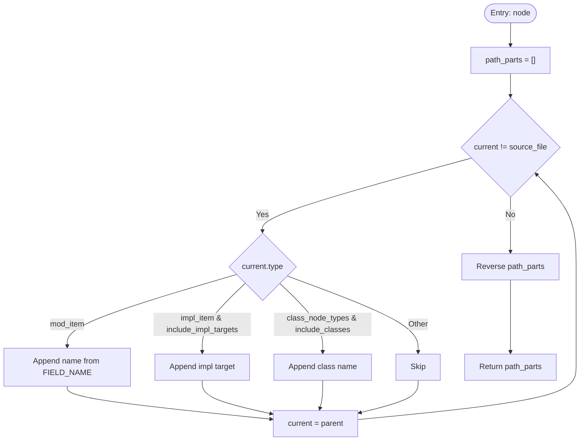
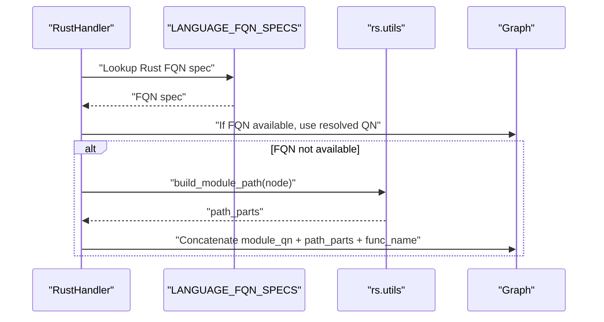
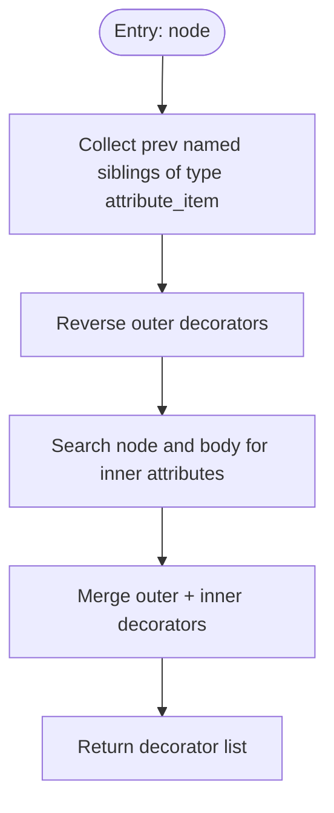
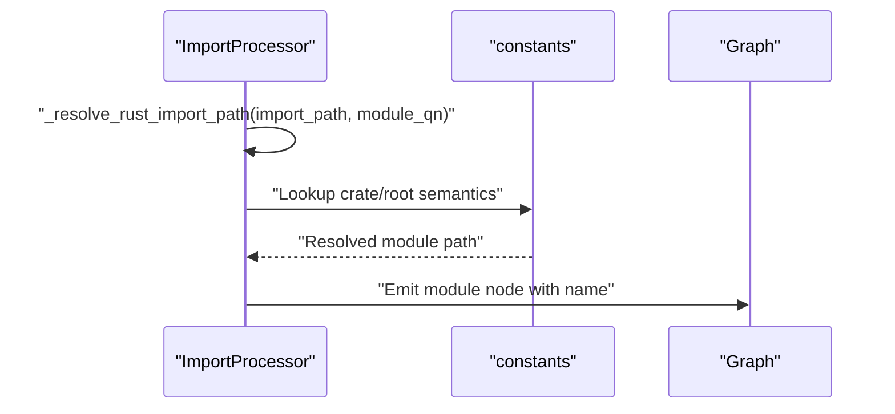
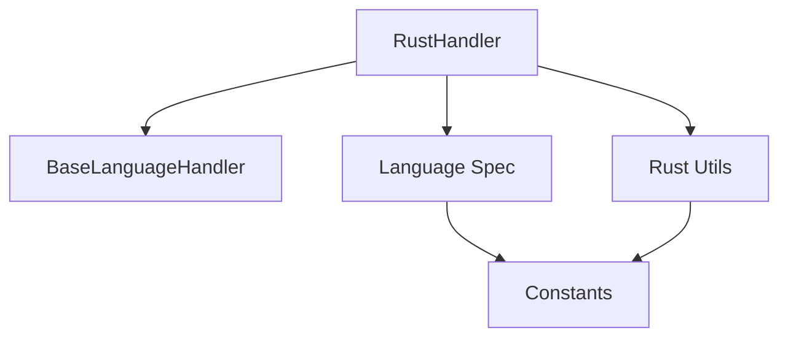

# Rust Handler

<cite>
**Referenced Files in This Document**
- [rust.py](file://codebase_rag/parsers/handlers/rust.py)
- [base.py](file://codebase_rag/parsers/handlers/base.py)
- [utils.py](file://codebase_rag/parsers/rs/utils.py)
- [language_spec.py](file://codebase_rag/language_spec.py)
- [constants.py](file://codebase_rag/constants.py)
- [test_handlers_unit.py](file://codebase_rag/tests/test_handlers_unit.py)
- [test_rust.py](file://codebase_rag/tests/test_rust.py)
- [test_rust_traits_generics.py](file://codebase_rag/tests/test_rust_traits_generics.py)
- [test_rust_advanced_types.py](file://codebase_rag/tests/test_rust_advanced_types.py)
- [test_rust_closures_functions.py](file://codebase_rag/tests/test_rust_closures_functions.py)
- [test_rust_memory_management.py](file://codebase_rag/tests/test_rust_memory_management.py)
- [test_rust_smart_pointers.py](file://codebase_rag/tests/test_rust_smart_pointers.py)
- [test_rust_modules_visibility.py](file://codebase_rag/tests/test_rust_modules_visibility.py)
- [test_rust_macros_metaprogramming.py](file://codebase_rag/tests/test_rust_macros_metaprogramming.py)
- [test_rust_error_handling_advanced.py](file://codebase_rag/tests/test_rust_error_handling_advanced.py)
- [test_rust_unsafe_ffi.py](file://codebase_rag/tests/test_rust_unsafe_ffi.py)
- [test_import_parsing.py](file://codebase_rag/tests/test_import_parsing.py)
- [test_rust_utils.py](file://codebase_rag/tests/test_rust_utils.py)
</cite>

## Table of Contents
1. [Introduction](#introduction)
2. [Project Structure](#project-structure)
3. [Core Components](#core-components)
4. [Architecture Overview](#architecture-overview)
5. [Detailed Component Analysis](#detailed-component-analysis)
6. [Dependency Analysis](#dependency-analysis)
7. [Performance Considerations](#performance-considerations)
8. [Troubleshooting Guide](#troubleshooting-guide)
9. [Conclusion](#conclusion)
10. [Appendices](#appendices)

## Introduction
This document explains the Rust language handler implementation used to process Rust AST nodes parsed via Tree-sitter. It focuses on how the handler extracts metadata from Rust constructs such as attributes, modules, use statements, impl blocks, and function qualified names. It also outlines how higher-level ingestion and graph construction leverage these capabilities to produce knowledge graph nodes and relationships for Rust codebases.

The handler integrates with the broader pipeline by extending a base handler class and using Rust-specific utilities for path extraction, import resolution, and module path building. It participates in the overall ingestion flow that converts parsed AST nodes into structured knowledge graph entities.

## Project Structure
The Rust handler resides under the language-specific handlers package and relies on shared utilities and language specifications.

**Diagram sources**
- [rust.py](file://codebase_rag/parsers/handlers/rust.py#L1-L71)
- [base.py](file://codebase_rag/parsers/handlers/base.py#L1-L108)
- [utils.py](file://codebase_rag/parsers/rs/utils.py#L1-L212)
- [language_spec.py](file://codebase_rag/language_spec.py#L134-L139)
- [constants.py](file://codebase_rag/constants.py#L2303-L2326)
- [test_handlers_unit.py](file://codebase_rag/tests/test_handlers_unit.py#L651-L753)
- [test_rust_traits_generics.py](file://codebase_rag/tests/test_rust_traits_generics.py#L322-L369)
- [test_rust_advanced_types.py](file://codebase_rag/tests/test_rust_advanced_types.py#L154-L207)
- [test_rust_closures_functions.py](file://codebase_rag/tests/test_rust_closures_functions.py#L913-L1016)
- [test_rust_memory_management.py](file://codebase_rag/tests/test_rust_memory_management.py#L80-L319)
- [test_rust_smart_pointers.py](file://codebase_rag/tests/test_rust_smart_pointers.py#L298-L2036)
- [test_rust_modules_visibility.py](file://codebase_rag/tests/test_rust_modules_visibility.py#L1113-L1205)
- [test_rust_macros_metaprogramming.py](file://codebase_rag/tests/test_rust_macros_metaprogramming.py#L219-L260)
- [test_rust_error_handling_advanced.py](file://codebase_rag/tests/test_rust_error_handling_advanced.py#L245-L618)
- [test_rust_unsafe_ffi.py](file://codebase_rag/tests/test_rust_unsafe_ffi.py#L741-L1036)
- [test_import_parsing.py](file://codebase_rag/tests/test_import_parsing.py#L330-L367)
- [test_rust_utils.py](file://codebase_rag/tests/test_rust_utils.py#L237-L289)

**Section sources**
- [rust.py](file://codebase_rag/parsers/handlers/rust.py#L1-L71)
- [base.py](file://codebase_rag/parsers/handlers/base.py#L1-L108)
- [utils.py](file://codebase_rag/parsers/rs/utils.py#L1-L212)
- [language_spec.py](file://codebase_rag/language_spec.py#L134-L139)
- [constants.py](file://codebase_rag/constants.py#L2303-L2326)

## Core Components
- RustHandler extends BaseLanguageHandler and adds Rust-specific behaviors:
  - Extracts outer and inner attributes (decorators) from AST nodes.
  - Builds function qualified names using language FQN specs and module path helpers.
  - Identifies impl blocks and extracts their target type.
- Rust utilities provide:
  - Path extraction helpers for scoped identifiers and crate/self/super keywords.
  - Use-tree processing for imports (aliases, wildcards, lists, scoped lists).
  - Module path building that supports impl targets and class-like scopes.
- Language spec defines Rust FQN spec and file-to-module mapping.
- Constants define Tree-sitter node types and keywords used by Rust processing.

Key responsibilities:
- Attribute extraction for proc-macro-like annotations and inner attributes.
- Qualified name computation for functions and methods.
- Impl block detection and target extraction for trait/object modeling.
- Module path construction for nested modules and impl targets.

**Section sources**
- [rust.py](file://codebase_rag/parsers/handlers/rust.py#L19-L71)
- [base.py](file://codebase_rag/parsers/handlers/base.py#L15-L108)
- [utils.py](file://codebase_rag/parsers/rs/utils.py#L9-L212)
- [language_spec.py](file://codebase_rag/language_spec.py#L134-L139)
- [constants.py](file://codebase_rag/constants.py#L2303-L2326)

## Architecture Overview
The Rust handler participates in the ingestion pipeline by:
- Receiving AST nodes from Tree-sitter Rust parser.
- Extracting attributes and module context.
- Computing qualified names and identifying impl targets.
- Delegating to higher-level processors to create nodes and relationships in the knowledge graph.

**Diagram sources**
- [rust.py](file://codebase_rag/parsers/handlers/rust.py#L19-L71)
- [utils.py](file://codebase_rag/parsers/rs/utils.py#L178-L212)
- [language_spec.py](file://codebase_rag/language_spec.py#L134-L139)

## Detailed Component Analysis

### RustHandler
RustHandler overrides base methods to tailor Rust semantics:
- extract_decorators: Collects outer attributes and inner attributes from nodes and bodies.
- build_function_qualified_name: Uses FQN specs and module path helpers to compute qualified names.
- should_process_as_impl_block: Detects impl blocks.
- extract_impl_target: Extracts the target type of an impl block.

**Diagram sources**
- [base.py](file://codebase_rag/parsers/handlers/base.py#L15-L108)
- [rust.py](file://codebase_rag/parsers/handlers/rust.py#L19-L71)

**Section sources**
- [rust.py](file://codebase_rag/parsers/handlers/rust.py#L19-L71)
- [base.py](file://codebase_rag/parsers/handlers/base.py#L15-L108)

### Rust Utilities
Rust utilities support path extraction, import processing, and module path building:
- Path extraction: Handles identifiers, scoped identifiers, crate/self/super keywords.
- Use-tree processing: Supports aliases, wildcards, lists, scoped lists.
- Module path building: Walks parents to collect module names and optionally impl targets and class-like scopes.

**Diagram sources**
- [utils.py](file://codebase_rag/parsers/rs/utils.py#L9-L35)

**Section sources**
- [utils.py](file://codebase_rag/parsers/rs/utils.py#L9-L35)

### Use Statement Processing
The use-tree processing handles complex import patterns:
- Aliases via as clauses.
- Wildcards with optional prefixes.
- Lists and scoped lists for re-exports.

**Diagram sources**
- [utils.py](file://codebase_rag/parsers/rs/utils.py#L37-L138)

**Section sources**
- [utils.py](file://codebase_rag/parsers/rs/utils.py#L37-L138)

### Module Path Building
Module path building walks up the AST to collect module names and optionally impl targets and class-like scopes. It supports configurable inclusion flags for classes and impl targets.

**Diagram sources**
- [utils.py](file://codebase_rag/parsers/rs/utils.py#L178-L212)

**Section sources**
- [utils.py](file://codebase_rag/parsers/rs/utils.py#L178-L212)

### Function Qualified Name Resolution
Qualified name resolution uses:
- Language FQN specs to compute names from AST.
- Module path helpers to append module segments.
- Fallback to simple concatenation if FQN resolution is unavailable.

**Diagram sources**
- [rust.py](file://codebase_rag/parsers/handlers/rust.py#L44-L64)
- [language_spec.py](file://codebase_rag/language_spec.py#L134-L139)
- [utils.py](file://codebase_rag/parsers/rs/utils.py#L178-L212)

**Section sources**
- [rust.py](file://codebase_rag/parsers/handlers/rust.py#L44-L64)
- [language_spec.py](file://codebase_rag/language_spec.py#L134-L139)

### Attribute/Decorator Extraction
Attributes are extracted from:
- Previous named siblings of type attribute_item.
- Inner attributes inside the node and its body.

**Diagram sources**
- [rust.py](file://codebase_rag/parsers/handlers/rust.py#L20-L42)

**Section sources**
- [rust.py](file://codebase_rag/parsers/handlers/rust.py#L20-L42)

### Crate and Module Resolution
Import resolution tests demonstrate:
- Resolving std collections to module paths.
- Crate-relative resolution from nested modules to crate root.

**Diagram sources**
- [test_import_parsing.py](file://codebase_rag/tests/test_import_parsing.py#L330-L367)

**Section sources**
- [test_import_parsing.py](file://codebase_rag/tests/test_import_parsing.py#L330-L367)

## Dependency Analysis
RustHandler depends on:
- BaseLanguageHandler for common behaviors.
- Rust utils for path and import processing.
- Language spec for FQN computation.
- Constants for Tree-sitter node types and keywords.

**Diagram sources**
- [rust.py](file://codebase_rag/parsers/handlers/rust.py#L1-L16)
- [base.py](file://codebase_rag/parsers/handlers/base.py#L1-L12)
- [utils.py](file://codebase_rag/parsers/rs/utils.py#L1-L6)
- [language_spec.py](file://codebase_rag/language_spec.py#L1-L5)
- [constants.py](file://codebase_rag/constants.py#L2303-L2326)

**Section sources**
- [rust.py](file://codebase_rag/parsers/handlers/rust.py#L1-L16)
- [base.py](file://codebase_rag/parsers/handlers/base.py#L1-L12)
- [utils.py](file://codebase_rag/parsers/rs/utils.py#L1-L6)
- [language_spec.py](file://codebase_rag/language_spec.py#L1-L5)
- [constants.py](file://codebase_rag/constants.py#L2303-L2326)

## Performance Considerations
- Attribute extraction iterates previous siblings and searches node/body children; complexity is linear in the number of adjacent attributes and immediate children.
- Module path building walks ancestors until source_file; worst-case complexity is proportional to nesting depth.
- Use-tree processing recurses through children; complexity scales with the size of use trees.
- FQN resolution leverages precomputed specs; constant-time lookup per node.

[No sources needed since this section provides general guidance]

## Troubleshooting Guide
Common issues and checks:
- Attributes not detected: Verify node types for outer and inner attributes and ensure correct field names.
- Qualified names incorrect: Confirm FQN specs and module path helpers are invoked with correct parameters.
- Impl target missing: Ensure impl blocks are properly identified and target extraction runs after impl detection.
- Import resolution errors: Validate crate and super keywords mapping and scoped use-list handling.

**Section sources**
- [rust.py](file://codebase_rag/parsers/handlers/rust.py#L20-L42)
- [rust.py](file://codebase_rag/parsers/handlers/rust.py#L44-L71)
- [utils.py](file://codebase_rag/parsers/rs/utils.py#L140-L163)
- [test_handlers_unit.py](file://codebase_rag/tests/test_handlers_unit.py#L651-L753)

## Conclusion
The Rust handler provides targeted support for Rust-specific AST constructs, enabling accurate extraction of attributes, module paths, and impl targets. Combined with Rust utilities and language specs, it enables robust qualified name computation and import resolution, forming the foundation for comprehensive knowledge graph construction of Rust codebases.

[No sources needed since this section summarizes without analyzing specific files]

## Appendices

### Rust-Specific Features Coverage
- Ownership, borrowing, and lifetimes: Detected through function signatures, struct definitions, and lifetime annotations in tests covering explicit lifetimes and borrowing patterns.
- Traits and generics: Covered by tests for associated types, constants, where clauses, and HRTB patterns.
- Async/await and closures: Covered by tests for async closures, futures, and closure-based combinators.
- Pattern matching: Implicitly supported via AST coverage; focus here is on higher-level constructs.
- Module system and crates: Covered by tests for modules, visibility, cfg attributes, and crate resolution.
- Smart pointers and memory safety: Covered by tests for Box, Rc, RefCell, and Drop trait usage.
- Enums and unions: Covered by tests for enum usage and tagged unions.
- Unsafe code and FFI: Covered by tests for inline assembly, unions, transmute, and packed structs.
- Macros and procedural macros: Covered by tests for declarative and procedural macro definitions.
- Error handling: Covered by tests for Result types, ? operator, panic handling, and recovery patterns.

**Section sources**
- [test_rust.py](file://codebase_rag/tests/test_rust.py#L339-L412)
- [test_rust_traits_generics.py](file://codebase_rag/tests/test_rust_traits_generics.py#L322-L369)
- [test_rust_advanced_types.py](file://codebase_rag/tests/test_rust_advanced_types.py#L154-L207)
- [test_rust_closures_functions.py](file://codebase_rag/tests/test_rust_closures_functions.py#L913-L1016)
- [test_rust_memory_management.py](file://codebase_rag/tests/test_rust_memory_management.py#L80-L319)
- [test_rust_smart_pointers.py](file://codebase_rag/tests/test_rust_smart_pointers.py#L298-L2036)
- [test_rust_modules_visibility.py](file://codebase_rag/tests/test_rust_modules_visibility.py#L1113-L1205)
- [test_rust_macros_metaprogramming.py](file://codebase_rag/tests/test_rust_macros_metaprogramming.py#L219-L260)
- [test_rust_error_handling_advanced.py](file://codebase_rag/tests/test_rust_error_handling_advanced.py#L245-L618)
- [test_rust_unsafe_ffi.py](file://codebase_rag/tests/test_rust_unsafe_ffi.py#L741-L1036)