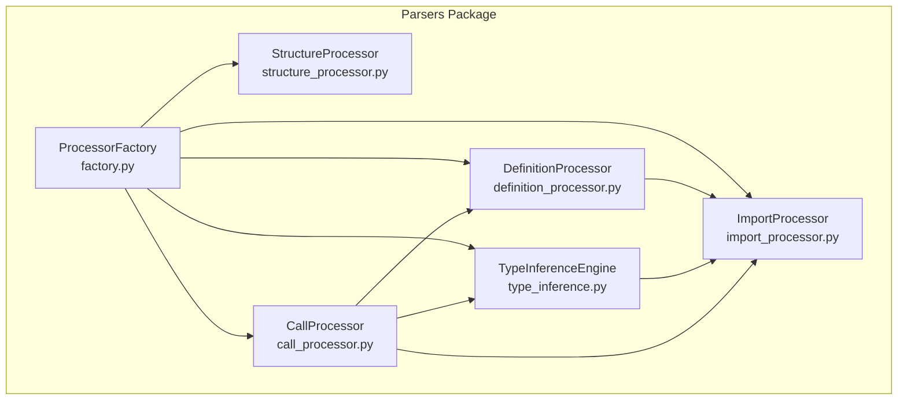
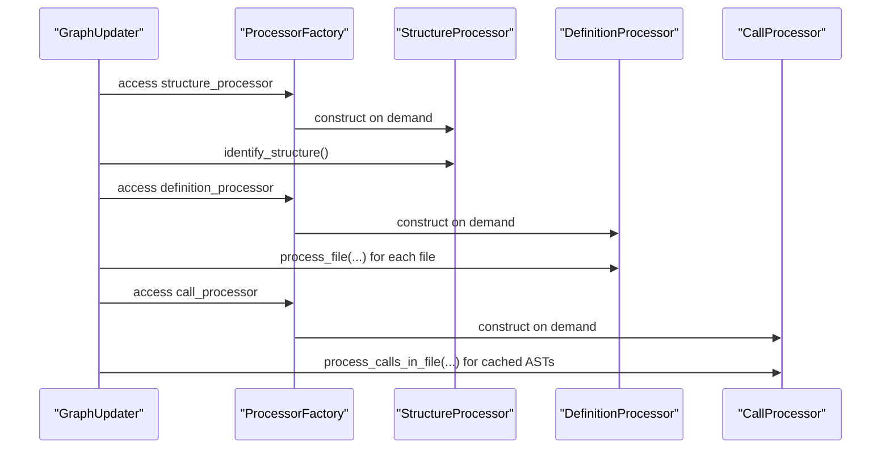
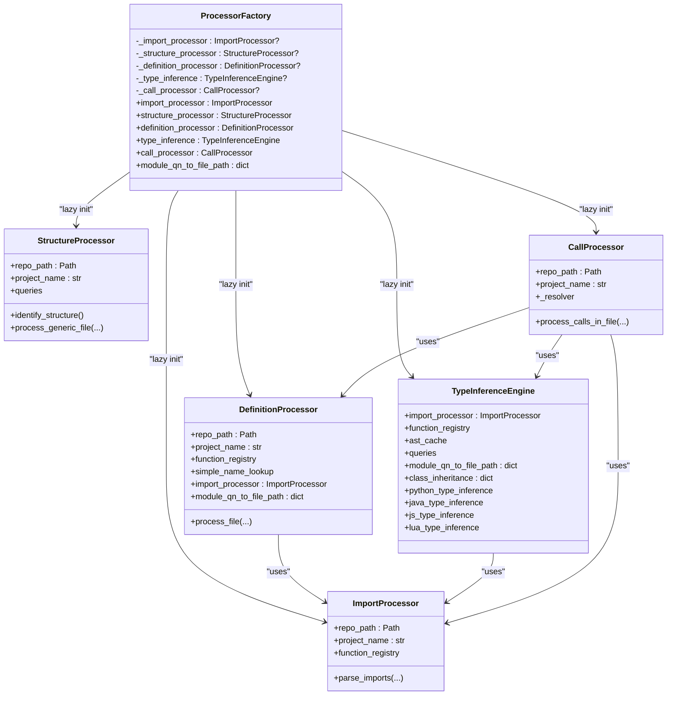
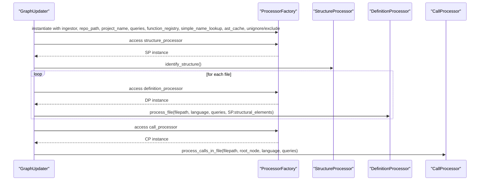
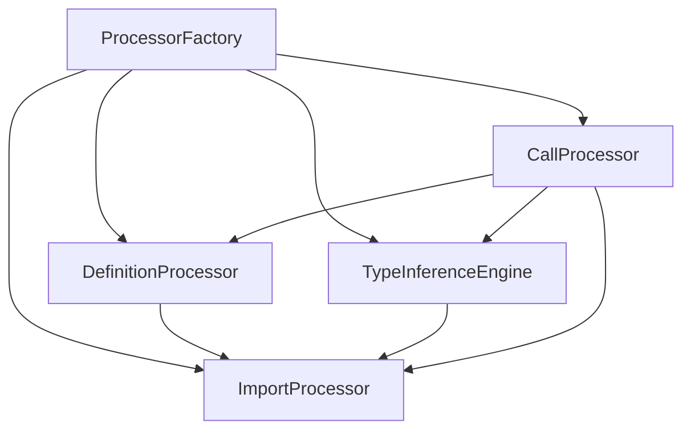

# Parser Factory

<cite>
**Referenced Files in This Document**
- [factory.py](file://codebase_rag/parsers/factory.py)
- [__init__.py](file://codebase_rag/parsers/__init__.py)
- [import_processor.py](file://codebase_rag/parsers/import_processor.py)
- [structure_processor.py](file://codebase_rag/parsers/structure_processor.py)
- [definition_processor.py](file://codebase_rag/parsers/definition_processor.py)
- [type_inference.py](file://codebase_rag/parsers/type_inference.py)
- [call_processor.py](file://codebase_rag/parsers/call_processor.py)
- [types_defs.py](file://codebase_rag/types_defs.py)
- [graph_updater.py](file://codebase_rag/graph_updater.py)
- [parser_loader.py](file://codebase_rag/parser_loader.py)
- [test_processor_factory.py](file://codebase_rag/tests/test_processor_factory.py)
</cite>

## Table of Contents
1. [Introduction](#introduction)
2. [Project Structure](#project-structure)
3. [Core Components](#core-components)
4. [Architecture Overview](#architecture-overview)
5. [Detailed Component Analysis](#detailed-component-analysis)
6. [Dependency Analysis](#dependency-analysis)
7. [Performance Considerations](#performance-considerations)
8. [Troubleshooting Guide](#troubleshooting-guide)
9. [Conclusion](#conclusion)

## Introduction
This document explains the Parser Factory system responsible for constructing and managing parser components during codebase ingestion and graph construction. It focuses on the ProcessorFactory class, its role as a central dependency injection container, and how it applies a lazy initialization pattern to minimize memory overhead. It also documents the factory’s dependencies, the lifecycle of ImportProcessor, StructureProcessor, DefinitionProcessor, TypeInferenceEngine, and CallProcessor, and how shared state enables efficient cross-component collaboration.

## Project Structure
The Parser Factory resides under the parsers package and orchestrates several specialized processors:
- ImportProcessor: Parses import statements per language and maintains module mappings.
- StructureProcessor: Identifies project structure (packages, folders, files) and emits containment relationships.
- DefinitionProcessor: Builds modules, functions, classes, and relationships from ASTs.
- TypeInferenceEngine: Provides language-specific type inference and local variable typing.
- CallProcessor: Resolves and records function/method calls using resolver logic and type inference.

**Diagram sources**
- [factory.py](file://codebase_rag/parsers/factory.py#L18-L116)
- [import_processor.py](file://codebase_rag/parsers/import_processor.py#L25-L800)
- [structure_processor.py](file://codebase_rag/parsers/structure_processor.py#L12-L133)
- [definition_processor.py](file://codebase_rag/parsers/definition_processor.py#L25-L193)
- [type_inference.py](file://codebase_rag/parsers/type_inference.py#L21-L135)
- [call_processor.py](file://codebase_rag/parsers/call_processor.py#L20-L364)

**Section sources**
- [factory.py](file://codebase_rag/parsers/factory.py#L18-L116)
- [__init__.py](file://codebase_rag/parsers/__init__.py#L1-L18)

## Core Components
- ProcessorFactory: Central factory that lazily constructs and caches ImportProcessor, StructureProcessor, DefinitionProcessor, TypeInferenceEngine, and CallProcessor. It injects shared dependencies such as ingestor, repo_path, project_name, queries, function_registry, simple_name_lookup, and ast_cache. It also exposes a shared module_qn_to_file_path dictionary and coordinates initialization order.
- ImportProcessor: Parses imports per language, resolves module paths, and optionally records relationships via ingestor.
- StructureProcessor: Scans the repository to identify packages and folders, and emits containment relationships to the ingestor.
- DefinitionProcessor: Builds modules, functions, classes, and relationships; integrates import parsing and language-specific handlers.
- TypeInferenceEngine: Provides language-specific type inference engines and a unified interface for building local variable type maps.
- CallProcessor: Resolves function/method calls using resolver logic and type inference, emitting CALLS relationships.

**Section sources**
- [factory.py](file://codebase_rag/parsers/factory.py#L18-L116)
- [import_processor.py](file://codebase_rag/parsers/import_processor.py#L25-L800)
- [structure_processor.py](file://codebase_rag/parsers/structure_processor.py#L12-L133)
- [definition_processor.py](file://codebase_rag/parsers/definition_processor.py#L25-L193)
- [type_inference.py](file://codebase_rag/parsers/type_inference.py#L21-L135)
- [call_processor.py](file://codebase_rag/parsers/call_processor.py#L20-L364)

## Architecture Overview
The factory encapsulates a dependency graph among processors. Accessing a property triggers lazy construction and ensures shared dependencies are passed consistently. Shared mutable state (module_qn_to_file_path and class_inheritance) is explicitly shared across processors to avoid duplication and enable cross-component coordination.

**Diagram sources**
- [graph_updater.py](file://codebase_rag/graph_updater.py#L246-L256)
- [graph_updater.py](file://codebase_rag/graph_updater.py#L271-L278)
- [graph_updater.py](file://codebase_rag/graph_updater.py#L333-L354)
- [factory.py](file://codebase_rag/parsers/factory.py#L49-L116)

## Detailed Component Analysis

### ProcessorFactory: Lazy Initialization and Singleton-like Behavior
- Purpose: Central dependency container and orchestrator for parser components.
- Lazy initialization: Each processor is constructed only when its property is accessed for the first time. Subsequent accesses return the cached instance.
- Singleton-like behavior: Because the factory caches each processor in a private attribute, repeated property access yields the same object reference.
- Dependencies injected:
  - ingestor: Ingestion interface for emitting nodes and relationships.
  - repo_path: Root path of the repository.
  - project_name: Project-level qualifier for identifiers.
  - queries: Language-specific Tree-sitter parsers and queries.
  - function_registry: Shared trie-backed registry of functions.
  - simple_name_lookup: Shared lookup mapping simple names to qualified names.
  - ast_cache: Shared AST cache for later call processing.
  - unignore_paths/exclude_paths: Optional path filters for traversal.
- Shared mutable state:
  - module_qn_to_file_path: Dictionary mapping qualified module names to file paths, shared between DefinitionProcessor and TypeInferenceEngine.
  - class_inheritance: Dictionary mapping child classes to parents, shared between DefinitionProcessor and TypeInferenceEngine and consumed by CallProcessor.

**Diagram sources**
- [factory.py](file://codebase_rag/parsers/factory.py#L18-L116)
- [import_processor.py](file://codebase_rag/parsers/import_processor.py#L25-L800)
- [structure_processor.py](file://codebase_rag/parsers/structure_processor.py#L12-L133)
- [definition_processor.py](file://codebase_rag/parsers/definition_processor.py#L25-L193)
- [type_inference.py](file://codebase_rag/parsers/type_inference.py#L21-L135)
- [call_processor.py](file://codebase_rag/parsers/call_processor.py#L20-L364)

**Section sources**
- [factory.py](file://codebase_rag/parsers/factory.py#L18-L116)

### ImportProcessor
- Responsibilities:
  - Parse imports per language using Tree-sitter queries.
  - Resolve module paths (internal vs external) and maintain import mappings.
  - Optionally emit relationship batches to the ingestor.
- Notable behaviors:
  - Language-specific parsing branches for Python, JS/TS, Java, Rust, Go, C++, Lua.
  - Utilities for resolving relative imports, module names, and standard library modules.
  - Persistent caching of standard library metadata via lifecycle hooks.

**Section sources**
- [import_processor.py](file://codebase_rag/parsers/import_processor.py#L25-L800)

### StructureProcessor
- Responsibilities:
  - Identify packages and folders by scanning indicators in the repository.
  - Emit nodes and containment relationships to the ingestor.
- Notable behaviors:
  - Uses unignore/exclude path filters.
  - Builds qualified package names and maps relative paths to parent containers.

**Section sources**
- [structure_processor.py](file://codebase_rag/parsers/structure_processor.py#L12-L133)

### DefinitionProcessor
- Responsibilities:
  - Build modules, functions, classes, and relationships from ASTs.
  - Integrate import parsing and language-specific handler selection.
  - Manage module-to-file path mapping and class inheritance.
- Notable behaviors:
  - Selects language handler dynamically based on file language.
  - Emits module nodes and CONTAINS_MODULE relationships.
  - Supports special cases for init/mod files and various language constructs.

**Section sources**
- [definition_processor.py](file://codebase_rag/parsers/definition_processor.py#L25-L193)

### TypeInferenceEngine
- Responsibilities:
  - Provide language-specific type inference engines (Python, Java, JS/TS, Lua).
  - Unified interface to build local variable type maps for callers.
  - Share class inheritance and module mapping with downstream processors.
- Notable behaviors:
  - Lazy initialization of language-specific engines.
  - Exposes getters for each engine via properties.

**Section sources**
- [type_inference.py](file://codebase_rag/parsers/type_inference.py#L21-L135)

### CallProcessor
- Responsibilities:
  - Resolve function and method calls using resolver logic and type inference.
  - Emit CALLS relationships between caller and callee nodes.
- Notable behaviors:
  - Uses language-specific function and class queries.
  - Handles nested qualified names and special cases (IIFE, operators, method invocations).

**Section sources**
- [call_processor.py](file://codebase_rag/parsers/call_processor.py#L20-L364)

### Example: Factory Instantiation and Processor Access Patterns
- Factory instantiation occurs in GraphUpdater with ingestor, repo_path, project_name, queries, function_registry, simple_name_lookup, ast_cache, and optional path filters.
- Typical usage:
  - Access structure_processor first to establish structural context.
  - Iterate files and call definition_processor.process_file for each supported file.
  - Access call_processor to resolve calls against cached ASTs.

**Diagram sources**
- [graph_updater.py](file://codebase_rag/graph_updater.py#L246-L256)
- [graph_updater.py](file://codebase_rag/graph_updater.py#L333-L354)

**Section sources**
- [graph_updater.py](file://codebase_rag/graph_updater.py#L246-L256)
- [graph_updater.py](file://codebase_rag/graph_updater.py#L333-L354)

## Dependency Analysis
- Factory-level dependencies:
  - IngestorProtocol: Emission of nodes and relationships.
  - Pathlib.Path: Repository path handling.
  - types_defs protocols: FunctionRegistryTrieProtocol, ASTCacheProtocol, LanguageQueries, SimpleNameLookup.
  - constants: SupportedLanguage and related constants.
- Cross-component dependencies:
  - DefinitionProcessor depends on ImportProcessor for import resolution.
  - TypeInferenceEngine depends on ImportProcessor and shares class_inheritance with DefinitionProcessor.
  - CallProcessor depends on ImportProcessor, TypeInferenceEngine, and DefinitionProcessor’s class_inheritance.

**Diagram sources**
- [factory.py](file://codebase_rag/parsers/factory.py#L18-L116)
- [definition_processor.py](file://codebase_rag/parsers/definition_processor.py#L25-L193)
- [type_inference.py](file://codebase_rag/parsers/type_inference.py#L21-L135)
- [call_processor.py](file://codebase_rag/parsers/call_processor.py#L20-L364)

**Section sources**
- [factory.py](file://codebase_rag/parsers/factory.py#L18-L116)
- [types_defs.py](file://codebase_rag/types_defs.py#L81-L102)

## Performance Considerations
- Lazy initialization reduces upfront memory footprint by constructing processors only when needed.
- Shared mutable state avoids duplicating expensive structures:
  - module_qn_to_file_path prevents recomputation of module-to-path mappings.
  - class_inheritance avoids recomputation of inheritance relationships.
- AST caching (BoundedASTCache) minimizes repeated parsing and supports efficient call resolution across files.
- Path filtering (unignore/exclude) reduces traversal and parsing work in large repositories.

[No sources needed since this section provides general guidance]

## Troubleshooting Guide
Common issues and diagnostics:
- Factory not initialized with required dependencies:
  - Ensure ingestor, repo_path, project_name, queries, function_registry, simple_name_lookup, and ast_cache are provided.
  - Verify that load_parsers() succeeds and populates parsers and queries dictionaries before constructing the factory.
- Processor not constructed on first access:
  - Confirm that accessing the property triggers lazy initialization and that the internal cache attribute transitions from None to an instance.
- CallProcessor fails to resolve calls:
  - Ensure TypeInferenceEngine and DefinitionProcessor are initialized prior to accessing CallProcessor, as the factory initializes them on demand.
  - Verify that AST cache contains entries for processed files and that queries include call-related patterns.
- Import resolution inconsistencies:
  - Check that ImportProcessor receives the correct repo_path and project_name and that language-specific import queries are present in the queries dictionary.

Validation references:
- Lazy initialization and singleton behavior verified by unit tests.
- Dependency injection and shared state validated by unit tests.
- Dependency ordering verified by unit tests.

**Section sources**
- [test_processor_factory.py](file://codebase_rag/tests/test_processor_factory.py#L33-L125)
- [test_processor_factory.py](file://codebase_rag/tests/test_processor_factory.py#L148-L306)
- [test_processor_factory.py](file://codebase_rag/tests/test_processor_factory.py#L308-L376)
- [parser_loader.py](file://codebase_rag/parser_loader.py#L276-L293)

## Conclusion
The Parser Factory provides a clean, memory-efficient mechanism to construct and coordinate parser components. Through lazy initialization and shared state, it minimizes overhead while enabling robust import parsing, structural discovery, definition extraction, type inference, and call resolution. Proper initialization and dependency wiring ensure reliable ingestion and graph construction across multiple languages.