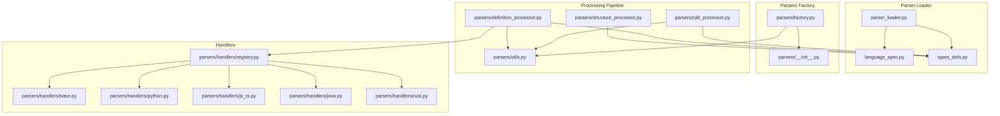
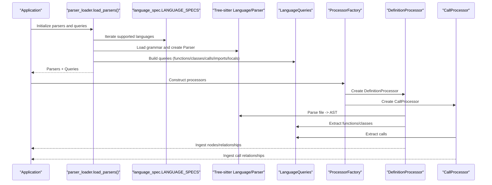
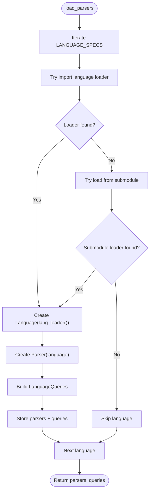
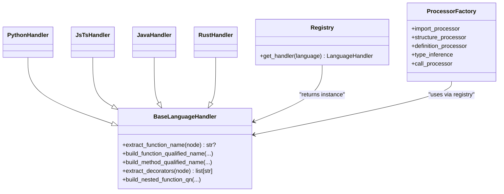
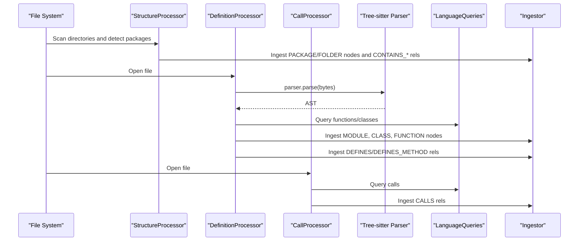
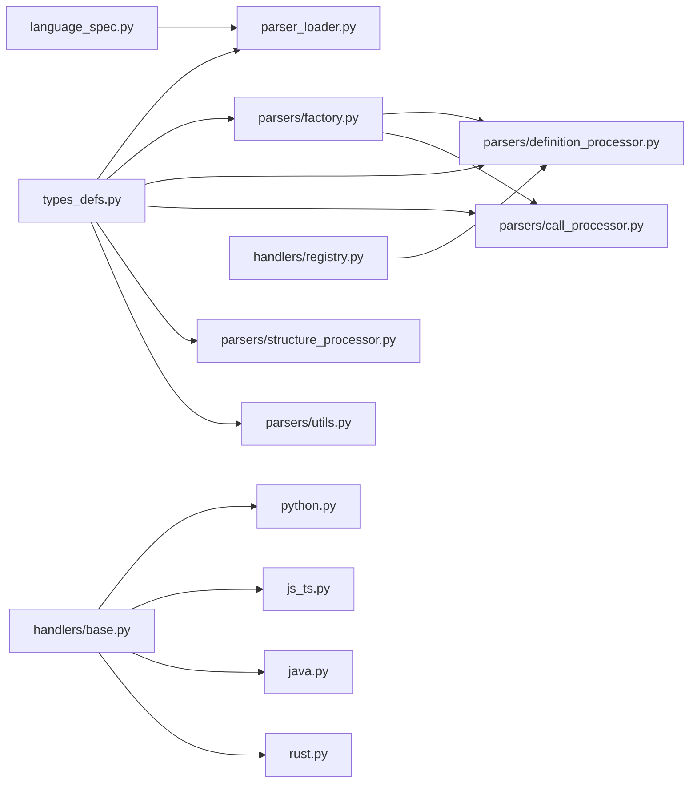

# Parser System

<cite>
**Referenced Files in This Document**
- [parser_loader.py](file://codebase_rag/parser_loader.py)
- [language_spec.py](file://codebase_rag/language_spec.py)
- [types_defs.py](file://codebase_rag/types_defs.py)
- [parsers/factory.py](file://codebase_rag/parsers/factory.py)
- [parsers/__init__.py](file://codebase_rag/parsers/__init__.py)
- [parsers/structure_processor.py](file://codebase_rag/parsers/structure_processor.py)
- [parsers/definition_processor.py](file://codebase_rag/parsers/definition_processor.py)
- [parsers/call_processor.py](file://codebase_rag/parsers/call_processor.py)
- [parsers/utils.py](file://codebase_rag/parsers/utils.py)
- [parsers/handlers/base.py](file://codebase_rag/parsers/handlers/base.py)
- [parsers/handlers/registry.py](file://codebase_rag/parsers/handlers/registry.py)
- [parsers/handlers/python.py](file://codebase_rag/parsers/handlers/python.py)
- [parsers/handlers/js_ts.py](file://codebase_rag/parsers/handlers/js_ts.py)
- [parsers/handlers/java.py](file://codebase_rag/parsers/handlers/java.py)
- [parsers/handlers/rust.py](file://codebase_rag/parsers/handlers/rust.py)
</cite>

## Table of Contents
1. [Introduction](#introduction)
2. [Project Structure](#project-structure)
3. [Core Components](#core-components)
4. [Architecture Overview](#architecture-overview)
5. [Detailed Component Analysis](#detailed-component-analysis)
6. [Dependency Analysis](#dependency-analysis)
7. [Performance Considerations](#performance-considerations)
8. [Troubleshooting Guide](#troubleshooting-guide)
9. [Conclusion](#conclusion)
10. [Appendices](#appendices)

## Introduction
This document explains the Graph-Code parser system architecture with a focus on Tree-sitter integration, multi-language AST parsing, the parser factory pattern, language handler registration, and the AST processing pipeline. It also covers how parsed results map to knowledge graph entities, performance optimizations, memory management, error handling, and troubleshooting strategies.

## Project Structure
The parser system is organized around:
- Dynamic grammar loading and Tree-sitter parser initialization
- Language specifications and FQN extraction helpers
- A factory that lazily constructs processors
- Handlers per language for specialized extraction logic
- A processing pipeline that ingests structure, definitions, and calls into a knowledge graph

**Diagram sources**
- [parser_loader.py](file://codebase_rag/parser_loader.py#L1-L293)
- [language_spec.py](file://codebase_rag/language_spec.py#L1-L426)
- [types_defs.py](file://codebase_rag/types_defs.py#L1-L555)
- [parsers/factory.py](file://codebase_rag/parsers/factory.py#L1-L116)
- [parsers/__init__.py](file://codebase_rag/parsers/__init__.py#L1-L18)
- [parsers/structure_processor.py](file://codebase_rag/parsers/structure_processor.py#L1-L133)
- [parsers/definition_processor.py](file://codebase_rag/parsers/definition_processor.py#L1-L193)
- [parsers/call_processor.py](file://codebase_rag/parsers/call_processor.py#L1-L364)
- [parsers/utils.py](file://codebase_rag/parsers/utils.py#L1-L169)
- [parsers/handlers/registry.py](file://codebase_rag/parsers/handlers/registry.py#L1-L32)
- [parsers/handlers/base.py](file://codebase_rag/parsers/handlers/base.py#L1-L108)
- [parsers/handlers/python.py](file://codebase_rag/parsers/handlers/python.py#L1-L23)
- [parsers/handlers/js_ts.py](file://codebase_rag/parsers/handlers/js_ts.py#L1-L116)
- [parsers/handlers/java.py](file://codebase_rag/parsers/handlers/java.py#L1-L29)
- [parsers/handlers/rust.py](file://codebase_rag/parsers/handlers/rust.py#L1-L71)

**Section sources**
- [parser_loader.py](file://codebase_rag/parser_loader.py#L1-L293)
- [language_spec.py](file://codebase_rag/language_spec.py#L1-L426)
- [types_defs.py](file://codebase_rag/types_defs.py#L1-L555)
- [parsers/factory.py](file://codebase_rag/parsers/factory.py#L1-L116)
- [parsers/__init__.py](file://codebase_rag/parsers/__init__.py#L1-L18)
- [parsers/structure_processor.py](file://codebase_rag/parsers/structure_processor.py#L1-L133)
- [parsers/definition_processor.py](file://codebase_rag/parsers/definition_processor.py#L1-L193)
- [parsers/call_processor.py](file://codebase_rag/parsers/call_processor.py#L1-L364)
- [parsers/utils.py](file://codebase_rag/parsers/utils.py#L1-L169)
- [parsers/handlers/registry.py](file://codebase_rag/parsers/handlers/registry.py#L1-L32)
- [parsers/handlers/base.py](file://codebase_rag/parsers/handlers/base.py#L1-L108)
- [parsers/handlers/python.py](file://codebase_rag/parsers/handlers/python.py#L1-L23)
- [parsers/handlers/js_ts.py](file://codebase_rag/parsers/handlers/js_ts.py#L1-L116)
- [parsers/handlers/java.py](file://codebase_rag/parsers/handlers/java.py#L1-L29)
- [parsers/handlers/rust.py](file://codebase_rag/parsers/handlers/rust.py#L1-L71)

## Core Components
- Parser loader and dynamic grammar loading: Initializes Tree-sitter parsers and builds language-specific queries from specs.
- Language specifications: Defines AST node types and query patterns per language, plus helpers for FQN extraction.
- Factory: Lazily constructs processors (imports, structure, definitions, types, calls) with shared dependencies.
- Handlers: Per-language extractors for decorators, nested QN, and special cases.
- Processing pipeline: Structure identification, definition ingestion, and call resolution.

**Section sources**
- [parser_loader.py](file://codebase_rag/parser_loader.py#L276-L293)
- [language_spec.py](file://codebase_rag/language_spec.py#L205-L426)
- [parsers/factory.py](file://codebase_rag/parsers/factory.py#L18-L116)
- [parsers/handlers/registry.py](file://codebase_rag/parsers/handlers/registry.py#L15-L32)

## Architecture Overview
The system integrates Tree-sitter grammars dynamically, builds language-specific queries, and runs a multi-stage AST processing pipeline. Results are ingested into a knowledge graph via an ingestor abstraction.

**Diagram sources**
- [parser_loader.py](file://codebase_rag/parser_loader.py#L276-L293)
- [language_spec.py](file://codebase_rag/language_spec.py#L205-L426)
- [parsers/factory.py](file://codebase_rag/parsers/factory.py#L18-L116)
- [parsers/definition_processor.py](file://codebase_rag/parsers/definition_processor.py#L53-L143)
- [parsers/call_processor.py](file://codebase_rag/parsers/call_processor.py#L49-L74)

## Detailed Component Analysis

### Parser Loader and Dynamic Grammar Loading
- Loads language grammars from installed packages or embedded submodules.
- Builds Tree-sitter Language and Parser instances.
- Constructs LanguageQueries with function/class/call/import/locals patterns.
- Provides a runtime map of available parsers and queries.

Key behaviors:
- Attempts to import prebuilt bindings; falls back to building from submodule if needed.
- Builds combined import patterns and optional locals queries.
- Validates grammar availability and logs success/failure.

**Diagram sources**
- [parser_loader.py](file://codebase_rag/parser_loader.py#L96-L170)
- [parser_loader.py](file://codebase_rag/parser_loader.py#L251-L274)
- [parser_loader.py](file://codebase_rag/parser_loader.py#L222-L248)

**Section sources**
- [parser_loader.py](file://codebase_rag/parser_loader.py#L17-L82)
- [parser_loader.py](file://codebase_rag/parser_loader.py#L85-L94)
- [parser_loader.py](file://codebase_rag/parser_loader.py#L96-L167)
- [parser_loader.py](file://codebase_rag/parser_loader.py#L222-L248)
- [parser_loader.py](file://codebase_rag/parser_loader.py#L251-L274)
- [parser_loader.py](file://codebase_rag/parser_loader.py#L276-L293)

### Language Specifications and FQN Helpers
- Defines per-language AST node types and optional custom queries.
- Provides FQN specs with name extraction and module path helpers.
- Supports Python, JavaScript/TypeScript, Rust, Java, C++, and others.

Highlights:
- Custom function/class/call queries for languages that require them.
- Name extraction helpers tailored to language AST field names and node types.
- Module-to-QN conversion helpers for each language.

**Section sources**
- [language_spec.py](file://codebase_rag/language_spec.py#L205-L426)
- [language_spec.py](file://codebase_rag/language_spec.py#L11-L161)

### Handler Registry and Factory Pattern
- Registry maps SupportedLanguage to handler classes and caches instances.
- Factory composes processors with shared dependencies and lazy initialization.
- Handlers specialize extraction logic (decorators, nested QN, impl blocks).

**Diagram sources**
- [parsers/handlers/base.py](file://codebase_rag/parsers/handlers/base.py#L15-L108)
- [parsers/handlers/python.py](file://codebase_rag/parsers/handlers/python.py#L13-L23)
- [parsers/handlers/js_ts.py](file://codebase_rag/parsers/handlers/js_ts.py#L14-L116)
- [parsers/handlers/java.py](file://codebase_rag/parsers/handlers/java.py#L13-L29)
- [parsers/handlers/rust.py](file://codebase_rag/parsers/handlers/rust.py#L19-L71)
- [parsers/handlers/registry.py](file://codebase_rag/parsers/handlers/registry.py#L28-L32)
- [parsers/factory.py](file://codebase_rag/parsers/factory.py#L18-L116)

**Section sources**
- [parsers/handlers/registry.py](file://codebase_rag/parsers/handlers/registry.py#L15-L32)
- [parsers/factory.py](file://codebase_rag/parsers/factory.py#L18-L116)

### AST Processing Pipeline
- StructureProcessor identifies packages and folders and creates structural nodes.
- DefinitionProcessor parses ASTs, extracts imports, functions, classes, and exports, and ingests nodes/relationships.
- CallProcessor resolves and ingests call relationships using language-specific queries and resolvers.

**Diagram sources**
- [parsers/structure_processor.py](file://codebase_rag/parsers/structure_processor.py#L39-L133)
- [parsers/definition_processor.py](file://codebase_rag/parsers/definition_processor.py#L53-L143)
- [parsers/call_processor.py](file://codebase_rag/parsers/call_processor.py#L49-L74)
- [parsers/utils.py](file://codebase_rag/parsers/utils.py#L32-L46)

**Section sources**
- [parsers/structure_processor.py](file://codebase_rag/parsers/structure_processor.py#L12-L133)
- [parsers/definition_processor.py](file://codebase_rag/parsers/definition_processor.py#L25-L193)
- [parsers/call_processor.py](file://codebase_rag/parsers/call_processor.py#L20-L364)
- [parsers/utils.py](file://codebase_rag/parsers/utils.py#L32-L169)

### Language-Specific Handlers
- PythonHandler: Extracts decorators from decorated definitions.
- JsTsHandler: Detects decorators, class methods, exports inside functions, and builds nested QNs with special JS scoping rules.
- JavaHandler: Extracts annotations from modifiers and augments method QNs with parameter signatures.
- RustHandler: Extracts attributes (inner/outer), resolves FQN via AST, and handles impl blocks.

**Section sources**
- [parsers/handlers/python.py](file://codebase_rag/parsers/handlers/python.py#L13-L23)
- [parsers/handlers/js_ts.py](file://codebase_rag/parsers/handlers/js_ts.py#L14-L116)
- [parsers/handlers/java.py](file://codebase_rag/parsers/handlers/java.py#L13-L29)
- [parsers/handlers/rust.py](file://codebase_rag/parsers/handlers/rust.py#L19-L71)

### AST Utilities and Ingest Helpers
- Safe decoding with LRU cache for byte-to-string conversion.
- Query capture helpers and method ingestion utilities.
- Method detection helpers to distinguish methods from standalone functions.

**Section sources**
- [parsers/utils.py](file://codebase_rag/parsers/utils.py#L27-L169)

## Dependency Analysis
- Parser loader depends on language specs and Tree-sitter to produce parsers and queries.
- Factory composes processors and injects shared dependencies (ingestor, registries, caches).
- Processors depend on handlers for language-specific logic and on queries for AST traversal.
- Types define protocols for ingestors, caches, and AST nodes to decouple implementations.

**Diagram sources**
- [language_spec.py](file://codebase_rag/language_spec.py#L1-L426)
- [parser_loader.py](file://codebase_rag/parser_loader.py#L1-L293)
- [types_defs.py](file://codebase_rag/types_defs.py#L1-L555)
- [parsers/factory.py](file://codebase_rag/parsers/factory.py#L1-L116)
- [parsers/definition_processor.py](file://codebase_rag/parsers/definition_processor.py#L1-L193)
- [parsers/call_processor.py](file://codebase_rag/parsers/call_processor.py#L1-L364)
- [parsers/structure_processor.py](file://codebase_rag/parsers/structure_processor.py#L1-L133)
- [parsers/utils.py](file://codebase_rag/parsers/utils.py#L1-L169)
- [parsers/handlers/registry.py](file://codebase_rag/parsers/handlers/registry.py#L1-L32)
- [parsers/handlers/base.py](file://codebase_rag/parsers/handlers/base.py#L1-L108)

**Section sources**
- [types_defs.py](file://codebase_rag/types_defs.py#L324-L333)
- [parsers/factory.py](file://codebase_rag/parsers/factory.py#L18-L116)

## Performance Considerations
- Caching:
  - LRU cache for decoded text to reduce repeated UTF-8 decoding overhead.
  - LRU cache for handler retrieval to avoid repeated instantiation.
- Query reuse:
  - Reuse Tree-sitter QueryCursor instances per operation where feasible.
  - Combine query patterns to minimize repeated traversal.
- Lazy initialization:
  - Factory defers constructing processors until needed, reducing startup cost.
- Memory management:
  - Prefer generators and iterators for traversals.
  - Avoid retaining large intermediate AST copies beyond use.
- Logging:
  - Use debug-level logs for heavy operations and info/warning for errors to keep runtime overhead low.

[No sources needed since this section provides general guidance]

## Troubleshooting Guide
Common issues and remedies:
- Grammar not available:
  - Ensure the language grammar is installed or build from submodule. The loader attempts import first, then submodule build.
- Query creation failure:
  - Some languages may lack specific queries; the loader gracefully handles missing patterns and logs failures.
- Parsing failures:
  - DefinitionProcessor catches exceptions during AST parsing and logs errors; verify file encoding and language detection.
- Call resolution failures:
  - CallProcessor logs when call processing fails for a file; confirm language support and query presence.
- Handler mismatches:
  - Verify the handler returned by the registry matches the detected language.

Operational checks:
- Confirm that load_parsers succeeded and reported available languages.
- Validate LanguageQueries existence for the target language.
- Inspect logs for grammar load warnings or errors.

**Section sources**
- [parser_loader.py](file://codebase_rag/parser_loader.py#L271-L273)
- [parser_loader.py](file://codebase_rag/parser_loader.py#L217-L219)
- [parsers/definition_processor.py](file://codebase_rag/parsers/definition_processor.py#L141-L143)
- [parsers/call_processor.py](file://codebase_rag/parsers/call_processor.py#L72-L74)

## Conclusion
The parser system integrates Tree-sitter grammars dynamically, defines language-specific AST semantics, and orchestrates a robust pipeline to extract code structure and relationships into a knowledge graph. The factory and handler patterns enable extensibility and maintainability across multiple languages, while caching and query reuse contribute to performance. Proper error logging and graceful fallbacks ensure resilience against missing grammars or malformed code.

[No sources needed since this section summarizes without analyzing specific files]

## Appendices

### AST Node Types and Mappings to Knowledge Graph Entities
- Functions and Methods:
  - Mapped to FUNCTION and METHOD nodes with qualified names, decorators, and line ranges.
- Classes and Interfaces:
  - Mapped to CLASS, INTERFACE, ENUM, TYPE, UNION nodes depending on language.
- Modules and Packages:
  - Mapped to MODULE, PACKAGE, FOLDER, FILE nodes with qualified names and paths.
- Calls:
  - Mapped to CALLS relationships between caller and callee nodes.
- Imports/Exports:
  - Mapped to IMPORTS and EXPORTS relationships between modules.

These mappings are defined by node and relationship schemas and enforced by the ingestor abstractions.

**Section sources**
- [types_defs.py](file://codebase_rag/types_defs.py#L435-L554)