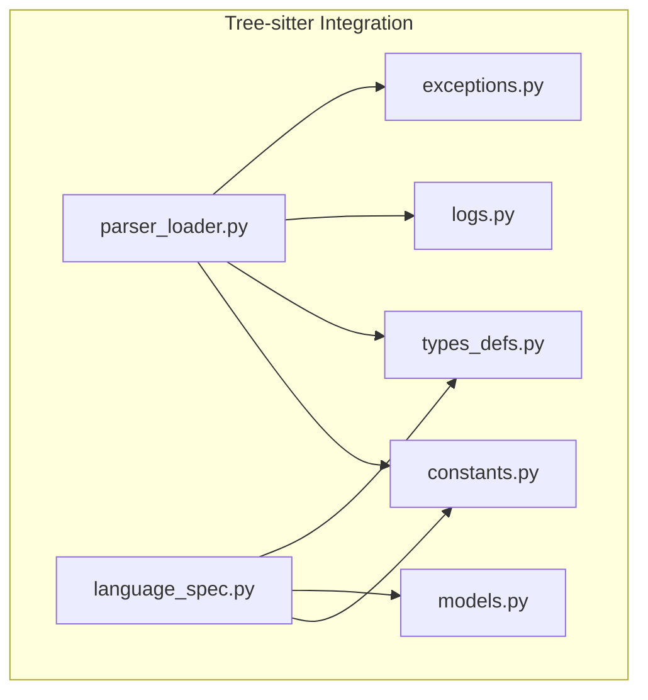
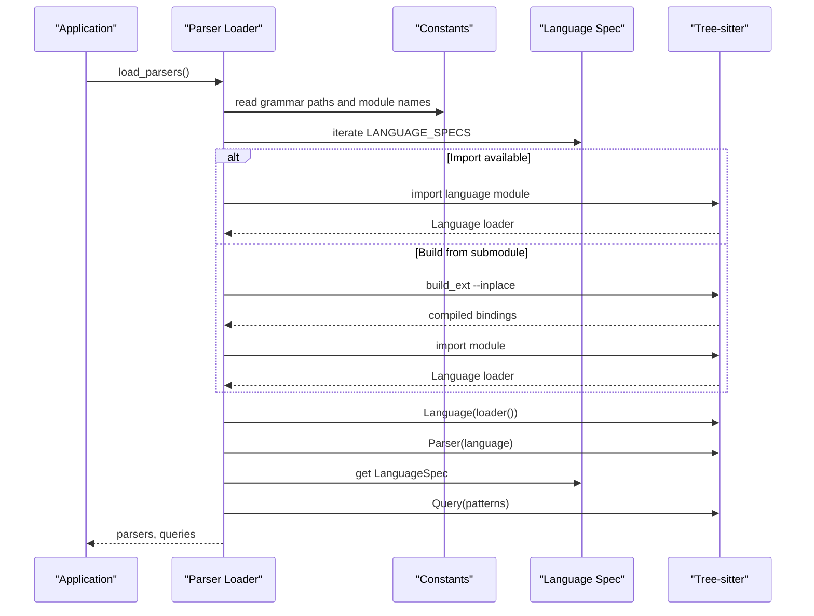
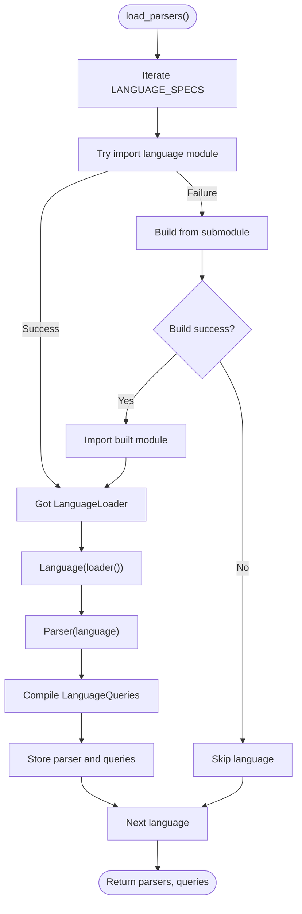
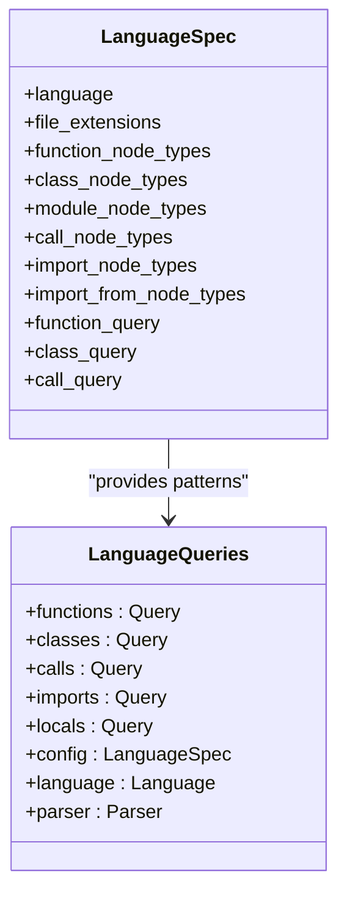
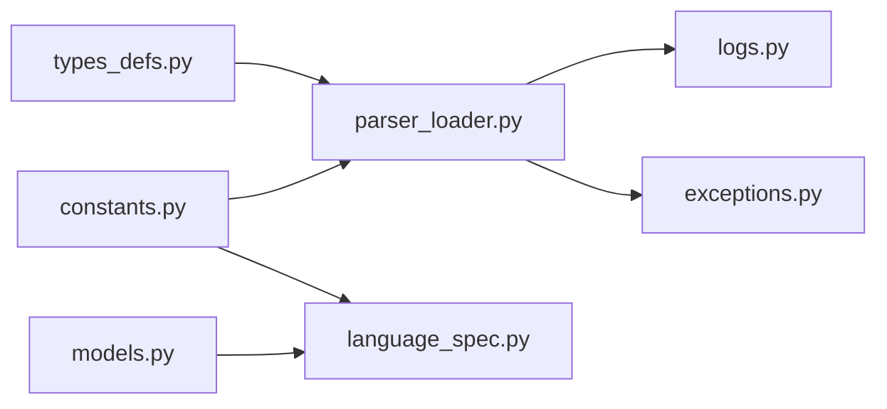

# Tree-sitter Integration

<cite>
**Referenced Files in This Document**
- [parser_loader.py](file://codebase_rag/parser_loader.py)
- [language_spec.py](file://codebase_rag/language_spec.py)
- [constants.py](file://codebase_rag/constants.py)
- [types_defs.py](file://codebase_rag/types_defs.py)
- [models.py](file://codebase_rag/models.py)
- [logs.py](file://codebase_rag/logs.py)
- [exceptions.py](file://codebase_rag/exceptions.py)
</cite>

## Table of Contents
1. [Introduction](#introduction)
2. [Project Structure](#project-structure)
3. [Core Components](#core-components)
4. [Architecture Overview](#architecture-overview)
5. [Detailed Component Analysis](#detailed-component-analysis)
6. [Dependency Analysis](#dependency-analysis)
7. [Performance Considerations](#performance-considerations)
8. [Troubleshooting Guide](#troubleshooting-guide)
9. [Conclusion](#conclusion)

## Introduction
This document explains how the project integrates Tree-sitter for multi-language parsing and codebase analysis. It covers the parser loader system, dynamic grammar loading, language specifications, query compilation and execution, conflict resolution, language-specific optimizations, and the relationship between Tree-sitter parsers and the broader parsing pipeline. It also provides guidance on performance, memory management, error handling, and troubleshooting.

## Project Structure
Tree-sitter integration is centered around a small set of modules:
- Parser loader: builds and loads Tree-sitter language libraries, initializes parsers and queries per language.
- Language specification: defines language capabilities, node types, and optional custom Tree-sitter queries.
- Constants and types: define supported languages, grammar paths, query patterns, and typed structures.
- Logs and exceptions: provide structured logging and error conditions for parser lifecycle events.

**Diagram sources**
- [parser_loader.py](file://codebase_rag/parser_loader.py#L1-L293)
- [language_spec.py](file://codebase_rag/language_spec.py#L1-L426)
- [constants.py](file://codebase_rag/constants.py#L712-L780)
- [types_defs.py](file://codebase_rag/types_defs.py#L1-L555)
- [models.py](file://codebase_rag/models.py#L1-L95)
- [logs.py](file://codebase_rag/logs.py#L74-L91)
- [exceptions.py](file://codebase_rag/exceptions.py#L39-L41)

**Section sources**
- [parser_loader.py](file://codebase_rag/parser_loader.py#L1-L293)
- [language_spec.py](file://codebase_rag/language_spec.py#L1-L426)
- [constants.py](file://codebase_rag/constants.py#L712-L780)
- [types_defs.py](file://codebase_rag/types_defs.py#L1-L555)
- [models.py](file://codebase_rag/models.py#L1-L95)
- [logs.py](file://codebase_rag/logs.py#L74-L91)
- [exceptions.py](file://codebase_rag/exceptions.py#L39-L41)

## Core Components
- Parser loader: Imports or builds Tree-sitter language bindings, constructs Language and Parser instances, compiles language-specific queries, and aggregates them per language.
- Language specification: Defines per-language AST node types, optional custom Tree-sitter queries, and helpers for extracting names and module paths.
- Constants and paths: Define grammar directories, module prefixes, and query patterns.
- Types and models: Define LanguageSpec, FQNSpec, LanguageQueries, and related protocols and typed dictionaries.
- Logging and exceptions: Provide granular logs for grammar building, importing, query creation, and initialization.

Key responsibilities:
- Dynamic grammar loading: Attempts direct import first, falls back to building from submodule bindings.
- Query composition: Builds compound patterns from node types and wraps them into Tree-sitter Query objects.
- Optional queries: Some languages supply custom queries; others rely on auto-generated patterns.
- Error handling: Graceful degradation when grammars are unavailable or queries fail.

**Section sources**
- [parser_loader.py](file://codebase_rag/parser_loader.py#L17-L82)
- [parser_loader.py](file://codebase_rag/parser_loader.py#L96-L170)
- [parser_loader.py](file://codebase_rag/parser_loader.py#L222-L248)
- [language_spec.py](file://codebase_rag/language_spec.py#L205-L409)
- [constants.py](file://codebase_rag/constants.py#L712-L780)
- [types_defs.py](file://codebase_rag/types_defs.py#L324-L333)
- [models.py](file://codebase_rag/models.py#L57-L73)
- [logs.py](file://codebase_rag/logs.py#L74-L91)
- [exceptions.py](file://codebase_rag/exceptions.py#L39-L41)

## Architecture Overview
The integration follows a layered approach:
- Grammar discovery and loading: Determine whether to import prebuilt bindings or build from submodule.
- Parser construction: Create a Tree-sitter Parser bound to a Language.
- Query compilation: Compile language-specific queries for functions, classes, calls, imports, and locals.
- Pipeline integration: Parsers and queries are stored per language and consumed by downstream processors.

**Diagram sources**
- [parser_loader.py](file://codebase_rag/parser_loader.py#L96-L170)
- [parser_loader.py](file://codebase_rag/parser_loader.py#L251-L292)
- [language_spec.py](file://codebase_rag/language_spec.py#L205-L409)
- [constants.py](file://codebase_rag/constants.py#L712-L780)

## Detailed Component Analysis

### Parser Loader System
Responsibilities:
- Discover and load language bindings via direct import or submodule build.
- Initialize Parser and compile LanguageQueries for each supported language.
- Aggregate parsers and queries for downstream use.

Key behaviors:
- Import-first strategy: Try importing the language module; if missing, attempt to build from submodule.
- Submodule build: Executes setup.py build_ext --inplace under the grammar submodule path.
- Attribute discovery: Looks for language attributes with multiple naming variants.
- Query creation: Builds patterns from LanguageSpec node types or uses custom queries when provided.

**Diagram sources**
- [parser_loader.py](file://codebase_rag/parser_loader.py#L96-L170)
- [parser_loader.py](file://codebase_rag/parser_loader.py#L251-L292)
- [parser_loader.py](file://codebase_rag/parser_loader.py#L222-L248)

**Section sources**
- [parser_loader.py](file://codebase_rag/parser_loader.py#L17-L82)
- [parser_loader.py](file://codebase_rag/parser_loader.py#L85-L94)
- [parser_loader.py](file://codebase_rag/parser_loader.py#L96-L170)
- [parser_loader.py](file://codebase_rag/parser_loader.py#L251-L292)

### Dynamic Grammar Loading Mechanisms
- Grammar directories: Grammars live under a dedicated directory with language-specific submodules.
- Module naming: Uses a consistent prefix for Tree-sitter modules and language attributes.
- Build automation: When submodule bindings are present, setup.py build_ext --inplace is invoked to produce Python bindings.
- Fallback: If import fails, the loader attempts to import from submodule-built bindings.

Installation requirements:
- Python development environment with setuptools and wheel.
- Language-specific build prerequisites as required by each grammar’s setup.py.
- Runtime availability of the compiled bindings.

**Section sources**
- [constants.py](file://codebase_rag/constants.py#L712-L722)
- [parser_loader.py](file://codebase_rag/parser_loader.py#L17-L82)

### Supported Languages and Grammar Configuration
Supported languages and their configuration are defined centrally:
- Language list: Includes Python, JavaScript, TypeScript, Rust, Go, Scala, Java, C++, C#, PHP, and Lua.
- File extensions: Mapped per language for automatic detection.
- Node types: Function, class, module, call, import/import-from node types.
- Optional custom queries: Some languages provide explicit Tree-sitter query strings for functions, classes, and calls.

Language-specific optimizations:
- Rust: Provides custom queries for functions, classes, and calls tailored to Rust AST.
- Java: Provides custom queries for methods and classes.
- C++: Provides custom queries for functions, classes, and calls.
- JavaScript/TypeScript: Includes locals query patterns for variable definitions and references.

**Section sources**
- [constants.py](file://codebase_rag/constants.py#L426-L507)
- [language_spec.py](file://codebase_rag/language_spec.py#L205-L409)
- [constants.py](file://codebase_rag/constants.py#L752-L777)

### Language Specification System
LanguageSpec encapsulates:
- Language identity and file extensions.
- AST node type sets for functions, classes, modules, calls, imports, and import-from.
- Optional custom Tree-sitter query strings for functions, classes, and calls.
- Name field defaults and package indicators.

FQN (fully qualified name) specification:
- Per-language helpers for extracting names from AST nodes and converting file paths to module parts.
- Scope and function node type sets guide name resolution and module boundaries.

**Section sources**
- [models.py](file://codebase_rag/models.py#L57-L73)
- [language_spec.py](file://codebase_rag/language_spec.py#L50-L181)
- [language_spec.py](file://codebase_rag/language_spec.py#L205-L409)

### Grammar Query Compilation and Execution
Query composition:
- Auto-generated patterns: Combine node types into compound patterns with capture names.
- Optional custom queries: When provided in LanguageSpec, they override auto-generated patterns.
- Locals queries: Language-specific patterns for variable definitions and references (JavaScript/TypeScript).

Execution:
- Queries are compiled against the Language and attached to LanguageQueries along with Parser and Language.
- Downstream processors can execute queries against parsed ASTs to extract functions, classes, calls, imports, and locals.

**Diagram sources**
- [models.py](file://codebase_rag/models.py#L57-L73)
- [types_defs.py](file://codebase_rag/types_defs.py#L324-L333)
- [language_spec.py](file://codebase_rag/language_spec.py#L205-L409)

**Section sources**
- [parser_loader.py](file://codebase_rag/parser_loader.py#L175-L207)
- [parser_loader.py](file://codebase_rag/parser_loader.py#L222-L248)
- [constants.py](file://codebase_rag/constants.py#L752-L777)

### Grammar Conflict Resolution and Language-Specific Optimizations
Conflict resolution:
- Node type precedence and specificity are handled implicitly by the order and selection of node types in LanguageSpec.
- Custom queries can override auto-generated patterns to precisely target desired constructs.

Language-specific optimizations:
- Rust: Explicit queries for function_item, struct_item, enum_item, trait_item, type_item, impl_item, and mod_item.
- Java: Explicit queries for method_declaration, constructor_declaration, class_declaration, interface_declaration, enum_declaration, annotation_type_declaration, record_declaration.
- C++: Explicit queries for function_definition, class_specifier, struct_specifier, union_specifier, enum_specifier, and various expression forms.
- JavaScript/TypeScript: Locals patterns for variable_declarator, function_declaration, class_declaration, and identifier references.

**Section sources**
- [language_spec.py](file://codebase_rag/language_spec.py#L254-L288)
- [language_spec.py](file://codebase_rag/language_spec.py#L319-L342)
- [language_spec.py](file://codebase_rag/language_spec.py#L354-L380)
- [constants.py](file://codebase_rag/constants.py#L752-L777)

### Relationship Between Tree-sitter Parsers and the Overall Parsing Pipeline
- Initialization: load_parsers() produces a dictionary of Parser keyed by language and a corresponding LanguageQueries bundle.
- Consumption: Downstream processors (definition extraction, call resolution, import parsing, etc.) use the appropriate Parser and Query for each language.
- Extension: New languages can be added by extending LANGUAGE_SPECS with node types and optional custom queries.

**Section sources**
- [parser_loader.py](file://codebase_rag/parser_loader.py#L276-L292)
- [language_spec.py](file://codebase_rag/language_spec.py#L411-L425)

## Dependency Analysis
- Parser loader depends on constants for grammar paths and module names, on language_spec for configuration, and on Tree-sitter runtime for Language, Parser, and Query.
- Language spec depends on constants for node types and patterns, and on models for LanguageSpec and FQNSpec.
- Types_defs defines LanguageQueries and related protocols used by the loader and consumers.

**Diagram sources**
- [parser_loader.py](file://codebase_rag/parser_loader.py#L1-L15)
- [language_spec.py](file://codebase_rag/language_spec.py#L1-L6)
- [constants.py](file://codebase_rag/constants.py#L1-L10)
- [types_defs.py](file://codebase_rag/types_defs.py#L1-L18)
- [models.py](file://codebase_rag/models.py#L1-L10)
- [logs.py](file://codebase_rag/logs.py#L1-L5)
- [exceptions.py](file://codebase_rag/exceptions.py#L1-L5)

**Section sources**
- [parser_loader.py](file://codebase_rag/parser_loader.py#L1-L15)
- [language_spec.py](file://codebase_rag/language_spec.py#L1-L6)
- [constants.py](file://codebase_rag/constants.py#L1-L10)
- [types_defs.py](file://codebase_rag/types_defs.py#L1-L18)
- [models.py](file://codebase_rag/models.py#L1-L10)
- [logs.py](file://codebase_rag/logs.py#L1-L5)
- [exceptions.py](file://codebase_rag/exceptions.py#L1-L5)

## Performance Considerations
- Grammar building cost: Building bindings via setup.py build_ext --inplace is performed once per language and cached in sys.path. Subsequent loads reuse the built module.
- Query compilation cost: Queries are compiled once per language during initialization and reused across parsing sessions.
- Memory footprint: Each Parser and Language instance consumes memory proportional to the grammar size. Limiting to required languages reduces overhead.
- Parallelization: The loader iterates over languages sequentially; if needed, this could be parallelized with caution to avoid resource contention during builds.
- Logging overhead: Debug logs are helpful but can be reduced in production to minimize I/O overhead.

[No sources needed since this section provides general guidance]

## Troubleshooting Guide
Common issues and resolutions:
- No Tree-sitter languages available: Raised when no grammars could be loaded. Verify grammar submodules and build prerequisites.
- Grammar build failure: The loader logs stdout/stderr from the build process. Inspect logs for compiler errors and ensure development tools are installed.
- Import failure for language module: The loader attempts to build from submodule; if both fail, the language is skipped. Confirm module naming and submodule layout.
- Locals query creation failure: Some languages provide locals queries; failures are logged and the locals query is omitted for that language.
- Grammar load failure: Specific language load failures are logged with error details; verify grammar availability and compatibility.

Operational tips:
- Enable debug logs to trace grammar building and import steps.
- Ensure the grammar submodule directory structure matches expected paths.
- Validate that the Python environment includes required build dependencies.

**Section sources**
- [exceptions.py](file://codebase_rag/exceptions.py#L39-L41)
- [logs.py](file://codebase_rag/logs.py#L74-L91)
- [parser_loader.py](file://codebase_rag/parser_loader.py#L37-L52)
- [parser_loader.py](file://codebase_rag/parser_loader.py#L217-L219)

## Conclusion
The Tree-sitter integration provides a robust, extensible foundation for multi-language parsing and codebase analysis. The parser loader dynamically discovers and builds language bindings, initializes parsers, and compiles language-specific queries. LanguageSpec centralizes grammar configuration and enables language-specific optimizations. With clear logging and error handling, the system supports reliable operation across diverse codebases and languages.