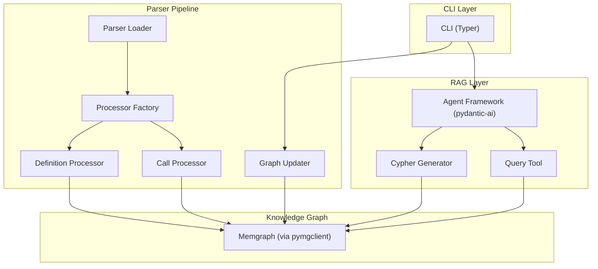
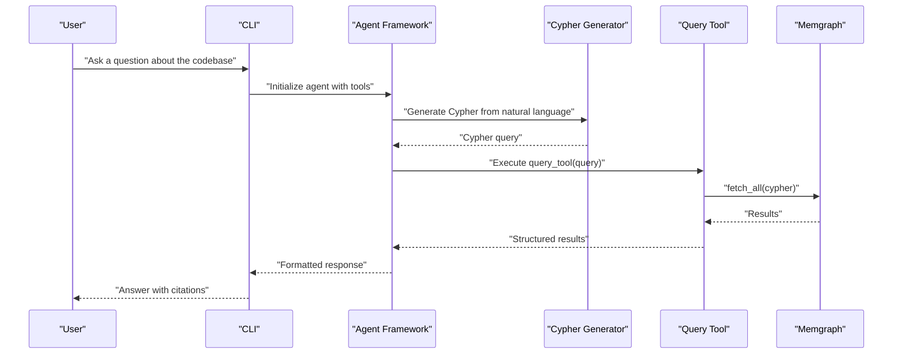
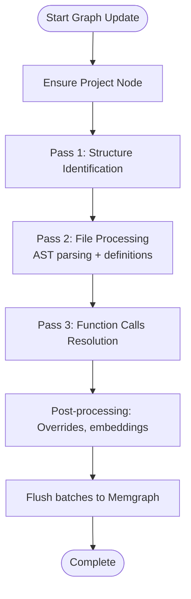
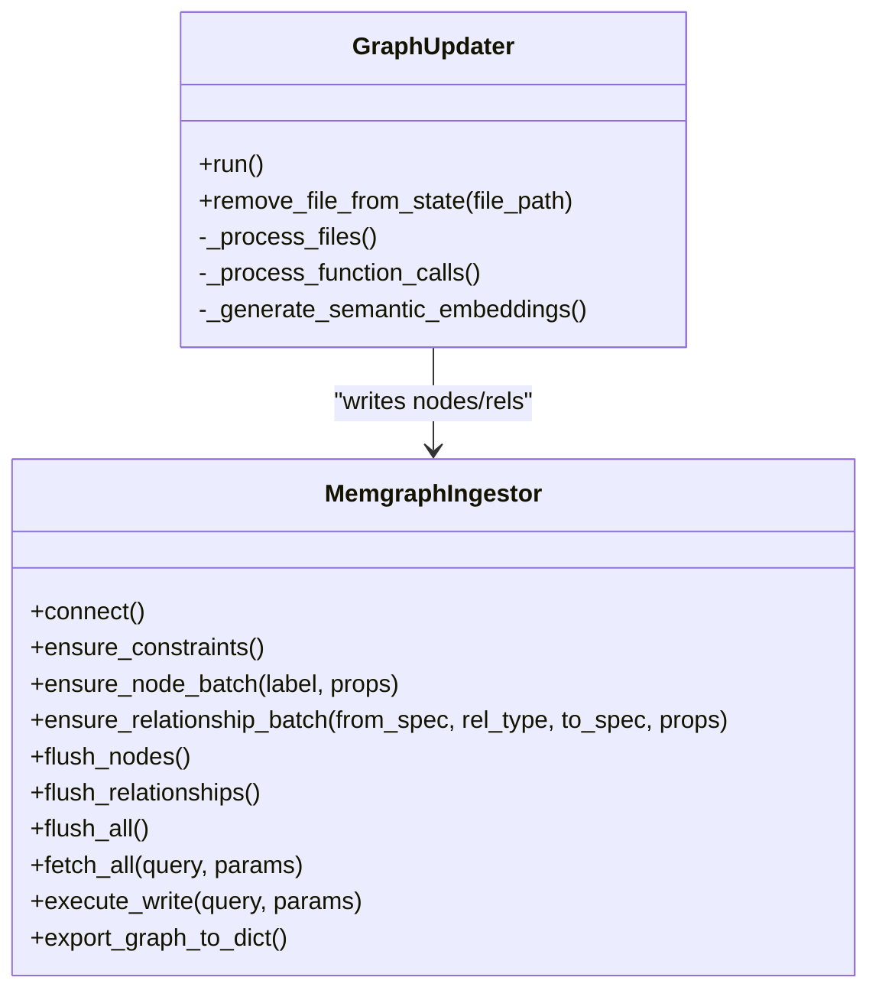
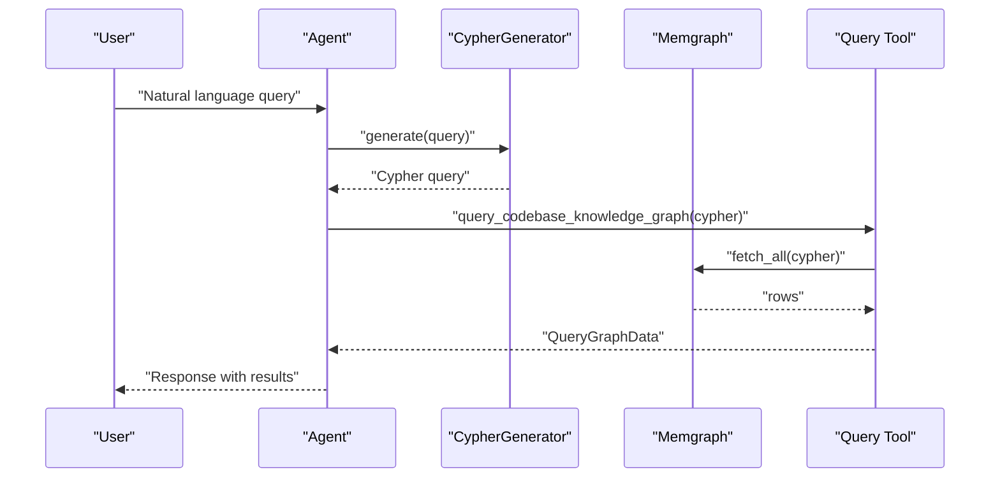
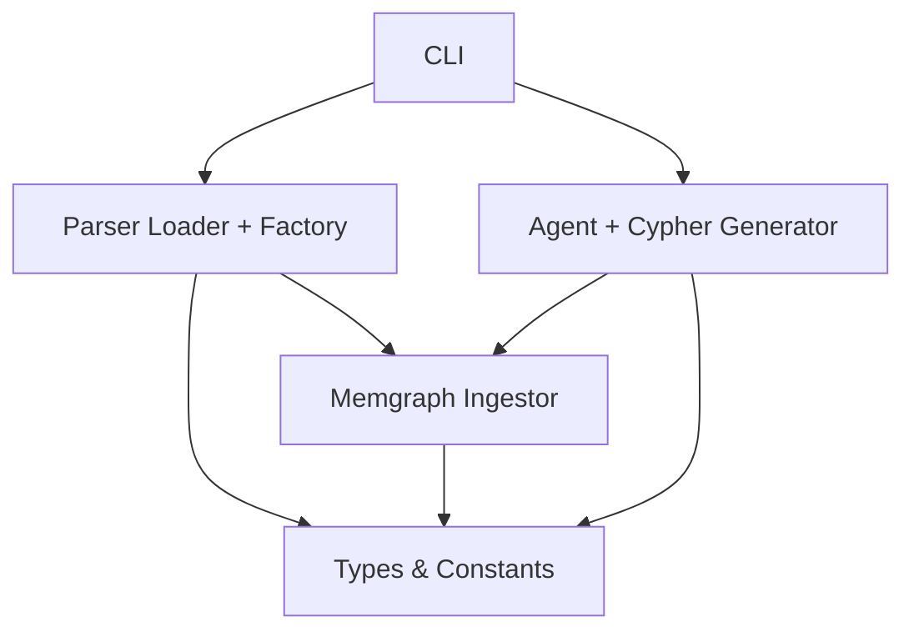

# Core Concepts and Architecture

<cite>
**Referenced Files in This Document**
- [README.md](file://README.md)
- [main.py](file://codebase_rag/main.py)
- [cli.py](file://codebase_rag/cli.py)
- [graph_updater.py](file://codebase_rag/graph_updater.py)
- [services/graph_service.py](file://codebase_rag/services/graph_service.py)
- [tools/codebase_query.py](file://codebase_rag/tools/codebase_query.py)
- [services/llm.py](file://codebase_rag/services/llm.py)
- [parser_loader.py](file://codebase_rag/parser_loader.py)
- [parsers/factory.py](file://codebase_rag/parsers/factory.py)
- [parsers/definition_processor.py](file://codebase_rag/parsers/definition_processor.py)
- [parsers/call_processor.py](file://codebase_rag/parsers/call_processor.py)
- [prompts.py](file://codebase_rag/prompts.py)
- [types_defs.py](file://codebase_rag/types_defs.py)
- [constants.py](file://codebase_rag/constants.py)
</cite>

## Table of Contents
1. [Introduction](#introduction)
2. [Project Structure](#project-structure)
3. [Core Components](#core-components)
4. [Architecture Overview](#architecture-overview)
5. [Detailed Component Analysis](#detailed-component-analysis)
6. [Dependency Analysis](#dependency-analysis)
7. [Performance Considerations](#performance-considerations)
8. [Troubleshooting Guide](#troubleshooting-guide)
9. [Conclusion](#conclusion)

## Introduction
This document explains the dual-component system design of Graph-Code: the multi-language parser that performs Tree-sitter based AST analysis and the Retrieval-Augmented Generation (RAG) system that enables natural language querying of the codebase. It also covers how the knowledge graph represents codebase structure, the role of Memgraph in storage and retrieval, and the agent framework’s tool orchestration. The goal is to make these concepts accessible to beginners while providing technical depth for experienced developers.

## Project Structure
Graph-Code is organized around two primary subsystems:
- Multi-language parser: Tree-sitter-based AST parsing, language-specific ingestion, and graph construction
- RAG system: Agent-driven natural language querying, Cypher generation, and tool orchestration

**Diagram sources**
- [cli.py](file://codebase_rag/cli.py#L1-L395)
- [parser_loader.py](file://codebase_rag/parser_loader.py#L1-L293)
- [parsers/factory.py](file://codebase_rag/parsers/factory.py#L1-L116)
- [parsers/definition_processor.py](file://codebase_rag/parsers/definition_processor.py#L1-L193)
- [parsers/call_processor.py](file://codebase_rag/parsers/call_processor.py#L1-L200)
- [graph_updater.py](file://codebase_rag/graph_updater.py#L1-L469)
- [services/graph_service.py](file://codebase_rag/services/graph_service.py#L1-L364)
- [services/llm.py](file://codebase_rag/services/llm.py#L1-L93)
- [tools/codebase_query.py](file://codebase_rag/tools/codebase_query.py#L1-L95)

**Section sources**
- [README.md](file://README.md#L72-L78)
- [cli.py](file://codebase_rag/cli.py#L1-L395)

## Core Components
- Multi-language parser (AST parsing and graph construction)
  - Loads Tree-sitter grammars and language queries
  - Processes files to extract definitions, imports, and function calls
  - Builds a knowledge graph in Memgraph using batches
- RAG system (natural language querying and agent orchestration)
  - Generates Cypher from natural language queries
  - Executes queries against the knowledge graph
  - Provides an agent framework with tools for file reading, editing, and shell commands

Key responsibilities:
- Parser pipeline: language detection → AST parsing → definition ingestion → call relationship building → semantic embedding generation
- RAG pipeline: natural language input → Cypher generation → graph query execution → result rendering

**Section sources**
- [parser_loader.py](file://codebase_rag/parser_loader.py#L276-L293)
- [parsers/factory.py](file://codebase_rag/parsers/factory.py#L18-L116)
- [graph_updater.py](file://codebase_rag/graph_updater.py#L223-L286)
- [services/llm.py](file://codebase_rag/services/llm.py#L37-L93)
- [tools/codebase_query.py](file://codebase_rag/tools/codebase_query.py#L24-L95)

## Architecture Overview
The system’s dual-component architecture integrates:
- AST parsing and ingestion (Tree-sitter) into a knowledge graph
- Natural language querying powered by an LLM that translates questions into Cypher

**Diagram sources**
- [services/llm.py](file://codebase_rag/services/llm.py#L78-L93)
- [tools/codebase_query.py](file://codebase_rag/tools/codebase_query.py#L24-L95)
- [services/graph_service.py](file://codebase_rag/services/graph_service.py#L329-L340)

## Detailed Component Analysis

### Multi-language Parser: Tree-sitter AST Analysis and Graph Construction
The parser pipeline transforms source code into a knowledge graph:
- Parser loader initializes Tree-sitter grammars and language-specific queries
- Processor factory composes specialized processors for imports, definitions, types, and calls
- Graph updater orchestrates passes: structure identification, file processing, call resolution, and embedding generation

**Diagram sources**
- [graph_updater.py](file://codebase_rag/graph_updater.py#L264-L286)
- [parsers/factory.py](file://codebase_rag/parsers/factory.py#L18-L116)
- [services/graph_service.py](file://codebase_rag/services/graph_service.py#L323-L327)

Key implementation patterns:
- Bounded AST caching to limit memory and improve performance
- Trie-based function registry for fast qualified name lookups
- Batched writes to Memgraph for throughput

Practical example:
- A Python function definition is parsed, its qualified name is computed, and a Function node is inserted into the graph. Imports are resolved and Module relationships are established. Later, function calls are discovered and CALLS relationships are created.

**Section sources**
- [graph_updater.py](file://codebase_rag/graph_updater.py#L162-L221)
- [graph_updater.py](file://codebase_rag/graph_updater.py#L223-L286)
- [parsers/definition_processor.py](file://codebase_rag/parsers/definition_processor.py#L53-L144)
- [parsers/call_processor.py](file://codebase_rag/parsers/call_processor.py#L49-L74)

### Knowledge Graph Representation and Memgraph Integration
The knowledge graph stores codebase structure as nodes and relationships:
- Nodes: Project, Package, Folder, File, Module, Class, Function, Method, Interface, Enum, Type, Union, ModuleInterface, ModuleImplementation, ExternalPackage
- Relationships: CONTAINS_* (hierarchical), DEFINES, IMPORTS, EXPORTS, IMPLEMENTS, INHERITS, OVERRIDES, CALLS, DEPENDS_ON_EXTERNAL

Memgraph integration:
- Connection management, constraint enforcement, and batched node/relationship insertion
- Export to JSON for external analysis
- Query execution for both Cypher generation and tool-based retrieval

**Diagram sources**
- [services/graph_service.py](file://codebase_rag/services/graph_service.py#L49-L364)
- [graph_updater.py](file://codebase_rag/graph_updater.py#L223-L469)

**Section sources**
- [services/graph_service.py](file://codebase_rag/services/graph_service.py#L180-L364)
- [constants.py](file://codebase_rag/constants.py#L150-L200)

### RAG System: Natural Language Querying and Agent Orchestration
The RAG system translates natural language into Cypher and executes it against the knowledge graph:
- Cypher generator uses an LLM to produce Cypher from NL queries
- Query tool executes Cypher and renders results
- Agent orchestrator coordinates tools (query, read file, edit, shell, semantic search)

**Diagram sources**
- [services/llm.py](file://codebase_rag/services/llm.py#L37-L93)
- [tools/codebase_query.py](file://codebase_rag/tools/codebase_query.py#L24-L95)
- [prompts.py](file://codebase_rag/prompts.py#L59-L128)

**Section sources**
- [services/llm.py](file://codebase_rag/services/llm.py#L37-L93)
- [tools/codebase_query.py](file://codebase_rag/tools/codebase_query.py#L24-L95)
- [prompts.py](file://codebase_rag/prompts.py#L44-L128)

### Practical Example: From Parsing to Query Processing
End-to-end flow:
1. CLI parses arguments and starts the update or chat loop
2. Parser loads grammars and processes files, building the knowledge graph
3. Agent receives natural language input, generates Cypher, queries the graph, and returns results

```mermaid
flowchart LR
A["CLI start/update"] --> B["Load parsers and queries"]
B --> C["Process files (AST parsing)"]
C --> D["Ingest definitions and imports"]
D --> E["Resolve function calls"]
E --> F["Write to Memgraph (batched)"]
F --> G["Agent receives NL query"]
G --> H["LLM generates Cypher"]
H --> I["Execute query on Memgraph"]
I --> J["Render results"]
```

**Diagram sources**
- [cli.py](file://codebase_rag/cli.py#L55-L172)
- [parser_loader.py](file://codebase_rag/parser_loader.py#L276-L293)
- [graph_updater.py](file://codebase_rag/graph_updater.py#L264-L286)
- [services/llm.py](file://codebase_rag/services/llm.py#L78-L93)
- [tools/codebase_query.py](file://codebase_rag/tools/codebase_query.py#L24-L95)

**Section sources**
- [cli.py](file://codebase_rag/cli.py#L55-L172)
- [main.py](file://codebase_rag/main.py#L681-L694)

## Dependency Analysis
The system exhibits clear separation of concerns:
- Parser layer depends on Tree-sitter and language specs
- Graph layer encapsulates Memgraph connectivity and batching
- RAG layer depends on LLM providers and tool definitions
- CLI coordinates both layers and exposes commands

**Diagram sources**
- [cli.py](file://codebase_rag/cli.py#L1-L395)
- [parser_loader.py](file://codebase_rag/parser_loader.py#L1-L293)
- [parsers/factory.py](file://codebase_rag/parsers/factory.py#L1-L116)
- [services/graph_service.py](file://codebase_rag/services/graph_service.py#L1-L364)
- [services/llm.py](file://codebase_rag/services/llm.py#L1-L93)
- [types_defs.py](file://codebase_rag/types_defs.py#L1-L200)
- [constants.py](file://codebase_rag/constants.py#L1-L200)

**Section sources**
- [types_defs.py](file://codebase_rag/types_defs.py#L1-L200)
- [constants.py](file://codebase_rag/constants.py#L1-L200)

## Performance Considerations
- Batching and buffering: MemgraphIngestor flushes nodes and relationships in configurable batches to balance throughput and latency
- AST caching: BoundedASTCache reduces repeated parsing overhead for frequently accessed files
- Query limits: Cypher queries are constrained with LIMIT to avoid large result sets
- Embedding generation: Semantic embeddings are generated in batches and logged with progress intervals

Recommendations:
- Tune MEMGRAPH_BATCH_SIZE for your workload
- Monitor cache eviction behavior and adjust cache limits
- Prefer semantic search for intent-based queries to reduce graph traversal cost
- Use path-based filtering with STARTS WITH for hierarchical queries

**Section sources**
- [services/graph_service.py](file://codebase_rag/services/graph_service.py#L50-L83)
- [graph_updater.py](file://codebase_rag/graph_updater.py#L162-L221)
- [prompts.py](file://codebase_rag/prompts.py#L131-L200)

## Troubleshooting Guide
Common issues and resolutions:
- Parser failures: Verify Tree-sitter grammars are available and language-specific queries are constructed correctly
- Memgraph connectivity: Ensure Docker Compose is running and credentials/endpoints are configured
- LLM generation errors: Check provider configuration and model availability; local models may require stricter prompts
- Query tool failures: Validate Cypher generation and ensure the knowledge graph contains expected nodes/relationships

Operational tips:
- Use the export command to validate graph state externally
- Enable quiet mode for cleaner logs during automation
- Review session logs for context when debugging agent interactions

**Section sources**
- [cli.py](file://codebase_rag/cli.py#L237-L271)
- [services/graph_service.py](file://codebase_rag/services/graph_service.py#L166-L188)
- [tools/codebase_query.py](file://codebase_rag/tools/codebase_query.py#L76-L88)

## Conclusion
Graph-Code’s dual-component architecture combines robust AST parsing with a powerful RAG system. The multi-language parser builds a comprehensive knowledge graph in Memgraph, while the agent framework translates natural language into precise Cypher queries for deep codebase exploration. This design balances accuracy, scalability, and usability, enabling both beginners and advanced users to understand and interact with complex codebases effectively.