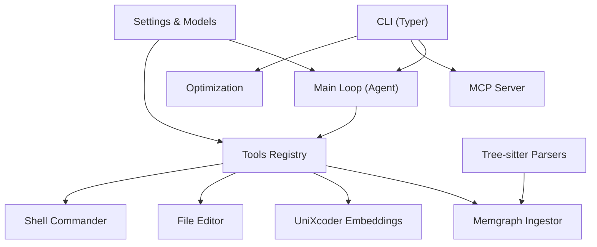
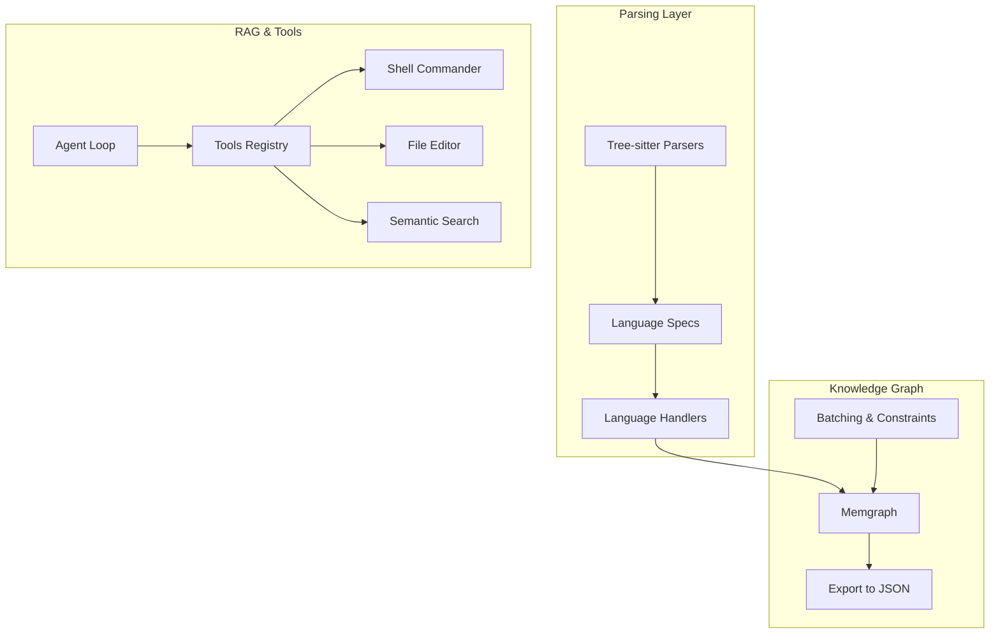
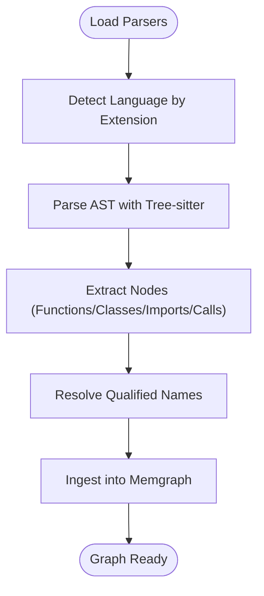
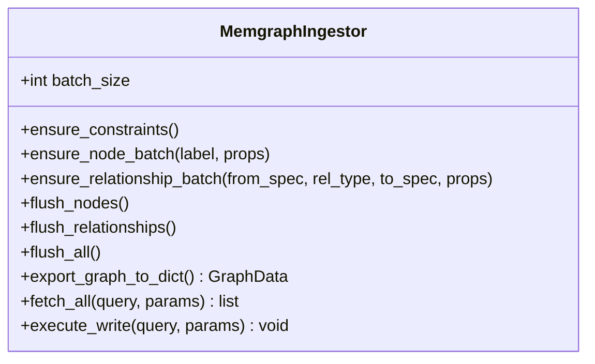
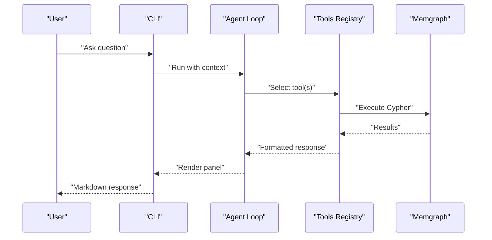
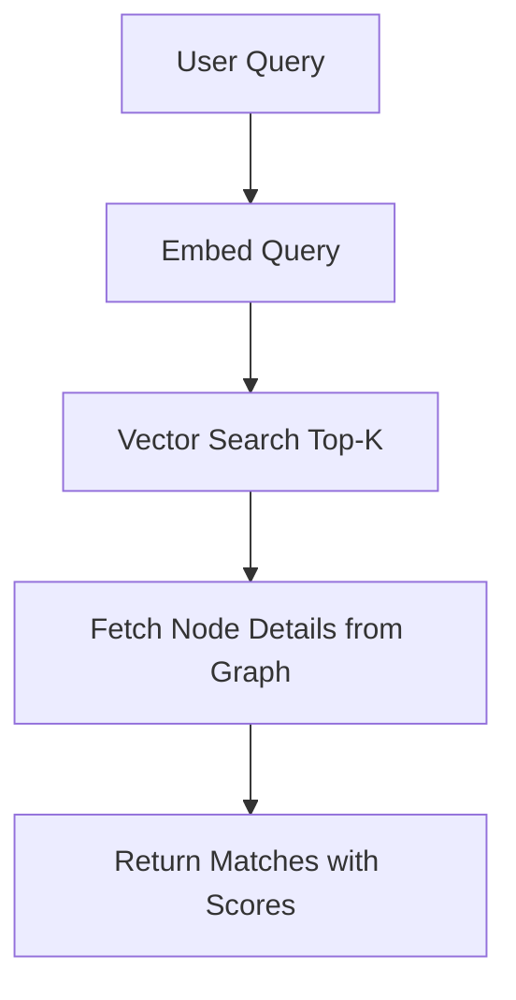
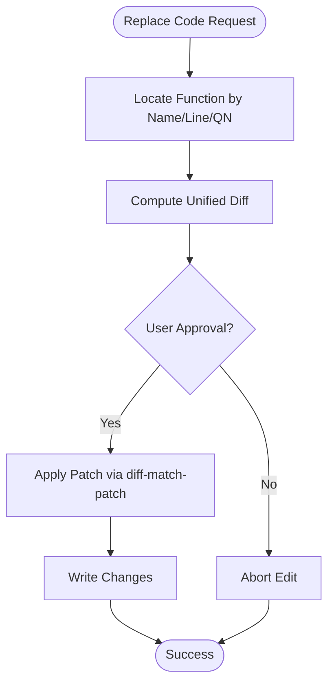
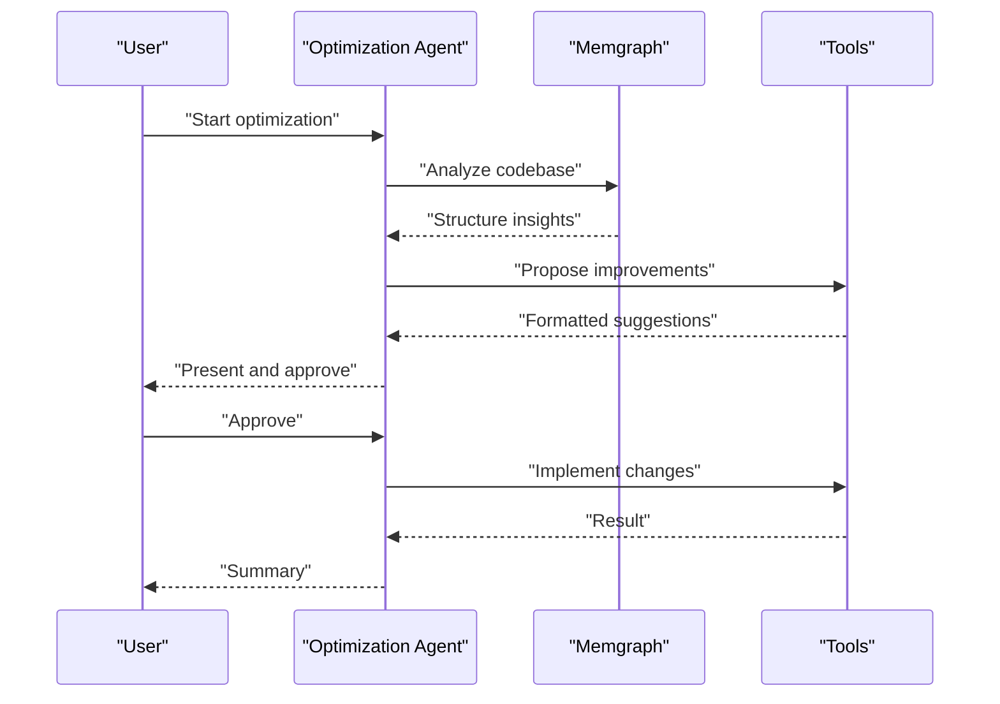
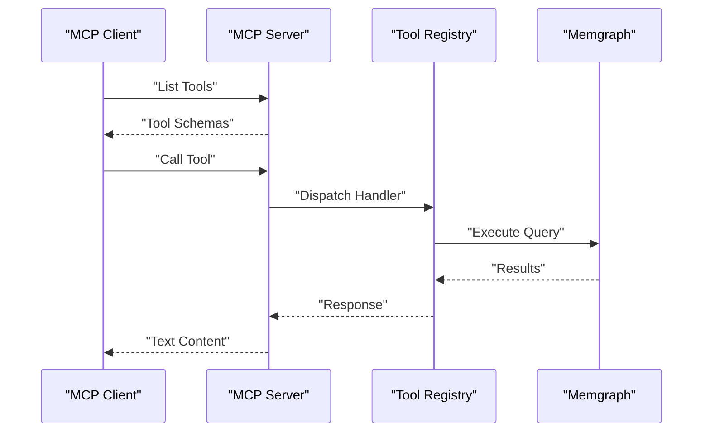
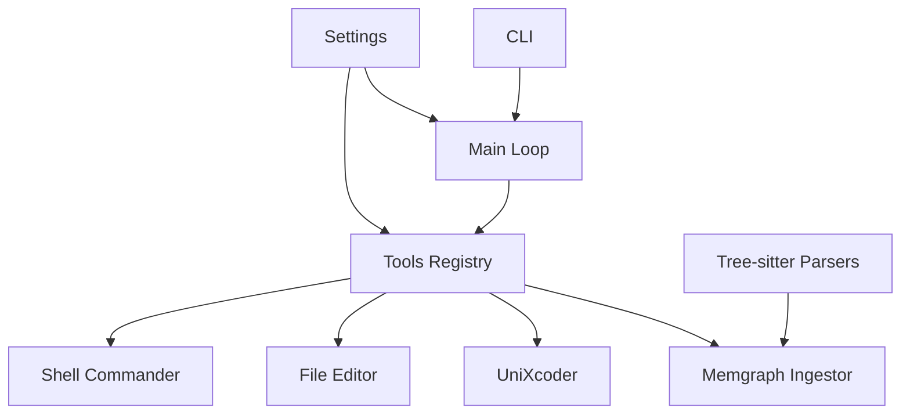

# Key Features and Capabilities

<cite>
**Referenced Files in This Document**
- [README.md](file://README.md)
- [main.py](file://codebase_rag/main.py)
- [cli.py](file://codebase_rag/cli.py)
- [config.py](file://codebase_rag/config.py)
- [language_spec.py](file://codebase_rag/language_spec.py)
- [cpp.py](file://codebase_rag/parsers/handlers/cpp.py)
- [java.py](file://codebase_rag/parsers/handlers/java.py)
- [js_ts.py](file://codebase_rag/parsers/handlers/js_ts.py)
- [python.py](file://codebase_rag/parsers/handlers/python.py)
- [rust.py](file://codebase_rag/parsers/handlers/rust.py)
- [server.py](file://codebase_rag/mcp/server.py)
- [semantic_search.py](file://codebase_rag/tools/semantic_search.py)
- [file_editor.py](file://codebase_rag/tools/file_editor.py)
- [graph_service.py](file://codebase_rag/services/graph_service.py)
- [unixcoder.py](file://codebase_rag/unixcoder.py)
</cite>

## Table of Contents
1. [Introduction](#introduction)
2. [Project Structure](#project-structure)
3. [Core Components](#core-components)
4. [Architecture Overview](#architecture-overview)
5. [Detailed Component Analysis](#detailed-component-analysis)
6. [Dependency Analysis](#dependency-analysis)
7. [Performance Considerations](#performance-considerations)
8. [Troubleshooting Guide](#troubleshooting-guide)
9. [Conclusion](#conclusion)

## Introduction
This document presents the key features and capabilities of Graph-Code, a comprehensive multi-language codebase analysis and modification platform. It focuses on the extensive functionality portfolio, including:
- Multi-language support across seven fully supported languages and five in-development languages
- Tree-sitter parsing for robust AST extraction
- Knowledge graph storage with Memgraph
- Natural language querying and AI-powered Cypher generation
- Semantic code search with UniXcoder embeddings
- Advanced file editing with surgical replacement
- Shell command execution
- Interactive code optimization
- Dependency analysis
- MCP server integration

Each feature is explained with underlying technologies, supported use cases, practical examples, performance characteristics, limitations, and best practices.

## Project Structure
Graph-Code is organized around a CLI-driven workflow with modular components:
- CLI entrypoints orchestrate parsing, querying, exporting, optimization, and MCP server operations
- A multi-language parser leverages Tree-sitter grammars to extract ASTs and build a unified knowledge graph
- Memgraph stores the graph with batching and constraint enforcement
- Tools enable semantic search, file editing, shell commands, and more
- Configuration manages provider settings, batch sizes, and safety policies

**Diagram sources**
- [cli.py](file://codebase_rag/cli.py#L1-L395)
- [main.py](file://codebase_rag/main.py#L1-L800)
- [graph_service.py](file://codebase_rag/services/graph_service.py#L1-L364)
- [config.py](file://codebase_rag/config.py#L1-L274)

**Section sources**
- [README.md](file://README.md#L27-L71)
- [cli.py](file://codebase_rag/cli.py#L1-L395)
- [main.py](file://codebase_rag/main.py#L1-L800)
- [config.py](file://codebase_rag/config.py#L1-L274)

## Core Components
- Multi-language parsing and ingestion: Tree-sitter grammars, language specs, and handler implementations extract ASTs and map them into a unified graph schema.
- Knowledge graph storage: Memgraph-backed ingestion with batching, constraints, and export capabilities.
- Natural language querying: An agent-driven CLI with tools for querying, semantic search, and graph operations.
- AI-powered Cypher generation: Provider-agnostic model configuration for translating natural language into Cypher.
- Semantic code search: Embedding-based retrieval powered by UniXcoder and Qdrant-like vector storage.
- Advanced file editing: Surgical replacement with AST-aware targeting and diff previews.
- Shell command execution: Allowlisted commands with safety controls.
- Interactive optimization: Best-practice-guided optimization sessions with approvals.
- Dependency analysis: Parsing and indexing of external dependencies.
- MCP server integration: Standardized tool registry for Claude Code and other MCP clients.

**Section sources**
- [README.md](file://README.md#L39-L71)
- [language_spec.py](file://codebase_rag/language_spec.py#L1-L426)
- [graph_service.py](file://codebase_rag/services/graph_service.py#L1-L364)
- [semantic_search.py](file://codebase_rag/tools/semantic_search.py#L1-L157)
- [file_editor.py](file://codebase_rag/tools/file_editor.py#L1-L296)
- [config.py](file://codebase_rag/config.py#L1-L274)

## Architecture Overview
The system comprises two primary components:
- Multi-language parser: Tree-sitter-based AST extraction and ingestion into Memgraph
- RAG system: Interactive CLI for querying the stored knowledge graph

**Diagram sources**
- [language_spec.py](file://codebase_rag/language_spec.py#L205-L426)
- [graph_service.py](file://codebase_rag/services/graph_service.py#L49-L364)
- [main.py](file://codebase_rag/main.py#L387-L680)
- [cli.py](file://codebase_rag/cli.py#L55-L172)

## Detailed Component Analysis

### Multi-Language Support
Graph-Code supports seven fully supported languages and five in-development languages. Each language has:
- Language specification defining AST node types for functions, classes, modules, imports, and calls
- Qualified name resolution helpers
- Language-specific handlers for advanced features

Supported languages and status:
- Fully supported: C++, Java, JavaScript, Lua, Python, Rust, TypeScript
- In development: C#, Go, PHP, Scala

Key implementation aspects:
- Language specs enumerate node types and queries for each language
- Handlers implement language-specific logic (e.g., decorators, method signatures, FQN construction)
- Parser loader and language detection map file extensions to grammars and handlers

Practical examples:
- Extract functions and classes from Python modules
- Resolve qualified names for Rust impl blocks
- Handle nested function names in JavaScript/TypeScript

Performance and limitations:
- Performance scales with AST traversal and language-specific parsing complexity
- In-development languages may lack full feature coverage until official support is added

**Section sources**
- [README.md](file://README.md#L41-L57)
- [language_spec.py](file://codebase_rag/language_spec.py#L205-L426)
- [cpp.py](file://codebase_rag/parsers/handlers/cpp.py#L19-L60)
- [java.py](file://codebase_rag/parsers/handlers/java.py#L13-L29)
- [js_ts.py](file://codebase_rag/parsers/handlers/js_ts.py#L14-L116)
- [python.py](file://codebase_rag/parsers/handlers/python.py#L13-L23)
- [rust.py](file://codebase_rag/parsers/handlers/rust.py#L19-L71)

### Tree-sitter Parsing Capabilities
Tree-sitter powers robust, language-agnostic AST parsing:
- Language specs define function/class/module/call/import node types
- Handlers extract names, decorators, and construct qualified names
- Parser loader integrates grammars and provides ASTs for ingestion

**Diagram sources**
- [language_spec.py](file://codebase_rag/language_spec.py#L205-L426)
- [main.py](file://codebase_rag/main.py#L149-L160)

**Section sources**
- [language_spec.py](file://codebase_rag/language_spec.py#L1-L426)
- [main.py](file://codebase_rag/main.py#L149-L160)

### Knowledge Graph Storage with Memgraph
Memgraph serves as the persistent store for the codebase knowledge graph:
- Constraint enforcement for unique node properties
- Batching for efficient node and relationship creation
- Export to JSON for external analysis
- Transaction-safe operations with error handling

**Diagram sources**
- [graph_service.py](file://codebase_rag/services/graph_service.py#L49-L364)

**Section sources**
- [graph_service.py](file://codebase_rag/services/graph_service.py#L1-L364)
- [config.py](file://codebase_rag/config.py#L50-L54)

### Natural Language Querying
Natural language queries are processed through an agent loop with tooling:
- Interactive CLI with multi-line input and session logging
- Tool approvals for risky operations (e.g., file edits, shell commands)
- Model switching for orchestrator and Cypher generation

**Diagram sources**
- [main.py](file://codebase_rag/main.py#L387-L438)
- [cli.py](file://codebase_rag/cli.py#L55-L172)

**Section sources**
- [main.py](file://codebase_rag/main.py#L387-L438)
- [cli.py](file://codebase_rag/cli.py#L55-L172)

### AI-Powered Cypher Generation
Cypher generation is provider-agnostic:
- Configurable orchestrator and Cypher models via environment variables
- Support for Google Gemini, OpenAI, and Ollama
- Model switching at runtime

Practical examples:
- Translate “Show me all classes that contain ‘user’” into Cypher
- Use mixed providers (e.g., Google orchestrator + Ollama Cypher)

**Section sources**
- [README.md](file://README.md#L145-L216)
- [config.py](file://codebase_rag/config.py#L58-L76)
- [main.py](file://codebase_rag/main.py#L535-L564)

### Semantic Code Search with UniXcoder Embeddings
Intent-based code search powered by UniXcoder:
- Embedding generation for queries and code snippets
- Vector search with configurable top-k
- Retrieval of function source locations and qualified names

**Diagram sources**
- [semantic_search.py](file://codebase_rag/tools/semantic_search.py#L18-L78)
- [unixcoder.py](file://codebase_rag/unixcoder.py#L12-L107)

**Section sources**
- [semantic_search.py](file://codebase_rag/tools/semantic_search.py#L1-L157)
- [unixcoder.py](file://codebase_rag/unixcoder.py#L1-L279)

### Advanced File Editing with Surgical Replacement
Surgical replacement ensures minimal, precise changes:
- AST-aware function targeting and qualified name resolution
- Unified diff previews and exact block replacement
- Validation against project root and safety checks

**Diagram sources**
- [file_editor.py](file://codebase_rag/tools/file_editor.py#L204-L253)

**Section sources**
- [file_editor.py](file://codebase_rag/tools/file_editor.py#L1-L296)

### Shell Command Execution
Safe shell command execution:
- Allowlist of commands and read-only vs write operations
- Timeout configuration and error handling
- Integration with agent workflows

**Section sources**
- [config.py](file://codebase_rag/config.py#L82-L142)
- [main.py](file://codebase_rag/main.py#L387-L438)

### Interactive Code Optimization
Guided optimization sessions:
- Analysis phase using the knowledge graph
- Pattern recognition and best practices application
- Interactive approval and implementation

**Diagram sources**
- [main.py](file://codebase_rag/main.py#L317-L354)
- [cli.py](file://codebase_rag/cli.py#L273-L330)

**Section sources**
- [README.md](file://README.md#L426-L501)
- [main.py](file://codebase_rag/main.py#L317-L354)
- [cli.py](file://codebase_rag/cli.py#L273-L330)

### Dependency Analysis
External dependency parsing:
- Parses repository dependencies (e.g., pyproject.toml) during ingestion
- Stores relationships to external packages in the knowledge graph

**Section sources**
- [README.md](file://README.md#L68-L69)

### MCP Server Integration
MCP server enables integration with Claude Code and other MCP clients:
- Standardized tool registry with schemas
- Stdio transport with structured logging
- Project root resolution and error handling

**Diagram sources**
- [server.py](file://codebase_rag/mcp/server.py#L58-L135)

**Section sources**
- [README.md](file://README.md#L509-L550)
- [server.py](file://codebase_rag/mcp/server.py#L1-L166)

## Dependency Analysis
The following diagram highlights key dependencies among core components:

**Diagram sources**
- [cli.py](file://codebase_rag/cli.py#L1-L395)
- [main.py](file://codebase_rag/main.py#L1-L800)
- [graph_service.py](file://codebase_rag/services/graph_service.py#L1-L364)
- [config.py](file://codebase_rag/config.py#L1-L274)

**Section sources**
- [cli.py](file://codebase_rag/cli.py#L1-L395)
- [main.py](file://codebase_rag/main.py#L1-L800)
- [graph_service.py](file://codebase_rag/services/graph_service.py#L1-L364)
- [config.py](file://codebase_rag/config.py#L1-L274)

## Performance Considerations
- Batch sizing: Memgraph batch size impacts ingestion throughput; tune via CLI or settings
- Embedding search: Top-k and embedding progress intervals affect latency and recall
- Real-time updates: Recalculation of call relationships on every file change ensures consistency but may impact performance on large, frequently changing codebases
- Model selection: Local models (Ollama) offer privacy but may have lower accuracy; cloud models (Gemini/OpenAI) may offer higher accuracy at the cost of latency and API usage

[No sources needed since this section provides general guidance]

## Troubleshooting Guide
Common issues and resolutions:
- Model configuration errors: Verify provider/model combinations and endpoints in environment variables
- Batch size invalid: Ensure positive integer batch size values
- File outside project root: Surgical replacement enforces project root boundaries
- Shell command not allowed: Confirm command is in allowlist; read-only commands require no approval, write operations require user confirmation
- MCP server path errors: Ensure TARGET_REPO_PATH resolves to a valid directory

**Section sources**
- [config.py](file://codebase_rag/config.py#L227-L231)
- [file_editor.py](file://codebase_rag/tools/file_editor.py#L248-L253)
- [main.py](file://codebase_rag/main.py#L387-L438)
- [server.py](file://codebase_rag/mcp/server.py#L30-L55)

## Conclusion
Graph-Code delivers a comprehensive platform for multi-language codebase analysis and modification. Its combination of Tree-sitter parsing, Memgraph-backed knowledge graphs, natural language querying, AI-powered Cypher generation, semantic search, surgical file editing, shell command execution, interactive optimization, dependency analysis, and MCP integration creates a powerful toolkit for developers. By leveraging provider-agnostic models, batching, and safety controls, it balances performance, accuracy, and usability across diverse development environments.