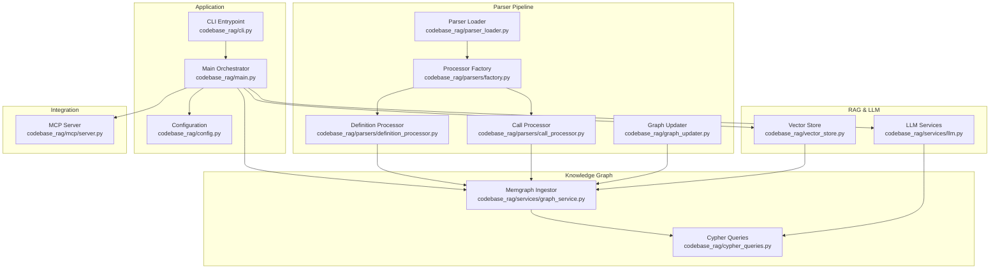
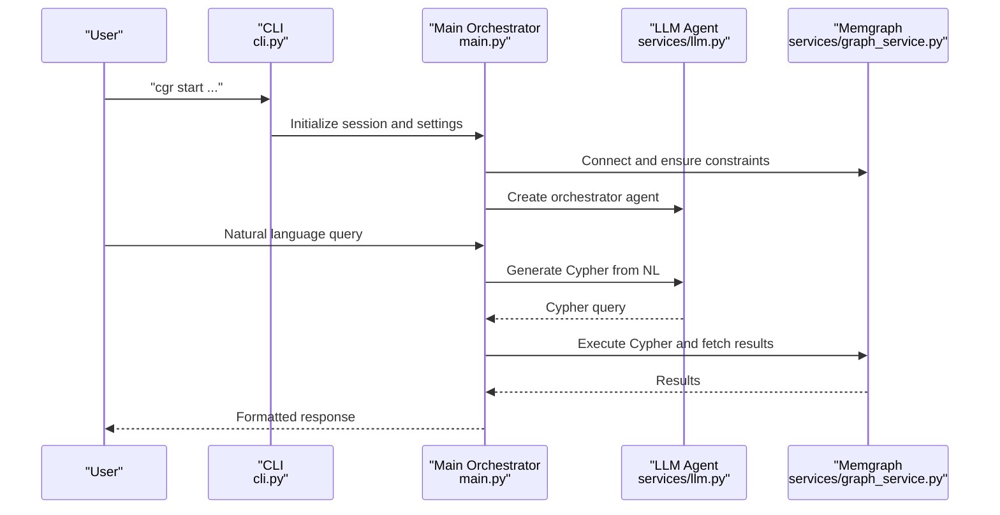
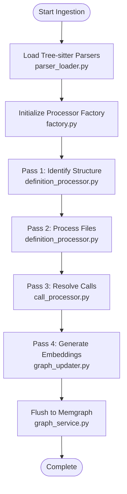
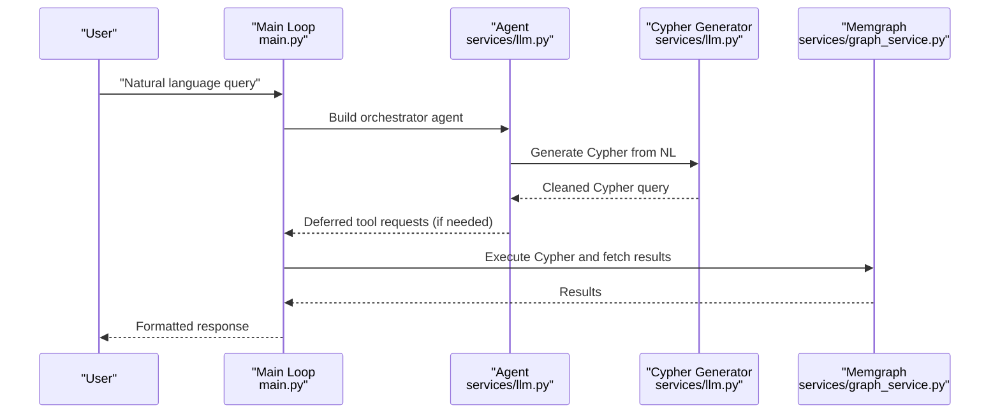
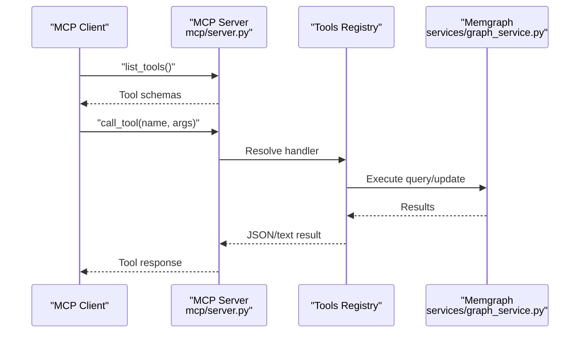
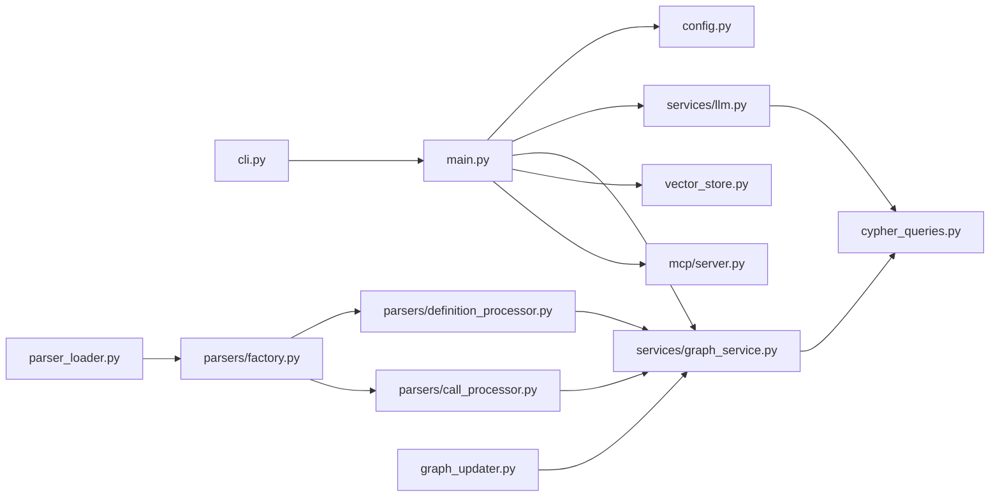

# Project Overview

<cite>
**Referenced Files in This Document**
- [README.md](file://README.md)
- [main.py](file://codebase_rag/main.py)
- [cli.py](file://codebase_rag/cli.py)
- [config.py](file://codebase_rag/config.py)
- [models.py](file://codebase_rag/models.py)
- [graph_service.py](file://codebase_rag/services/graph_service.py)
- [llm.py](file://codebase_rag/services/llm.py)
- [parser_loader.py](file://codebase_rag/parser_loader.py)
- [graph_updater.py](file://codebase_rag/graph_updater.py)
- [server.py](file://codebase_rag/mcp/server.py)
- [vector_store.py](file://codebase_rag/vector_store.py)
- [cypher_queries.py](file://codebase_rag/cypher_queries.py)
- [factory.py](file://codebase_rag/parsers/factory.py)
- [definition_processor.py](file://codebase_rag/parsers/definition_processor.py)
- [call_processor.py](file://codebase_rag/parsers/call_processor.py)
</cite>

## Table of Contents
1. [Introduction](#introduction)
2. [Project Structure](#project-structure)
3. [Core Components](#core-components)
4. [Architecture Overview](#architecture-overview)
5. [Detailed Component Analysis](#detailed-component-analysis)
6. [Dependency Analysis](#dependency-analysis)
7. [Performance Considerations](#performance-considerations)
8. [Troubleshooting Guide](#troubleshooting-guide)
9. [Conclusion](#conclusion)

## Introduction
Graph-Code is a graph-based Retrieval-Augmented Generation (RAG) system designed to analyze multi-language codebases, construct a comprehensive knowledge graph, and enable natural language querying and editing. It leverages Tree-sitter for robust AST parsing, stores the resulting graph in Memgraph, and integrates with AI models to translate natural language into Cypher queries. The system supports multiple programming languages and provides both an interactive CLI and an MCP server for integration with tools like Claude Code.

Key capabilities include:
- Multi-language support via Tree-sitter grammars
- Knowledge graph construction and storage in Memgraph
- Natural language querying powered by AI agents
- Semantic search using UniXcoder embeddings
- MCP server integration for external tooling
- Interactive editing and optimization workflows

Practical use cases:
- Query code structure: “Show me all classes that contain 'user' in their name”
- Find functions by purpose: “Find functions related to database operations”
- Edit code via natural language: “Add logging to all database connection functions”

## Project Structure
The repository is organized around a dual-component architecture:
- Multi-language parser and ingestion pipeline
- RAG system with CLI and MCP server

High-level structure:
- codebase_rag/: Core application code
  - parsers/: Tree-sitter-based language processors
  - services/: Graph ingestion, LLM orchestration, and utilities
  - tools/: Agent tools for querying, editing, and analysis
  - mcp/: MCP server implementation
  - cli.py, main.py: Entry points and orchestration
- Root-level configuration and documentation

**Diagram sources**
- [cli.py](file://codebase_rag/cli.py#L1-L395)
- [main.py](file://codebase_rag/main.py#L1-L1062)
- [config.py](file://codebase_rag/config.py#L1-L274)
- [parser_loader.py](file://codebase_rag/parser_loader.py#L1-L293)
- [factory.py](file://codebase_rag/parsers/factory.py#L1-L116)
- [definition_processor.py](file://codebase_rag/parsers/definition_processor.py#L1-L193)
- [call_processor.py](file://codebase_rag/parsers/call_processor.py#L1-L364)
- [graph_updater.py](file://codebase_rag/graph_updater.py#L1-L469)
- [graph_service.py](file://codebase_rag/services/graph_service.py#L1-L364)
- [cypher_queries.py](file://codebase_rag/cypher_queries.py#L1-L120)
- [llm.py](file://codebase_rag/services/llm.py#L1-L93)
- [vector_store.py](file://codebase_rag/vector_store.py#L1-L81)
- [server.py](file://codebase_rag/mcp/server.py#L1-L166)

**Section sources**
- [README.md](file://README.md#L72-L78)
- [cli.py](file://codebase_rag/cli.py#L1-L395)
- [main.py](file://codebase_rag/main.py#L1-L1062)

## Core Components
- Multi-language parser and ingestion:
  - Parser loader initializes Tree-sitter grammars and builds language-specific queries
  - Processor factory coordinates definition and call processors
  - Definition processor extracts modules, functions, classes, and imports
  - Call processor resolves function calls and builds CALLS relationships
  - Graph updater orchestrates passes and flushes data to Memgraph
- RAG system:
  - CLI entrypoint and interactive loop
  - LLM orchestration for natural language to Cypher generation
  - Vector store for semantic search embeddings
  - MCP server for external integrations

Key capabilities:
- Multi-language support across Python, JavaScript/TypeScript, Java, C++, Lua, Rust, and more
- Knowledge graph schema with unified labels and relationships
- Semantic search using UniXcoder embeddings
- MCP server for querying and editing code via Claude Code

**Section sources**
- [README.md](file://README.md#L39-L71)
- [parser_loader.py](file://codebase_rag/parser_loader.py#L1-L293)
- [factory.py](file://codebase_rag/parsers/factory.py#L1-L116)
- [definition_processor.py](file://codebase_rag/parsers/definition_processor.py#L1-L193)
- [call_processor.py](file://codebase_rag/parsers/call_processor.py#L1-L364)
- [graph_updater.py](file://codebase_rag/graph_updater.py#L1-L469)
- [graph_service.py](file://codebase_rag/services/graph_service.py#L1-L364)
- [llm.py](file://codebase_rag/services/llm.py#L1-L93)
- [vector_store.py](file://codebase_rag/vector_store.py#L1-L81)
- [server.py](file://codebase_rag/mcp/server.py#L1-L166)

## Architecture Overview
The system follows a dual-component design:
- Parser pipeline: Parses codebases using Tree-sitter, extracts structural elements, resolves imports and calls, and ingests data into Memgraph
- RAG pipeline: Provides an interactive CLI and MCP server for natural language querying, editing, and optimization

**Diagram sources**
- [cli.py](file://codebase_rag/cli.py#L55-L172)
- [main.py](file://codebase_rag/main.py#L681-L694)
- [llm.py](file://codebase_rag/services/llm.py#L78-L93)
- [graph_service.py](file://codebase_rag/services/graph_service.py#L104-L123)

## Detailed Component Analysis

### Multi-language Parser and Ingestion Pipeline
The parser pipeline transforms raw code into a structured knowledge graph:
- Parser loader loads Tree-sitter grammars and constructs language-specific queries
- Processor factory creates specialized processors for definitions, imports, and calls
- Definition processor parses files, extracts modules, functions, classes, and imports
- Call processor resolves function calls and establishes CALLS relationships
- Graph updater coordinates processing passes and flushes batches to Memgraph

**Diagram sources**
- [parser_loader.py](file://codebase_rag/parser_loader.py#L276-L292)
- [factory.py](file://codebase_rag/parsers/factory.py#L18-L116)
- [definition_processor.py](file://codebase_rag/parsers/definition_processor.py#L53-L143)
- [call_processor.py](file://codebase_rag/parsers/call_processor.py#L49-L74)
- [graph_updater.py](file://codebase_rag/graph_updater.py#L264-L286)
- [graph_service.py](file://codebase_rag/services/graph_service.py#L166-L187)

**Section sources**
- [parser_loader.py](file://codebase_rag/parser_loader.py#L1-L293)
- [factory.py](file://codebase_rag/parsers/factory.py#L1-L116)
- [definition_processor.py](file://codebase_rag/parsers/definition_processor.py#L1-L193)
- [call_processor.py](file://codebase_rag/parsers/call_processor.py#L1-L364)
- [graph_updater.py](file://codebase_rag/graph_updater.py#L1-L469)
- [graph_service.py](file://codebase_rag/services/graph_service.py#L1-L364)

### RAG System and Natural Language Processing
The RAG system translates natural language into Cypher queries and executes them against the knowledge graph:
- LLM orchestrator agent manages tool use and response synthesis
- Cypher generator converts NL to Cypher using provider-specific models
- Vector store supports semantic search for function discovery
- CLI provides an interactive chat loop with tool approvals

**Diagram sources**
- [main.py](file://codebase_rag/main.py#L387-L438)
- [llm.py](file://codebase_rag/services/llm.py#L37-L76)
- [graph_service.py](file://codebase_rag/services/graph_service.py#L329-L340)

**Section sources**
- [main.py](file://codebase_rag/main.py#L1-L1062)
- [llm.py](file://codebase_rag/services/llm.py#L1-L93)
- [vector_store.py](file://codebase_rag/vector_store.py#L1-L81)

### MCP Server Integration
The MCP server exposes tools for querying and editing code:
- Initializes Memgraph ingestor and Cypher generator
- Registers tools for indexing, querying, reading/writing files, and surgical replacements
- Runs over stdio for compatibility with Claude Code and other MCP clients

**Diagram sources**
- [server.py](file://codebase_rag/mcp/server.py#L58-L135)
- [graph_service.py](file://codebase_rag/services/graph_service.py#L341-L360)

**Section sources**
- [server.py](file://codebase_rag/mcp/server.py#L1-L166)
- [README.md](file://README.md#L509-L550)

## Dependency Analysis
The system exhibits clear separation of concerns:
- CLI depends on main orchestration and configuration
- Main orchestrator depends on LLM services, graph service, and vector store
- Parser pipeline depends on parser loader and processor factory
- MCP server depends on graph service and LLM services

**Diagram sources**
- [cli.py](file://codebase_rag/cli.py#L1-L395)
- [main.py](file://codebase_rag/main.py#L1-L1062)
- [config.py](file://codebase_rag/config.py#L1-L274)
- [parser_loader.py](file://codebase_rag/parser_loader.py#L1-L293)
- [factory.py](file://codebase_rag/parsers/factory.py#L1-L116)
- [definition_processor.py](file://codebase_rag/parsers/definition_processor.py#L1-L193)
- [call_processor.py](file://codebase_rag/parsers/call_processor.py#L1-L364)
- [graph_updater.py](file://codebase_rag/graph_updater.py#L1-L469)
- [graph_service.py](file://codebase_rag/services/graph_service.py#L1-L364)
- [llm.py](file://codebase_rag/services/llm.py#L1-L93)
- [vector_store.py](file://codebase_rag/vector_store.py#L1-L81)
- [cypher_queries.py](file://codebase_rag/cypher_queries.py#L1-L120)
- [server.py](file://codebase_rag/mcp/server.py#L1-L166)

**Section sources**
- [cli.py](file://codebase_rag/cli.py#L1-L395)
- [main.py](file://codebase_rag/main.py#L1-L1062)
- [parser_loader.py](file://codebase_rag/parser_loader.py#L1-L293)
- [graph_service.py](file://codebase_rag/services/graph_service.py#L1-L364)

## Performance Considerations
- Batched writes to Memgraph reduce network overhead and improve throughput
- AST caching and bounded caches minimize repeated parsing and memory pressure
- Semantic embeddings are generated in batches and stored in Qdrant for efficient retrieval
- Real-time updater recalculates relationships on file changes to maintain consistency

Recommendations:
- Tune batch sizes based on available memory and dataset scale
- Monitor cache eviction thresholds to balance speed and memory usage
- Use semantic search judiciously to avoid excessive embedding computations

[No sources needed since this section provides general guidance]

## Troubleshooting Guide
Common issues and resolutions:
- Model configuration errors: Verify provider, model, and endpoint settings in environment variables
- Memgraph connectivity: Ensure Docker Compose is running and ports are accessible
- Parser failures: Confirm Tree-sitter grammars are available and compiled
- MCP server path errors: Set TARGET_REPO_PATH or infer from environment variables

Operational tips:
- Use the CLI’s quiet mode to reduce noise during automated runs
- Export graph data for offline analysis and debugging
- Leverage interactive setup to adjust ignore/unignore patterns

**Section sources**
- [config.py](file://codebase_rag/config.py#L1-L274)
- [README.md](file://README.md#L80-L221)
- [cli.py](file://codebase_rag/cli.py#L1-L395)
- [main.py](file://codebase_rag/main.py#L1-L1062)

## Conclusion
Graph-Code delivers a robust, extensible solution for understanding and interacting with multi-language codebases. Its dual-component architecture—Tree-sitter-based parsing and AI-powered RAG—enables accurate knowledge graph construction and intuitive natural language workflows. With MCP server integration and semantic search, it supports both interactive exploration and automated optimization across diverse programming languages.

[No sources needed since this section summarizes without analyzing specific files]