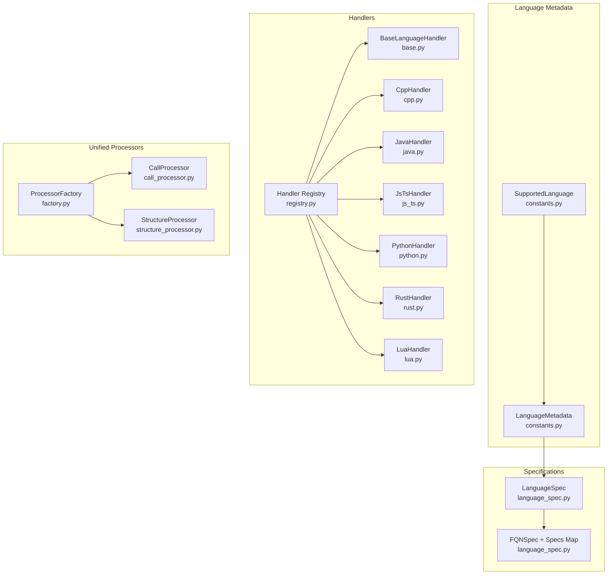
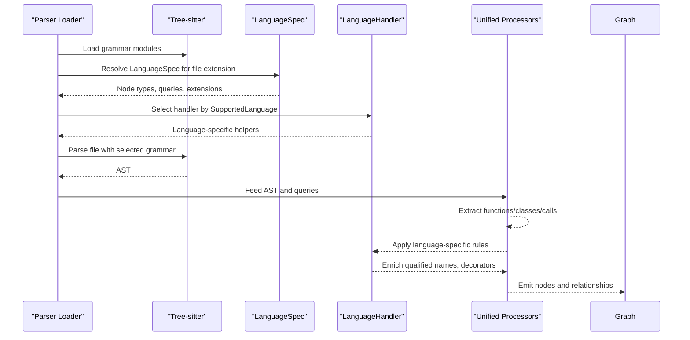
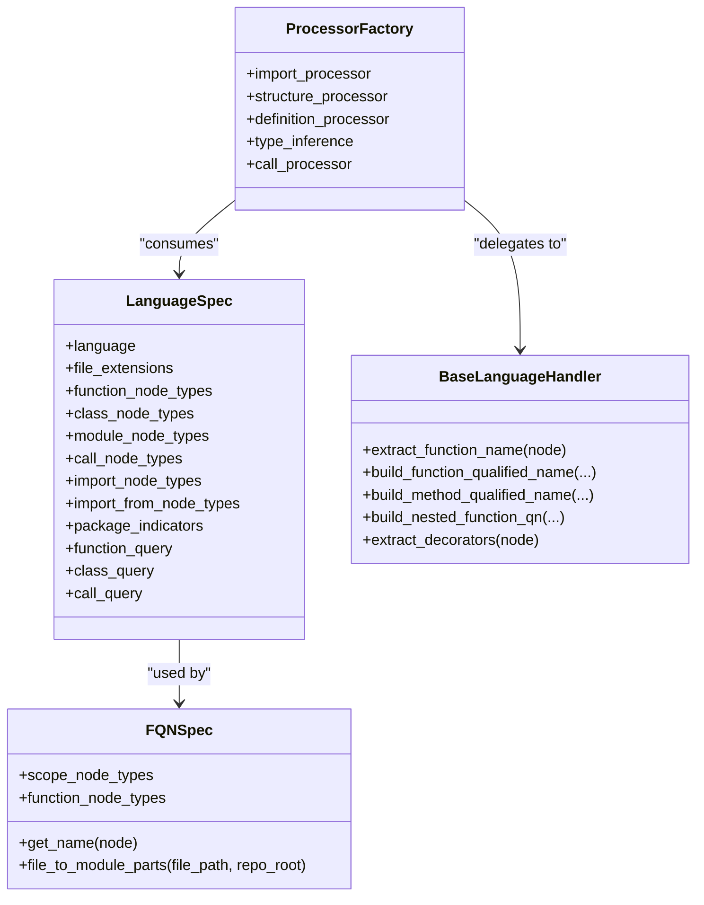
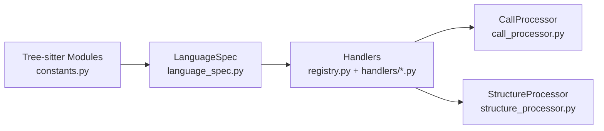
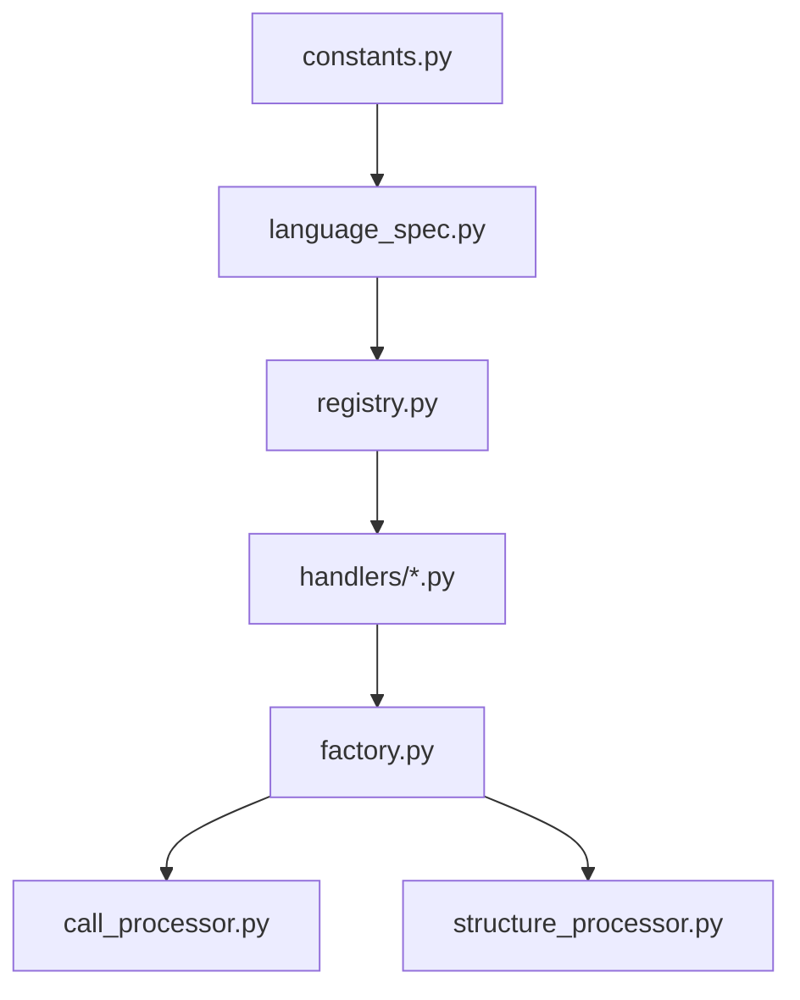

# Supported Languages Overview

<cite>
**Referenced Files in This Document**
- [constants.py](file://codebase_rag/constants.py)
- [language_spec.py](file://codebase_rag/language_spec.py)
- [registry.py](file://codebase_rag/parsers/handlers/registry.py)
- [base.py](file://codebase_rag/parsers/handlers/base.py)
- [protocol.py](file://codebase_rag/parsers/handlers/protocol.py)
- [cpp.py](file://codebase_rag/parsers/handlers/cpp.py)
- [java.py](file://codebase_rag/parsers/handlers/java.py)
- [js_ts.py](file://codebase_rag/parsers/handlers/js_ts.py)
- [python.py](file://codebase_rag/parsers/handlers/python.py)
- [rust.py](file://codebase_rag/parsers/handlers/rust.py)
- [lua.py](file://codebase_rag/parsers/handlers/lua.py)
- [factory.py](file://codebase_rag/parsers/factory.py)
- [call_processor.py](file://codebase_rag/parsers/call_processor.py)
- [structure_processor.py](file://codebase_rag/parsers/structure_processor.py)
</cite>

## Table of Contents
1. [Introduction](#introduction)
2. [Project Structure](#project-structure)
3. [Core Components](#core-components)
4. [Architecture Overview](#architecture-overview)
5. [Detailed Component Analysis](#detailed-component-analysis)
6. [Dependency Analysis](#dependency-analysis)
7. [Performance Considerations](#performance-considerations)
8. [Troubleshooting Guide](#troubleshooting-guide)
9. [Conclusion](#conclusion)

## Introduction
This document provides a comprehensive overview of Graph-Code’s multi-language parsing capabilities. It outlines the current status of all supported languages, distinguishes between Fully Supported and In Development categories, and explains how the language-agnostic design enables a unified graph schema across languages. It also covers Tree-sitter integration, the language handler architecture, and how new languages can be added to the system. Practical examples illustrate how parsed code structures are represented in the knowledge graph.

## Project Structure
Graph-Code organizes language support around a shared specification and a handler-per-language architecture:
- Language metadata and supported language enumeration define the ecosystem.
- Language-specific specs describe AST node types, file extensions, and queries.
- Handlers implement language-aware logic for qualified name construction, decorators, and special cases.
- Unified processors (call, structure, type inference) operate against the shared schema.

**Diagram sources**
- [constants.py](file://codebase_rag/constants.py#L426-L507)
- [language_spec.py](file://codebase_rag/language_spec.py#L190-L426)
- [registry.py](file://codebase_rag/parsers/handlers/registry.py#L15-L31)
- [base.py](file://codebase_rag/parsers/handlers/base.py#L15-L108)
- [factory.py](file://codebase_rag/parsers/factory.py#L18-L116)
- [call_processor.py](file://codebase_rag/parsers/call_processor.py#L20-L200)
- [structure_processor.py](file://codebase_rag/parsers/structure_processor.py#L12-L133)

**Section sources**
- [constants.py](file://codebase_rag/constants.py#L426-L507)
- [language_spec.py](file://codebase_rag/language_spec.py#L190-L426)
- [registry.py](file://codebase_rag/parsers/handlers/registry.py#L15-L31)
- [base.py](file://codebase_rag/parsers/handlers/base.py#L15-L108)
- [factory.py](file://codebase_rag/parsers/factory.py#L18-L116)
- [call_processor.py](file://codebase_rag/parsers/call_processor.py#L20-L200)
- [structure_processor.py](file://codebase_rag/parsers/structure_processor.py#L12-L133)

## Core Components
- Supported languages and statuses are defined centrally, enabling a single source of truth for language availability and features.
- LanguageSpec encapsulates per-language AST node types, file extensions, and Tree-sitter queries for functions, classes, calls, imports, and modules.
- FQNSpec defines how qualified names are extracted from AST nodes and mapped to module paths.
- The handler registry maps SupportedLanguage to concrete handlers, defaulting to a base handler when unspecified.
- BaseLanguageHandler provides default behaviors and shared helpers for building qualified names, detecting nested functions, and extracting identifiers.
- Unified processors (CallProcessor, StructureProcessor) operate independently of language specifics by relying on LanguageSpec and shared constants.

Key responsibilities:
- Language metadata and specs: [constants.py](file://codebase_rag/constants.py#L426-L507), [language_spec.py](file://codebase_rag/language_spec.py#L190-L426)
- Handler architecture: [registry.py](file://codebase_rag/parsers/handlers/registry.py#L15-L31), [base.py](file://codebase_rag/parsers/handlers/base.py#L15-L108)
- Unified processors: [factory.py](file://codebase_rag/parsers/factory.py#L18-L116), [call_processor.py](file://codebase_rag/parsers/call_processor.py#L20-L200), [structure_processor.py](file://codebase_rag/parsers/structure_processor.py#L12-L133)

**Section sources**
- [constants.py](file://codebase_rag/constants.py#L426-L507)
- [language_spec.py](file://codebase_rag/language_spec.py#L190-L426)
- [registry.py](file://codebase_rag/parsers/handlers/registry.py#L15-L31)
- [base.py](file://codebase_rag/parsers/handlers/base.py#L15-L108)
- [factory.py](file://codebase_rag/parsers/factory.py#L18-L116)
- [call_processor.py](file://codebase_rag/parsers/call_processor.py#L20-L200)
- [structure_processor.py](file://codebase_rag/parsers/structure_processor.py#L12-L133)

## Architecture Overview
The system integrates Tree-sitter grammars and a language handler pipeline to produce a unified knowledge graph:
- Tree-sitter grammars are loaded via module names defined in constants.
- LanguageSpec supplies AST node types and queries per language.
- Handlers enrich parsing with language-specific semantics (decorators, impl blocks, export checks).
- Unified processors traverse ASTs and emit graph nodes/edges using shared node labels and relationship types.

**Diagram sources**
- [constants.py](file://codebase_rag/constants.py#L724-L734)
- [language_spec.py](file://codebase_rag/language_spec.py#L205-L426)
- [registry.py](file://codebase_rag/parsers/handlers/registry.py#L15-L31)
- [base.py](file://codebase_rag/parsers/handlers/base.py#L15-L108)
- [call_processor.py](file://codebase_rag/parsers/call_processor.py#L20-L200)
- [structure_processor.py](file://codebase_rag/parsers/structure_processor.py#L12-L133)

## Detailed Component Analysis

### Supported Languages Status
- Fully Supported:
  - Python, JavaScript, TypeScript, C++, Lua, Rust, Java
- In Development:
  - Go, Scala, C#, PHP

Each language’s status and additional features are defined in the central metadata.

**Section sources**
- [constants.py](file://codebase_rag/constants.py#L451-L507)

### Language-Specific Parsing Capabilities

#### Python
- Recognized file extensions: see [constants.py](file://codebase_rag/constants.py#L91-L91)
- Parsing capabilities:
  - Functions, classes, modules, packages
  - Decorators extraction via handler
  - Nested functions and qualified name building
- Unique features:
  - Type inference, decorators, nested functions
- Representative spec: [language_spec.py](file://codebase_rag/language_spec.py#L206-L216), [python.py](file://codebase_rag/parsers/handlers/python.py#L13-L23)

**Section sources**
- [constants.py](file://codebase_rag/constants.py#L91-L91)
- [language_spec.py](file://codebase_rag/language_spec.py#L206-L216)
- [python.py](file://codebase_rag/parsers/handlers/python.py#L13-L23)

#### JavaScript / TypeScript
- Recognized file extensions: JS/JSX, TS/TSX
- Parsing capabilities:
  - Functions, classes, modules, imports/exports
  - Decorators extraction via handler
  - Arrow functions, method definitions, object literals
- Unique features:
  - ES6/CommonJS modules, prototype/object methods, arrow functions
- Representative spec: [language_spec.py](file://codebase_rag/language_spec.py#L217-L243), [js_ts.py](file://codebase_rag/parsers/handlers/js_ts.py#L14-L116)

**Section sources**
- [constants.py](file://codebase_rag/constants.py#L92-L93)
- [language_spec.py](file://codebase_rag/language_spec.py#L217-L243)
- [js_ts.py](file://codebase_rag/parsers/handlers/js_ts.py#L14-L116)

#### C++
- Recognized file extensions: multiple C++/header variants
- Parsing capabilities:
  - Functions, classes, modules, imports
- Unique features:
  - Constructors/destructors, operator overloading, templates, lambdas, C++20 modules, namespaces
- Representative spec: [language_spec.py](file://codebase_rag/language_spec.py#L344-L381), [cpp.py](file://codebase_rag/parsers/handlers/cpp.py#L19-L60)

**Section sources**
- [constants.py](file://codebase_rag/constants.py#L98-L109)
- [language_spec.py](file://codebase_rag/language_spec.py#L344-L381)
- [cpp.py](file://codebase_rag/parsers/handlers/cpp.py#L19-L60)

#### Lua
- Recognized file extensions: .lua
- Parsing capabilities:
  - Functions, classes, modules, imports
- Unique features:
  - Local/global functions, metatables, closures, coroutines
- Representative spec: [language_spec.py](file://codebase_rag/language_spec.py#L400-L408), [lua.py](file://codebase_rag/parsers/handlers/lua.py#L13-L26)

**Section sources**
- [constants.py](file://codebase_rag/constants.py#L112-L112)
- [language_spec.py](file://codebase_rag/language_spec.py#L400-L408)
- [lua.py](file://codebase_rag/parsers/handlers/lua.py#L13-L26)

#### Rust
- Recognized file extensions: .rs
- Parsing capabilities:
  - Functions, structs/enums/unions, traits/impls, modules, imports
- Unique features:
  - impl blocks, associated functions
- Representative spec: [language_spec.py](file://codebase_rag/language_spec.py#L244-L289), [rust.py](file://codebase_rag/parsers/handlers/rust.py#L19-L71)

**Section sources**
- [constants.py](file://codebase_rag/constants.py#L94-L94)
- [language_spec.py](file://codebase_rag/language_spec.py#L244-L289)
- [rust.py](file://codebase_rag/parsers/handlers/rust.py#L19-L71)

#### Java
- Recognized file extensions: .java
- Parsing capabilities:
  - Methods, classes/interfaces, enums, records, annotations
- Unique features:
  - Generics, annotations, modern features (records/sealed classes), concurrency, reflection
- Representative spec: [language_spec.py](file://codebase_rag/language_spec.py#L310-L343), [java.py](file://codebase_rag/parsers/handlers/java.py#L13-L29)

**Section sources**
- [constants.py](file://codebase_rag/constants.py#L97-L97)
- [language_spec.py](file://codebase_rag/language_spec.py#L310-L343)
- [java.py](file://codebase_rag/parsers/handlers/java.py#L13-L29)

#### Go (In Development)
- Recognized file extensions: .go
- Parsing capabilities:
  - Methods, type declarations
- Additional features:
  - Methods, type declarations
- Representative spec: [language_spec.py](file://codebase_rag/language_spec.py#L290-L299)

**Section sources**
- [constants.py](file://codebase_rag/constants.py#L95-L95)
- [language_spec.py](file://codebase_rag/language_spec.py#L290-L299)

#### Scala (In Development)
- Recognized file extensions: .scala, .sc
- Parsing capabilities:
  - Case classes, objects
- Additional features:
  - Case classes, objects
- Representative spec: [language_spec.py](file://codebase_rag/language_spec.py#L300-L309)

**Section sources**
- [constants.py](file://codebase_rag/constants.py#L96-L96)
- [language_spec.py](file://codebase_rag/language_spec.py#L300-L309)

#### C# (In Development)
- Recognized file extensions: .cs
- Parsing capabilities:
  - Classes, interfaces, generics (planned)
- Additional features:
  - Classes, interfaces, generics (planned)
- Representative spec: [language_spec.py](file://codebase_rag/language_spec.py#L382-L391)

**Section sources**
- [constants.py](file://codebase_rag/constants.py#L110-L110)
- [language_spec.py](file://codebase_rag/language_spec.py#L382-L391)

#### PHP (In Development)
- Recognized file extensions: .php
- Parsing capabilities:
  - Classes, functions, namespaces
- Additional features:
  - Classes, functions, namespaces
- Representative spec: [language_spec.py](file://codebase_rag/language_spec.py#L392-L399)

**Section sources**
- [constants.py](file://codebase_rag/constants.py#L111-L111)
- [language_spec.py](file://codebase_rag/language_spec.py#L392-L399)

### Language-Agnostic Design Philosophy
Graph-Code achieves a unified schema by:
- Using a shared set of node labels and relationship types across languages.
- Defining LanguageSpec per language to supply AST node types and Tree-sitter queries.
- Employing BaseLanguageHandler defaults and specialized handlers for language nuances.
- Applying unified processors that rely on LanguageSpec and shared constants.

**Diagram sources**
- [language_spec.py](file://codebase_rag/language_spec.py#L205-L426)
- [base.py](file://codebase_rag/parsers/handlers/base.py#L15-L108)
- [factory.py](file://codebase_rag/parsers/factory.py#L18-L116)

**Section sources**
- [language_spec.py](file://codebase_rag/language_spec.py#L205-L426)
- [base.py](file://codebase_rag/parsers/handlers/base.py#L15-L108)
- [factory.py](file://codebase_rag/parsers/factory.py#L18-L116)

### Tree-sitter Integration and Handler Architecture
- Tree-sitter grammar modules are enumerated centrally.
- LanguageSpec supplies queries and node types for functions, classes, calls, imports, and modules.
- Handlers implement language-specific logic (decorators, impl blocks, export checks, lambda naming) while delegating common tasks to the base handler.
- The registry maps SupportedLanguage to concrete handlers, ensuring extensibility.

**Diagram sources**
- [constants.py](file://codebase_rag/constants.py#L724-L734)
- [language_spec.py](file://codebase_rag/language_spec.py#L205-L426)
- [registry.py](file://codebase_rag/parsers/handlers/registry.py#L15-L31)
- [call_processor.py](file://codebase_rag/parsers/call_processor.py#L20-L200)
- [structure_processor.py](file://codebase_rag/parsers/structure_processor.py#L12-L133)

**Section sources**
- [constants.py](file://codebase_rag/constants.py#L724-L734)
- [language_spec.py](file://codebase_rag/language_spec.py#L205-L426)
- [registry.py](file://codebase_rag/parsers/handlers/registry.py#L15-L31)
- [call_processor.py](file://codebase_rag/parsers/call_processor.py#L20-L200)
- [structure_processor.py](file://codebase_rag/parsers/structure_processor.py#L12-L133)

### Adding a New Language
To add a new language:
1. Define grammar module name and Tree-sitter constants in constants.py.
2. Add SupportedLanguage value and LanguageMetadata entry.
3. Extend LanguageSpec with:
   - file_extensions
   - function/class/module/call/import node types
   - optional queries (function/class/call)
4. Optionally add an FQNSpec and extend the specs map.
5. Create a handler subclass under parsers/handlers/ and register it in the registry.
6. Verify unified processors work with the new spec.

Representative references:
- Grammar modules: [constants.py](file://codebase_rag/constants.py#L724-L734)
- SupportedLanguage and metadata: [constants.py](file://codebase_rag/constants.py#L426-L507)
- LanguageSpec entries: [language_spec.py](file://codebase_rag/language_spec.py#L205-L426)
- Handler registry: [registry.py](file://codebase_rag/parsers/handlers/registry.py#L15-L31)
- Base handler interface: [protocol.py](file://codebase_rag/parsers/handlers/protocol.py#L12-L56)

**Section sources**
- [constants.py](file://codebase_rag/constants.py#L724-L734)
- [constants.py](file://codebase_rag/constants.py#L426-L507)
- [language_spec.py](file://codebase_rag/language_spec.py#L205-L426)
- [registry.py](file://codebase_rag/parsers/handlers/registry.py#L15-L31)
- [protocol.py](file://codebase_rag/parsers/handlers/protocol.py#L12-L56)

### Practical Examples: Parsed Structures in the Knowledge Graph
- Functions and methods are emitted with qualified names derived from module paths and language-specific rules.
- Calls are resolved using CallProcessor and CallResolver, leveraging language-specific queries and type inference.
- Packages are detected using package indicators from LanguageSpec and represented as Package nodes with CONTAINS_PACKAGE relationships.

Representative references:
- Call processing and method resolution: [call_processor.py](file://codebase_rag/parsers/call_processor.py#L20-L200)
- Structure identification and package detection: [structure_processor.py](file://codebase_rag/parsers/structure_processor.py#L12-L133)
- Shared node/relationship types: [constants.py](file://codebase_rag/constants.py#L317-L377)

**Section sources**
- [call_processor.py](file://codebase_rag/parsers/call_processor.py#L20-L200)
- [structure_processor.py](file://codebase_rag/parsers/structure_processor.py#L12-L133)
- [constants.py](file://codebase_rag/constants.py#L317-L377)

## Dependency Analysis
The language support stack exhibits low coupling and high cohesion:
- Constants define shared enumerations and grammar modules.
- LanguageSpec isolates language differences from processors.
- Handlers encapsulate language-specific behaviors.
- Unified processors depend on LanguageSpec and shared protocols.

**Diagram sources**
- [constants.py](file://codebase_rag/constants.py#L426-L507)
- [language_spec.py](file://codebase_rag/language_spec.py#L205-L426)
- [registry.py](file://codebase_rag/parsers/handlers/registry.py#L15-L31)
- [factory.py](file://codebase_rag/parsers/factory.py#L18-L116)
- [call_processor.py](file://codebase_rag/parsers/call_processor.py#L20-L200)
- [structure_processor.py](file://codebase_rag/parsers/structure_processor.py#L12-L133)

**Section sources**
- [constants.py](file://codebase_rag/constants.py#L426-L507)
- [language_spec.py](file://codebase_rag/language_spec.py#L205-L426)
- [registry.py](file://codebase_rag/parsers/handlers/registry.py#L15-L31)
- [factory.py](file://codebase_rag/parsers/factory.py#L18-L116)
- [call_processor.py](file://codebase_rag/parsers/call_processor.py#L20-L200)
- [structure_processor.py](file://codebase_rag/parsers/structure_processor.py#L12-L133)

## Performance Considerations
- Handler specialization avoids expensive fallbacks; defaults are fast and generic.
- Queries are precompiled per language and reused across files.
- AST traversal is optimized by focusing on relevant node types defined in LanguageSpec.
- Unified processors batch node and relationship creation to minimize overhead.

[No sources needed since this section provides general guidance]

## Troubleshooting Guide
Common issues and resolutions:
- Unknown language or missing handler: Verify SupportedLanguage and handler registration.
- Incorrect qualified names: Confirm FQNSpec and handler overrides for the language.
- Missing calls/methods: Ensure LanguageSpec queries are present and match AST node types.
- Package detection failures: Confirm package indicators in LanguageSpec and presence of indicator files.

Representative references:
- Handler registry and defaults: [registry.py](file://codebase_rag/parsers/handlers/registry.py#L15-L31)
- Base handler defaults: [base.py](file://codebase_rag/parsers/handlers/base.py#L15-L108)
- LanguageSpec queries and node types: [language_spec.py](file://codebase_rag/language_spec.py#L205-L426)
- Call processing logic: [call_processor.py](file://codebase_rag/parsers/call_processor.py#L20-L200)
- Structure/package detection: [structure_processor.py](file://codebase_rag/parsers/structure_processor.py#L12-L133)

**Section sources**
- [registry.py](file://codebase_rag/parsers/handlers/registry.py#L15-L31)
- [base.py](file://codebase_rag/parsers/handlers/base.py#L15-L108)
- [language_spec.py](file://codebase_rag/language_spec.py#L205-L426)
- [call_processor.py](file://codebase_rag/parsers/call_processor.py#L20-L200)
- [structure_processor.py](file://codebase_rag/parsers/structure_processor.py#L12-L133)

## Conclusion
Graph-Code’s multi-language parsing leverages a robust, language-agnostic design powered by LanguageSpec and a flexible handler architecture. Fully supported languages (Python, JavaScript/TypeScript, C++, Lua, Rust, Java) provide comprehensive parsing capabilities with language-specific enhancements. In Development languages (Go, Scala, C#, PHP) are positioned for future expansion. The unified schema, Tree-sitter integration, and modular processors enable scalable and maintainable cross-language knowledge graphs.