# System Components and Technologies

<cite>
**Referenced Files in This Document**
- [pyproject.toml](file://pyproject.toml)
- [main.py](file://codebase_rag/main.py)
- [cli.py](file://codebase_rag/cli.py)
- [config.py](file://codebase_rag/config.py)
- [graph_service.py](file://codebase_rag/services/graph_service.py)
- [server.py](file://codebase_rag/mcp/server.py)
- [parser_loader.py](file://codebase_rag/parser_loader.py)
- [llm.py](file://codebase_rag/services/llm.py)
- [constants.py](file://codebase_rag/constants.py)
- [tools.py](file://codebase_rag/mcp/tools.py)
- [codebase_query.py](file://codebase_rag/tools/codebase_query.py)
- [code_retrieval.py](file://codebase_rag/tools/code_retrieval.py)
- [types_defs.py](file://codebase_rag/types_defs.py)
- [base.py](file://codebase_rag/providers/base.py)
- [models.py](file://codebase_rag/models.py)
</cite>

## Table of Contents
1. [Introduction](#introduction)
2. [Project Structure](#project-structure)
3. [Core Components](#core-components)
4. [Architecture Overview](#architecture-overview)
5. [Detailed Component Analysis](#detailed-component-analysis)
6. [Dependency Analysis](#dependency-analysis)
7. [Performance Considerations](#performance-considerations)
8. [Troubleshooting Guide](#troubleshooting-guide)
9. [Conclusion](#conclusion)

## Introduction
This document explains the technical foundation and core technologies powering Graph-Code, focusing on how the system integrates Tree-sitter for high-performance AST parsing, Memgraph for knowledge graph storage and retrieval, pydantic-ai for agent framework and tool orchestration, MCP (Model Context Protocol) for Claude Code integration, rich for terminal UI components, and typer for CLI framework. It also covers the dual-component architecture with the multi-language parser and RAG system, the agent framework's tool registry, and the modular design enabling extensibility. The document provides dependency management guidance, version requirements, and integration points with external systems.

## Project Structure
Graph-Code organizes functionality into cohesive modules:
- CLI entrypoints and commands powered by Typer
- Agent orchestration and tooling via pydantic-ai
- Multi-language AST parsing with Tree-sitter
- Knowledge graph ingestion and querying with Memgraph
- MCP server for Claude Code integration
- Rich-based terminal UI components
- Configuration and provider abstractions

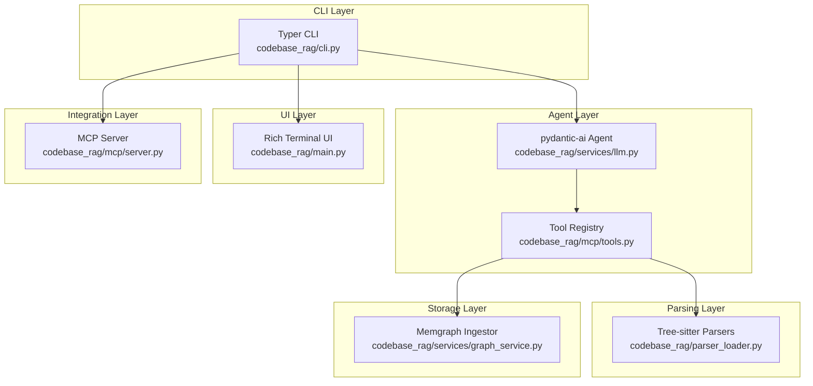

**Diagram sources**
- [cli.py](file://codebase_rag/cli.py#L1-L395)
- [llm.py](file://codebase_rag/services/llm.py#L1-L93)
- [tools.py](file://codebase_rag/mcp/tools.py#L1-L458)
- [parser_loader.py](file://codebase_rag/parser_loader.py#L1-L293)
- [graph_service.py](file://codebase_rag/services/graph_service.py#L1-L364)
- [main.py](file://codebase_rag/main.py#L1-L1062)
- [server.py](file://codebase_rag/mcp/server.py#L1-L166)

**Section sources**
- [cli.py](file://codebase_rag/cli.py#L1-L395)
- [main.py](file://codebase_rag/main.py#L1-L1062)
- [constants.py](file://codebase_rag/constants.py#L1-L800)

## Core Components
This section outlines the key technologies and their roles:

- Tree-sitter: High-performance language-specific AST parsing for multi-language codebases. It powers the dual-component architecture by extracting structured information (functions, classes, calls, imports) from source files for downstream ingestion and querying.
- Memgraph: Graph database for storing and retrieving the codebase knowledge graph. It supports batched ingestion, constraint enforcement, and Cypher-based queries for RAG and tooling.
- pydantic-ai: Agent framework providing LLM orchestration, tool registration, and deferred tool execution with approvals. It enables conversational interactions and safe automation.
- MCP (Model Context Protocol): Protocol for integrating with Claude Code, exposing a registry of tools callable from external editors. It bridges Graph-Code capabilities to editor environments.
- rich: Terminal UI library for rendering tables, panels, and formatted output in the interactive CLI.
- typer: CLI framework for building robust command-line interfaces with automatic help, validation, and subcommands.

**Section sources**
- [parser_loader.py](file://codebase_rag/parser_loader.py#L1-L293)
- [graph_service.py](file://codebase_rag/services/graph_service.py#L1-L364)
- [llm.py](file://codebase_rag/services/llm.py#L1-L93)
- [server.py](file://codebase_rag/mcp/server.py#L1-L166)
- [main.py](file://codebase_rag/main.py#L1-L1062)
- [cli.py](file://codebase_rag/cli.py#L1-L395)

## Architecture Overview
The system follows a dual-component architecture:
- Multi-language parser: Uses Tree-sitter to parse code into structured ASTs, generating language-specific queries and patterns for ingestion.
- RAG system: Leverages pydantic-ai agents to translate natural language queries into Cypher, query Memgraph, and present results with rich UI components.

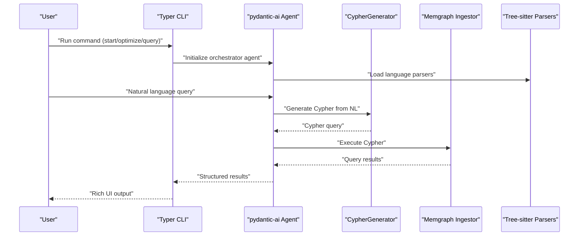

**Diagram sources**
- [cli.py](file://codebase_rag/cli.py#L1-L395)
- [llm.py](file://codebase_rag/services/llm.py#L1-L93)
- [parser_loader.py](file://codebase_rag/parser_loader.py#L1-L293)
- [graph_service.py](file://codebase_rag/services/graph_service.py#L1-L364)
- [main.py](file://codebase_rag/main.py#L1-L1062)

## Detailed Component Analysis

### Tree-sitter Integration
Tree-sitter provides high-performance, language-specific AST parsing. The parser loader dynamically imports language modules, builds parsers, and creates language-specific queries for functions, classes, calls, imports, and locals. It supports a wide range of languages and integrates with the ingestion pipeline.

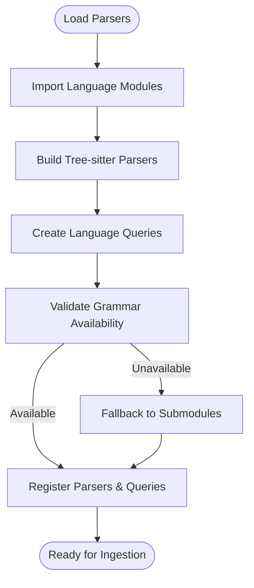

**Diagram sources**
- [parser_loader.py](file://codebase_rag/parser_loader.py#L1-L293)
- [constants.py](file://codebase_rag/constants.py#L426-L507)

**Section sources**
- [parser_loader.py](file://codebase_rag/parser_loader.py#L1-L293)
- [constants.py](file://codebase_rag/constants.py#L712-L777)

### Memgraph Knowledge Graph Storage
Memgraph handles ingestion, constraints, and querying. The ingestor manages batching, connection lifecycle, and Cypher execution. It supports exporting the graph to JSON for inspection and analysis.

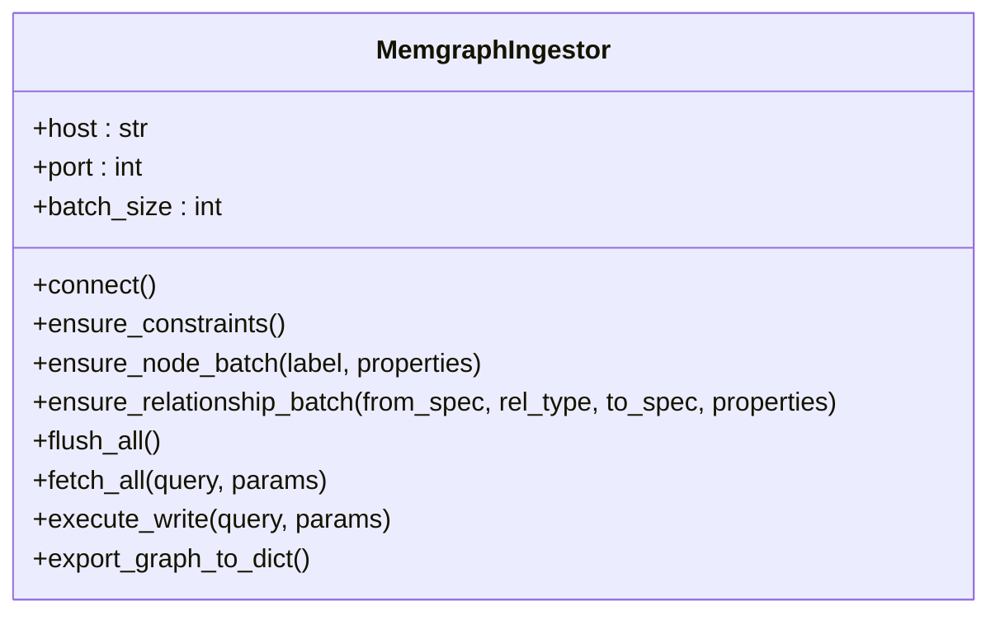

**Diagram sources**
- [graph_service.py](file://codebase_rag/services/graph_service.py#L49-L364)

**Section sources**
- [graph_service.py](file://codebase_rag/services/graph_service.py#L1-L364)
- [main.py](file://codebase_rag/main.py#L737-L766)

### pydantic-ai Agent Framework and Tool Orchestration
pydantic-ai provides the agent framework with:
- Orchestrator agent: Translates natural language into actions and tool calls
- Cypher generator: Converts NL into Cypher queries
- Tool registry: Centralized tool definitions and schemas
- Deferred tool execution: Approval-based execution for safety

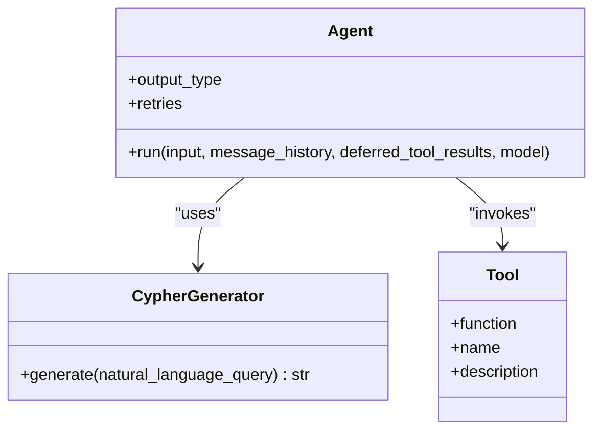

**Diagram sources**
- [llm.py](file://codebase_rag/services/llm.py#L37-L93)
- [types_defs.py](file://codebase_rag/types_defs.py#L89-L95)

**Section sources**
- [llm.py](file://codebase_rag/services/llm.py#L1-L93)
- [types_defs.py](file://codebase_rag/types_defs.py#L89-L95)

### MCP (Claude Code) Integration
The MCP server exposes a registry of tools callable from Claude Code, including:
- Graph operations: list projects, delete project, wipe database, index repository
- Code operations: query graph, get code snippet, surgical replace, read/write files, list directory
- Schema-driven tool definitions with JSON return policies

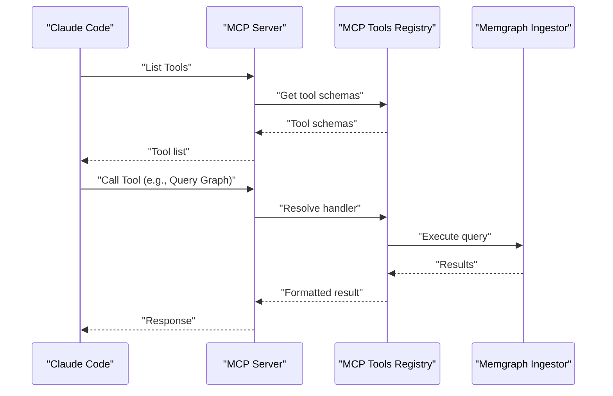

**Diagram sources**
- [server.py](file://codebase_rag/mcp/server.py#L58-L135)
- [tools.py](file://codebase_rag/mcp/tools.py#L40-L458)

**Section sources**
- [server.py](file://codebase_rag/mcp/server.py#L1-L166)
- [tools.py](file://codebase_rag/mcp/tools.py#L1-L458)

### Rich Terminal UI Components
Rich renders tables, panels, and formatted output for query results and interactive sessions. The main module coordinates UI flows, approvals, and session logging.

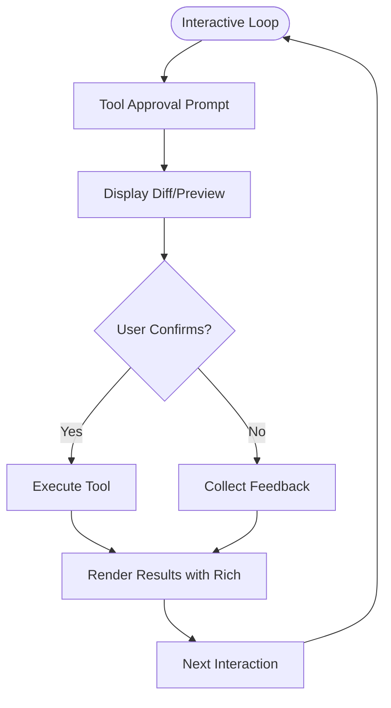

**Diagram sources**
- [main.py](file://codebase_rag/main.py#L218-L248)
- [main.py](file://codebase_rag/main.py#L387-L438)

**Section sources**
- [main.py](file://codebase_rag/main.py#L1-L1062)

### Typer CLI Framework
Typer defines commands for starting sessions, updating graphs, exporting data, optimizing code, running the MCP server, and graph loading. It provides validation, help text, and structured argument handling.

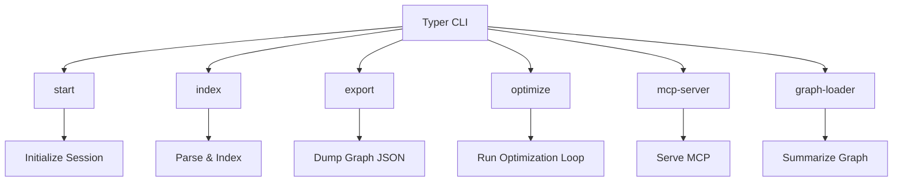

**Diagram sources**
- [cli.py](file://codebase_rag/cli.py#L55-L391)

**Section sources**
- [cli.py](file://codebase_rag/cli.py#L1-L395)

### Dual-Component Architecture: Parser + RAG
- Parser component: Tree-sitter-based AST parsing and language-specific query generation
- RAG component: pydantic-ai agents translating NL to Cypher, querying Memgraph, and presenting results

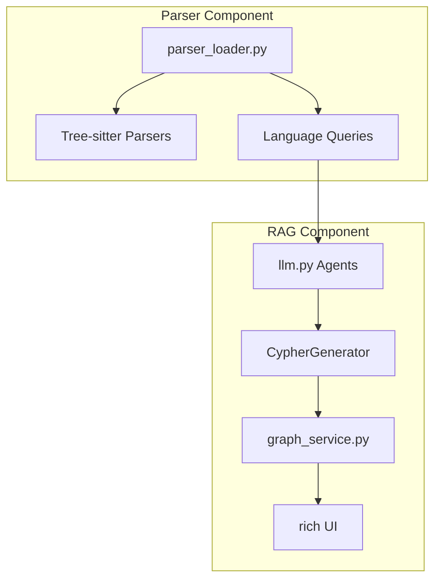

**Diagram sources**
- [parser_loader.py](file://codebase_rag/parser_loader.py#L276-L293)
- [llm.py](file://codebase_rag/services/llm.py#L78-L93)
- [graph_service.py](file://codebase_rag/services/graph_service.py#L341-L364)
- [main.py](file://codebase_rag/main.py#L426-L436)

**Section sources**
- [parser_loader.py](file://codebase_rag/parser_loader.py#L1-L293)
- [llm.py](file://codebase_rag/services/llm.py#L1-L93)
- [graph_service.py](file://codebase_rag/services/graph_service.py#L1-L364)
- [main.py](file://codebase_rag/main.py#L1-L1062)

### Modular Design and Tool Registry
The MCP tools registry demonstrates modularity:
- Centralized tool definitions with input schemas
- Handler resolution and JSON return policies
- Extensible tool addition through the registry

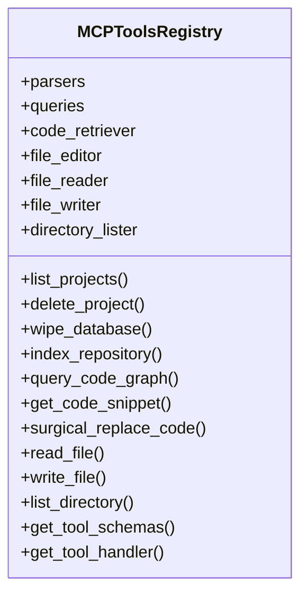

**Diagram sources**
- [tools.py](file://codebase_rag/mcp/tools.py#L40-L458)

**Section sources**
- [tools.py](file://codebase_rag/mcp/tools.py#L1-L458)
- [types_defs.py](file://codebase_rag/types_defs.py#L361-L421)

## Dependency Analysis
The project uses a modern Python stack with explicit version requirements and optional extras:

- Core runtime dependencies include Tree-sitter, pydantic-ai, MCP, Memgraph client, rich, typer, and loguru
- Optional dependencies enable full language support and semantic search
- Provider abstraction supports multiple LLM providers (OpenAI, Google, Ollama)

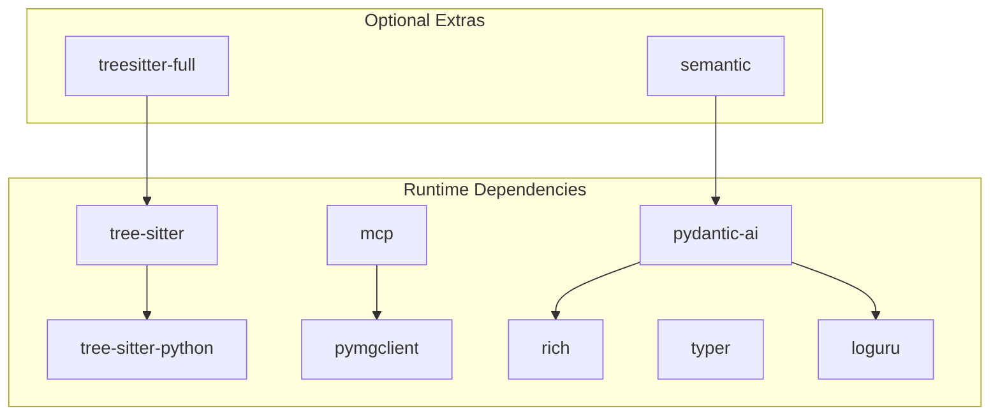

**Diagram sources**
- [pyproject.toml](file://pyproject.toml#L7-L25)
- [pyproject.toml](file://pyproject.toml#L45-L61)

**Section sources**
- [pyproject.toml](file://pyproject.toml#L1-L126)
- [base.py](file://codebase_rag/providers/base.py#L158-L162)

### Version Requirements and Compatibility
- Python version requirement: >=3.12
- Tree-sitter core and language bindings pinned for stability
- pydantic-ai and MCP versions specified for compatibility
- Rich and Typer versions selected for UI and CLI features

**Section sources**
- [pyproject.toml](file://pyproject.toml#L6-L18)
- [constants.py](file://codebase_rag/constants.py#L123-L141)

### Integration Points with External Systems
- LLM providers: OpenAI, Google, Ollama via pydantic-ai provider abstraction
- Memgraph: Connection, constraints, batched writes, and exports
- Claude Code: MCP server exposing tool schemas and handlers
- Filesystem: Read, write, and directory operations for code editing

**Section sources**
- [base.py](file://codebase_rag/providers/base.py#L1-L209)
- [graph_service.py](file://codebase_rag/services/graph_service.py#L1-L364)
- [server.py](file://codebase_rag/mcp/server.py#L1-L166)
- [tools.py](file://codebase_rag/mcp/tools.py#L1-L458)

## Performance Considerations
- Batched ingestion: Memgraph ingestor batches node and relationship writes to reduce overhead
- Parser caching: Tree-sitter parsers are initialized once per language and reused
- Asynchronous tool execution: MCP tools and agents leverage async patterns for responsiveness
- UI rendering: Rich components minimize unnecessary redraws and format output efficiently

[No sources needed since this section provides general guidance]

## Troubleshooting Guide
Common issues and resolutions:
- LLM provider misconfiguration: Verify API keys and endpoints; use provider validation helpers
- Memgraph connectivity: Ensure database is reachable and constraints are applied
- Tree-sitter grammar availability: Confirm language bindings are installed or built from submodules
- MCP server startup: Validate target repository path and environment variables
- Tool execution errors: Inspect tool schemas and handler return policies; check JSON serialization

**Section sources**
- [base.py](file://codebase_rag/providers/base.py#L63-L67)
- [base.py](file://codebase_rag/providers/base.py#L143-L147)
- [graph_service.py](file://codebase_rag/services/graph_service.py#L180-L187)
- [parser_loader.py](file://codebase_rag/parser_loader.py#L17-L82)
- [server.py](file://codebase_rag/mcp/server.py#L30-L55)
- [tools.py](file://codebase_rag/mcp/tools.py#L433-L446)

## Conclusion
Graph-Code combines high-performance AST parsing with a robust knowledge graph and agent-driven RAG system. The modular architecture, centered on pydantic-ai, Tree-sitter, and Memgraph, enables extensibility and safe tool orchestration. The MCP integration extends capabilities to external editors, while Typer and Rich deliver a powerful CLI and terminal UX. The explicit dependency management and provider abstraction ensure compatibility and maintainability across diverse environments.