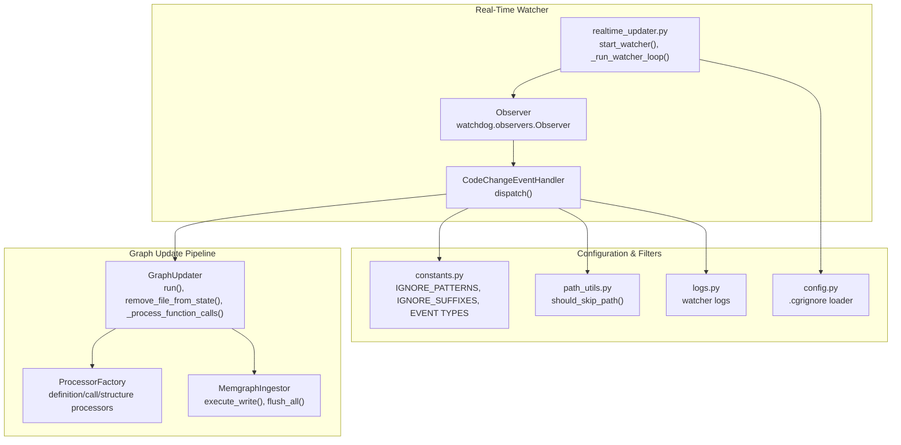
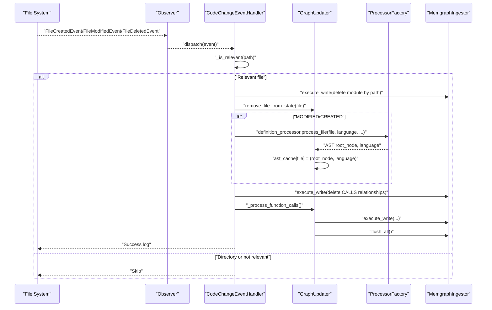
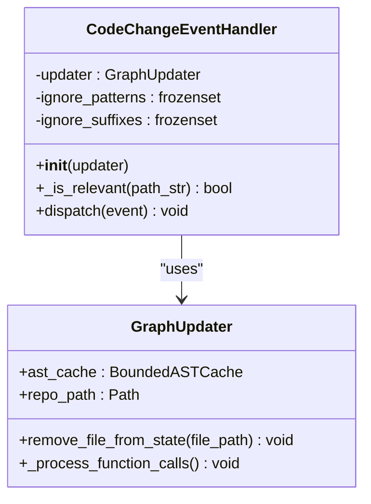
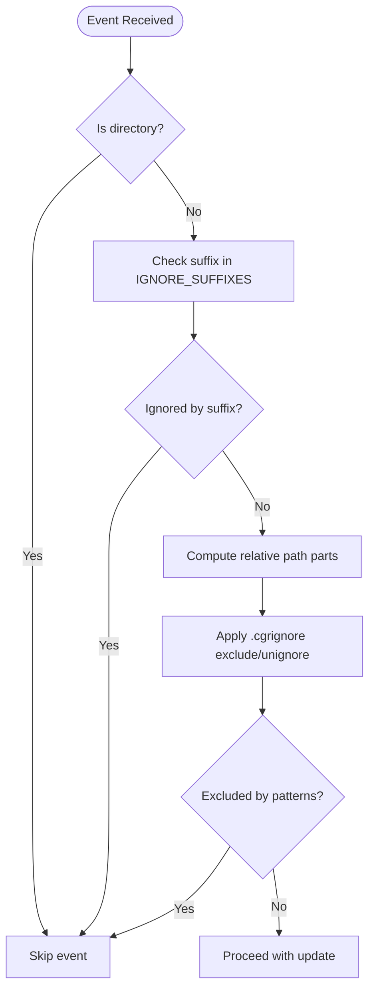
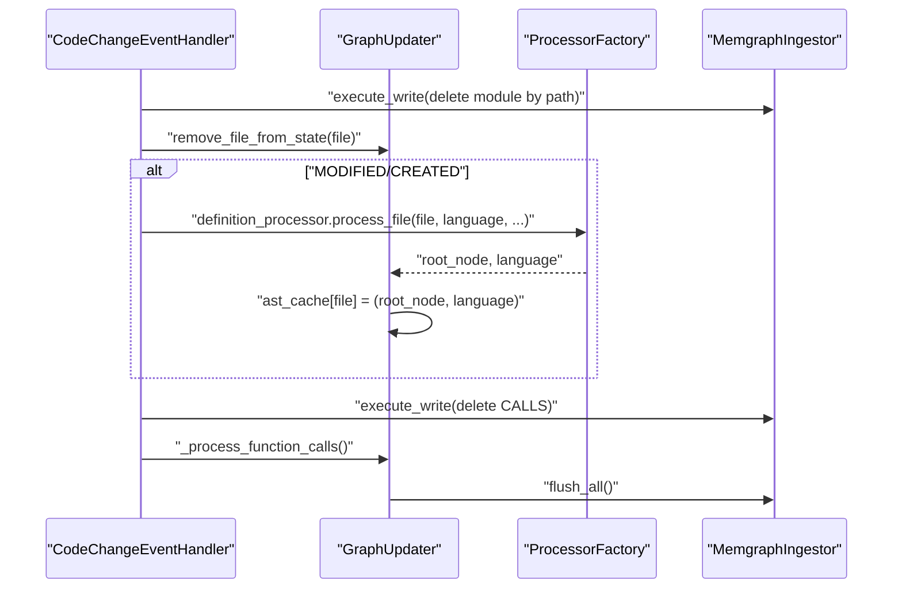
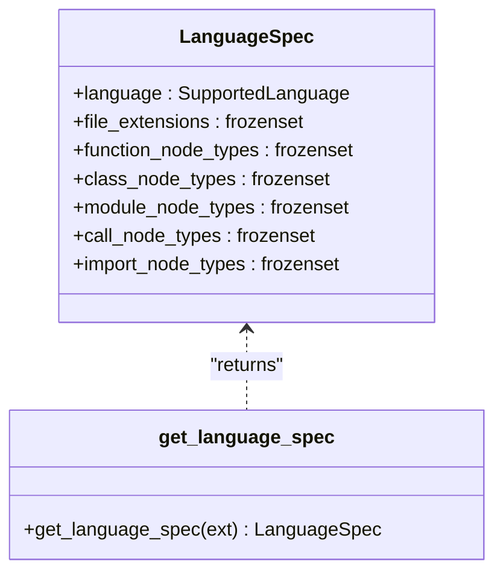
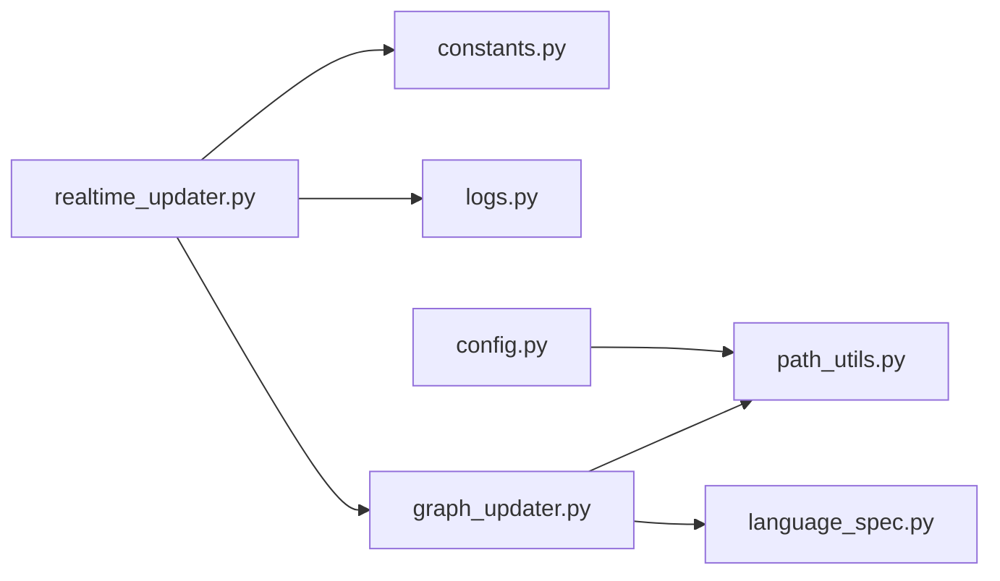

# File System Monitoring

<cite>
**Referenced Files in This Document**
- [realtime_updater.py](file://realtime_updater.py)
- [constants.py](file://codebase_rag/constants.py)
- [config.py](file://codebase_rag/config.py)
- [logs.py](file://codebase_rag/logs.py)
- [path_utils.py](file://codebase_rag/utils/path_utils.py)
- [language_spec.py](file://codebase_rag/language_spec.py)
- [graph_updater.py](file://codebase_rag/graph_updater.py)
- [test_realtime_updater.py](file://codebase_rag/tests/test_realtime_updater.py)
</cite>

## Table of Contents
1. [Introduction](#introduction)
2. [Project Structure](#project-structure)
3. [Core Components](#core-components)
4. [Architecture Overview](#architecture-overview)
5. [Detailed Component Analysis](#detailed-component-analysis)
6. [Dependency Analysis](#dependency-analysis)
7. [Performance Considerations](#performance-considerations)
8. [Troubleshooting Guide](#troubleshooting-guide)
9. [Conclusion](#conclusion)
10. [Appendices](#appendices)

## Introduction
This document explains the file system monitoring component of the real-time update system. It covers how the Watchdog library integrates with the application to monitor file system events, how the CodeChangeEventHandler processes those events, how filtering works to ignore irrelevant files and directories, and how the system triggers graph updates. It also documents configuration options for watch patterns, performance tuning, and practical examples for different project structures and file types.

## Project Structure
The file system monitoring lives primarily in a single module that orchestrates Watchdog observers, delegates event handling to a dedicated handler, and coordinates graph updates via the GraphUpdater pipeline.

**Diagram sources**
- [realtime_updater.py](file://realtime_updater.py#L114-L149)
- [constants.py](file://codebase_rag/constants.py#L780-L828)
- [path_utils.py](file://codebase_rag/utils/path_utils.py#L6-L27)
- [config.py](file://codebase_rag/config.py#L242-L274)
- [logs.py](file://codebase_rag/logs.py#L98-L108)
- [graph_updater.py](file://codebase_rag/graph_updater.py#L223-L284)

**Section sources**
- [realtime_updater.py](file://realtime_updater.py#L1-L184)
- [constants.py](file://codebase_rag/constants.py#L780-L828)
- [path_utils.py](file://codebase_rag/utils/path_utils.py#L1-L28)
- [config.py](file://codebase_rag/config.py#L242-L274)
- [logs.py](file://codebase_rag/logs.py#L98-L108)
- [graph_updater.py](file://codebase_rag/graph_updater.py#L223-L284)

## Core Components
- Watchdog integration: The watcher starts an Observer that recursively watches the repository root and dispatches file system events to a custom handler.
- CodeChangeEventHandler: Processes events, applies filtering, and triggers graph updates by removing stale data, reparsing affected files, recalculating function calls, and flushing changes.
- Filtering: Two-layer filtering ignores files by suffix and by directory patterns; additional .cgrignore patterns can be loaded to refine exclusions and inclusions.
- GraphUpdater pipeline: Coordinates structure identification, file processing, call resolution, and semantic embedding generation, with batching and caching for performance.

**Section sources**
- [realtime_updater.py](file://realtime_updater.py#L34-L112)
- [constants.py](file://codebase_rag/constants.py#L780-L828)
- [config.py](file://codebase_rag/config.py#L242-L274)
- [graph_updater.py](file://codebase_rag/graph_updater.py#L223-L284)

## Architecture Overview
The real-time watcher follows a deterministic flow for each file system event:

**Diagram sources**
- [realtime_updater.py](file://realtime_updater.py#L47-L111)
- [graph_updater.py](file://codebase_rag/graph_updater.py#L287-L354)
- [constants.py](file://codebase_rag/constants.py#L834-L840)

**Section sources**
- [realtime_updater.py](file://realtime_updater.py#L47-L111)
- [graph_updater.py](file://codebase_rag/graph_updater.py#L287-L354)

## Detailed Component Analysis

### CodeChangeEventHandler
Responsibilities:
- Initialize with a GraphUpdater and load ignore lists from constants.
- Filter events using suffix and directory pattern checks.
- For relevant files:
  - Delete prior graph data for the file’s path.
  - Remove in-memory state for the file.
  - Reparse modified/created files if a language parser is available.
  - Recalculate function call relationships across the entire codebase.
  - Flush all pending writes to the database.

Key methods and logic:
- Constructor initializes ignore lists and logs activation.
- _is_relevant(path_str) checks suffixes and directory parts against ignore lists.
- dispatch(event) implements the update steps and logs progress.

**Diagram sources**
- [realtime_updater.py](file://realtime_updater.py#L34-L112)
- [graph_updater.py](file://codebase_rag/graph_updater.py#L223-L354)

**Section sources**
- [realtime_updater.py](file://realtime_updater.py#L34-L112)

### Filtering Logic: Ignore Patterns and Suffixes
Two primary filters are applied:
- Suffix filtering: Files whose suffix appears in IGNORE_SUFFIXES are ignored.
- Directory pattern filtering: Paths containing any segment from IGNORE_PATTERNS are ignored unless explicitly unignored.

Additional refinement:
- .cgrignore files define exclude and unignore patterns that can override defaults for specific repositories.

**Diagram sources**
- [realtime_updater.py](file://realtime_updater.py#L41-L45)
- [constants.py](file://codebase_rag/constants.py#L780-L828)
- [path_utils.py](file://codebase_rag/utils/path_utils.py#L6-L27)
- [config.py](file://codebase_rag/config.py#L242-L274)

**Section sources**
- [realtime_updater.py](file://realtime_updater.py#L41-L45)
- [constants.py](file://codebase_rag/constants.py#L780-L828)
- [path_utils.py](file://codebase_rag/utils/path_utils.py#L6-L27)
- [config.py](file://codebase_rag/config.py#L242-L274)

### Event Dispatch and Graph Updates
The handler coordinates the following steps per event:
1. Delete module data for the affected file.
2. Remove in-memory state for the file.
3. Reparse modified/created files if a language is supported.
4. Recalculate function call relationships across the codebase.
5. Flush all collected changes to the database.

**Diagram sources**
- [realtime_updater.py](file://realtime_updater.py#L76-L111)
- [graph_updater.py](file://codebase_rag/graph_updater.py#L287-L354)

**Section sources**
- [realtime_updater.py](file://realtime_updater.py#L76-L111)
- [graph_updater.py](file://codebase_rag/graph_updater.py#L287-L354)

### Language Support and Parsing
When reparsing files, the system consults language specifications to determine supported languages and queries. Unsupported files are ignored after deletion queries.

**Diagram sources**
- [language_spec.py](file://codebase_rag/language_spec.py#L205-L409)
- [language_spec.py](file://codebase_rag/language_spec.py#L417-L425)

**Section sources**
- [language_spec.py](file://codebase_rag/language_spec.py#L205-L409)
- [language_spec.py](file://codebase_rag/language_spec.py#L417-L425)

## Dependency Analysis
High-level dependencies:
- realtime_updater.py depends on constants for ignore lists and event types, on logs for messaging, and on GraphUpdater for orchestration.
- GraphUpdater depends on ProcessorFactory for parsing and processing, and on MemgraphIngestor for persistence.
- Filtering logic is centralized in path_utils.py and constants.py, with optional overrides via config.py’s .cgrignore loader.

**Diagram sources**
- [realtime_updater.py](file://realtime_updater.py#L1-L31)
- [constants.py](file://codebase_rag/constants.py#L1-L31)
- [logs.py](file://codebase_rag/logs.py#L1-L31)
- [graph_updater.py](file://codebase_rag/graph_updater.py#L1-L29)
- [path_utils.py](file://codebase_rag/utils/path_utils.py#L1-L4)
- [config.py](file://codebase_rag/config.py#L242-L274)

**Section sources**
- [realtime_updater.py](file://realtime_updater.py#L1-L31)
- [graph_updater.py](file://codebase_rag/graph_updater.py#L1-L29)

## Performance Considerations
- Batching and flushing: The watcher uses a configurable batch size for database writes. The GraphUpdater flushes all pending writes after updates.
- AST caching: A bounded AST cache limits memory usage and evicts least-recently-used entries when thresholds are exceeded.
- Sleep interval: The watcher loop sleeps for a fixed interval between iterations to reduce CPU usage.
- Parser availability: Unsupported files are skipped after deletion queries to minimize unnecessary work.

Recommendations:
- Tune batch size via the CLI option to balance throughput and latency.
- Monitor memory usage and adjust cache limits if working with very large codebases.
- Reduce sleep interval only if acceptable latency increases are desired.

**Section sources**
- [realtime_updater.py](file://realtime_updater.py#L120-L127)
- [graph_updater.py](file://codebase_rag/graph_updater.py#L162-L221)
- [constants.py](file://codebase_rag/constants.py#L849-L850)

## Troubleshooting Guide
Common issues and resolutions:
- Events not triggering updates:
  - Verify the ingestor supports querying; otherwise, updates are skipped.
  - Confirm the file suffix is not in IGNORE_SUFFIXES.
  - Ensure the path does not match IGNORE_PATTERNS unless overridden by .cgrignore unignore patterns.
- Directory creation events:
  - These are intentionally ignored; only file events are processed.
- Unsupported file types:
  - After deletion queries, unsupported files are skipped; ensure parsers are available for the language.
- Logs:
  - Watcher logs indicate when updates occur and when they are skipped.

Validation via tests:
- Tests demonstrate that file creation/modification triggers parsing and ingestion, deletion triggers removal, irrelevant directories are ignored, and unsupported files are handled gracefully.

**Section sources**
- [realtime_updater.py](file://realtime_updater.py#L68-L71)
- [realtime_updater.py](file://realtime_updater.py#L41-L45)
- [logs.py](file://codebase_rag/logs.py#L98-L108)
- [test_realtime_updater.py](file://codebase_rag/tests/test_realtime_updater.py#L21-L119)

## Conclusion
The file system monitoring component integrates Watchdog with a robust filtering and update pipeline. It ensures that only relevant file changes trigger graph updates, maintains efficient in-memory caches, and coordinates database writes through batching. With .cgrignore support and configurable batch sizes, it adapts to diverse project structures and performance needs.

## Appendices

### Configuration Options
- Watcher runtime:
  - Host and port for Memgraph connection.
  - Batch size for database writes.
- Filtering:
  - IGNORE_PATTERNS and IGNORE_SUFFIXES define default exclusions.
  - .cgrignore can add exclude and unignore patterns.

Examples:
- Python project with virtual environments and compiled artifacts:
  - Add virtual environments and build artifacts to .cgrignore unignore patterns to keep them indexed.
- JavaScript monorepo with node_modules:
  - Use .cgrignore to exclude node_modules globally, or selectively unignore specific packages.
- Mixed-language repository:
  - Ensure parsers are available for each language; unsupported files are safely ignored.

**Section sources**
- [realtime_updater.py](file://realtime_updater.py#L160-L179)
- [constants.py](file://codebase_rag/constants.py#L780-L828)
- [config.py](file://codebase_rag/config.py#L242-L274)