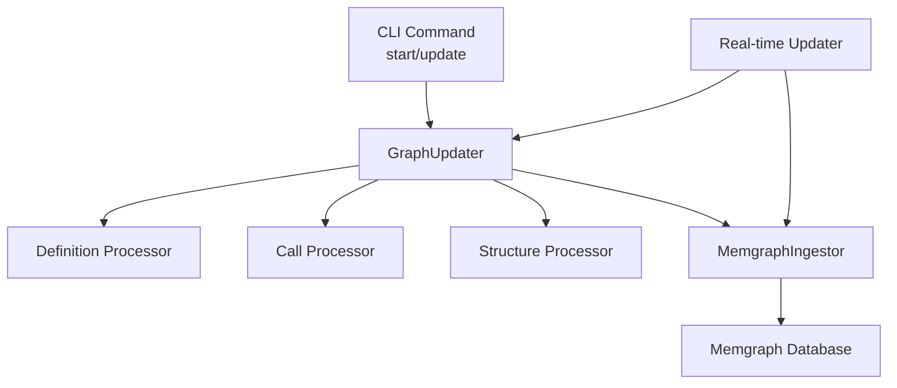
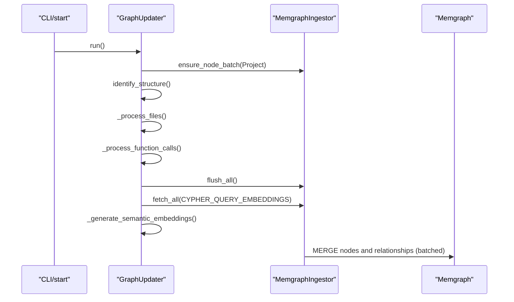
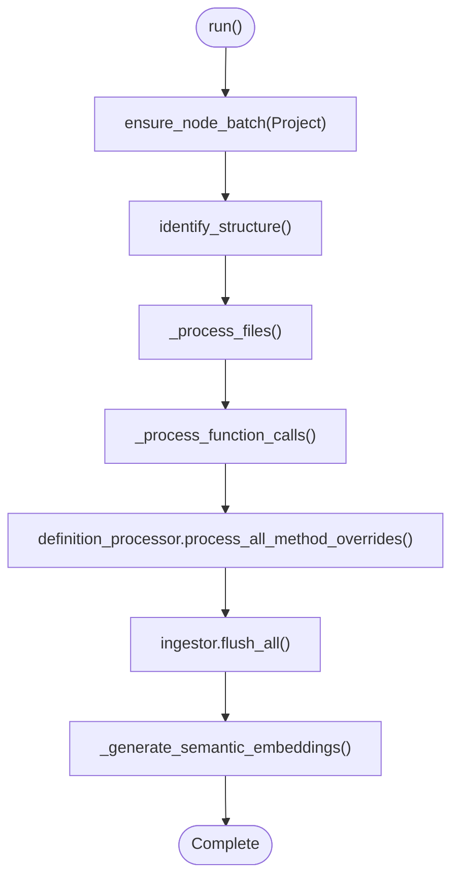
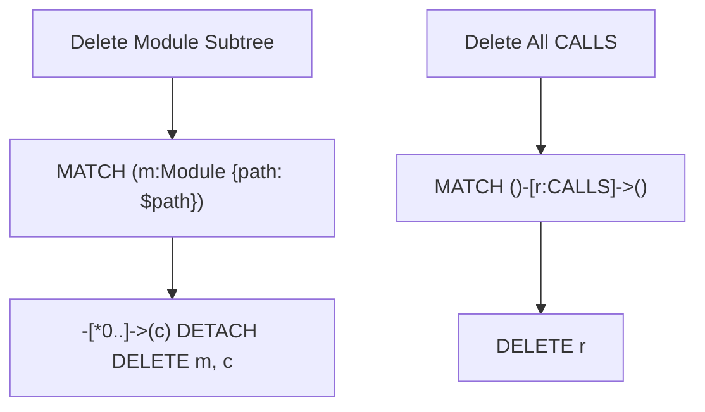
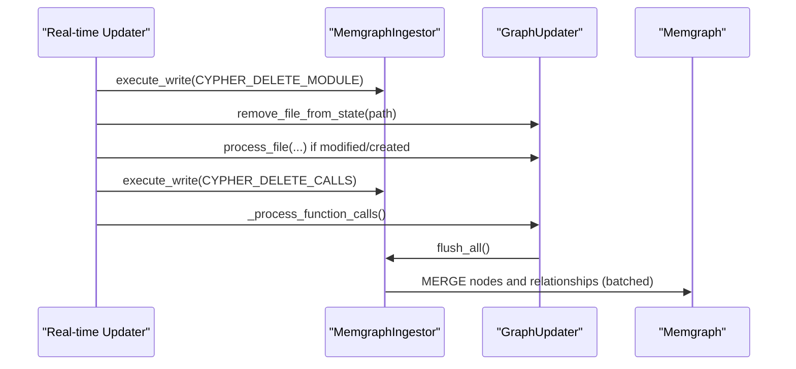
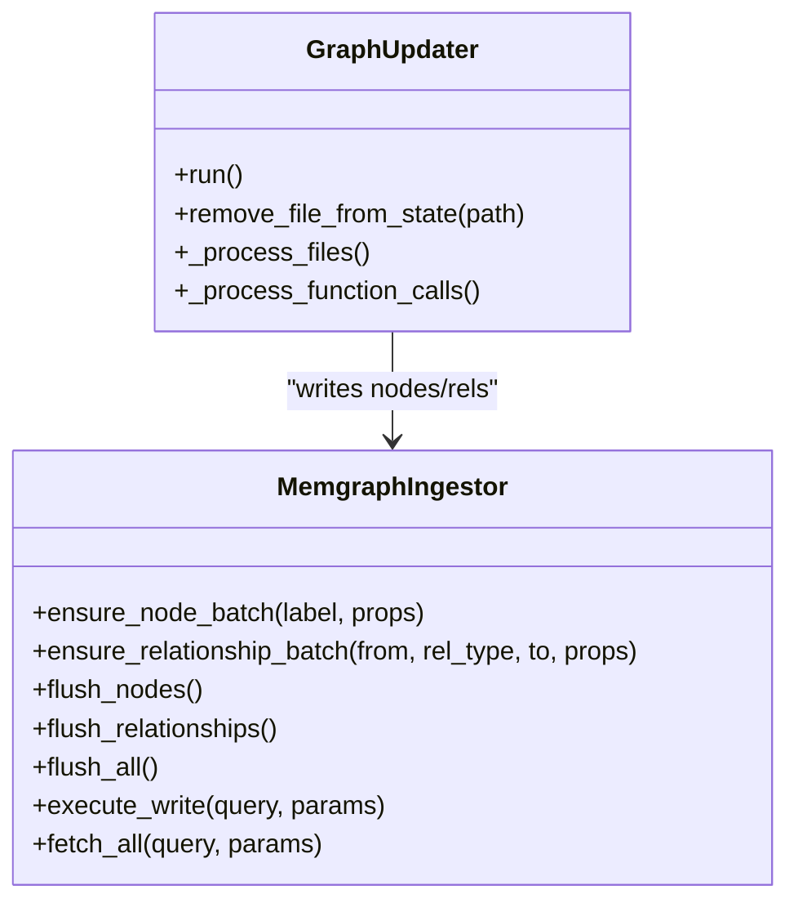
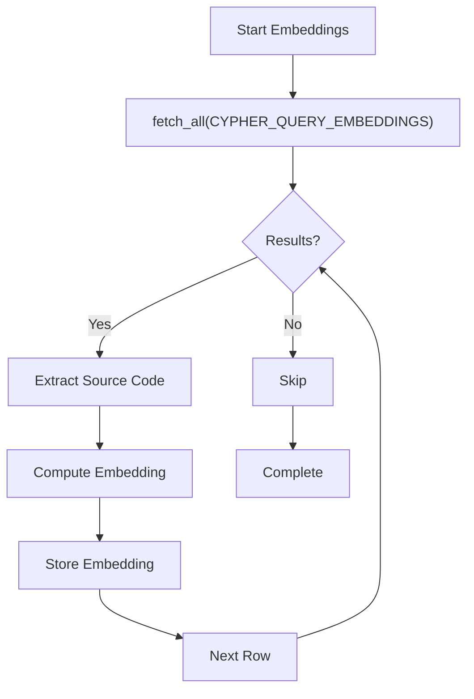
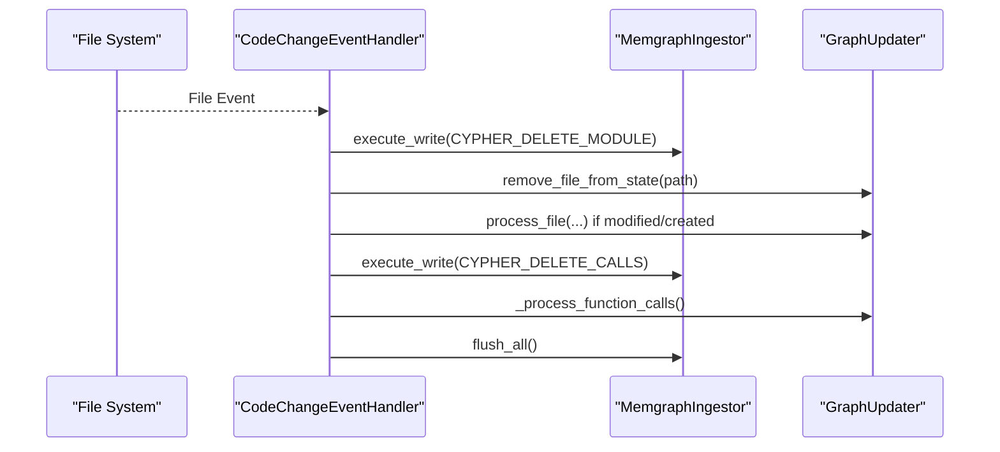
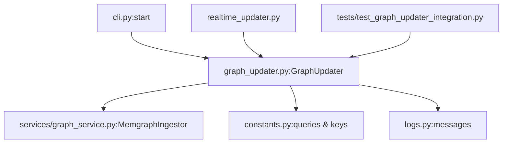

# Graph Synchronization

<cite>
**Referenced Files in This Document**
- [graph_updater.py](file://codebase_rag/graph_updater.py)
- [cypher_queries.py](file://codebase_rag/cypher_queries.py)
- [constants.py](file://codebase_rag/constants.py)
- [realtime_updater.py](file://realtime_updater.py)
- [graph_service.py](file://codebase_rag/services/graph_service.py)
- [cli.py](file://codebase_rag/cli.py)
- [logs.py](file://codebase_rag/logs.py)
- [test_graph_updater_integration.py](file://codebase_rag/tests/test_graph_updater_integration.py)
</cite>

## Table of Contents
1. [Introduction](#introduction)
2. [Project Structure](#project-structure)
3. [Core Components](#core-components)
4. [Architecture Overview](#architecture-overview)
5. [Detailed Component Analysis](#detailed-component-analysis)
6. [Dependency Analysis](#dependency-analysis)
7. [Performance Considerations](#performance-considerations)
8. [Troubleshooting Guide](#troubleshooting-guide)
9. [Conclusion](#conclusion)

## Introduction
This document explains the graph synchronization mechanism that keeps the knowledge graph consistent with file changes. It details the five-step update process: deleting old data, clearing in-memory state, re-parsing files, re-processing function calls, and flushing changes to the database. It also documents the Cypher queries used for deletion operations, the GraphUpdater class that coordinates synchronization, the relationship rebuilding process that fixes "island" problems, performance considerations for large codebases, and strategies for minimizing downtime during updates.

## Project Structure
The synchronization pipeline spans several modules:
- CLI entry points trigger updates and optionally clean the database.
- GraphUpdater orchestrates the five-step update process.
- Cypher queries define deletion operations for modules and call relationships.
- MemgraphIngestor batches and writes graph data to the database.
- Real-time updater watches file changes and applies incremental updates.

**Diagram sources**
- [cli.py](file://codebase_rag/cli.py#L55-L162)
- [graph_updater.py](file://codebase_rag/graph_updater.py#L223-L285)
- [realtime_updater.py](file://realtime_updater.py#L114-L149)
- [graph_service.py](file://codebase_rag/services/graph_service.py#L49-L364)

**Section sources**
- [cli.py](file://codebase_rag/cli.py#L55-L162)
- [graph_updater.py](file://codebase_rag/graph_updater.py#L223-L285)
- [realtime_updater.py](file://realtime_updater.py#L114-L149)
- [graph_service.py](file://codebase_rag/services/graph_service.py#L49-L364)

## Core Components
- GraphUpdater: Coordinates the five-step update process, manages in-memory caches, and triggers database flushes.
- MemgraphIngestor: Batches and writes nodes and relationships to the database, ensuring constraints and handling failures.
- Cypher Queries: Define deletion operations for modules and call relationships.
- Real-time Updater: Watches file system events and applies incremental updates using the same five-step process.

Key responsibilities:
- Deletion: Removes outdated module and call relationships to provide a clean slate.
- State cleanup: Clears AST cache and function registry entries for affected files.
- Reparsing: Re-processes files to rebuild in-memory state.
- Relationship rebuilding: Deletes and re-computes CALLS relationships to fix "islands".
- Flushing: Writes all buffered changes to the database.

**Section sources**
- [graph_updater.py](file://codebase_rag/graph_updater.py#L223-L285)
- [graph_service.py](file://codebase_rag/services/graph_service.py#L166-L327)
- [cypher_queries.py](file://codebase_rag/cypher_queries.py#L3-L120)
- [realtime_updater.py](file://realtime_updater.py#L47-L112)

## Architecture Overview
The synchronization architecture ensures consistency by:
- Cleaning the database or targeted module nodes before reparsing.
- Maintaining an AST cache and function registry for efficient reprocessing.
- Rebuilding relationships by deleting stale CALLS edges and recomputing them.
- Using batched writes to minimize database round-trips.

**Diagram sources**
- [cli.py](file://codebase_rag/cli.py#L138-L154)
- [graph_updater.py](file://codebase_rag/graph_updater.py#L264-L285)
- [graph_service.py](file://codebase_rag/services/graph_service.py#L189-L327)
- [constants.py](file://codebase_rag/constants.py#L416-L423)

## Detailed Component Analysis

### GraphUpdater: Five-Step Update Process
GraphUpdater orchestrates the update workflow:
1. Ensure project node exists.
2. Identify packages, folders, and structural elements.
3. Process files and cache ASTs; handle dependency files.
4. Process function calls across cached ASTs.
5. Flush all buffered writes and optionally generate embeddings.

**Diagram sources**
- [graph_updater.py](file://codebase_rag/graph_updater.py#L264-L285)

Additional cleanup for a single file:
- Removes AST cache entry if present.
- Removes function registry entries matching the file's module prefix.
- Updates simple-name lookup indices to remove stale entries.

**Section sources**
- [graph_updater.py](file://codebase_rag/graph_updater.py#L264-L285)
- [graph_updater.py](file://codebase_rag/graph_updater.py#L287-L318)

### Cypher Deletion Operations
Deletion queries ensure a clean slate before reparsing:
- Delete module subtree by path: removes a module and all contained nodes.
- Delete all CALLS relationships: clears stale call edges prior to rebuilding.

**Diagram sources**
- [constants.py](file://codebase_rag/constants.py#L839-L840)
- [realtime_updater.py](file://realtime_updater.py#L80-L107)

**Section sources**
- [constants.py](file://codebase_rag/constants.py#L839-L840)
- [realtime_updater.py](file://realtime_updater.py#L80-L107)

### Relationship Rebuilding and Island Fix
Rebuilding relationships fixes "island" problems where disconnected nodes remain after partial updates:
- Delete all CALLS relationships to eliminate stale edges.
- Re-process function calls across cached ASTs to reconstruct relationships.
- Flush all writes to persist the corrected graph.

**Diagram sources**
- [realtime_updater.py](file://realtime_updater.py#L47-L112)
- [graph_updater.py](file://codebase_rag/graph_updater.py#L349-L354)
- [graph_service.py](file://codebase_rag/services/graph_service.py#L267-L321)

**Section sources**
- [realtime_updater.py](file://realtime_updater.py#L47-L112)
- [graph_updater.py](file://codebase_rag/graph_updater.py#L349-L354)

### Database Write Pipeline and Batching
MemgraphIngestor batches writes to improve throughput:
- Node batching merges nodes by unique constraints and sets properties.
- Relationship batching groups by pattern and merges edges.
- Flush order: nodes first, then relationships to satisfy referential integrity.
- Error handling logs detailed query and parameter information for diagnostics.

**Diagram sources**
- [graph_service.py](file://codebase_rag/services/graph_service.py#L49-L364)
- [graph_updater.py](file://codebase_rag/graph_updater.py#L223-L285)

**Section sources**
- [graph_service.py](file://codebase_rag/services/graph_service.py#L189-L327)

### Embedding Generation Workflow
After graph construction, optional semantic embeddings are generated:
- Fetch all function and method nodes with source locations.
- Extract source code via fallback mechanisms.
- Compute embeddings and store them.

**Diagram sources**
- [graph_updater.py](file://codebase_rag/graph_updater.py#L356-L419)
- [constants.py](file://codebase_rag/constants.py#L416-L423)

**Section sources**
- [graph_updater.py](file://codebase_rag/graph_updater.py#L356-L419)
- [constants.py](file://codebase_rag/constants.py#L416-L423)

### Real-time Synchronization Workflow
The real-time updater applies incremental updates on file changes:
- Detect file modification or creation.
- Delete module subtree and stale in-memory state.
- Reparse the file if applicable.
- Delete and rebuild CALLS relationships.
- Flush all changes.

**Diagram sources**
- [realtime_updater.py](file://realtime_updater.py#L47-L112)

**Section sources**
- [realtime_updater.py](file://realtime_updater.py#L47-L112)

## Dependency Analysis
The synchronization pipeline depends on:
- CLI options to trigger updates and clean the database.
- Constants for Cypher queries and keys.
- Logs for operational visibility.
- Tests validating call relationships.

**Diagram sources**
- [cli.py](file://codebase_rag/cli.py#L138-L154)
- [graph_updater.py](file://codebase_rag/graph_updater.py#L223-L285)
- [constants.py](file://codebase_rag/constants.py#L839-L840)
- [realtime_updater.py](file://realtime_updater.py#L114-L149)
- [test_graph_updater_integration.py](file://codebase_rag/tests/test_graph_updater_integration.py#L27-L58)

**Section sources**
- [cli.py](file://codebase_rag/cli.py#L138-L154)
- [constants.py](file://codebase_rag/constants.py#L839-L840)
- [logs.py](file://codebase_rag/logs.py#L98-L108)
- [test_graph_updater_integration.py](file://codebase_rag/tests/test_graph_updater_integration.py#L27-L58)

## Performance Considerations
- Batched writes: Use MemgraphIngestor batch sizes to reduce network overhead and improve throughput.
- Constraint enforcement: Ensure unique constraints exist to enable efficient MERGE operations.
- AST caching: Limit cache size and memory to avoid excessive memory usage during large scans.
- Incremental updates: Real-time updater minimizes downtime by deleting only affected modules and rebuilding relationships incrementally.
- Embedding generation: Optional and batched; disable if not needed to reduce processing time.

[No sources needed since this section provides general guidance]

## Troubleshooting Guide
Common issues and resolutions:
- Database errors: Review detailed query and parameter logs emitted by MemgraphIngestor to identify constraint violations or invalid parameters.
- Missing constraints: Ensure unique constraints are created before flushing nodes.
- Stale relationships: After incremental updates, verify that CALLS relationships were deleted and rebuilt.
- Embedding failures: Check logs for embedding generation errors and validate source extraction logic.
- Real-time watcher skips updates: Ensure the ingestor supports querying; otherwise, updates are skipped.

Operational logging references:
- Watcher detection and progress logs.
- Batch write and flush logs.
- Embedding generation progress and completion logs.

**Section sources**
- [graph_service.py](file://codebase_rag/services/graph_service.py#L104-L164)
- [graph_service.py](file://codebase_rag/services/graph_service.py#L189-L327)
- [logs.py](file://codebase_rag/logs.py#L98-L108)
- [logs.py](file://codebase_rag/logs.py#L310-L320)
- [logs.py](file://codebase_rag/logs.py#L39-L52)

## Conclusion
The graph synchronization mechanism ensures consistency between file changes and the knowledge graph through a robust five-step process. By combining targeted deletions, in-memory state cleanup, re-parsing, relationship rebuilding, and batched database writes, the system maintains accuracy and performance. The real-time updater further minimizes downtime by applying incremental updates on file changes, while comprehensive logging and batching strategies support scalability and operability.