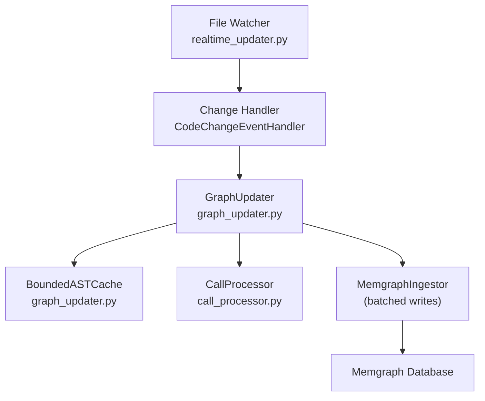
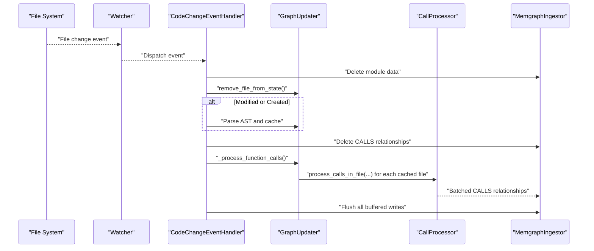
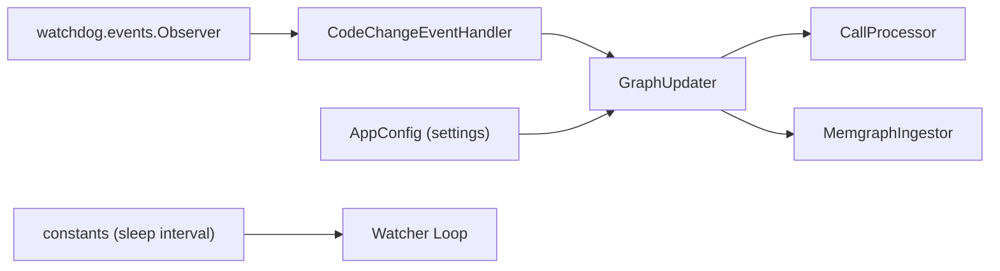

# Performance Optimization

<cite>
**Referenced Files in This Document**
- [realtime_updater.py](file://realtime_updater.py)
- [graph_updater.py](file://codebase_rag/graph_updater.py)
- [config.py](file://codebase_rag/config.py)
- [constants.py](file://codebase_rag/constants.py)
- [logs.py](file://codebase_rag/logs.py)
- [call_processor.py](file://codebase_rag/parsers/call_processor.py)
- [test_realtime_updater.py](file://codebase_rag/tests/test_realtime_updater.py)
</cite>

## Table of Contents
1. [Introduction](#introduction)
2. [Project Structure](#project-structure)
3. [Core Components](#core-components)
4. [Architecture Overview](#architecture-overview)
5. [Detailed Component Analysis](#detailed-component-analysis)
6. [Dependency Analysis](#dependency-analysis)
7. [Performance Considerations](#performance-considerations)
8. [Troubleshooting Guide](#troubleshooting-guide)
9. [Conclusion](#conclusion)
10. [Appendices](#appendices)

## Introduction
This document focuses on performance optimization strategies for the real-time update system. It explains how batch size and sleep interval settings influence update frequency and resource usage, documents the current limitation of recalculating all CALLS relationships on every file change, and proposes targeted optimizations. It also covers memory management for large codebases, cache optimization, benchmarking guidelines, monitoring approaches, and configuration recommendations tailored to different project sizes and environments.

## Project Structure
The real-time update pipeline consists of:
- A file watcher that monitors the repository for changes
- A handler that coordinates graph updates per change
- A graph updater that rebuilds in-memory state and recalculates relationships
- A bounded AST cache to reduce repeated parsing
- Batched ingestion to the database

**Diagram sources**
- [realtime_updater.py](file://realtime_updater.py#L114-L149)
- [graph_updater.py](file://codebase_rag/graph_updater.py#L223-L284)
- [call_processor.py](file://codebase_rag/parsers/call_processor.py#L20-L74)

**Section sources**
- [realtime_updater.py](file://realtime_updater.py#L114-L149)
- [graph_updater.py](file://codebase_rag/graph_updater.py#L223-L284)

## Core Components
- Real-time watcher and handler: Detects file changes and triggers updates.
- GraphUpdater: Manages in-memory state, AST cache, and relationship recomputation.
- BoundedASTCache: Limits memory footprint of parsed ASTs.
- CallProcessor: Extracts and resolves function calls to generate CALLS relationships.
- Batched ingestion: Uses configurable batch size to minimize database round-trips.

Key performance-relevant settings:
- Batch size: Controls database write batching.
- Sleep interval: Governs watcher loop idle time.
- Cache limits: Max entries and memory thresholds.

**Section sources**
- [realtime_updater.py](file://realtime_updater.py#L114-L149)
- [graph_updater.py](file://codebase_rag/graph_updater.py#L162-L221)
- [config.py](file://codebase_rag/config.py#L54-L54)
- [constants.py](file://codebase_rag/constants.py#L849-L849)

## Architecture Overview
The real-time update follows a deterministic sequence for each change:
1. Delete module data from the graph
2. Remove file state from in-memory caches
3. Parse and cache AST for modified/created files
4. Recalculate all CALLS relationships across the entire codebase
5. Flush all buffered writes to the database

**Diagram sources**
- [realtime_updater.py](file://realtime_updater.py#L47-L111)
- [graph_updater.py](file://codebase_rag/graph_updater.py#L287-L354)
- [call_processor.py](file://codebase_rag/parsers/call_processor.py#L49-L74)

## Detailed Component Analysis

### Batch Size Configuration
- Purpose: Controls the number of nodes/relationships buffered before flushing to the database.
- Resolution: The effective batch size is resolved via settings and passed to the ingestor.
- Impact:
  - Larger batch size reduces network overhead and improves throughput but increases memory usage and latency between change and persistence.
  - Smaller batch size lowers peak memory and latency but increases round-trips and potential contention.

Recommendations:
- Small projects (< 10k files): Start with moderate batch size (e.g., 500–1000).
- Medium projects (10k–50k files): Start with larger batch size (e.g., 1000–2000).
- Large projects (> 50k files): Start with higher batch size (e.g., 2000–5000) and monitor memory.

Operational notes:
- Batch size is validated to be positive.
- The ingestor performs incremental flushes when buffers reach batch size thresholds.

**Section sources**
- [config.py](file://codebase_rag/config.py#L227-L231)
- [realtime_updater.py](file://realtime_updater.py#L120-L126)
- [logs.py](file://codebase_rag/logs.py#L171-L176)

### Sleep Interval Settings
- Purpose: Governs the idle sleep between watcher loop iterations.
- Current value: One second.
- Impact:
  - Lower intervals increase responsiveness but consume more CPU and polling resources.
  - Higher intervals reduce CPU usage but delay when updates are visible.

Recommendations:
- Development workstations: Keep default (1s) for balanced responsiveness.
- CI/automation: Consider increasing interval to reduce CPU usage when changes are infrequent.
- Resource-constrained environments: Increase interval to 2–5s to reduce overhead.

**Section sources**
- [constants.py](file://codebase_rag/constants.py#L849-L849)
- [realtime_updater.py](file://realtime_updater.py#L145-L146)

### Recalculation of CALLS Relationships: Limitation and Impact
Current behavior:
- On every file change, the system deletes all CALLS relationships and recomputes them across the entire codebase using the AST cache.
- This ensures consistency but is computationally expensive for large codebases.

Impacts:
- CPU-intensive due to scanning all cached ASTs and resolving calls.
- Memory pressure from maintaining the AST cache and building relationship batches.
- Latency increases proportionally to the number of files and call density.

Evidence from code:
- Deletion of CALLS relationships before recomputation.
- Full traversal of AST cache to process calls in each file.

**Section sources**
- [realtime_updater.py](file://realtime_updater.py#L105-L107)
- [graph_updater.py](file://codebase_rag/graph_updater.py#L349-L354)

### Potential Optimization Approaches for CALLS Recalculation
- Incremental CALLS recomputation:
  - Track changed files and only reprocess call sites affected by those files.
  - Maintain a reverse index of call targets to quickly locate dependents.
- Targeted deletion and regeneration:
  - Instead of deleting all CALLS, delete only those originating from or pointing to the affected module.
- Parallelization:
  - Process ASTs concurrently per core or per language subset.
- Call caching:
  - Cache resolved call results keyed by caller context to avoid repeated resolution.

Note: These are design suggestions derived from observed behavior and are not currently implemented.

**Section sources**
- [realtime_updater.py](file://realtime_updater.py#L105-L107)
- [graph_updater.py](file://codebase_rag/graph_updater.py#L349-L354)

### Memory Management Strategies for Large Codebases
- Bounded AST cache:
  - Enforced by maximum entries and maximum memory thresholds.
  - Evicts least-recently-used entries and applies proportional eviction when memory limits are exceeded.
- Cache eviction policy:
  - Removes oldest entries when exceeding max entries.
  - Applies proportional eviction when memory threshold is exceeded.

Guidelines:
- Tune CACHE_MAX_ENTRIES and CACHE_MAX_MEMORY_MB for your project size.
- Monitor cache hit rates and adjust thresholds to balance memory vs. parsing cost.

**Section sources**
- [graph_updater.py](file://codebase_rag/graph_updater.py#L162-L221)
- [config.py](file://codebase_rag/config.py#L151-L154)

### Cache Optimization Techniques
- Prefer LRU eviction with dual limits (count and memory).
- Warm cache by pre-processing frequently accessed files during initial scan.
- Avoid unnecessary re-parsing by leveraging the existing AST cache for modified files.

**Section sources**
- [graph_updater.py](file://codebase_rag/graph_updater.py#L162-L221)
- [graph_updater.py](file://codebase_rag/graph_updater.py#L264-L283)

### Benchmarking Guidelines
- Metrics to collect:
  - Time per change (from event detection to flush completion)
  - Number of files processed per update
  - CPU utilization and memory RSS during updates
  - Database flush duration and batch sizes
- Test scenarios:
  - Single-file change (baseline)
  - Batch of small changes within short time window
  - Large file change with many call sites
  - Mixed-language repository
- Tools:
  - OS-level profilers (e.g., top, htop, perf)
  - Python profiling (e.g., cProfile) around key steps
  - Database metrics (e.g., Memgraph stats)

Validation via tests:
- The test suite verifies the handler’s behavior for creation, modification, deletion, and ignored events, ensuring the update flow is triggered as expected.

**Section sources**
- [test_realtime_updater.py](file://codebase_rag/tests/test_realtime_updater.py#L21-L119)

### Performance Monitoring Approaches
- Logging:
  - Use INFO-level logs to track update lifecycle and progress.
  - Leverage existing log messages for deletion, recalculation, and flush operations.
- Database telemetry:
  - Monitor flush durations and counts to correlate with batch size tuning.
- Ingestion metrics:
  - Track buffering thresholds and batch errors.

**Section sources**
- [logs.py](file://codebase_rag/logs.py#L98-L108)
- [logs.py](file://codebase_rag/logs.py#L171-L189)

### Configuration Recommendations by Project Size
- Small projects (< 10k files):
  - Batch size: 500–1000
  - Sleep interval: 1s
  - Cache max entries: 500–1000
  - Cache max memory: 250–500 MB
- Medium projects (10k–50k files):
  - Batch size: 1000–2000
  - Sleep interval: 1–2s
  - Cache max entries: 1000–2000
  - Cache max memory: 500–1000 MB
- Large projects (> 50k files):
  - Batch size: 2000–5000
  - Sleep interval: 2–5s
  - Cache max entries: 2000–5000
  - Cache max memory: 1000–2000 MB

Notes:
- Adjust sleep interval based on environment constraints.
- Monitor memory usage and reduce batch size if memory pressure occurs.

**Section sources**
- [config.py](file://codebase_rag/config.py#L151-L154)
- [constants.py](file://codebase_rag/constants.py#L849-L849)

### CPU and Memory Usage Patterns During Intensive Updates
- CPU:
  - High during AST traversal and call resolution across cached files.
  - Peaks when recomputing CALLS relationships after deletions.
- Memory:
  - Increases with AST cache growth and buffered relationships.
  - Eviction routines mitigate spikes but may cause temporary churn.

Mitigation:
- Reduce batch size or increase sleep interval to smooth CPU usage.
- Tune cache limits to prevent excessive memory growth.

**Section sources**
- [graph_updater.py](file://codebase_rag/graph_updater.py#L162-L221)
- [realtime_updater.py](file://realtime_updater.py#L105-L107)

## Dependency Analysis
The real-time update depends on:
- Watchdog for file system events
- GraphUpdater for state management and relationship recomputation
- CallProcessor for extracting and resolving calls
- Ingestor for batched writes to the database

**Diagram sources**
- [realtime_updater.py](file://realtime_updater.py#L8-L31)
- [graph_updater.py](file://codebase_rag/graph_updater.py#L223-L256)
- [config.py](file://codebase_rag/config.py#L227-L231)
- [constants.py](file://codebase_rag/constants.py#L849-L849)

**Section sources**
- [realtime_updater.py](file://realtime_updater.py#L8-L31)
- [graph_updater.py](file://codebase_rag/graph_updater.py#L223-L256)

## Performance Considerations
- Batch size vs. memory trade-offs: Larger batches improve throughput but increase memory and latency.
- Sleep interval vs. responsiveness: Shorter intervals improve responsiveness but raise CPU usage.
- CALLS recomputation cost: Full recalculation is expensive; consider incremental strategies.
- Cache sizing: Properly tuned cache reduces repeated parsing and improves stability under frequent changes.

[No sources needed since this section provides general guidance]

## Troubleshooting Guide
Common symptoms and checks:
- Excessive CPU usage:
  - Verify sleep interval and consider increasing it.
  - Reduce batch size to lower peak memory and CPU churn.
- High memory usage:
  - Review cache limits and eviction divisor.
  - Consider reducing cache max entries or memory thresholds.
- Slow updates:
  - Profile the call resolution phase.
  - Consider limiting concurrent processing or using targeted recomputation.

Relevant logs:
- Change detection and update lifecycle messages
- Deletion and flush operations
- Embedding progress (when enabled)

**Section sources**
- [logs.py](file://codebase_rag/logs.py#L98-L108)
- [logs.py](file://codebase_rag/logs.py#L171-L189)
- [logs.py](file://codebase_rag/logs.py#L45-L50)

## Conclusion
The real-time update system balances responsiveness and accuracy through batching and periodic recomputation. While the current design ensures consistency by recalculating all CALLS relationships, it incurs significant CPU and memory costs on large codebases. Optimizations such as incremental CALLS recomputation, targeted deletions, and parallel processing can substantially improve performance. Proper tuning of batch size, sleep interval, and cache limits enables efficient operation across diverse project scales and environments.

[No sources needed since this section summarizes without analyzing specific files]

## Appendices

### Appendix A: Key Constants and Settings
- Watcher sleep interval: one second
- Default Memgraph batch size: 1000
- Cache defaults: max entries and memory thresholds with proportional eviction

**Section sources**
- [constants.py](file://codebase_rag/constants.py#L849-L849)
- [config.py](file://codebase_rag/config.py#L54-L54)
- [config.py](file://codebase_rag/config.py#L151-L154)