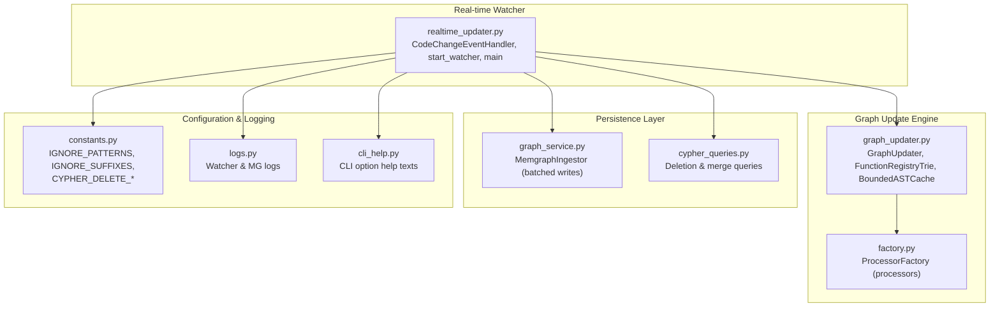
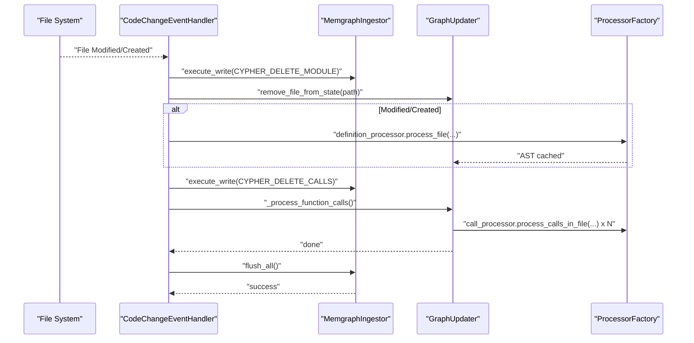
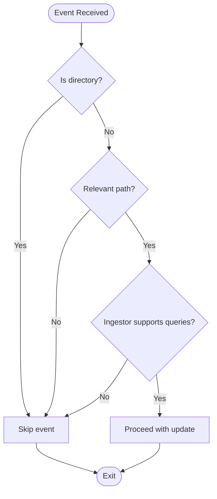
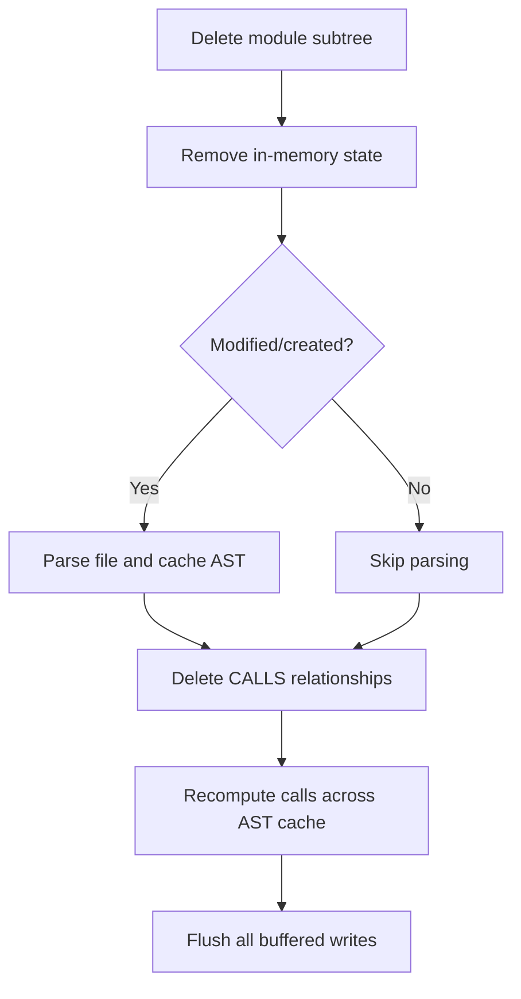
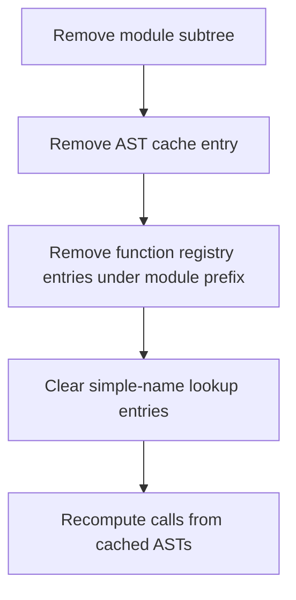
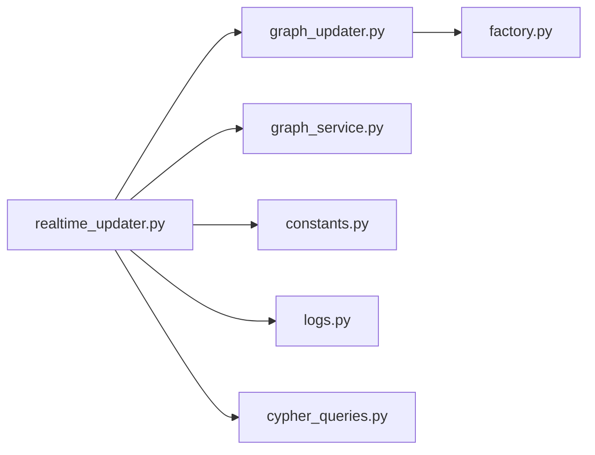

# Real-time Updates

<cite>
**Referenced Files in This Document**
- [realtime_updater.py](file://realtime_updater.py)
- [graph_updater.py](file://codebase_rag/graph_updater.py)
- [graph_service.py](file://codebase_rag/services/graph_service.py)
- [constants.py](file://codebase_rag/constants.py)
- [logs.py](file://codebase_rag/logs.py)
- [cli_help.py](file://codebase_rag/cli_help.py)
- [test_realtime_updater.py](file://codebase_rag/tests/test_realtime_updater.py)
- [cypher_queries.py](file://codebase_rag/cypher_queries.py)
- [factory.py](file://codebase_rag/parsers/factory.py)
</cite>

## Table of Contents
1. [Introduction](#introduction)
2. [Project Structure](#project-structure)
3. [Core Components](#core-components)
4. [Architecture Overview](#architecture-overview)
5. [Detailed Component Analysis](#detailed-component-analysis)
6. [Dependency Analysis](#dependency-analysis)
7. [Performance Considerations](#performance-considerations)
8. [Troubleshooting Guide](#troubleshooting-guide)
9. [Conclusion](#conclusion)
10. [Appendices](#appendices)

## Introduction
This document explains the Graph-Code real-time update system that monitors file changes and synchronizes the knowledge graph with live edits. It covers how file system events trigger graph updates, how function call relationships are maintained consistently, how irrelevant files are filtered, and how batching and caching optimize performance. It also documents CLI options for host, port, and batch size, limitations around recalculating all CALLS relationships, and best practices for integrating real-time updates into multi-terminal workflows.

## Project Structure
The real-time update pipeline centers on a file watcher that reacts to filesystem events and coordinates with the GraphUpdater and Memgraph ingestor to keep the graph synchronized. Supporting modules define constants, logging, and Cypher operations.

**Diagram sources**
- [realtime_updater.py](file://realtime_updater.py#L34-L183)
- [graph_updater.py](file://codebase_rag/graph_updater.py#L223-L469)
- [factory.py](file://codebase_rag/parsers/factory.py#L18-L116)
- [graph_service.py](file://codebase_rag/services/graph_service.py#L49-L364)
- [cypher_queries.py](file://codebase_rag/cypher_queries.py#L1-L120)
- [constants.py](file://codebase_rag/constants.py#L780-L850)
- [logs.py](file://codebase_rag/logs.py#L98-L109)
- [cli_help.py](file://codebase_rag/cli_help.py#L34-L50)

**Section sources**
- [realtime_updater.py](file://realtime_updater.py#L1-L184)
- [graph_updater.py](file://codebase_rag/graph_updater.py#L1-L469)
- [constants.py](file://codebase_rag/constants.py#L780-L850)

## Core Components
- CodeChangeEventHandler: Watches filesystem events, filters irrelevant paths, deletes prior graph state for the affected file, clears in-memory state, re-parses modified files, recalculates all function calls, and flushes changes to the database.
- GraphUpdater: Orchestrates the full pipeline: ensures project node, identifies structure, processes files, computes function calls across the AST cache, and generates embeddings. It maintains caches for ASTs and function registries.
- MemgraphIngestor: Provides batched write operations to Memgraph with node and relationship buffers, constraint enforcement, and safe flush semantics.
- Constants and Logs: Define ignore patterns, Cypher operations, logging formats, and sleep intervals for the watcher.
- CLI Help: Documents CLI options for host, port, and batch size.

**Section sources**
- [realtime_updater.py](file://realtime_updater.py#L34-L183)
- [graph_updater.py](file://codebase_rag/graph_updater.py#L223-L469)
- [graph_service.py](file://codebase_rag/services/graph_service.py#L49-L364)
- [constants.py](file://codebase_rag/constants.py#L780-L850)
- [logs.py](file://codebase_rag/logs.py#L98-L109)
- [cli_help.py](file://codebase_rag/cli_help.py#L34-L50)

## Architecture Overview
The real-time system runs an initial full scan, then starts a file watcher. On each relevant change, it:
1. Deletes the module subtree for the changed file.
2. Removes in-memory state for that file.
3. Parses the file if modified/created.
4. Recomputes all function calls across the AST cache to fix “islands.”
5. Flushes all buffered writes to Memgraph.

**Diagram sources**
- [realtime_updater.py](file://realtime_updater.py#L47-L111)
- [graph_updater.py](file://codebase_rag/graph_updater.py#L287-L355)
- [graph_service.py](file://codebase_rag/services/graph_service.py#L323-L340)
- [cypher_queries.py](file://codebase_rag/cypher_queries.py#L3-L120)

## Detailed Component Analysis

### File System Monitoring and Filtering
- Event handling: The handler accepts file modification and creation events, ignores directories and irrelevant paths, and validates ingestor capability.
- Filtering: Paths ending with ignored suffixes or passing through ignored directory segments are skipped.
- Relative path computation: Converts absolute file paths to repository-relative paths for graph operations.

**Diagram sources**
- [realtime_updater.py](file://realtime_updater.py#L47-L71)
- [constants.py](file://codebase_rag/constants.py#L780-L828)

**Section sources**
- [realtime_updater.py](file://realtime_updater.py#L41-L71)
- [constants.py](file://codebase_rag/constants.py#L780-L828)

### Live Graph Synchronization Steps
The handler documents five steps per change:
1. Delete module subtree for the file.
2. Remove in-memory state (AST cache and function registry entries).
3. Parse the file if modified/created.
4. Recalculate all function calls across the AST cache.
5. Flush buffered writes to the database.

**Diagram sources**
- [realtime_updater.py](file://realtime_updater.py#L76-L111)
- [graph_updater.py](file://codebase_rag/graph_updater.py#L287-L355)
- [cypher_queries.py](file://codebase_rag/cypher_queries.py#L839-L840)

**Section sources**
- [realtime_updater.py](file://realtime_updater.py#L47-L111)
- [graph_updater.py](file://codebase_rag/graph_updater.py#L287-L355)

### Maintaining Consistency in Function Call Relationships
- Island problem mitigation: After deleting the module subtree and reparsing, the system recomputes calls across the entire AST cache to restore relationships that may have become disconnected due to partial updates.
- Registry cleanup: Removes function qualified names under the affected module prefix and cleans simple-name lookups to prevent stale references.

**Diagram sources**
- [graph_updater.py](file://codebase_rag/graph_updater.py#L287-L318)
- [graph_updater.py](file://codebase_rag/graph_updater.py#L349-L355)

**Section sources**
- [graph_updater.py](file://codebase_rag/graph_updater.py#L287-L318)
- [graph_updater.py](file://codebase_rag/graph_updater.py#L349-L355)

### CLI Arguments and Configuration Options
- Arguments:
  - repo_path: Path to the repository to watch.
  - host: Memgraph host (default from settings).
  - port: Memgraph port (default from settings).
  - batch_size: Optional override for batch size; validated to be positive.
- Defaults and resolution:
  - Host/port default to settings.
  - Batch size defaults to settings and is validated via a callback.
- Help text references:
  - CLI help texts describe the purpose of each option.

**Section sources**
- [realtime_updater.py](file://realtime_updater.py#L160-L179)
- [cli_help.py](file://codebase_rag/cli_help.py#L34-L50)
- [constants.py](file://codebase_rag/constants.py#L50-L54)
- [constants.py](file://codebase_rag/constants.py#L227-L231)

### Practical Multi-Terminal Workflows
- Run the real-time updater in one terminal to monitor changes.
- Keep another terminal running the main application or CLI commands to interact with the graph.
- Use batch_size tuning to balance responsiveness and throughput across terminals.
- Ensure Memgraph is reachable at the configured host/port.

[No sources needed since this section provides general guidance]

### Limitation: Recalculation of All CALLS Relationships
- Current behavior: On every file change, the system deletes all CALLS relationships and recomputes them across the entire AST cache.
- Impact: Ensures consistency but can be expensive on large codebases.
- Future optimization plans: The current implementation explicitly states this approach. Optimizations could include incremental call resolution per file or targeted CALLS regeneration based on dependency analysis.

**Section sources**
- [realtime_updater.py](file://realtime_updater.py#L104-L108)
- [graph_updater.py](file://codebase_rag/graph_updater.py#L349-L355)

## Dependency Analysis
The real-time updater depends on:
- GraphUpdater for orchestration and AST/function registry management.
- MemgraphIngestor for batched writes and constraint enforcement.
- Constants and logs for filtering, Cypher operations, and logging.
- ProcessorFactory for accessing parsers and processors.

**Diagram sources**
- [realtime_updater.py](file://realtime_updater.py#L11-L31)
- [graph_updater.py](file://codebase_rag/graph_updater.py#L246-L256)
- [factory.py](file://codebase_rag/parsers/factory.py#L18-L48)
- [graph_service.py](file://codebase_rag/services/graph_service.py#L49-L66)
- [constants.py](file://codebase_rag/constants.py#L839-L840)
- [logs.py](file://codebase_rag/logs.py#L98-L109)

**Section sources**
- [realtime_updater.py](file://realtime_updater.py#L11-L31)
- [graph_updater.py](file://codebase_rag/graph_updater.py#L246-L256)
- [factory.py](file://codebase_rag/parsers/factory.py#L18-L48)
- [graph_service.py](file://codebase_rag/services/graph_service.py#L49-L66)
- [constants.py](file://codebase_rag/constants.py#L839-L840)
- [logs.py](file://codebase_rag/logs.py#L98-L109)

## Performance Considerations
- Batching:
  - Batch size controls buffer thresholds for nodes and relationships before flush.
  - Larger batches reduce round-trips but increase memory usage and latency.
- AST caching:
  - BoundedASTCache limits entries and memory, evicting least-recently used entries and enforcing memory thresholds.
- Watcher interval:
  - Sleep interval is minimal, ensuring responsive updates without busy-waiting.
- Embeddings:
  - Optional semantic embedding generation occurs after the initial passes; it can be disabled or tuned separately.

**Section sources**
- [graph_service.py](file://codebase_rag/services/graph_service.py#L49-L66)
- [graph_service.py](file://codebase_rag/services/graph_service.py#L189-L218)
- [graph_updater.py](file://codebase_rag/graph_updater.py#L162-L221)
- [constants.py](file://codebase_rag/constants.py#L848-L849)

## Troubleshooting Guide
- Watcher not starting:
  - Verify host/port reachability and that the ingestor supports querying.
  - Check logs indicating watcher activation and whether updates are being skipped due to missing query capability.
- Excessive recomputation:
  - Confirm that the system is deleting and recomputing CALLS relationships as designed.
  - Tune batch_size to improve throughput.
- Ignored files still triggering updates:
  - Review ignore patterns and suffix lists; ensure paths match expected patterns.
- Memory pressure:
  - Reduce batch_size or adjust AST cache limits and eviction divisor.
- Test coverage:
  - Unit tests validate creation/modification/deletion flows and ignore behavior.

**Section sources**
- [logs.py](file://codebase_rag/logs.py#L98-L109)
- [realtime_updater.py](file://realtime_updater.py#L69-L71)
- [test_realtime_updater.py](file://codebase_rag/tests/test_realtime_updater.py#L21-L119)

## Conclusion
The real-time update system provides robust synchronization between file changes and the knowledge graph. Its five-step update process ensures consistency by clearing stale state, reparsing modified files, and recomputing function call relationships across the AST cache. While the current design recalculates all CALLS relationships for reliability, future work can focus on incremental updates to scale to larger codebases. Proper batching, filtering, and logging enable efficient operation across multi-terminal workflows.

## Appendices

### Best Practices for Balancing Real-time Synchronization with Workflow Efficiency
- Use appropriate batch_size to balance latency and throughput.
- Keep ignore patterns aligned with your project layout to minimize unnecessary updates.
- Run the real-time updater alongside other development tasks; monitor logs for performance insights.
- Consider disabling embeddings during heavy editing sessions if latency is a concern.

[No sources needed since this section provides general guidance]