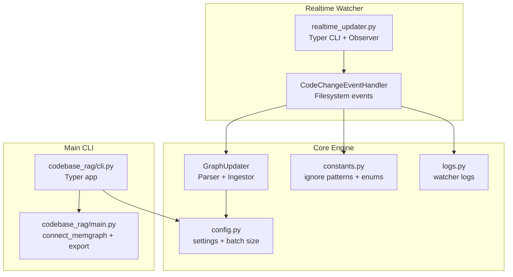
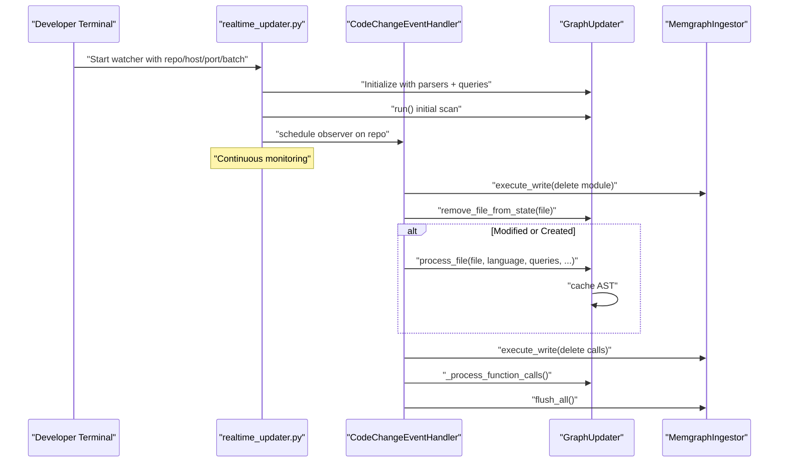
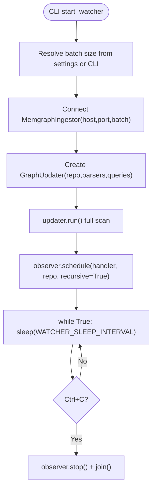
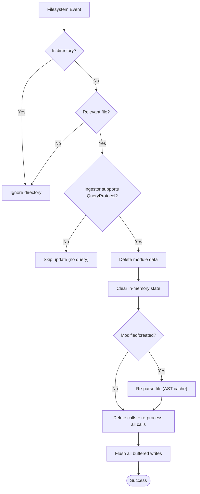
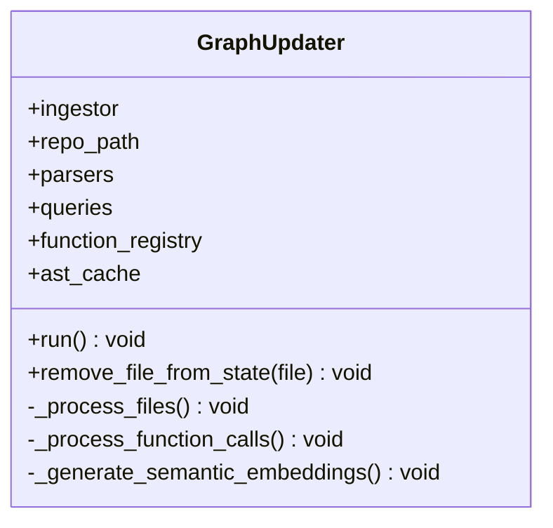
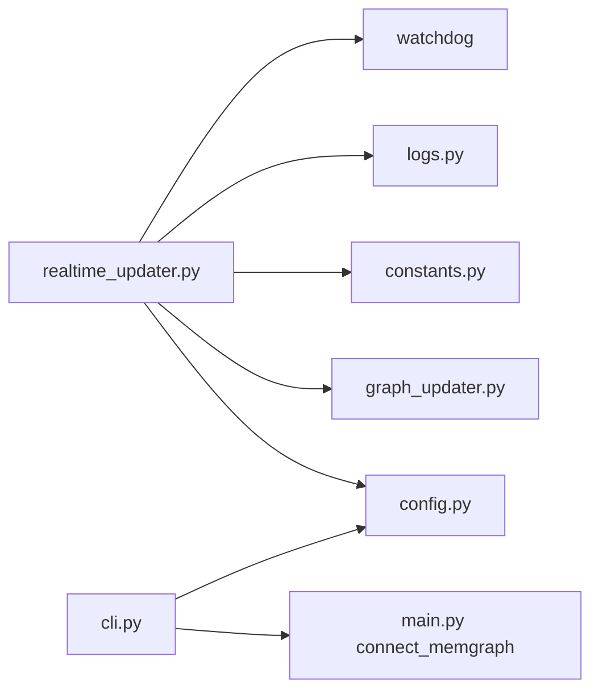

# Workflow Integration

<cite>
**Referenced Files in This Document**
- [realtime_updater.py](file://realtime_updater.py)
- [codebase_rag/cli.py](file://codebase_rag/cli.py)
- [codebase_rag/main.py](file://codebase_rag/main.py)
- [codebase_rag/config.py](file://codebase_rag/config.py)
- [codebase_rag/graph_updater.py](file://codebase_rag/graph_updater.py)
- [codebase_rag/cli_help.py](file://codebase_rag/cli_help.py)
- [codebase_rag/constants.py](file://codebase_rag/constants.py)
- [codebase_rag/logs.py](file://codebase_rag/logs.py)
- [README.md](file://README.md)
- [docs/claude-code-setup.md](file://docs/claude-code-setup.md)
- [codebase_rag/tests/test_realtime_updater.py](file://codebase_rag/tests/test_realtime_updater.py)
</cite>

## Table of Contents
1. [Introduction](#introduction)
2. [Project Structure](#project-structure)
3. [Core Components](#core-components)
4. [Architecture Overview](#architecture-overview)
5. [Detailed Component Analysis](#detailed-component-analysis)
6. [Dependency Analysis](#dependency-analysis)
7. [Performance Considerations](#performance-considerations)
8. [Troubleshooting Guide](#troubleshooting-guide)
9. [Conclusion](#conclusion)
10. [Appendices](#appendices)

## Introduction
This document explains how to integrate real-time updates into development workflows using the realtime watcher. It covers:
- How to run the realtime watcher alongside development terminals and IDEs
- CLI arguments and configuration options for host, port, and batch size
- Multi-terminal and multi-repository scenarios
- Startup sequence: initial scan and continuous monitoring
- Best practices for balancing real-time synchronization with development efficiency
- Common workflow patterns: pair programming, automated testing, CI
- Potential conflicts with other file watchers and development tools

## Project Structure
The realtime watcher is implemented as a standalone CLI entrypoint that complements the main Graph-Code CLI. The key pieces are:
- Realtime watcher entrypoint and handler
- GraphUpdater for parsing and graph updates
- Configuration and settings for Memgraph connectivity and batching
- Logging and constants for ignore patterns and watcher behavior

**Diagram sources**
- [realtime_updater.py](file://realtime_updater.py#L114-L184)
- [codebase_rag/graph_updater.py](file://codebase_rag/graph_updater.py#L223-L469)
- [codebase_rag/config.py](file://codebase_rag/config.py#L227-L231)
- [codebase_rag/constants.py](file://codebase_rag/constants.py#L780-L800)
- [codebase_rag/logs.py](file://codebase_rag/logs.py#L98-L109)
- [codebase_rag/cli.py](file://codebase_rag/cli.py#L26-L395)
- [codebase_rag/main.py](file://codebase_rag/main.py#L737-L742)

**Section sources**
- [realtime_updater.py](file://realtime_updater.py#L1-L184)
- [codebase_rag/graph_updater.py](file://codebase_rag/graph_updater.py#L1-L469)
- [codebase_rag/config.py](file://codebase_rag/config.py#L1-L274)
- [codebase_rag/constants.py](file://codebase_rag/constants.py#L1-L800)
- [codebase_rag/logs.py](file://codebase_rag/logs.py#L1-L622)
- [codebase_rag/cli.py](file://codebase_rag/cli.py#L1-L395)
- [codebase_rag/main.py](file://codebase_rag/main.py#L737-L742)

## Core Components
- Realtime watcher entrypoint: parses CLI arguments, configures logging, and starts the filesystem observer.
- CodeChangeEventHandler: filters relevant files, deletes old graph data, clears in-memory state, re-parses modified files, recalculates function calls, and flushes to Memgraph.
- GraphUpdater: orchestrates parsing passes, maintains caches, and coordinates ingestion.
- Configuration: resolves batch size and defaults for Memgraph host/port.
- Constants and logs: define ignore patterns and watcher lifecycle messages.

Key responsibilities:
- Watch repository recursively for file changes
- Maintain a clean, consistent graph state
- Recalculate call relationships to prevent “islands”
- Respect ignore patterns and file types

**Section sources**
- [realtime_updater.py](file://realtime_updater.py#L34-L150)
- [codebase_rag/graph_updater.py](file://codebase_rag/graph_updater.py#L223-L469)
- [codebase_rag/config.py](file://codebase_rag/config.py#L227-L231)
- [codebase_rag/constants.py](file://codebase_rag/constants.py#L780-L800)
- [codebase_rag/logs.py](file://codebase_rag/logs.py#L98-L109)

## Architecture Overview
The realtime watcher runs a long-lived process that:
1. Initializes parsers and connects to Memgraph with a configurable batch size
2. Performs an initial full scan to establish baseline graph state
3. Starts a watchdog Observer to monitor the repository
4. On each relevant change, updates the graph atomically and flushes

**Diagram sources**
- [realtime_updater.py](file://realtime_updater.py#L114-L149)
- [codebase_rag/graph_updater.py](file://codebase_rag/graph_updater.py#L264-L284)
- [codebase_rag/graph_updater.py](file://codebase_rag/graph_updater.py#L349-L355)

**Section sources**
- [realtime_updater.py](file://realtime_updater.py#L114-L149)
- [codebase_rag/graph_updater.py](file://codebase_rag/graph_updater.py#L264-L284)

## Detailed Component Analysis

### Realtime Watcher Entry Point
- CLI arguments:
  - repo_path (positional)
  - --host (default from settings)
  - --port (default from settings)
  - --batch-size (optional; validated to be positive)
- Logging is configured for the watcher
- start_watcher initializes MemgraphIngestor with host/port/batch and runs the watcher loop
- _run_watcher_loop:
  - Creates GraphUpdater
  - Runs initial scan
  - Schedules CodeChangeEventHandler on repo_path
  - Keeps process alive until interrupted

**Diagram sources**
- [realtime_updater.py](file://realtime_updater.py#L114-L149)
- [codebase_rag/config.py](file://codebase_rag/config.py#L227-L231)

**Section sources**
- [realtime_updater.py](file://realtime_updater.py#L114-L184)
- [codebase_rag/config.py](file://codebase_rag/config.py#L227-L231)

### CodeChangeEventHandler
Responsibilities:
- Filter out directories and ignored file types/suffixes
- For relevant files:
  - Delete module data from graph
  - Remove file from in-memory state
  - Re-parse if modified/created
  - Recalculate all function calls to ensure consistency
  - Flush all buffered writes
- Skip updates if ingestor lacks query capability

**Diagram sources**
- [realtime_updater.py](file://realtime_updater.py#L34-L112)
- [codebase_rag/graph_updater.py](file://codebase_rag/graph_updater.py#L287-L355)

**Section sources**
- [realtime_updater.py](file://realtime_updater.py#L34-L112)
- [codebase_rag/graph_updater.py](file://codebase_rag/graph_updater.py#L287-L355)

### GraphUpdater
- run():
  - Ensures project node
  - Pass 1: structure identification
  - Pass 2: file processing and AST caching
  - Pass 3: function call processing
  - Pass 4: optional semantic embeddings
  - Final flush
- remove_file_from_state():
  - Removes AST cache entry
  - Removes function registry entries under the module
  - Cleans simple name lookups
- _process_function_calls():
  - Iterates cached ASTs and processes calls

**Diagram sources**
- [codebase_rag/graph_updater.py](file://codebase_rag/graph_updater.py#L223-L469)

**Section sources**
- [codebase_rag/graph_updater.py](file://codebase_rag/graph_updater.py#L223-L469)

### Configuration and CLI Help
- CLI help defines:
  - --host, --port, --batch-size
  - repo path for watching
- Config settings:
  - MEMGRAPH_HOST, MEMGRAPH_PORT, MEMGRAPH_BATCH_SIZE
  - resolve_batch_size validates and returns effective batch size
- Main CLI also exposes batch-size for other commands

**Section sources**
- [codebase_rag/cli_help.py](file://codebase_rag/cli_help.py#L34-L66)
- [codebase_rag/config.py](file://codebase_rag/config.py#L50-L56)
- [codebase_rag/config.py](file://codebase_rag/config.py#L227-L231)
- [codebase_rag/cli.py](file://codebase_rag/cli.py#L91-L96)

## Dependency Analysis
- Realtime watcher depends on:
  - watchdog Observer/EventHandler for filesystem events
  - GraphUpdater for parsing and ingestion
  - MemgraphIngestor for graph writes
  - Settings for host/port/batch
  - Constants for ignore patterns
  - Logs for watcher messages
- The main CLI depends on the same ingestor and settings for batch sizing

**Diagram sources**
- [realtime_updater.py](file://realtime_updater.py#L1-L32)
- [codebase_rag/cli.py](file://codebase_rag/cli.py#L12-L23)
- [codebase_rag/main.py](file://codebase_rag/main.py#L737-L742)

**Section sources**
- [realtime_updater.py](file://realtime_updater.py#L1-L32)
- [codebase_rag/cli.py](file://codebase_rag/cli.py#L12-L23)
- [codebase_rag/main.py](file://codebase_rag/main.py#L737-L742)

## Performance Considerations
- Recalculation cost: The watcher recalculates all function call relationships after each change to prevent “islands.” This ensures consistency but can be expensive on large codebases with frequent changes.
- Batch size: Larger batch sizes reduce flush overhead but increase memory usage. Tune --batch-size according to available RAM and update frequency.
- Ignore patterns: The watcher ignores common directories and file types to minimize unnecessary updates.
- Recommendations:
  - Use a dedicated terminal for the watcher during active development
  - Increase batch size for large repos or slow networks
  - Limit concurrent editors to reduce churn
  - Consider disabling real-time updates during heavy refactoring and re-enable afterward

**Section sources**
- [README.md](file://README.md#L330-L331)
- [codebase_rag/constants.py](file://codebase_rag/constants.py#L780-L800)
- [codebase_rag/config.py](file://codebase_rag/config.py#L227-L231)

## Troubleshooting Guide
- Memgraph connection failures:
  - Ensure Memgraph is running and reachable at the configured host/port
  - Verify batch size is valid (positive integer)
- Conflicts with other file watchers:
  - The watcher filters out ignored directories and file types
  - If multiple tools write to the same repo, staggering updates can help
- No updates triggered:
  - Confirm the repo path is correct and writable
  - Check that the file type is supported and not ignored
- Tests confirm expected behavior:
  - Creation/modification triggers parsing and flush
  - Deletion triggers deletion queries and flush
  - Ignored directories and unsupported files are skipped

**Section sources**
- [codebase_rag/tests/test_realtime_updater.py](file://codebase_rag/tests/test_realtime_updater.py#L21-L119)
- [codebase_rag/logs.py](file://codebase_rag/logs.py#L155-L194)

## Conclusion
The realtime watcher provides a robust mechanism to keep the knowledge graph synchronized with active development. By combining an initial scan with continuous monitoring and atomic updates, it maintains consistency across function calls and module boundaries. Proper configuration of host, port, and batch size, along with awareness of ignore patterns and performance trade-offs, enables efficient integration into diverse development workflows.

## Appendices

### CLI Arguments and Configuration Options
- Realtime watcher CLI:
  - Positional: repo_path
  - --host: Memgraph host (default from settings)
  - --port: Memgraph port (default from settings)
  - --batch-size: Buffer size before flush (validated positive)
- Main CLI batch-size option:
  - Shared across commands for controlling flush behavior

**Section sources**
- [realtime_updater.py](file://realtime_updater.py#L160-L179)
- [codebase_rag/cli_help.py](file://codebase_rag/cli_help.py#L34-L66)
- [codebase_rag/config.py](file://codebase_rag/config.py#L227-L231)
- [codebase_rag/cli.py](file://codebase_rag/cli.py#L91-L96)

### Multi-Terminal and Multi-Repository Scenarios
- Multi-terminal workflow:
  - Terminal 1: Watcher for real-time updates
  - Terminal 2: Main CLI for querying and editing
- Multi-repository:
  - Run separate watchers for each repo
  - Alternatively, re-run the watcher after switching repos
- MCP server integration:
  - Use the MCP server for IDE integrations (e.g., Claude Code)
  - Configure TARGET_REPO_PATH and provider settings

**Section sources**
- [README.md](file://README.md#L321-L329)
- [docs/claude-code-setup.md](file://docs/claude-code-setup.md#L1-L137)

### Startup Sequence Details
- Initial scan:
  - Builds project node, identifies structure, processes files, recalculates calls, generates embeddings, and flushes
- Continuous monitoring:
  - Starts observer, logs watching, and keeps process alive until interrupted

**Section sources**
- [realtime_updater.py](file://realtime_updater.py#L130-L149)
- [codebase_rag/graph_updater.py](file://codebase_rag/graph_updater.py#L264-L284)
- [codebase_rag/logs.py](file://codebase_rag/logs.py#L105-L107)

### Best Practices
- Pair programming:
  - Keep the watcher running in a shared terminal for both developers
  - Use consistent ignore patterns across machines
- Automated testing:
  - Disable real-time updates during test runs to avoid interference
  - Re-enable after tests complete
- CI:
  - Use the main CLI to build/update the graph as part of pipeline steps
  - Optionally export the graph for downstream analysis

**Section sources**
- [README.md](file://README.md#L290-L331)