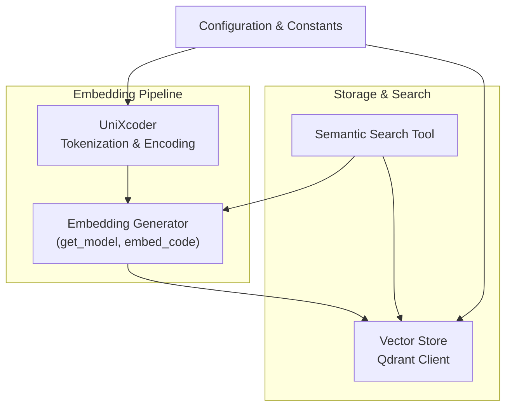
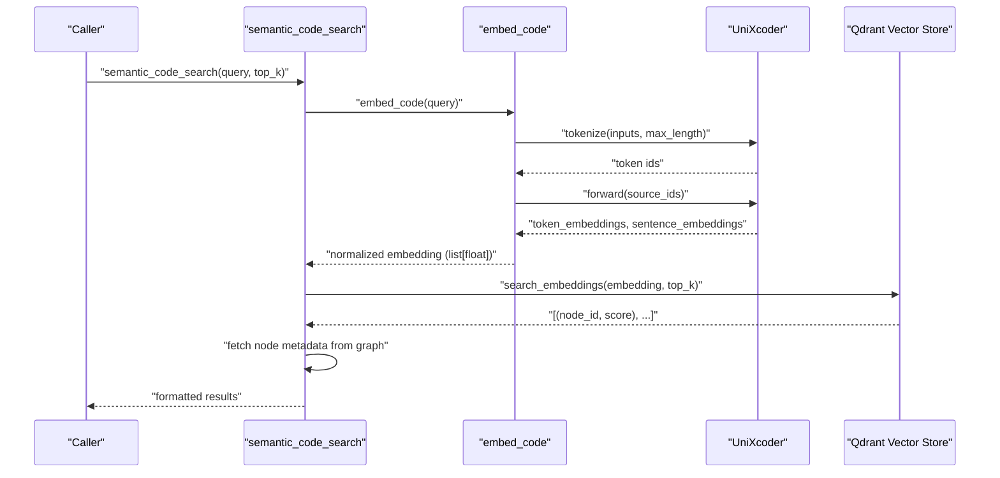
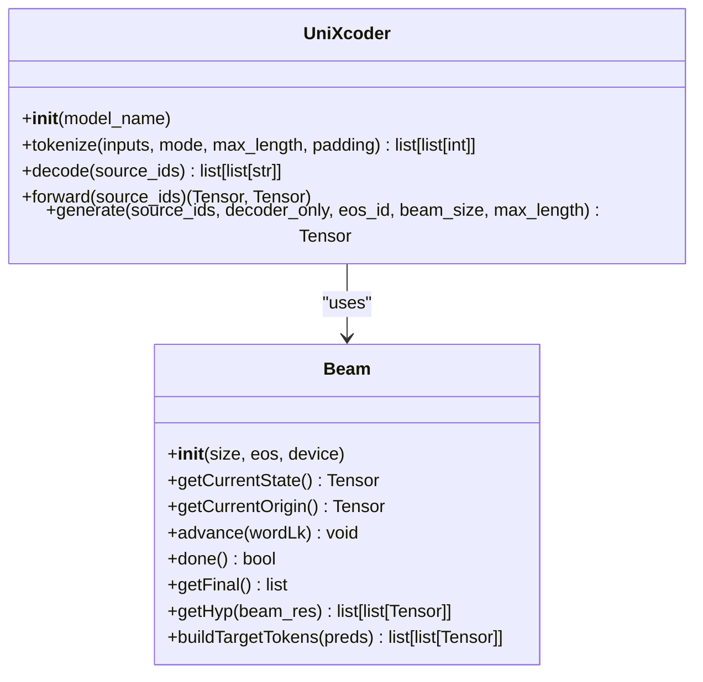
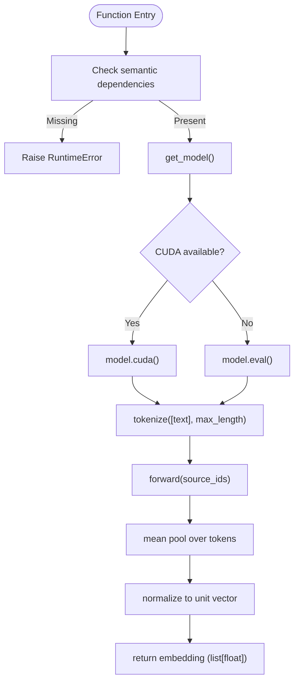
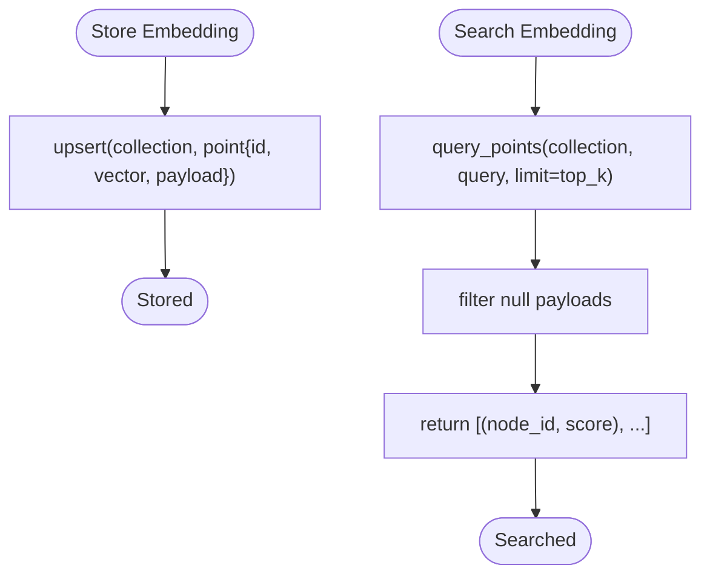
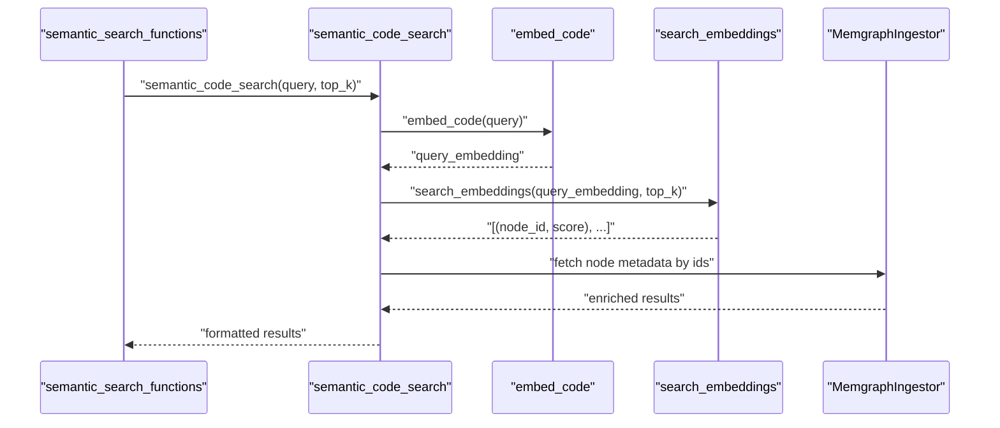
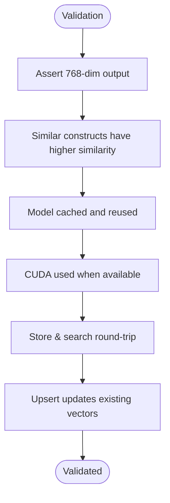
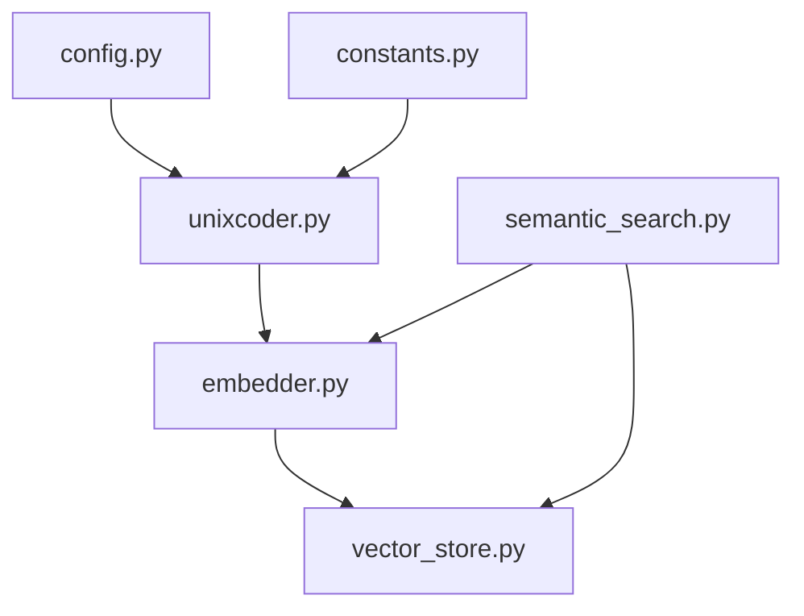

# Embedding System

<cite>
**Referenced Files in This Document**
- [unixcoder.py](file://codebase_rag/unixcoder.py)
- [embedder.py](file://codebase_rag/embedder.py)
- [vector_store.py](file://codebase_rag/vector_store.py)
- [semantic_search.py](file://codebase_rag/tools/semantic_search.py)
- [constants.py](file://codebase_rag/constants.py)
- [config.py](file://codebase_rag/config.py)
- [test_embedder.py](file://codebase_rag/tests/test_embedder.py)
- [test_unixcoder_unit.py](file://codebase_rag/tests/test_unixcoder_unit.py)
- [test_vector_store.py](file://codebase_rag/tests/test_vector_store.py)
</cite>

## Table of Contents
1. [Introduction](#introduction)
2. [Project Structure](#project-structure)
3. [Core Components](#core-components)
4. [Architecture Overview](#architecture-overview)
5. [Detailed Component Analysis](#detailed-component-analysis)
6. [Dependency Analysis](#dependency-analysis)
7. [Performance Considerations](#performance-considerations)
8. [Troubleshooting Guide](#troubleshooting-guide)
9. [Conclusion](#conclusion)
10. [Appendices](#appendices)

## Introduction
This document explains the Graph-Code embedding system powered by UniXcoder. It covers how code snippets and natural language queries are converted into dense vector representations, how UniXcoder tokenization and encoding work, and how the resulting embeddings are stored and searched. It also documents embedding quality validation, caching strategies, batch processing, and how embeddings enable semantic similarity search beyond exact keyword matching.

## Project Structure
The embedding system spans several modules:
- UniXcoder model wrapper and beam search utilities
- Embedding generation pipeline and model caching
- Vector storage and retrieval using Qdrant
- Semantic search orchestration and result formatting
- Configuration and constants for model, dimensions, and limits

**Diagram sources**
- [unixcoder.py](file://codebase_rag/unixcoder.py#L12-L190)
- [embedder.py](file://codebase_rag/embedder.py#L1-L120)
- [vector_store.py](file://codebase_rag/vector_store.py#L14-L81)
- [semantic_search.py](file://codebase_rag/tools/semantic_search.py#L18-L78)
- [config.py](file://codebase_rag/config.py#L144-L155)
- [constants.py](file://codebase_rag/constants.py#L148-L149)

**Section sources**
- [unixcoder.py](file://codebase_rag/unixcoder.py#L12-L190)
- [embedder.py](file://codebase_rag/embedder.py#L1-L120)
- [vector_store.py](file://codebase_rag/vector_store.py#L14-L81)
- [semantic_search.py](file://codebase_rag/tools/semantic_search.py#L18-L78)
- [config.py](file://codebase_rag/config.py#L144-L155)
- [constants.py](file://codebase_rag/constants.py#L148-L149)

## Core Components
- UniXcoder model wrapper: Provides tokenization, encoding, and sentence embedding extraction.
- Embedding generator: Manages model initialization, device placement, and embedding computation.
- Vector store: Stores and retrieves embeddings using Qdrant with cosine distance.
- Semantic search tool: Orchestrates embedding generation, vector search, and result formatting.
- Configuration and constants: Define model name, vector dimension, max length, and cache parameters.

Key responsibilities:
- Tokenization with mode-aware prefix/suffix handling and optional padding
- Sentence embedding via mean pooling over token embeddings with attention masking
- Persistent storage and similarity search with configurable top-k
- Validation via unit and integration tests

**Section sources**
- [unixcoder.py](file://codebase_rag/unixcoder.py#L39-L107)
- [embedder.py](file://codebase_rag/embedder.py#L24-L60)
- [vector_store.py](file://codebase_rag/vector_store.py#L27-L68)
- [semantic_search.py](file://codebase_rag/tools/semantic_search.py#L18-L78)
- [config.py](file://codebase_rag/config.py#L144-L155)
- [constants.py](file://codebase_rag/constants.py#L148-L149)

## Architecture Overview
The embedding workflow integrates tokenization, encoding, and vector normalization into a cohesive pipeline. The semantic search tool coordinates embedding generation and vector search, then enriches results with graph metadata.

**Diagram sources**
- [semantic_search.py](file://codebase_rag/tools/semantic_search.py#L18-L78)
- [embedder.py](file://codebase_rag/embedder.py#L31-L60)
- [unixcoder.py](file://codebase_rag/unixcoder.py#L97-L107)
- [vector_store.py](file://codebase_rag/vector_store.py#L50-L68)

## Detailed Component Analysis

### UniXcoder Model Integration
UniXcoder wraps a RoBERTa-based architecture to produce token and sentence embeddings. It supports three modes for tokenization and includes a beam search helper class for generation tasks.

Key behaviors:
- Tokenization adapts to mode-specific prefixes and trims/appends tokens accordingly
- Forward pass computes token embeddings and sentence embeddings via masked mean pooling
- Generation uses cached key-value pairs and beam search for decoding

**Diagram sources**
- [unixcoder.py](file://codebase_rag/unixcoder.py#L12-L190)

**Section sources**
- [unixcoder.py](file://codebase_rag/unixcoder.py#L39-L107)
- [unixcoder.py](file://codebase_rag/unixcoder.py#L192-L279)

### Embedding Generation Pipeline
The embedding generator initializes the UniXcoder model, manages device placement, caches the model instance, and produces normalized embeddings for input code or queries.

Validation highlights:
- Unit tests confirm 768-dimensional output and default max length behavior
- Model caching ensures single instance reuse
- CUDA detection drives device selection

**Diagram sources**
- [embedder.py](file://codebase_rag/embedder.py#L24-L60)
- [unixcoder.py](file://codebase_rag/unixcoder.py#L39-L107)
- [test_embedder.py](file://codebase_rag/tests/test_embedder.py#L48-L147)

**Section sources**
- [embedder.py](file://codebase_rag/embedder.py#L24-L60)
- [test_embedder.py](file://codebase_rag/tests/test_embedder.py#L48-L147)

### Vector Storage and Retrieval
Embeddings are persisted in Qdrant with cosine distance and retrieved using similarity search. The vector store handles client initialization, upserts, and query execution with safe error handling.

Operational notes:
- Collection creation with configured vector dimension and distance
- Default top_k fallback and exception logging
- Round-trip and update verification in integration tests

**Diagram sources**
- [vector_store.py](file://codebase_rag/vector_store.py#L27-L68)
- [test_vector_store.py](file://codebase_rag/tests/test_vector_store.py#L67-L203)

**Section sources**
- [vector_store.py](file://codebase_rag/vector_store.py#L14-L81)
- [test_vector_store.py](file://codebase_rag/tests/test_vector_store.py#L67-L203)

### Semantic Search Orchestration
The semantic search tool integrates embedding generation and vector search, then enriches results with graph metadata and formats them for presentation.

**Diagram sources**
- [semantic_search.py](file://codebase_rag/tools/semantic_search.py#L121-L143)
- [semantic_search.py](file://codebase_rag/tools/semantic_search.py#L18-L78)

**Section sources**
- [semantic_search.py](file://codebase_rag/tools/semantic_search.py#L18-L78)

### Embedding Quality and Validation
Quality checks include:
- Dimensionality validation: embeddings are 768-dimensional
- Similarity semantics: structurally similar code yields higher cosine similarity
- Model caching correctness and device placement behavior
- Vector store round-trip and update semantics

**Diagram sources**
- [test_embedder.py](file://codebase_rag/tests/test_embedder.py#L48-L185)
- [test_vector_store.py](file://codebase_rag/tests/test_vector_store.py#L207-L243)

**Section sources**
- [test_embedder.py](file://codebase_rag/tests/test_embedder.py#L48-L185)
- [test_vector_store.py](file://codebase_rag/tests/test_vector_store.py#L207-L243)

### Examples of Embedding Different Code Constructs
The system can embed:
- Functions and methods
- Classes and interfaces
- Modules and packages
- Natural language queries for semantic matching

Embedding workflow remains consistent: tokenize, encode, pool to sentence embedding, normalize, and store/search.

[No sources needed since this section describes conceptual usage without analyzing specific files]

## Dependency Analysis
The embedding system depends on:
- Torch and Transformers for model loading and inference
- Qdrant client for vector storage and search
- Configuration for model name, vector dimension, and limits
- Constants for model identifiers and mode enumerations

**Diagram sources**
- [config.py](file://codebase_rag/config.py#L144-L155)
- [constants.py](file://codebase_rag/constants.py#L148-L149)
- [unixcoder.py](file://codebase_rag/unixcoder.py#L12-L36)
- [embedder.py](file://codebase_rag/embedder.py#L24-L60)
- [vector_store.py](file://codebase_rag/vector_store.py#L8-L25)
- [semantic_search.py](file://codebase_rag/tools/semantic_search.py#L24-L27)

**Section sources**
- [config.py](file://codebase_rag/config.py#L144-L155)
- [constants.py](file://codebase_rag/constants.py#L148-L149)
- [unixcoder.py](file://codebase_rag/unixcoder.py#L12-L36)
- [embedder.py](file://codebase_rag/embedder.py#L24-L60)
- [vector_store.py](file://codebase_rag/vector_store.py#L8-L25)
- [semantic_search.py](file://codebase_rag/tools/semantic_search.py#L24-L27)

## Performance Considerations
- Embedding dimension: 768-dimensional vectors are used for balance between expressiveness and memory footprint.
- Memory usage: vector dimension directly impacts RAM and disk usage per stored point.
- Search performance: cosine distance with Qdrant enables efficient similarity search; top_k and index configuration influence latency.
- Batch processing: graph metadata retrieval uses configurable batch sizes to reduce overhead.
- Caching: model singleton via LRU cache avoids repeated initialization and accelerates subsequent embeddings.

[No sources needed since this section provides general guidance]

## Troubleshooting Guide
Common issues and resolutions:
- Missing dependencies: embedding functions raise runtime errors when required libraries are absent.
- Qdrant connectivity: vector store logs warnings on failures and returns empty results gracefully.
- CUDA availability: device selection is automatic; ensure drivers and CUDA toolkit are properly installed.
- Tokenization limits: exceeding maximum context length triggers assertion errors; adjust max_length accordingly.

**Section sources**
- [test_embedder.py](file://codebase_rag/tests/test_embedder.py#L187-L195)
- [vector_store.py](file://codebase_rag/vector_store.py#L45-L48)
- [vector_store.py](file://codebase_rag/vector_store.py#L66-L68)

## Conclusion
The Graph-Code embedding system leverages UniXcoder to transform code and queries into robust 768-dimensional vectors. Through careful tokenization, encoding, and normalization, it enables semantic similarity search that transcends keyword matching. The system’s caching, batching, and vector storage strategies support scalable deployment, while validation tests ensure correctness and reliability.

[No sources needed since this section summarizes without analyzing specific files]

## Appendices

### Configuration Reference
- Qdrant vector dimension: 768
- Default embedding max length: 512
- Default top_k for search: 5
- Cache thresholds and eviction parameters

**Section sources**
- [config.py](file://codebase_rag/config.py#L144-L155)

### Example Embedding Scenarios
- Function embedding: tokenize function signature and body, compute sentence embedding, store and search
- Class embedding: tokenize class definition and members, pool to sentence vector
- Module embedding: tokenize module-level constructs and exports
- Natural language query embedding: tokenize query, encode, and search against stored code vectors

[No sources needed since this section provides conceptual examples]