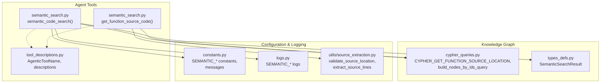
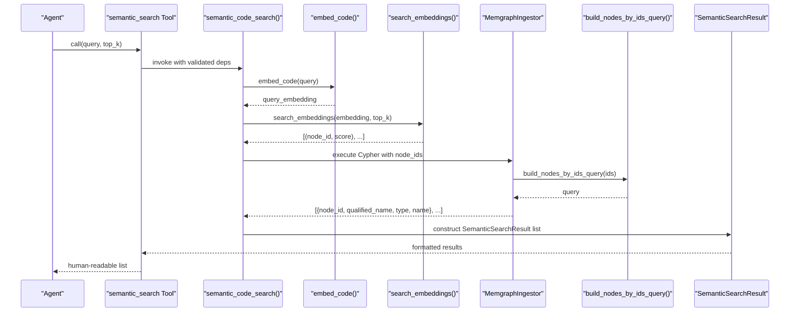
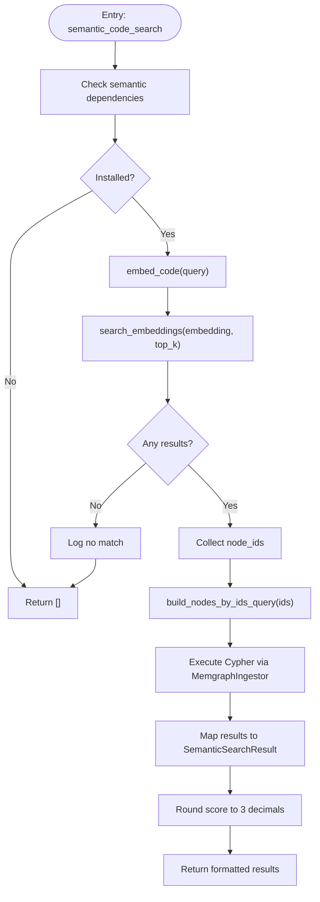
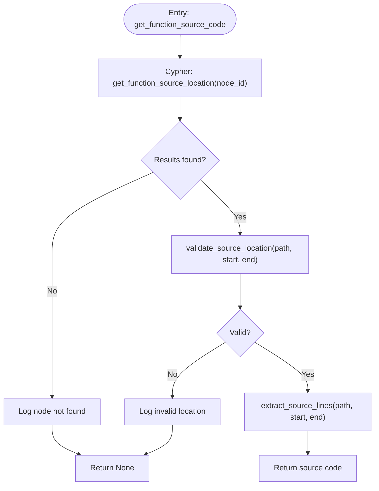
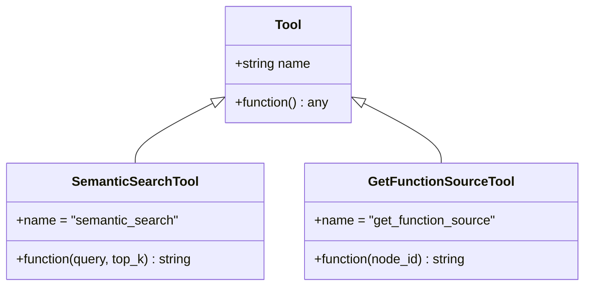
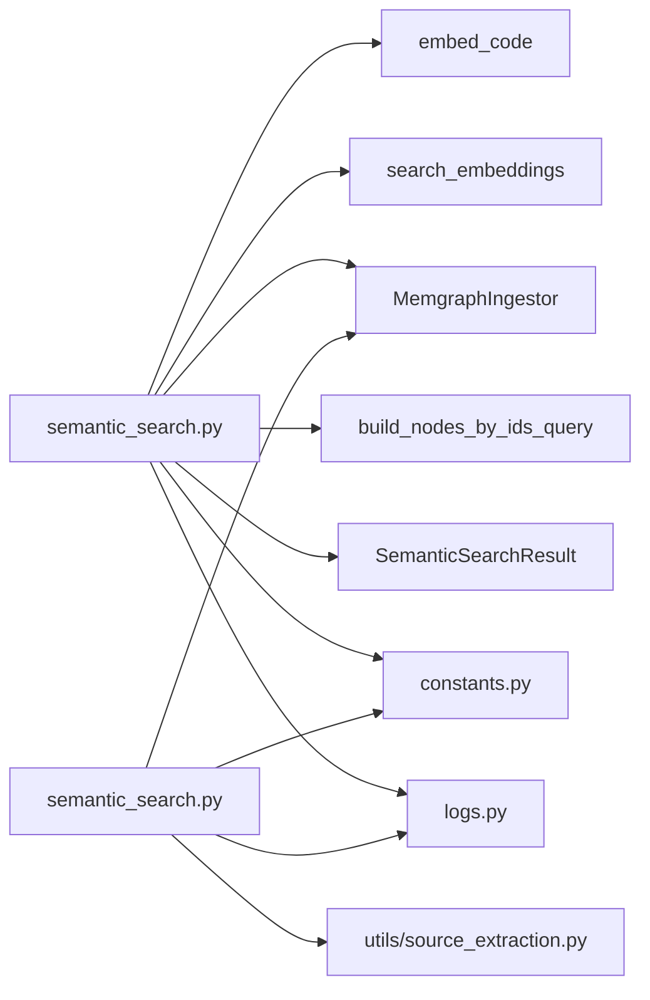

# Search Tools

<cite>
**Referenced Files in This Document**
- [semantic_search.py](file://codebase_rag/tools/semantic_search.py)
- [tool_descriptions.py](file://codebase_rag/tools/tool_descriptions.py)
- [cypher_queries.py](file://codebase_rag/cypher_queries.py)
- [types_defs.py](file://codebase_rag/types_defs.py)
- [constants.py](file://codebase_rag/constants.py)
- [logs.py](file://codebase_rag/logs.py)
- [source_extraction.py](file://codebase_rag/utils/source_extraction.py)
- [test_semantic_search.py](file://codebase_rag/tests/test_semantic_search.py)
- [mcp/tools.py](file://codebase_rag/mcp/tools.py)
- [mcp/server.py](file://codebase_rag/mcp/server.py)
</cite>

## Table of Contents
1. [Introduction](#introduction)
2. [Project Structure](#project-structure)
3. [Core Components](#core-components)
4. [Architecture Overview](#architecture-overview)
5. [Detailed Component Analysis](#detailed-component-analysis)
6. [Dependency Analysis](#dependency-analysis)
7. [Performance Considerations](#performance-considerations)
8. [Troubleshooting Guide](#troubleshooting-guide)
9. [Conclusion](#conclusion)
10. [Appendices](#appendices)

## Introduction
This document explains the semantic search tools available in Graph-Code, focusing on:
- semantic_code_search: finds functions by purpose using semantic embeddings and a knowledge graph.
- get_function_source_code: retrieves the source code for a function given its internal node ID.
It also covers tool registration and integration with the agent framework, parameter validation and response formatting, usage patterns, async implementation, error handling, configuration options, customization possibilities, and security considerations.

## Project Structure
The semantic search tools live under the tools module and integrate with the knowledge graph via Cypher queries and vector search. They rely on shared constants, logging, and utilities for source extraction.

**Diagram sources**
- [semantic_search.py](file://codebase_rag/tools/semantic_search.py#L18-L156)
- [tool_descriptions.py](file://codebase_rag/tools/tool_descriptions.py#L8-L19)
- [cypher_queries.py](file://codebase_rag/cypher_queries.py#L67-L94)
- [types_defs.py](file://codebase_rag/types_defs.py#L193-L200)
- [constants.py](file://codebase_rag/constants.py#L1113-L1128)
- [logs.py](file://codebase_rag/logs.py#L267-L275)
- [source_extraction.py](file://codebase_rag/utils/source_extraction.py#L12-L75)

**Section sources**
- [semantic_search.py](file://codebase_rag/tools/semantic_search.py#L1-L156)
- [tool_descriptions.py](file://codebase_rag/tools/tool_descriptions.py#L1-L160)
- [cypher_queries.py](file://codebase_rag/cypher_queries.py#L1-L120)
- [types_defs.py](file://codebase_rag/types_defs.py#L193-L200)
- [constants.py](file://codebase_rag/constants.py#L1113-L1128)
- [logs.py](file://codebase_rag/logs.py#L267-L275)
- [source_extraction.py](file://codebase_rag/utils/source_extraction.py#L1-L75)

## Core Components
- semantic_code_search(query: str, top_k: int = 5) -> list[SemanticSearchResult]
  - Validates semantic dependencies, embeds the query, performs vector search, resolves node IDs to function metadata via the graph, and returns structured results.
- get_function_source_code(node_id: int) -> str | None
  - Resolves a function’s source location from the graph, validates the file path and line numbers, and extracts the source text.
- Tool wrappers:
  - create_semantic_search_tool() -> Tool
  - create_get_function_source_tool() -> Tool
- Tool descriptions and names:
  - AgenticToolName.SEMANTIC_SEARCH and GET_FUNCTION_SOURCE
  - Descriptions define usage and examples for agents.

Key behaviors:
- Async tool wrappers for agent orchestration.
- Parameter validation and robust error handling with logs and messages.
- Response formatting tailored for agent consumption.

**Section sources**
- [semantic_search.py](file://codebase_rag/tools/semantic_search.py#L18-L156)
- [tool_descriptions.py](file://codebase_rag/tools/tool_descriptions.py#L8-L19)
- [tool_descriptions.py](file://codebase_rag/tools/tool_descriptions.py#L51-L59)
- [types_defs.py](file://codebase_rag/types_defs.py#L193-L200)
- [constants.py](file://codebase_rag/constants.py#L1113-L1128)
- [logs.py](file://codebase_rag/logs.py#L267-L275)

## Architecture Overview
The semantic search pipeline integrates embedding generation, vector search, graph traversal, and source extraction.

**Diagram sources**
- [semantic_search.py](file://codebase_rag/tools/semantic_search.py#L18-L78)
- [cypher_queries.py](file://codebase_rag/cypher_queries.py#L86-L94)
- [types_defs.py](file://codebase_rag/types_defs.py#L193-L200)

**Section sources**
- [semantic_search.py](file://codebase_rag/tools/semantic_search.py#L18-L78)
- [cypher_queries.py](file://codebase_rag/cypher_queries.py#L86-L94)
- [types_defs.py](file://codebase_rag/types_defs.py#L193-L200)

## Detailed Component Analysis

### semantic_code_search(query: str, top_k: int = 5)
Purpose:
- Convert a natural language purpose into a semantic embedding, search nearest neighbors, and enrich results with graph metadata.

Implementation highlights:
- Dependency guard: checks for semantic extras and returns empty results if missing.
- Embedding and vector search: uses embed_code and search_embeddings.
- Graph enrichment: executes a Cypher query to fetch node metadata by IDs.
- Result construction: maps graph fields to SemanticSearchResult with rounded scores and normalized type strings.

**Diagram sources**
- [semantic_search.py](file://codebase_rag/tools/semantic_search.py#L18-L78)
- [cypher_queries.py](file://codebase_rag/cypher_queries.py#L86-L94)
- [types_defs.py](file://codebase_rag/types_defs.py#L193-L200)

**Section sources**
- [semantic_search.py](file://codebase_rag/tools/semantic_search.py#L18-L78)
- [logs.py](file://codebase_rag/logs.py#L267-L269)
- [constants.py](file://codebase_rag/constants.py#L1113-L1128)

### get_function_source_code(node_id: int)
Purpose:
- Retrieve the source code for a function identified by its internal node ID.

Implementation highlights:
- Executes a Cypher query to obtain qualified name, file path, and line numbers.
- Validates source location (path, start/end lines).
- Extracts source lines safely with bounds checking.

**Diagram sources**
- [semantic_search.py](file://codebase_rag/tools/semantic_search.py#L80-L118)
- [cypher_queries.py](file://codebase_rag/cypher_queries.py#L67-L72)
- [source_extraction.py](file://codebase_rag/utils/source_extraction.py#L12-L75)

**Section sources**
- [semantic_search.py](file://codebase_rag/tools/semantic_search.py#L80-L118)
- [source_extraction.py](file://codebase_rag/utils/source_extraction.py#L12-L75)
- [logs.py](file://codebase_rag/logs.py#L271-L272)

### Tool Wrappers and Agent Integration
- create_semantic_search_tool():
  - Async wrapper around semantic_code_search.
  - Formats results into a readable list with counts, qualified names, types, and scores.
  - Uses constants for messages and footers.
- create_get_function_source_tool():
  - Async wrapper around get_function_source_code.
  - Returns either formatted source code or an unavailable message.

**Diagram sources**
- [semantic_search.py](file://codebase_rag/tools/semantic_search.py#L121-L156)
- [tool_descriptions.py](file://codebase_rag/tools/tool_descriptions.py#L8-L19)

**Section sources**
- [semantic_search.py](file://codebase_rag/tools/semantic_search.py#L121-L156)
- [tool_descriptions.py](file://codebase_rag/tools/tool_descriptions.py#L51-L59)
- [constants.py](file://codebase_rag/constants.py#L1113-L1128)

### Tool Descriptions and Usage Patterns
- Tool names:
  - AgenticToolName.SEMANTIC_SEARCH
  - AgenticToolName.GET_FUNCTION_SOURCE
- Descriptions:
  - SEMANTIC_SEARCH: “Performs a semantic search for functions based on a natural language query describing their purpose, returning a list of potential matches with similarity scores.”
  - GET_FUNCTION_SOURCE: “Retrieves the source code for a specific function or method using its internal node ID, typically obtained from a semantic search result.”

Usage patterns:
- Agent asks for functions by purpose → semantic_search → receives ranked matches → selects a function → calls get_function_source with the node ID → receives source code.

**Section sources**
- [tool_descriptions.py](file://codebase_rag/tools/tool_descriptions.py#L51-L59)

### MCP Server Integration
- MCPToolsRegistry registers tools and exposes schemas and handlers.
- While semantic search tools are primarily designed for the agent framework, they can be adapted to MCP by adding entries similar to other tools (schema, handler, returns_json flag).
- The MCP server sets up logging and environment for tool execution.

Practical steps to integrate in MCP:
- Add a ToolMetadata entry for semantic search and source retrieval in the registry.
- Provide input schemas and handler functions mirroring the agent tool signatures.
- Ensure returns_json aligns with tool output format.

**Section sources**
- [mcp/tools.py](file://codebase_rag/mcp/tools.py#L40-L446)
- [mcp/server.py](file://codebase_rag/mcp/server.py#L21-L47)

## Dependency Analysis
- External dependencies:
  - Semantic extras guard ensures optional dependencies are present before running semantic search.
- Internal dependencies:
  - Embedding and vector search services.
  - Graph ingestion client for Cypher execution.
  - Source extraction utilities for safe file access.

**Diagram sources**
- [semantic_search.py](file://codebase_rag/tools/semantic_search.py#L18-L156)
- [cypher_queries.py](file://codebase_rag/cypher_queries.py#L86-L94)
- [types_defs.py](file://codebase_rag/types_defs.py#L193-L200)
- [constants.py](file://codebase_rag/constants.py#L1113-L1128)
- [logs.py](file://codebase_rag/logs.py#L267-L275)
- [source_extraction.py](file://codebase_rag/utils/source_extraction.py#L12-L75)

**Section sources**
- [semantic_search.py](file://codebase_rag/tools/semantic_search.py#L18-L156)
- [constants.py](file://codebase_rag/constants.py#L933-L933)

## Performance Considerations
- top_k tuning:
  - Larger top_k increases recall but may increase downstream graph queries and formatting overhead.
- Batch size:
  - Graph queries use a fixed batch size for node ID resolution.
- Embedding and vector search cost:
  - Offload embeddings to GPU-backed models when available; consider caching repeated queries.
- Source extraction:
  - File I/O is bounded by start_line and end_line; avoid extremely large ranges.

[No sources needed since this section provides general guidance]

## Troubleshooting Guide
Common issues and resolutions:
- No semantic matches:
  - Verify semantic dependencies are installed and embeddings exist.
  - Check logs for “No semantic matches found”.
- Empty results:
  - Ensure vector store contains embeddings for the codebase.
- Invalid source location:
  - Confirm node_id corresponds to a function with valid file path and line numbers.
- Exceptions during retrieval:
  - Inspect logs for “Failed to get source code” and underlying errors.

Operational checks:
- Unit tests validate behavior for empty results, invalid locations, and exceptions.

**Section sources**
- [logs.py](file://codebase_rag/logs.py#L267-L275)
- [test_semantic_search.py](file://codebase_rag/tests/test_semantic_search.py#L138-L152)
- [test_semantic_search.py](file://codebase_rag/tests/test_semantic_search.py#L234-L282)
- [test_semantic_search.py](file://codebase_rag/tests/test_semantic_search.py#L364-L378)
- [test_semantic_search.py](file://codebase_rag/tests/test_semantic_search.py#L427-L442)

## Conclusion
The semantic search tools provide a robust pathway to discover and retrieve function source code using natural language intent. Their agent-friendly design, strong error handling, and clear integration points make them suitable for both autonomous agents and MCP environments. Proper configuration of dependencies, vector embeddings, and graph indexing is essential for reliable operation.

[No sources needed since this section summarizes without analyzing specific files]

## Appendices

### API Definitions and Parameters
- semantic_code_search(query: str, top_k: int = 5) -> list[SemanticSearchResult]
  - Inputs:
    - query: natural language purpose.
    - top_k: number of nearest neighbors to return.
  - Outputs:
    - List of SemanticSearchResult with node_id, qualified_name, name, type, score.
- get_function_source_code(node_id: int) -> str | None
  - Inputs:
    - node_id: internal graph node identifier.
  - Outputs:
    - Source code string or None.

**Section sources**
- [semantic_search.py](file://codebase_rag/tools/semantic_search.py#L18-L118)
- [types_defs.py](file://codebase_rag/types_defs.py#L193-L200)

### Response Formatting
- semantic_search Tool:
  - Header with match count and query.
  - One line per result: index, qualified_name, type, score.
  - Footer guiding next steps (e.g., using qualified names with other tools).
- get_function_source Tool:
  - Success: formatted code block with node ID.
  - Failure: standardized “unavailable” message.

**Section sources**
- [semantic_search.py](file://codebase_rag/tools/semantic_search.py#L121-L156)
- [constants.py](file://codebase_rag/constants.py#L1113-L1128)

### Configuration Options and Customization
- Constants affecting behavior:
  - SEMANTIC_BATCH_SIZE: batch size for graph node queries.
  - SEMANTIC_TYPE_UNKNOWN: fallback type string when label is missing or empty.
  - Messages for tool outputs and errors.
- Customization ideas:
  - Adjust top_k per use case.
  - Extend tool descriptions and messages for domain-specific guidance.
  - Integrate MCP tool entries for server-side orchestration.

**Section sources**
- [constants.py](file://codebase_rag/constants.py#L1113-L1128)

### Security Considerations and Access Control
- Source extraction safety:
  - validate_source_location ensures non-empty path and valid numeric line numbers.
  - extract_source_lines enforces file existence and range checks.
- General safeguards:
  - Restrict file system access to project root via path validators.
  - Avoid exposing internal node IDs externally unless necessary; prefer qualified names for cross-tool workflows.
  - Sanitize tool inputs and log warnings for invalid parameters.

**Section sources**
- [source_extraction.py](file://codebase_rag/utils/source_extraction.py#L12-L75)
- [logs.py](file://codebase_rag/logs.py#L319-L319)