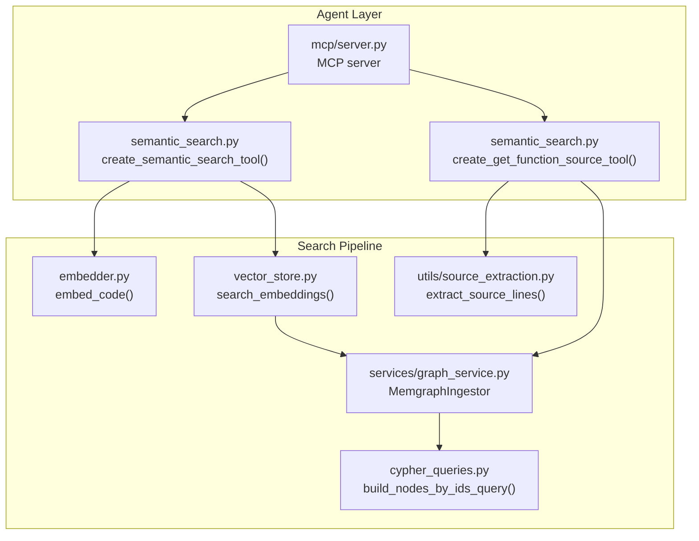
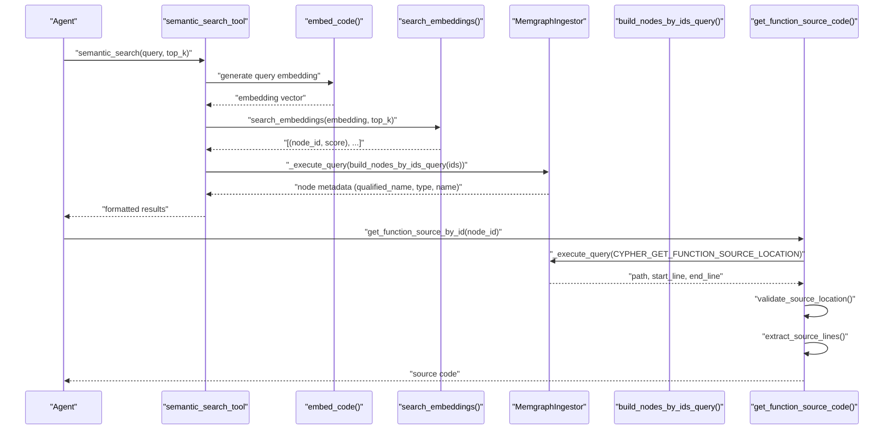
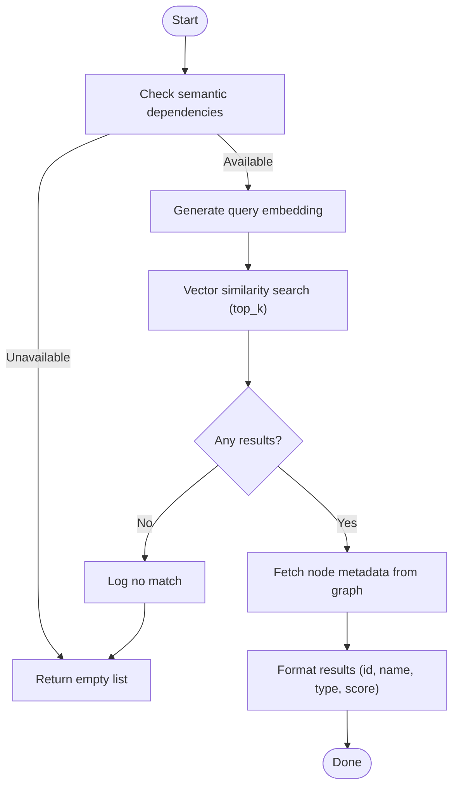
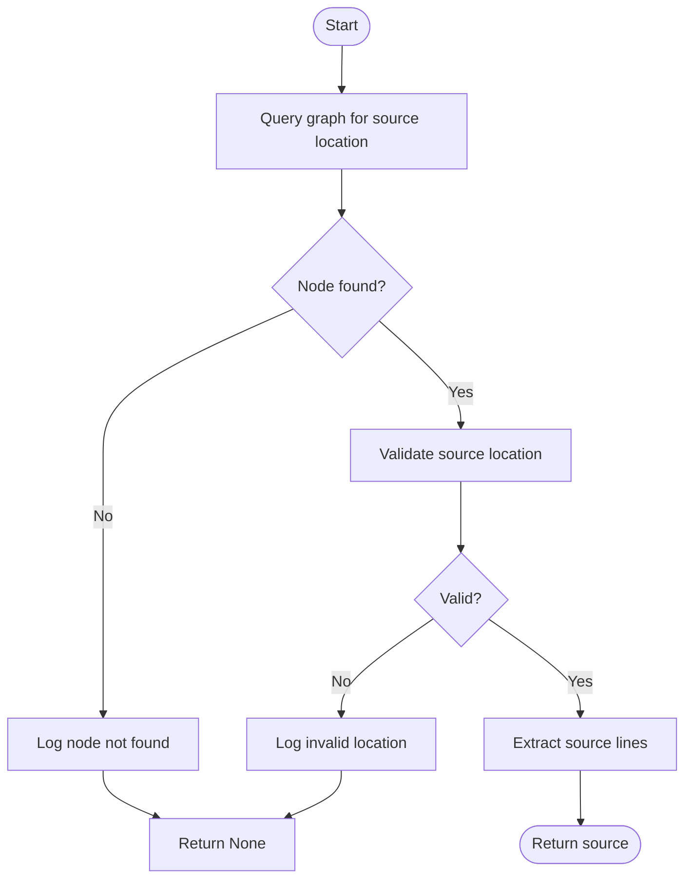
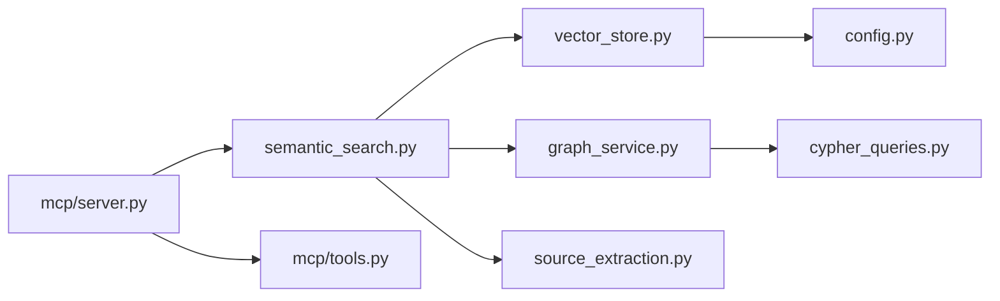

# Search Workflow

<cite>
**Referenced Files in This Document**
- [semantic_search.py](file://codebase_rag/tools/semantic_search.py)
- [vector_store.py](file://codebase_rag/vector_store.py)
- [graph_service.py](file://codebase_rag/services/graph_service.py)
- [cypher_queries.py](file://codebase_rag/cypher_queries.py)
- [source_extraction.py](file://codebase_rag/utils/source_extraction.py)
- [types_defs.py](file://codebase_rag/types_defs.py)
- [server.py](file://codebase_rag/mcp/server.py)
- [tools.py](file://codebase_rag/mcp/tools.py)
- [test_semantic_search.py](file://codebase_rag/tests/test_semantic_search.py)
- [constants.py](file://codebase_rag/constants.py)
- [config.py](file://codebase_rag/config.py)
- [logs.py](file://codebase_rag/logs.py)
</cite>

## Table of Contents
1. [Introduction](#introduction)
2. [Project Structure](#project-structure)
3. [Core Components](#core-components)
4. [Architecture Overview](#architecture-overview)
5. [Detailed Component Analysis](#detailed-component-analysis)
6. [Dependency Analysis](#dependency-analysis)
7. [Performance Considerations](#performance-considerations)
8. [Troubleshooting Guide](#troubleshooting-guide)
9. [Conclusion](#conclusion)
10. [Appendices](#appendices)

## Introduction
This document explains the end-to-end semantic search workflow in Graph-Code. It covers how a natural language query is transformed into executable search results, including embedding generation, similarity search, knowledge graph integration, and result formatting. It also documents agent tool integration via MCP, error handling and fallbacks, query optimization tips, and guidance for interpreting results and measuring quality.

## Project Structure
The semantic search pipeline spans several modules:
- Tools: orchestrate the search and expose agent-friendly APIs
- Vector store: persists and queries embeddings
- Graph service: connects to the knowledge graph (Memgraph) and executes Cypher
- Utilities: source extraction and validation
- MCP server: exposes tools to external agents and clients
- Tests: validate behavior and error paths

**Diagram sources**
- [semantic_search.py](file://codebase_rag/tools/semantic_search.py#L121-L157)
- [vector_store.py](file://codebase_rag/vector_store.py#L50-L68)
- [graph_service.py](file://codebase_rag/services/graph_service.py#L49-L364)
- [cypher_queries.py](file://codebase_rag/cypher_queries.py#L86-L94)
- [source_extraction.py](file://codebase_rag/utils/source_extraction.py#L12-L44)
- [server.py](file://codebase_rag/mcp/server.py#L58-L135)

**Section sources**
- [semantic_search.py](file://codebase_rag/tools/semantic_search.py#L1-L157)
- [vector_store.py](file://codebase_rag/vector_store.py#L1-L81)
- [graph_service.py](file://codebase_rag/services/graph_service.py#L1-L364)
- [cypher_queries.py](file://codebase_rag/cypher_queries.py#L1-L120)
- [source_extraction.py](file://codebase_rag/utils/source_extraction.py#L1-L75)
- [server.py](file://codebase_rag/mcp/server.py#L1-L166)

## Core Components
- Semantic search tool: converts a natural language query into a ranked list of candidate functions/methods by embedding similarity and enriches results with graph metadata.
- Source retrieval tool: resolves a function node ID to its source code using graph metadata and file location validation.
- Vector store: stores and retrieves embeddings using Qdrant with cosine distance.
- Graph service: manages connections to Memgraph, executes Cypher queries, and batches writes.
- MCP server and registry: exposes tools to external agents and handles tool discovery and execution.

Key result model:
- SemanticSearchResult: node_id, qualified_name, name, type, score.

**Section sources**
- [semantic_search.py](file://codebase_rag/tools/semantic_search.py#L18-L78)
- [types_defs.py](file://codebase_rag/types_defs.py#L193-L199)
- [vector_store.py](file://codebase_rag/vector_store.py#L50-L68)
- [graph_service.py](file://codebase_rag/services/graph_service.py#L49-L364)
- [cypher_queries.py](file://codebase_rag/cypher_queries.py#L86-L94)
- [source_extraction.py](file://codebase_rag/utils/source_extraction.py#L12-L44)
- [server.py](file://codebase_rag/mcp/server.py#L58-L135)

## Architecture Overview
The semantic search pipeline follows a deterministic flow from query to results:

**Diagram sources**
- [semantic_search.py](file://codebase_rag/tools/semantic_search.py#L18-L78)
- [vector_store.py](file://codebase_rag/vector_store.py#L50-L68)
- [graph_service.py](file://codebase_rag/services/graph_service.py#L104-L123)
- [cypher_queries.py](file://codebase_rag/cypher_queries.py#L86-L94)
- [source_extraction.py](file://codebase_rag/utils/source_extraction.py#L12-L44)

## Detailed Component Analysis

### Semantic Search Tool
- Purpose: Accepts a natural language query and returns a human-readable list of ranked functions/methods.
- Preprocessing: Delegated to the embedder; the tool passes the raw query string.
- Embedding generation: Uses the configured embedder to produce a dense vector.
- Similarity search: Queries Qdrant for nearest neighbors up to top_k.
- Graph enrichment: Resolves node IDs to metadata (qualified name, type, display name) via Cypher.
- Formatting: Produces a numbered list with type and rounded score.

**Diagram sources**
- [semantic_search.py](file://codebase_rag/tools/semantic_search.py#L18-L78)
- [vector_store.py](file://codebase_rag/vector_store.py#L50-L68)
- [graph_service.py](file://codebase_rag/services/graph_service.py#L104-L123)
- [cypher_queries.py](file://codebase_rag/cypher_queries.py#L86-L94)

**Section sources**
- [semantic_search.py](file://codebase_rag/tools/semantic_search.py#L18-L78)
- [test_semantic_search.py](file://codebase_rag/tests/test_semantic_search.py#L65-L133)

### Source Retrieval Tool
- Purpose: Given a function node ID, returns the source code snippet.
- Steps:
  - Query graph for file path and line range.
  - Validate location (existence, bounds).
  - Extract and return the source lines.

**Diagram sources**
- [semantic_search.py](file://codebase_rag/tools/semantic_search.py#L80-L119)
- [source_extraction.py](file://codebase_rag/utils/source_extraction.py#L12-L44)
- [cypher_queries.py](file://codebase_rag/cypher_queries.py#L67-L72)

**Section sources**
- [semantic_search.py](file://codebase_rag/tools/semantic_search.py#L80-L119)
- [source_extraction.py](file://codebase_rag/utils/source_extraction.py#L12-L44)
- [test_semantic_search.py](file://codebase_rag/tests/test_semantic_search.py#L198-L299)

### Vector Store (Qdrant)
- Stores embeddings with associated payload (node_id, qualified_name).
- Supports cosine distance search.
- Returns pairs of (node_id, score) sorted by similarity.

Operational notes:
- Lazy client initialization and collection creation.
- Graceful failure handling with warnings.

**Section sources**
- [vector_store.py](file://codebase_rag/vector_store.py#L14-L81)
- [constants.py](file://codebase_rag/constants.py#L144-L148)

### Graph Service (Memgraph)
- Provides connection lifecycle, batching, and error logging.
- Executes Cypher queries and returns rows.
- Builds queries for node metadata and source locations.

**Section sources**
- [graph_service.py](file://codebase_rag/services/graph_service.py#L49-L364)
- [cypher_queries.py](file://codebase_rag/cypher_queries.py#L86-L94)
- [cypher_queries.py](file://codebase_rag/cypher_queries.py#L67-L72)

### MCP Server and Tool Registry
- Initializes Memgraph and Cypher generator.
- Exposes a registry of tools (including semantic search and source retrieval).
- Handles tool discovery and execution with structured input schemas.

**Section sources**
- [server.py](file://codebase_rag/mcp/server.py#L58-L135)
- [tools.py](file://codebase_rag/mcp/tools.py#L40-L458)

## Dependency Analysis
- Tools depend on embedder, vector store, and graph service.
- Vector store depends on Qdrant client and configuration.
- Graph service depends on Memgraph client and Cypher builders.
- MCP server composes tools and delegates execution.

**Diagram sources**
- [semantic_search.py](file://codebase_rag/tools/semantic_search.py#L23-L46)
- [vector_store.py](file://codebase_rag/vector_store.py#L14-L25)
- [graph_service.py](file://codebase_rag/services/graph_service.py#L104-L123)
- [cypher_queries.py](file://codebase_rag/cypher_queries.py#L86-L94)
- [source_extraction.py](file://codebase_rag/utils/source_extraction.py#L12-L44)
- [server.py](file://codebase_rag/mcp/server.py#L58-L82)
- [tools.py](file://codebase_rag/mcp/tools.py#L40-L68)

**Section sources**
- [semantic_search.py](file://codebase_rag/tools/semantic_search.py#L23-L77)
- [vector_store.py](file://codebase_rag/vector_store.py#L14-L25)
- [graph_service.py](file://codebase_rag/services/graph_service.py#L104-L123)
- [server.py](file://codebase_rag/mcp/server.py#L58-L82)
- [tools.py](file://codebase_rag/mcp/tools.py#L40-L68)

## Performance Considerations
- Top-K tuning: Adjust Qdrant top_k to balance recall and latency.
- Batch sizes: Memgraph batch size impacts ingestion throughput; tune for your workload.
- Embedding dimensionality: Ensure embedding dimension matches vector store configuration.
- Caching: Consider caching frequent queries and results where appropriate.
- Indexing strategy: Ensure the knowledge graph is indexed and up-to-date before search.

[No sources needed since this section provides general guidance]

## Troubleshooting Guide
Common issues and fallbacks:
- Missing semantic dependencies: The tool returns an empty list and logs a warning.
- Empty search results: Logs “no match” and returns an empty list.
- Exceptions during embedding or search: Logged and results are suppressed.
- Invalid or missing source location: Logs a warning and returns None.
- Graph connectivity errors: Logged with detailed query and parameters; inspect logs for Cypher errors.

Practical checks:
- Verify Qdrant collection exists and is populated.
- Confirm Memgraph connectivity and that node IDs exist.
- Validate file paths and line ranges for source extraction.

**Section sources**
- [semantic_search.py](file://codebase_rag/tools/semantic_search.py#L19-L21)
- [semantic_search.py](file://codebase_rag/tools/semantic_search.py#L33-L35)
- [semantic_search.py](file://codebase_rag/tools/semantic_search.py#L75-L77)
- [semantic_search.py](file://codebase_rag/tools/semantic_search.py#L99-L112)
- [logs.py](file://codebase_rag/logs.py#L267-L276)
- [graph_service.py](file://codebase_rag/services/graph_service.py#L114-L122)

## Conclusion
The semantic search workflow integrates embedding-based similarity with a knowledge graph to deliver context-aware, ranked results and precise source code retrieval. The design emphasizes modularity, robust error handling, and agent-friendly tooling via MCP. Tuning top_k, ensuring graph freshness, and validating source locations are key to reliable operation.

[No sources needed since this section summarizes without analyzing specific files]

## Appendices

### Practical Search Patterns and Optimization Tips
- Prefer explicit, domain-specific terms in queries to improve embedding alignment.
- Use “top_k” judiciously; larger values increase recall but may reduce precision.
- Combine semantic search with graph queries for hybrid filtering (e.g., filter by type or decorator).
- Cache repeated queries and leverage MCP tool reuse to minimize overhead.

[No sources needed since this section provides general guidance]

### Result Interpretation and Confidence Scoring
- Scores are similarity scores returned by the vector store; higher is more similar.
- Round scores to three decimal places for readability.
- Types reflect node labels (e.g., Function, Method) derived from the graph.

**Section sources**
- [semantic_search.py](file://codebase_rag/tools/semantic_search.py#L60-L68)
- [types_defs.py](file://codebase_rag/types_defs.py#L193-L199)

### Tool Integration for Agent-Based Workflows
- Use the MCP server to expose semantic search and source retrieval as tools.
- Clients discover tools via list_tools and call tools with structured inputs.
- The server logs tool invocations and handles unknown tools gracefully.

**Section sources**
- [server.py](file://codebase_rag/mcp/server.py#L96-L135)
- [tools.py](file://codebase_rag/mcp/tools.py#L433-L446)