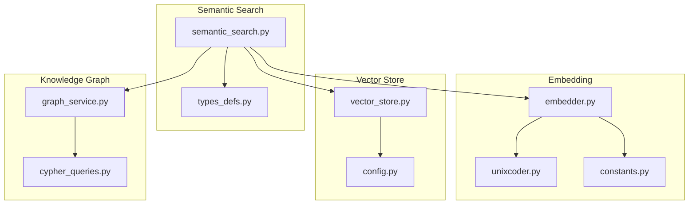
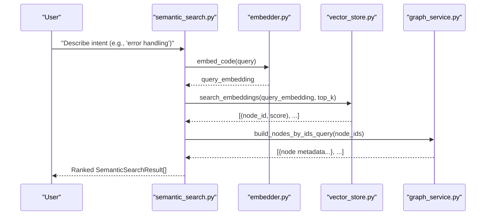
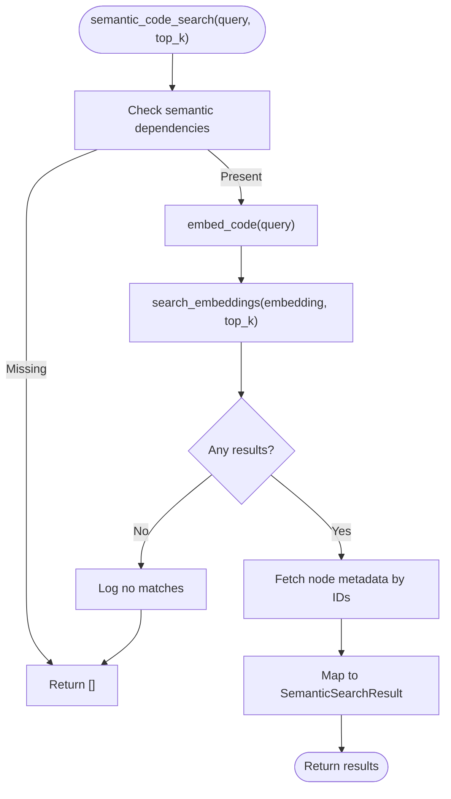
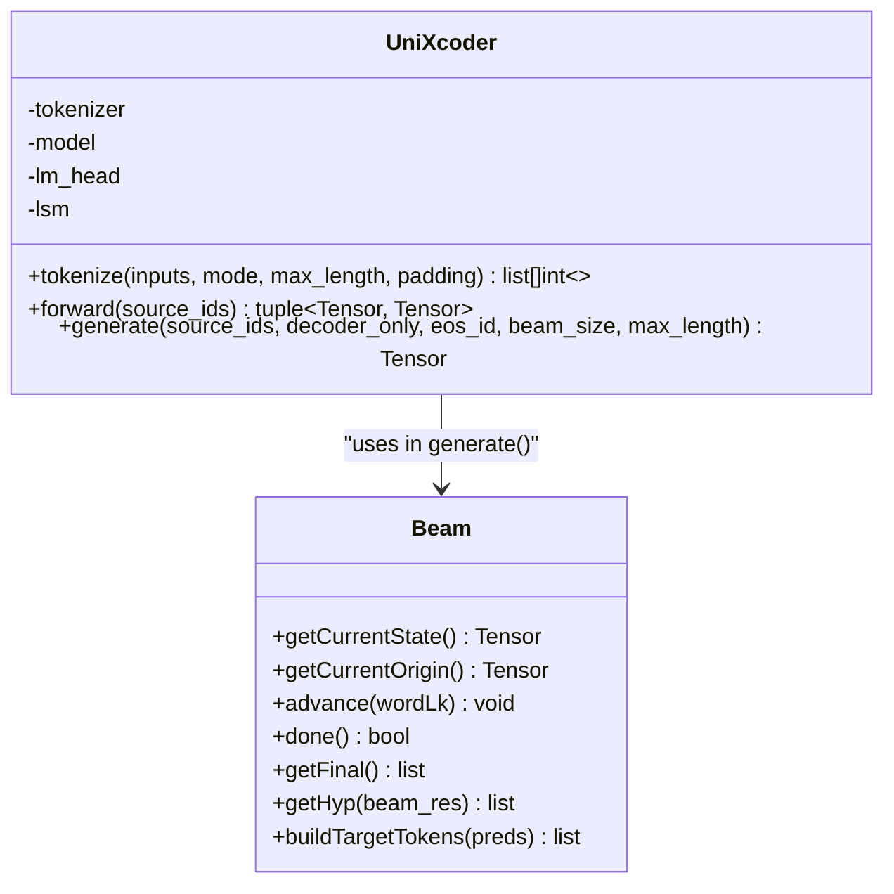
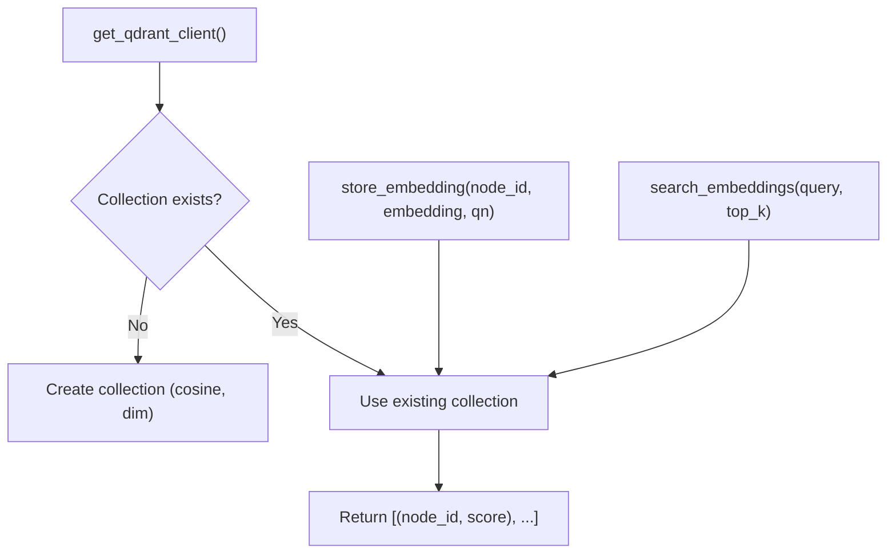
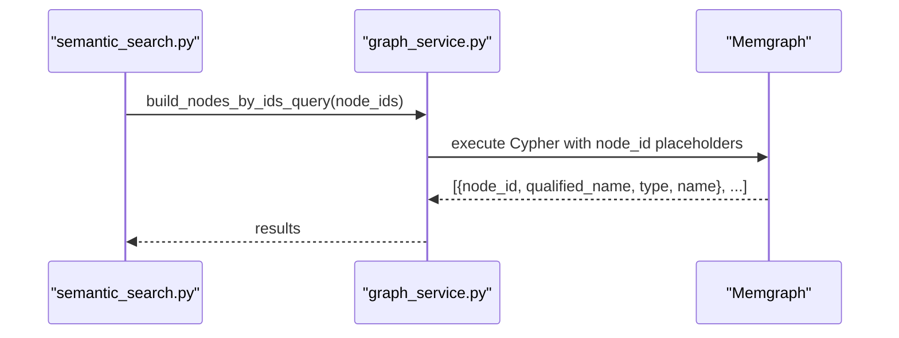
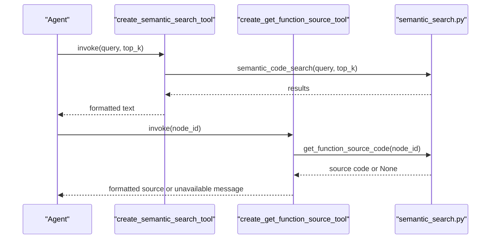
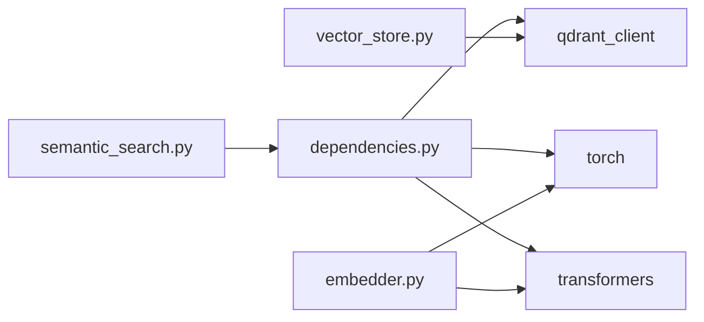

# Semantic Search

<cite>
**Referenced Files in This Document**
- [semantic_search.py](file://codebase_rag/tools/semantic_search.py)
- [unixcoder.py](file://codebase_rag/unixcoder.py)
- [vector_store.py](file://codebase_rag/vector_store.py)
- [embedder.py](file://codebase_rag/embedder.py)
- [constants.py](file://codebase_rag/constants.py)
- [config.py](file://codebase_rag/config.py)
- [types_defs.py](file://codebase_rag/types_defs.py)
- [graph_service.py](file://codebase_rag/services/graph_service.py)
- [cypher_queries.py](file://codebase_rag/cypher_queries.py)
- [dependencies.py](file://codebase_rag/utils/dependencies.py)
- [test_semantic_search.py](file://codebase_rag/tests/test_semantic_search.py)
- [test_vector_store.py](file://codebase_rag/tests/test_vector_store.py)
- [test_unixcoder_unit.py](file://codebase_rag/tests/test_unixcoder_unit.py)
</cite>

## Table of Contents
1. [Introduction](#introduction)
2. [Project Structure](#project-structure)
3. [Core Components](#core-components)
4. [Architecture Overview](#architecture-overview)
5. [Detailed Component Analysis](#detailed-component-analysis)
6. [Dependency Analysis](#dependency-analysis)
7. [Performance Considerations](#performance-considerations)
8. [Troubleshooting Guide](#troubleshooting-guide)
9. [Conclusion](#conclusion)
10. [Appendices](#appendices)

## Introduction
This document explains the Graph-Code semantic search system that enables intent-based code discovery using UniXcoder embeddings. Instead of relying solely on exact function names or keywords, users describe what a function does (intent), and the system retrieves semantically similar functions across the codebase. The system integrates:
- An embedding generator based on UniXcoder
- A vector store powered by Qdrant for efficient similarity search
- A knowledge graph-backed retrieval pipeline using Memgraph
- Tools that expose semantic search and source code retrieval as agent-capable functions

The semantic search workflow transforms a natural language query into a dense vector, performs approximate nearest neighbor search against stored embeddings, and enriches results with metadata from the knowledge graph to produce ranked, context-aware results.

## Project Structure
Key modules involved in semantic search:
- Tools: semantic search orchestration and agent-facing tools
- Embedding: UniXcoder-based sentence embeddings
- Vector store: Qdrant-backed storage and similarity search
- Graph service: Memgraph connectivity and Cypher execution
- Configuration and types: runtime settings, constants, and result schemas
- Tests: unit and integration coverage for search, vector store, and embedding components

**Diagram sources**
- [semantic_search.py](file://codebase_rag/tools/semantic_search.py#L18-L78)
- [unixcoder.py](file://codebase_rag/unixcoder.py#L12-L107)
- [embedder.py](file://codebase_rag/embedder.py#L1-L200)
- [vector_store.py](file://codebase_rag/vector_store.py#L14-L68)
- [config.py](file://codebase_rag/config.py#L144-L149)
- [graph_service.py](file://codebase_rag/services/graph_service.py#L49-L123)
- [cypher_queries.py](file://codebase_rag/cypher_queries.py#L67-L72)
- [types_defs.py](file://codebase_rag/types_defs.py#L193-L199)

**Section sources**
- [semantic_search.py](file://codebase_rag/tools/semantic_search.py#L18-L78)
- [vector_store.py](file://codebase_rag/vector_store.py#L14-L68)
- [graph_service.py](file://codebase_rag/services/graph_service.py#L49-L123)

## Core Components
- Semantic search orchestrator: converts a query to an embedding, searches the vector store, and enriches results via the knowledge graph.
- Embedding generator: wraps UniXcoder to produce sentence embeddings for code-related text.
- Vector store: stores embeddings and performs cosine-similarity search with configurable top-K.
- Graph service: executes Cypher queries against Memgraph to fetch function metadata and source locations.
- Types and constants: define result schemas, Cypher queries, and configuration defaults.

Key responsibilities:
- Query processing and embedding generation
- Vector similarity search and result ranking
- Metadata enrichment from the knowledge graph
- Source code retrieval by node identifiers

**Section sources**
- [semantic_search.py](file://codebase_rag/tools/semantic_search.py#L18-L78)
- [embedder.py](file://codebase_rag/embedder.py#L1-L200)
- [vector_store.py](file://codebase_rag/vector_store.py#L50-L68)
- [graph_service.py](file://codebase_rag/services/graph_service.py#L104-L123)
- [types_defs.py](file://codebase_rag/types_defs.py#L193-L199)

## Architecture Overview
The semantic search pipeline is a three-stage process:
1. Embedding generation: the query is embedded using UniXcoder.
2. Similarity search: the query embedding is compared against stored embeddings to retrieve candidate node IDs and scores.
3. Graph enrichment: the candidate node IDs are resolved to function metadata and types via Cypher queries.

**Diagram sources**
- [semantic_search.py](file://codebase_rag/tools/semantic_search.py#L29-L46)
- [embedder.py](file://codebase_rag/embedder.py#L1-L200)
- [vector_store.py](file://codebase_rag/vector_store.py#L50-L68)
- [graph_service.py](file://codebase_rag/services/graph_service.py#L86-L94)
- [cypher_queries.py](file://codebase_rag/cypher_queries.py#L86-L94)

## Detailed Component Analysis

### Semantic Search Orchestration
The orchestration function coordinates embedding, similarity search, and graph enrichment:
- Validates semantic dependencies before proceeding
- Generates a query embedding
- Performs vector search with configurable top-K
- Resolves node IDs to enriched metadata via Cypher
- Returns a typed list of results with node_id, qualified_name, name, type, and score

**Diagram sources**
- [semantic_search.py](file://codebase_rag/tools/semantic_search.py#L18-L78)
- [vector_store.py](file://codebase_rag/vector_store.py#L50-L68)
- [graph_service.py](file://codebase_rag/services/graph_service.py#L86-L94)
- [types_defs.py](file://codebase_rag/types_defs.py#L193-L199)

**Section sources**
- [semantic_search.py](file://codebase_rag/tools/semantic_search.py#L18-L78)
- [types_defs.py](file://codebase_rag/types_defs.py#L193-L199)

### Embedding Generation with UniXcoder
UniXcoder produces sentence embeddings by encoding input text and computing mean pooling over token embeddings. The model is initialized with a pre-trained checkpoint and supports masked token handling and optional padding.

Key behaviors:
- Tokenization with mode-specific handling
- Forward pass returning token and sentence embeddings
- Optional decoding and beam search utilities

**Diagram sources**
- [unixcoder.py](file://codebase_rag/unixcoder.py#L12-L107)
- [unixcoder.py](file://codebase_rag/unixcoder.py#L192-L279)

**Section sources**
- [unixcoder.py](file://codebase_rag/unixcoder.py#L12-L107)
- [unixcoder.py](file://codebase_rag/unixcoder.py#L192-L279)

### Vector Store and Similarity Search
The vector store manages a persistent collection of embeddings:
- Ensures collection creation with cosine distance and configured dimension
- Upserts embeddings with node_id and qualified_name payload
- Performs similarity search returning node_id and score pairs

Configuration:
- Collection name and path from settings
- Vector dimension and top-K defaults

**Diagram sources**
- [vector_store.py](file://codebase_rag/vector_store.py#L14-L25)
- [vector_store.py](file://codebase_rag/vector_store.py#L50-L68)
- [config.py](file://codebase_rag/config.py#L144-L149)

**Section sources**
- [vector_store.py](file://codebase_rag/vector_store.py#L14-L68)
- [config.py](file://codebase_rag/config.py#L144-L149)

### Graph Service and Metadata Retrieval
The graph service encapsulates Memgraph connectivity and Cypher execution:
- Builds queries to fetch node metadata by IDs
- Executes queries and maps results to structured rows
- Provides helpers for constraint enforcement and batching

**Diagram sources**
- [semantic_search.py](file://codebase_rag/tools/semantic_search.py#L44-L46)
- [graph_service.py](file://codebase_rag/services/graph_service.py#L86-L94)
- [cypher_queries.py](file://codebase_rag/cypher_queries.py#L86-L94)

**Section sources**
- [graph_service.py](file://codebase_rag/services/graph_service.py#L104-L123)
- [cypher_queries.py](file://codebase_rag/cypher_queries.py#L86-L94)

### Agent Tools for Semantic Search and Source Retrieval
Two agent-capable tools are exposed:
- Semantic search tool: returns a formatted list of results with scores and types
- Get function source tool: resolves a function’s source code by node ID

**Diagram sources**
- [semantic_search.py](file://codebase_rag/tools/semantic_search.py#L121-L156)

**Section sources**
- [semantic_search.py](file://codebase_rag/tools/semantic_search.py#L121-L156)

## Dependency Analysis
Runtime dependencies for semantic search:
- Qdrant client for vector storage and search
- Torch and Transformers for UniXcoder model loading and inference
- Memgraph driver for graph queries

**Diagram sources**
- [dependencies.py](file://codebase_rag/utils/dependencies.py#L35-L36)
- [semantic_search.py](file://codebase_rag/tools/semantic_search.py#L19-L27)
- [vector_store.py](file://codebase_rag/vector_store.py#L8-L11)
- [embedder.py](file://codebase_rag/embedder.py#L1-L200)

**Section sources**
- [dependencies.py](file://codebase_rag/utils/dependencies.py#L35-L36)
- [constants.py](file://codebase_rag/constants.py#L930-L935)

## Performance Considerations
- Vector dimension and distance: embeddings are 768-dimensional with cosine distance, enabling efficient similarity search.
- Top-K tuning: adjust top-K to balance recall and latency; higher values increase search cost.
- Batch sizes: graph operations support configurable batch sizes to reduce overhead.
- Model constraints: UniXcoder enforces maximum context length; very long inputs may be truncated.
- Caching: embedding progress intervals and cache limits are configurable to manage memory usage.

Recommendations:
- Pre-index embeddings for large codebases and reuse the vector store.
- Tune top-K based on downstream evaluation of precision/recall trade-offs.
- Monitor Qdrant collection size and periodically reindex if drift occurs.
- Use smaller batch sizes for interactive agents to maintain responsiveness.

**Section sources**
- [config.py](file://codebase_rag/config.py#L144-L149)
- [unixcoder.py](file://codebase_rag/unixcoder.py#L45-L46)

## Troubleshooting Guide
Common issues and resolutions:
- Missing semantic dependencies: if any of qdrant_client, torch, or transformers are absent, semantic search returns empty results and logs a warning.
- No matches found: when vector search yields no results, the system logs a message and returns an empty list.
- Exceptions during embedding or search: errors are caught and logged; the system returns empty results to avoid crashing the agent.
- Source retrieval failures: if a node ID cannot be resolved or source location is invalid, the system logs warnings and returns an unavailable message.

Validation references:
- Unit tests cover dependency checks, empty results, exception handling, and result formatting.
- Vector store tests verify upsert, query, filtering, and default top-K behavior.

**Section sources**
- [semantic_search.py](file://codebase_rag/tools/semantic_search.py#L19-L21)
- [semantic_search.py](file://codebase_rag/tools/semantic_search.py#L75-L77)
- [test_semantic_search.py](file://codebase_rag/tests/test_semantic_search.py#L52-L166)
- [test_vector_store.py](file://codebase_rag/tests/test_vector_store.py#L68-L183)

## Conclusion
The Graph-Code semantic search system leverages UniXcoder embeddings and Qdrant to enable intent-based discovery of functions across a codebase. By combining vector similarity search with knowledge graph metadata, it delivers context-aware, ranked results suitable for agent-driven workflows. Proper configuration of dependencies, vector dimensions, and top-K parameters ensures reliable performance at scale.

## Appendices

### Practical Examples
- Intent-based queries: “error handling functions”, “authentication code”, “database operations”
- Expected outcomes: functions and methods whose purpose aligns with the described intent are returned with scores indicating relevance.

### Similarity Scoring and Ranking
- Scoring: cosine similarity between query embedding and stored embeddings yields a score per candidate.
- Ranking: results are ordered by descending score; top-K controls the number of retrieved candidates.

### Integration with RAG and Traditional Queries
- Complementary approaches: semantic search finds semantically similar functions while keyword-based Cypher queries locate exact matches by name or qualified name.
- Combined usage: agents can first run semantic search for broad intent discovery, then refine with targeted keyword queries.

### Optimizing Queries and Interpreting Results
- Be specific yet flexible: describe purpose rather than exact names to improve semantic alignment.
- Adjust top-K: increase for broader recall, decrease for tighter precision.
- Interpret results: score indicates similarity; type and qualified name help assess relevance and context.