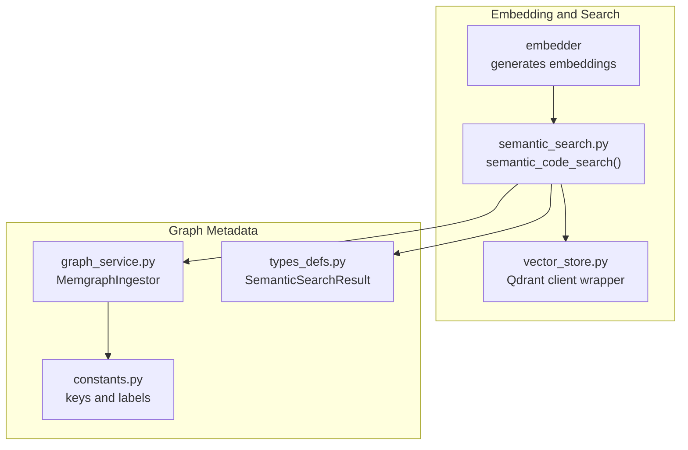
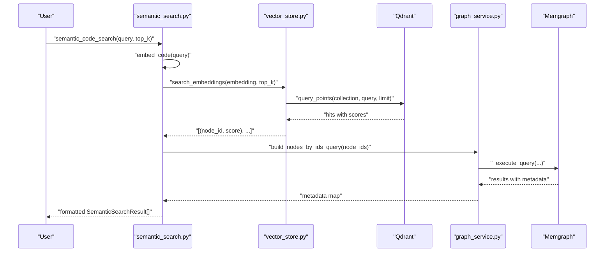
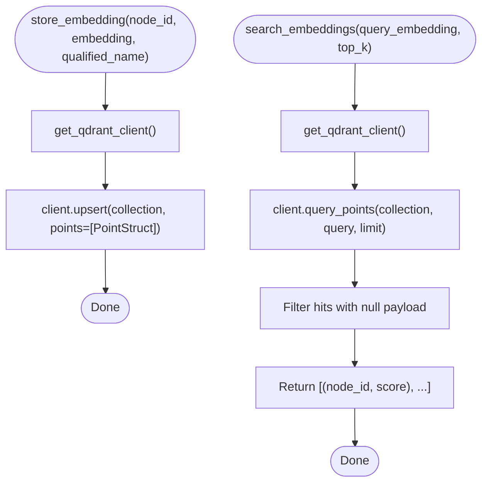
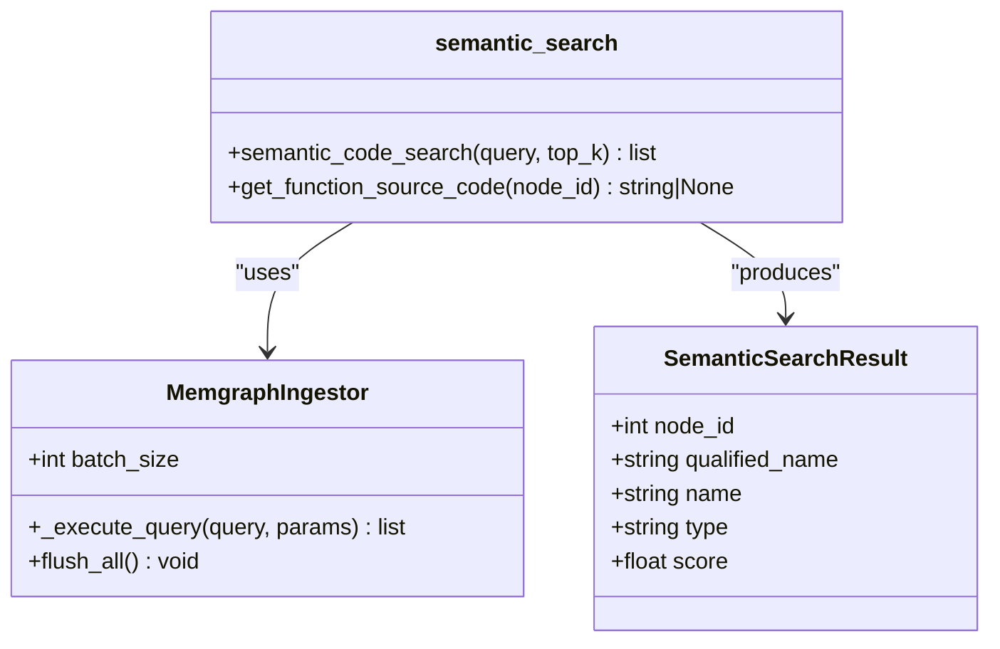
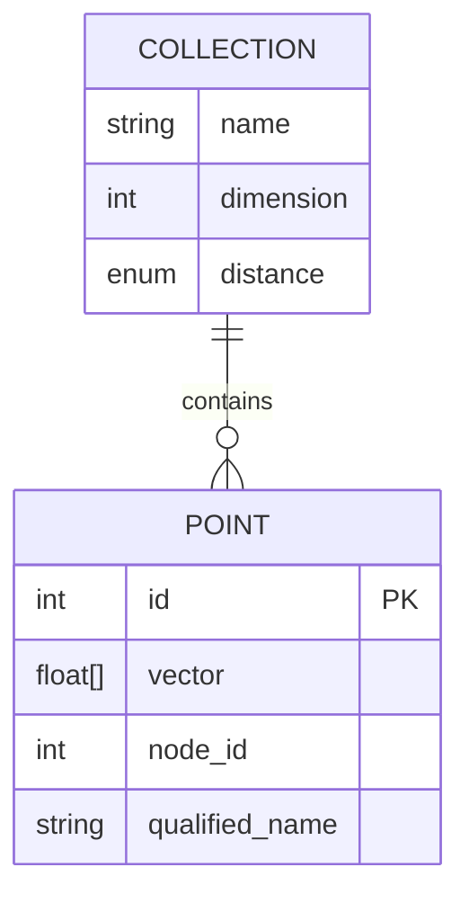
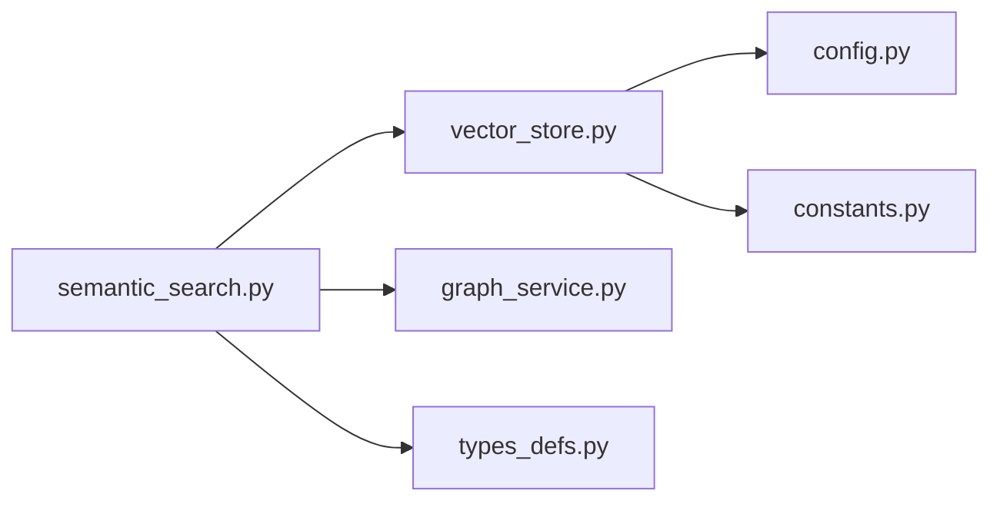

# Vector Store

<cite>
**Referenced Files in This Document**
- [vector_store.py](file://codebase_rag/vector_store.py)
- [semantic_search.py](file://codebase_rag/tools/semantic_search.py)
- [config.py](file://codebase_rag/config.py)
- [constants.py](file://codebase_rag/constants.py)
- [types_defs.py](file://codebase_rag/types_defs.py)
- [graph_service.py](file://codebase_rag/services/graph_service.py)
- [test_vector_store.py](file://codebase_rag/tests/test_vector_store.py)
</cite>

## Table of Contents
1. [Introduction](#introduction)
2. [Project Structure](#project-structure)
3. [Core Components](#core-components)
4. [Architecture Overview](#architecture-overview)
5. [Detailed Component Analysis](#detailed-component-analysis)
6. [Dependency Analysis](#dependency-analysis)
7. [Performance Considerations](#performance-considerations)
8. [Troubleshooting Guide](#troubleshooting-guide)
9. [Conclusion](#conclusion)
10. [Appendices](#appendices)

## Introduction
This document explains the Graph-Code vector store implementation, focusing on how code embeddings are stored, indexed, and queried to enable semantic search over a codebase. It covers the vector database integration with Qdrant, the embedding pipeline, similarity scoring, configuration options, and operational aspects such as performance, scaling, backups, and recovery. It also details how vector store operations integrate with the broader semantic search workflow and how to optimize memory and query latency.

## Project Structure
The vector store is implemented as a thin wrapper around Qdrant for persistence and retrieval of code embeddings. Semantic search orchestrates embedding generation, vector retrieval, and graph metadata lookup to produce human-readable results.

**Diagram sources**
- [vector_store.py](file://codebase_rag/vector_store.py#L1-L81)
- [semantic_search.py](file://codebase_rag/tools/semantic_search.py#L1-L157)
- [graph_service.py](file://codebase_rag/services/graph_service.py#L1-L364)
- [constants.py](file://codebase_rag/constants.py#L160-L359)
- [types_defs.py](file://codebase_rag/types_defs.py#L193-L199)

**Section sources**
- [vector_store.py](file://codebase_rag/vector_store.py#L1-L81)
- [semantic_search.py](file://codebase_rag/tools/semantic_search.py#L1-L157)
- [graph_service.py](file://codebase_rag/services/graph_service.py#L1-L364)
- [constants.py](file://codebase_rag/constants.py#L160-L359)
- [types_defs.py](file://codebase_rag/types_defs.py#L193-L199)

## Core Components
- Vector store client
  - Lazy initialization of a Qdrant client
  - Creation of a persistent collection with configured dimensionality and metric
  - Upsert of embeddings with node identifiers and qualified names
  - Similarity search via vector query with configurable top-k
- Semantic search orchestration
  - Embedding generation from natural language queries
  - Vector retrieval from Qdrant
  - Graph metadata lookup via Memgraph to enrich results
  - Structured result formatting

Key responsibilities:
- Persist embeddings with minimal overhead and robust error handling
- Provide efficient nearest-neighbor search using cosine distance
- Integrate with the graph service to resolve node metadata for ranked results

**Section sources**
- [vector_store.py](file://codebase_rag/vector_store.py#L8-L25)
- [vector_store.py](file://codebase_rag/vector_store.py#L27-L68)
- [semantic_search.py](file://codebase_rag/tools/semantic_search.py#L18-L77)
- [semantic_search.py](file://codebase_rag/tools/semantic_search.py#L39-L73)

## Architecture Overview
The vector store sits between the semantic search tool and the graph metadata service. The flow is:
- Query enters semantic search
- Embedding is generated
- Vector search retrieves candidate node IDs with scores
- Graph service resolves node metadata for the returned IDs
- Results are formatted and returned

**Diagram sources**
- [semantic_search.py](file://codebase_rag/tools/semantic_search.py#L18-L77)
- [vector_store.py](file://codebase_rag/vector_store.py#L50-L68)
- [graph_service.py](file://codebase_rag/services/graph_service.py#L104-L123)

## Detailed Component Analysis

### Vector Store Implementation
- Lazy client creation
  - On first use, a Qdrant client connects to a local path
  - Ensures the collection exists with configured vector dimension and cosine distance
- Embedding storage
  - Upserts a single point with vector and payload containing node ID and qualified name
- Similarity search
  - Executes a vector query with configurable top-k
  - Filters out hits with null payload
  - Returns pairs of node ID and score

**Diagram sources**
- [vector_store.py](file://codebase_rag/vector_store.py#L14-L25)
- [vector_store.py](file://codebase_rag/vector_store.py#L27-L48)
- [vector_store.py](file://codebase_rag/vector_store.py#L50-L68)

**Section sources**
- [vector_store.py](file://codebase_rag/vector_store.py#L8-L25)
- [vector_store.py](file://codebase_rag/vector_store.py#L27-L68)

### Semantic Search Orchestration
- Embedding generation
  - Converts a natural language query into a dense vector
- Vector retrieval
  - Calls the vector store to retrieve top-k matches
- Graph metadata enrichment
  - Builds a batched Cypher query to fetch node metadata for matched IDs
  - Maps results to a structured format with rounded scores
- Result formatting
  - Produces a list of SemanticSearchResult entries suitable for downstream consumers

**Diagram sources**
- [types_defs.py](file://codebase_rag/types_defs.py#L193-L199)
- [graph_service.py](file://codebase_rag/services/graph_service.py#L49-L364)
- [semantic_search.py](file://codebase_rag/tools/semantic_search.py#L18-L77)

**Section sources**
- [semantic_search.py](file://codebase_rag/tools/semantic_search.py#L18-L77)
- [types_defs.py](file://codebase_rag/types_defs.py#L193-L199)
- [graph_service.py](file://codebase_rag/services/graph_service.py#L104-L123)

### Configuration Options
- Qdrant settings
  - Database path, collection name, vector dimension, and top-k defaults
- Batch sizes
  - Graph metadata retrieval uses a configurable batch size for Cypher operations
- Embedding limits
  - Maximum length and progress reporting intervals

Operational implications:
- Vector dimension must match the embedding model output
- Top-k controls recall and latency trade-offs
- Batch size affects throughput and memory usage during metadata retrieval

**Section sources**
- [config.py](file://codebase_rag/config.py#L144-L147)
- [config.py](file://codebase_rag/config.py#L54-L56)
- [semantic_search.py](file://codebase_rag/tools/semantic_search.py#L39-L46)

### Similarity Scoring and Distance Metrics
- Distance metric
  - Cosine distance is configured for the vector collection
- Score interpretation
  - Qdrant returns a similarity score per hit; the semantic search rounds it for readability
- Ranking
  - Results are ordered by descending similarity score

Validation evidence:
- Tests demonstrate that similar code produces higher similarity scores than dissimilar code
- Round-trip tests confirm upsert updates and retrieval accuracy

**Section sources**
- [vector_store.py](file://codebase_rag/vector_store.py#L21-L23)
- [semantic_search.py](file://codebase_rag/tools/semantic_search.py#L60-L68)
- [test_vector_store.py](file://codebase_rag/tests/test_vector_store.py#L228-L242)
- [test_embedder.py](file://codebase_rag/tests/test_embedder.py#L175-L184)

### Indexing Mechanisms and Storage Architecture
- Local disk-backed Qdrant
  - Persistent storage under a configured path
- Collection creation
  - Ensures the collection exists with the correct vector parameters
- Payload fields
  - Stores node ID and qualified name alongside vectors for fast retrieval and enrichment

**Diagram sources**
- [vector_store.py](file://codebase_rag/vector_store.py#L17-L24)
- [vector_store.py](file://codebase_rag/vector_store.py#L35-L43)

**Section sources**
- [vector_store.py](file://codebase_rag/vector_store.py#L17-L24)
- [vector_store.py](file://codebase_rag/vector_store.py#L35-L43)

### Vector Database Integration: Insertion, Querying, Management
- Insertion
  - Upsert of a single point with vector and payload
- Querying
  - Vector query with configurable limit
  - Null payload filtering
- Management
  - Lazy client initialization
  - Collection existence check and creation
  - Exception-safe operations with warnings

Operational notes:
- The client is reused globally to avoid repeated connections
- Errors during upsert or query are caught and logged; the system remains resilient

**Section sources**
- [vector_store.py](file://codebase_rag/vector_store.py#L14-L25)
- [vector_store.py](file://codebase_rag/vector_store.py#L27-L48)
- [vector_store.py](file://codebase_rag/vector_store.py#L50-L68)
- [test_vector_store.py](file://codebase_rag/tests/test_vector_store.py#L68-L107)
- [test_vector_store.py](file://codebase_rag/tests/test_vector_store.py#L169-L182)

### Backup and Recovery Procedures
- Local persistence
  - Qdrant stores data on disk under the configured path
- Recommended procedure
  - Back up the Qdrant directory regularly
  - Restore by copying the directory to the same path on the target system
- Notes
  - Ensure the collection name and vector parameters match the original configuration
  - Validate connectivity and collection existence after restore

**Section sources**
- [vector_store.py](file://codebase_rag/vector_store.py#L17-L24)
- [config.py](file://codebase_rag/config.py#L144-L147)

### Relationship Between Vector Store Operations and Semantic Search Performance
- Latency drivers
  - Embedding generation cost
  - Vector search limit (top-k)
  - Graph metadata retrieval batch size
- Accuracy drivers
  - Embedding quality
  - Distance metric choice (cosine)
  - Payload completeness for enrichment

Optimization levers:
- Tune top-k to balance precision and latency
- Adjust batch size for metadata retrieval to fit memory budgets
- Monitor embedding model performance and cache where appropriate

**Section sources**
- [semantic_search.py](file://codebase_rag/tools/semantic_search.py#L18-L77)
- [config.py](file://codebase_rag/config.py#L54-L56)
- [config.py](file://codebase_rag/config.py#L144-L147)

## Dependency Analysis
- External dependencies
  - Qdrant client for vector storage and retrieval
  - Optional semantic dependencies for embedding generation
- Internal dependencies
  - Configuration module for settings
  - Constants and typed definitions for keys and result structures
  - Graph service for metadata resolution

**Diagram sources**
- [vector_store.py](file://codebase_rag/vector_store.py#L1-L11)
- [semantic_search.py](file://codebase_rag/tools/semantic_search.py#L1-L27)
- [config.py](file://codebase_rag/config.py#L1-L20)
- [constants.py](file://codebase_rag/constants.py#L160-L180)
- [types_defs.py](file://codebase_rag/types_defs.py#L193-L199)
- [graph_service.py](file://codebase_rag/services/graph_service.py#L1-L36)

**Section sources**
- [vector_store.py](file://codebase_rag/vector_store.py#L1-L11)
- [semantic_search.py](file://codebase_rag/tools/semantic_search.py#L1-L27)
- [config.py](file://codebase_rag/config.py#L1-L20)
- [constants.py](file://codebase_rag/constants.py#L160-L180)
- [types_defs.py](file://codebase_rag/types_defs.py#L193-L199)
- [graph_service.py](file://codebase_rag/services/graph_service.py#L1-L36)

## Performance Considerations
- Vector dimension and model alignment
  - Ensure embedding dimension matches the configured vector size
- Top-k tuning
  - Larger top-k improves recall but increases latency and graph metadata retrieval cost
- Batch sizing
  - Increase batch size for metadata retrieval to reduce round-trips; monitor memory usage
- Disk I/O and locality
  - Keep the Qdrant directory on fast storage; ensure adequate free space
- Network considerations
  - Qdrant runs locally; remote deployments require careful path configuration and permissions

[No sources needed since this section provides general guidance]

## Troubleshooting Guide
Common issues and resolutions:
- Missing semantic dependencies
  - Embedding generation requires optional semantic libraries; install them to enable semantic search
- Qdrant client unavailable
  - The vector store gracefully falls back to no-op operations when the client is not present
- Connection failures
  - Exceptions during upsert or query are caught and logged; verify Qdrant path and permissions
- Empty results
  - If no matches are found, the system returns an empty list; verify embedding correctness and collection contents

Validation and tests:
- Unit tests verify upsert behavior, query invocation, payload filtering, and exception handling
- Integration tests validate round-trip storage and retrieval, and update semantics

**Section sources**
- [semantic_search.py](file://codebase_rag/tools/semantic_search.py#L19-L21)
- [vector_store.py](file://codebase_rag/vector_store.py#L70-L81)
- [test_vector_store.py](file://codebase_rag/tests/test_vector_store.py#L95-L107)
- [test_vector_store.py](file://codebase_rag/tests/test_vector_store.py#L169-L182)
- [test_vector_store.py](file://codebase_rag/tests/test_vector_store.py#L206-L250)

## Conclusion
The Graph-Code vector store provides a compact, efficient mechanism for storing and retrieving code embeddings using Qdrant. Combined with semantic search orchestration and graph metadata enrichment, it delivers practical semantic search capabilities. Proper configuration of vector dimensions, top-k, and batch sizes, along with attention to disk-backed persistence and error handling, ensures reliable operation at scale.

[No sources needed since this section summarizes without analyzing specific files]

## Appendices

### Appendix A: Configuration Reference
- Qdrant settings
  - Database path, collection name, vector dimension, top-k default
- Batch sizes
  - Graph metadata retrieval batch size
- Embedding limits
  - Maximum length and progress reporting interval

**Section sources**
- [config.py](file://codebase_rag/config.py#L144-L147)
- [config.py](file://codebase_rag/config.py#L54-L56)
- [config.py](file://codebase_rag/config.py#L148-L149)

### Appendix B: Data Model for Results
- SemanticSearchResult fields
  - node_id, qualified_name, name, type, score

**Section sources**
- [types_defs.py](file://codebase_rag/types_defs.py#L193-L199)