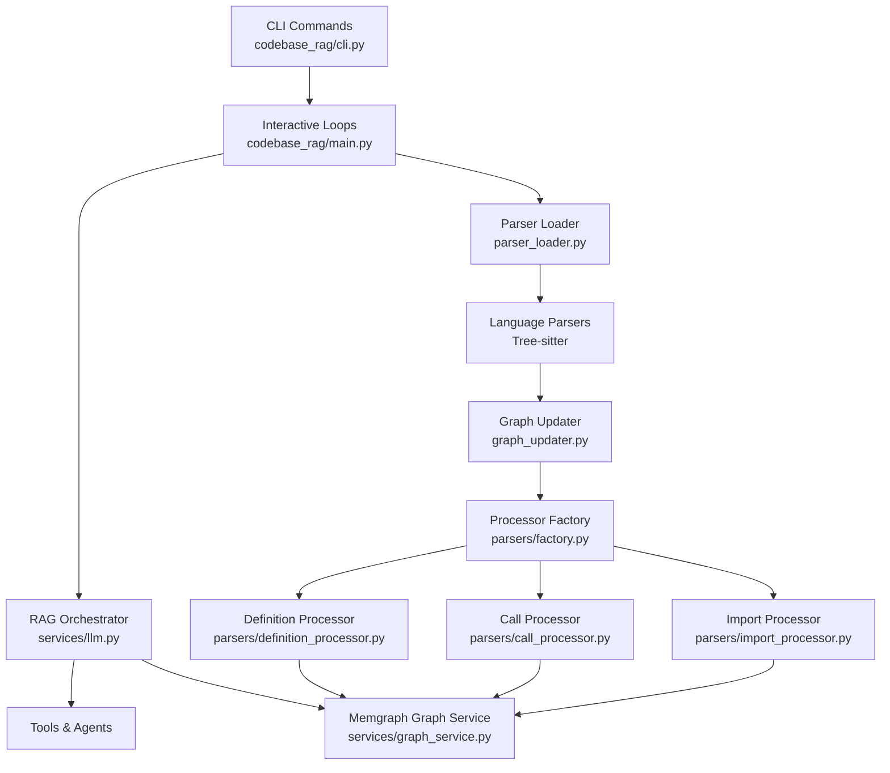
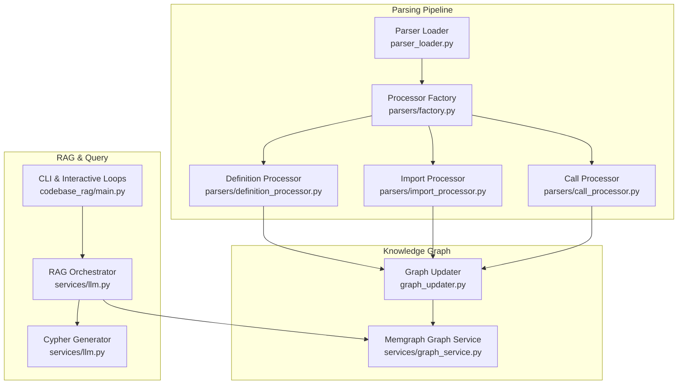
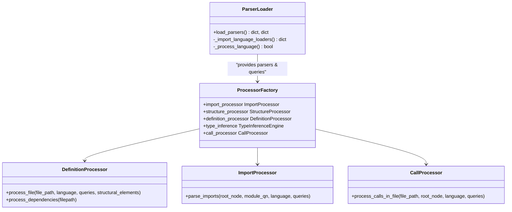
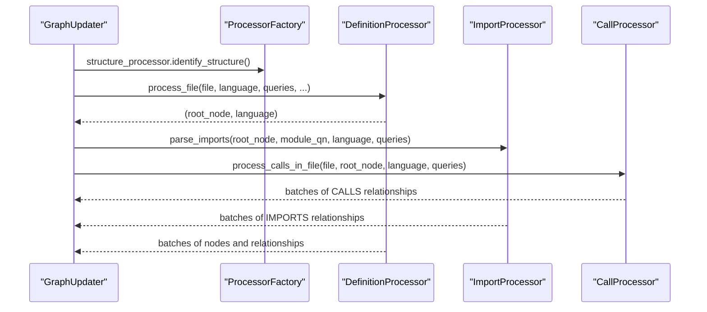
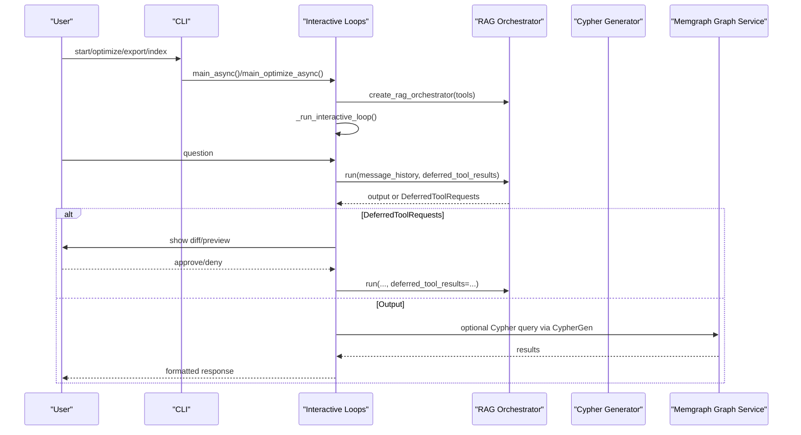
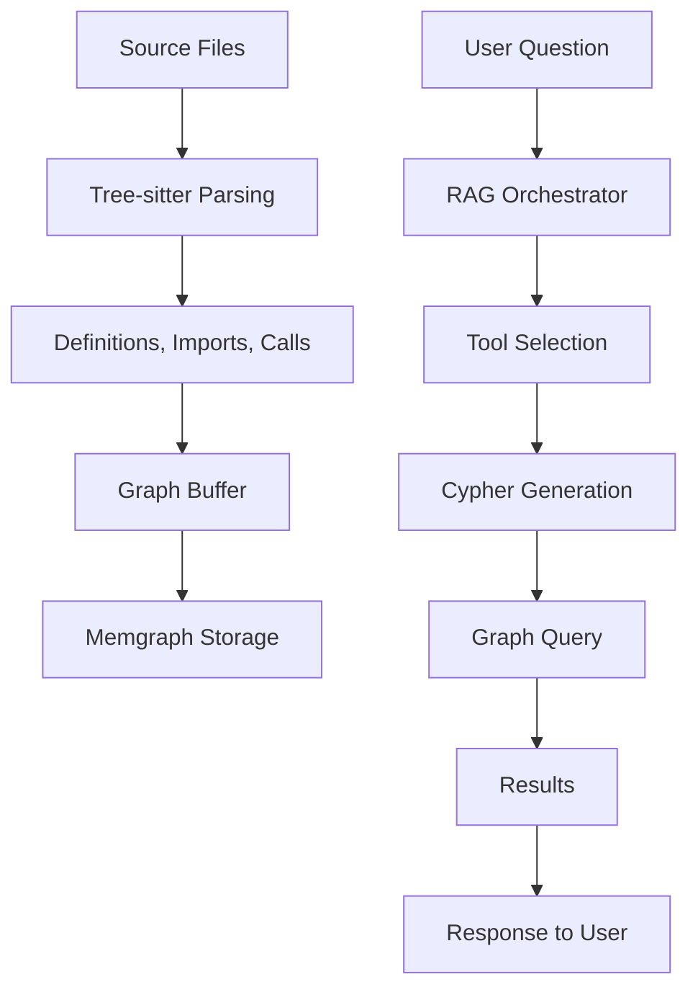
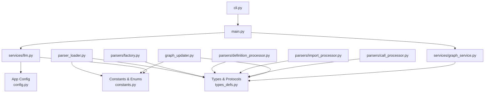

# Core Components

<cite>
**Referenced Files in This Document**
- [main.py](file://codebase_rag/main.py)
- [cli.py](file://codebase_rag/cli.py)
- [parser_loader.py](file://codebase_rag/parser_loader.py)
- [graph_updater.py](file://codebase_rag/graph_updater.py)
- [services/graph_service.py](file://codebase_rag/services/graph_service.py)
- [services/llm.py](file://codebase_rag/services/llm.py)
- [parsers/factory.py](file://codebase_rag/parsers/factory.py)
- [parsers/call_processor.py](file://codebase_rag/parsers/call_processor.py)
- [parsers/import_processor.py](file://codebase_rag/parsers/import_processor.py)
- [parsers/definition_processor.py](file://codebase_rag/parsers/definition_processor.py)
- [parsers/handlers/python.py](file://codebase_rag/parsers/handlers/python.py)
- [parsers/handlers/js_ts.py](file://codebase_rag/parsers/handlers/js_ts.py)
- [parsers/handlers/java.py](file://codebase_rag/parsers/handlers/java.py)
- [parsers/handlers/cpp.py](file://codebase_rag/parsers/handlers/cpp.py)
- [config.py](file://codebase_rag/config.py)
- [types_defs.py](file://codebase_rag/types_defs.py)
- [constants.py](file://codebase_rag/constants.py)
</cite>

## Table of Contents
1. [Introduction](#introduction)
2. [Project Structure](#project-structure)
3. [Core Components](#core-components)
4. [Architecture Overview](#architecture-overview)
5. [Detailed Component Analysis](#detailed-component-analysis)
6. [Dependency Analysis](#dependency-analysis)
7. [Performance Considerations](#performance-considerations)
8. [Troubleshooting Guide](#troubleshooting-guide)
9. [Conclusion](#conclusion)

## Introduction
This document explains the two core system components that define the platform’s capabilities:
- Multi-language parser powered by Tree-sitter
- Retrieval-Augmented Generation (RAG) system with an interactive CLI

It covers purpose, architecture, implementation details, and practical usage patterns. It also documents the dual-model approach where one AI model orchestrates tasks and another generates Cypher queries, and it illustrates how the parsing pipeline feeds a knowledge graph stored in Memgraph, which is later queried by the RAG system.

## Project Structure
The system is organized around:
- CLI entrypoints and interactive loops
- A multi-language Tree-sitter parser pipeline
- A graph updater that ingests parsed data into a knowledge graph
- An LLM-based RAG orchestrator and Cypher generator
- A Memgraph-backed graph service for storage and retrieval

**Diagram sources**
- [cli.py](file://codebase_rag/cli.py#L1-L395)
- [main.py](file://codebase_rag/main.py#L1-L1062)
- [parser_loader.py](file://codebase_rag/parser_loader.py#L1-L293)
- [graph_updater.py](file://codebase_rag/graph_updater.py#L1-L469)
- [parsers/factory.py](file://codebase_rag/parsers/factory.py#L1-L116)
- [parsers/definition_processor.py](file://codebase_rag/parsers/definition_processor.py#L1-L193)
- [parsers/call_processor.py](file://codebase_rag/parsers/call_processor.py#L1-L364)
- [parsers/import_processor.py](file://codebase_rag/parsers/import_processor.py#L1-L925)
- [services/graph_service.py](file://codebase_rag/services/graph_service.py#L1-L364)
- [services/llm.py](file://codebase_rag/services/llm.py#L1-L93)

**Section sources**
- [cli.py](file://codebase_rag/cli.py#L1-L395)
- [main.py](file://codebase_rag/main.py#L1-L1062)
- [parser_loader.py](file://codebase_rag/parser_loader.py#L1-L293)
- [graph_updater.py](file://codebase_rag/graph_updater.py#L1-L469)
- [services/graph_service.py](file://codebase_rag/services/graph_service.py#L1-L364)
- [services/llm.py](file://codebase_rag/services/llm.py#L1-L93)

## Core Components

### Multi-Language Parser Using Tree-sitter
Purpose:
- Parse source code across multiple languages using Tree-sitter grammars
- Extract structural elements (modules, classes, functions), imports, and calls
- Build a normalized qualified name space and relationships for downstream ingestion

Key implementation aspects:
- Dynamic grammar loading via parser_loader.py
- Language-specific handlers for AST traversal and naming
- Processor factory coordinates specialized processors for definitions, imports, and calls
- Bounded AST caching to improve performance

Public interfaces and parameters:
- Parser loader exposes load_parsers() returning per-language Parser and Query instances
- ProcessorFactory constructs DefinitionProcessor, ImportProcessor, CallProcessor, TypeInferenceEngine, and StructureProcessor
- Each processor accepts ingestor, repo_path, project_name, queries, and caches

Return values:
- Parsed AST roots and language identifiers for subsequent processing
- Buffered graph updates (nodes and relationships) via the ingestor

Practical usage patterns:
- Initialize parsers and queries, then run GraphUpdater to traverse files and populate the graph
- Use language-specific handlers to extract decorators, method signatures, and qualified names

**Section sources**
- [parser_loader.py](file://codebase_rag/parser_loader.py#L1-L293)
- [parsers/factory.py](file://codebase_rag/parsers/factory.py#L1-L116)
- [parsers/definition_processor.py](file://codebase_rag/parsers/definition_processor.py#L1-L193)
- [parsers/import_processor.py](file://codebase_rag/parsers/import_processor.py#L1-L925)
- [parsers/call_processor.py](file://codebase_rag/parsers/call_processor.py#L1-L364)
- [parsers/handlers/python.py](file://codebase_rag/parsers/handlers/python.py#L1-L23)
- [parsers/handlers/js_ts.py](file://codebase_rag/parsers/handlers/js_ts.py#L1-L116)
- [parsers/handlers/java.py](file://codebase_rag/parsers/handlers/java.py#L1-L29)
- [parsers/handlers/cpp.py](file://codebase_rag/parsers/handlers/cpp.py#L1-L60)
- [types_defs.py](file://codebase_rag/types_defs.py#L1-L555)
- [constants.py](file://codebase_rag/constants.py#L1-L800)

### RAG System with Interactive CLI
Purpose:
- Provide an interactive chat loop to query the knowledge graph
- Orchestrate tools (read files, semantic search, shell commands, edits) using an LLM
- Generate Cypher queries using a dedicated LLM configured separately from the orchestrator

Key implementation aspects:
- CLI commands (start, optimize, export, index) drive initialization and operations
- Interactive loops manage user input, approvals, and deferred tool execution
- Dual-model design: orchestrator model handles reasoning and tool selection; cypher model generates Cypher queries
- Configuration supports runtime model switching and endpoint resolution

Public interfaces and parameters:
- CLI entrypoints accept repository path, batch size, model overrides, and flags for confirmations
- Orchestrator creation via create_rag_orchestrator with tools and retry policies
- Cypher generation via CypherGenerator with language-specific system prompts

Return values:
- Rich UI panels with markdown responses
- Deferred tool requests requiring user approval
- Exported graph data as JSON

Practical usage patterns:
- Start a session with /model to switch models mid-session
- Use /help to list commands and exit to terminate
- Optimize sessions leverage a reference document to guide suggestions

**Section sources**
- [cli.py](file://codebase_rag/cli.py#L1-L395)
- [main.py](file://codebase_rag/main.py#L1-L1062)
- [services/llm.py](file://codebase_rag/services/llm.py#L1-L93)
- [config.py](file://codebase_rag/config.py#L1-L274)
- [constants.py](file://codebase_rag/constants.py#L1-L800)

## Architecture Overview
The system integrates parsing, graph storage, and query orchestration:

**Diagram sources**
- [parser_loader.py](file://codebase_rag/parser_loader.py#L1-L293)
- [parsers/factory.py](file://codebase_rag/parsers/factory.py#L1-L116)
- [parsers/definition_processor.py](file://codebase_rag/parsers/definition_processor.py#L1-L193)
- [parsers/import_processor.py](file://codebase_rag/parsers/import_processor.py#L1-L925)
- [parsers/call_processor.py](file://codebase_rag/parsers/call_processor.py#L1-L364)
- [graph_updater.py](file://codebase_rag/graph_updater.py#L1-L469)
- [services/graph_service.py](file://codebase_rag/services/graph_service.py#L1-L364)
- [main.py](file://codebase_rag/main.py#L1-L1062)
- [services/llm.py](file://codebase_rag/services/llm.py#L1-L93)

## Detailed Component Analysis

### Multi-Language Parser Using Tree-sitter
The parser subsystem is composed of:
- Parser loader that dynamically loads language grammars and builds per-language queries
- A factory that instantiates processors for definitions, imports, calls, and type inference
- Language-specific handlers to extract metadata like decorators and qualified names

**Diagram sources**
- [parser_loader.py](file://codebase_rag/parser_loader.py#L1-L293)
- [parsers/factory.py](file://codebase_rag/parsers/factory.py#L1-L116)
- [parsers/definition_processor.py](file://codebase_rag/parsers/definition_processor.py#L1-L193)
- [parsers/import_processor.py](file://codebase_rag/parsers/import_processor.py#L1-L925)
- [parsers/call_processor.py](file://codebase_rag/parsers/call_processor.py#L1-L364)

Key processing logic:
- DefinitionProcessor parses ASTs, registers modules, and creates containment relationships
- ImportProcessor resolves import paths and external modules, creating IMPORTS relationships
- CallProcessor identifies function/method calls, resolves targets, and creates CALLS relationships

**Diagram sources**
- [graph_updater.py](file://codebase_rag/graph_updater.py#L1-L469)
- [parsers/definition_processor.py](file://codebase_rag/parsers/definition_processor.py#L1-L193)
- [parsers/import_processor.py](file://codebase_rag/parsers/import_processor.py#L1-L925)
- [parsers/call_processor.py](file://codebase_rag/parsers/call_processor.py#L1-L364)

**Section sources**
- [parser_loader.py](file://codebase_rag/parser_loader.py#L1-L293)
- [parsers/factory.py](file://codebase_rag/parsers/factory.py#L1-L116)
- [parsers/definition_processor.py](file://codebase_rag/parsers/definition_processor.py#L1-L193)
- [parsers/import_processor.py](file://codebase_rag/parsers/import_processor.py#L1-L925)
- [parsers/call_processor.py](file://codebase_rag/parsers/call_processor.py#L1-L364)

### RAG System with Interactive CLI
The RAG system centers on:
- CLI commands to initialize sessions, update graphs, export data, and run optimizations
- An interactive loop that manages user input, tool approvals, and deferred actions
- Dual-model orchestration: one model for reasoning and tool selection, another for Cypher generation

**Diagram sources**
- [cli.py](file://codebase_rag/cli.py#L1-L395)
- [main.py](file://codebase_rag/main.py#L1-L1062)
- [services/llm.py](file://codebase_rag/services/llm.py#L1-L93)
- [services/graph_service.py](file://codebase_rag/services/graph_service.py#L1-L364)

Dual-model approach:
- Orchestrator model: configured via active_orchestrator_config; handles tool selection and output retries
- Cypher model: configured via active_cypher_config; generates Cypher queries with a tailored system prompt

Configuration options:
- Runtime model switching via /model command
- Batch size resolution for graph operations
- Edit confirmation toggles and endpoint resolution for local providers

**Section sources**
- [cli.py](file://codebase_rag/cli.py#L1-L395)
- [main.py](file://codebase_rag/main.py#L1-L1062)
- [services/llm.py](file://codebase_rag/services/llm.py#L1-L93)
- [config.py](file://codebase_rag/config.py#L1-L274)
- [constants.py](file://codebase_rag/constants.py#L1-L800)

### Conceptual Overview
At a high level:
- The parser extracts structural and relational information from source files
- The graph updater buffers and writes nodes and relationships to Memgraph
- The RAG orchestrator answers user questions by combining natural language understanding, tool use, and Cypher queries against the knowledge graph

[No sources needed since this diagram shows conceptual workflow, not actual code structure]

## Dependency Analysis
The components exhibit clear separation of concerns with well-defined protocols and abstractions:

**Diagram sources**
- [types_defs.py](file://codebase_rag/types_defs.py#L1-L555)
- [constants.py](file://codebase_rag/constants.py#L1-L800)
- [config.py](file://codebase_rag/config.py#L1-L274)
- [parser_loader.py](file://codebase_rag/parser_loader.py#L1-L293)
- [parsers/factory.py](file://codebase_rag/parsers/factory.py#L1-L116)
- [parsers/definition_processor.py](file://codebase_rag/parsers/definition_processor.py#L1-L193)
- [parsers/import_processor.py](file://codebase_rag/parsers/import_processor.py#L1-L925)
- [parsers/call_processor.py](file://codebase_rag/parsers/call_processor.py#L1-L364)
- [graph_updater.py](file://codebase_rag/graph_updater.py#L1-L469)
- [services/graph_service.py](file://codebase_rag/services/graph_service.py#L1-L364)
- [services/llm.py](file://codebase_rag/services/llm.py#L1-L93)
- [main.py](file://codebase_rag/main.py#L1-L1062)
- [cli.py](file://codebase_rag/cli.py#L1-L395)

**Section sources**
- [types_defs.py](file://codebase_rag/types_defs.py#L1-L555)
- [constants.py](file://codebase_rag/constants.py#L1-L800)
- [config.py](file://codebase_rag/config.py#L1-L274)
- [parser_loader.py](file://codebase_rag/parser_loader.py#L1-L293)
- [graph_updater.py](file://codebase_rag/graph_updater.py#L1-L469)
- [services/graph_service.py](file://codebase_rag/services/graph_service.py#L1-L364)
- [services/llm.py](file://codebase_rag/services/llm.py#L1-L93)
- [main.py](file://codebase_rag/main.py#L1-L1062)
- [cli.py](file://codebase_rag/cli.py#L1-L395)

## Performance Considerations
- Batching: MemgraphIngestor flushes nodes and relationships in configurable batches to reduce round-trips
- Caching: BoundedASTCache limits memory and eviction policy to balance speed and resource usage
- Query batching: Cypher write operations use UNWIND batching to minimize overhead
- Semantic embeddings: Optional embedding generation is gated by dependency availability and configured intervals

[No sources needed since this section provides general guidance]

## Troubleshooting Guide
Common issues and diagnostics:
- Parser failures: Check grammar availability and language support; review logs for grammar load errors
- Graph ingestion errors: Verify unique constraints and property keys; inspect batch errors and partial successes
- LLM generation failures: Validate model configuration and endpoints; ensure system prompts are appropriate for provider
- CLI startup errors: Confirm environment variables and .env presence; validate repository path and permissions

**Section sources**
- [parser_loader.py](file://codebase_rag/parser_loader.py#L1-L293)
- [services/graph_service.py](file://codebase_rag/services/graph_service.py#L1-L364)
- [services/llm.py](file://codebase_rag/services/llm.py#L1-L93)
- [config.py](file://codebase_rag/config.py#L1-L274)

## Conclusion
The system combines a robust multi-language Tree-sitter parser with a dual-model RAG architecture to deliver a powerful, interactive knowledge graph assistant. The parser builds a structured representation of codebases, the graph service persists and retrieves relationships efficiently, and the RAG orchestrator enables natural language interaction with precise Cypher-driven queries. Together, these components provide a scalable foundation for code exploration, optimization, and maintenance workflows.