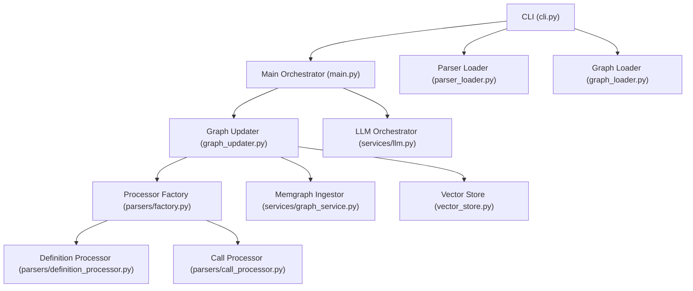
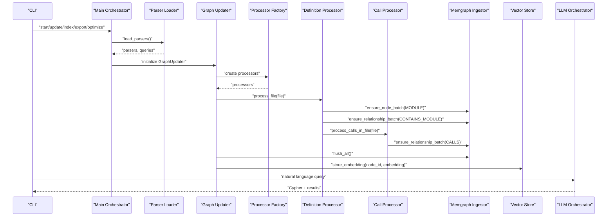
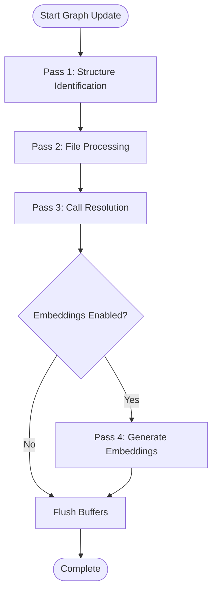
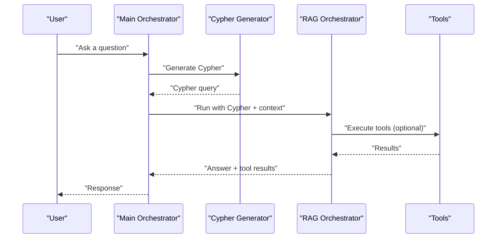
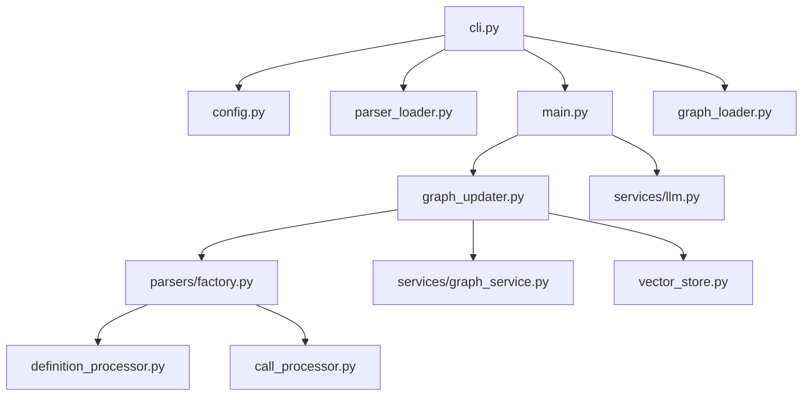

# Data Flow and Processing Pipeline

<cite>
**Referenced Files in This Document**
- [main.py](file://codebase_rag/main.py)
- [cli.py](file://codebase_rag/cli.py)
- [config.py](file://codebase_rag/config.py)
- [graph_updater.py](file://codebase_rag/graph_updater.py)
- [graph_loader.py](file://codebase_rag/graph_loader.py)
- [parser_loader.py](file://codebase_rag/parser_loader.py)
- [services/graph_service.py](file://codebase_rag/services/graph_service.py)
- [services/llm.py](file://codebase_rag/services/llm.py)
- [parsers/factory.py](file://codebase_rag/parsers/factory.py)
- [parsers/definition_processor.py](file://codebase_rag/parsers/definition_processor.py)
- [parsers/call_processor.py](file://codebase_rag/parsers/call_processor.py)
- [vector_store.py](file://codebase_rag/vector_store.py)
- [constants.py](file://codebase_rag/constants.py)
- [types_defs.py](file://codebase_rag/types_defs.py)
</cite>

## Table of Contents
1. [Introduction](#introduction)
2. [Project Structure](#project-structure)
3. [Core Components](#core-components)
4. [Architecture Overview](#architecture-overview)
5. [Detailed Component Analysis](#detailed-component-analysis)
6. [Dependency Analysis](#dependency-analysis)
7. [Performance Considerations](#performance-considerations)
8. [Troubleshooting Guide](#troubleshooting-guide)
9. [Conclusion](#conclusion)

## Introduction
This document explains the complete data flow and processing pipeline of the codebase, from source code ingestion and AST parsing to knowledge graph construction and natural language query processing. It documents the sequential stages, data transformations, and component interactions, and provides concrete examples from the actual codebase. It also covers configuration options, processing parameters, data formats, and performance considerations.

## Project Structure
The system is organized around a CLI entry point that orchestrates:
- Parser loading and language-specific AST queries
- Graph construction via a streaming ingestor
- Optional semantic embeddings and vector storage
- Natural language query orchestration and Cypher generation
- Graph export and loading utilities

**Diagram sources**
- [cli.py](file://codebase_rag/cli.py#L1-L395)
- [main.py](file://codebase_rag/main.py#L1-L1062)
- [parser_loader.py](file://codebase_rag/parser_loader.py#L1-L293)
- [graph_updater.py](file://codebase_rag/graph_updater.py#L1-L469)
- [parsers/factory.py](file://codebase_rag/parsers/factory.py#L1-L116)
- [parsers/definition_processor.py](file://codebase_rag/parsers/definition_processor.py#L1-L193)
- [parsers/call_processor.py](file://codebase_rag/parsers/call_processor.py#L1-L364)
- [services/graph_service.py](file://codebase_rag/services/graph_service.py#L1-L364)
- [vector_store.py](file://codebase_rag/vector_store.py#L1-L81)
- [services/llm.py](file://codebase_rag/services/llm.py#L1-L93)
- [graph_loader.py](file://codebase_rag/graph_loader.py#L1-L155)

**Section sources**
- [cli.py](file://codebase_rag/cli.py#L1-L395)
- [main.py](file://codebase_rag/main.py#L1-L1062)
- [parser_loader.py](file://codebase_rag/parser_loader.py#L1-L293)

## Core Components
- CLI: Provides commands to start indexing, update the graph, export, optimize, and load graphs. It resolves configuration, loads parsers, and coordinates the update pipeline.
- Parser Loader: Dynamically loads Tree-Sitter grammars and builds language-specific queries for functions, classes, calls, imports, and locals.
- Graph Updater: Drives the multi-pass pipeline: structure identification, file processing, call resolution, method override handling, and embedding generation.
- Processor Factory: Creates and lazily initializes processors (definition, call, import, type inference).
- Definition Processor: Parses files, extracts imports, and ingests modules, functions, classes, and special constructs.
- Call Processor: Resolves and ingests function calls across files and modules.
- Memgraph Ingestor: Streams node and relationship batches to Memgraph with batching and constraint enforcement.
- Vector Store: Stores and retrieves semantic embeddings in Qdrant when available.
- LLM Orchestrator: Builds agents for natural language to Cypher translation and RAG orchestration.
- Graph Loader: Loads a previously exported JSON graph into memory for inspection and analysis.

**Section sources**
- [cli.py](file://codebase_rag/cli.py#L1-L395)
- [parser_loader.py](file://codebase_rag/parser_loader.py#L1-L293)
- [graph_updater.py](file://codebase_rag/graph_updater.py#L1-L469)
- [parsers/factory.py](file://codebase_rag/parsers/factory.py#L1-L116)
- [parsers/definition_processor.py](file://codebase_rag/parsers/definition_processor.py#L1-L193)
- [parsers/call_processor.py](file://codebase_rag/parsers/call_processor.py#L1-L364)
- [services/graph_service.py](file://codebase_rag/services/graph_service.py#L1-L364)
- [vector_store.py](file://codebase_rag/vector_store.py#L1-L81)
- [services/llm.py](file://codebase_rag/services/llm.py#L1-L93)
- [graph_loader.py](file://codebase_rag/graph_loader.py#L1-L155)

## Architecture Overview
The pipeline follows a staged, streaming architecture:
1. CLI parses arguments and settings, then either starts an interactive session or runs a targeted operation.
2. Parser Loader initializes language-specific parsers and queries.
3. Graph Updater orchestrates a multi-pass pipeline:
   - Pass 1: Structure identification (packages, folders, project).
   - Pass 2: File processing (modules, imports, definitions, classes).
   - Pass 3: Call resolution and ingestion.
   - Pass 4: Optional semantic embeddings.
4. Memgraph Ingestor streams nodes and relationships in batches, enforcing unique constraints.
5. Optional: Vector Store persists embeddings for semantic search.
6. LLM Orchestrator translates natural language queries into Cypher and coordinates tool usage.
7. Graph Loader reads exported JSON graphs for inspection.

**Diagram sources**
- [cli.py](file://codebase_rag/cli.py#L1-L395)
- [main.py](file://codebase_rag/main.py#L1-L1062)
- [parser_loader.py](file://codebase_rag/parser_loader.py#L1-L293)
- [graph_updater.py](file://codebase_rag/graph_updater.py#L1-L469)
- [parsers/factory.py](file://codebase_rag/parsers/factory.py#L1-L116)
- [parsers/definition_processor.py](file://codebase_rag/parsers/definition_processor.py#L1-L193)
- [parsers/call_processor.py](file://codebase_rag/parsers/call_processor.py#L1-L364)
- [services/graph_service.py](file://codebase_rag/services/graph_service.py#L1-L364)
- [vector_store.py](file://codebase_rag/vector_store.py#L1-L81)
- [services/llm.py](file://codebase_rag/services/llm.py#L1-L93)

## Detailed Component Analysis

### Parser Loading and Language Queries
- Dynamic grammar loading: Attempts to import language modules from installed packages or build from submodules. If successful, creates a Tree-Sitter Language and Parser.
- Query construction: Builds language-specific queries for functions, classes, calls, imports, and locals. Patterns are derived from language specs and combined into reusable queries.
- Availability checks: Logs languages initialized and raises an error if none are available.

Key behaviors:
- Grammar availability fallback to submodule builds.
- Query composition per language spec.
- Safe creation of optional queries (locals, imports).

**Section sources**
- [parser_loader.py](file://codebase_rag/parser_loader.py#L1-L293)
- [constants.py](file://codebase_rag/constants.py#L1-L200)

### Graph Construction Pipeline (Multi-Pass)
The GraphUpdater coordinates a four-pass pipeline:

Pass 1: Structure Identification
- Ensures a project node and identifies structural containers (folders/packages) for module placement.

Pass 2: File Processing
- Iterates files under the repository root, skipping ignored paths.
- Detects language by suffix and validates parser availability.
- Processes each file via the Definition Processor, which:
  - Parses AST and determines module qualified name.
  - Ingests module nodes and CONTAINS_MODULE relationships.
  - Extracts imports and ingests external package dependencies.
  - Ingests functions, classes, and language-specific constructs.
- Dependency files are handled separately to extract external package metadata.

Pass 3: Call Resolution and Ingestion
- Iterates cached ASTs and resolves function calls:
  - Identifies function/class/method scopes and call sites.
  - Uses Call Resolver to map targets via function registry, imports, type inference, and inheritance.
  - Ingests CALLS relationships with properties.

Pass 4: Optional Semantic Embeddings
- Fetches function nodes requiring embeddings from the graph.
- Extracts source code for each function (via AST extraction or file fallback).
- Generates embeddings and stores them in Qdrant with node ID and qualified name payload.

**Diagram sources**
- [graph_updater.py](file://codebase_rag/graph_updater.py#L264-L469)

**Section sources**
- [graph_updater.py](file://codebase_rag/graph_updater.py#L1-L469)
- [parsers/definition_processor.py](file://codebase_rag/parsers/definition_processor.py#L1-L193)
- [parsers/call_processor.py](file://codebase_rag/parsers/call_processor.py#L1-L364)
- [vector_store.py](file://codebase_rag/vector_store.py#L1-L81)

### AST Parsing and Ingestion Details
- Definition Processor:
  - Reads file bytes, parses with the language’s Tree-Sitter parser, and derives module qualified names.
  - Ingests MODULE nodes and CONTAINS_MODULE relationships to the parent container (package/folder/project).
  - Parses imports and ingests external packages with DEPENDS_ON_EXTERNAL relationships.
  - Ingests functions, classes, and language-specific constructs (e.g., JS/TS exports, prototype inheritance, C++ modules).
- Call Processor:
  - Uses language queries to locate function/class/method scopes.
  - Resolves call targets via Call Resolver using function registry, imports, type inference, and inheritance.
  - Ingests CALLS relationships with properties.

Data formats:
- Nodes: labeled with identifiers and properties (e.g., MODULE with qualified name, path).
- Relationships: typed (e.g., CONTAINS_MODULE, CALLS) with optional properties.

**Section sources**
- [parsers/definition_processor.py](file://codebase_rag/parsers/definition_processor.py#L1-L193)
- [parsers/call_processor.py](file://codebase_rag/parsers/call_processor.py#L1-L364)
- [types_defs.py](file://codebase_rag/types_defs.py#L1-L200)

### Graph Storage and Streaming
- Memgraph Ingestor:
  - Maintains node and relationship buffers up to a configurable batch size.
  - Enforces unique constraints per node label before merging.
  - Streams nodes and relationships in batches, logging successes and failures.
  - Supports flushing all buffers and exporting graph to JSON for inspection.
- Constraints and cleanup:
  - Ensures unique constraints for node labels.
  - Provides clean database and project deletion utilities.

Data formats:
- Node rows: id and properties.
- Relationship rows: from_value, to_value, and properties.

**Section sources**
- [services/graph_service.py](file://codebase_rag/services/graph_service.py#L1-L364)
- [constants.py](file://codebase_rag/constants.py#L150-L200)

### Natural Language Query Processing
- LLM Orchestrator:
  - Creates a Cypher generator agent configured with a system prompt and retries.
  - Generates Cypher queries from natural language input.
  - Builds a RAG orchestrator agent with tools for code retrieval, file operations, and shell commands.
- Main loop:
  - Handles user input, chat images, and tool approvals.
  - Runs the agent with deferred tool requests and logs session events.

**Diagram sources**
- [services/llm.py](file://codebase_rag/services/llm.py#L1-L93)
- [main.py](file://codebase_rag/main.py#L1-L1062)

**Section sources**
- [services/llm.py](file://codebase_rag/services/llm.py#L1-L93)
- [main.py](file://codebase_rag/main.py#L1-L1062)

### Graph Export and Loading
- Export:
  - Exports nodes and relationships from Memgraph into a JSON graph format with metadata.
- Load:
  - Loads a JSON graph file into memory, building indices for nodes and relationships.
  - Provides summary statistics and property-based lookups.

**Section sources**
- [services/graph_service.py](file://codebase_rag/services/graph_service.py#L341-L364)
- [graph_loader.py](file://codebase_rag/graph_loader.py#L1-L155)

## Dependency Analysis
- CLI depends on configuration, parser loader, and main orchestrator functions.
- Graph Updater depends on ingestor, parsers, queries, and processors.
- Processors depend on ingestor, language queries, and shared registries/caches.
- Ingestor depends on Memgraph client and Cypher helpers.
- Vector Store depends on Qdrant client availability.
- LLM Orchestrator depends on provider configuration and model settings.

**Diagram sources**
- [cli.py](file://codebase_rag/cli.py#L1-L395)
- [config.py](file://codebase_rag/config.py#L1-L274)
- [parser_loader.py](file://codebase_rag/parser_loader.py#L1-L293)
- [main.py](file://codebase_rag/main.py#L1-L1062)
- [graph_updater.py](file://codebase_rag/graph_updater.py#L1-L469)
- [parsers/factory.py](file://codebase_rag/parsers/factory.py#L1-L116)
- [parsers/definition_processor.py](file://codebase_rag/parsers/definition_processor.py#L1-L193)
- [parsers/call_processor.py](file://codebase_rag/parsers/call_processor.py#L1-L364)
- [services/graph_service.py](file://codebase_rag/services/graph_service.py#L1-L364)
- [vector_store.py](file://codebase_rag/vector_store.py#L1-L81)
- [services/llm.py](file://codebase_rag/services/llm.py#L1-L93)
- [graph_loader.py](file://codebase_rag/graph_loader.py#L1-L155)

**Section sources**
- [cli.py](file://codebase_rag/cli.py#L1-L395)
- [graph_updater.py](file://codebase_rag/graph_updater.py#L1-L469)
- [services/graph_service.py](file://codebase_rag/services/graph_service.py#L1-L364)

## Performance Considerations
- Batching:
  - Memgraph Ingestor batches node and relationship writes to reduce round-trips and improve throughput.
  - Batch size is configurable and validated at runtime.
- Memory Management:
  - AST cache limits: bounded by entry count and approximate memory thresholds; evicts least-recently-used entries when limits are exceeded.
  - Cache eviction divisor controls aggressive trimming when memory pressure is high.
- Semantic Embeddings:
  - Embeddings are generated in batches and logged periodically; progress interval is configurable.
  - Vector store initialization checks collection existence and creates it if missing.
- Query Efficiency:
  - Language-specific Tree-Sitter queries are prebuilt and reused across files.
  - Optional queries (locals, imports) are created only when patterns are available.

Optimization strategies:
- Increase batch size for large repositories to reduce overhead.
- Tune cache limits and eviction divisor for memory-constrained environments.
- Limit embedding generation to necessary scopes (e.g., functions with source).
- Use selective language support to reduce parser initialization overhead.

**Section sources**
- [services/graph_service.py](file://codebase_rag/services/graph_service.py#L1-L364)
- [graph_updater.py](file://codebase_rag/graph_updater.py#L162-L221)
- [vector_store.py](file://codebase_rag/vector_store.py#L1-L81)
- [config.py](file://codebase_rag/config.py#L144-L155)

## Troubleshooting Guide
Common issues and resolutions:
- No languages available:
  - Symptom: Runtime error indicating no parsers could be loaded.
  - Cause: Missing Tree-Sitter grammars or build failures.
  - Action: Install language packages or ensure submodule builds succeed.
- Grammar load failure:
  - Symptom: Warning during grammar loading.
  - Cause: Incorrect grammar module or incompatible bindings.
  - Action: Verify grammar availability and Python bindings path.
- Batch size invalid:
  - Symptom: Value error for batch size.
  - Cause: Non-positive batch size.
  - Action: Provide a positive integer via CLI or settings.
- Constraint errors:
  - Symptom: Errors when merging nodes with existing constraints.
  - Cause: Missing required properties for unique constraints.
  - Action: Ensure required properties are present before ingestion.
- Embedding generation failures:
  - Symptom: Warnings when generating embeddings.
  - Cause: Missing source code or embedding generation errors.
  - Action: Verify source extraction and embedding backend availability.
- Graph export/load errors:
  - Symptom: Failures exporting or loading graph JSON.
  - Cause: Missing file or malformed JSON.
  - Action: Check file path and JSON validity.

**Section sources**
- [parser_loader.py](file://codebase_rag/parser_loader.py#L256-L292)
- [services/graph_service.py](file://codebase_rag/services/graph_service.py#L104-L165)
- [graph_updater.py](file://codebase_rag/graph_updater.py#L356-L419)
- [graph_loader.py](file://codebase_rag/graph_loader.py#L36-L78)

## Conclusion
The system implements a robust, multi-stage pipeline that transforms raw source code into a structured knowledge graph. It leverages language-specific parsers, streaming ingestion, and optional semantic embeddings to enable efficient querying and analysis. The CLI provides flexible operations for indexing, updating, exporting, and optimizing the knowledge graph, while the LLM orchestrator enables natural language interactions. Proper configuration of batching, caching, and embedding parameters ensures scalability and reliability across diverse codebases.