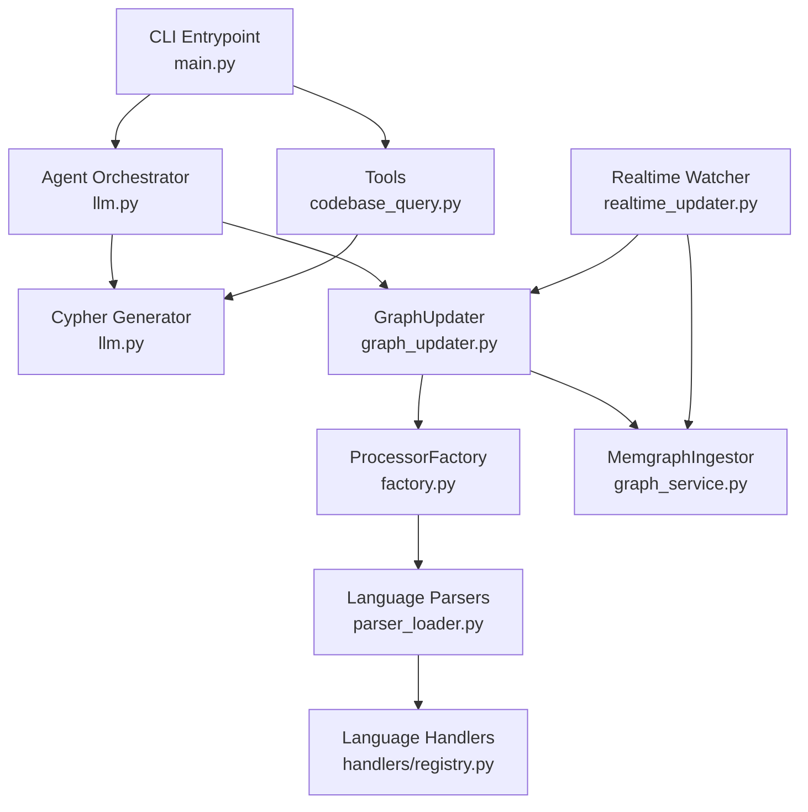
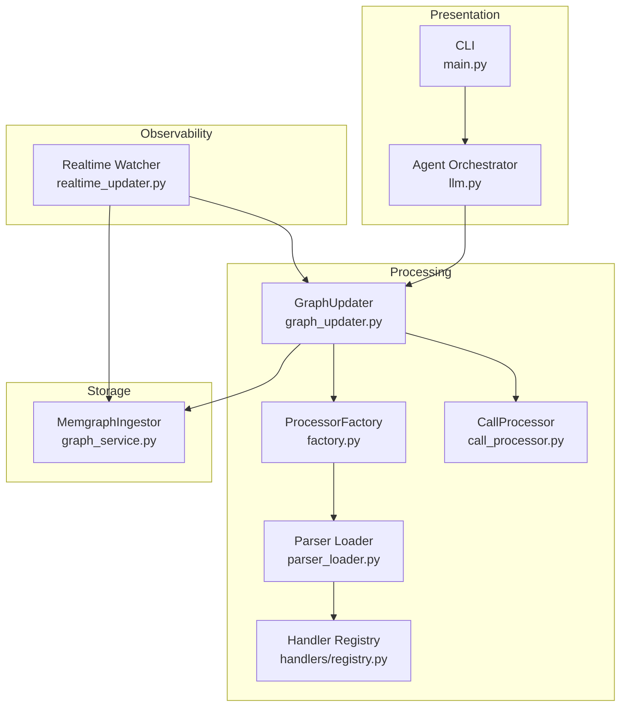
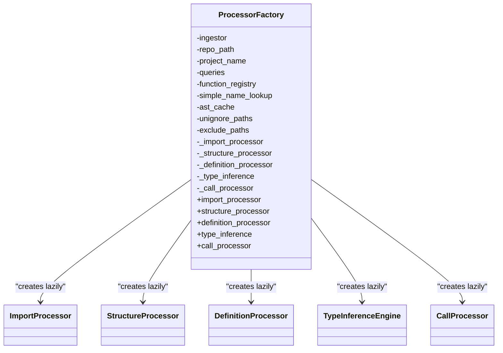
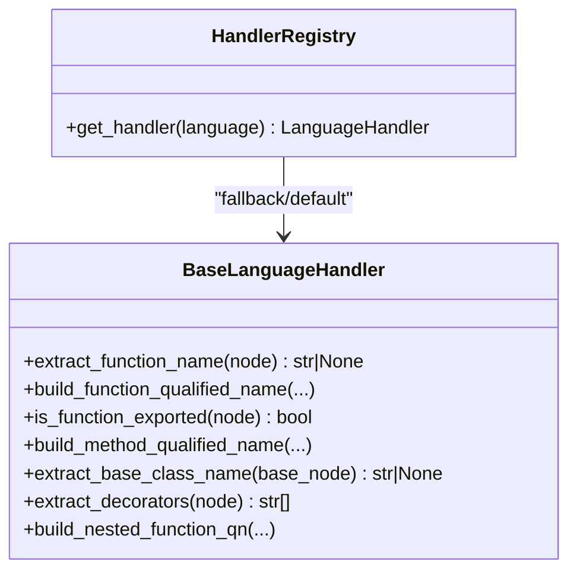
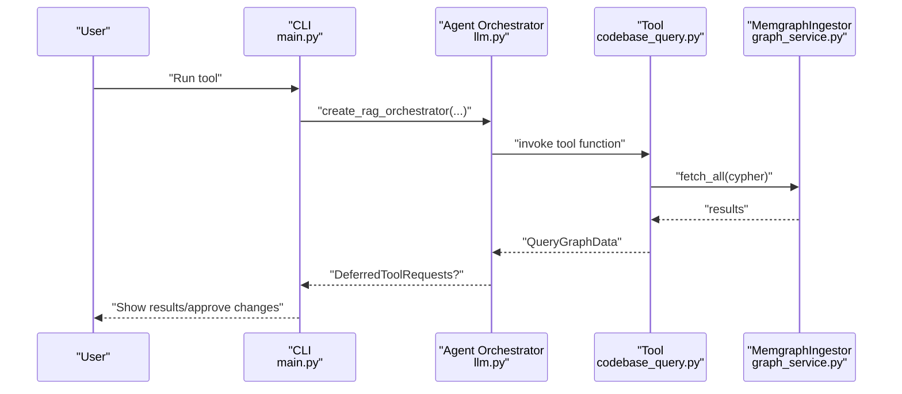
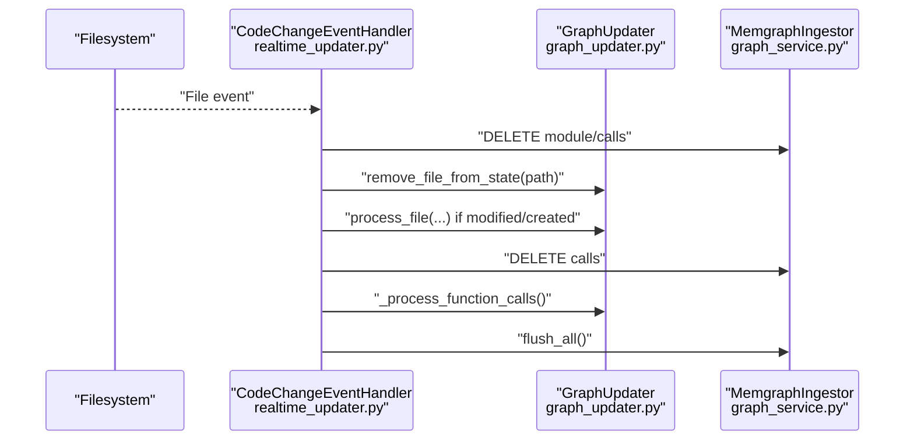
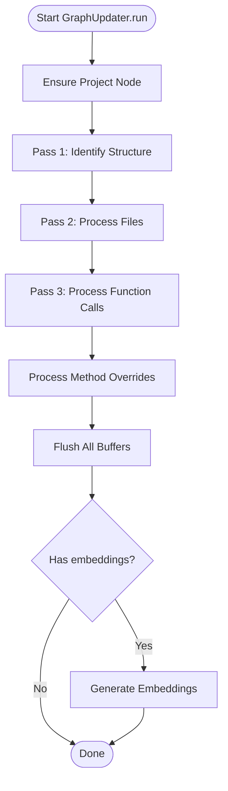
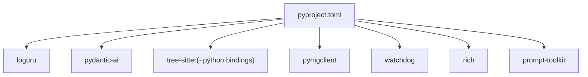

# Design Patterns and Architectural Principles

<cite>
**Referenced Files in This Document**
- [main.py](file://codebase_rag/main.py)
- [graph_updater.py](file://codebase_rag/graph_updater.py)
- [factory.py](file://codebase_rag/parsers/factory.py)
- [registry.py](file://codebase_rag/parsers/handlers/registry.py)
- [base.py](file://codebase_rag/parsers/handlers/base.py)
- [call_processor.py](file://codebase_rag/parsers/call_processor.py)
- [codebase_query.py](file://codebase_rag/tools/codebase_query.py)
- [graph_service.py](file://codebase_rag/services/graph_service.py)
- [llm.py](file://codebase_rag/services/llm.py)
- [realtime_updater.py](file://realtime_updater.py)
- [parser_loader.py](file://codebase_rag/parser_loader.py)
- [language_spec.py](file://codebase_rag/language_spec.py)
- [types_defs.py](file://codebase_rag/types_defs.py)
- [constants.py](file://codebase_rag/constants.py)
- [config.py](file://codebase_rag/config.py)
- [pyproject.toml](file://pyproject.toml)
</cite>

## Table of Contents
1. [Introduction](#introduction)
2. [Project Structure](#project-structure)
3. [Core Components](#core-components)
4. [Architecture Overview](#architecture-overview)
5. [Detailed Component Analysis](#detailed-component-analysis)
6. [Dependency Analysis](#dependency-analysis)
7. [Performance Considerations](#performance-considerations)
8. [Troubleshooting Guide](#troubleshooting-guide)
9. [Conclusion](#conclusion)
10. [Appendices](#appendices)

## Introduction
This document explains the design patterns and architectural principles implemented in Graph-Code. It focuses on:
- Factory Pattern for processor creation
- Strategy Pattern for language-specific parsing
- Command Pattern for tool execution
- Observer Pattern for real-time updates
It also documents architectural decisions around knowledge storage (Memgraph), parsing (Tree-sitter), and the dual-model approach for orchestration and Cypher generation. Infrastructure, scalability, and deployment considerations are included, along with cross-cutting concerns such as error handling, logging, and configuration management.

## Project Structure
The system is organized around a modular pipeline:
- CLI and orchestration entry points
- Graph indexer/updater coordinating parsing and ingestion
- Language-specific parsers and processors
- LLM orchestration and Cypher generation
- Knowledge graph storage via Memgraph
- Real-time watcher for incremental updates

**Diagram sources**
- [main.py](file://codebase_rag/main.py#L1-L120)
- [graph_updater.py](file://codebase_rag/graph_updater.py#L223-L284)
- [factory.py](file://codebase_rag/parsers/factory.py#L18-L116)
- [registry.py](file://codebase_rag/parsers/handlers/registry.py#L15-L32)
- [parser_loader.py](file://codebase_rag/parser_loader.py#L276-L293)
- [graph_service.py](file://codebase_rag/services/graph_service.py#L49-L83)
- [realtime_updater.py](file://realtime_updater.py#L114-L150)
- [llm.py](file://codebase_rag/services/llm.py#L78-L93)

**Section sources**
- [main.py](file://codebase_rag/main.py#L1-L120)
- [graph_updater.py](file://codebase_rag/graph_updater.py#L223-L284)
- [realtime_updater.py](file://realtime_updater.py#L114-L150)

## Core Components
- GraphUpdater: Coordinates multi-pass ingestion (structure, definitions, calls), manages caches, and triggers embeddings.
- ProcessorFactory: Lazy-initialized factory for parsers and processors.
- Language Handler Registry: Strategy-like selection of language-specific handlers.
- CallProcessor: Processes function and method calls using Tree-sitter queries.
- MemgraphIngestor: Batched write and read operations to the graph database.
- CypherGenerator and Orchestrator: Dual LLM agents for Cypher generation and orchestration.
- Realtime Watcher: Filesystem observer that incrementally updates the graph.

**Section sources**
- [graph_updater.py](file://codebase_rag/graph_updater.py#L223-L469)
- [factory.py](file://codebase_rag/parsers/factory.py#L18-L116)
- [registry.py](file://codebase_rag/parsers/handlers/registry.py#L15-L32)
- [call_processor.py](file://codebase_rag/parsers/call_processor.py#L20-L364)
- [graph_service.py](file://codebase_rag/services/graph_service.py#L49-L364)
- [llm.py](file://codebase_rag/services/llm.py#L37-L93)
- [realtime_updater.py](file://realtime_updater.py#L34-L150)

## Architecture Overview
The system follows a layered architecture:
- Presentation/Orchestration: CLI and Agent orchestration
- Processing Pipeline: Parsing, processing, and graph updates
- Storage Layer: Memgraph for graph storage and retrieval
- Observability: Real-time watcher and logging

**Diagram sources**
- [main.py](file://codebase_rag/main.py#L1-L120)
- [graph_updater.py](file://codebase_rag/graph_updater.py#L223-L284)
- [factory.py](file://codebase_rag/parsers/factory.py#L18-L116)
- [parser_loader.py](file://codebase_rag/parser_loader.py#L276-L293)
- [registry.py](file://codebase_rag/parsers/handlers/registry.py#L15-L32)
- [call_processor.py](file://codebase_rag/parsers/call_processor.py#L20-L364)
- [graph_service.py](file://codebase_rag/services/graph_service.py#L49-L83)
- [realtime_updater.py](file://realtime_updater.py#L114-L150)

## Detailed Component Analysis

### Factory Pattern: Processor Creation
The ProcessorFactory encapsulates construction of parsers and processors, deferring instantiation until needed. It centralizes shared dependencies (ingestor, repo path, project name, queries, caches) and exposes lazily-created properties for ImportProcessor, StructureProcessor, DefinitionProcessor, TypeInferenceEngine, and CallProcessor.

**Diagram sources**
- [factory.py](file://codebase_rag/parsers/factory.py#L18-L116)

**Section sources**
- [factory.py](file://codebase_rag/parsers/factory.py#L18-L116)

### Strategy Pattern: Language-Specific Parsing
The system uses a registry to select language-specific handlers. The registry maps SupportedLanguage to handler classes and falls back to a default base handler. This enables extensibility per language without changing client code.

**Diagram sources**
- [base.py](file://codebase_rag/parsers/handlers/base.py#L15-L108)
- [registry.py](file://codebase_rag/parsers/handlers/registry.py#L15-L32)

**Section sources**
- [registry.py](file://codebase_rag/parsers/handlers/registry.py#L15-L32)
- [base.py](file://codebase_rag/parsers/handlers/base.py#L15-L108)

### Command Pattern: Tool Execution
Tools are defined as functions decorated as pydantic-ai Tool instances. The CLI constructs tools (e.g., codebase query) and passes them to the orchestrator. The orchestrator executes tool calls and streams approvals when edits are requested.

**Diagram sources**
- [main.py](file://codebase_rag/main.py#L39-L49)
- [codebase_query.py](file://codebase_rag/tools/codebase_query.py#L24-L95)
- [llm.py](file://codebase_rag/services/llm.py#L78-L93)
- [graph_service.py](file://codebase_rag/services/graph_service.py#L329-L334)

**Section sources**
- [codebase_query.py](file://codebase_rag/tools/codebase_query.py#L24-L95)
- [main.py](file://codebase_rag/main.py#L39-L49)
- [llm.py](file://codebase_rag/services/llm.py#L78-L93)

### Observer Pattern: Real-Time Updates
The Realtime Watcher observes filesystem events and triggers incremental graph updates. It deletes stale data, rebuilds in-memory state for changed files, recalculates function calls across the codebase, and flushes changes to the database.

**Diagram sources**
- [realtime_updater.py](file://realtime_updater.py#L34-L112)
- [graph_updater.py](file://codebase_rag/graph_updater.py#L287-L355)
- [graph_service.py](file://codebase_rag/services/graph_service.py#L323-L328)

**Section sources**
- [realtime_updater.py](file://realtime_updater.py#L34-L112)
- [graph_updater.py](file://codebase_rag/graph_updater.py#L287-L355)

### Parsing Pipeline and Call Resolution
The GraphUpdater coordinates multi-pass parsing:
- Pass 1: Structure identification
- Pass 2: File processing with language-specific parsers
- Pass 3: Function call resolution and graph updates
- Optional: Semantic embeddings generation

**Diagram sources**
- [graph_updater.py](file://codebase_rag/graph_updater.py#L264-L286)

**Section sources**
- [graph_updater.py](file://codebase_rag/graph_updater.py#L264-L286)

## Dependency Analysis
Key dependencies and their roles:
- Loguru for structured logging
- pydantic-ai for agent orchestration and tooling
- tree-sitter for language parsing
- pymgclient for Memgraph connectivity
- watchdog for filesystem monitoring
- rich and prompt-toolkit for CLI UX

**Diagram sources**
- [pyproject.toml](file://pyproject.toml#L7-L25)

**Section sources**
- [pyproject.toml](file://pyproject.toml#L1-L126)

## Performance Considerations
- Batched writes: MemgraphIngestor buffers nodes and relationships and flushes when thresholds are reached.
- Bounded AST cache: Limits memory footprint and evicts least-recently used entries.
- Query-driven parsing: Uses Tree-sitter queries to efficiently capture function/class/call nodes.
- Incremental updates: Realtime watcher minimizes recomputation by clearing stale state and reprocessing only affected files.
- Embedding generation: Optional and gated behind availability checks.

[No sources needed since this section provides general guidance]

## Troubleshooting Guide
- Logging: Structured logs are configured early in CLI initialization and throughout modules.
- Error handling: Exceptions are caught and logged with contextual messages; some operations raise domain-specific errors.
- Configuration: Environment variables and .env support model and runtime settings.
- Database connectivity: Health checks and batch size validation prevent invalid configurations.

**Section sources**
- [main.py](file://codebase_rag/main.py#L252-L264)
- [graph_service.py](file://codebase_rag/services/graph_service.py#L104-L123)
- [config.py](file://codebase_rag/config.py#L227-L231)

## Conclusion
Graph-Code applies well-established design patterns to achieve modularity, extensibility, and real-time responsiveness:
- Factory Pattern centralizes processor creation
- Strategy Pattern enables language-specific parsing
- Command Pattern decouples tool execution from orchestration
- Observer Pattern powers incremental graph updates

Architectural choices emphasize:
- Memgraph for robust graph storage and batched operations
- Tree-sitter for efficient, language-specific parsing
- Dual-model LLM agents for orchestration and Cypher generation

## Appendices

### Technology Stack and Compatibility
- Python 3.12+
- pydantic-ai, loguru, rich, prompt-toolkit
- tree-sitter and language-specific grammars
- pymgclient for Memgraph
- watchdog for filesystem monitoring
- Protobuf for serialization

**Section sources**
- [pyproject.toml](file://pyproject.toml#L6-L25)

### Infrastructure and Deployment Topology
- CLI runs locally; optional real-time watcher monitors a repository and updates the graph incrementally.
- Memgraph runs as a separate service; the ingestor connects via TCP and HTTP ports.
- Optional semantic embedding pipeline requires additional dependencies.

**Section sources**
- [config.py](file://codebase_rag/config.py#L50-L54)
- [realtime_updater.py](file://realtime_updater.py#L114-L128)

### Cross-Cutting Concerns
- Logging: Consistent format and levels across modules
- Configuration: Centralized settings with environment overrides
- Error handling: Domain-specific exceptions and graceful degradation

**Section sources**
- [constants.py](file://codebase_rag/constants.py#L615-L617)
- [config.py](file://codebase_rag/config.py#L39-L80)