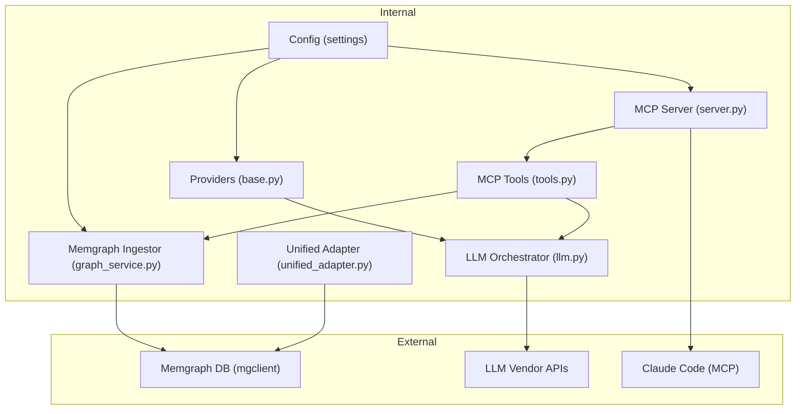
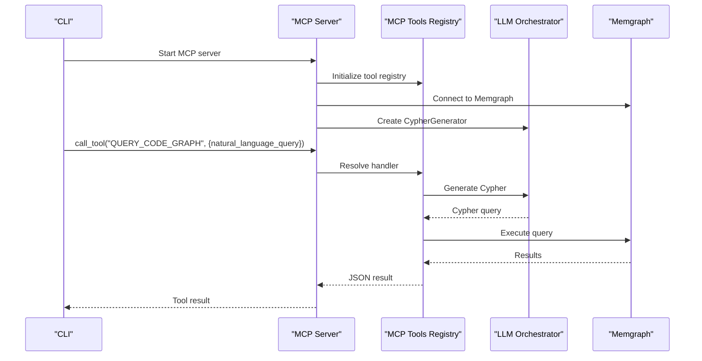
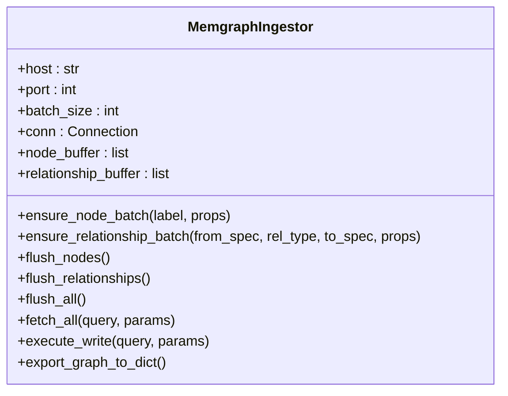
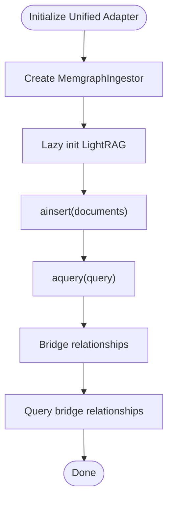
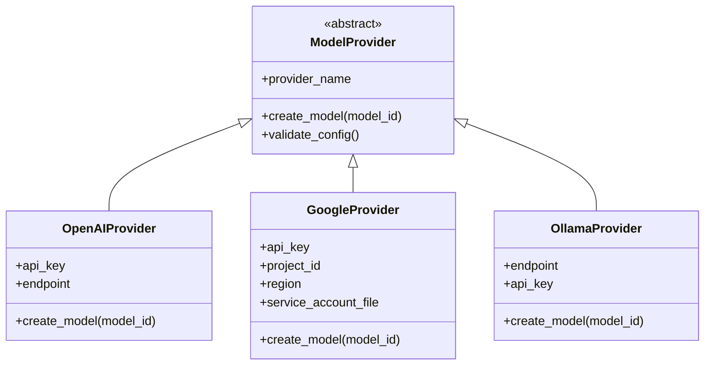
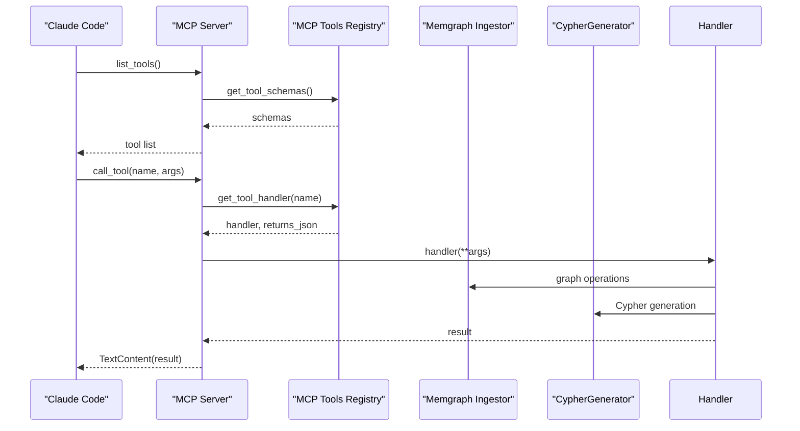
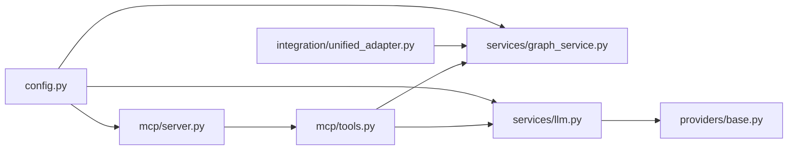

# Integration Points and External Systems

<cite>
**Referenced Files in This Document**
- [graph_service.py](file://codebase_rag/services/graph_service.py)
- [llm.py](file://codebase_rag/services/llm.py)
- [server.py](file://codebase_rag/mcp/server.py)
- [tools.py](file://codebase_rag/mcp/tools.py)
- [unified_adapter.py](file://codebase_rag/integration/unified_adapter.py)
- [config.py](file://codebase_rag/config.py)
- [base.py](file://codebase_rag/providers/base.py)
- [constants.py](file://codebase_rag/constants.py)
- [cypher_queries.py](file://codebase_rag/cypher_queries.py)
- [types_defs.py](file://codebase_rag/types_defs.py)
- [test_mcp_server.py](file://codebase_rag/tests/test_mcp_server.py)
- [test_memgraph_batching.py](file://codebase_rag/tests/test_memgraph_batching.py)
- [test_llm_service_unit.py](file://codebase_rag/tests/test_llm_service_unit.py)
</cite>

## Table of Contents
1. [Introduction](#introduction)
2. [Project Structure](#project-structure)
3. [Core Components](#core-components)
4. [Architecture Overview](#architecture-overview)
5. [Detailed Component Analysis](#detailed-component-analysis)
6. [Dependency Analysis](#dependency-analysis)
7. [Performance Considerations](#performance-considerations)
8. [Troubleshooting Guide](#troubleshooting-guide)
9. [Conclusion](#conclusion)

## Introduction
This document explains how the system integrates with external services and systems, focusing on three pillars:
- Knowledge storage via Memgraph (synchronous mgclient-based ingestion and asynchronous unified adapter)
- AI providers for LLM orchestration (OpenAI, Google, Ollama, Anthropic support via pydantic-ai)
- MCP protocol for Claude Code integration (tool discovery, execution, and streaming via stdio)

It covers technical specifications (protocols, data formats, authentication), configuration options, error handling, fallbacks, and practical examples drawn from the codebase.

## Project Structure
The integration surface spans several modules:
- Services: Memgraph ingestion and LLM orchestration
- MCP: Server bootstrap, tool registry, and tool handlers
- Providers: Provider abstraction and model creation
- Config: Environment-driven settings for providers and Memgraph
- Types and constants: Shared schemas, enums, and logging formats
- Tests: Behavioral verification of integration points

**Diagram sources**
- [graph_service.py](file://codebase_rag/services/graph_service.py#L49-L364)
- [llm.py](file://codebase_rag/services/llm.py#L1-L93)
- [server.py](file://codebase_rag/mcp/server.py#L1-L166)
- [tools.py](file://codebase_rag/mcp/tools.py#L1-L458)
- [unified_adapter.py](file://codebase_rag/integration/unified_adapter.py#L1-L384)
- [config.py](file://codebase_rag/config.py#L1-L274)
- [base.py](file://codebase_rag/providers/base.py#L1-L209)

**Section sources**
- [graph_service.py](file://codebase_rag/services/graph_service.py#L1-L364)
- [llm.py](file://codebase_rag/services/llm.py#L1-L93)
- [server.py](file://codebase_rag/mcp/server.py#L1-L166)
- [tools.py](file://codebase_rag/mcp/tools.py#L1-L458)
- [unified_adapter.py](file://codebase_rag/integration/unified_adapter.py#L1-L384)
- [config.py](file://codebase_rag/config.py#L1-L274)
- [base.py](file://codebase_rag/providers/base.py#L1-L209)
- [constants.py](file://codebase_rag/constants.py#L1-L800)

## Core Components
- Memgraph Ingestor: Synchronous mgclient-based connector with batching, constraint enforcement, and export capabilities.
- Unified Adapter: Bridges graph-code and LightRAG to a single Memgraph instance, enabling cross-tool knowledge graphs.
- LLM Orchestrator: Creates agents backed by configurable providers (OpenAI, Google, Ollama) and exposes Cypher generation and orchestrator creation.
- MCP Server: Exposes a tool registry over MCP stdio, integrating with Memgraph and LLM services for Claude Code.

Key integration characteristics:
- Memgraph: TCP socket connections (mgclient), Cypher queries, UNWIND batching, and constraint enforcement.
- LLM: Provider-specific authentication and endpoints; unified model creation via pydantic-ai.
- MCP: stdio transport, JSON-like tool schemas, and structured tool responses.

**Section sources**
- [graph_service.py](file://codebase_rag/services/graph_service.py#L49-L364)
- [unified_adapter.py](file://codebase_rag/integration/unified_adapter.py#L19-L384)
- [llm.py](file://codebase_rag/services/llm.py#L23-L93)
- [server.py](file://codebase_rag/mcp/server.py#L58-L135)
- [tools.py](file://codebase_rag/mcp/tools.py#L40-L458)

## Architecture Overview
The system orchestrates three primary flows:
1) Knowledge ingestion to Memgraph (graph-code pipeline)
2) Unified knowledge graph for both graph-code and LightRAG
3) LLM-driven Cypher generation and tool orchestration via MCP

**Diagram sources**
- [server.py](file://codebase_rag/mcp/server.py#L138-L166)
- [tools.py](file://codebase_rag/mcp/tools.py#L314-L334)
- [llm.py](file://codebase_rag/services/llm.py#L58-L76)
- [graph_service.py](file://codebase_rag/services/graph_service.py#L329-L340)

## Detailed Component Analysis

### Memgraph Integration
- Connection protocol: mgclient TCP socket to Memgraph (host/port), autocommit enabled.
- Authentication: No explicit credentials in mgclient usage; defaults to local Memgraph without TLS.
- Data exchange format: Cypher statements; batching via UNWIND with a typed batch wrapper.
- Constraints: Automatic enforcement of unique node constraints per label.
- Export: Full graph export via Cypher queries for nodes and relationships.

**Diagram sources**
- [graph_service.py](file://codebase_rag/services/graph_service.py#L49-L364)
- [cypher_queries.py](file://codebase_rag/cypher_queries.py#L1-L120)
- [types_defs.py](file://codebase_rag/types_defs.py#L37-L53)

Configuration and environment:
- Host, port, HTTP port, batch size configured via environment variables (.env or process env).
- Batch size validated to be positive.

Error handling and fallbacks:
- Exceptions logged with context; non-constraint duplicates are surfaced; batch failures truncate long parameter logs.
- Constraint enforcement attempts per label; missing unique keys skip node merges with warnings.

Practical examples from codebase:
- Batching thresholds trigger flushes; relationship flush triggers node flush to maintain referential integrity.
- Export returns nodes, relationships, and metadata for downstream consumption.

**Section sources**
- [graph_service.py](file://codebase_rag/services/graph_service.py#L49-L364)
- [cypher_queries.py](file://codebase_rag/cypher_queries.py#L1-L120)
- [types_defs.py](file://codebase_rag/types_defs.py#L37-L53)
- [config.py](file://codebase_rag/config.py#L50-L56)
- [test_memgraph_batching.py](file://codebase_rag/tests/test_memgraph_batching.py#L20-L91)

### Unified Adapter (graph-code + LightRAG)
- Purpose: Share a single Memgraph instance between graph-code and LightRAG.
- Approach: Two-layer storage abstraction—graph-code synchronous mgclient and LightRAG async initialization.
- Cross-tool relationships: Bridge relationships connect code entities to LightRAG document entities.
- Storage modes: LightRAG uses JSON KV and Nano vector storage in this PoC; Memgraph graph storage is configured.

**Diagram sources**
- [unified_adapter.py](file://codebase_rag/integration/unified_adapter.py#L69-L111)
- [unified_adapter.py](file://codebase_rag/integration/unified_adapter.py#L163-L196)
- [unified_adapter.py](file://codebase_rag/integration/unified_adapter.py#L202-L279)

Configuration and environment:
- Host, port, batch size, and working directory configurable; working_dir created if missing.
- LightRAG import guarded with ImportError and clear messaging.

Practical examples from codebase:
- Adding code nodes and relationships, bridging to document entities, and querying statistics.

**Section sources**
- [unified_adapter.py](file://codebase_rag/integration/unified_adapter.py#L19-L384)
- [config.py](file://codebase_rag/config.py#L50-L56)

### LLM Orchestration and AI Providers
- Provider abstraction supports OpenAI, Google (Vertex/GLA), Ollama, and Anthropic (via pydantic-ai).
- Model creation is provider-specific; validation ensures required credentials/endpoints.
- Orchestrator: Agents with tools, retries, and output retries; Cypher generator produces Cypher from natural language.

**Diagram sources**
- [base.py](file://codebase_rag/providers/base.py#L20-L156)

Configuration and environment:
- Provider selection and model ID via environment variables; defaults to Ollama with local endpoint.
- Health checks for Ollama endpoint; timeout configurable.

Practical examples from codebase:
- Creating provider-backed models for Cypher generation and orchestrator creation.
- Cleaning LLM responses to valid Cypher format and enforcing query keywords.

**Section sources**
- [llm.py](file://codebase_rag/services/llm.py#L23-L93)
- [base.py](file://codebase_rag/providers/base.py#L158-L209)
- [config.py](file://codebase_rag/config.py#L68-L79)
- [test_llm_service_unit.py](file://codebase_rag/tests/test_llm_service_unit.py#L62-L251)

### MCP Protocol for Claude Code Integration
- Transport: stdio server; server name registered; tool schemas exposed via list_tools.
- Tool registry: Centralized mapping of tool names to handlers with JSON schema inputs.
- Execution: Handlers return either plain text or JSON-formatted results; errors wrapped in text content.
- Project root resolution: Environment variable or settings override; defaults to current working directory; validates existence and type.

**Diagram sources**
- [server.py](file://codebase_rag/mcp/server.py#L96-L135)
- [tools.py](file://codebase_rag/mcp/tools.py#L433-L446)

Configuration and environment:
- Logging level and format controlled by constants; MCP server name and content types defined centrally.
- Project root resolution order: TARGET_REPO_PATH env, then settings.TARGET_REPO_PATH, then PWD/CWD; raises on invalid path.

Practical examples from codebase:
- Tool handlers for listing/deleting projects, wiping database, indexing repository, querying code graph, retrieving code snippets, surgical replacements, file read/write, and directory listing.

**Section sources**
- [server.py](file://codebase_rag/mcp/server.py#L21-L135)
- [tools.py](file://codebase_rag/mcp/tools.py#L40-L458)
- [constants.py](file://codebase_rag/constants.py#L2361-L2417)
- [test_mcp_server.py](file://codebase_rag/tests/test_mcp_server.py#L11-L173)

## Dependency Analysis
- Internal dependencies:
  - MCP server depends on MemgraphIngestor and CypherGenerator.
  - MCP tools depend on MemgraphIngestor, CypherGenerator, and internal tool implementations.
  - LLM orchestrator depends on provider registry and settings.
  - Unified adapter composes MemgraphIngestor and lazy-initializes LightRAG.
- External dependencies:
  - mgclient for Memgraph connectivity.
  - pydantic-ai for LLM agents and provider models.
  - mcp packages for MCP stdio server and types.
  - httpx for provider health checks.

**Diagram sources**
- [server.py](file://codebase_rag/mcp/server.py#L58-L82)
- [tools.py](file://codebase_rag/mcp/tools.py#L40-L68)
- [graph_service.py](file://codebase_rag/services/graph_service.py#L49-L74)
- [llm.py](file://codebase_rag/services/llm.py#L19-L25)
- [base.py](file://codebase_rag/providers/base.py#L158-L189)
- [unified_adapter.py](file://codebase_rag/integration/unified_adapter.py#L52-L58)
- [config.py](file://codebase_rag/config.py#L39-L234)

**Section sources**
- [server.py](file://codebase_rag/mcp/server.py#L58-L82)
- [tools.py](file://codebase_rag/mcp/tools.py#L40-L68)
- [graph_service.py](file://codebase_rag/services/graph_service.py#L49-L74)
- [llm.py](file://codebase_rag/services/llm.py#L19-L25)
- [base.py](file://codebase_rag/providers/base.py#L158-L189)
- [unified_adapter.py](file://codebase_rag/integration/unified_adapter.py#L52-L58)
- [config.py](file://codebase_rag/config.py#L39-L234)

## Performance Considerations
- Batching: MemgraphIngestor batches node and relationship writes using UNWIND to reduce round-trips; tune MEMGRAPH_BATCH_SIZE for throughput vs. memory trade-offs.
- Constraint enforcement: Unique constraints are created per label; missing unique keys cause node merges to be skipped with warnings.
- LLM retries: Agent-level retries and orchestrator output retries improve robustness against transient provider errors.
- MCP stdio: Streaming via stdio avoids network overhead; ensure adequate logging levels to avoid verbose stderr bloat.

[No sources needed since this section provides general guidance]

## Troubleshooting Guide
Common integration issues and resolutions:
- Memgraph connection failures:
  - Verify host/port and that Memgraph is reachable; no credentials required by mgclient in default setup.
  - Check batch size is positive; invalid sizes raise explicit errors.
- LLM provider misconfiguration:
  - Ensure required API keys/endpoints are set; provider health checks for Ollama endpoint.
  - Confirm provider/model strings are valid; parsing errors are raised for malformed entries.
- MCP server startup:
  - TARGET_REPO_PATH must exist and be a directory; defaults to current working directory if unset.
  - Tool execution errors are wrapped in text content; inspect logs for stack traces.
- Unified adapter:
  - LightRAG not installed: ImportError with installation guidance; install lightRAG package before use.
  - Query before initialization: Runtime error instructs to initialize LightRAG first.

**Section sources**
- [graph_service.py](file://codebase_rag/services/graph_service.py#L53-L55)
- [base.py](file://codebase_rag/providers/base.py#L201-L209)
- [server.py](file://codebase_rag/mcp/server.py#L48-L55)
- [unified_adapter.py](file://codebase_rag/integration/unified_adapter.py#L82-L94)
- [test_mcp_server.py](file://codebase_rag/tests/test_mcp_server.py#L91-L111)

## Conclusion
The system integrates external services through well-defined boundaries:
- Memgraph ingestion uses mgclient with batching and constraints for reliable knowledge persistence.
- LLM orchestration leverages a provider abstraction to support multiple vendors with consistent model creation and validation.
- MCP enables seamless Claude Code integration via stdio, exposing a curated set of tools that operate on the shared knowledge graph.

Configuration is environment-driven, error handling is explicit, and fallbacks are provided where applicable. The unified adapter further extends the knowledge graph to include document processing capabilities, enabling richer cross-domain insights.