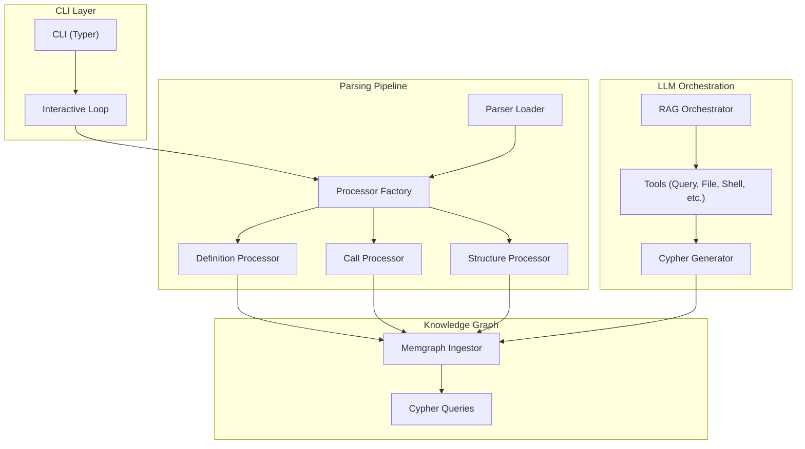
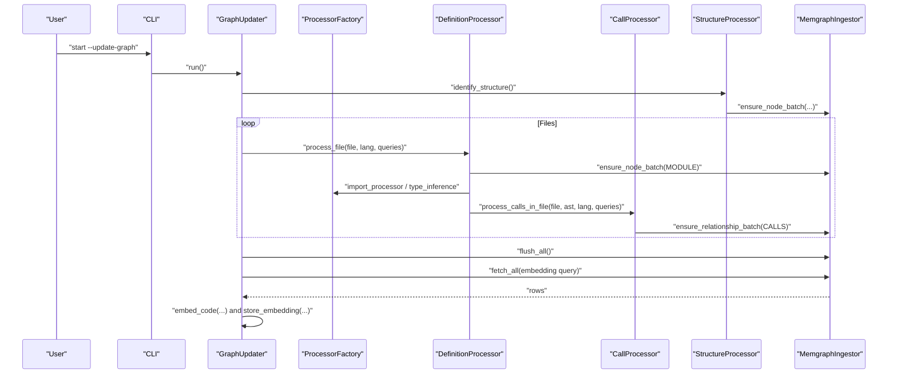
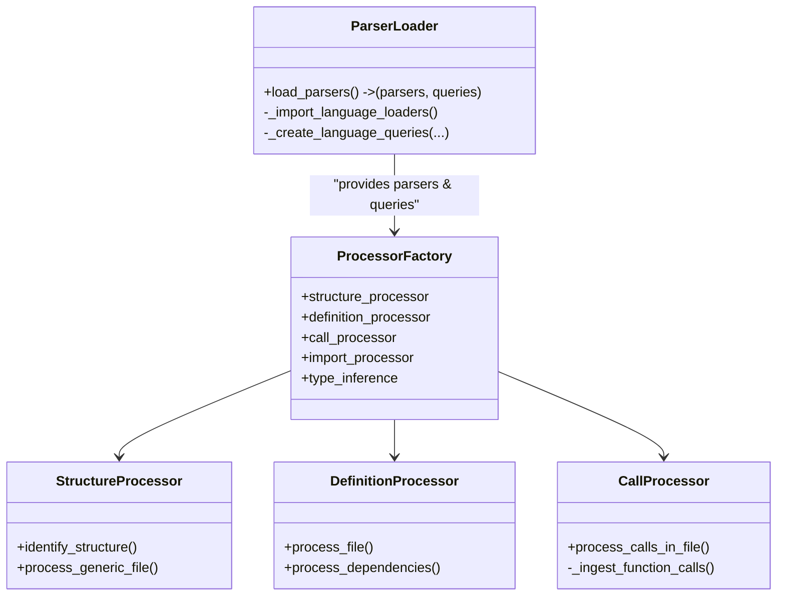
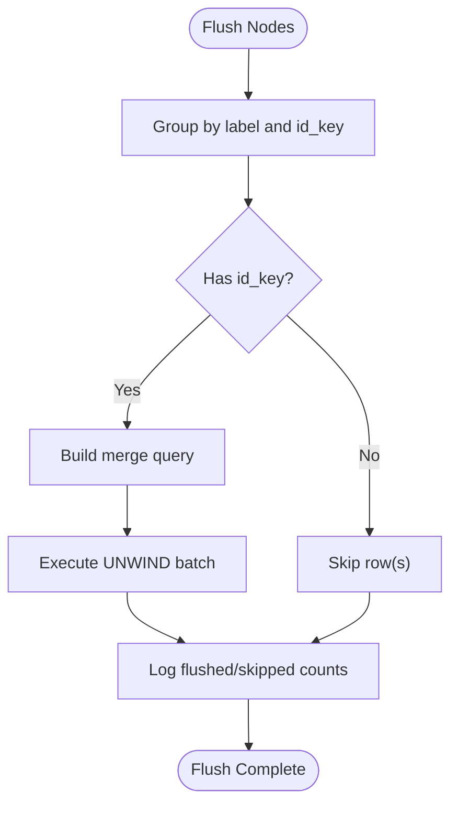
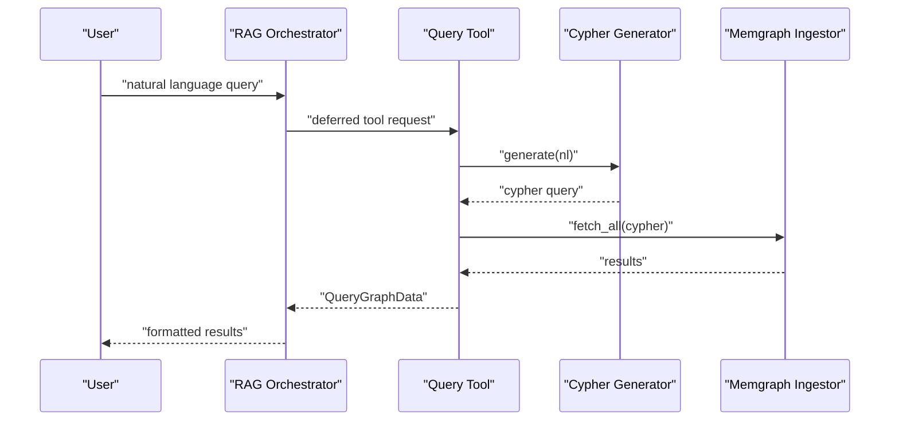
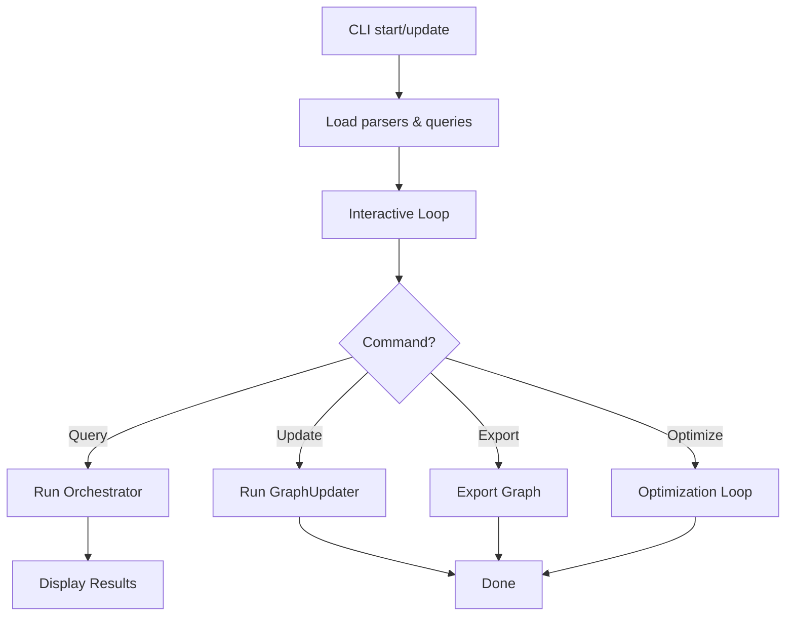
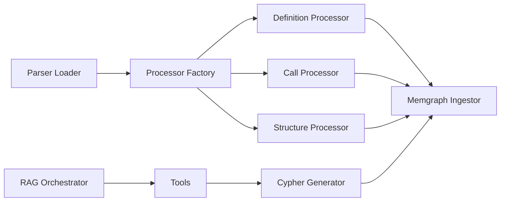
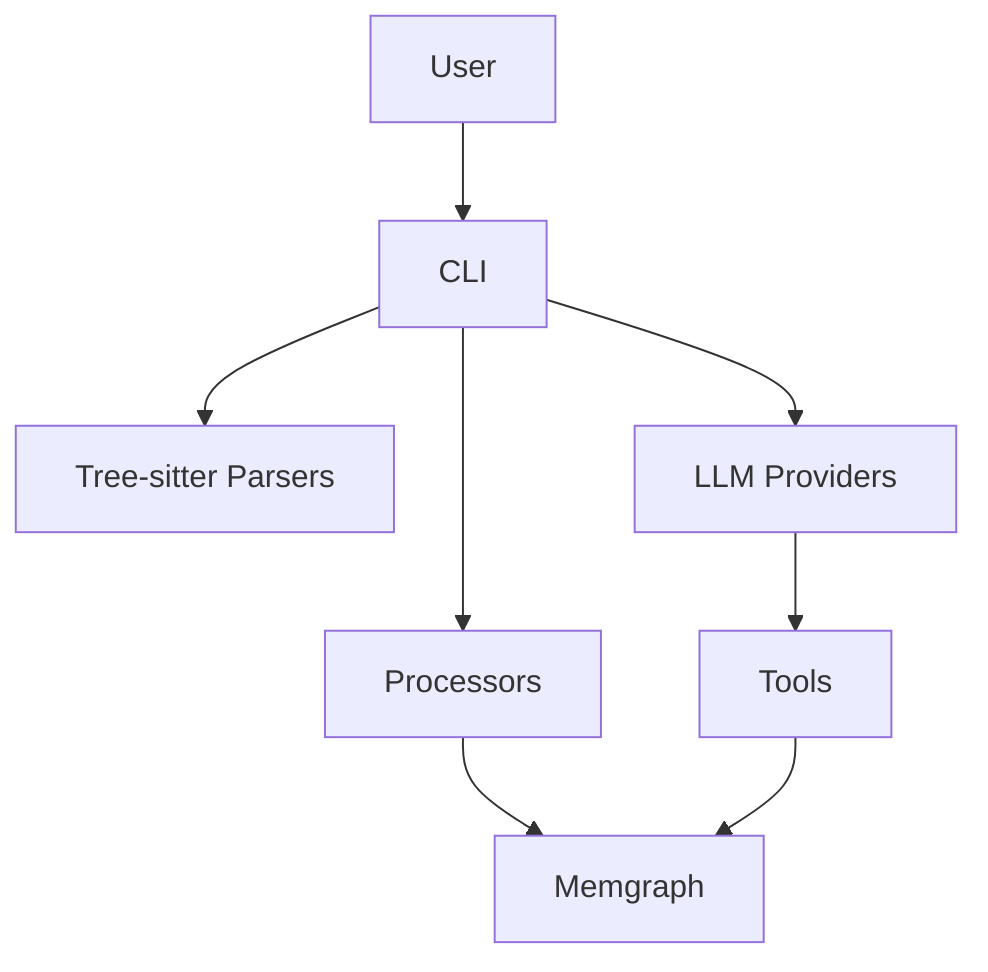

# System Architecture

<cite>
**Referenced Files in This Document**
- [main.py](file://codebase_rag/main.py)
- [cli.py](file://codebase_rag/cli.py)
- [graph_updater.py](file://codebase_rag/graph_updater.py)
- [services/graph_service.py](file://codebase_rag/services/graph_service.py)
- [parsers/factory.py](file://codebase_rag/parsers/factory.py)
- [services/llm.py](file://codebase_rag/services/llm.py)
- [parsers/call_processor.py](file://codebase_rag/parsers/call_processor.py)
- [parsers/definition_processor.py](file://codebase_rag/parsers/definition_processor.py)
- [parsers/structure_processor.py](file://codebase_rag/parsers/structure_processor.py)
- [parser_loader.py](file://codebase_rag/parser_loader.py)
- [config.py](file://codebase_rag/config.py)
- [providers/base.py](file://codebase_rag/providers/base.py)
- [tools/codebase_query.py](file://codebase_rag/tools/codebase_query.py)
- [cypher_queries.py](file://codebase_rag/cypher_queries.py)
- [types_defs.py](file://codebase_rag/types_defs.py)
</cite>

## Table of Contents
1. [Introduction](#introduction)
2. [Project Structure](#project-structure)
3. [Core Components](#core-components)
4. [Architecture Overview](#architecture-overview)
5. [Detailed Component Analysis](#detailed-component-analysis)
6. [Dependency Analysis](#dependency-analysis)
7. [Performance Considerations](#performance-considerations)
8. [Troubleshooting Guide](#troubleshooting-guide)
9. [Conclusion](#conclusion)
10. [Appendices](#appendices)

## Introduction
This document describes the system architecture of the Graph-Code system, focusing on the dual pipeline that transforms source code into a knowledge graph and enables natural language querying via a dual-model LLM orchestration. The system comprises:
- A multi-language parser built on Tree-sitter with language-specific queries and a processor factory
- A knowledge graph storage layer backed by Memgraph with batching and constraint enforcement
- An interactive CLI that orchestrates ingestion, querying, and tooling
- A dual-model LLM system: one for Cypher generation and another for agent orchestration

The architecture emphasizes modularity, extensibility, and performance through batching, caching, and streaming-like processing.

## Project Structure
High-level modules and responsibilities:
- CLI and orchestration: entry points, interactive loops, and command routing
- Parsing pipeline: Tree-sitter grammar loading, AST traversal, and processor factory
- Ingestion and storage: Memgraph-backed ingestion with batching and constraints
- LLM integration: Cypher generator and orchestrator agent
- Tools and utilities: query tool, vector store integration, and shared types

**Diagram sources**
- [cli.py](file://codebase_rag/cli.py#L1-L395)
- [main.py](file://codebase_rag/main.py#L1-L1062)
- [parser_loader.py](file://codebase_rag/parser_loader.py#L1-L293)
- [parsers/factory.py](file://codebase_rag/parsers/factory.py#L1-L116)
- [parsers/structure_processor.py](file://codebase_rag/parsers/structure_processor.py#L1-L133)
- [parsers/definition_processor.py](file://codebase_rag/parsers/definition_processor.py#L1-L193)
- [parsers/call_processor.py](file://codebase_rag/parsers/call_processor.py#L1-L364)
- [services/graph_service.py](file://codebase_rag/services/graph_service.py#L1-L364)
- [services/llm.py](file://codebase_rag/services/llm.py#L1-L93)
- [tools/codebase_query.py](file://codebase_rag/tools/codebase_query.py#L1-L95)
- [cypher_queries.py](file://codebase_rag/cypher_queries.py#L1-L120)

**Section sources**
- [cli.py](file://codebase_rag/cli.py#L1-L395)
- [main.py](file://codebase_rag/main.py#L1-L1062)

## Core Components
- Parser Loader: Dynamically loads Tree-sitter grammars and builds per-language queries
- Processor Factory: Creates and lazily initializes processors (structure, definitions, calls, imports, types)
- GraphUpdater: Coordinates ingestion passes, manages caches, and triggers semantic embeddings
- Memgraph Ingestor: Batches node and relationship writes, enforces uniqueness constraints
- LLM Services: Dual-model agents for Cypher generation and orchestration
- CLI: Interactive loop and commands for ingestion, querying, exporting, and optimization

Key design patterns:
- Factory Pattern: Centralized creation of processors with lazy initialization
- Observer-like behavior: Real-time updates via incremental ingestion and export capabilities

**Section sources**
- [parser_loader.py](file://codebase_rag/parser_loader.py#L1-L293)
- [parsers/factory.py](file://codebase_rag/parsers/factory.py#L1-L116)
- [graph_updater.py](file://codebase_rag/graph_updater.py#L1-L469)
- [services/graph_service.py](file://codebase_rag/services/graph_service.py#L1-L364)
- [services/llm.py](file://codebase_rag/services/llm.py#L1-L93)
- [cli.py](file://codebase_rag/cli.py#L1-L395)

## Architecture Overview
The system follows a staged ingestion pipeline:
1. Source discovery and structure identification
2. AST parsing and definition ingestion
3. Call-site resolution and relationship creation
4. Optional semantic embedding generation
5. Query processing via LLM-generated Cypher against Memgraph

**Diagram sources**
- [cli.py](file://codebase_rag/cli.py#L107-L162)
- [graph_updater.py](file://codebase_rag/graph_updater.py#L264-L286)
- [parsers/structure_processor.py](file://codebase_rag/parsers/structure_processor.py#L39-L109)
- [parsers/definition_processor.py](file://codebase_rag/parsers/definition_processor.py#L53-L140)
- [parsers/call_processor.py](file://codebase_rag/parsers/call_processor.py#L49-L74)
- [services/graph_service.py](file://codebase_rag/services/graph_service.py#L323-L327)

## Detailed Component Analysis

### Multi-Language Parser with Tree-sitter
- Grammar loading: Loads language-specific Tree-sitter libraries and builds parsers and queries
- Query composition: Constructs language-specific queries for functions, classes, calls, imports, and locals
- Language coverage: Supports Python, JavaScript, TypeScript, Rust, Go, Scala, Java, C++, Lua

**Diagram sources**
- [parser_loader.py](file://codebase_rag/parser_loader.py#L276-L293)
- [parsers/factory.py](file://codebase_rag/parsers/factory.py#L18-L116)
- [parsers/structure_processor.py](file://codebase_rag/parsers/structure_processor.py#L12-L133)
- [parsers/definition_processor.py](file://codebase_rag/parsers/definition_processor.py#L25-L193)
- [parsers/call_processor.py](file://codebase_rag/parsers/call_processor.py#L20-L364)

**Section sources**
- [parser_loader.py](file://codebase_rag/parser_loader.py#L1-L293)
- [parsers/factory.py](file://codebase_rag/parsers/factory.py#L1-L116)
- [parsers/structure_processor.py](file://codebase_rag/parsers/structure_processor.py#L1-L133)
- [parsers/definition_processor.py](file://codebase_rag/parsers/definition_processor.py#L1-L193)
- [parsers/call_processor.py](file://codebase_rag/parsers/call_processor.py#L1-L364)

### Knowledge Graph Storage with Memgraph
- Constraint enforcement: Ensures unique properties per node label before merges
- Batching: Aggregates nodes and relationships by label/type to minimize round-trips
- Flush strategy: Separate flush for nodes and relationships with progress logging
- Export: Full graph export to JSON with metadata

**Diagram sources**
- [services/graph_service.py](file://codebase_rag/services/graph_service.py#L219-L266)

**Section sources**
- [services/graph_service.py](file://codebase_rag/services/graph_service.py#L1-L364)
- [cypher_queries.py](file://codebase_rag/cypher_queries.py#L1-L120)

### Dual-Model LLM Orchestrator and Cypher Generation
- Cypher Generator: Generates Cypher queries from natural language using a dedicated model configuration
- Orchestrator: A multi-tool agent that decides whether to execute tools or respond directly
- Provider abstraction: Supports OpenAI, Google, and Ollama with runtime validation

**Diagram sources**
- [services/llm.py](file://codebase_rag/services/llm.py#L37-L93)
- [tools/codebase_query.py](file://codebase_rag/tools/codebase_query.py#L24-L95)
- [providers/base.py](file://codebase_rag/providers/base.py#L1-L209)

**Section sources**
- [services/llm.py](file://codebase_rag/services/llm.py#L1-L93)
- [tools/codebase_query.py](file://codebase_rag/tools/codebase_query.py#L1-L95)
- [providers/base.py](file://codebase_rag/providers/base.py#L1-L209)

### CLI and Interactive Loop
- Commands: start, index, export, optimize, graph-loader, mcp-server
- Interactive loop: Multiline input, session logging, model switching, tool approvals
- Batch sizing: Configurable Memgraph batch size with defaults

**Diagram sources**
- [cli.py](file://codebase_rag/cli.py#L55-L172)
- [main.py](file://codebase_rag/main.py#L604-L694)

**Section sources**
- [cli.py](file://codebase_rag/cli.py#L1-L395)
- [main.py](file://codebase_rag/main.py#L1-L1062)

## Dependency Analysis
- Coupling: GraphUpdater depends on IngestorProtocol and QueryProtocol; processors depend on ingestors and shared registries
- Cohesion: Parser Loader encapsulates grammar loading; Processor Factory encapsulates processor creation
- External integrations: Memgraph via mgclient; LLM providers via pydantic-ai; Tree-sitter grammars via dynamic imports

**Diagram sources**
- [parser_loader.py](file://codebase_rag/parser_loader.py#L276-L293)
- [parsers/factory.py](file://codebase_rag/parsers/factory.py#L18-L116)
- [parsers/definition_processor.py](file://codebase_rag/parsers/definition_processor.py#L25-L193)
- [parsers/call_processor.py](file://codebase_rag/parsers/call_processor.py#L20-L364)
- [parsers/structure_processor.py](file://codebase_rag/parsers/structure_processor.py#L12-L133)
- [services/graph_service.py](file://codebase_rag/services/graph_service.py#L49-L364)
- [services/llm.py](file://codebase_rag/services/llm.py#L37-L93)
- [tools/codebase_query.py](file://codebase_rag/tools/codebase_query.py#L24-L95)

**Section sources**
- [types_defs.py](file://codebase_rag/types_defs.py#L1-L555)
- [config.py](file://codebase_rag/config.py#L1-L274)

## Performance Considerations
- Batching: MemgraphIngestor batches node and relationship writes; configurable batch size reduces round-trips
- Caching: BoundedASTCache limits memory and eviction policy prevents excessive memory growth
- Parallelism: CLI supports asynchronous orchestration; ingestion runs in a single-threaded loop optimized for I/O
- Embeddings: Semantic embedding generation is conditional and progress-interval controlled
- Scalability: Memgraph cluster deployment recommended for production; consider partitioning large repositories

[No sources needed since this section provides general guidance]

## Troubleshooting Guide
Common issues and resolutions:
- No languages available: Parser Loader raises runtime error if no grammars load
- Ollama not running: Provider validation checks health endpoint and raises configuration errors
- Memgraph connectivity: Ingestor logs connection errors and batch failures with truncated params for inspection
- LLM generation failures: CypherGenerator validates generated queries and raises explicit errors

**Section sources**
- [parser_loader.py](file://codebase_rag/parser_loader.py#L288-L292)
- [providers/base.py](file://codebase_rag/providers/base.py#L201-L209)
- [services/graph_service.py](file://codebase_rag/services/graph_service.py#L104-L146)
- [services/llm.py](file://codebase_rag/services/llm.py#L58-L76)

## Conclusion
The Graph-Code system combines a robust Tree-sitter-based parsing pipeline with a Memgraph-backed knowledge graph and a dual-model LLM orchestration for natural language querying. Its modular design, batching, and caching enable scalable ingestion and querying. The CLI provides an interactive experience with tool approvals and session logging. For production, deploy Memgraph in a clustered topology and configure provider endpoints appropriately.

[No sources needed since this section summarizes without analyzing specific files]

## Appendices

### System Context Diagram

**Diagram sources**
- [cli.py](file://codebase_rag/cli.py#L1-L395)
- [parser_loader.py](file://codebase_rag/parser_loader.py#L1-L293)
- [services/graph_service.py](file://codebase_rag/services/graph_service.py#L1-L364)
- [providers/base.py](file://codebase_rag/providers/base.py#L1-L209)
- [tools/codebase_query.py](file://codebase_rag/tools/codebase_query.py#L1-L95)

### Data Flow Summary
- Source code → Tree-sitter AST → Definitions and imports → Calls and relationships → Memgraph
- Natural language query → Cypher generator → Cypher → Memgraph → Results

**Section sources**
- [graph_updater.py](file://codebase_rag/graph_updater.py#L264-L286)
- [services/llm.py](file://codebase_rag/services/llm.py#L58-L76)
- [tools/codebase_query.py](file://codebase_rag/tools/codebase_query.py#L32-L88)