# Integration Testing

<cite>
**Referenced Files in This Document**
- [test_codebase_query_integration.py](file://codebase_rag/tests/integration/test_codebase_query_integration.py)
- [test_mcp_tools_integration.py](file://codebase_rag/tests/integration/test_mcp_tools_integration.py)
- [test_multi_project_integration.py](file://codebase_rag/tests/integration/test_multi_project_integration.py)
- [test_imports_e2e.py](file://codebase_rag/tests/integration/test_imports_e2e.py)
- [test_document_analyzer_integration.py](file://codebase_rag/tests/integration/test_document_analyzer_integration.py)
- [test_node_label_e2e.py](file://codebase_rag/tests/integration/test_node_label_e2e.py)
- [test_shell_command_integration.py](file://codebase_rag/tests/integration/test_shell_command_integration.py)
- [test_tool_calling.py](file://codebase_rag/tests/integration/test_tool_calling.py)
- [conftest.py](file://codebase_rag/tests/conftest.py)
- [tools.py](file://codebase_rag/mcp/tools.py)
- [INTEGRATION_SUMMARY.md](file://INTEGRATION_SUMMARY.md)
- [INTEGRATION_COMPLETE.md](file://INTEGRATION_COMPLETE.md)
</cite>

## Table of Contents
1. [Introduction](#introduction)
2. [Project Structure](#project-structure)
3. [Core Components](#core-components)
4. [Architecture Overview](#architecture-overview)
5. [Detailed Component Analysis](#detailed-component-analysis)
6. [Dependency Analysis](#dependency-analysis)
7. [Performance Considerations](#performance-considerations)
8. [Troubleshooting Guide](#troubleshooting-guide)
9. [Conclusion](#conclusion)
10. [Appendices](#appendices)

## Introduction
This document provides comprehensive integration testing guidance for the codebase, focusing on end-to-end workflows, multi-component scenarios, and cross-language integrations. It covers:
- End-to-end pipelines from ingestion to querying and tool interactions
- Multi-project indexing and isolation
- Cross-language import and relationship validation
- MCP tools integration and Claude Code compatibility verification
- Semantic search and knowledge graph operations
- Test environment setup, database initialization/cleanup, and real-world scenario coverage
- Running integration tests and interpreting results
- Troubleshooting common failures

## Project Structure
The integration tests reside under codebase_rag/tests/integration and leverage a shared test harness in codebase_rag/tests/conftest.py. They exercise:
- Codebase query tool and Cypher generation
- MCP tools registry and tool execution
- Multi-project indexing and deletion
- Import relationships across languages (Java, Python, JS, TS, Rust, Go, C++, Lua)
- Document analysis and provider integration
- Node labeling and relationship validation
- Shell command execution and approval gating
- Tool calling orchestration and parallel execution

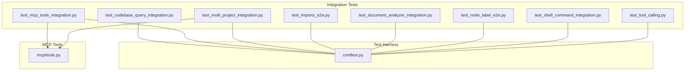

**Diagram sources**
- [test_codebase_query_integration.py](file://codebase_rag/tests/integration/test_codebase_query_integration.py#L1-L208)
- [test_mcp_tools_integration.py](file://codebase_rag/tests/integration/test_mcp_tools_integration.py#L1-L137)
- [test_multi_project_integration.py](file://codebase_rag/tests/integration/test_multi_project_integration.py#L1-L220)
- [test_imports_e2e.py](file://codebase_rag/tests/integration/test_imports_e2e.py#L1-L674)
- [test_document_analyzer_integration.py](file://codebase_rag/tests/integration/test_document_analyzer_integration.py#L1-L218)
- [test_node_label_e2e.py](file://codebase_rag/tests/integration/test_node_label_e2e.py#L1-L961)
- [test_shell_command_integration.py](file://codebase_rag/tests/integration/test_shell_command_integration.py#L1-L248)
- [test_tool_calling.py](file://codebase_rag/tests/integration/test_tool_calling.py#L1-L155)
- [conftest.py](file://codebase_rag/tests/conftest.py#L1-L290)
- [tools.py](file://codebase_rag/mcp/tools.py#L1-L458)

**Section sources**
- [test_codebase_query_integration.py](file://codebase_rag/tests/integration/test_codebase_query_integration.py#L1-L208)
- [test_mcp_tools_integration.py](file://codebase_rag/tests/integration/test_mcp_tools_integration.py#L1-L137)
- [test_multi_project_integration.py](file://codebase_rag/tests/integration/test_multi_project_integration.py#L1-L220)
- [test_imports_e2e.py](file://codebase_rag/tests/integration/test_imports_e2e.py#L1-L674)
- [test_document_analyzer_integration.py](file://codebase_rag/tests/integration/test_document_analyzer_integration.py#L1-L218)
- [test_node_label_e2e.py](file://codebase_rag/tests/integration/test_node_label_e2e.py#L1-L961)
- [test_shell_command_integration.py](file://codebase_rag/tests/integration/test_shell_command_integration.py#L1-L248)
- [test_tool_calling.py](file://codebase_rag/tests/integration/test_tool_calling.py#L1-L155)
- [conftest.py](file://codebase_rag/tests/conftest.py#L1-L290)
- [tools.py](file://codebase_rag/mcp/tools.py#L1-L458)

## Core Components
- Query tool integration validates natural language to Cypher translation, result structure, and error handling paths.
- MCP tools integration verifies end-to-end tool execution, schema consistency, and behavior without excessive mocking.
- Multi-project integration validates project listing, deletion, isolation, and clean database operations.
- Cross-language import relationships ensure correct module and relationship creation across Java, Python, JS/TS, Rust, Go, C++, and Lua.
- Document analyzer integration validates provider selection, client behavior, and error handling.
- Node label and relationship validation ensures correct graph labeling and relationship types per language.
- Shell command integration validates read-only commands, approval gating for write commands, and pipeline safety.
- Tool calling integration validates parallel and hybrid orchestration with a tracking agent.

**Section sources**
- [test_codebase_query_integration.py](file://codebase_rag/tests/integration/test_codebase_query_integration.py#L53-L208)
- [test_mcp_tools_integration.py](file://codebase_rag/tests/integration/test_mcp_tools_integration.py#L56-L137)
- [test_multi_project_integration.py](file://codebase_rag/tests/integration/test_multi_project_integration.py#L62-L220)
- [test_imports_e2e.py](file://codebase_rag/tests/integration/test_imports_e2e.py#L290-L674)
- [test_document_analyzer_integration.py](file://codebase_rag/tests/integration/test_document_analyzer_integration.py#L71-L218)
- [test_node_label_e2e.py](file://codebase_rag/tests/integration/test_node_label_e2e.py#L445-L961)
- [test_shell_command_integration.py](file://codebase_rag/tests/integration/test_shell_command_integration.py#L37-L248)
- [test_tool_calling.py](file://codebase_rag/tests/integration/test_tool_calling.py#L131-L155)

## Architecture Overview
The integration test suite orchestrates Memgraph-backed ingestion, querying, and tool execution. The MCP tools registry composes multiple tools (query, code retrieval, file operations, directory listing) around a shared ingestor and Cypher generator.

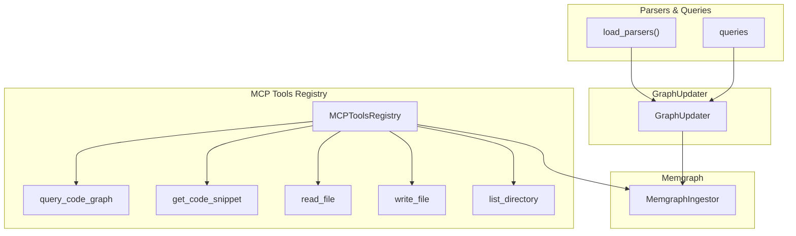

**Diagram sources**
- [conftest.py](file://codebase_rag/tests/conftest.py#L106-L125)
- [tools.py](file://codebase_rag/mcp/tools.py#L40-L458)

**Section sources**
- [conftest.py](file://codebase_rag/tests/conftest.py#L106-L125)
- [tools.py](file://codebase_rag/mcp/tools.py#L40-L458)

## Detailed Component Analysis

### Query Tool Integration
Validates:
- Natural language to Cypher translation and query execution
- Empty result handling and summaries
- Graceful error handling for LLM and database failures
- Unicode and varied input robustness
- Result structure and data type preservation

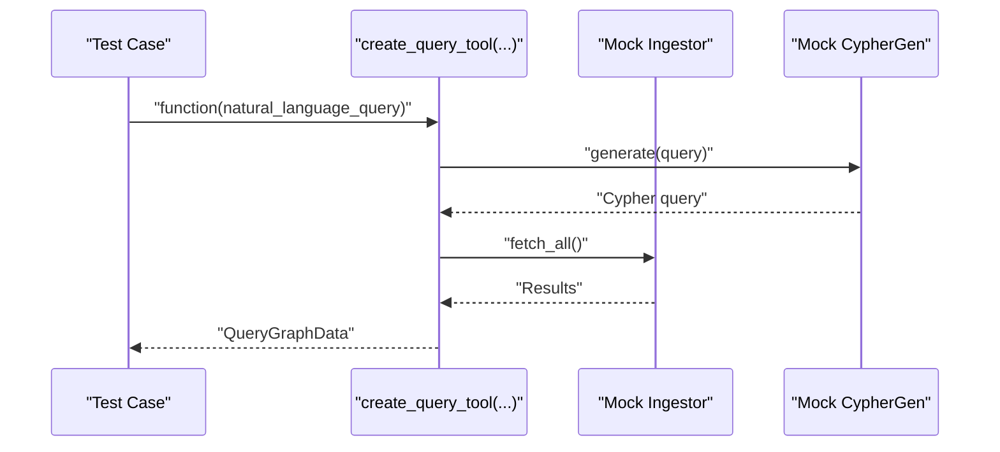

**Diagram sources**
- [test_codebase_query_integration.py](file://codebase_rag/tests/integration/test_codebase_query_integration.py#L54-L123)

**Section sources**
- [test_codebase_query_integration.py](file://codebase_rag/tests/integration/test_codebase_query_integration.py#L53-L208)

### MCP Tools Integration
Validates:
- End-to-end tool execution (query, read_file, get_code_snippet, list_directory)
- Consistent takes_ctx settings across tools
- Behavior correctness without heavy mocking

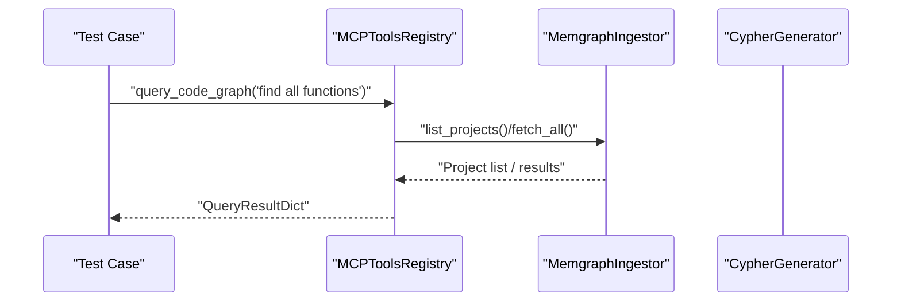

**Diagram sources**
- [test_mcp_tools_integration.py](file://codebase_rag/tests/integration/test_mcp_tools_integration.py#L59-L70)
- [tools.py](file://codebase_rag/mcp/tools.py#L314-L334)

**Section sources**
- [test_mcp_tools_integration.py](file://codebase_rag/tests/integration/test_mcp_tools_integration.py#L56-L137)
- [tools.py](file://codebase_rag/mcp/tools.py#L40-L458)

### Multi-Project Integration
Validates:
- Project listing before and after indexing
- Deletion behavior and isolation
- Clean database operations
- Namespace separation across projects

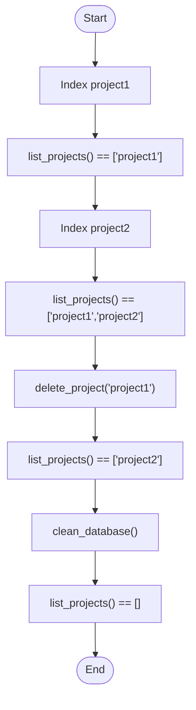

**Diagram sources**
- [test_multi_project_integration.py](file://codebase_rag/tests/integration/test_multi_project_integration.py#L62-L220)

**Section sources**
- [test_multi_project_integration.py](file://codebase_rag/tests/integration/test_multi_project_integration.py#L62-L220)

### Cross-Language Import Relationships
Validates:
- Internal and external import/module creation
- Relationship types and qualified names
- Language-specific patterns (Java packages, Python modules, JS/TS imports, Rust crates/modules, Go packages, C++ includes, Lua requires)

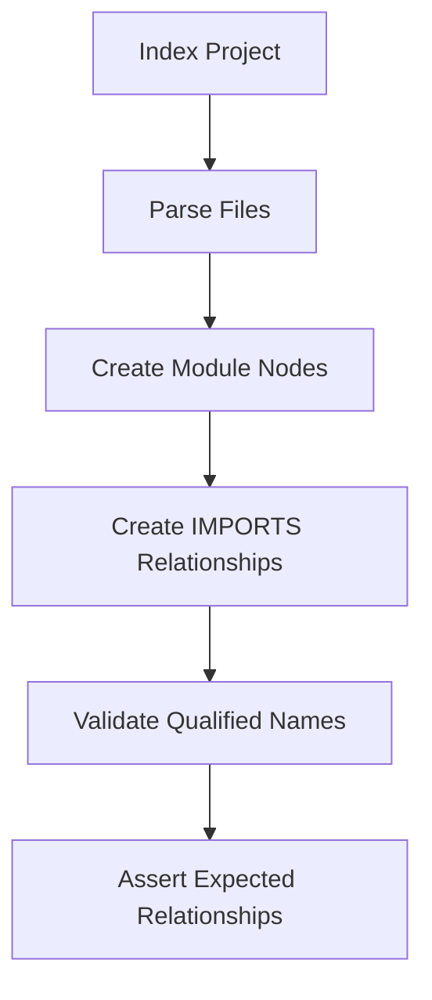

**Diagram sources**
- [test_imports_e2e.py](file://codebase_rag/tests/integration/test_imports_e2e.py#L17-L34)

**Section sources**
- [test_imports_e2e.py](file://codebase_rag/tests/integration/test_imports_e2e.py#L290-L674)

### Document Analyzer Integration
Validates:
- Provider selection and client behavior
- File analysis across text, code, and JSON
- Error handling for missing files and path traversal
- Response handling with candidates and empty content

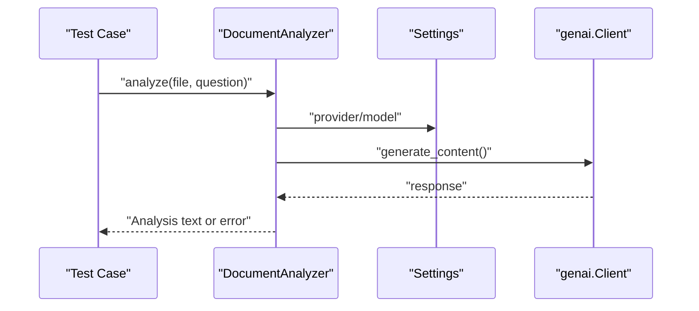

**Diagram sources**
- [test_document_analyzer_integration.py](file://codebase_rag/tests/integration/test_document_analyzer_integration.py#L71-L159)

**Section sources**
- [test_document_analyzer_integration.py](file://codebase_rag/tests/integration/test_document_analyzer_integration.py#L71-L218)

### Node Label and Relationship Validation
Validates:
- Correct node labels per language constructs
- Relationship types (e.g., DEFINES, INHERITS)
- Skipping for unsupported languages in current test runs

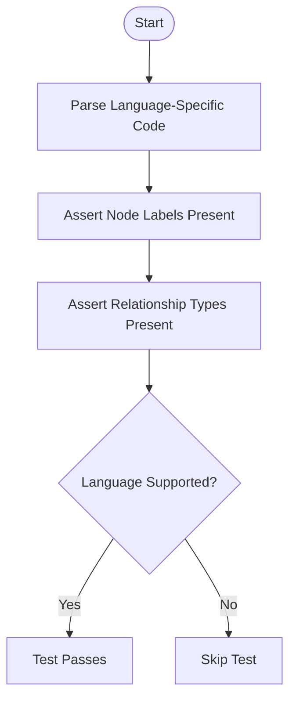

**Diagram sources**
- [test_node_label_e2e.py](file://codebase_rag/tests/integration/test_node_label_e2e.py#L445-L500)

**Section sources**
- [test_node_label_e2e.py](file://codebase_rag/tests/integration/test_node_label_e2e.py#L445-L961)

### Shell Command Integration
Validates:
- Read-only commands without approval
- Approval gating for write commands
- Pipeline safety and operator restrictions
- Git operations in a non-repo context

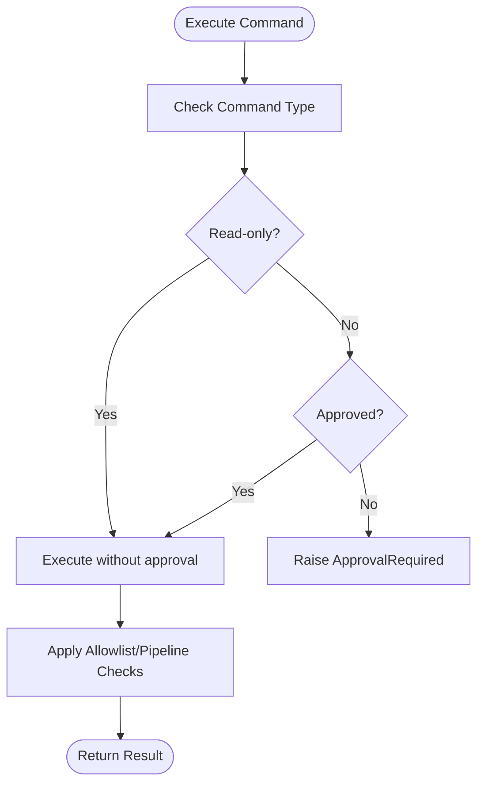

**Diagram sources**
- [test_shell_command_integration.py](file://codebase_rag/tests/integration/test_shell_command_integration.py#L111-L139)

**Section sources**
- [test_shell_command_integration.py](file://codebase_rag/tests/integration/test_shell_command_integration.py#L37-L248)

### Tool Calling Integration
Validates:
- Parallel tool execution and hybrid orchestration
- Tracking of called tools and skipped tools
- Message history inspection and assertions

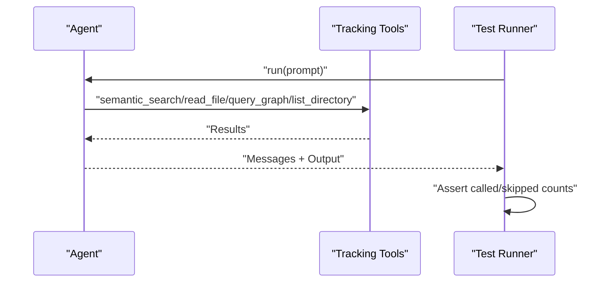

**Diagram sources**
- [test_tool_calling.py](file://codebase_rag/tests/integration/test_tool_calling.py#L76-L97)

**Section sources**
- [test_tool_calling.py](file://codebase_rag/tests/integration/test_tool_calling.py#L131-L155)

## Dependency Analysis
The integration tests depend on:
- Memgraph container lifecycle managed by conftest fixtures
- Parser loading and GraphUpdater for indexing
- MCP tools registry composition and tool execution
- Mocked or real ingestors depending on test scope

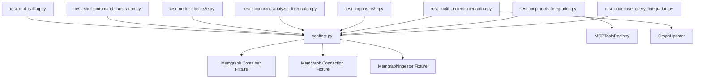

**Diagram sources**
- [conftest.py](file://codebase_rag/tests/conftest.py#L182-L290)
- [test_mcp_tools_integration.py](file://codebase_rag/tests/integration/test_mcp_tools_integration.py#L38-L53)
- [test_multi_project_integration.py](file://codebase_rag/tests/integration/test_multi_project_integration.py#L51-L59)

**Section sources**
- [conftest.py](file://codebase_rag/tests/conftest.py#L182-L290)
- [test_mcp_tools_integration.py](file://codebase_rag/tests/integration/test_mcp_tools_integration.py#L38-L53)
- [test_multi_project_integration.py](file://codebase_rag/tests/integration/test_multi_project_integration.py#L51-L59)

## Performance Considerations
- Use batched operations where applicable (e.g., bulk node/relationship creation in GraphUpdater)
- Prefer lightweight fixtures and avoid repeated container startup/shutdown
- Limit test scope to targeted scenarios to reduce runtime
- Leverage async fixtures and tool execution to minimize overhead

## Troubleshooting Guide
Common issues and resolutions:
- Memgraph container not ready
  - Ensure the container starts and exposes port 7687
  - Confirm connectivity and initial “running” logs
- Connection failures during tests
  - Retry connection establishment and clear database state between runs
- MCP tool errors
  - Verify ingestor and Cypher generator mocks are properly configured
  - Check tool schema consistency and handler signatures
- Cross-language import mismatches
  - Validate qualified names and relationship types
  - Confirm parser availability for specific languages
- Shell command rejections
  - Ensure commands are on allowlist and pipelines are permitted
  - Verify approval gating for write operations
- Tool calling skips
  - Inspect agent message history for skipped tool indicators
  - Adjust prompt phrasing to encourage parallel execution

**Section sources**
- [conftest.py](file://codebase_rag/tests/conftest.py#L182-L290)
- [test_mcp_tools_integration.py](file://codebase_rag/tests/integration/test_mcp_tools_integration.py#L56-L137)
- [test_imports_e2e.py](file://codebase_rag/tests/integration/test_imports_e2e.py#L290-L674)
- [test_shell_command_integration.py](file://codebase_rag/tests/integration/test_shell_command_integration.py#L164-L248)
- [test_tool_calling.py](file://codebase_rag/tests/integration/test_tool_calling.py#L59-L97)

## Conclusion
The integration test suite comprehensively validates end-to-end workflows, multi-component interactions, and cross-language scenarios. It ensures robustness across ingestion, querying, tool execution, and environment setup. By following the guidance here, teams can confidently extend and maintain the integration suite for evolving codebases and environments.

## Appendices

### Test Environment Setup
- Memgraph container lifecycle and connection fixtures are provided in the test harness
- Database initialization and cleanup are handled per-test to ensure isolation
- Use the provided fixtures to spin up containers, connect clients, and reset state

**Section sources**
- [conftest.py](file://codebase_rag/tests/conftest.py#L182-L290)

### Running Integration Tests
- Execute tests with pytest markers aligned with integration scopes
- For MCP and async tests, configure the anyio backend as needed
- Use temporary repositories and isolated Memgraph instances per test

**Section sources**
- [test_codebase_query_integration.py](file://codebase_rag/tests/integration/test_codebase_query_integration.py#L12-L17)
- [test_mcp_tools_integration.py](file://codebase_rag/tests/integration/test_mcp_tools_integration.py#L8-L14)
- [test_tool_calling.py](file://codebase_rag/tests/integration/test_tool_calling.py#L12-L12)

### MCP Tools and Claude Code Compatibility
- The MCP tools registry exposes standardized tool schemas and handlers
- Verify tool schemas and handler signatures align with Claude Code’s expectations
- Validate behavior for read-only vs write operations and approval gating

**Section sources**
- [tools.py](file://codebase_rag/mcp/tools.py#L433-L446)
- [test_mcp_tools_integration.py](file://codebase_rag/tests/integration/test_mcp_tools_integration.py#L109-L137)

### Semantic Search and Knowledge Graph Operations
- Query tool integration demonstrates natural language to Cypher translation and result validation
- Multi-project operations illustrate graph isolation and clean-up
- Cross-language import tests validate knowledge graph structure across diverse ecosystems

**Section sources**
- [test_codebase_query_integration.py](file://codebase_rag/tests/integration/test_codebase_query_integration.py#L53-L123)
- [test_multi_project_integration.py](file://codebase_rag/tests/integration/test_multi_project_integration.py#L62-L220)
- [test_imports_e2e.py](file://codebase_rag/tests/integration/test_imports_e2e.py#L290-L674)

### Real-World Scenarios and Edge Cases
- Unicode queries and mixed character sets
- LLM and database failure paths
- Path traversal and security checks
- Pipeline operators and subshell restrictions
- Parallel and hybrid tool orchestration

**Section sources**
- [test_codebase_query_integration.py](file://codebase_rag/tests/integration/test_codebase_query_integration.py#L156-L170)
- [test_document_analyzer_integration.py](file://codebase_rag/tests/integration/test_document_analyzer_integration.py#L113-L118)
- [test_shell_command_integration.py](file://codebase_rag/tests/integration/test_shell_command_integration.py#L223-L247)
- [test_tool_calling.py](file://codebase_rag/tests/integration/test_tool_calling.py#L131-L155)

### Integration Documentation References
- Unified adapter, bridge linker, and query engine are documented in integration summaries and completion guides

**Section sources**
- [INTEGRATION_SUMMARY.md](file://INTEGRATION_SUMMARY.md#L1-L562)
- [INTEGRATION_COMPLETE.md](file://INTEGRATION_COMPLETE.md#L1-L576)