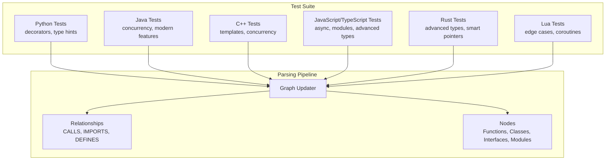
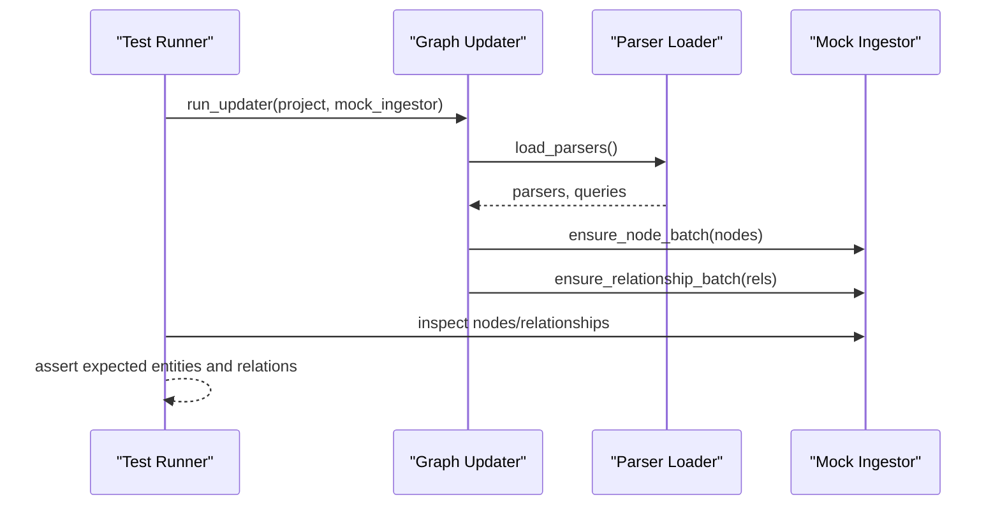
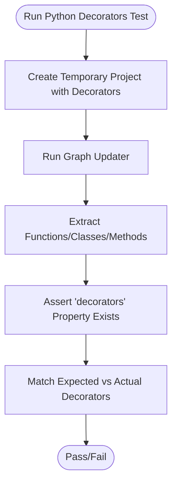
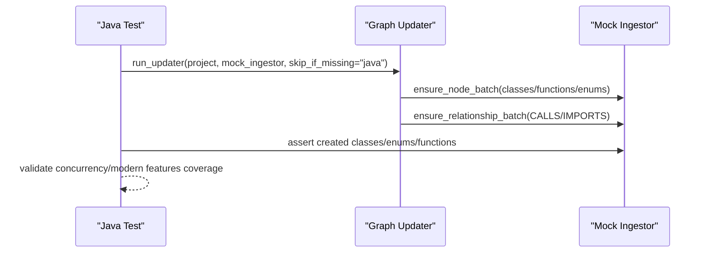
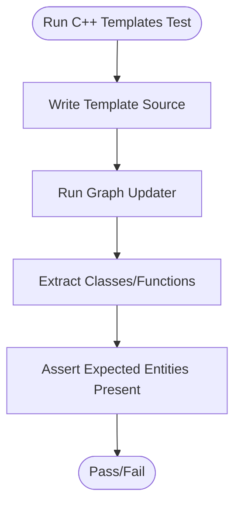
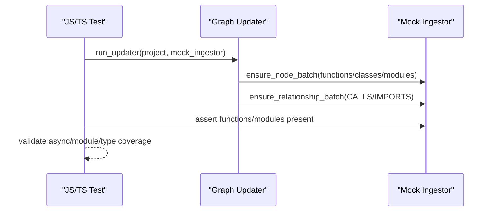
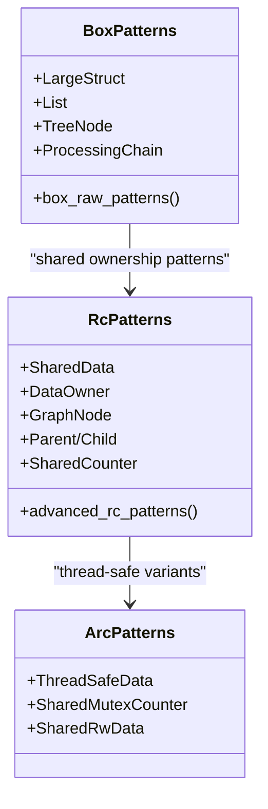
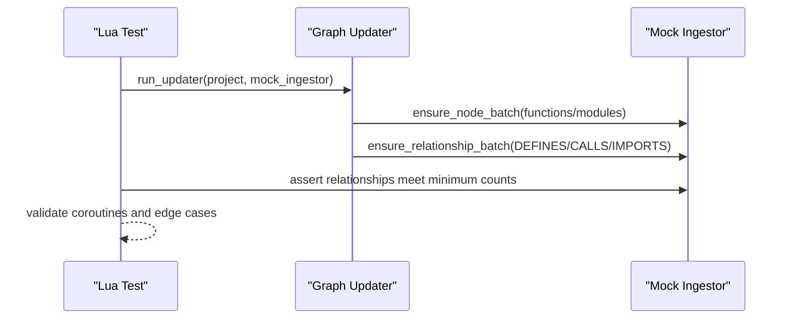
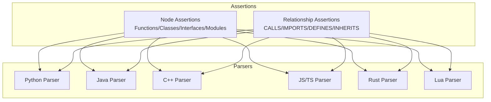

# Language-Specific Testing

<cite>
**Referenced Files in This Document**
- [test_python_decorators.py](file://codebase_rag/tests/test_python_decorators.py)
- [test_java_concurrency.py](file://codebase_rag/tests/test_java_concurrency.py)
- [test_java_modern_features.py](file://codebase_rag/tests/test_java_modern_features.py)
- [test_cpp_templates.py](file://codebase_rag/tests/test_cpp_templates.py)
- [test_cpp_concurrency.py](file://codebase_rag/tests/test_cpp_concurrency.py)
- [test_javascript_async_patterns.py](file://codebase_rag/tests/test_javascript_async_patterns.py)
- [test_js_ts_module_system.py](file://codebase_rag/tests/test_js_ts_module_system.py)
- [test_typescript_advanced_types.py](file://codebase_rag/tests/test_typescript_advanced_types.py)
- [test_rust_advanced_types.py](file://codebase_rag/tests/test_rust_advanced_types.py)
- [test_rust_smart_pointers.py](file://codebase_rag/tests/test_rust_smart_pointers.py)
- [test_lua_54_edge_cases.py](file://codebase_rag/tests/test_lua_54_edge_cases.py)
- [test_lua_coroutines.py](file://codebase_rag/tests/test_lua_coroutines.py)
</cite>

## Table of Contents
1. [Introduction](#introduction)
2. [Project Structure](#project-structure)
3. [Core Components](#core-components)
4. [Architecture Overview](#architecture-overview)
5. [Detailed Component Analysis](#detailed-component-analysis)
6. [Dependency Analysis](#dependency-analysis)
7. [Performance Considerations](#performance-considerations)
8. [Troubleshooting Guide](#troubleshooting-guide)
9. [Conclusion](#conclusion)
10. [Appendices](#appendices)

## Introduction
This document presents comprehensive language-specific testing strategies for Python, Java, C++, JavaScript/TypeScript, Rust, and Lua. It synthesizes the repository’s extensive test suite to explain how each language’s advanced features are validated, including decorators and type hints in Python, generics and annotations in Java, templates and concurrency in C++, async patterns and modules in JavaScript/TypeScript, advanced type systems and memory management in Rust, and closures, coroutines, and metatables in Lua. It also provides guidance for extending coverage to new languages and maintaining robust cross-language test coverage.

## Project Structure
The testing infrastructure organizes language-specific tests under a dedicated test suite. Each language’s tests are grouped by feature domain (e.g., decorators, concurrency, templates) and leverage a shared updater pipeline to parse source files and emit nodes and relationships for ingestion. Tests validate both AST extraction and semantic relationships (e.g., CALLS, IMPORTS, DEFINES).

**Section sources**
- [test_python_decorators.py](file://codebase_rag/tests/test_python_decorators.py#L1-L458)
- [test_java_concurrency.py](file://codebase_rag/tests/test_java_concurrency.py#L1-L800)
- [test_java_modern_features.py](file://codebase_rag/tests/test_java_modern_features.py#L1-L840)
- [test_cpp_templates.py](file://codebase_rag/tests/test_cpp_templates.py#L1-L800)
- [test_cpp_concurrency.py](file://codebase_rag/tests/test_cpp_concurrency.py#L1-L800)
- [test_javascript_async_patterns.py](file://codebase_rag/tests/test_javascript_async_patterns.py#L1-L800)
- [test_js_ts_module_system.py](file://codebase_rag/tests/test_js_ts_module_system.py#L1-L725)
- [test_typescript_advanced_types.py](file://codebase_rag/tests/test_typescript_advanced_types.py#L1-L800)
- [test_rust_advanced_types.py](file://codebase_rag/tests/test_rust_advanced_types.py#L1-L674)
- [test_rust_smart_pointers.py](file://codebase_rag/tests/test_rust_smart_pointers.py#L1-L800)
- [test_lua_54_edge_cases.py](file://codebase_rag/tests/test_lua_54_edge_cases.py#L1-L710)
- [test_lua_coroutines.py](file://codebase_rag/tests/test_lua_coroutines.py#L1-L572)

## Core Components
- Python: Validates decorators (function/class/method/property), nested decorators, and complex argument forms. Tests assert presence of a decorators property on parsed nodes and verify qualified names.
- Java: Covers concurrency (synchronized methods/blocks, volatile fields, concurrent collections, ExecutorService), modern features (records, sealed classes/interfaces, switch expressions, text blocks, var keyword, instanceof patterns).
- C++: Validates templates (function/class templates, specializations, constraints, variadic templates), concurrency (threads, mutexes, atomics), and modern features (concepts, ranges, coroutines).
- JavaScript/TypeScript: Tests async patterns (Promises, async/await), modules (CommonJS and ES modules), advanced types (generics, mapped types, utility types), and TypeScript decorators.
- Rust: Exercises advanced type systems (phantom types, higher-ranked trait bounds, associated types, const generics), smart pointers (Box, Rc, Arc), and concurrency primitives.
- Lua: Covers Lua 5.4+ features (goto/labels, UTF-8 library, bitwise operators) and coroutine-based patterns (schedulers, async patterns, generators, state machines).

**Section sources**
- [test_python_decorators.py](file://codebase_rag/tests/test_python_decorators.py#L160-L458)
- [test_java_concurrency.py](file://codebase_rag/tests/test_java_concurrency.py#L24-L800)
- [test_java_modern_features.py](file://codebase_rag/tests/test_java_modern_features.py#L25-L840)
- [test_cpp_templates.py](file://codebase_rag/tests/test_cpp_templates.py#L21-L800)
- [test_cpp_concurrency.py](file://codebase_rag/tests/test_cpp_concurrency.py#L22-L800)
- [test_javascript_async_patterns.py](file://codebase_rag/tests/test_javascript_async_patterns.py#L29-L800)
- [test_js_ts_module_system.py](file://codebase_rag/tests/test_js_ts_module_system.py#L1-L725)
- [test_typescript_advanced_types.py](file://codebase_rag/tests/test_typescript_advanced_types.py#L42-L800)
- [test_rust_advanced_types.py](file://codebase_rag/tests/test_rust_advanced_types.py#L27-L674)
- [test_rust_smart_pointers.py](file://codebase_rag/tests/test_rust_smart_pointers.py#L27-L800)
- [test_lua_54_edge_cases.py](file://codebase_rag/tests/test_lua_54_edge_cases.py#L8-L710)
- [test_lua_coroutines.py](file://codebase_rag/tests/test_lua_coroutines.py#L7-L572)

## Architecture Overview
The testing architecture parses language sources and emits nodes and relationships. Tests assert that expected entities (functions, classes, modules, etc.) are present and that relationships (calls, imports, definitions) are correctly established.

**Diagram sources**
- [test_python_decorators.py](file://codebase_rag/tests/test_python_decorators.py#L160-L172)
- [test_java_concurrency.py](file://codebase_rag/tests/test_java_concurrency.py#L145-L157)
- [test_js_ts_module_system.py](file://codebase_rag/tests/test_js_ts_module_system.py#L35-L35)

## Detailed Component Analysis

### Python Testing Strategy
- Focus areas: decorators (function/class/method/property), nested functions, complex decorator arguments, and empty-decorator detection.
- Validation: Assert presence of a decorators property on nodes and match expected decorator lists against qualified names.
- Edge cases: Multiple decorators, parameterized decorators, nested function decorators, and complex argument forms.

**Diagram sources**
- [test_python_decorators.py](file://codebase_rag/tests/test_python_decorators.py#L160-L208)

**Section sources**
- [test_python_decorators.py](file://codebase_rag/tests/test_python_decorators.py#L160-L458)

### Java Testing Strategy
- Concurrency: synchronized methods/blocks, volatile fields, concurrent collections, ExecutorService patterns, CompletableFuture patterns.
- Modern features: records, sealed classes/interfaces, switch expressions, text blocks, var keyword, instanceof patterns.

**Diagram sources**
- [test_java_concurrency.py](file://codebase_rag/tests/test_java_concurrency.py#L145-L157)
- [test_java_modern_features.py](file://codebase_rag/tests/test_java_modern_features.py#L115-L132)

**Section sources**
- [test_java_concurrency.py](file://codebase_rag/tests/test_java_concurrency.py#L24-L800)
- [test_java_modern_features.py](file://codebase_rag/tests/test_java_modern_features.py#L25-L840)

### C++ Testing Strategy
- Templates: function/class templates, specializations, constraints, variadic templates, template metaprogramming, SFINAE.
- Concurrency: threads, mutexes, atomics, memory ordering, lock-free patterns.
- Modern features: concepts, ranges, coroutines.

**Diagram sources**
- [test_cpp_templates.py](file://codebase_rag/tests/test_cpp_templates.py#L21-L260)
- [test_cpp_concurrency.py](file://codebase_rag/tests/test_cpp_concurrency.py#L22-L267)

**Section sources**
- [test_cpp_templates.py](file://codebase_rag/tests/test_cpp_templates.py#L21-L800)
- [test_cpp_concurrency.py](file://codebase_rag/tests/test_cpp_concurrency.py#L22-L800)

### JavaScript/TypeScript Testing Strategy
- Async patterns: Promises (all/settled/race), async/await, generators, robust API calls.
- Modules: CommonJS destructured requires, ES module exports, mixed module systems, deep nested paths.
- Advanced types: Generics, mapped types, utility types, TypeScript decorators.

**Diagram sources**
- [test_javascript_async_patterns.py](file://codebase_rag/tests/test_javascript_async_patterns.py#L264-L298)
- [test_js_ts_module_system.py](file://codebase_rag/tests/test_js_ts_module_system.py#L35-L35)
- [test_typescript_advanced_types.py](file://codebase_rag/tests/test_typescript_advanced_types.py#L396-L450)

**Section sources**
- [test_javascript_async_patterns.py](file://codebase_rag/tests/test_javascript_async_patterns.py#L29-L800)
- [test_js_ts_module_system.py](file://codebase_rag/tests/test_js_ts_module_system.py#L1-L725)
- [test_typescript_advanced_types.py](file://codebase_rag/tests/test_typescript_advanced_types.py#L42-L800)

### Rust Testing Strategy
- Advanced types: phantom types, higher-ranked trait bounds, associated types, const generics.
- Smart pointers: Box, Rc (including Weak), Arc (thread-safe), trait objects, canvas patterns.
- Concurrency: atomic operations, memory ordering, lock-free designs.

**Diagram sources**
- [test_rust_smart_pointers.py](file://codebase_rag/tests/test_rust_smart_pointers.py#L27-L297)
- [test_rust_smart_pointers.py](file://codebase_rag/tests/test_rust_smart_pointers.py#L300-L693)
- [test_rust_smart_pointers.py](file://codebase_rag/tests/test_rust_smart_pointers.py#L696-L800)

**Section sources**
- [test_rust_advanced_types.py](file://codebase_rag/tests/test_rust_advanced_types.py#L27-L674)
- [test_rust_smart_pointers.py](file://codebase_rag/tests/test_rust_smart_pointers.py#L27-L800)

### Lua Testing Strategy
- Lua 5.4+ edge cases: goto/labels, UTF-8 library, bitwise operators.
- Coroutine patterns: basic coroutines, cooperative scheduler, async patterns, generator pipelines, state machines.

**Diagram sources**
- [test_lua_coroutines.py](file://codebase_rag/tests/test_lua_coroutines.py#L63-L75)
- [test_lua_54_edge_cases.py](file://codebase_rag/tests/test_lua_54_edge_cases.py#L216-L241)

**Section sources**
- [test_lua_54_edge_cases.py](file://codebase_rag/tests/test_lua_54_edge_cases.py#L8-L710)
- [test_lua_coroutines.py](file://codebase_rag/tests/test_lua_coroutines.py#L7-L572)

## Dependency Analysis
Tests depend on a shared updater pipeline and rely on language-specific parsers. The tests assert:
- Node presence: Functions, classes, interfaces, modules, enums, and records.
- Relationship presence: CALLS, IMPORTS, DEFINES, and INHERITS.

**Diagram sources**
- [test_python_decorators.py](file://codebase_rag/tests/test_python_decorators.py#L190-L208)
- [test_java_concurrency.py](file://codebase_rag/tests/test_java_concurrency.py#L145-L157)
- [test_js_ts_module_system.py](file://codebase_rag/tests/test_js_ts_module_system.py#L37-L40)

**Section sources**
- [test_python_decorators.py](file://codebase_rag/tests/test_python_decorators.py#L190-L208)
- [test_java_concurrency.py](file://codebase_rag/tests/test_java_concurrency.py#L145-L157)
- [test_js_ts_module_system.py](file://codebase_rag/tests/test_js_ts_module_system.py#L37-L40)

## Performance Considerations
- Test isolation: Each test creates minimal temporary projects to reduce overhead.
- Selective parsing: Skip-if-missing guards prevent unnecessary parser loads for unavailable languages.
- Relationship thresholds: Many tests assert minimum counts of relationships to avoid brittle assertions while ensuring coverage.

[No sources needed since this section provides general guidance]

## Troubleshooting Guide
- Missing expected nodes or relationships: Verify the project structure and file names align with expectations and that the updater runs successfully.
- Parser availability: Some tests are conditionally skipped when language parsers are not installed (e.g., tree-sitter JavaScript/TypeScript).
- Relationship counts: Use relationship filters to confirm minimum counts rather than exact counts to accommodate minor variations.

**Section sources**
- [test_js_ts_module_system.py](file://codebase_rag/tests/test_js_ts_module_system.py#L20-L10)
- [test_lua_54_edge_cases.py](file://codebase_rag/tests/test_lua_54_edge_cases.py#L216-L241)

## Conclusion
The repository’s language-specific tests comprehensively validate advanced language features across Python, Java, C++, JavaScript/TypeScript, Rust, and Lua. By leveraging a shared updater pipeline and targeted assertions on nodes and relationships, the suite ensures robust coverage of decorators, generics, templates, async patterns, smart pointers, and Lua-specific features. The patterns demonstrated here provide a blueprint for extending coverage to new languages and maintaining high-quality cross-language test suites.

[No sources needed since this section summarizes without analyzing specific files]

## Appendices

### Guidance for Adding New Language Test Coverage
- Create a dedicated test file under the tests directory following the established naming convention.
- Use a temporary project fixture to generate representative source files for the language’s advanced features.
- Leverage the shared updater pipeline and assert node and relationship presence using the established patterns.
- Add skip-if-missing guards for parsers not available in CI environments.
- Include edge cases and real-world patterns to improve robustness.

[No sources needed since this section provides general guidance]