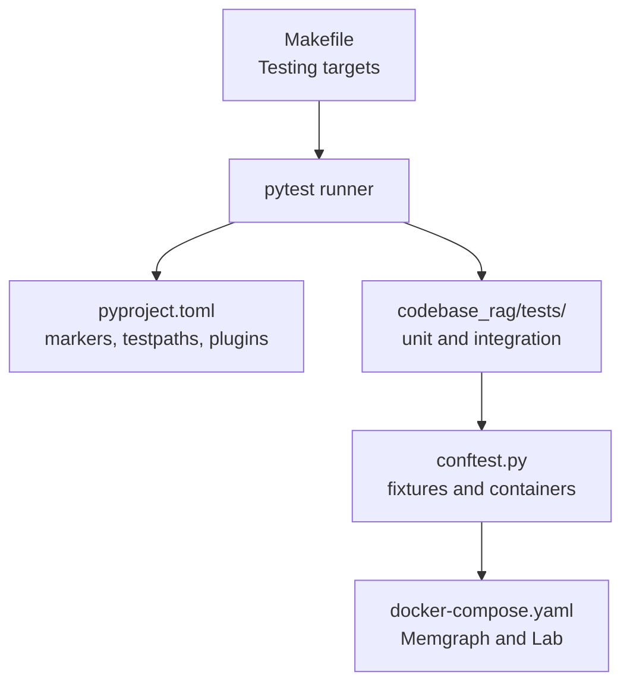
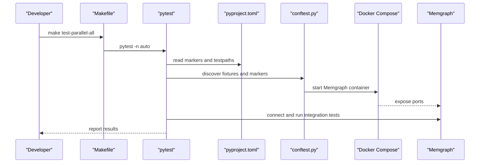
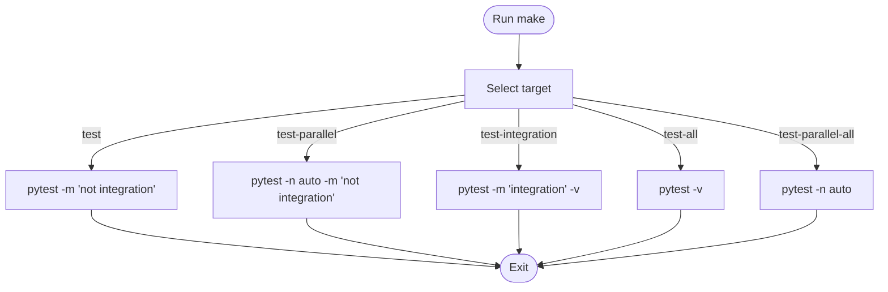
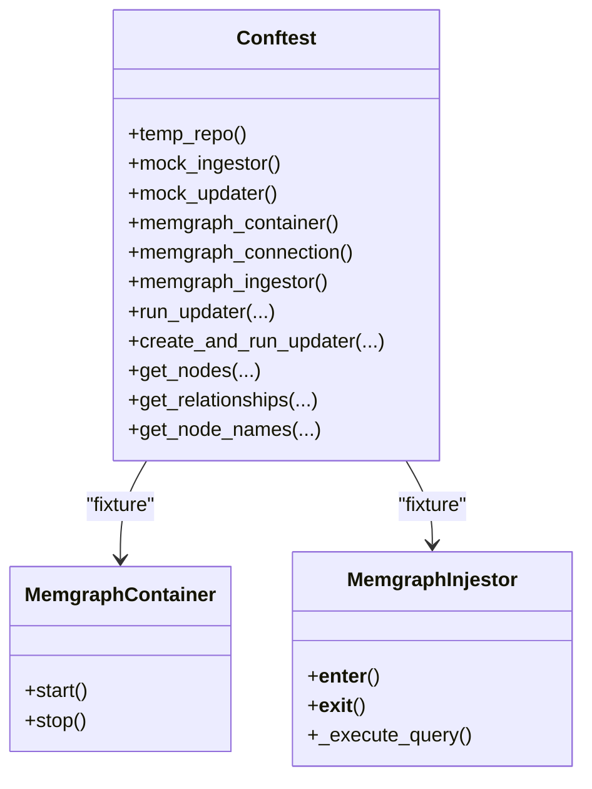
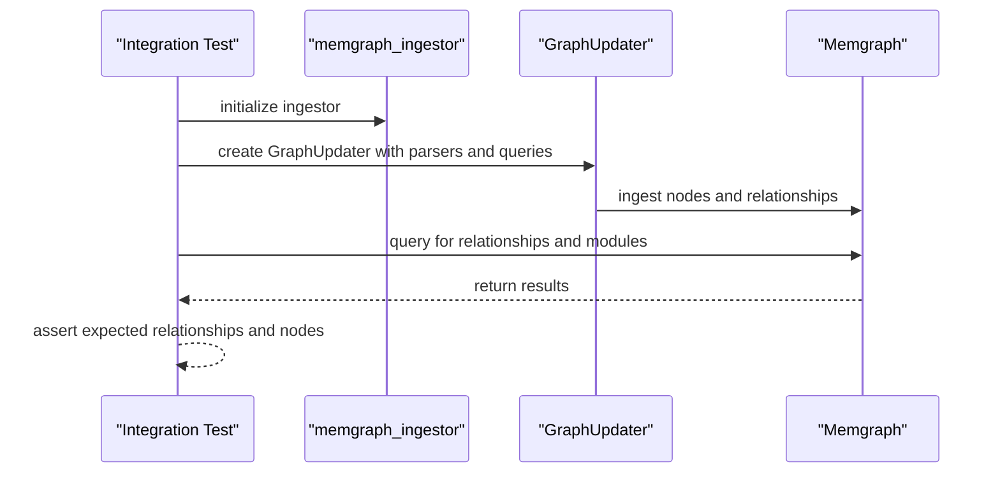
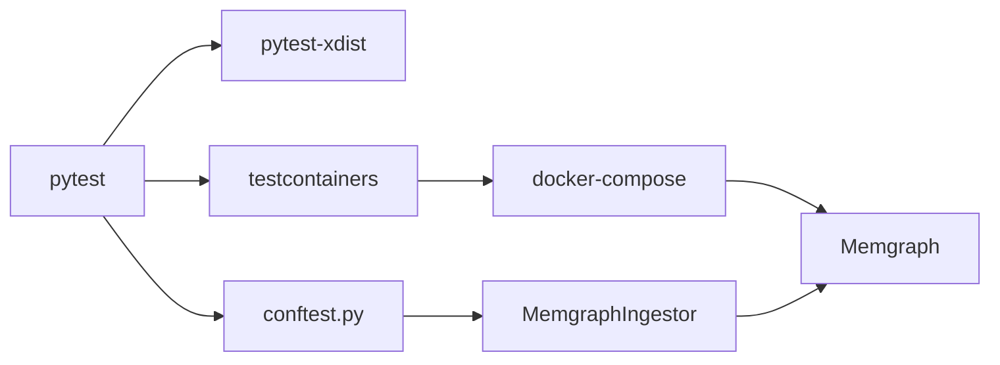

# Test Automation and CI

<cite>
**Referenced Files in This Document**
- [Makefile](file://Makefile)
- [pyproject.toml](file://pyproject.toml)
- [conftest.py](file://codebase_rag/tests/conftest.py)
- [docker-compose.yaml](file://docker-compose.yaml)
- [test_cli_smoke.py](file://codebase_rag/tests/test_cli_smoke.py)
- [test_build_binary.py](file://codebase_rag/tests/test_build_binary.py)
- [test_codebase_query_integration.py](file://codebase_rag/tests/integration/test_codebase_query_integration.py)
- [test_mcp_tools_integration.py](file://codebase_rag/tests/integration/test_mcp_tools_integration.py)
- [test_imports_e2e.py](file://codebase_rag/tests/integration/test_imports_e2e.py)
- [build_binary.py](file://build_binary.py)
</cite>

## Table of Contents
1. [Introduction](#introduction)
2. [Project Structure](#project-structure)
3. [Core Components](#core-components)
4. [Architecture Overview](#architecture-overview)
5. [Detailed Component Analysis](#detailed-component-analysis)
6. [Dependency Analysis](#dependency-analysis)
7. [Performance Considerations](#performance-considerations)
8. [Troubleshooting Guide](#troubleshooting-guide)
9. [Conclusion](#conclusion)
10. [Appendices](#appendices)

## Introduction
This document describes the test automation infrastructure and continuous integration setup for the project. It explains the Makefile testing commands, pytest configuration and fixtures, GitHub Actions workflows, Docker-based integration testing, and best practices for reliable and efficient test execution. It also covers local development workflows, CI troubleshooting, and strategies to reduce flakiness.

## Project Structure
The repository organizes tests under a dedicated tests directory with unit and integration suites, pytest configuration in pyproject.toml, Makefile targets for running tests, and Docker Compose for service dependencies.

**Diagram sources**
- [Makefile](file://Makefile#L1-L80)
- [pyproject.toml](file://pyproject.toml#L94-L105)
- [conftest.py](file://codebase_rag/tests/conftest.py#L182-L290)
- [docker-compose.yaml](file://docker-compose.yaml#L1-L13)

**Section sources**
- [Makefile](file://Makefile#L1-L80)
- [pyproject.toml](file://pyproject.toml#L94-L105)

## Core Components
- Makefile testing commands:
  - make test: runs unit tests excluding integration.
  - make test-parallel: runs unit tests in parallel.
  - make test-integration: runs integration tests requiring Docker.
  - make test-all: runs all tests including integration and e2e.
  - make test-parallel-all: runs all tests in parallel.
- pytest configuration:
  - test discovery paths and markers for slow, integration, and e2e tests.
  - asyncio mode enabled for async tests.
- Fixtures and containers:
  - Session-scoped Memgraph container fixture.
  - Function-scoped connections and ingestors for deterministic cleanup.
  - Utilities to create mock nodes and extract graph artifacts for assertions.
- Docker environment:
  - docker-compose defines Memgraph and optional Lab service for interactive inspection.

**Section sources**
- [Makefile](file://Makefile#L33-L46)
- [pyproject.toml](file://pyproject.toml#L94-L105)
- [conftest.py](file://codebase_rag/tests/conftest.py#L182-L290)
- [docker-compose.yaml](file://docker-compose.yaml#L1-L13)

## Architecture Overview
The testing architecture separates unit tests from integration/e2e tests. Unit tests run locally without external dependencies. Integration tests spin up a Memgraph container via testcontainers and exercise end-to-end flows against a real graph database.

**Diagram sources**
- [Makefile](file://Makefile#L33-L46)
- [pyproject.toml](file://pyproject.toml#L94-L105)
- [conftest.py](file://codebase_rag/tests/conftest.py#L182-L290)
- [docker-compose.yaml](file://docker-compose.yaml#L1-L13)

## Detailed Component Analysis

### Makefile Testing Commands
- Purpose and usage:
  - make test: Fast unit-only runs using pytest without Docker.
  - make test-parallel: Parallelized unit runs for speed.
  - make test-integration: Runs integration tests that require Docker and Memgraph.
  - make test-all: Full suite including integration and e2e tests.
  - make test-parallel-all: Full suite in parallel for maximum throughput.
- Behavior:
  - Uses uv run to execute pytest with appropriate markers and xdist for parallelization.
  - Cleans caches and bytecode artifacts via clean target.

**Diagram sources**
- [Makefile](file://Makefile#L33-L46)

**Section sources**
- [Makefile](file://Makefile#L33-L46)

### pytest Configuration and Markers
- Test discovery:
  - testpaths configured to codebase_rag/tests.
  - Python naming conventions for files, classes, and functions.
- Markers:
  - slow: marks tests that may download models or require external services.
  - integration: marks tests requiring Docker/Memgraph.
  - e2e: marks end-to-end tests.
- Async mode:
  - asyncio_mode set to auto for async test support.

**Section sources**
- [pyproject.toml](file://pyproject.toml#L94-L105)

### conftest.py Fixtures and Containers
- Temporary repositories and mocks:
  - temp_repo fixture creates and tears down per-test directories.
  - mock_ingestor and mock_updater provide controlled mocks for graph ingestion and updates.
- Memgraph lifecycle:
  - memgraph_container starts a Memgraph instance and waits for readiness.
  - memgraph_connection establishes a connection and clears state before/after tests.
  - memgraph_ingestor initializes and tears down a MemgraphIngestor instance per test.
- Helpers:
  - Functions to extract nodes and relationships from mock calls for assertions.

**Diagram sources**
- [conftest.py](file://codebase_rag/tests/conftest.py#L92-L290)

**Section sources**
- [conftest.py](file://codebase_rag/tests/conftest.py#L92-L290)

### Docker Environment for Integration Tests
- Services:
  - memgraph: exposes Bolt port and optional HTTP port.
  - lab: optional web UI connected to memgraph.
- Usage:
  - Integration tests rely on the memgraph_container fixture to start and manage the container lifecycle.

**Section sources**
- [docker-compose.yaml](file://docker-compose.yaml#L1-L13)

### Example Integration Tests
- End-to-end query tool:
  - Validates query tool behavior with mocked ingestor and Cypher generator.
  - Exercises error handling for LLM and database failures.
- MCP tools integration:
  - Tests real tool instances against a temporary repository with sample code.
  - Verifies file operations and code snippet retrieval.
- Imports e2e across languages:
  - Generates synthetic projects for Java, Python, JavaScript, TypeScript, Rust, Go, C++, and Lua.
  - Asserts IMPORTS relationships and module nodes in the graph.

**Diagram sources**
- [test_imports_e2e.py](file://codebase_rag/tests/integration/test_imports_e2e.py#L17-L40)
- [conftest.py](file://codebase_rag/tests/conftest.py#L112-L125)

**Section sources**
- [test_codebase_query_integration.py](file://codebase_rag/tests/integration/test_codebase_query_integration.py#L53-L123)
- [test_mcp_tools_integration.py](file://codebase_rag/tests/integration/test_mcp_tools_integration.py#L56-L107)
- [test_imports_e2e.py](file://codebase_rag/tests/integration/test_imports_e2e.py#L17-L40)

### CLI Smoke Tests
- Verifies CLI help output and module import stability.
- Ensures basic smoke checks pass before deeper test runs.

**Section sources**
- [test_cli_smoke.py](file://codebase_rag/tests/test_cli_smoke.py#L8-L35)

### Binary Build Tests
- Validates extraction and packaging logic for tree-sitter language support.
- Ensures PyInstaller arguments are constructed correctly for collected packages.

**Section sources**
- [test_build_binary.py](file://codebase_rag/tests/test_build_binary.py#L9-L126)
- [build_binary.py](file://build_binary.py#L17-L72)

## Dependency Analysis
- Internal dependencies:
  - conftest.py depends on testcontainers for container orchestration and mgclient for database connectivity.
  - Integration tests depend on GraphUpdater and MemgraphIngestor to populate the graph.
- External dependencies:
  - pytest-xdist enables parallel execution.
  - testcontainers launches Memgraph container for integration tests.
- Optional dependencies:
  - treesitter-full provides language-specific parsers used during indexing.

**Diagram sources**
- [pyproject.toml](file://pyproject.toml#L37-L43)
- [conftest.py](file://codebase_rag/tests/conftest.py#L182-L290)
- [docker-compose.yaml](file://docker-compose.yaml#L1-L13)

**Section sources**
- [pyproject.toml](file://pyproject.toml#L37-L43)
- [conftest.py](file://codebase_rag/tests/conftest.py#L182-L290)

## Performance Considerations
- Parallel execution:
  - Use -n auto to leverage CPU cores for unit tests.
  - Combine with markers to exclude heavy integration tests from parallel runs.
- Fixture isolation:
  - Scope fixtures appropriately (session vs function) to minimize startup overhead while ensuring isolation.
- Container reuse:
  - Keep Memgraph container alive for repeated integration runs; ensure proper teardown on failure.
- Test categorization:
  - Mark slow tests to avoid parallelizing them and to allow manual runs when needed.

[No sources needed since this section provides general guidance]

## Troubleshooting Guide
- Docker and container readiness:
  - If Memgraph fails to start or is unreachable, inspect container logs and port exposure.
  - Verify that the memgraph_container fixture completes readiness checks before tests run.
- Connection errors:
  - Ensure memgraph_connection clears the database state and retries on transient failures.
- Port conflicts:
  - Adjust exposed ports in docker-compose if conflicts occur on the host.
- Slow or flaky tests:
  - Use pytest markers to isolate and rerun specific categories.
  - Reduce concurrency for tests that share global resources.
- Local vs CI differences:
  - Prefer make test-parallel-all for CI to maximize throughput while keeping local runs stable.

**Section sources**
- [conftest.py](file://codebase_rag/tests/conftest.py#L182-L290)
- [docker-compose.yaml](file://docker-compose.yaml#L1-L13)

## Conclusion
The project’s test automation combines Makefile-driven targets, pytest configuration with markers, robust fixtures for containerized environments, and Docker-based integration testing. By leveraging parallel execution for unit tests and carefully managing integration fixtures, teams can achieve fast and reliable feedback loops for both local development and CI.

[No sources needed since this section summarizes without analyzing specific files]

## Appendices

### Local Development Workflow
- Install dependencies with full language support and test extras.
- Run unit tests with parallelization for quick feedback.
- Run integration tests with Docker to validate end-to-end flows.
- Use clean to remove caches and bytecode artifacts.

**Section sources**
- [Makefile](file://Makefile#L21-L31)
- [Makefile](file://Makefile#L33-L46)

### CI Pipeline Guidance
- Pull request validation:
  - Run make test-parallel-all to validate all tests in parallel.
  - Gate merges on passing tests and container readiness.
- Release testing:
  - Run make test-integration and make test-all to ensure integration and e2e correctness before tagging releases.

**Section sources**
- [Makefile](file://Makefile#L39-L46)

### Best Practices for Reliable Tests
- Avoid global mutable state; prefer scoped fixtures.
- Use markers to separate slow and heavy tests from fast unit tests.
- Keep integration tests deterministic by seeding or clearing the graph state.
- Add timeouts for external calls and container readiness checks.
- Prefer small, focused tests with clear assertions.

[No sources needed since this section provides general guidance]