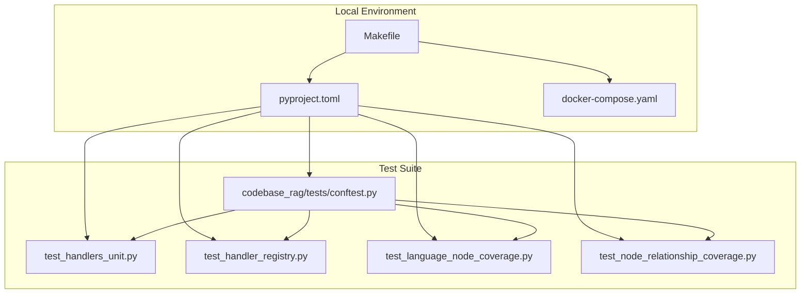
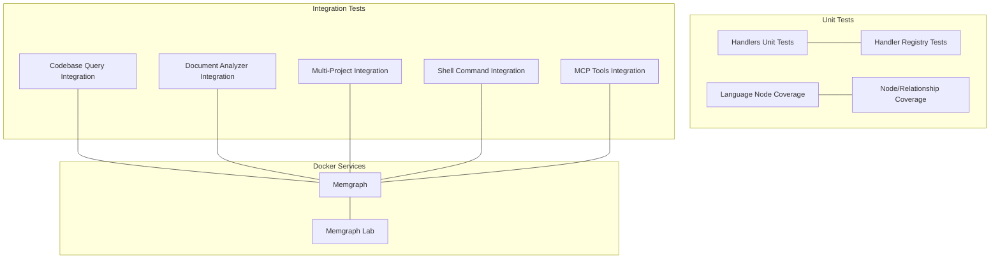
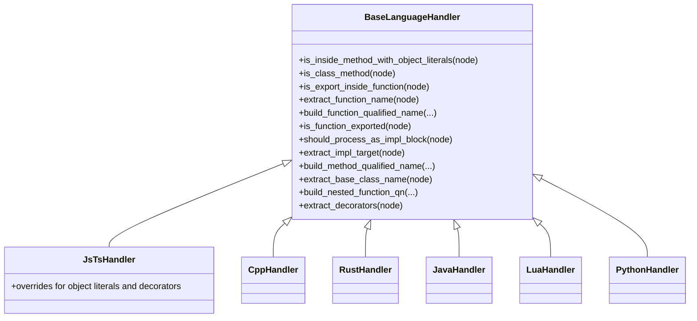
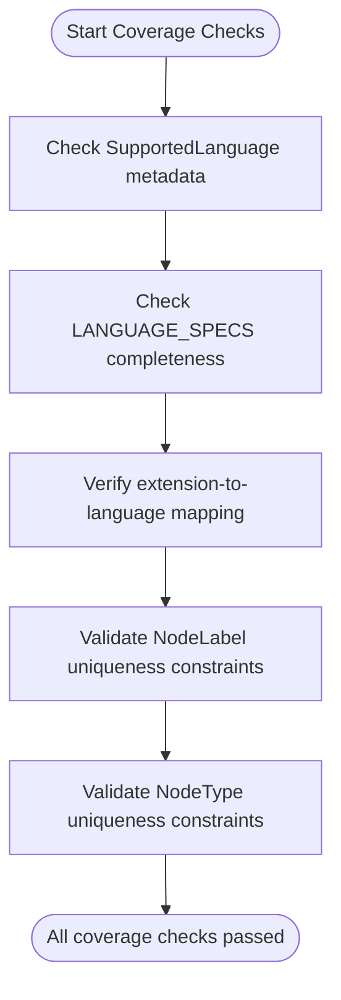
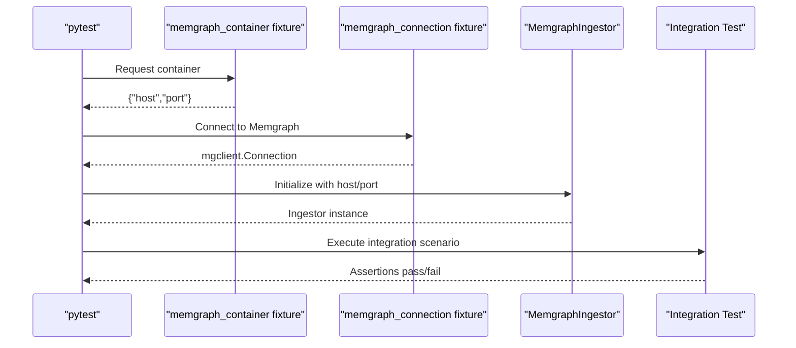
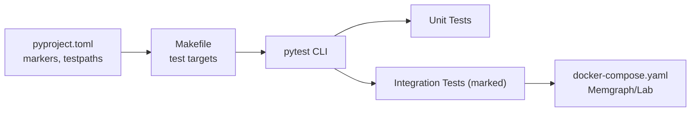

# Testing Framework

<cite>
**Referenced Files in This Document**
- [Makefile](file://Makefile)
- [pyproject.toml](file://pyproject.toml)
- [docker-compose.yaml](file://docker-compose.yaml)
- [codebase_rag/tests/conftest.py](file://codebase_rag/tests/conftest.py)
- [codebase_rag/tests/test_handlers_unit.py](file://codebase_rag/tests/test_handlers_unit.py)
- [codebase_rag/tests/test_handler_registry.py](file://codebase_rag/tests/test_handler_registry.py)
- [codebase_rag/tests/test_language_node_coverage.py](file://codebase_rag/tests/test_language_node_coverage.py)
- [codebase_rag/tests/test_node_relationship_coverage.py](file://codebase_rag/tests/test_node_relationship_coverage.py)
- [INTEGRATION_COMPLETE.md](file://INTEGRATION_COMPLETE.md)
- [INTEGRATION_SUMMARY.md](file://INTEGRATION_SUMMARY.md)
- [TEST_RESULTS.md](file://TEST_RESULTS.md)
</cite>

## Table of Contents
1. [Introduction](#introduction)
2. [Project Structure](#project-structure)
3. [Core Components](#core-components)
4. [Architecture Overview](#architecture-overview)
5. [Detailed Component Analysis](#detailed-component-analysis)
6. [Dependency Analysis](#dependency-analysis)
7. [Performance Considerations](#performance-considerations)
8. [Troubleshooting Guide](#troubleshooting-guide)
9. [Conclusion](#conclusion)
10. [Appendices](#appendices)

## Introduction
This document describes the Graph-Code testing framework and quality assurance practices. It covers unit testing strategies for language handlers and parser functionality, integration testing approaches for end-to-end workflows, test organization and naming conventions, continuous integration setup, Makefile testing commands, guidance for writing new tests, extensive language and edge case coverage, testing environment setup with Docker, troubleshooting for test failures, and best practices for maintaining and expanding test coverage.

## Project Structure
The testing system is organized under the codebase_rag/tests directory with pytest as the primary test runner. The test suite is split into:
- Unit tests for individual components (handlers, language specs, node/relationship coverage)
- Integration tests that exercise end-to-end workflows and multi-language scenarios
- Conftest fixtures for shared setup, especially for Docker-managed Memgraph containers

Key configuration and orchestration:
- pytest configuration in pyproject.toml defines markers, test discovery, and async mode
- Makefile provides convenient targets for running unit, parallel, integration, and all tests
- docker-compose defines Memgraph and Memgraph Lab services for integration testing

**Diagram sources**
- [Makefile](file://Makefile#L1-L80)
- [pyproject.toml](file://pyproject.toml#L94-L105)
- [docker-compose.yaml](file://docker-compose.yaml#L1-L13)
- [codebase_rag/tests/conftest.py](file://codebase_rag/tests/conftest.py#L1-L290)
- [codebase_rag/tests/test_handlers_unit.py](file://codebase_rag/tests/test_handlers_unit.py#L1-L800)
- [codebase_rag/tests/test_handler_registry.py](file://codebase_rag/tests/test_handler_registry.py#L1-L154)
- [codebase_rag/tests/test_language_node_coverage.py](file://codebase_rag/tests/test_language_node_coverage.py#L1-L226)
- [codebase_rag/tests/test_node_relationship_coverage.py](file://codebase_rag/tests/test_node_relationship_coverage.py#L1-L274)

**Section sources**
- [Makefile](file://Makefile#L1-L80)
- [pyproject.toml](file://pyproject.toml#L94-L105)
- [docker-compose.yaml](file://docker-compose.yaml#L1-L13)

## Core Components
- Unit tests for language handlers validate parsing logic, qualified name construction, decorators, and language-specific AST patterns using Tree-sitter parsers when available.
- Handler registry tests ensure correct handler selection and protocol compliance across supported languages.
- Language node coverage tests verify that all supported languages have metadata, language specs, file extensions, and mapping to node types.
- Node and relationship coverage tests validate unique key constraints, constraint creation, and buffer flushing for all node and relationship types.
- Integration tests (marked with integration marker) exercise end-to-end workflows using Dockerized Memgraph and real codebases.

**Section sources**
- [codebase_rag/tests/test_handlers_unit.py](file://codebase_rag/tests/test_handlers_unit.py#L1-L800)
- [codebase_rag/tests/test_handler_registry.py](file://codebase_rag/tests/test_handler_registry.py#L1-L154)
- [codebase_rag/tests/test_language_node_coverage.py](file://codebase_rag/tests/test_language_node_coverage.py#L1-L226)
- [codebase_rag/tests/test_node_relationship_coverage.py](file://codebase_rag/tests/test_node_relationship_coverage.py#L1-L274)

## Architecture Overview
The testing architecture separates concerns into unit and integration layers:
- Unit layer: isolated tests for handlers, specs, and constraints using mocks and fixtures
- Integration layer: tests that require Docker containers (Memgraph and optional Lab) and real-world parsing

**Diagram sources**
- [codebase_rag/tests/test_handlers_unit.py](file://codebase_rag/tests/test_handlers_unit.py#L1-L800)
- [codebase_rag/tests/test_handler_registry.py](file://codebase_rag/tests/test_handler_registry.py#L1-L154)
- [codebase_rag/tests/test_language_node_coverage.py](file://codebase_rag/tests/test_language_node_coverage.py#L1-L226)
- [codebase_rag/tests/test_node_relationship_coverage.py](file://codebase_rag/tests/test_node_relationship_coverage.py#L1-L274)
- [docker-compose.yaml](file://docker-compose.yaml#L1-L13)

## Detailed Component Analysis

### Unit Testing Strategy for Language Handlers
- Fixture-driven: Each language handler test uses dedicated fixtures to initialize Tree-sitter parsers conditionally based on availability.
- Protocol compliance: Tests verify that each handler exposes the required methods and that specialized handlers extend the base handler.
- Edge cases: Tests cover nested functions, object literals, decorators/attributes, inheritance, and qualified name construction.

**Diagram sources**
- [codebase_rag/tests/test_handlers_unit.py](file://codebase_rag/tests/test_handlers_unit.py#L1-L800)
- [codebase_rag/tests/test_handler_registry.py](file://codebase_rag/tests/test_handler_registry.py#L1-L154)

**Section sources**
- [codebase_rag/tests/test_handlers_unit.py](file://codebase_rag/tests/test_handlers_unit.py#L1-L800)
- [codebase_rag/tests/test_handler_registry.py](file://codebase_rag/tests/test_handler_registry.py#L1-L154)

### Parser and Language Spec Coverage
- Validates that SupportedLanguage enumerations have corresponding metadata, language specs, and file extensions.
- Ensures extension-to-language mapping is complete and accurate.
- Confirms node type and label consistency with unique key constraints.

**Diagram sources**
- [codebase_rag/tests/test_language_node_coverage.py](file://codebase_rag/tests/test_language_node_coverage.py#L1-L226)
- [codebase_rag/tests/test_node_relationship_coverage.py](file://codebase_rag/tests/test_node_relationship_coverage.py#L1-L274)

**Section sources**
- [codebase_rag/tests/test_language_node_coverage.py](file://codebase_rag/tests/test_language_node_coverage.py#L1-L226)
- [codebase_rag/tests/test_node_relationship_coverage.py](file://codebase_rag/tests/test_node_relationship_coverage.py#L1-L274)

### Integration Testing Approach
- Integration tests are marked and executed separately, requiring Docker services (Memgraph and optionally Lab).
- End-to-end scenarios include codebase parsing, document ingestion, multi-project workflows, and MCP tool integrations.
- The integration results documentation validates the completeness and correctness of integration features.

**Diagram sources**
- [codebase_rag/tests/conftest.py](file://codebase_rag/tests/conftest.py#L182-L290)

**Section sources**
- [codebase_rag/tests/conftest.py](file://codebase_rag/tests/conftest.py#L182-L290)
- [INTEGRATION_COMPLETE.md](file://INTEGRATION_COMPLETE.md#L1-L576)
- [INTEGRATION_SUMMARY.md](file://INTEGRATION_SUMMARY.md#L1-L562)
- [TEST_RESULTS.md](file://TEST_RESULTS.md#L1-L412)

## Dependency Analysis
- pytest configuration defines markers for slow, integration, and e2e tests, enabling selective runs.
- Makefile targets delegate to pytest with appropriate markers and parallelization flags.
- Optional dependencies enable full Tree-sitter language support; tests skip gracefully when unavailable.
- Docker Compose provisions Memgraph and Lab for integration tests.

**Diagram sources**
- [pyproject.toml](file://pyproject.toml#L94-L105)
- [Makefile](file://Makefile#L33-L46)
- [docker-compose.yaml](file://docker-compose.yaml#L1-L13)

**Section sources**
- [pyproject.toml](file://pyproject.toml#L94-L105)
- [Makefile](file://Makefile#L33-L46)
- [docker-compose.yaml](file://docker-compose.yaml#L1-L13)

## Performance Considerations
- Parallel execution: Use make test-parallel or make test-parallel-all to leverage pytest-xdist for faster unit and combined test runs.
- Conditional parser loading: Tests skip language-specific suites when Tree-sitter parsers are unavailable, reducing overhead.
- Container reuse: Integration tests rely on persistent Docker services; ensure proper teardown to avoid resource leaks.

[No sources needed since this section provides general guidance]

## Troubleshooting Guide
Common issues and resolutions:
- Missing Tree-sitter parsers: Tests that require specific language parsers will be skipped; install optional dependencies to enable full coverage.
- Docker connectivity: Ensure Memgraph container is running and ports are exposed; verify host/port configuration.
- Integration test failures: Confirm that integration tests are executed with the integration marker and Docker services are healthy.
- Constraint mismatches: If node/relationship tests fail, verify that node label and unique key mappings are consistent.

**Section sources**
- [codebase_rag/tests/conftest.py](file://codebase_rag/tests/conftest.py#L182-L290)
- [docker-compose.yaml](file://docker-compose.yaml#L1-L13)

## Conclusion
The Graph-Code testing framework provides robust unit and integration coverage across multiple languages and complex workflows. The Makefile and pytest configuration streamline local and CI execution, while Docker-based integration tests validate end-to-end behavior. Adhering to the established patterns and conventions ensures reliable expansion of test coverage.

[No sources needed since this section summarizes without analyzing specific files]

## Appendices

### Test Organization and Naming Conventions
- Files: test_*.py or *_test.py
- Classes: Test*
- Functions: test_*
- Markers: integration, e2e, slow

**Section sources**
- [pyproject.toml](file://pyproject.toml#L98-L105)

### Continuous Integration Setup and Automated Workflows
- CI integrates pytest with parallel execution and Docker services for integration tests.
- Pre-commit hooks enforce linting and formatting standards.

**Section sources**
- [pyproject.toml](file://pyproject.toml#L107-L121)

### Makefile Testing Commands
- make test: Run unit tests excluding integration
- make test-parallel: Run unit tests in parallel
- make test-integration: Run integration tests with Docker
- make test-all: Run all tests including integration and e2e
- make test-parallel-all: Run all tests in parallel

**Section sources**
- [Makefile](file://Makefile#L33-L46)

### Writing New Tests for Parsers, Tools, and Services
- Follow existing patterns: use fixtures from conftest.py, mark integration tests with integration marker, and validate both positive and negative cases.
- For language handlers: add language-specific fixtures and parameterized tests for edge cases.
- For services: mock external dependencies and validate buffer flushing and constraint creation.

**Section sources**
- [codebase_rag/tests/conftest.py](file://codebase_rag/tests/conftest.py#L1-L290)
- [codebase_rag/tests/test_handlers_unit.py](file://codebase_rag/tests/test_handlers_unit.py#L1-L800)
- [codebase_rag/tests/test_node_relationship_coverage.py](file://codebase_rag/tests/test_node_relationship_coverage.py#L1-L274)

### Testing Environment Setup and Docker Requirements
- Memgraph service: exposed on port 7687 (configurable via MEMGRAPH_PORT)
- Memgraph Lab: exposed on port 3000 (configurable via LAB_PORT)
- Run docker-compose up to start services; integration tests will connect automatically.

**Section sources**
- [docker-compose.yaml](file://docker-compose.yaml#L1-L13)

### Best Practices for Maintaining Test Quality and Expanding Coverage
- Keep tests isolated and deterministic; use fixtures for shared setup.
- Prefer parameterized tests for multiple inputs and edge cases.
- Validate constraints and mappings early to catch inconsistencies.
- Use integration tests sparingly and only when Docker resources are available.

**Section sources**
- [codebase_rag/tests/test_language_node_coverage.py](file://codebase_rag/tests/test_language_node_coverage.py#L1-L226)
- [codebase_rag/tests/test_node_relationship_coverage.py](file://codebase_rag/tests/test_node_relationship_coverage.py#L1-L274)