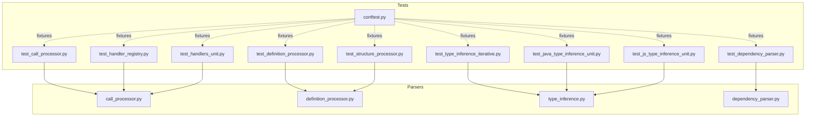
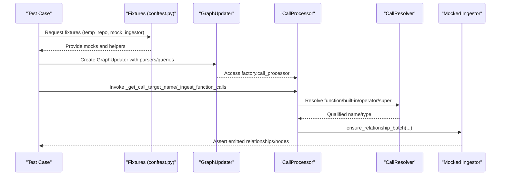
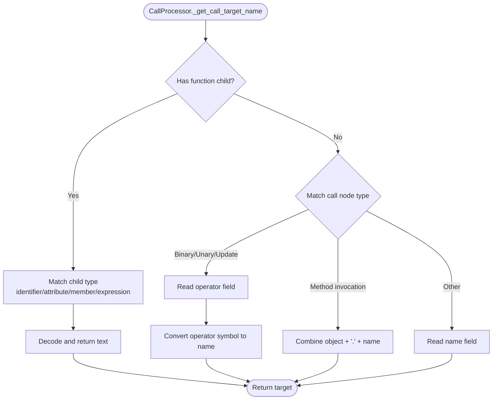
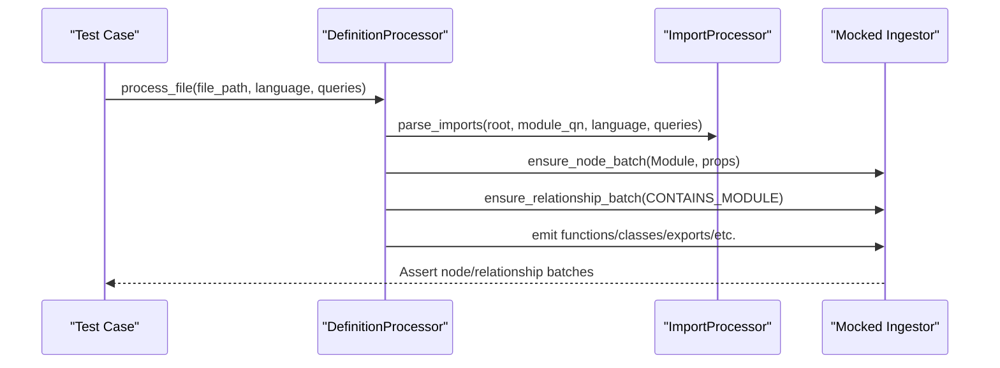
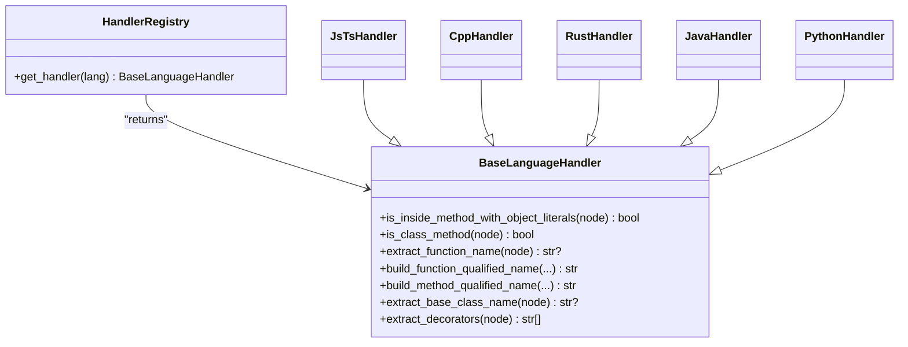
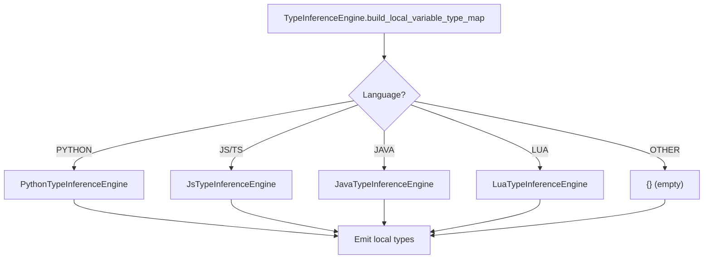
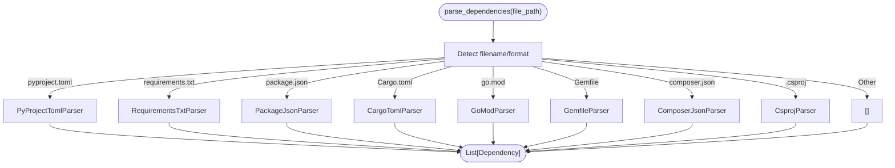
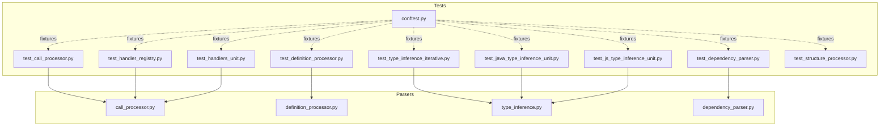

# Unit Testing

<cite>
**Referenced Files in This Document**
- [conftest.py](file://codebase_rag/tests/conftest.py)
- [test_call_processor.py](file://codebase_rag/tests/test_call_processor.py)
- [test_definition_processor.py](file://codebase_rag/tests/test_definition_processor.py)
- [test_handler_registry.py](file://codebase_rag/tests/test_handler_registry.py)
- [test_handlers_unit.py](file://codebase_rag/tests/test_handlers_unit.py)
- [test_type_inference_iterative.py](file://codebase_rag/tests/test_type_inference_iterative.py)
- [test_java_type_inference_unit.py](file://codebase_rag/tests/test_java_type_inference_unit.py)
- [test_js_type_inference_unit.py](file://codebase_rag/tests/test_js_type_inference_unit.py)
- [test_dependency_parser.py](file://codebase_rag/tests/test_dependency_parser.py)
- [test_structure_processor.py](file://codebase_rag/tests/test_structure_processor.py)
- [call_processor.py](file://codebase_rag/parsers/call_processor.py)
- [definition_processor.py](file://codebase_rag/parsers/definition_processor.py)
- [type_inference.py](file://codebase_rag/parsers/type_inference.py)
- [dependency_parser.py](file://codebase_rag/parsers/dependency_parser.py)
</cite>

## Table of Contents
1. [Introduction](#introduction)
2. [Project Structure](#project-structure)
3. [Core Components](#core-components)
4. [Architecture Overview](#architecture-overview)
5. [Detailed Component Analysis](#detailed-component-analysis)
6. [Dependency Analysis](#dependency-analysis)
7. [Performance Considerations](#performance-considerations)
8. [Troubleshooting Guide](#troubleshooting-guide)
9. [Conclusion](#conclusion)

## Introduction
This document describes the unit testing framework for the codebase’s parser components and related systems. It focuses on:
- Strategies for testing individual components in isolation
- Organization of parser tests (call processors, definition processors, handler registries)
- Patterns for type inference engines and iterative algorithms
- Examples of language-specific handler testing and edge cases
- Test fixtures and mocking strategies for isolated component testing
- Guidance for testing core algorithms such as dependency parsing and relationship extraction
- Best practices for writing effective unit tests and maintaining coverage

## Project Structure
The test suite is organized under codebase_rag/tests and mirrors the parser architecture:
- Parser components: call_processor, definition_processor, type_inference, dependency_parser
- Handler registry and language-specific handlers
- Iterative type inference tests
- Fixture and container helpers for deterministic environments

**Diagram sources**
- [test_call_processor.py](file://codebase_rag/tests/test_call_processor.py#L1-L1209)
- [test_definition_processor.py](file://codebase_rag/tests/test_definition_processor.py#L1-L982)
- [test_handler_registry.py](file://codebase_rag/tests/test_handler_registry.py#L1-L154)
- [test_handlers_unit.py](file://codebase_rag/tests/test_handlers_unit.py#L1-L1108)
- [test_type_inference_iterative.py](file://codebase_rag/tests/test_type_inference_iterative.py#L1-L333)
- [test_java_type_inference_unit.py](file://codebase_rag/tests/test_java_type_inference_unit.py#L1-L897)
- [test_js_type_inference_unit.py](file://codebase_rag/tests/test_js_type_inference_unit.py#L1-L431)
- [test_dependency_parser.py](file://codebase_rag/tests/test_dependency_parser.py#L1-L869)
- [test_structure_processor.py](file://codebase_rag/tests/test_structure_processor.py#L1-L514)
- [conftest.py](file://codebase_rag/tests/conftest.py#L1-L290)
- [call_processor.py](file://codebase_rag/parsers/call_processor.py#L1-L364)
- [definition_processor.py](file://codebase_rag/parsers/definition_processor.py#L1-L193)
- [type_inference.py](file://codebase_rag/parsers/type_inference.py#L1-L135)
- [dependency_parser.py](file://codebase_rag/parsers/dependency_parser.py#L1-L271)

**Section sources**
- [conftest.py](file://codebase_rag/tests/conftest.py#L1-L290)

## Core Components
This section outlines the primary components under test and their roles in unit testing.

- Call Processor
  - Purpose: Extract and resolve function/method calls across languages, including built-ins, operators, and inheritance-aware resolution.
  - Test focus: Parsing call targets, resolving built-in and operator calls, inheritance and super calls, method chaining detection, import distance calculation, and qualified name building.
  - Key implementation: [call_processor.py](file://codebase_rag/parsers/call_processor.py#L1-L364)

- Definition Processor
  - Purpose: Parse module-level definitions, imports, and dependencies; emit nodes and relationships for modules, packages, folders, and external packages.
  - Test focus: Docstring extraction, decorator extraction, dependency parsing across formats, and module containment relationships.
  - Key implementation: [definition_processor.py](file://codebase_rag/parsers/definition_processor.py#L1-L193)

- Type Inference Engine
  - Purpose: Build local variable type maps per language and delegate to language-specific engines.
  - Test focus: Lazy initialization, dispatch by language, recursion-safe traversal, and class name resolution.
  - Key implementation: [type_inference.py](file://codebase_rag/parsers/type_inference.py#L1-L135)

- Dependency Parser
  - Purpose: Parse external dependencies from various project files (pyproject.toml, requirements.txt, package.json, Cargo.toml, go.mod, Gemfile, composer.json, .csproj).
  - Test focus: PEP508 parsing, TOML/JSON/XML handling, and cross-file compatibility.
  - Key implementation: [dependency_parser.py](file://codebase_rag/parsers/dependency_parser.py#L1-L271)

**Section sources**
- [call_processor.py](file://codebase_rag/parsers/call_processor.py#L1-L364)
- [definition_processor.py](file://codebase_rag/parsers/definition_processor.py#L1-L193)
- [type_inference.py](file://codebase_rag/parsers/type_inference.py#L1-L135)
- [dependency_parser.py](file://codebase_rag/parsers/dependency_parser.py#L1-L271)

## Architecture Overview
The tests leverage a shared fixture layer to isolate components and simulate real-world scenarios.

**Diagram sources**
- [conftest.py](file://codebase_rag/tests/conftest.py#L92-L179)
- [test_call_processor.py](file://codebase_rag/tests/test_call_processor.py#L21-L39)
- [call_processor.py](file://codebase_rag/parsers/call_processor.py#L200-L327)

**Section sources**
- [conftest.py](file://codebase_rag/tests/conftest.py#L92-L179)
- [test_call_processor.py](file://codebase_rag/tests/test_call_processor.py#L21-L39)
- [call_processor.py](file://codebase_rag/parsers/call_processor.py#L200-L327)

## Detailed Component Analysis

### Call Processor Tests
Testing strategies:
- Fixture-driven: Use a real GraphUpdater to construct a CallProcessor with live parsers and queries.
- Language coverage: Test identifiers, attributes, chained expressions, method invocations, and C++ operators.
- Built-in and operator resolution: Verify built-in patterns and C++ operator conversions.
- Inheritance and super: Validate resolution across parent/grandparent classes.
- Method chaining detection and import distance heuristics.
- Qualified name construction across nested scopes.

Representative test classes and methods:
- Target name extraction: [test_call_processor.py](file://codebase_rag/tests/test_call_processor.py#L60-L274)
- Built-in and operator resolution: [test_call_processor.py](file://codebase_rag/tests/test_call_processor.py#L330-L496)
- Super and inheritance resolution: [test_call_processor.py](file://codebase_rag/tests/test_call_processor.py#L389-L472)
- Method chain detection and import distance: [test_call_processor.py](file://codebase_rag/tests/test_call_processor.py#L582-L630)
- Qualified name building: [test_call_processor.py](file://codebase_rag/tests/test_call_processor.py#L777-L840)

**Diagram sources**
- [call_processor.py](file://codebase_rag/parsers/call_processor.py#L200-L243)

**Section sources**
- [test_call_processor.py](file://codebase_rag/tests/test_call_processor.py#L60-L274)
- [test_call_processor.py](file://codebase_rag/tests/test_call_processor.py#L330-L496)
- [test_call_processor.py](file://codebase_rag/tests/test_call_processor.py#L389-L472)
- [test_call_processor.py](file://codebase_rag/tests/test_call_processor.py#L582-L630)
- [test_call_processor.py](file://codebase_rag/tests/test_call_processor.py#L777-L840)
- [call_processor.py](file://codebase_rag/parsers/call_processor.py#L200-L243)

### Definition Processor Tests
Testing strategies:
- Fixture-driven: Use GraphUpdater to exercise DefinitionProcessor end-to-end.
- Docstring extraction: Validate detection across quoting styles and multiline formats.
- Decorator extraction: Validate Python decorators and class/function contexts.
- Dependency parsing: Cross-format parsing and ingestion of external packages.
- Module containment: Relationship emission between Project/Folder/Package/File.

Representative test classes and methods:
- Docstring extraction: [test_definition_processor.py](file://codebase_rag/tests/test_definition_processor.py#L40-L167)
- Decorator extraction: [test_definition_processor.py](file://codebase_rag/tests/test_definition_processor.py#L169-L318)
- Dependency parsing and ingestion: [test_definition_processor.py](file://codebase_rag/tests/test_definition_processor.py#L320-L662)
- Module processing and containment: [test_definition_processor.py](file://codebase_rag/tests/test_definition_processor.py#L664-L800)

**Diagram sources**
- [definition_processor.py](file://codebase_rag/parsers/definition_processor.py#L53-L140)
- [test_definition_processor.py](file://codebase_rag/tests/test_definition_processor.py#L664-L794)

**Section sources**
- [test_definition_processor.py](file://codebase_rag/tests/test_definition_processor.py#L40-L167)
- [test_definition_processor.py](file://codebase_rag/tests/test_definition_processor.py#L169-L318)
- [test_definition_processor.py](file://codebase_rag/tests/test_definition_processor.py#L320-L662)
- [test_definition_processor.py](file://codebase_rag/tests/test_definition_processor.py#L664-L800)
- [definition_processor.py](file://codebase_rag/parsers/definition_processor.py#L53-L140)

### Handler Registry and Language-Specific Handlers
Testing strategies:
- Registry lookup: Validate handler selection per language and caching semantics.
- Protocol compliance: Ensure all handlers expose required methods.
- Language-specific behavior: Test JavaScript/TypeScript object literal methods, C++ function exports, Rust impl blocks, Java method signatures, and Python nested function qualification.

Representative test classes and methods:
- Handler registry: [test_handler_registry.py](file://codebase_rag/tests/test_handler_registry.py#L16-L54)
- Handler caching and protocol: [test_handler_registry.py](file://codebase_rag/tests/test_handler_registry.py#L56-L134)
- Handler inheritance: [test_handler_registry.py](file://codebase_rag/tests/test_handler_registry.py#L136-L154)
- Base handler defaults and Python nested QN: [test_handlers_unit.py](file://codebase_rag/tests/test_handlers_unit.py#L114-L246)
- JavaScript/TypeScript object literals and nested QN: [test_handlers_unit.py](file://codebase_rag/tests/test_handlers_unit.py#L248-L440)
- C++ function name extraction and base class name: [test_handlers_unit.py](file://codebase_rag/tests/test_handlers_unit.py#L538-L648)
- Rust impl blocks and attributes: [test_handlers_unit.py](file://codebase_rag/tests/test_handlers_unit.py#L650-L771)
- Java method signature and class name extraction: [test_handlers_unit.py](file://codebase_rag/tests/test_handlers_unit.py#L773-L840)

**Diagram sources**
- [test_handler_registry.py](file://codebase_rag/tests/test_handler_registry.py#L16-L54)
- [test_handlers_unit.py](file://codebase_rag/tests/test_handlers_unit.py#L114-L197)
- [test_handlers_unit.py](file://codebase_rag/tests/test_handlers_unit.py#L248-L440)
- [test_handlers_unit.py](file://codebase_rag/tests/test_handlers_unit.py#L538-L648)
- [test_handlers_unit.py](file://codebase_rag/tests/test_handlers_unit.py#L650-L771)
- [test_handlers_unit.py](file://codebase_rag/tests/test_handlers_unit.py#L773-L840)

**Section sources**
- [test_handler_registry.py](file://codebase_rag/tests/test_handler_registry.py#L16-L54)
- [test_handler_registry.py](file://codebase_rag/tests/test_handler_registry.py#L56-L134)
- [test_handler_registry.py](file://codebase_rag/tests/test_handler_registry.py#L136-L154)
- [test_handlers_unit.py](file://codebase_rag/tests/test_handlers_unit.py#L114-L246)
- [test_handlers_unit.py](file://codebase_rag/tests/test_handlers_unit.py#L248-L440)
- [test_handlers_unit.py](file://codebase_rag/tests/test_handlers_unit.py#L538-L648)
- [test_handlers_unit.py](file://codebase_rag/tests/test_handlers_unit.py#L650-L771)
- [test_handlers_unit.py](file://codebase_rag/tests/test_handlers_unit.py#L773-L840)

### Type Inference Systems and Iterative Algorithms
Testing strategies:
- Lazy initialization: Confirm engines are constructed on demand and cached.
- Dispatch by language: Validate correct delegation for Python, JS/TS, Java, Lua.
- Recursion safety: Deep traversal tests without stack errors.
- Class name resolution: Import mapping and registry fallback.

Representative test classes and methods:
- Recursion-safe traversal and lazy engines: [test_type_inference_iterative.py](file://codebase_rag/tests/test_type_inference_iterative.py#L87-L112)
- Lazy engine initialization: [test_type_inference_iterative.py](file://codebase_rag/tests/test_type_inference_iterative.py#L114-L150)
- Dispatch by language: [test_type_inference_iterative.py](file://codebase_rag/tests/test_type_inference_iterative.py#L152-L268)
- Class name resolution: [test_type_inference_iterative.py](file://codebase_rag/tests/test_type_inference_iterative.py#L270-L316)
- Java type resolver and variable lookup: [test_java_type_inference_unit.py](file://codebase_rag/tests/test_java_type_inference_unit.py#L58-L272)
- JavaScript/TypeScript variable type inference and return analysis: [test_js_type_inference_unit.py](file://codebase_rag/tests/test_js_type_inference_unit.py#L95-L431)

**Diagram sources**
- [type_inference.py](file://codebase_rag/parsers/type_inference.py#L103-L125)
- [test_type_inference_iterative.py](file://codebase_rag/tests/test_type_inference_iterative.py#L152-L268)

**Section sources**
- [test_type_inference_iterative.py](file://codebase_rag/tests/test_type_inference_iterative.py#L87-L112)
- [test_type_inference_iterative.py](file://codebase_rag/tests/test_type_inference_iterative.py#L114-L150)
- [test_type_inference_iterative.py](file://codebase_rag/tests/test_type_inference_iterative.py#L152-L268)
- [test_type_inference_iterative.py](file://codebase_rag/tests/test_type_inference_iterative.py#L270-L316)
- [test_java_type_inference_unit.py](file://codebase_rag/tests/test_java_type_inference_unit.py#L58-L272)
- [test_js_type_inference_unit.py](file://codebase_rag/tests/test_js_type_inference_unit.py#L95-L431)
- [type_inference.py](file://codebase_rag/parsers/type_inference.py#L103-L125)

### Dependency Parsing Tests
Testing strategies:
- PEP508 parsing: Validate package names and version specifiers.
- Format-specific parsers: TOML (pyproject, cargo), JSON (package.json, composer.json), XML (.csproj), plain-text (requirements.txt), and go.mod.
- Cross-file compatibility and error handling.

Representative test classes and methods:
- PEP508 parsing: [test_dependency_parser.py](file://codebase_rag/tests/test_dependency_parser.py#L21-L92)
- PyProjectTomlParser: [test_dependency_parser.py](file://codebase_rag/tests/test_dependency_parser.py#L93-L203)
- RequirementsTxtParser: [test_dependency_parser.py](file://codebase_rag/tests/test_dependency_parser.py#L205-L267)
- PackageJsonParser: [test_dependency_parser.py](file://codebase_rag/tests/test_dependency_parser.py#L269-L350)
- CargoTomlParser: [test_dependency_parser.py](file://codebase_rag/tests/test_dependency_parser.py#L352-L447)
- GoModParser: [test_dependency_parser.py](file://codebase_rag/tests/test_dependency_parser.py#L458-L547)
- GemfileParser: [test_dependency_parser.py](file://codebase_rag/tests/test_dependency_parser.py#L549-L621)
- ComposerJsonParser: [test_dependency_parser.py](file://codebase_rag/tests/test_dependency_parser.py#L623-L688)
- CsprojParser: [test_dependency_parser.py](file://codebase_rag/tests/test_dependency_parser.py#L690-L769)
- parse_dependencies dispatcher: [test_dependency_parser.py](file://codebase_rag/tests/test_dependency_parser.py#L771-L800)

**Diagram sources**
- [dependency_parser.py](file://codebase_rag/parsers/dependency_parser.py#L249-L271)
- [test_dependency_parser.py](file://codebase_rag/tests/test_dependency_parser.py#L771-L800)

**Section sources**
- [test_dependency_parser.py](file://codebase_rag/tests/test_dependency_parser.py#L21-L92)
- [test_dependency_parser.py](file://codebase_rag/tests/test_dependency_parser.py#L93-L203)
- [test_dependency_parser.py](file://codebase_rag/tests/test_dependency_parser.py#L205-L267)
- [test_dependency_parser.py](file://codebase_rag/tests/test_dependency_parser.py#L269-L350)
- [test_dependency_parser.py](file://codebase_rag/tests/test_dependency_parser.py#L352-L447)
- [test_dependency_parser.py](file://codebase_rag/tests/test_dependency_parser.py#L458-L547)
- [test_dependency_parser.py](file://codebase_rag/tests/test_dependency_parser.py#L549-L621)
- [test_dependency_parser.py](file://codebase_rag/tests/test_dependency_parser.py#L623-L688)
- [test_dependency_parser.py](file://codebase_rag/tests/test_dependency_parser.py#L690-L769)
- [test_dependency_parser.py](file://codebase_rag/tests/test_dependency_parser.py#L771-L800)
- [dependency_parser.py](file://codebase_rag/parsers/dependency_parser.py#L249-L271)

### Structure Processor Tests
Testing strategies:
- Package/folder identification via language-specific package indicators (__init__.py, Cargo.toml, etc.).
- Structural element population and containment relationships.
- Generic file processing with extension detection.

Representative test classes and methods:
- Package/folder identification and containment: [test_structure_processor.py](file://codebase_rag/tests/test_structure_processor.py#L58-L342)
- Generic file processing and relationships: [test_structure_processor.py](file://codebase_rag/tests/test_structure_processor.py#L344-L477)
- Multi-language package indicators: [test_structure_processor.py](file://codebase_rag/tests/test_structure_processor.py#L479-L514)

**Section sources**
- [test_structure_processor.py](file://codebase_rag/tests/test_structure_processor.py#L58-L342)
- [test_structure_processor.py](file://codebase_rag/tests/test_structure_processor.py#L344-L477)
- [test_structure_processor.py](file://codebase_rag/tests/test_structure_processor.py#L479-L514)

## Dependency Analysis
This section maps test dependencies and highlights coupling between test suites and parser components.

**Diagram sources**
- [test_call_processor.py](file://codebase_rag/tests/test_call_processor.py#L1-L1209)
- [test_definition_processor.py](file://codebase_rag/tests/test_definition_processor.py#L1-L982)
- [test_handler_registry.py](file://codebase_rag/tests/test_handler_registry.py#L1-L154)
- [test_handlers_unit.py](file://codebase_rag/tests/test_handlers_unit.py#L1-L1108)
- [test_type_inference_iterative.py](file://codebase_rag/tests/test_type_inference_iterative.py#L1-L333)
- [test_java_type_inference_unit.py](file://codebase_rag/tests/test_java_type_inference_unit.py#L1-L897)
- [test_js_type_inference_unit.py](file://codebase_rag/tests/test_js_type_inference_unit.py#L1-L431)
- [test_dependency_parser.py](file://codebase_rag/tests/test_dependency_parser.py#L1-L869)
- [test_structure_processor.py](file://codebase_rag/tests/test_structure_processor.py#L1-L514)
- [conftest.py](file://codebase_rag/tests/conftest.py#L1-L290)
- [call_processor.py](file://codebase_rag/parsers/call_processor.py#L1-L364)
- [definition_processor.py](file://codebase_rag/parsers/definition_processor.py#L1-L193)
- [type_inference.py](file://codebase_rag/parsers/type_inference.py#L1-L135)
- [dependency_parser.py](file://codebase_rag/parsers/dependency_parser.py#L1-L271)

**Section sources**
- [test_call_processor.py](file://codebase_rag/tests/test_call_processor.py#L1-L1209)
- [test_definition_processor.py](file://codebase_rag/tests/test_definition_processor.py#L1-L982)
- [test_handler_registry.py](file://codebase_rag/tests/test_handler_registry.py#L1-L154)
- [test_handlers_unit.py](file://codebase_rag/tests/test_handlers_unit.py#L1-L1108)
- [test_type_inference_iterative.py](file://codebase_rag/tests/test_type_inference_iterative.py#L1-L333)
- [test_java_type_inference_unit.py](file://codebase_rag/tests/test_java_type_inference_unit.py#L1-L897)
- [test_js_type_inference_unit.py](file://codebase_rag/tests/test_js_type_inference_unit.py#L1-L431)
- [test_dependency_parser.py](file://codebase_rag/tests/test_dependency_parser.py#L1-L869)
- [test_structure_processor.py](file://codebase_rag/tests/test_structure_processor.py#L1-L514)
- [conftest.py](file://codebase_rag/tests/conftest.py#L1-L290)
- [call_processor.py](file://codebase_rag/parsers/call_processor.py#L1-L364)
- [definition_processor.py](file://codebase_rag/parsers/definition_processor.py#L1-L193)
- [type_inference.py](file://codebase_rag/parsers/type_inference.py#L1-L135)
- [dependency_parser.py](file://codebase_rag/parsers/dependency_parser.py#L1-L271)

## Performance Considerations
- Fixture reuse: Shared fixtures reduce overhead and ensure consistent environments.
- Mocked ingestors: Avoid heavy I/O by asserting on mocked calls rather than real database writes.
- Lazy engines: Type inference engines are lazily initialized to avoid unnecessary allocations.
- Minimal AST traversal: Tests use small, synthetic nodes to validate traversal logic without deep recursion.

[No sources needed since this section provides general guidance]

## Troubleshooting Guide
Common issues and resolutions:
- Missing language parsers: Many tests skip when parsers are unavailable (e.g., tree-sitter-*). Use pytest.skipif guards around language-specific tests.
- Fixture availability: Ensure temp_repo and mock_ingestor are requested together so cleanup and setup occur consistently.
- Assertion granularity: Prefer assertions on specific node/relationship batches (e.g., ensure_node_batch, ensure_relationship_batch) to pinpoint failures.
- Containerized databases: For integration-like tests, use memgraph_container and memgraph_connection fixtures to spin up and tear down containers deterministically.

**Section sources**
- [conftest.py](file://codebase_rag/tests/conftest.py#L182-L290)

## Conclusion
The unit testing framework emphasizes:
- Isolation via fixtures and mocks
- Coverage across parser components and language-specific handlers
- Robustness through iterative algorithm safeguards and cross-format parsing
- Clear assertion patterns that validate emitted nodes and relationships

By following the patterns demonstrated here, contributors can write effective unit tests for new components and maintain high coverage across the parser ecosystem.