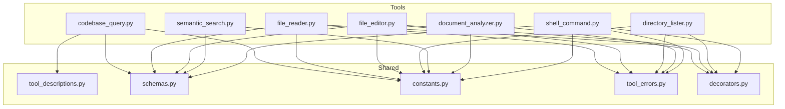
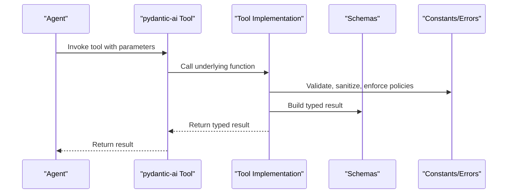
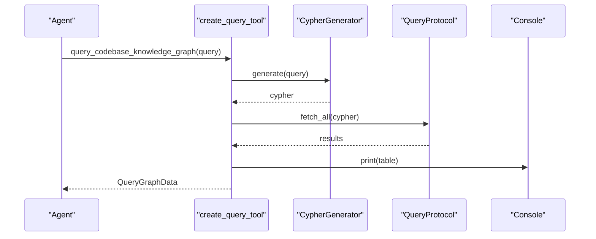
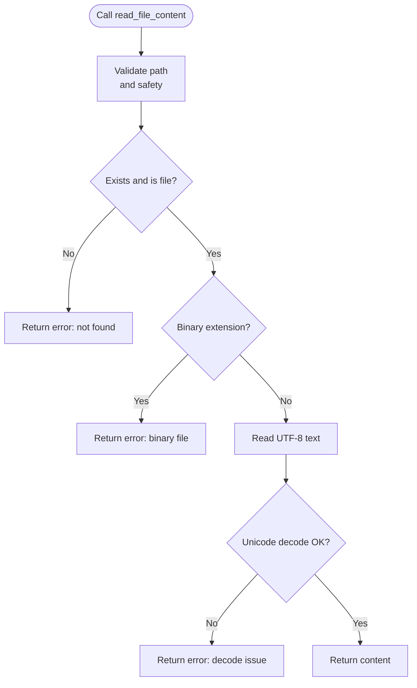
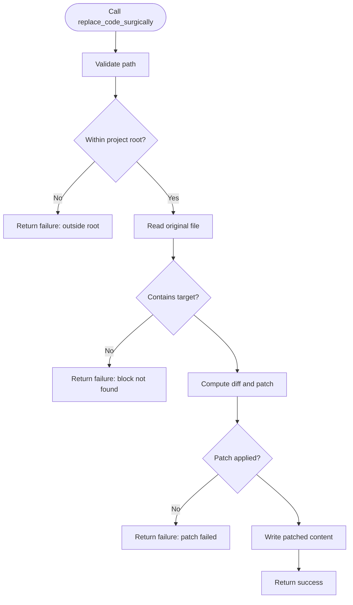
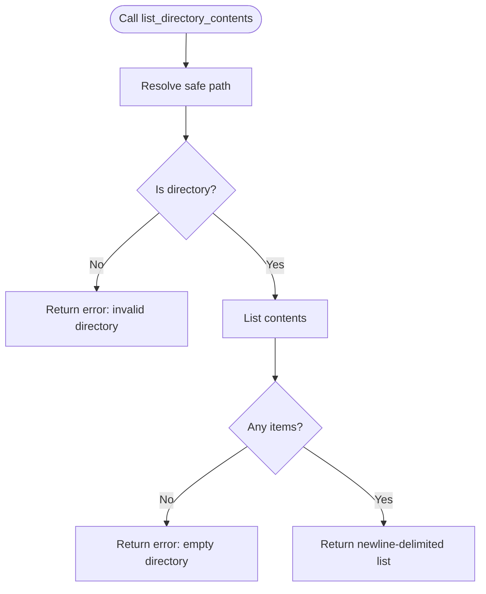
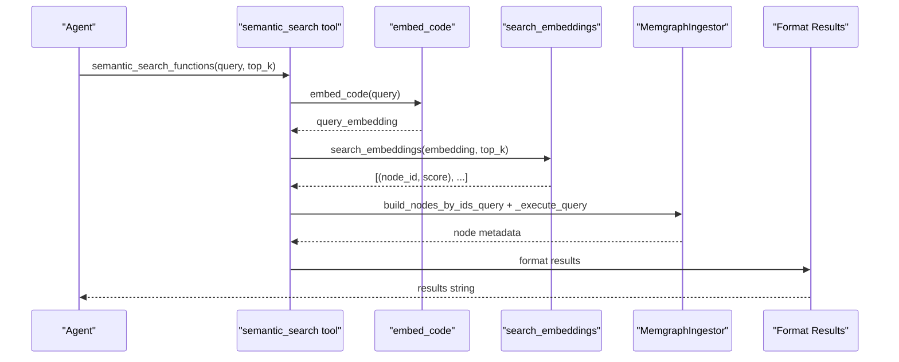
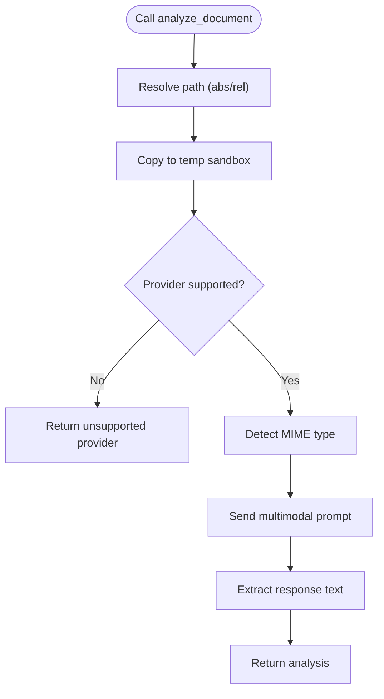
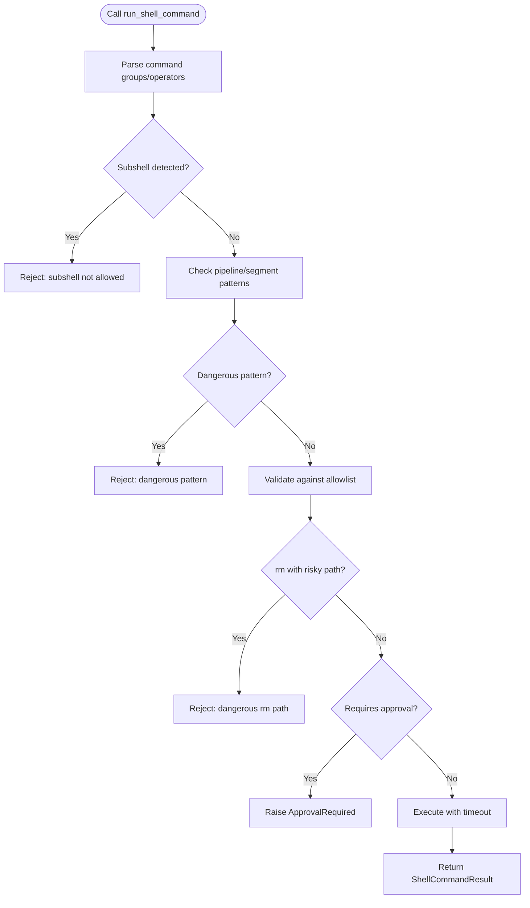
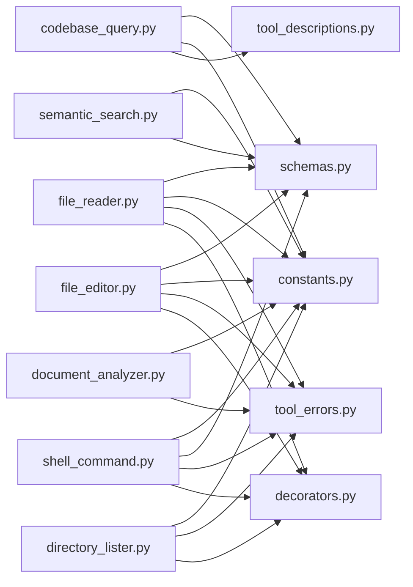

# Available AI-Powered Tools

<cite>
**Referenced Files in This Document**
- [codebase_query.py](file://codebase_rag/tools/codebase_query.py)
- [file_reader.py](file://codebase_rag/tools/file_reader.py)
- [file_editor.py](file://codebase_rag/tools/file_editor.py)
- [directory_lister.py](file://codebase_rag/tools/directory_lister.py)
- [semantic_search.py](file://codebase_rag/tools/semantic_search.py)
- [document_analyzer.py](file://codebase_rag/tools/document_analyzer.py)
- [shell_command.py](file://codebase_rag/tools/shell_command.py)
- [tool_descriptions.py](file://codebase_rag/tools/tool_descriptions.py)
- [schemas.py](file://codebase_rag/schemas.py)
- [constants.py](file://codebase_rag/constants.py)
- [tool_errors.py](file://codebase_rag/tool_errors.py)
- [decorators.py](file://codebase_rag/decorators.py)
- [test_codebase_query.py](file://codebase_rag/tests/test_codebase_query.py)
- [test_file_reader.py](file://codebase_rag/tests/test_file_reader.py)
- [test_file_editor.py](file://codebase_rag/tests/test_file_editor.py)
- [test_shell_command.py](file://codebase_rag/tests/test_shell_command.py)
</cite>

## Table of Contents
1. [Introduction](#introduction)
2. [Project Structure](#project-structure)
3. [Core Components](#core-components)
4. [Architecture Overview](#architecture-overview)
5. [Detailed Component Analysis](#detailed-component-analysis)
6. [Dependency Analysis](#dependency-analysis)
7. [Performance Considerations](#performance-considerations)
8. [Troubleshooting Guide](#troubleshooting-guide)
9. [Conclusion](#conclusion)

## Introduction
This document describes all AI-powered tools available in the Graph-Code system. Each tool is designed to integrate with an AI agent via the pydantic-ai framework, enabling natural language-driven operations over a codebase. The tools covered include:
- codebase_query: Natural language querying of the codebase knowledge graph
- file_reader: Safe reading of text files
- file_editor: Surgical code replacement with AST-aware parsing
- directory_lister: Filesystem navigation
- semantic_search: Intelligent code retrieval using embeddings
- document_analyzer: Document analysis using supported LLM providers
- shell_command: Controlled system command execution with strict safety checks

For each tool, we explain purpose, parameters, return values, usage patterns, schemas, validation, error handling, limitations, safety constraints, best practices, and troubleshooting.

## Project Structure
The tools are implemented under codebase_rag/tools and are paired with shared schemas, constants, and error definitions. Tests demonstrate usage patterns and validate behavior.

**Diagram sources**
- [codebase_query.py](file://codebase_rag/tools/codebase_query.py#L1-L95)
- [file_reader.py](file://codebase_rag/tools/file_reader.py#L1-L67)
- [file_editor.py](file://codebase_rag/tools/file_editor.py#L1-L296)
- [directory_lister.py](file://codebase_rag/tools/directory_lister.py#L1-L58)
- [semantic_search.py](file://codebase_rag/tools/semantic_search.py#L1-L157)
- [document_analyzer.py](file://codebase_rag/tools/document_analyzer.py#L1-L168)
- [shell_command.py](file://codebase_rag/tools/shell_command.py#L1-L436)
- [tool_descriptions.py](file://codebase_rag/tools/tool_descriptions.py#L1-L160)
- [schemas.py](file://codebase_rag/schemas.py#L1-L82)
- [constants.py](file://codebase_rag/constants.py#L1-L800)
- [tool_errors.py](file://codebase_rag/tool_errors.py#L1-L72)
- [decorators.py](file://codebase_rag/decorators.py#L1-L161)

**Section sources**
- [codebase_query.py](file://codebase_rag/tools/codebase_query.py#L1-L95)
- [file_reader.py](file://codebase_rag/tools/file_reader.py#L1-L67)
- [file_editor.py](file://codebase_rag/tools/file_editor.py#L1-L296)
- [directory_lister.py](file://codebase_rag/tools/directory_lister.py#L1-L58)
- [semantic_search.py](file://codebase_rag/tools/semantic_search.py#L1-L157)
- [document_analyzer.py](file://codebase_rag/tools/document_analyzer.py#L1-L168)
- [shell_command.py](file://codebase_rag/tools/shell_command.py#L1-L436)
- [tool_descriptions.py](file://codebase_rag/tools/tool_descriptions.py#L1-L160)
- [schemas.py](file://codebase_rag/schemas.py#L1-L82)
- [constants.py](file://codebase_rag/constants.py#L1-L800)
- [tool_errors.py](file://codebase_rag/tool_errors.py#L1-L72)
- [decorators.py](file://codebase_rag/decorators.py#L1-L161)

## Core Components
- codebase_query: Creates a Tool that translates natural language into Cypher and queries the knowledge graph, returning structured results and a summary.
- file_reader: Provides a Tool wrapper around a FileReader that safely reads text files, rejects binaries, and enforces project-root boundaries.
- file_editor: Provides a Tool wrapper around a FileEditor that performs surgical replacements using exact code matching and diff-match-patch; requires approval.
- directory_lister: Provides a Tool wrapper around a DirectoryLister that lists directory contents safely within project boundaries.
- semantic_search: Performs semantic search using embeddings and returns ranked results with metadata; includes a tool to fetch source by node ID.
- document_analyzer: Provides a Tool wrapper around a DocumentAnalyzer that analyzes documents using supported providers and copies files into a temporary sandbox.
- shell_command: Provides a Tool wrapper around a ShellCommander that validates, sanitizes, and executes commands with allowlists, approvals, and timeouts.

**Section sources**
- [codebase_query.py](file://codebase_rag/tools/codebase_query.py#L24-L95)
- [file_reader.py](file://codebase_rag/tools/file_reader.py#L16-L67)
- [file_editor.py](file://codebase_rag/tools/file_editor.py#L22-L296)
- [directory_lister.py](file://codebase_rag/tools/directory_lister.py#L15-L58)
- [semantic_search.py](file://codebase_rag/tools/semantic_search.py#L18-L157)
- [document_analyzer.py](file://codebase_rag/tools/document_analyzer.py#L28-L168)
- [shell_command.py](file://codebase_rag/tools/shell_command.py#L262-L436)

## Architecture Overview
The tools are thin wrappers around domain classes and return pydantic-ai Tool instances. They rely on shared schemas for typed outputs, constants for configuration and safety, and decorators for path validation and timing.

**Diagram sources**
- [codebase_query.py](file://codebase_rag/tools/codebase_query.py#L24-L95)
- [file_reader.py](file://codebase_rag/tools/file_reader.py#L55-L67)
- [file_editor.py](file://codebase_rag/tools/file_editor.py#L279-L296)
- [directory_lister.py](file://codebase_rag/tools/directory_lister.py#L52-L58)
- [semantic_search.py](file://codebase_rag/tools/semantic_search.py#L121-L157)
- [document_analyzer.py](file://codebase_rag/tools/document_analyzer.py#L148-L168)
- [shell_command.py](file://codebase_rag/tools/shell_command.py#L422-L436)
- [schemas.py](file://codebase_rag/schemas.py#L8-L82)
- [constants.py](file://codebase_rag/constants.py#L1-L800)
- [tool_errors.py](file://codebase_rag/tool_errors.py#L1-L72)

## Detailed Component Analysis

### codebase_query
Purpose
- Translate natural language into Cypher and query the knowledge graph, rendering results in a table and returning structured data.

Parameters
- natural_language_query: string

Return values
- QueryGraphData with:
  - query_used: string (Cypher)
  - results: list of rows (dict-like)
  - summary: string (status message)

Processing logic
- Generates Cypher from natural language
- Executes query via ingestor
- Formats results into a table and prints to console
- Returns structured results and summary

Error handling
- Catches LLM generation errors and DB errors, returning appropriate summaries

Usage pattern
- Agent asks a natural language question; tool returns results and summary

Limitations
- Requires a working LLM pipeline and knowledge graph

Best practices
- Keep queries focused and specific
- Review summary counts and table output

**Diagram sources**
- [codebase_query.py](file://codebase_rag/tools/codebase_query.py#L32-L88)

**Section sources**
- [codebase_query.py](file://codebase_rag/tools/codebase_query.py#L24-L95)
- [schemas.py](file://codebase_rag/schemas.py#L8-L35)
- [tool_descriptions.py](file://codebase_rag/tools/tool_descriptions.py#L25-L31)
- [test_codebase_query.py](file://codebase_rag/tests/test_codebase_query.py#L73-L147)

### file_reader
Purpose
- Safely read text files from the project, rejecting binaries and enforcing project-root boundaries.

Parameters
- file_path: string (relative or absolute)

Return values
- Tool returns a string:
  - Content if successful
  - Error-wrapped message if failed

Processing logic
- Validates path against project root
- Rejects non-existent or directory paths
- Rejects binary files by extension
- Reads UTF-8 text with fallback handling

Error handling
- Uses standardized error messages for not found, binary file, and decode issues

Usage pattern
- Agent requests file content; tool returns content or error string

Limitations
- Cannot read binary files; use document_analyzer for documents

Best practices
- Prefer relative paths under project root
- Verify file suffix is text-based

**Diagram sources**
- [file_reader.py](file://codebase_rag/tools/file_reader.py#L21-L53)

**Section sources**
- [file_reader.py](file://codebase_rag/tools/file_reader.py#L16-L67)
- [schemas.py](file://codebase_rag/schemas.py#L66-L70)
- [tool_errors.py](file://codebase_rag/tool_errors.py#L7-L13)
- [decorators.py](file://codebase_rag/decorators.py#L55-L87)
- [test_file_reader.py](file://codebase_rag/tests/test_file_reader.py#L77-L162)

### file_editor
Purpose
- Surgically replace an exact code block within a file using diff-match-patch and AST-aware parsing for function boundaries.

Parameters
- file_path: string
- target_code: string (exact match)
- replacement_code: string

Return values
- Tool returns a string:
  - Success message if applied
  - Failure message if not applied

Processing logic
- Validates path safety
- Finds exact target occurrence
- Computes unified diff and applies patch
- Writes back to file

Error handling
- Handles not found, multiple occurrences, identical content, and patch failures
- Enforces project-root boundary

Usage pattern
- Agent identifies a precise code block and replacement; tool applies surgical change

Limitations
- Requires exact target match
- May warn on ambiguous matches or multiple occurrences

Best practices
- Use exact code blocks
- Prefer qualified names for functions when ambiguity exists
- Review diffs before approval

**Diagram sources**
- [file_editor.py](file://codebase_rag/tools/file_editor.py#L204-L254)

**Section sources**
- [file_editor.py](file://codebase_rag/tools/file_editor.py#L22-L296)
- [schemas.py](file://codebase_rag/schemas.py#L54-L64)
- [tool_errors.py](file://codebase_rag/tool_errors.py#L7-L13)
- [decorators.py](file://codebase_rag/decorators.py#L55-L87)
- [test_file_editor.py](file://codebase_rag/tests/test_file_editor.py#L154-L228)

### directory_lister
Purpose
- List directory contents safely within project boundaries.

Parameters
- directory_path: string (relative or absolute)

Return values
- Tool returns a string:
  - Newline-separated entries if successful
  - Error message if invalid or empty

Processing logic
- Resolves safe path relative to project root
- Lists contents and returns newline-delimited

Error handling
- Handles invalid directories and general exceptions

Usage pattern
- Agent explores project structure; tool returns directory listing

Limitations
- Operates only within project root

Best practices
- Use relative paths for clarity
- Avoid traversing outside project root

**Diagram sources**
- [directory_lister.py](file://codebase_rag/tools/directory_lister.py#L19-L34)

**Section sources**
- [directory_lister.py](file://codebase_rag/tools/directory_lister.py#L15-L58)
- [tool_errors.py](file://codebase_rag/tool_errors.py#L34-L36)
- [test_file_reader.py](file://codebase_rag/tests/test_file_reader.py#L154-L162)

### semantic_search
Purpose
- Perform semantic search for functions given a natural language description and optionally retrieve source code by node ID.

Parameters
- semantic_search_functions:
  - query: string
  - top_k: int (default 5)
- get_function_source_by_id:
  - node_id: int

Return values
- semantic_search_functions returns a formatted string with ranked results
- get_function_source_by_id returns source code or an unavailable message

Processing logic
- Embeds query and searches vectors
- Fetches node metadata from the graph
- Formats results with type and score
- Retrieves source lines for a node ID

Error handling
- Gracefully handles missing dependencies, no results, invalid locations, and errors

Usage pattern
- Agent describes intent; tool returns candidates; agent can request source for a specific node

Limitations
- Requires embedding dependencies and a connected graph

Best practices
- Use concise, goal-oriented queries
- Use node IDs from prior results to fetch source

**Diagram sources**
- [semantic_search.py](file://codebase_rag/tools/semantic_search.py#L18-L78)

**Section sources**
- [semantic_search.py](file://codebase_rag/tools/semantic_search.py#L18-L157)
- [schemas.py](file://codebase_rag/schemas.py#L37-L46)
- [tool_descriptions.py](file://codebase_rag/tools/tool_descriptions.py#L51-L59)
- [test_codebase_query.py](file://codebase_rag/tests/test_codebase_query.py#L1-L219)

### document_analyzer
Purpose
- Analyze documents (PDFs, images) using supported LLM providers to answer questions about content.

Parameters
- file_path: string (relative or absolute)
- question: string

Return values
- Tool returns a string:
  - Analysis text if successful
  - Error message if unsupported provider, invalid path, or API errors

Processing logic
- Resolves path safely (absolute or relative)
- Copies file into a temporary sandbox
- Chooses provider client based on configuration
- Sends multimodal prompt and extracts response text

Error handling
- Handles unsupported provider, security risks, API validation, and client errors
- Returns descriptive error strings

Usage pattern
- Agent uploads or references a document and asks a question; tool returns analysis

Limitations
- Only supports configured providers
- Operates on local copies for safety

Best practices
- Use supported provider configurations
- Keep questions focused and relevant to document content

**Diagram sources**
- [document_analyzer.py](file://codebase_rag/tools/document_analyzer.py#L111-L146)

**Section sources**
- [document_analyzer.py](file://codebase_rag/tools/document_analyzer.py#L28-L168)
- [tool_errors.py](file://codebase_rag/tool_errors.py#L16-L31)
- [test_file_reader.py](file://codebase_rag/tests/test_file_reader.py#L104-L122)

### shell_command
Purpose
- Execute a controlled set of shell commands with allowlists, safety checks, and approvals.

Parameters
- command: string (supports pipelines and operators)

Return values
- Tool returns ShellCommandResult:
  - return_code: int
  - stdout: string
  - stderr: string

Processing logic
- Detects subshells and dangerous patterns
- Parses pipelines and operators
- Validates each segment against allowlist and safety rules
- Enforces read-only vs write operations and approval gating
- Executes with timeouts and captures combined output

Error handling
- Rejects blocked commands, dangerous flags, and system directory targets
- Handles syntax errors, timeouts, and general exceptions

Usage pattern
- Agent requests a command; tool validates and executes or requests approval

Limitations
- Strict allowlist and safety rules
- Some commands require explicit approval

Best practices
- Prefer read-only commands when possible
- Avoid subshells and redirection operators
- Keep commands short and focused

**Diagram sources**
- [shell_command.py](file://codebase_rag/tools/shell_command.py#L311-L419)

**Section sources**
- [shell_command.py](file://codebase_rag/tools/shell_command.py#L262-L436)
- [schemas.py](file://codebase_rag/schemas.py#L48-L52)
- [tool_errors.py](file://codebase_rag/tool_errors.py#L39-L46)
- [test_shell_command.py](file://codebase_rag/tests/test_shell_command.py#L129-L240)

## Dependency Analysis
- Tools depend on shared schemas for typed outputs and constants for configuration and safety.
- Decorators enforce path safety and timing.
- Error messages are centralized in tool_errors.
- Tests validate behavior across normal and edge cases.

**Diagram sources**
- [codebase_query.py](file://codebase_rag/tools/codebase_query.py#L1-L21)
- [file_reader.py](file://codebase_rag/tools/file_reader.py#L1-L13)
- [file_editor.py](file://codebase_rag/tools/file_editor.py#L1-L19)
- [directory_lister.py](file://codebase_rag/tools/directory_lister.py#L1-L12)
- [semantic_search.py](file://codebase_rag/tools/semantic_search.py#L1-L15)
- [document_analyzer.py](file://codebase_rag/tools/document_analyzer.py#L1-L20)
- [shell_command.py](file://codebase_rag/tools/shell_command.py#L1-L18)
- [schemas.py](file://codebase_rag/schemas.py#L1-L82)
- [constants.py](file://codebase_rag/constants.py#L1-L800)
- [tool_errors.py](file://codebase_rag/tool_errors.py#L1-L72)
- [decorators.py](file://codebase_rag/decorators.py#L1-L161)

**Section sources**
- [schemas.py](file://codebase_rag/schemas.py#L1-L82)
- [constants.py](file://codebase_rag/constants.py#L1-L800)
- [tool_errors.py](file://codebase_rag/tool_errors.py#L1-L72)
- [decorators.py](file://codebase_rag/decorators.py#L1-L161)

## Performance Considerations
- codebase_query: Rendering tables and printing to console adds overhead; keep queries scoped to reduce result sets.
- file_editor: AST parsing and diff computation scale with file size; use surgical replacements on smaller, focused blocks.
- semantic_search: Embedding and vector search cost depends on top_k and index size; tune top_k for responsiveness.
- document_analyzer: Network latency and multimodal processing time vary by provider; cache results where possible.
- shell_command: Pipelining and timeouts prevent runaway processes; avoid long-running commands.

[No sources needed since this section provides general guidance]

## Troubleshooting Guide
Common issues and resolutions:
- codebase_query
  - Translation failures: LLM generation errors return a summary indicating translation failure.
  - Database errors: General exceptions return a summary indicating DB error.
  - Validation: Ensure natural language queries are clear and aligned with graph schema.

- file_reader
  - Not found/binary/decode errors: Use standardized messages to guide the agent to choose another tool or adjust path.
  - Outside root: Security warnings indicate path traversal attempts.

- file_editor
  - Target not found: Ensure exact code match; consider qualified names.
  - Multiple occurrences: Narrow target or use AST-aware selection.
  - Patch failed: Review diffs and ensure changes are valid.

- directory_lister
  - Invalid/empty directory: Confirm path correctness and permissions.

- semantic_search
  - Missing dependencies: Install required embedding libraries.
  - No results: Reframe query or increase top_k cautiously.

- document_analyzer
  - Unsupported provider: Configure supported provider settings.
  - API errors/validation: Check credentials and quotas.

- shell_command
  - Blocked/dangerous commands: Adjust to allowed commands or remove risky flags.
  - Subshell/restriction: Remove subshells and unsafe operators.
  - Approval required: Request user approval for write operations.
  - Timeout: Simplify or split the command.

**Section sources**
- [codebase_query.py](file://codebase_rag/tools/codebase_query.py#L76-L88)
- [file_reader.py](file://codebase_rag/tools/file_reader.py#L47-L52)
- [file_editor.py](file://codebase_rag/tools/file_editor.py#L248-L253)
- [directory_lister.py](file://codebase_rag/tools/directory_lister.py#L23-L33)
- [semantic_search.py](file://codebase_rag/tools/semantic_search.py#L19-L21)
- [document_analyzer.py](file://codebase_rag/tools/document_analyzer.py#L93-L109)
- [shell_command.py](file://codebase_rag/tools/shell_command.py#L222-L259)

## Conclusion
The Graph-Code system provides a robust suite of AI-powered tools for natural language–driven codebase exploration, safe file access, surgical editing, intelligent retrieval, document analysis, and controlled system operations. Each tool adheres to strict safety constraints, leverages shared schemas for reliability, and integrates seamlessly with an AI agent via pydantic-ai. By following the best practices and troubleshooting guidance outlined above, agents can operate efficiently and securely across diverse development tasks.